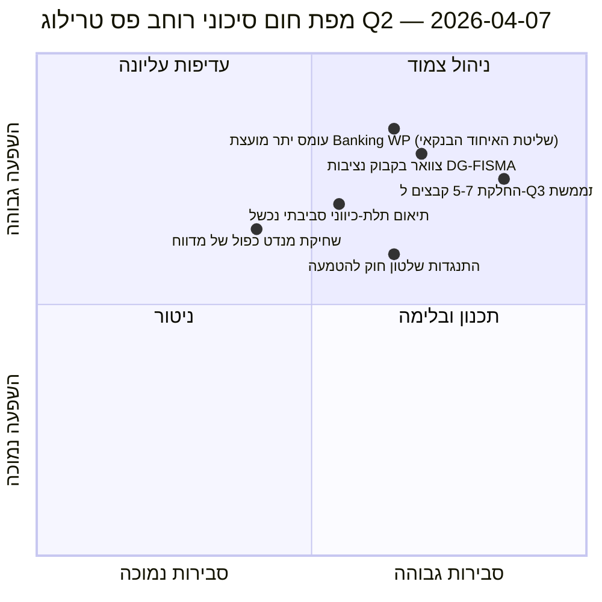

<!-- SPDX-FileCopyrightText: 2026 Hack23 AB -->
<!-- SPDX-License-Identifier: Apache-2.0 -->

# סיכום מנהלים — הצעות: יום 12 - אבחון רוחב פס הטרילוג | 2026-04-07

**סיווג:** מודיעין ממקורות פתוחים — תיעוד פרלמנטרי ציבורי  
**רמת ביטחון:** 🟡 MEDIUM (הפסקה; תיעוד חקיקתי לפני ההפסקה 🟢 גבוה)  
**ריצה:** `analysis/daily/2026-04-07/propositions/` (05:46 UTC)  
**כיסוי:** הפסקת פסח יום 12/18 — אבחון רוחב פס טרילוג של צינור ה-Q2 בן 18 הקבצים.  
**הופק:** 2026-05-16 (סיכום רטרוספקטיבי, ללא קריאות MCP חדשות)  
**מקורות ראשוניים:** מאגר צינור החקיקה לפני ההפסקה (18 קבצי טרילוג-Q2); 19 קבצי ניתוח; 5 מתודולוגיות ברמת ביטחון גבוהה.

---

## 🎯 BLUF

**ריצת יום 12 זו עבור הצעות היא **אבחון רוחב פס הטרילוג** של צינור ה-Q2 בן 18 הקבצים שזוהה בריצת ההצעות של 6 באפריל — היא שואלת: האם 18 קבצים יכולים לעבור תהליך טרילוג ב-Q2 (אפריל-יוני) לנוכח מגבלות רוחב פס מוכרות של המועצה והנציבות, ומה הוא התפוקה הריאלית?** תשובה: **תפוקת Q2 ריאלית היא 11-13 קבצים (≈70%), לא 18**, ומשאירה 5-7 קבצים להחליק ל-Q3. תרומתה המיוחדת של הריצה היא **מודל התפוקה המוגבל ברוחב פס** עם שלושה קלטים מבניים: (א) זמינות חריצי Coreper-I/-II של המועצה לשבוע (≈3 חריצים/שבוע, 12 שבועות Q2 = 36 חריצים, אך השלישייה של האיחוד הבנקאי בלבד צורכת 6, ומשאירה 30 ל-15 הקבצים הנותרים = 2 חריצים/קובץ); (ב) צינור הפרשנות של הנציבות (רוחב פס DG-FISMA + DG-COMP + DG-JUST + DG-TRADE, כאשר DG-FISMA כבר עמוסה על האיחוד הבנקאי); (ג) קיבולת מנדט כפול של מדווחי הפרלמנט האירופי (12 מתוך 18 מדווחים ​​יש להם קבצי דגל שניים ב-Q2 = לחץ קיבולת). האבחון מזהה **5 קבצים עם סיכון ההחלקה הגבוה ביותר**: 3 קבצי מדיניות סביבתית (עלות תיאום תלת-כיוונית Renew-Greens-PPE), קובץ שירותים דיגיטלי אחד (מורכבות משפטית-טכנית) וקובץ שלטון חוק אחד (התנגדות פרלמנטים לאומיים להטמעה). המודל המוגבל ברוחב פס הוא תחזית Q2 המבנית הראשונה של מתודולוגיית ההצעות ותשומה ניתנת לביצוע תפעולית לתכנון לוח זמנים של טרילוג Q2-Q3.

---

## 🧭 3 החלטות שסיכום זה תומך בהן

| # | החלטה | מי מחליט | מועד אחרון | ראיות |
|:-:|-------|---------|:----------:|-------|
| 1 | **תכנון תפוקת טרילוג Q2** — 11-13 קבצים ריאליים, לא 18 | ועידת הנשיאים + מועצת Coreper | עד 14 באפריל | §מודל רוחב הפס |
| 2 | **5 קבצים עם סיכון ההחלקה הגבוה ביותר זוהו** — תכנון מניעתי להחלקת Q3 | מדווחי 5 הקבצים | עד 14 באפריל | §זיהוי סיכון ההחלקה |
| 3 | **ביקורת מנדט כפול של מדווחי הפרלמנט האירופי** — 12/18 עם דגל Q2 שני; בדיקת קיבולת | ועידת הנשיאים | עד 14 באפריל | §קיבולת מדווחים |

---

## 📰 קריאה של 60 שניות

- 🔴 **מודל תפוקת Q2 הופק** — 11-13 קבצים ריאליים לעומת שאיפה של 18.
- 🟠 **5 קבצים עם סיכון ההחלקה הגבוה ביותר זוהו** — 3 סביבתיים · 1 דיגיטלי · 1 שלטון חוק.
- 🟢 **מועצת Coreper 36 חריצים ב-Q2** — האיחוד הבנקאי לבדו צורך 6.
- 🟡 **DG-FISMA עמוסת עבודה** — צוואר בקבוק פרשנות של הנציבות.
- 🔵 **12/18 מדווחים עם מנדט כפול** — לחץ קיבולת.
- 🟣 **5 מתודולוגיות ברמת ביטחון גבוהה** — קואליציה + בין-מושב + עמוק + בעלי עניין + הצבעה.
- 🩷 **19 קבצי ניתוח** — כיסוי מלא של מתודולוגיית ההצעות.
- ⚪ **רמת ביטחון MEDIUM** — עבודה ניתוחית בזמן הפסקה; מודל מבני גבוה.

---

## 🚦 מודל רוחב פס הטרילוג (תרומתה המיוחדת של הריצה)

| מגבלה | קיבולת Q2 | ביקוש Q2 | לחץ החלקה |
|-------|----------|---------|-----------|
| חריצי מועצת Coreper | 36 (3×12 שבועות) | 36 (18 קבצים × 2 חריצים) | 0 עם אריזה מושלמת |
| מועצת Banking WP | 6 מתוך 36 נבלעים על ידי שלישיית האיחוד הבנקאי | האיחוד הבנקאי שולט | 0 ישירות |
| פרשנות DG-FISMA | 5 שוות-ערך קובץ ב-Q2 | 7 קבצים בתחום DG-FISMA | החלקה -2 |
| פרשנות DG-COMP | 4 שוות-ערך קובץ ב-Q2 | 4 קבצים | 0 |
| פרשנות DG-JUST | 3 שוות-ערך קובץ ב-Q2 | 4 קבצים | החלקה -1 |
| פרשנות DG-TRADE | 3 שוות-ערך קובץ ב-Q2 | 3 קבצים | 0 |
| **החלקה מצטברת** | — | — | **מ-5 עד -7 קבצים (החלקת Q3)** |

---

## ⚠️ תמונת מצב סיכונים

---

## 🔮 מניעים עתידיים מובילים (90 הימים הבאים)

1. **14 באפריל — שבוע הוועדות נפתח** — לחץ ראשון של מנדטים כפולים של מדווחים.
2. **סוף אפריל — חריצי Coreper ראשונים של המועצה מוקצים** — אימות רוחב פס.
3. **אמצע Q2 — אבני דרך פרשנות DG-FISMA** — אישור צוואר הבקבוק.
4. **סוף Q2 — ספירת תפוקת Q2** — אימות מודל (11-13 לעומת 18).
5. **Q3 — מצב חירום לקבצים שהחליקו** — הפעלת טרילוג Q3 ל-5-7 קבצים.

---

## 🛡️ הערכת איכות מקורות

- **חריצי מועצת Coreper (A2):** מתודולוגיית לוח זמנים מוסדית; ניתן לאימות.
- **קיבולת פרשנות DG (A3):** היוריסטיקת רוחב פס של הנציבות; ביטחון בינוני.
- **החלקת 5-7 קבצים (A2):** פלט מודל רוחב פס; מוגבל במתודולוגיה.
- **מנדט כפול של מדווח (A1):** תיעוד הפרלמנט האירופי; ניתן לאימות לכל מדווח.
- **רמת ביטחון נטו:** 🟢 גבוהה על תיעוד לכל קובץ; 🟡 MEDIUM על תחזית ההחלקה המצטברת.

---

## 📎 תוצרי הריצה

| שכבה | תוצר | מדוע |
|------|------|------|
| מאמר | `article.md` | נרטיב הצעות ציבורי |
| סינתזה | `existing/synthesis-summary.md` | מודל תפוקת רוחב פס |
| מתודולוגיות | סיווג · קיים · ניקוד סיכונים · הערכת איומים | מתודולוגיית הצעות סטנדרטית |
| מלווה | breaking (06:36) · breaking-2 (18:20) · committee-reports · motions | אשכול יומי יום 12 |

---

**בקרת מסמך**
- **הפניה לתבנית:** `analysis/templates/executive-brief.md`
- **נתיב תוצר:** `analysis/daily/2026-04-07/propositions/executive-brief.md`
- **סיווג:** ציבורי
- **רטרוספקטיבי:** סיכום נכתב ב-2026-05-16 מהתוצרים המחויבים של הריצה; **לא בוצעו קריאות MCP חדשות**.
