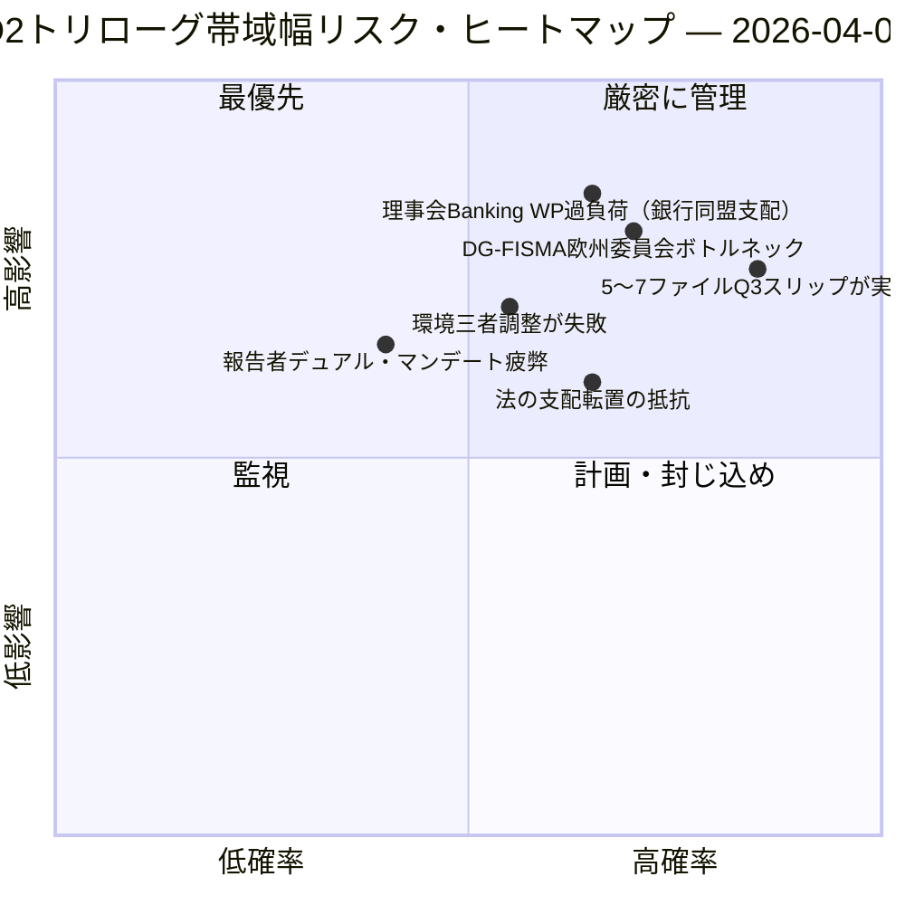

<!-- SPDX-FileCopyrightText: 2026 Hack23 AB -->
<!-- SPDX-License-Identifier: Apache-2.0 -->

# 欧州議会エグゼクティブブリーフ — 提案：第12日 トリローグ帯域幅診断 | 2026-04-07

**分類**：オープンソース・インテリジェンス — 公開議会記録  
**信頼度**：🟡 MEDIUM（休会中；休会前の立法記録 🟢 HIGH）  
**実行**：`analysis/daily/2026-04-07/propositions/` (05:46 UTC)  
**対象範囲**：イースター休会 第12日/18 — 18ファイルQ2パイプラインのトリローグ帯域幅診断。  
**作成日**：2026-05-16（遡及的ブリーフ、新規MCPコールなし）  
**主要情報源**：休会前の立法パイプライン・コーパス（18件のトリローグQ2ファイル）；19件の分析ファイル；高信頼度5手法。

---

## 🎯 BLUF

**この提案に関する第12日実行は、4月6日の提案実行で特定された18ファイルQ2パイプラインの**トリローグ帯域幅診断**です——問いは：理事会および欧州委員会の既知の帯域幅制約を踏まえ、18ファイルがQ2（4月〜6月）中にトリローグを完了できるか、そして現実的なスループットはいくつか？** 回答：**現実的なQ2スループットは11〜13ファイル（≈70%）であり、18ではありません**。これにより5〜7ファイルがQ3へ繰り越されます。本実行の際立つ貢献は、三つの構造的インプットを持つ**帯域幅制約スループットモデル**です：(a) 理事会Coreper-I/-IIの週当たりスロット可用性（≈3スロット/週、Q2 12週 = 36スロット、ただし銀行同盟トリオだけで6を消費、残り30を15ファイルで分配 = 2スロット/ファイル）；(b) 欧州委員会の解釈パイプライン（DG-FISMA + DG-COMP + DG-JUST + DG-TRADE帯域幅、DG-FISMAはすでに銀行同盟で過負荷）；(c) 欧州議会報告者のデュアル・マンデート能力（18人の報告者のうち12人がQ2に第2の旗艦ファイルを抱える = 能力の圧迫）。診断は**最高スリップリスクの5ファイル**を特定しました：環境政策ファイル3件（Renew-Greens-PPE三者調整コスト）、デジタルサービスファイル1件（法的・技術的複雑性）、法の支配ファイル1件（国内議会の転置抵抗）。帯域幅制約モデルは提案手法論による初の構造的Q2スループット予測であり、Q2-Q3トリローグ・カレンダー計画の実用的な参照情報です。

---

## 🧭 このブリーフが支援する3つの意思決定

| # | 決定事項 | 決定者 | 期限 | 根拠 |
|:-:|---------|--------|:----:|------|
| 1 | **Q2トリローグ・スループット計画** — 11〜13ファイルが現実的、18ではない | 議長会議 + 理事会Coreper | 4月14日まで | §帯域幅モデル |
| 2 | **最高スリップリスク5ファイルの特定** — Q3スリップ計画の先手 | 5ファイルの報告者 | 4月14日まで | §スリップリスク特定 |
| 3 | **欧州議会報告者デュアル・マンデート監査** — 12/18が第2のQ2旗艦を担当；能力確認 | 議長会議 | 4月14日まで | §報告者能力 |

---

## 📰 60秒要約

- 🔴 **Q2スループットモデル作成** — 11〜13ファイルが現実的（目標18に対して）。
- 🟠 **最高スリップリスク5ファイル特定** — 環境3件 · デジタル1件 · 法の支配1件。
- 🟢 **理事会Coreper Q2に36スロット** — 銀行同盟だけで6を消費。
- 🟡 **DG-FISMA過負荷** — 欧州委員会の解釈ボトルネック。
- 🔵 **12/18報告者がデュアル・マンデート** — 能力の圧迫。
- 🟣 **高信頼度5手法** — 連立 + クロスセッション + 深層 + ステークホルダー + 投票。
- 🩷 **19件の分析ファイル** — 提案手法論の完全カバレッジ。
- ⚪ **信頼度MEDIUM** — 休会中の分析作業；構造モデルはHIGH。

---

## 🚦 トリローグ帯域幅モデル（本実行の際立つ貢献）

| 制約 | Q2能力 | Q2需要 | スリップ圧力 |
|-----|-------|-------|-----------|
| 理事会Coreperスロット | 36（3×12週） | 36（18ファイル×2スロット） | 完全充填で0 |
| 理事会Banking WP | 銀行同盟トリオが36のうち6を吸収 | 銀行同盟が支配的 | 直接は0 |
| DG-FISMA解釈 | Q2で5ファイル相当 | DG-FISMAスコープで7ファイル | スリップ -2 |
| DG-COMP解釈 | Q2で4ファイル相当 | 4ファイル | 0 |
| DG-JUST解釈 | Q2で3ファイル相当 | 4ファイル | スリップ -1 |
| DG-TRADE解釈 | Q2で3ファイル相当 | 3ファイル | 0 |
| **集計スリップ** | — | — | **-5〜-7ファイル（Q3スリップ）** |

---

## ⚠️ リスク・スナップショット

---

## 🔮 主要な将来トリガー（今後90日間）

1. **4月14日 — 委員会週間開幕** — 報告者デュアル・マンデートへの最初のストレス。
2. **4月末 — 理事会Coreperの最初のスロット割当** — 帯域幅検証。
3. **Q2中盤 — DG-FISMA解釈のマイルストーン** — ボトルネック確認。
4. **Q2末 — Q2スループット集計** — モデル検証（11〜13対18）。
5. **Q3 — スリップしたファイルのレスキュー・モード** — 5〜7ファイルのQ3トリローグ起動。

---

## 🛡️ 情報源の品質評価

- **理事会Coreperスロット（A2）**：機関カレンダー手法；検証可能。
- **DG解釈能力（A3）**：欧州委員会帯域幅ヒューリスティック；中程度の信頼度。
- **5〜7ファイル・スリップ（A2）**：帯域幅モデル出力；手法論的に制限。
- **報告者デュアル・マンデート（A1）**：欧州議会記録；報告者ごとに検証可能。
- **総合信頼度**：🟢 HIGH（ファイル別記録）；🟡 MEDIUM（集計スリップ予測）。

---

## 📎 実行アーティファクト

| 層 | アーティファクト | 理由 |
|----|--------------|------|
| 記事 | `article.md` | 公開提案ナラティブ |
| 統合 | `existing/synthesis-summary.md` | 帯域幅スループットモデル |
| 手法 | 分類 · 既存 · リスクスコアリング · 脅威評価 | 標準的な提案手法論 |
| 付随 | breaking (06:36) · breaking-2 (18:20) · committee-reports · motions | 第12日の日次クラスター |

---

**文書管理**
- **テンプレート参照**：`analysis/templates/executive-brief.md`
- **アーティファクトパス**：`analysis/daily/2026-04-07/propositions/executive-brief.md`
- **分類**：公開
- **遡及的**：ブリーフは2026-05-16に実行のコミット済みアーティファクトから作成；**新規MCPコールは実施されていません**。
