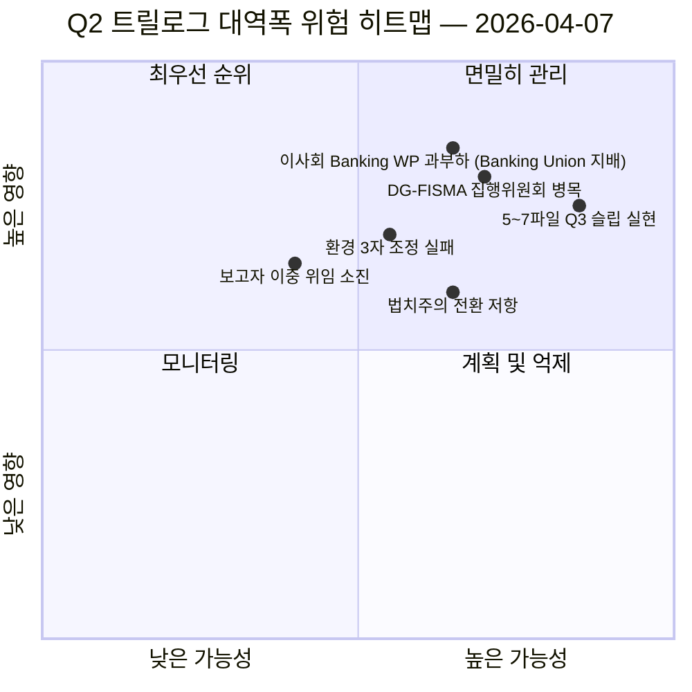

<!-- SPDX-FileCopyrightText: 2026 Hack23 AB -->
<!-- SPDX-License-Identifier: Apache-2.0 -->

# 유럽의회 집행 브리핑 — 제안: 12일차 트릴로그 대역폭 진단 | 2026-04-07

**분류**: 오픈소스 정보 — 공개 의회 기록  
**신뢰도**: 🟡 MEDIUM (휴회 중; 휴회 전 입법 기록 🟢 높음)  
**실행**: `analysis/daily/2026-04-07/propositions/` (05:46 UTC)  
**대상 범위**: 부활절 휴회 12일차/18 — 18개 파일 Q2 파이프라인의 트릴로그 대역폭 진단.  
**작성일**: 2026-05-16 (소급 브리핑, 새 MCP 호출 없음)  
**주요 출처**: 휴회 전 입법 파이프라인 코퍼스 (18개 트릴로그-Q2 파일); 19개 분석 파일; 5개 고신뢰도 방법론.

---

## 🎯 BLUF

**제안 12일차 실행은 4월 6일 제안 실행에서 확인된 18개 파일 Q2 파이프라인에 대한 **트릴로그 대역폭 진단**입니다. 핵심 질문: 이사회와 집행위원회의 알려진 대역폭 제약을 감안할 때 18개 파일이 Q2(4월~6월) 내에 트릴로그를 완료할 수 있는가, 그리고 현실적인 처리량은 얼마인가?** 답변: **현실적인 Q2 처리량은 11~13개 파일(≈70%)이며, 18개가 아닙니다**. 이에 따라 5~7개 파일이 Q3로 이월됩니다. 이번 실행의 특별한 기여는 세 가지 구조적 입력을 갖춘 **대역폭 제약 처리량 모델**입니다: (가) 이사회 Coreper-I/-II의 주당 슬롯 가용성(≈3슬롯/주, Q2 12주 = 36슬롯, 단 Banking Union 트리오 단독으로 6개 소비, 나머지 15개 파일에 30개 배정 = 2슬롯/파일); (나) 집행위원회 해석 파이프라인(DG-FISMA + DG-COMP + DG-JUST + DG-TRADE 대역폭, DG-FISMA는 이미 Banking Union으로 과부하); (다) 유럽의회 보고자의 이중 위임 수행 능력(18명 보고자 중 12명이 Q2에 두 번째 플래그십 파일 보유 = 역량 압박). 진단은 **슬립 위험이 가장 높은 5개 파일**을 특정합니다: 환경 정책 파일 3개(Renew-Greens-PPE 3자 조정 비용), 디지털 서비스 파일 1개(법적·기술적 복잡성), 법치주의 파일 1개(국내 의회의 전환 저항). 대역폭 제약 모델은 제안 방법론의 첫 구조적 Q2 처리량 예측이자 Q2-Q3 트릴로그 일정 계획에 실용적으로 활용 가능한 입력 자료입니다.

---

## 🧭 이 브리핑이 지원하는 3개 결정사항

| # | 결정 | 결정자 | 기한 | 근거 |
|:-:|------|--------|:----:|------|
| 1 | **Q2 트릴로그 처리량 계획** — 11~13개 파일이 현실적, 18개 아님 | 의장 회의 + 이사회 Coreper | 4월 14일까지 | §대역폭 모델 |
| 2 | **슬립 위험 최고 5개 파일 특정** — Q3 슬립 계획의 선제적 수립 | 5개 파일 보고자 | 4월 14일까지 | §슬립 위험 파악 |
| 3 | **유럽의회 보고자 이중 위임 감사** — 12/18명이 Q2 두 번째 플래그십 보유; 역량 점검 | 의장 회의 | 4월 14일까지 | §보고자 역량 |

---

## 📰 60초 요약

- 🔴 **Q2 처리량 모델 완성** — 11~13개 파일이 현실적 (목표 18개 대비).
- 🟠 **슬립 위험 최고 5개 파일 특정** — 환경 3개 · 디지털 1개 · 법치주의 1개.
- 🟢 **이사회 Coreper Q2 36슬롯** — Banking Union 단독으로 6개 소비.
- 🟡 **DG-FISMA 과부하** — 집행위원회 해석 병목.
- 🔵 **12/18명 보고자가 이중 위임** — 역량 압박.
- 🟣 **고신뢰도 방법론 5개** — 연립 + 교차 세션 + 심층 + 이해관계자 + 투표.
- 🩷 **19개 분석 파일** — 제안 방법론 완전 커버리지.
- ⚪ **신뢰도 MEDIUM** — 휴회 중 분석 작업; 구조 모델은 높음.

---

## 🚦 트릴로그 대역폭 모델 (이번 실행의 특별 기여)

| 제약 조건 | Q2 용량 | Q2 수요 | 슬립 압력 |
|---------|--------|--------|---------|
| 이사회 Coreper 슬롯 | 36 (3×12주) | 36 (18파일×2슬롯) | 완벽 배분 시 0 |
| 이사회 Banking WP | Banking Union 트리오가 36 중 6 흡수 | Banking Union 지배 | 직접적으로 0 |
| DG-FISMA 해석 | Q2 5파일 상당 | DG-FISMA 범위 7파일 | 슬립 -2 |
| DG-COMP 해석 | Q2 4파일 상당 | 4파일 | 0 |
| DG-JUST 해석 | Q2 3파일 상당 | 4파일 | 슬립 -1 |
| DG-TRADE 해석 | Q2 3파일 상당 | 3파일 | 0 |
| **집계 슬립** | — | — | **-5~-7파일 (Q3 슬립)** |

---

## ⚠️ 위험 스냅샷

---

## 🔮 주요 미래 트리거 (향후 90일)

1. **4월 14일 — 위원회 주간 개막** — 보고자 이중 위임의 첫 번째 압박.
2. **4월 말 — 이사회 Coreper 첫 슬롯 배정** — 대역폭 검증.
3. **Q2 중반 — DG-FISMA 해석 이정표** — 병목 확인.
4. **Q2 말 — Q2 처리량 집계** — 모델 검증 (11~13 대 18).
5. **Q3 — 슬립 파일 구조 모드** — 5~7파일 Q3 트릴로그 활성화.

---

## 🛡️ 출처 품질 평가

- **이사회 Coreper 슬롯 (A2)**: 기관 달력 방법론; 검증 가능.
- **DG 해석 역량 (A3)**: 집행위원회 대역폭 휴리스틱; 중간 신뢰도.
- **5~7파일 슬립 (A2)**: 대역폭 모델 산출물; 방법론으로 한정.
- **보고자 이중 위임 (A1)**: 유럽의회 기록; 보고자별 검증 가능.
- **종합 신뢰도**: 🟢 높음 (파일별 기록); 🟡 MEDIUM (집계 슬립 예측).

---

## 📎 실행 산출물

| 계층 | 산출물 | 이유 |
|------|--------|------|
| 기사 | `article.md` | 공개 제안 서술 |
| 종합 | `existing/synthesis-summary.md` | 대역폭 처리량 모델 |
| 방법론 | 분류 · 기존 · 위험 점수화 · 위협 평가 | 표준 제안 방법론 |
| 동반 | breaking (06:36) · breaking-2 (18:20) · committee-reports · motions | 12일차 일일 클러스터 |

---

**문서 통제**
- **템플릿 참조**: `analysis/templates/executive-brief.md`
- **산출물 경로**: `analysis/daily/2026-04-07/propositions/executive-brief.md`
- **분류**: 공개
- **소급적**: 브리핑은 실행의 커밋된 산출물로부터 2026-05-16에 작성됨; **새 MCP 호출 없음**.
