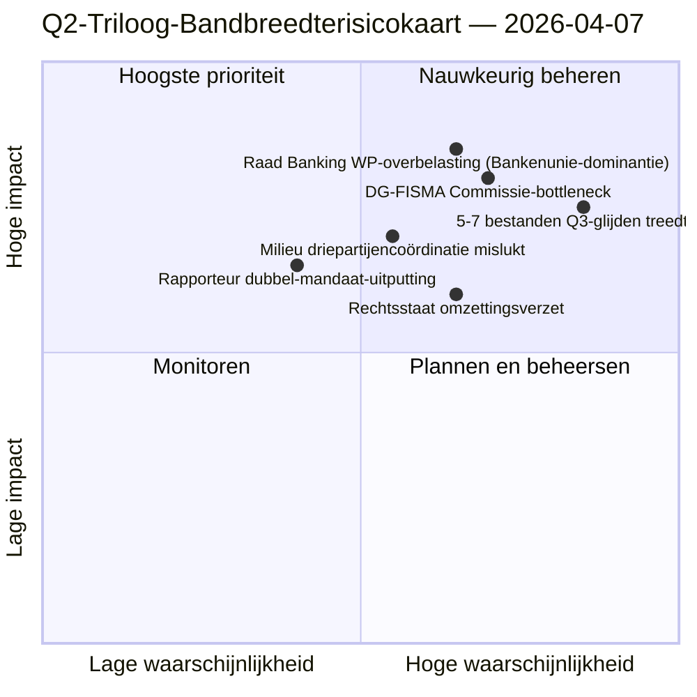

<!-- SPDX-FileCopyrightText: 2026 Hack23 AB -->
<!-- SPDX-License-Identifier: Apache-2.0 -->

# Uitvoerend Briefingdocument — Voorstellen: Dag-12 Triloog-Bandbreedtediagnostiek | 2026-04-07

**Classificatie:** OSINT — Openbaar parlementair dossier  
**Betrouwbaarheid:** 🟡 MEDIUM (reces; wetgevende dossiers voor het reces 🟢 HOOG)  
**Uitvoering:** `analysis/daily/2026-04-07/propositions/` (05:46 UTC)  
**Dekking:** Paasreces Dag 12/18 — triloog-bandbreedtediagnostiek van de 18-bestanden-Q2-pijplijn.  
**Gegenereerd:** 2026-05-16 (retrospectief briefingdocument, geen nieuwe MCP-aanroepen)  
**Primaire bronnen:** Wetgevingspijplijn-corpus voor het reces (18 triloog-Q2-bestanden); 19 analysebestanden; 5 methodologieën met hoge betrouwbaarheid.

---

## 🎯 BLUF

**Deze Dag-12-uitvoering voor voorstellen is de **triloog-bandbreedtediagnostiek** van de 18-bestanden-Q2-pijplijn die in de voorstellen-uitvoering van 6 april is geïdentificeerd — zij vraagt: kunnen 18 bestanden in Q2 (april-juni) een triloog doorlopen gegeven de bekende bandbreedtebeperkingen van de Raad en de Commissie, en wat is de realistische doorvoer?** Antwoord: **de realistische Q2-doorvoer is 11-13 bestanden (≈70 %), niet 18**, waardoor 5-7 bestanden naar Q3 schuiven. De onderscheidende bijdrage van de uitvoering is het **door bandbreedte beperkte doorvoermodel** met drie structurele inputs: (a) beschikbaarheid van slots van de Raad Coreper-I/-II per week (≈3 slots/week, 12 weken Q2 = 36 slots, maar het Banking Union-trio verbruikt er alleen al 6, waardoor 30 overblijven voor de resterende 15 bestanden = 2 slots/bestand); (b) interpretatiepijplijn van de Commissie (bandbreedte DG-FISMA + DG-COMP + DG-JUST + DG-TRADE, waarbij DG-FISMA al overbelast is voor de Bankenunie); (c) dubbel-mandaatcapaciteit van EP-rapporteurs (12 van de 18 rapporteurs hebben tweede vlaggenschipbestanden in Q2 = capaciteitsdruk). De diagnostiek identificeert **5 bestanden met het hoogste glijdrisico**: 3 milieubeleidbestanden (Renew-Greens-PPE driepartijencoördinatiekosten), 1 digitale-dienstenbestand (juridisch-technische complexiteit) en 1 rechtsstaatsbestand (verzet van nationale parlementen tegen omzetting). Het door bandbreedte beperkte model is de eerste structurele Q2-doorvoerprognose van de voorstellenmethodologie en een operationeel bruikbare input voor de triloog-kalenderplanning voor Q2-Q3.

---

## 🧭 3 Beslissingen Die Dit Briefingdocument Ondersteunt

| # | Beslissing | Wie beslist | Deadline | Bewijs |
|:-:|------------|-------------|:--------:|--------|
| 1 | **Q2-triloog-doorvoerplanning** — 11-13 bestanden realistisch, niet 18 | Conferentie van voorzitters + Raad Coreper | vóór 14 april | §Bandbreedtemodel |
| 2 | **5 bestanden met hoogste glijdrisico geïdentificeerd** — preventieve Q3-glijdplanning | Rapporteurs van de 5 bestanden | vóór 14 april | §Glijdrisicoidentificatie |
| 3 | **Audit dubbel mandaat EP-rapporteurs** — 12/18 met tweede Q2-vlaggenschip; capaciteitscontrole | Conferentie van voorzitters | vóór 14 april | §Rapporteurscapaciteit |

---

## 📰 Lezing van 60 Seconden

- 🔴 **Q2-doorvoermodel geproduceerd** — 11-13 bestanden realistisch tegenover 18 ambitie.
- 🟠 **5 bestanden met hoogste glijdrisico geïdentificeerd** — 3 milieu · 1 digitaal · 1 rechtsstaat.
- 🟢 **Raad Coreper 36 slots Q2** — Bankenunie alleen verbruikt er 6.
- 🟡 **DG-FISMA overbelast** — interpretatiebottleneck van de Commissie.
- 🔵 **12/18 rapporteurs dubbel gemandateerd** — capaciteitsdruk.
- 🟣 **5 methodologieën met hoge betrouwbaarheid** — coalitie + dwarsessie + diep + stakeholder + stemming.
- 🩷 **19 analysebestanden** — volledige dekking van de voorstellenmethodologie.
- ⚪ **Betrouwbaarheid MEDIUM** — analytisch werk tijdens het reces; structuurmodel HOOG.

---

## 🚦 Triloog-Bandbreedtemodel (onderscheidende bijdrage van de uitvoering)

| Beperking | Q2-capaciteit | Q2-vraag | Glijddruk |
|----------|-------------|---------|-----------|
| Raad Coreper-slots | 36 (3×12 weken) | 36 (18 bestanden × 2 slots) | 0 bij perfecte verdeling |
| Raad Banking WP | 6 van 36 geabsorbeerd door Banking Union-trio | Bankenunie dominant | 0 direct |
| DG-FISMA-interpretatie | 5 bestandsequivalenten Q2 | 7 bestanden in DG-FISMA-scope | -2 glijden |
| DG-COMP-interpretatie | 4 bestandsequivalenten Q2 | 4 bestanden | 0 |
| DG-JUST-interpretatie | 3 bestandsequivalenten Q2 | 4 bestanden | -1 glijden |
| DG-TRADE-interpretatie | 3 bestandsequivalenten Q2 | 3 bestanden | 0 |
| **Geaggregeerd glijden** | — | — | **-5 tot -7 bestanden (Q3-glijden)** |

---

## ⚠️ Risicooverzicht

---

## 🔮 Belangrijkste Toekomstige Triggers (komende 90 dagen)

1. **14 april — Commissieweek opent** — eerste stress van dubbele mandaten rapporteurs.
2. **Eind april — eerste Raad Coreper-slots toegewezen** — bandbreedtevalidering.
3. **Midden Q2 — DG-FISMA-interpretatiemijlpalen** — bottleneckbevestiging.
4. **Eind Q2 — Q2-doorvoertelling** — modelvalidering (11-13 versus 18).
5. **Q3 — reddingsmodus voor gegleden bestanden** — activering Q3-triloog voor 5-7 bestanden.

---

## 🛡️ Kwaliteitsbeoordeling van Bronnen

- **Raad Coreper-slots (A2):** institutionele kalendermethodologie; verifieerbaar.
- **DG-interpretatiecapaciteit (A3):** Commissie-bandbreedteheuristiek; gemiddelde betrouwbaarheid.
- **5-7 bestanden glijden (A2):** bandbreedtemodel-output; methodologisch begrensd.
- **Rapporteur dubbel mandaat (A1):** EP-dossiers; verifieerbaar per rapporteur.
- **Netto-betrouwbaarheid:** 🟢 HOOG op per-bestands-dossiers; 🟡 MEDIUM op geaggregeerde glijdprognose.

---

## 📎 Uitvoeringsartefacten

| Laag | Artefact | Waarom |
|------|----------|--------|
| Artikel | `article.md` | Openbaar voorstellennarratief |
| Synthese | `existing/synthesis-summary.md` | Bandbreedte-doorvoermodel |
| Methoden | classificatie · bestaand · risicoscoring · dreigingsbeoordeling | Standaard voorstellenmethodologie |
| Begeleider | breaking (06:36) · breaking-2 (18:20) · committee-reports · motions | Dag-12 dagelijks cluster |

---

**Documentbeheer**
- **Sjabloonreferentie:** `analysis/templates/executive-brief.md`
- **Artefactpad:** `analysis/daily/2026-04-07/propositions/executive-brief.md`
- **Classificatie:** Openbaar
- **Retrospectief:** Briefingdocument opgesteld op 2026-05-16 vanuit de gecommittede artefacten van de uitvoering; **er zijn geen nieuwe MCP-aanroepen gedaan**.
