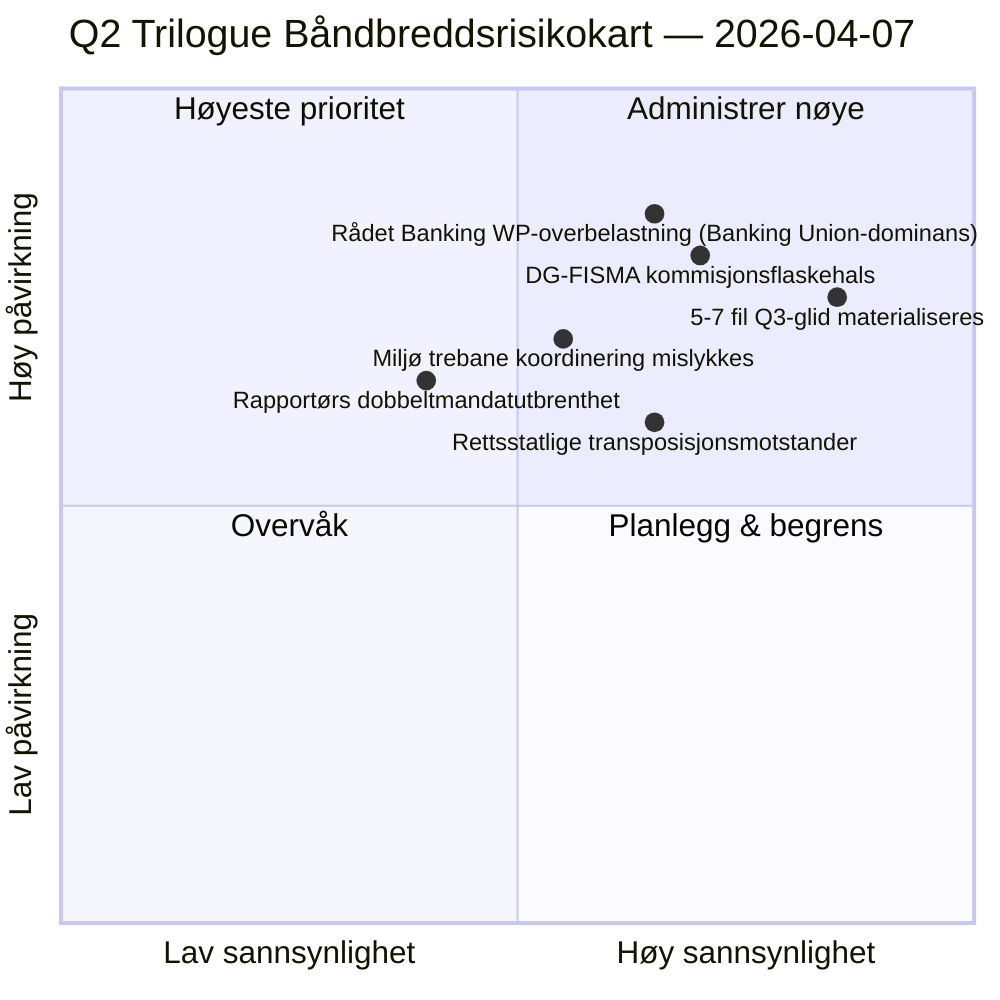

<!-- SPDX-FileCopyrightText: 2026 Hack23 AB -->
<!-- SPDX-License-Identifier: Apache-2.0 -->

# Ledersammendrag — Forslag: Dag-12 Trilogue-Båndbreddsdiagnostikk | 2026-04-07

**Klassifisering:** OSINT — Offentlig parlamentarisk dokumentasjon  
**Konfidens:** 🟡 MEDIUM (ferie; lovgivningsmessige dokumenter før ferie 🟢 HØY)  
**Kjøring:** `analysis/daily/2026-04-07/propositions/` (05:46 UTC)  
**Dekning:** Påskeferie Dag 12/18 — trilogue-båndbreddsdiagnostikk av 18-fils Q2-pipeline.  
**Generert:** 2026-05-16 (retrospektivt sammendrag, ingen nye MCP-kall)  
**Primære kilder:** Lovgivnings-pipeline-korpus før ferie (18 trilogue-Q2-filer); 19 analysefiler; 5 høykonfidensmetoder.

---

## 🎯 BLUF

**Denne Dag-12-kjøringen for forslag er **trilogue-båndbreddsdiagnostikken** av den 18-fils Q2-pipelinen identifisert i forslagskjøringen 6. april — den spør: kan 18 filer trilogue i Q2 (april-juni) gitt kjente råds- og kommisjonsbåndbreddsbegrensninger, og hva er den realistiske gjennomstrømningen?** Svar: **realistisk Q2-gjennomstrømning er 11-13 filer (≈70 %), ikke 18**, noe som etterlater 5-7 filer til å gli til Q3. Kjøringens fremtredende bidrag er den **båndbreddsbegrensede gjennomstrømningsmodellen** med tre strukturelle innganger: (a) Rådet Coreper-I/-II per-uke plassitilgjengelighet (≈3 plasser/uke, 12 uker Q2 = 36 plasser, men Banking Union-tripelen alene forbruker 6, etterlater 30 for de resterende 15 filene = 2 plasser/fil); (b) Kommisjonens tolkningspipeline (DG-FISMA + DG-COMP + DG-JUST + DG-TRADE båndbredde, med DG-FISMA allerede overforpliktet på Banking Union); (c) EP-rapportørers dobbeltmandatkapasitet (12 av 18 rapportører har andre flaggskipsfiler i Q2 = kapasitetsbelastning). Diagnostikken identifiserer **5 filer med høyest glidrisiko**: 3 miljøpolitiske filer (Renew-Greens-PPE trebane koordineringskostnad), 1 digital-tjenester-fil (juridisk-teknisk kompleksitet) og 1 retssstatsfil (nasjonale parlamenters transposisjonsmotstander). Den båndbreddsbegrensede modellen er forslagsmetodologiens første strukturelle Q2-gjennomstrømningsprognoser og et operasjonelt handlingsorientert Q2-Q3-triloguekalenderplanleggingsinput.

---

## 🧭 3 Beslutninger Denne Briefingen Støtter

| # | Beslutning | Hvem beslutter | Frist | Bevis |
|:-:|------------|----------------|:-----:|-------|
| 1 | **Q2 trilogue-gjennomstrømningsplanlegging** — 11-13 filer realistiske, ikke 18 | Konferansen for presidenter + Rådet Coreper | innen 14. april | §Båndbreddemodell |
| 2 | **5 filer med høyest glidrisiko identifisert** — Q3-glidplanlegging forebyggende | Rapportører for 5 filer | innen 14. april | §Glidrisikoidentifisering |
| 3 | **EP-rapportørers dobbeltmandatsrevisjon** — 12/18 med andre Q2-flaggskip; kapasitetskontroll | Konferansen for presidenter | innen 14. april | §Rapportørkapasitet |

---

## 📰 60-Sekunders Lesing

- 🔴 **Q2-gjennomstrømningsmodell produsert** — 11-13 filer realistiske mot 18 ambisjoner.
- 🟠 **5 filer med høyest glidrisiko identifisert** — 3 miljø · 1 digitale · 1 rettsstat.
- 🟢 **Rådet Coreper 36 plasser Q2** — Banking Union alene forbruker 6.
- 🟡 **DG-FISMA overforpliktet** — Kommisjonens tolkningsflaskehals.
- 🔵 **12/18 rapportører dobbeltmandatert** — kapasitetsbelastning.
- 🟣 **5 høykonfidensmetoder** — koalisjon + tverrsesjon + dyp + interessent + avstemning.
- 🩷 **19 analysefiler** — full forslagsmetodologidekning.
- ⚪ **Konfidens MEDIUM** — analytisk arbeid under ferie; strukturmodell HØY.

---

## 🚦 Trilogue Båndbreddemodell (kjøringens fremtredende bidrag)

| Begrensning | Q2-kapasitet | Q2-etterspørsel | Glidtrykk |
|------------|--------------|-----------------|-----------|
| Rådet Coreper-plasser | 36 (3×12 uker) | 36 (18 filer × 2 plasser) | 0 ved perfekt pakking |
| Rådet Banking WP | 6 av 36 absorbert av Banking Union-tripelen | Banking Union dominerende | 0 direkte |
| DG-FISMA-tolkning | 5 filekvivalenter Q2 | 7 filer i DG-FISMA-omfang | -2 glid |
| DG-COMP-tolkning | 4 filekvivalenter Q2 | 4 filer | 0 |
| DG-JUST-tolkning | 3 filekvivalenter Q2 | 4 filer | -1 glid |
| DG-TRADE-tolkning | 3 filekvivalenter Q2 | 3 filer | 0 |
| **Aggregert glid** | — | — | **-5 til -7 filer (Q3-glid)** |

---

## ⚠️ Risikoøyeblikksbilde

---

## 🔮 Topp Fremtidsutløsere (neste 90 dager)

1. **14. april — Komitéuke åpner** — rapportørers dobbeltmandats første stress.
2. **Slutten av april — første Rådet Coreper-plasser allokert** — båndbreddevalidering.
3. **Midt-Q2 — DG-FISMA-tolkningsmilepæler** — flaskehalsbekreftelse.
4. **Slutten av Q2 — Q2-gjennomstrømningstelling** — modellvalidering (11-13 mot 18).
5. **Q3 — redningsmodus for glidde filer** — 5-7 fil Q3-trilogue-aktivering.

---

## 🛡️ Kildekvalitetsvurdering

- **Rådet Coreper-plasser (A2):** institusjonell kalendermetodologi; verifiserbar.
- **DG-tolkningskapasitet (A3):** Kommisjonsbåndbreddeheuristikk; mellomkonfidens.
- **5-7 fil glid (A2):** båndbreddemodellutdata; metodologibegrenset.
- **Rapportørers dobbelt mandat (A1):** EP-dokumenter; verifiserbar per rapportør.
- **Nettokonfidens:** 🟢 HØY på per-fildokumenter; 🟡 MEDIUM på aggregert glidprognose.

---

## 📎 Kjøringens Artefakter

| Lag | Artefakt | Hvorfor |
|-----|----------|---------|
| Artikkel | `article.md` | Offentlig forslagsfortelling |
| Syntese | `existing/synthesis-summary.md` | Båndbredde-gjennomstrømningsmodell |
| Metoder | klassifisering · eksisterende · risikoscoring · trusselsvurdering | Standard forslagsmetodologi |
| Følgesvenn | breaking (06:36) · breaking-2 (18:20) · committee-reports · motions | Dag-12 daglig klynge |

---

**Dokumentkontroll**
- **Malmreferanse:** `analysis/templates/executive-brief.md`
- **Artefaktsti:** `analysis/daily/2026-04-07/propositions/executive-brief.md`
- **Klassifisering:** Offentlig
- **Retrospektiv:** Sammendrag skrevet 2026-05-16 fra kjøringens committede artefakter; **ingen nye MCP-kall ble gjort**.
