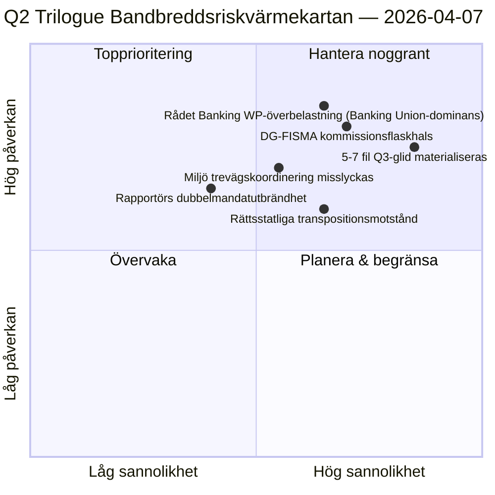

<!-- SPDX-FileCopyrightText: 2026 Hack23 AB -->
<!-- SPDX-License-Identifier: Apache-2.0 -->

# Verkställande Briefing — Propositioner: Dag-12 Trilogue-Bandbreddsdiagnostik | 2026-04-07

**Klassificering:** OSINT — Offentlig parlamentarisk handling  
**Konfidens:** 🟡 MEDIUM (raster; lagstiftningshandlingar före raster 🟢 HÖG)  
**Körning:** `analysis/daily/2026-04-07/propositions/` (05:46 UTC)  
**Täckning:** Påskraster Dag 12/18 — trilogue-bandbreddsdiagnostik av 18-fils Q2-pipeline.  
**Genererad:** 2026-05-16 (retrospektiv briefing, inga nya MCP-anrop)  
**Primära källor:** Lagstiftningspipeline-korpus före raster (18 trilogue-Q2-filer); 19 analysfiler; 5 metodologier med hög konfidens.

---

## 🎯 BLUF

**Denna Dag-12-körning för propositioner är **trilogue-bandbreddsdiagnostiken** av den 18-fils Q2-pipeline som identifierades i körningen för propositioner den 6 april — den frågar: kan 18 filer trilogue i Q2 (april-juni) med tanke på kända råds- och kommissionsbandbreddsbegränsningar, och vad är det realistiska genomflödet?** Svar: **realistiskt Q2-genomflöde är 11-13 filer (≈70 %), inte 18**, vilket lämnar 5-7 filer att glida till Q3. Körningens säregna bidrag är **bandbreddsbegränsad genomflödesmodell** med tre strukturella indata: (a) Rådet Coreper-I/-II tillgänglighet per vecka för platser (≈3 platser/vecka, 12 veckor Q2 = 36 platser, men enbart Banking Union-tripeln förbrukar 6, vilket lämnar 30 för de återstående 15 filerna = 2 platser/fil); (b) Kommissionens tolkningspipeline (DG-FISMA + DG-COMP + DG-JUST + DG-TRADE bandbredd, med DG-FISMA redan överbokad på Banking Union); (c) EP-rapportörers dubbelmandatskapacitet (12 av 18 rapportörer har andra flaggskeppsfiler i Q2 = kapacitetspåfrestning). Diagnostiken identifierar **5 filer med högst glidrisk**: 3 miljöpolitiska filer (Renew-Greens-PPE trevägskoordineringskostnad), 1 digital-tjänster-fil (juridisk-teknisk komplexitet) och 1 rättsstatsfil (nationella parlaments transpositionsmotstånd). Den bandbreddsbegränsade modellen är propositionsmetodologins första strukturella Q2-genomflödesprognoser och ett operativt handlingsorienterat Q2-Q3-trilogukalenderplaneringsinput.

---

## 🧭 3 Beslut Som Denna Briefing Stöder

| # | Beslut | Vem beslutar | Tidsfrist | Evidens |
|:-:|--------|--------------|:---------:|---------|
| 1 | **Q2 trilogue-genomflödesplanering** — 11-13 filer realistiska, inte 18 | Konferensen för ordförande + Rådet Coreper | senast 14 april | §Bandbreddsmodell |
| 2 | **5 filer med högst glidrisk identifierade** — Q3-glidplanering förebyggande | Rapportörer för 5 filer | senast 14 april | §Glidriskidentifiering |
| 3 | **EP-rapportörers dubbelmandatsrevision** — 12/18 med andra Q2-flaggskepp; kapacitetskontroll | Konferensen för ordförande | senast 14 april | §Rapportörskapacitet |

---

## 📰 60-Sekunderläsning

- 🔴 **Q2-genomflödesmodell producerad** — 11-13 filer realistiska mot 18 ambitioner.
- 🟠 **5 filer med högst glidrisk identifierade** — 3 miljö · 1 digitala · 1 rättsstat.
- 🟢 **Rådet Coreper 36 platser Q2** — Banking Union ensam förbrukar 6.
- 🟡 **DG-FISMA överbokad** — Kommissionens tolkningsflaskhals.
- 🔵 **12/18 rapportörer med dubbelt mandat** — kapacitetspåfrestning.
- 🟣 **5 metodologier med hög konfidens** — koalition + tvärsession + djup + intressent + omröstning.
- 🩷 **19 analysfiler** — full propositionsmetodologitäckning.
- ⚪ **Konfidens MEDIUM** — analytiskt arbete under raster; strukturmodell HÖG.

---

## 🚦 Trilogue Bandbreddsmodell (körningens säregna bidrag)

| Begränsning | Q2-kapacitet | Q2-efterfrågan | Glidtryck |
|------------|--------------|----------------|-----------|
| Rådet Coreper-platser | 36 (3×12 veckor) | 36 (18 filer × 2 platser) | 0 vid perfekt paketering |
| Rådets Banking WP | 6 av 36 absorberade av Banking Union-tripeln | Banking Union dominerande | 0 direkt |
| DG-FISMA-tolkning | 5 filekvivalenter Q2 | 7 filer i DG-FISMA-scope | -2 glid |
| DG-COMP-tolkning | 4 filekvivalenter Q2 | 4 filer | 0 |
| DG-JUST-tolkning | 3 filekvivalenter Q2 | 4 filer | -1 glid |
| DG-TRADE-tolkning | 3 filekvivalenter Q2 | 3 filer | 0 |
| **Aggregerat glid** | — | — | **-5 till -7 filer (Q3-glid)** |

---

## ⚠️ Riskögonblicksbild

---

## 🔮 Topp Framåtutlösare (nästa 90 dagar)

1. **14 april — Kommittéveckan öppnar** — rapportörers dubbelmandats första stress.
2. **Slutet av april — första Rådet Coreper-platser allokerade** — bandbreddsvalidering.
3. **Mid-Q2 — DG-FISMA-tolkningsmilstolpar** — flaskhalskonfirmering.
4. **Slutet av Q2 — Q2-genomflödesantal** — modellvalidering (11-13 mot 18).
5. **Q3 — räddningsläge för glidna filer** — 5-7 fil Q3-trilogue-aktivering.

---

## 🛡️ Källkvalitetsbedömning

- **Rådet Coreper-platser (A2):** institutionell kalendermetodologi; verifierbar.
- **DG-tolkningskapacitet (A3):** Kommissionsbandbreddsheuristik; medelkonfidens.
- **5-7 fil glid (A2):** bandbreddsmodellutdata; metodologibegränsad.
- **Rapportörers dubbelt mandat (A1):** EP-handlingar; verifierbar per rapportör.
- **Nettokonfiddens:** 🟢 HÖG på per-filhandlingar; 🟡 MEDIUM på aggregerad glidprognos.

---

## 📎 Körningsartefakter

| Lager | Artefakt | Varför |
|-------|----------|--------|
| Artikel | `article.md` | Offentlig propositionsberättelse |
| Syntes | `existing/synthesis-summary.md` | Bandbredd-genomflödesmodell |
| Metoder | klassificering · befintlig · riskpoängsättning · hotbedömning | Standard propositionsmetodologi |
| Följeslagare | breaking (06:36) · breaking-2 (18:20) · committee-reports · motions | Dag-12 dagligt kluster |

---

**Dokumentkontroll**
- **Mallreferens:** `analysis/templates/executive-brief.md`
- **Artefaktsökväg:** `analysis/daily/2026-04-07/propositions/executive-brief.md`
- **Klassificering:** Offentlig
- **Retrospektiv:** Briefing skriven 2026-05-16 från körningens committade artefakter; **inga nya MCP-anrop gjordes**.
