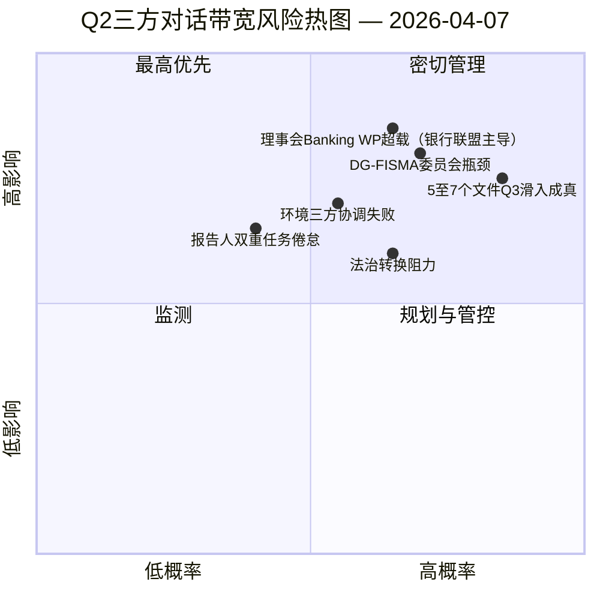

<!-- SPDX-FileCopyrightText: 2026 Hack23 AB -->
<!-- SPDX-License-Identifier: Apache-2.0 -->

# 欧洲议会执行简报 — 提案：第12天 三方对话带宽诊断 | 2026-04-07

**分类**：开源情报 — 公开议会记录  
**可信度**：🟡 MEDIUM（休会期间；休会前立法记录 🟢 高）  
**运行**：`analysis/daily/2026-04-07/propositions/` (05:46 UTC)  
**覆盖范围**：复活节休会第12天/18 — 针对18文件Q2流水线的三方对话带宽诊断。  
**生成日期**：2026-05-16（回溯性简报，无新MCP调用）  
**主要来源**：休会前立法流水线语料库（18个三方对话Q2文件）；19个分析文件；5种高可信度方法。

---

## 🎯 核心结论

**本次提案第12天运行是针对4月6日提案运行所确定的18文件Q2流水线的**三方对话带宽诊断**——核心问题是：鉴于已知的理事会与委员会带宽限制，18个文件能否在Q2（4月至6月）内完成三方对话，现实可行的处理量是多少？** 答案：**现实的Q2处理量为11至13个文件（≈70%），而非18个**，将有5至7个文件滑入Q3。本次运行的独特贡献是具有三项结构性输入的**带宽约束处理量模型**：(a) 理事会Coreper-I/-II每周可用时隙（≈3个时隙/周，Q2共12周 = 36个时隙，但银行联盟三件套单独占用6个，剩余30个分配给另外15个文件 = 每文件2个时隙）；(b) 欧盟委员会解释流水线（DG-FISMA + DG-COMP + DG-JUST + DG-TRADE带宽，DG-FISMA已因银行联盟超负荷）；(c) 欧洲议会报告人的双重任务履行能力（18名报告人中12名在Q2承担第二项旗舰文件 = 能力压力）。诊断确定了**滑入风险最高的5个文件**：3个环境政策文件（Renew-Greens-PPE三方协调成本）、1个数字服务文件（法律技术复杂性）和1个法治文件（国内议会转换阻力）。带宽约束模型是提案方法论的首个结构性Q2处理量预测，是Q2-Q3三方对话日历规划中可操作的参考依据。

---

## 🧭 本简报支持的3项决策

| # | 决策 | 决策者 | 截止日期 | 依据 |
|:-:|------|--------|:-------:|------|
| 1 | **Q2三方对话处理量规划** — 11至13个文件现实可行，非18个 | 主席团会议 + 理事会Coreper | 4月14日前 | §带宽模型 |
| 2 | **确定5个最高滑入风险文件** — Q3滑入的预防性规划 | 5个文件的报告人 | 4月14日前 | §滑入风险识别 |
| 3 | **欧洲议会报告人双重任务审计** — 12/18名报告人承担第二Q2旗舰；能力核查 | 主席团会议 | 4月14日前 | §报告人能力 |

---

## 📰 60秒速读

- 🔴 **Q2处理量模型完成** — 11至13个文件现实可行，目标为18个。
- 🟠 **确定5个最高滑入风险文件** — 3个环境 · 1个数字 · 1个法治。
- 🟢 **理事会Coreper Q2共36个时隙** — 银行联盟单独消耗6个。
- 🟡 **DG-FISMA超负荷** — 欧盟委员会解释瓶颈。
- 🔵 **12/18名报告人承担双重任务** — 能力压力。
- 🟣 **5种高可信度方法** — 联盟 + 跨届次 + 深度 + 利益相关方 + 投票。
- 🩷 **19个分析文件** — 提案方法论完整覆盖。
- ⚪ **可信度MEDIUM** — 休会期间分析工作；结构模型高。

---

## 🚦 三方对话带宽模型（本次运行的独特贡献）

| 制约因素 | Q2容量 | Q2需求 | 滑入压力 |
|--------|-------|-------|---------|
| 理事会Coreper时隙 | 36（3×12周） | 36（18文件×2时隙） | 完美分配时为0 |
| 理事会Banking WP | 银行联盟三件套占用36中的6个 | 银行联盟主导 | 直接为0 |
| DG-FISMA解释 | Q2中5个文件当量 | DG-FISMA范围内7个文件 | 滑入 -2 |
| DG-COMP解释 | Q2中4个文件当量 | 4个文件 | 0 |
| DG-JUST解释 | Q2中3个文件当量 | 4个文件 | 滑入 -1 |
| DG-TRADE解释 | Q2中3个文件当量 | 3个文件 | 0 |
| **累计滑入** | — | — | **-5至-7个文件（Q3滑入）** |

---

## ⚠️ 风险快照

---

## 🔮 主要未来触发因素（未来90天）

1. **4月14日 — 委员会周开幕** — 报告人双重任务的首次压力。
2. **4月底 — 首批理事会Coreper时隙分配** — 带宽验证。
3. **Q2中期 — DG-FISMA解释里程碑** — 瓶颈确认。
4. **Q2末 — Q2处理量统计** — 模型验证（11至13对比18）。
5. **Q3 — 滑入文件救援模式** — 5至7个文件Q3三方对话激活。

---

## 🛡️ 来源质量评估

- **理事会Coreper时隙（A2）**：机构日历方法论；可核实。
- **DG解释能力（A3）**：委员会带宽启发式；中等可信度。
- **5至7文件滑入（A2）**：带宽模型输出；受方法论限定。
- **报告人双重任务（A1）**：欧洲议会记录；可按报告人核实。
- **综合可信度**：🟢 高（逐文件记录）；🟡 MEDIUM（累计滑入预测）。

---

## 📎 运行产出物

| 层次 | 产出物 | 原因 |
|------|--------|------|
| 文章 | `article.md` | 公开提案叙述 |
| 综合 | `existing/synthesis-summary.md` | 带宽处理量模型 |
| 方法 | 分类 · 现有 · 风险评分 · 威胁评估 | 标准提案方法论 |
| 附随 | breaking (06:36) · breaking-2 (18:20) · committee-reports · motions | 第12天日常集群 |

---

**文档管理**
- **模板参考**：`analysis/templates/executive-brief.md`
- **产出物路径**：`analysis/daily/2026-04-07/propositions/executive-brief.md`
- **分类**：公开
- **回溯性**：简报于2026-05-16依据运行的已提交产出物撰写；**未进行任何新的MCP调用**。
