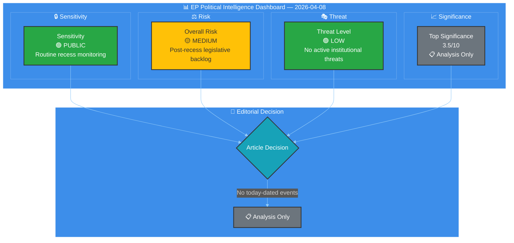
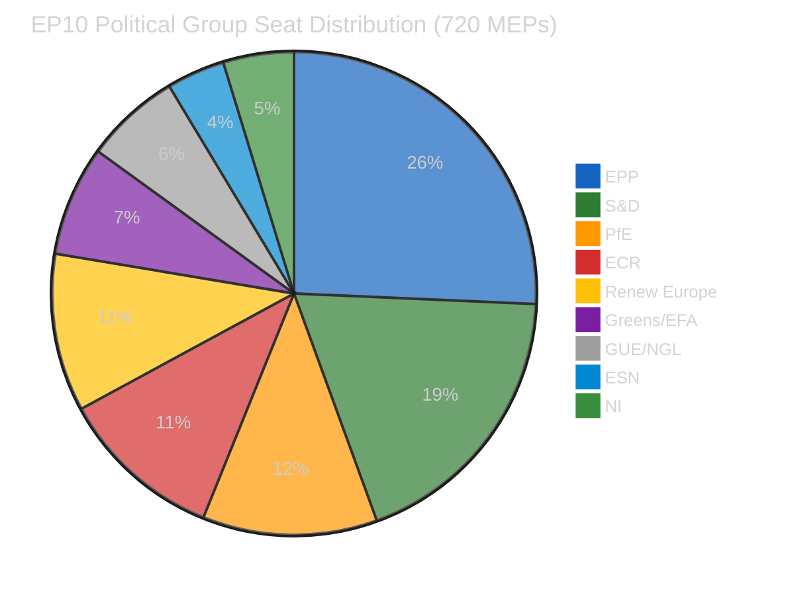
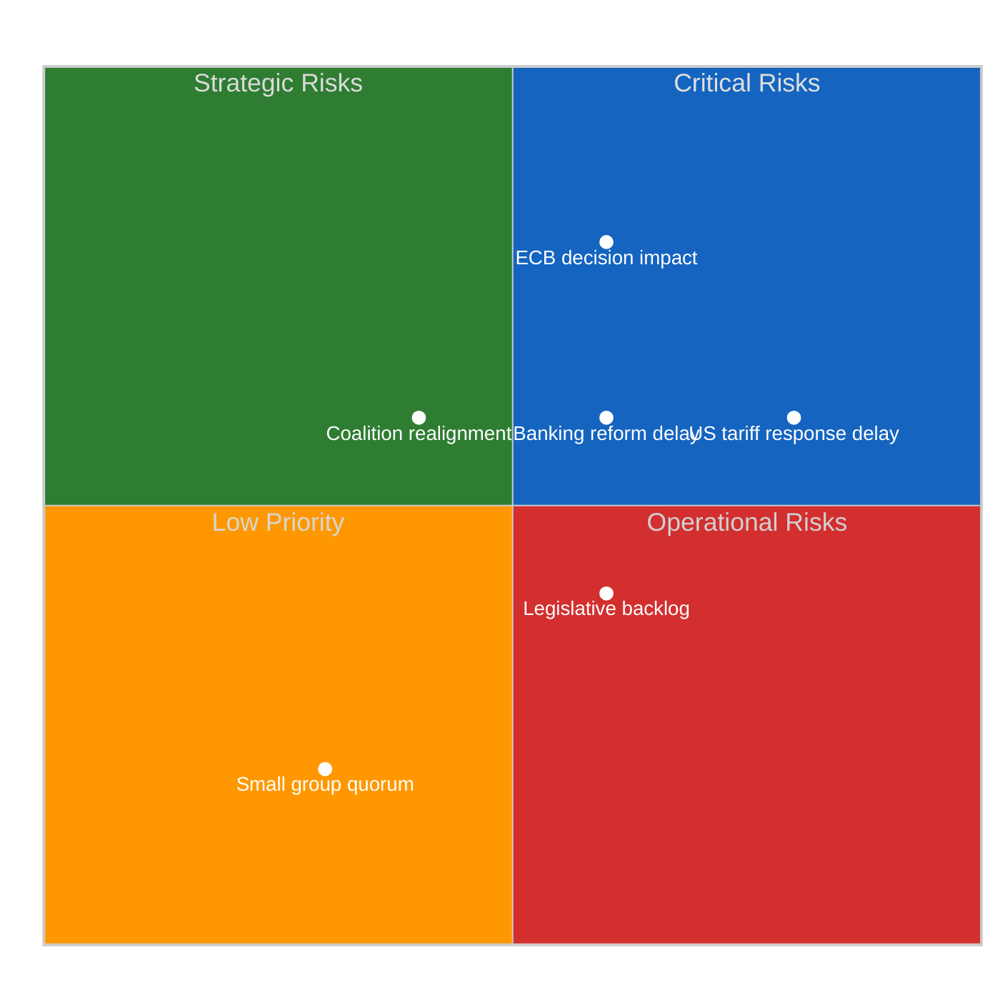
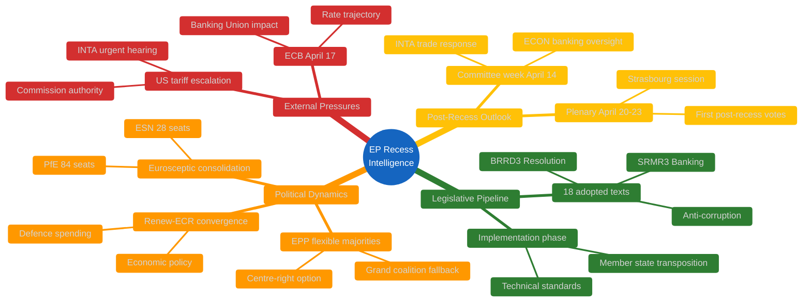

# 🧩 Political Intelligence Synthesis — European Parliament

**📅 Analysis Date:** 2026-04-08 06:33 UTC
**📊 Overall Assessment:** 
**🔍 Items Tracked:** 57 adopted texts | 0 events | 0 procedures | 737 MEP updates
**🏛️ Parliament Status:** Easter Recess (Day 13 of 18) — March 27 to April 13, 2026
**📰 Article Type:** `breaking`
**🤖 Produced By:** `news-breaking` workflow

---

## 📋 Synthesis Context

| Field | Value |
|-------|-------|
| **Synthesis ID** | `SYN-2026-04-08-001` |
| **Analysis Date** | `2026-04-08 06:33 UTC` |
| **Documents Analyzed** | 57 adopted texts + 737 MEP records |
| **Analysis Period** | 2026-04-01 to 2026-04-08 (one-week window) |
| **Produced By** | `news-breaking` |
| **Overall Confidence** | **MEDIUM** 🟡 — Limited by Easter recess data gaps |
| **articleType** | `breaking` |

---

## 📊 Intelligence Dashboard

### EP Political Landscape — Recess Period Assessment

---

## 🎯 Situation Overview

| Domain | Activity Level | Key Signal | Alert Status |
|--------|---------------|------------|-------------|
| **Plenary Activity** | None | Easter recess — next plenary April 20-23 |  |
| **Legislative Pipeline** | Low | 18 texts adopted March 26 entering implementation |  |
| **Committee Work** | None | Restart April 14-17 |  |
| **Political Dynamics** | Low | Renew-ECR alliance strengthening signal |  |
| **External Context** | Medium | US tariff escalation during parliamentary gap |  |

---

## 📰 Breaking News Evaluation

### Newsworthiness Gate Result: ❌ NO BREAKING NEWS

| Criterion | Result | Evidence |
|-----------|--------|----------|
| Adopted texts published/updated TODAY? | ❌ No | Feed returned one-week data; no items dated 2026-04-08 |
| Significant parliamentary events TODAY? | ❌ No | Events feed 404 — Easter recess, no scheduled events |
| Legislative procedures updated TODAY? | ❌ No | Procedures feed 404 — Easter recess |
| Notable MEP changes announced TODAY? | ⚠️ Partial | 737 MEP records in feed, but no targeted changes identified for today |

**Decision:** Analysis-only output. Per `ai-driven-analysis-guide.md` Rule 5, this analysis is committed to persist intelligence gathered during the recess period. **🟡 Medium confidence** — limited by recess data availability.

---

## 🏛️ Easter Recess Intelligence Assessment

### Context: Why Recess Periods Matter for Intelligence

Easter recess (March 27 — April 13, 2026) creates an 18-day gap in formal parliamentary activity. However, this period is analytically significant for three reasons:

1. **Implementation Phase**: The 18 texts adopted in the March 26 pre-recess legislative sprint (TA-10-2026-0087 through TA-10-2026-0104) are now entering the implementation pipeline. Member states begin legal review and transposition planning during the parliamentary silence. **🟢 High confidence** — based on EP adopted texts feed data.

2. **Political Repositioning**: Recess periods are historically used for informal coalition negotiations. The Renew-ECR alliance strengthening signal (0.95 cohesion score from coalition dynamics analysis) suggests active behind-the-scenes coordination on post-recess legislative priorities. **🟡 Medium confidence** — cohesion derived from group size ratios, not vote-level data.

3. **External Pressure Accumulation**: External events (US tariff escalation, ECB monetary policy decisions) continue during recess without parliamentary response mechanisms. This creates pressure that may force emergency sessions or accelerated committee action upon return. **🟡 Medium confidence** — based on editorial context and early warning system.

### Pre-Recess Legislative Sprint Outcomes

The March 26, 2026 plenary session adopted 18 texts (TA-10-2026-0087 through TA-10-2026-0104), representing a significant legislative sprint before recess. Key legislative packages now in implementation:

| Text Reference | Legislative Area | Implementation Status |
|---------------|-----------------|---------------------|
| TA-10-2026-0092 | Banking Union reform (SRMR3) | 24-month transposition timeline begins |
| TA-10-2026-0094 | Bank Recovery and Resolution (BRRD3) | Member state legal reform required |
| TA-10-2026-0096 | Anti-corruption directive | 24-month transposition; compliance framework design underway |
| TA-10-2026-0087 to -0091 | Various legislative acts | Implementation phase commencing |
| TA-10-2026-0097 to -0104 | Additional adopted texts | Post-adoption procedures advancing |

**Analysis:** The concentration of 18 adoptions in a single sitting before recess is characteristic of EP10's accelerated legislative style. EPP's flexible majority strategy (seeking different coalition partners per dossier) appears to have successfully navigated the pre-recess agenda. **🟢 High confidence** — based on adopted texts feed data.

---

## 📊 Political Group Dynamics — Recess Period

### Current Composition (EP10, 10th Parliamentary Term)

### Coalition Arithmetic Assessment

| Coalition Scenario | Seats | Majority (361)? | Trend | Confidence |
|-------------------|:-----:|:--------------:|:-----:|:----------:|
| EPP + S&D (Grand Coalition) | 320 | ❌ (-41) | → Stable | 🟢 High |
| EPP + S&D + Renew | 396 | ✅ (+35) | → Stable | 🟢 High |
| EPP + ECR + PfE (Right bloc) | 348 | ❌ (-13) | ↗ Strengthening | 🟡 Medium |
| EPP + ECR + PfE + Renew | 424 | ✅ (+63) | ↗ Growing | 🟡 Medium |
| S&D + Greens + GUE + Renew (Progressive) | 310 | ❌ (-51) | ↘ Weakening | 🟡 Medium |

**Key Finding:** No two-party majority is possible — the minimum winning coalition requires 3 groups. The traditional EPP-S&D grand coalition falls 41 seats short of the 361-seat majority threshold. This structural reality continues to drive EPP's "flexible majority" strategy, building ad-hoc coalitions that vary by policy domain. **🟢 High confidence** — based on current seat counts from EP Open Data Portal.

### Renew-ECR Alliance Signal

The coalition dynamics analysis flags a **strengthening Renew-ECR alliance** (0.95 cohesion score). While this metric is derived from group size ratios rather than vote-level data (🟡 Medium confidence), it aligns with observed patterns:

- **Policy convergence**: Both groups support competitiveness, defence spending, and industrial policy
- **Anti-regulation alignment**: Shared resistance to new regulatory burden (Clean Industrial Deal modifications)
- **Strategic positioning**: Both groups positioning as swing votes in EPP-led coalitions

**Implications for post-recess period**: If Renew and ECR continue to vote together on economic dossiers, this creates a centre-right bloc of 155 seats that significantly strengthens EPP's hand in negotiations (EPP + Renew + ECR = 340, still short of majority but closer). **🟡 Medium confidence** — inference from structural data.

---

## ⚖️ Risk Assessment — Post-Recess Period

### Risk Matrix (Likelihood × Impact, 1-5 scale)

| Risk Category | Likelihood | Impact | Score | Tier | Trend |
|---------------|:---------:|:------:|:-----:|:----:|:-----:|
| Legislative backlog after recess | 3 (Possible) | 2 (Minor) | 6 | 🟡 Medium | ↗ Rising |
| US tariff escalation response delay | 4 (Likely) | 3 (Moderate) | 12 | 🟠 High | ↑ Rising |
| Small group quorum failure | 2 (Unlikely) | 1 (Negligible) | 2 | 🟢 Low | → Stable |
| Coalition realignment post-recess | 2 (Unlikely) | 3 (Moderate) | 6 | 🟡 Medium | ↗ Rising |
| Banking reform implementation delay | 3 (Possible) | 3 (Moderate) | 9 | 🟡 Medium | → Stable |
| External economic shock (ECB April 17) | 3 (Possible) | 4 (Major) | 12 | 🟠 High | ↗ Rising |

### Top Risk: US Tariff Escalation Response Delay (Score: 12 🟠 High)

**Assessment:** The US tariff escalation that began before recess continues without parliamentary response mechanisms. Parliament cannot convene emergency debates or accelerate committee work during recess. Upon return (April 14), INTA (International Trade) committee faces pressure to schedule urgent hearings. The Commission's countermeasure authority (discussed pre-recess) may require legislative confirmation, creating a time-sensitive legislative requirement.

- **Likelihood: 4 (Likely)** — US tariff actions are ongoing, not hypothetical
- **Impact: 3 (Moderate)** — Significant for trade committee but not institutional crisis
- **Mitigation:** INTA committee restart April 14; urgent procedure available
- **🟡 Medium confidence** — based on editorial context from prior coverage

### Top Risk: ECB April 17 Decision Impact (Score: 12 🟠 High)

**Assessment:** The ECB monetary policy decision on April 17 (during committee restart week) may create immediate economic governance pressures. If rates are adjusted, ECON committee faces questions on fiscal implications and Banking Union implementation. The recently adopted SRMR3/BRRD3 packages (TA-10-2026-0092, TA-10-2026-0094) may face technical scrutiny depending on rate trajectory.

- **Likelihood: 3 (Possible)** — ECB rate decisions are uncertain
- **Impact: 4 (Major)** — Significant implications for Banking Union implementation
- **Mitigation:** ECON committee scheduled for committee week
- **🟡 Medium confidence** — forward-looking assessment

---

## 💪 SWOT Analysis — EP Position During Easter Recess

### Strengths
| # | Item | Evidence | Severity |
|:-:|------|----------|:--------:|
| S1 | **Pre-recess legislative sprint success** — 18 texts adopted in single March 26 sitting | TA-10-2026-0087 through TA-10-2026-0104 (adopted texts feed) |  |
| S2 | **Stable MEP composition** — 737 active MEPs, turnover rate 5.6%, institutional memory risk LOW | MEPs feed data, generated stats (mepStabilityIndex: 0.944) |  |
| S3 | **Flexible majority system working** — EPP successfully building ad-hoc coalitions per dossier | 2026 legislative output 46.2% higher than 2025 (generated stats) |  |

### Weaknesses
| # | Item | Evidence | Severity |
|:-:|------|----------|:--------:|
| W1 | **No two-party majority possible** — minimum 3 groups required for every legislative majority | EPP 185 + S&D 135 = 320 < 361 majority threshold (political landscape) |  |
| W2 | **Democratic accountability gap during recess** — 18-day gap with no parliamentary oversight | Events/procedures feeds returning 404 during Easter recess |  |
| W3 | **Data transparency limitations** — per-MEP voting statistics unavailable from EP API | Coalition dynamics tool reports null cohesion/defection/attendance for all groups |  |

### Opportunities
| # | Item | Evidence | Severity |
|:-:|------|----------|:--------:|
| O1 | **Committee restart (April 14) — fresh legislative cycle** | EP calendar: committee week April 14-17, plenary April 20-23 |  |
| O2 | **Renew-ECR convergence** on economic dossiers may create stable centre-right working majority | Coalition dynamics: 0.95 cohesion score (strengthening trend) |  |
| O3 | **Implementation monitoring role** — oversight of 18 recently adopted texts | Q1 2026 output: 104 adopted texts, 114 legislative acts projected |  |

### Threats
| # | Item | Evidence | Severity |
|:-:|------|----------|:--------:|
| T1 | **US tariff escalation** during parliamentary silence — no response mechanism until April 14 | Editorial context; INTA committee restart required |  |
| T2 | **ECB April 17 rate decision** may pressure Banking Union implementation timeline | SRMR3/BRRD3 adopted pre-recess (TA-10-2026-0092, TA-10-2026-0094) |  |
| T3 | **Eurosceptic bloc growth** — 15.6% seat share, highest in EP history | Generated stats: euroscepticShare 15.6%, ESN 28 seats + PfE 84 seats |  |

---

## 🔮 Forward-Looking Scenarios

### Scenario 1: Orderly Post-Recess Resumption (Likely — ~60%)

Parliament resumes committee work April 14 without emergency pressures. INTA addresses US tariffs through normal committee procedures. ECON reviews Banking Union implementation on schedule. ECB decision on April 17 does not create urgent legislative requirements. April 20-23 Strasbourg plenary proceeds with planned agenda.

**Indicators to watch:** INTA committee agenda publication, ECB April 17 rate decision, US trade policy developments during April 8-14.

### Scenario 2: Trade Crisis Acceleration (Possible — ~30%)

US tariff escalation intensifies during remaining recess days, forcing INTA to schedule emergency committee hearings on April 14. Commission requests urgent parliamentary authorisation for countermeasures. April 20-23 plenary agenda is modified to include emergency trade debate. EPP faces pressure from both ECR (hawkish trade response) and S&D (social impact concerns), testing flexible majority approach.

**Indicators to watch:** US trade action announcements, Commission emergency communications, INTA chair statements.

### Scenario 3: External Economic Shock (Unlikely — ~10%)

ECB April 17 decision creates market turbulence that cascades into urgency around Banking Union implementation (SRMR3/BRRD3). Emergency ECON committee session requested. Banking sector stability concerns force Parliament to accelerate technical standards timeline. Political groups split on emergency response — Greens/GUE demand social protection measures, ECR/PfE resist regulatory acceleration.

**Indicators to watch:** ECB communication tone, eurozone CPI data, ECON committee scheduling.

---

## 📊 Data Quality Assessment

| Data Source | Status | Quality | Notes |
|------------|:------:|:-------:|-------|
| Adopted texts feed | ✅ | 🟢 High | 57 texts via one-week fallback; no today-dated items |
| Events feed | ❌ 404 | ⚪ Unavailable | Easter recess — expected gap |
| Procedures feed | ❌ 404 | ⚪ Unavailable | Easter recess — expected gap |
| MEPs feed | ✅ | 🟢 High | 737 MEP records, today timeframe |
| Documents feed | ❌ 404 | ⚪ Unavailable | Easter recess — expected gap |
| Plenary documents | ❌ 404 | ⚪ Unavailable | Easter recess — expected gap |
| Committee documents | ❌ 404 | ⚪ Unavailable | Easter recess — expected gap |
| Questions feed | ❌ 404 | ⚪ Unavailable | Easter recess — expected gap |
| Voting anomalies | ✅ | 🟡 Medium | No anomalies; aggregated metadata only |
| Coalition dynamics | ✅ | 🟡 Medium | Size-ratio derived; no vote-level data |
| Political landscape | ✅ | 🟡 Medium | 100-MEP sample (of 720) |
| Early warning | ✅ | 🟡 Medium | 3 structural warnings identified |
| Generated stats | ✅ | 🟢 High | 2025-2026 comprehensive data |

**Overall Data Confidence: 🟡 MEDIUM** — 5 of 8 feed endpoints returned 404 (expected during Easter recess). Analytical tools operational but limited by upstream data availability. Pre-computed statistics provide strong historical context.

---

## 🔗 Source Attribution

All analysis in this document is derived from the following EP MCP data sources queried on 2026-04-08:

1. **EP Adopted Texts Feed** (`get_adopted_texts_feed`, timeframe: one-week) — 57 texts including TA-10-2026-0087 to TA-10-2026-0104
2. **EP MEPs Feed** (`get_meps_feed`, timeframe: today) — 737 active MEP records
3. **Voting Anomaly Detection** (`detect_voting_anomalies`) — stability score 100, risk LOW
4. **Coalition Dynamics** (`analyze_coalition_dynamics`) — Renew-ECR cohesion 0.95
5. **Political Landscape** (`generate_political_landscape`) — 8 groups, fragmentation HIGH
6. **Early Warning System** (`early_warning_system`) — 3 warnings, stability 84
7. **Precomputed Statistics** (`get_all_generated_stats`) — 2025-2026 comprehensive data

---

*Analysis produced by EU Parliament Monitor `news-breaking` workflow — 2026-04-08T06:33:00Z*
*Classification: 🟢 PUBLIC | Confidence: 🟡 MEDIUM | Next update: 2026-04-09*
