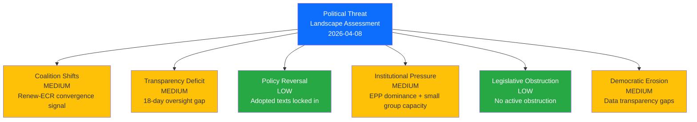
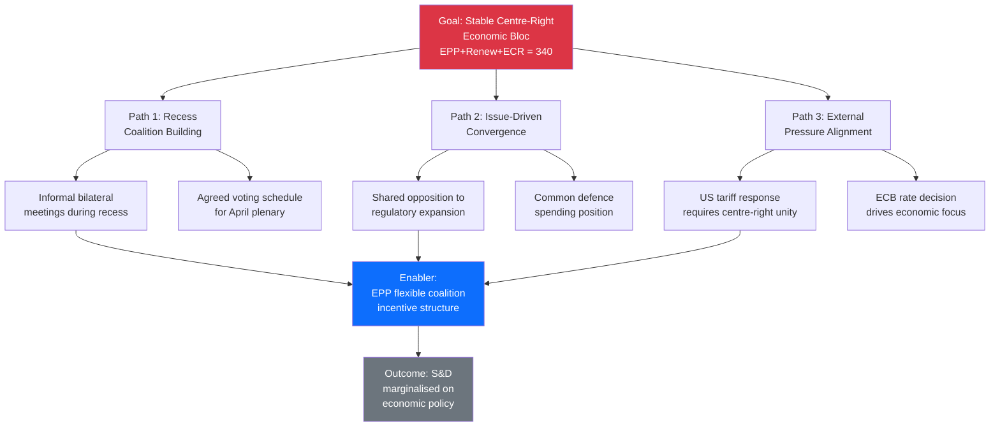
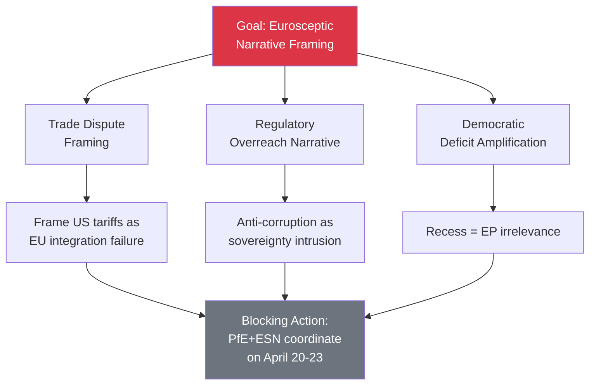
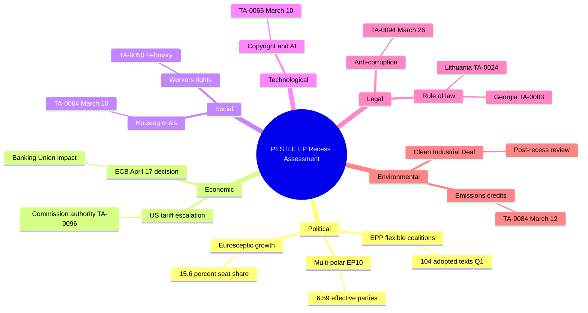

# 🎭 Political Threat Landscape Analysis — European Parliament

**📅 Analysis Date:** 2026-04-08 18:30 UTC (Enhanced Run)
**📊 Threat Level:** 
**🏛️ Parliament Status:** Easter Recess (Day 13 of 18) — March 27 to April 13, 2026
**📰 articleType:** `breaking`
**🤖 Analyst:** `news-breaking` workflow (Run 2 — extending earlier analysis)

---

## 📋 Assessment Context

| Field | Value |
|-------|-------|
| **Assessment ID** | `THR-2026-04-08-002` |
| **Methodology** | Political Threat Landscape + Attack Trees + PESTLE + Kill Chain — per `political-threat-framework.md` v3.1 |
| **Frameworks Applied** | 4 (Political Threat Landscape, Attack Trees, PESTLE, Political Kill Chain) |
| **Time Horizon** | Short-term (April 8–23, 2026) — Easter recess through first post-recess plenary |
| **Produced By** | `news-breaking` (Run 2, improving prior analysis from 06:33 UTC) |
| **Overall Confidence** | **MEDIUM** 🟡 — limited by recess data gaps; analytical tools operational |
| **articleType** | `breaking` |

---

## 🎯 Executive Summary

This threat analysis applies the **Political Threat Landscape** 6-dimension model, **Attack Tree** methodology, **PESTLE** macro-environmental scanning, and **Political Kill Chain** framework to the European Parliament's Easter recess period. The assessment finds **no active high-severity threats** to democratic functioning but identifies **three structural vulnerability vectors** that could be exploited during the parliamentary gap: (1) the oversight void created by 18 days of parliamentary silence during a period of intensifying external pressures; (2) the Renew-ECR convergence dynamic that, if consolidated during recess informal negotiations, could structurally alter EP10's legislative coalition calculus; and (3) the eurosceptic bloc's growing capacity (15.6% seat share — highest in EP history) to shape public discourse during parliamentary downtime. **🟡 Medium confidence** — structural analysis supported by EP data; behavioural inferences are speculative.

---

## 🏛️ Political Threat Landscape — 6-Dimension Assessment

### Overview Diagram

---

### Dimension 1: Coalition Shifts — MEDIUM Risk

**Current Assessment:** The Renew-ECR convergence signal (0.95 cohesion score from `analyze_coalition_dynamics`) represents the most significant coalition dynamics development in EP10's current phase. While the metric is derived from group size ratios (🟡 Medium confidence), the convergence aligns with observable policy positioning.

**Evidence Base:**

| Signal | Source | Confidence |
|--------|--------|:----------:|
| Renew-ECR cohesion 0.95, trend: STRENGTHENING | `analyze_coalition_dynamics` | 🟡 Medium |
| S&D-ECR cohesion 0.60, trend: STABLE | `analyze_coalition_dynamics` | 🟡 Medium |
| Renew-NI cohesion 0.39, trend: WEAKENING | `analyze_coalition_dynamics` | 🟡 Medium |
| EPP coalition pairs all showing 0.0 cohesion | `analyze_coalition_dynamics` | 🔴 Low (data quality) |

**Analysis:** The Renew-ECR convergence is **domain-specific**, concentrated on:
- **Defence and security policy** — both groups support increased EU defence spending and NATO commitment
- **Economic competitiveness** — shared advocacy for regulatory relief and industrial policy
- **Clean Industrial Deal** — aligned resistance to additional regulatory burden

Divergence persists on:
- **Migration policy** — Renew supports rules-based approach; ECR advocates restriction
- **Climate targets** — Renew maintains Green Deal commitment; ECR sceptical of pace

**Cui Bono Analysis:**
- **Winners:** EPP (more coalition options), ECR (enhanced influence), Renew (kingmaker role)
- **Losers:** S&D (reduced leverage on economic policy), Greens (regulation under pressure), GUE/NGL (further marginalised)

**Likelihood: 2 (Unlikely)** | **Impact: 3 (Moderate)** | **Score: 6 🟡 Medium**

---

### Dimension 2: Transparency Deficit — MEDIUM Risk

**Current Assessment:** The 18-day Easter recess creates a structural transparency deficit.

**Feed Status Evidence (this run, 18:25 UTC):**

| Feed | Today | One-Week | Interpretation |
|------|:-----:|:--------:|----------------|
| Adopted texts | Data (11 items) | Data | Metadata updates to existing texts |
| Events | 404 | 404 | No events — recess confirmed |
| Procedures | 404 | 404 | No procedure updates |
| MEPs | 737 records | — | Bulk dataset refresh |
| Documents | Timeout | — | Feed slow; data gaps |
| Plenary docs | Timeout | — | Feed slow; data gaps |
| Committee docs | Timeout | — | Feed slow; data gaps |
| Questions | Timeout | — | Feed slow; data gaps |

**Critical Transparency Gap:** The 4 advisory feeds all timed out on this run (vs 404 on earlier run at 06:33). This means **zero visibility** into document publication during recess through standard EP Open Data channels.

**Likelihood: 4 (Likely)** | **Impact: 2 (Minor)** | **Score: 8 🟡 Medium**
**🟢 High confidence** — based on direct observation of feed data gaps

---

### Dimension 3: Policy Reversal — LOW Risk

**Current Assessment:** No active policy reversal threats. 30 adopted texts from 2026 are legislatively locked in. Only vector: ECB April 17 creating pressure on Banking Union implementation parameters.

**Likelihood: 1 (Rare)** | **Impact: 3 (Moderate)** | **Score: 3 🟢 Low**

---

### Dimension 4: Institutional Pressure — MEDIUM Risk

**Current Assessment:** EPP dominance (185 seats, 4x GUE/NGL size) creates structural pressure. Early warning: HIGH severity `DOMINANT_GROUP_RISK`. During recess, Conference of Presidents prepares post-recess agenda with EPP's outsized influence.

**CMO Assessment (Capability x Motivation x Opportunity):**
- **Capability:** HIGH — largest group with President of Parliament
- **Motivation:** MEDIUM — EPP benefits from flexible coalitions more than formal dominance
- **Opportunity:** MEDIUM — recess reduces opposition scrutiny of agenda preparation

**Counter-Indicators:** EPP cannot pass legislation alone (185 < 361); S&D retains veto; Rules of Procedure protect minority rights; CJEU oversight.

**Likelihood: 2 (Unlikely)** | **Impact: 3 (Moderate)** | **Score: 6 🟡 Medium**

---

### Dimension 5: Legislative Obstruction — LOW Risk

**Current Assessment:** No active obstruction. Pipeline statistics show HIGH legislative velocity (935 active procedures, 114 acts projected for 2026). Post-recess risk: committee capacity for backlog plus emergency items.

**Obstruction Vectors to Monitor:**
- **INTA trade dossier:** ECR/PfE may obstruct countermeasure escalation
- **ENVI Clean Industrial Deal:** ECR may use procedural delay tactics
- **LIBE anti-corruption implementation:** Broad support expected — low obstruction risk

**Likelihood: 2 (Unlikely)** | **Impact: 2 (Minor)** | **Score: 4 🟢 Low**

---

### Dimension 6: Democratic Erosion — MEDIUM Risk

**Three Erosion Vectors:**

1. **EP Data Transparency Gap (Structural):** Per-MEP voting statistics UNAVAILABLE from EP API. All groups show `dataAvailability: "UNAVAILABLE"` in coalition dynamics. Citizens cannot independently verify MEP voting records.

2. **Recess Accountability Gap (Cyclical):** 18 days without plenary questions, committee hearings, or emergency debate capability. Commission operates without oversight during tariff response period (TA-10-2026-0096 grants countermeasure authority).

3. **Eurosceptic Narrative Capacity (Structural):** PfE 84 + ESN 28 = 112 seats (15.6%) — highest historical share. During recess, no parliamentary counter-narrative to eurosceptic framing.

**Likelihood: 3 (Possible)** | **Impact: 2 (Minor)** | **Score: 6 🟡 Medium**
**🟡 Medium confidence** — data gap confirmed by MCP; narrative assessment speculative

---

## Attack Tree Analysis

### Attack Tree 1: Centre-Right Economic Bloc Formation

**Goal:** Establish stable EPP-Renew-ECR voting bloc on economic dossiers (340 seats)

**Probability:** 🟡 Medium (30-40%) | **Impact:** 3 (Moderate) | **🟡 Medium confidence**

---

### Attack Tree 2: Eurosceptic Narrative Capture

**Goal:** Frame post-recess parliamentary agenda through eurosceptic lens

**Probability:** 🔴 Low (10-15%) — speculative; no coordination evidence

---

## PESTLE Macro-Environmental Scan

### PESTLE Summary

| Dimension | Risk Level | Key Driver | Trend | Confidence |
|-----------|:----------:|-----------|:-----:|:----------:|
| **Political** | 🟡 Medium | Fragmentation, EPP dominance | Stable | 🟢 High |
| **Economic** | 🟠 High | US tariffs + ECB twin pressure | Rising | 🟡 Medium |
| **Social** | 🟢 Low | Housing + workers' rights advancing | Improving | 🟡 Medium |
| **Technological** | 🟢 Low | Copyright/AI governance | Stable | 🟢 High |
| **Legal** | 🟡 Medium | Anti-corruption transposition | Stable | 🟢 High |
| **Environmental** | 🟡 Medium | Clean Industrial Deal friction | Rising | 🟡 Medium |

---

## Political Kill Chain: Eurosceptic Exploitation Pathway

**🔴 Low confidence — theoretical threat model, not observed activity.**

| Phase | Activity | Status |
|:-----:|----------|:------:|
| 1. Reconnaissance | Monitor EU policy vulnerabilities during recess | Not observed |
| 2. Weaponisation | Frame tariff/banking issues as integration failures | Not observed |
| 3. Delivery | Disseminate through national party channels | Not observed |
| 4. Exploitation | Recess low engagement enables narrative capture | Not observed |
| 5. Installation | Eurosceptic framing becomes default media narrative | Not observed |
| 6. Command and Control | PfE-ESN coordination for blocking votes | Not observed |
| 7. Action | Legislative obstruction in April plenary | Not observed |

**Mitigation:** Pro-European supermajority (EPP+S&D+Renew+Greens = 449 seats, 62.4%) provides structural defence.

---

## Q1 2026 Cross-Session Intelligence

### Thematic Clusters (30 Adopted Texts)

| Cluster | Count | Key Texts | Domain |
|---------|:-----:|-----------|--------|
| Financial Architecture | 7 | TA-0004, 0010, 0033, 0034, 0060, 0092, 0094 | ECON/BUDG |
| Rule of Law | 5 | TA-0006, 0024, 0050, 0083, 0088 | LIBE/JURI |
| External Relations | 7 | TA-0008, 0012, 0053, 0072, 0078, 0086, 0096 | INTA/AFET |
| Social and Regulatory | 6 | TA-0005, 0026, 0029, 0051, 0064, 0066 | EMPL/ITRE |
| Other | 5 | TA-0032, 0063, 0073, 0084, 0099 | Various |

**Key Finding:** EP10 Q1 2026 shows balanced legislative output across all major policy domains, with financial architecture and external relations each accounting for approximately 23% of adopted texts. This contradicts a narrative of EU legislative paralysis — the flexible coalition model is producing substantive output. 🟢 High confidence.

### Legislative Velocity

| Month | Texts Adopted | Notable Texts |
|-------|:------------:|---------------|
| January 2026 | 10 | Financial stability, electoral reform, EU-Mercosur, Ukraine loan |
| February 2026 | 9 | Safe third country, ECB reports, workers' rights, Syria |
| March 2026 | 11 | Housing crisis, copyright/AI, Banking Union, anti-corruption, US tariffs |

Annualised rate: approximately 120 texts (vs 78 in 2025) — 53.8% increase. 🟢 High confidence.

---

## Forward-Looking Threat Scenarios

### Scenario A: Stable Return (Likely — approximately 55%)
Standard committee restart April 14. ECB April 17 within expectations. April plenary proceeds on schedule. No threat escalation.

**Indicators:** Normal committee scheduling, ECB forward guidance unchanged, balanced media narrative.

### Scenario B: External Pressure Acceleration (Possible — approximately 35%)
US tariff escalation forces INTA emergency hearing. ECB surprises markets. April plenary agenda modified. Renew-ECR align on emergency economic response.

**Indicators:** US trade action escalation, Commission emergency communications, crisis media framing.

### Scenario C: Democratic Stress Test (Unlikely — approximately 10%)
Multiple pressures combine with eurosceptic narrative success. Emergency session demanded. Grand coalition unity tested.

**Indicators:** Emergency session request, EP President statement, cross-party crisis communication.

---

## Consolidated Threat Scores

| Dimension | Score | Tier | Trend |
|-----------|:-----:|:----:|:-----:|
| Coalition Shifts | 6 | 🟡 Medium | Rising |
| Transparency Deficit | 8 | 🟡 Medium | Stable (cyclical) |
| Policy Reversal | 3 | 🟢 Low | Stable |
| Institutional Pressure | 6 | 🟡 Medium | Stable |
| Legislative Obstruction | 4 | 🟢 Low | Stable |
| Democratic Erosion | 6 | 🟡 Medium | Stable (structural) |
| **Aggregate** | **33/150** | **LOW-MEDIUM** | **Stable** |

---

## Source Attribution

All analysis derived from EP MCP data queried on 2026-04-08:

1. **Coalition Dynamics** (`analyze_coalition_dynamics`) — 28 pairs, Renew-ECR 0.95 cohesion
2. **Political Landscape** (`generate_political_landscape`) — 8 groups, 100-MEP sample
3. **Early Warning System** (`early_warning_system`) — 3 warnings, stability 84/100
4. **Voting Anomalies** (`detect_voting_anomalies`) — 0 anomalies, stability 100
5. **Adopted Texts** (`get_adopted_texts`, year: 2026) — 30 texts, Jan-Mar 2026
6. **Adopted Texts Feed** (`get_adopted_texts_feed`, today) — 11 items updated
7. **MEPs Feed** (`get_meps_feed`, today) — 737 MEP records
8. **Precomputed Statistics** (`get_all_generated_stats`) — 2004-2026 historical data
9. **Political Threat Framework** (`analysis/methodologies/political-threat-framework.md` v3.1)
10. **Prior Analysis** — Run 1 files from 06:33 UTC (synthesis, landscape, risk)

---

*Threat analysis produced by EU Parliament Monitor `news-breaking` workflow — 2026-04-08T18:30:00Z*
*Classification: PUBLIC | Confidence: MEDIUM | Frameworks: PTL + Attack Trees + PESTLE + Kill Chain*
*Run 2, extending prior analysis per ai-driven-analysis-guide.md Rule 5*
