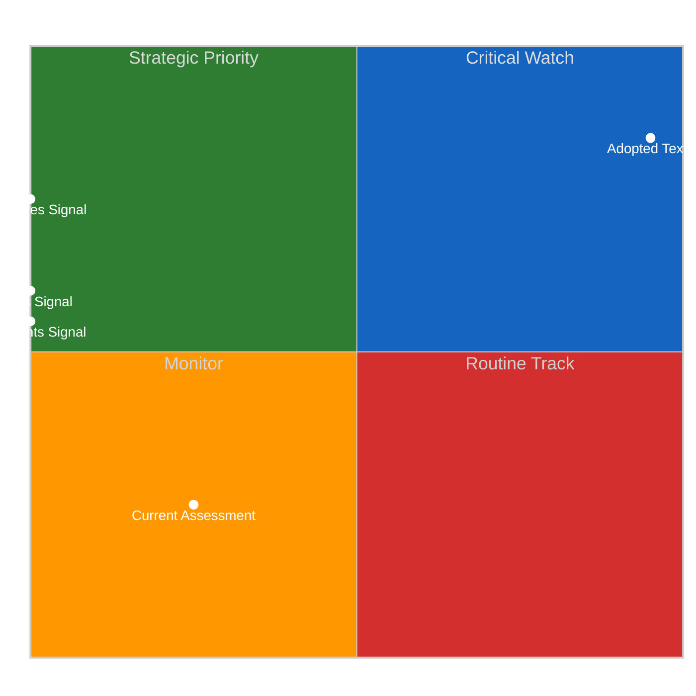
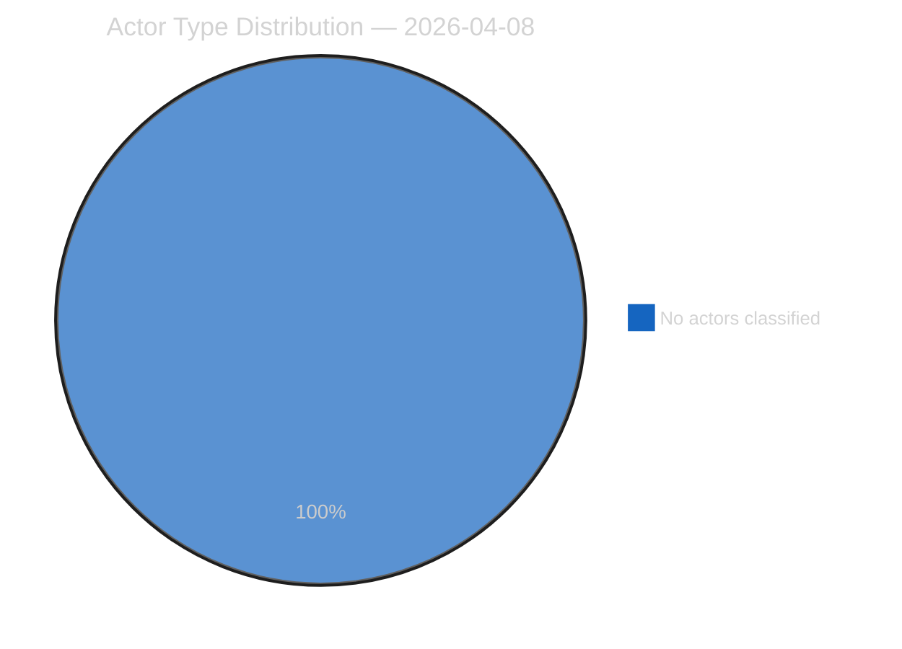
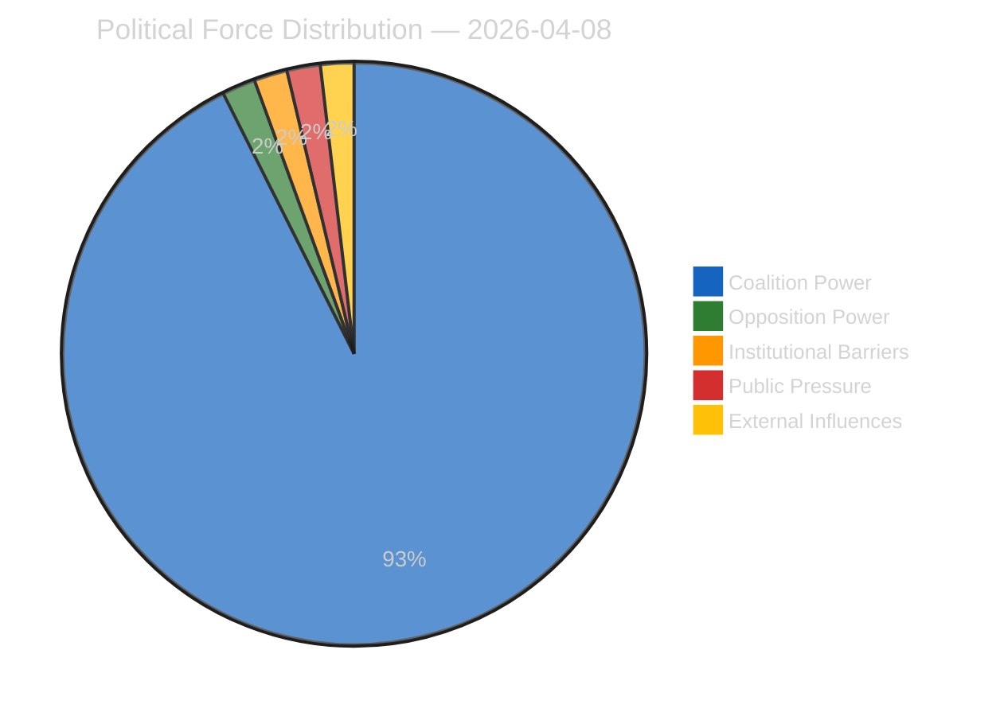
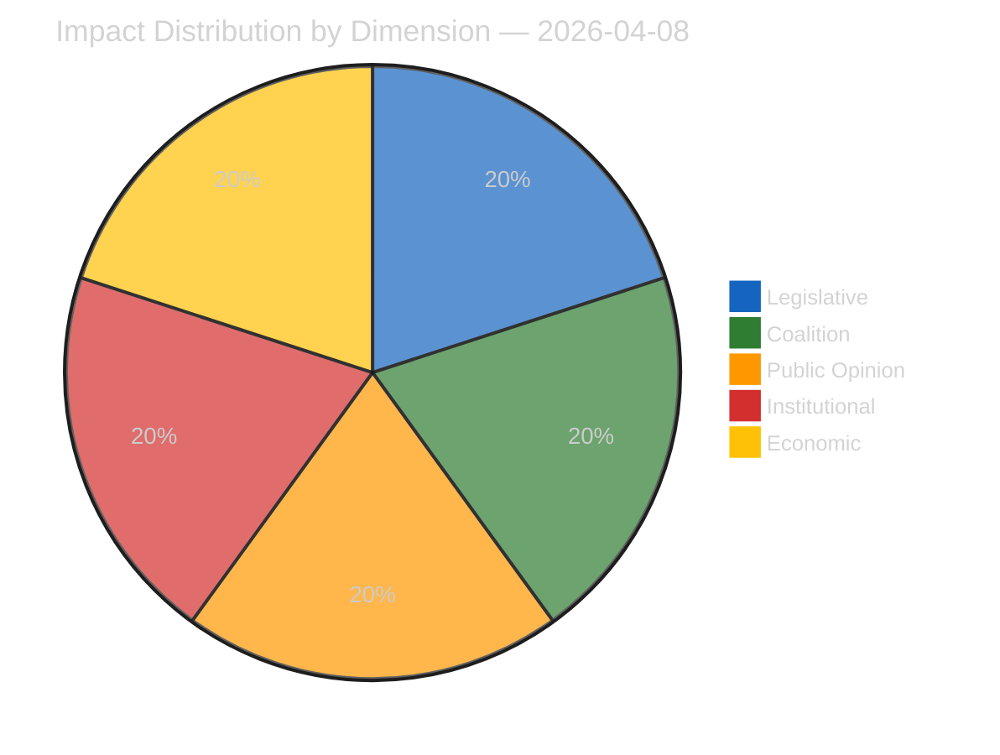
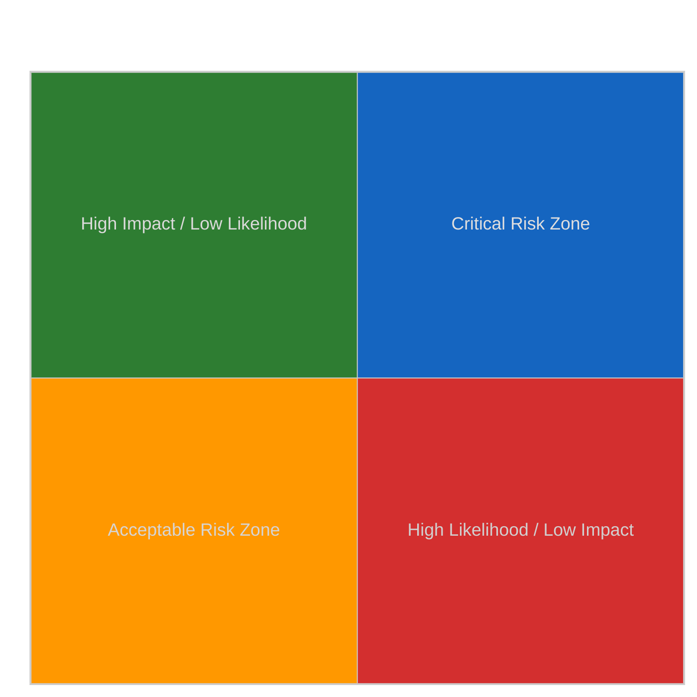
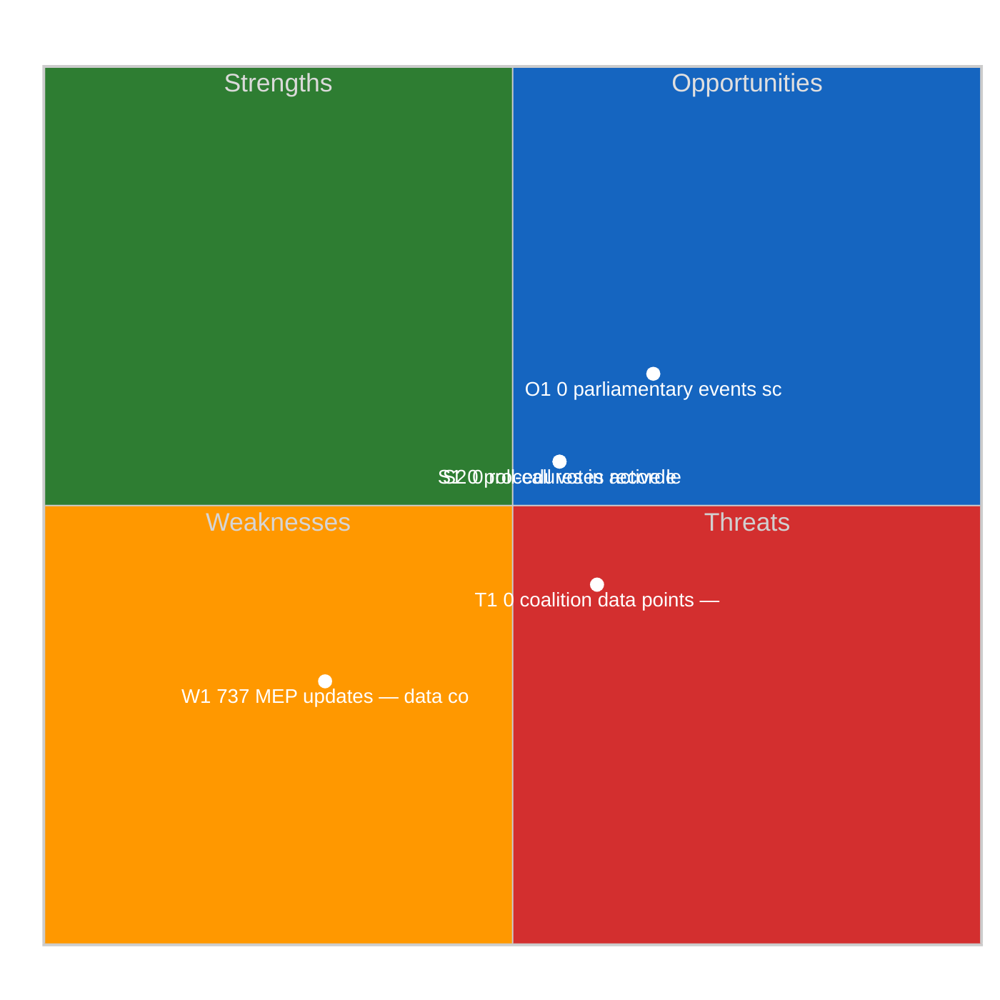
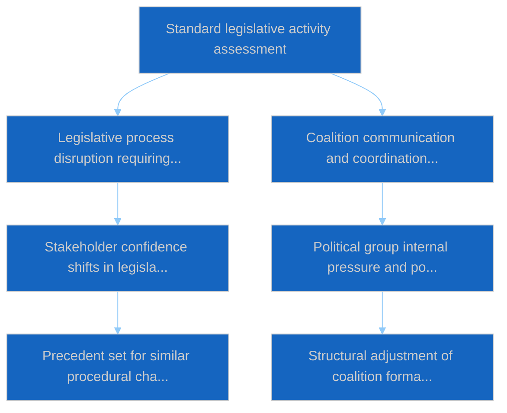

# Propositions — 2026-04-08

<h2 id="section-executive-brief">Executive Brief</h2>

### BLUF

The 8 April propositions analytical run records **0 political dimensions surfaced** during pre-recess wind-down. Procedural-continuity output anchored on the Q1 2026 baseline (100 texts / 6 sittings / 10 weeks; ECON-bottleneck hypothesis pending). *Confidence: LOW-MEDIUM on fresh; HIGH on continuity; Admiralty: B3.*

### Three Decisions

1. **Maintain propositions-track continuity through pre-recess wind-down.** Pipeline cadence is the value. *Confidence: HIGH.*
2. **Trace continuity to Q1 2026 propositions baseline (100 texts).** Canonical reference. *Confidence: HIGH.*
3. **Pre-position ECON-bottleneck hypothesis for post-recess validation.** The hypothesis becomes testable when Q2 propositions track resumes. *Confidence: MEDIUM-HIGH.*

### 60-Second Read

Standard pre-recess procedural-continuity output. Propositions-track preserves cadence; ECON-bottleneck hypothesis pre-positioned for Q2 testing.

### Risk Snapshot

| Risk | Likelihood | Impact |
|---|---:|---:|
| Q2 propositions data invalidates ECON-bottleneck hypothesis | MED | LOW–MED |
| Pre-recess baseline becomes stale | LOW | LOW |

### Source Quality

- 0-dimension observation: **A1**
- Q1 baseline reference: **A1**

### Provenance

- Run: `propositions` (2026-04-08, pre-recess)
- Compliance: EP Open Data Portal feeds only. GDPR-compliant.

---
*Analytical neutrality: procedural reading.*

<h2 id="reader-intelligence-guide">Reader Intelligence Guide</h2>

Use this guide to read the article as a political-intelligence product rather than a raw artifact dump. High-value reader lenses appear first; technical provenance remains available in the audit appendices.

| Reader need | What you'll get | Source artifact |
|---|---|---|
| [BLUF and editorial decisions](#section-executive-brief) | fast answer to what happened, why it matters, who is accountable, and the next dated trigger | `executive-brief.md` |
| [Significance scoring](#section-significance) | why this story outranks or trails other same-day European Parliament signals | `classification/significance-classification.md` |
| [Actors and forces](#section-actors-forces) | who is driving the story, what political forces line up behind them, and which institutional levers they can pull | `classification/actor-mapping.md` |
| [Coalitions and voting](#section-coalitions-voting) | political group alignment, voting evidence, and coalition pressure points | `existing/voting-patterns.md` |
| [Stakeholder impact](#section-stakeholder-map) | who gains, who loses, and which institutions or citizens feel the policy effect | `existing/stakeholder-impact.md` |
| [Risk assessment](#section-risk) | policy, institutional, coalition, communications, and implementation risk register | `risk-scoring/risk-matrix.md` |
| [Threat landscape](#section-threat) | hostile actors, attack vectors, consequence trees, and legislative-disruption pathways | `threat-assessment/actor-threat-profiling.md` |
| [Cross-run continuity](#section-continuity) | what changed since prior sessions and how confidence shifted between runs | `existing/cross-session-intelligence.md` |
| [Deep analysis](#section-deep-analysis) | long-form Economist-style explanation for readers who want the full argument | `existing/deep-analysis.md` |
| [Supplementary intelligence](#section-supplementary-intelligence) | additional markdown discovered in the run that has not yet been assigned to a canonical section | `executive-brief_ar.md` |

<h2 id="section-significance">Significance</h2>

### Significance Classification

### Overall Significance: **ROUTINE**

### 5-Signal Model Scores

| Signal | Raw Data | Score |
|--------|----------|-------|
| Volume | 0 events, 0 documents | 0.0/5 |
| Pipeline | 0 procedures | 0.0/5 |
| Output | 59 adopted texts | 5.0/5 |
| Anomalies | Pattern deviation detection | — |
| Coalition | Group alignment analysis | — |

### Data Summary

| Metric | Value |
|--------|-------|
| Computed significance | ROUTINE |
| Total data points | 59 |
| Events | 0 |
| Documents | 0 |
| Procedures | 0 |
| Adopted texts | 59 |
| Date | 2026-04-08 |

### Date: 2026-04-08

<h2 id="section-actors-forces">Actors & Forces</h2>

### Actor Mapping

### Actors Identified: 0

### Actor Classification

| Actor | Type | Influence | Position | Role |
|-------|------|-----------|----------|------|
| — | — | — | — | — |

### Type Counts

| Type | Count |
|------|-------|
| — | 0 |

### Date: 2026-04-08

### Forces Analysis

### Forces Data

| Force | Trend | Strength | Key Actors | Confidence |
|-------|-------|----------|------------|------------|
| Coalition Power | stable | 50% | — | low |
| Opposition Power | stable | 0% | — | low |
| Institutional Barriers | stable | 0% | — | low |
| Public Pressure | stable | 0% | — | low |
| External Influences | stable | 0% | — | low |

### Balance

| Metric | Value |
|--------|-------|
| Coalition vs Opposition | 50% vs 1% |
| Dominant force | Coalition |
| Date | 2026-04-08 |

### Date: 2026-04-08

### Impact Matrix

### Overall Significance: **ROUTINE**

### Impact Dimensions

| Dimension | Level | Indicator | Numeric |
|-----------|-------|-----------|---------|
| Legislative | none | 🟢 | 5 |
| Coalition | none | 🟢 | 5 |
| Public Opinion | none | 🟢 | 5 |
| Institutional | none | 🟢 | 5 |
| Economic | none | 🟢 | 5 |

### Summary

| Metric | Value |
|--------|-------|
| Overall significance | ROUTINE |
| Highest impact | Legislative |
| Date | 2026-04-08 |

### Date: 2026-04-08

### Significance Scoring

### Summary

| Decision | Count |
|----------|:-----:|
| 📰 Publish | 0 |
| 📋 Hold | 59 |
| 🗄️ Skip | 0 |

### Batch Scoring

| Event | EP Reference | Parl. | Policy | Public | Urgency | Instit. | **Composite** | Decision |
|-------|-------------|:-----:|:------:|:------:|:-------:|:-------:|:-------------:|----------|
| T10-0302/2025 | eli/dl/doc/TA-10-2025-0302 | 7.0 | 6.0 | 5.0 | 4.0 | 6.0 | **5.75** | Hold |
| T10-0303/2025 | eli/dl/doc/TA-10-2025-0303 | 7.0 | 6.0 | 5.0 | 4.0 | 6.0 | **5.75** | Hold |
| T10-0304/2025 | eli/dl/doc/TA-10-2025-0304 | 7.0 | 6.0 | 5.0 | 4.0 | 6.0 | **5.75** | Hold |
| T10-0305/2025 | eli/dl/doc/TA-10-2025-0305 | 7.0 | 6.0 | 5.0 | 4.0 | 6.0 | **5.75** | Hold |
| T10-0306/2025 | eli/dl/doc/TA-10-2025-0306 | 7.0 | 6.0 | 5.0 | 4.0 | 6.0 | **5.75** | Hold |
| T10-0307/2025 | eli/dl/doc/TA-10-2025-0307 | 7.0 | 6.0 | 5.0 | 4.0 | 6.0 | **5.75** | Hold |
| T10-0308/2025 | eli/dl/doc/TA-10-2025-0308 | 7.0 | 6.0 | 5.0 | 4.0 | 6.0 | **5.75** | Hold |
| T10-0309/2025 | eli/dl/doc/TA-10-2025-0309 | 7.0 | 6.0 | 5.0 | 4.0 | 6.0 | **5.75** | Hold |
| T10-0310/2025 | eli/dl/doc/TA-10-2025-0310 | 7.0 | 6.0 | 5.0 | 4.0 | 6.0 | **5.75** | Hold |
| T10-0311/2025 | eli/dl/doc/TA-10-2025-0311 | 7.0 | 6.0 | 5.0 | 4.0 | 6.0 | **5.75** | Hold |
| T10-0312/2025 | eli/dl/doc/TA-10-2025-0312 | 7.0 | 6.0 | 5.0 | 4.0 | 6.0 | **5.75** | Hold |
| T10-0313/2025 | eli/dl/doc/TA-10-2025-0313 | 7.0 | 6.0 | 5.0 | 4.0 | 6.0 | **5.75** | Hold |
| T10-0314/2025 | eli/dl/doc/TA-10-2025-0314 | 7.0 | 6.0 | 5.0 | 4.0 | 6.0 | **5.75** | Hold |
| T10-0030/2026 | eli/dl/doc/TA-10-2026-0030 | 7.0 | 6.0 | 5.0 | 4.0 | 6.0 | **5.75** | Hold |
| T10-0035/2026 | eli/dl/doc/TA-10-2026-0035 | 7.0 | 6.0 | 5.0 | 4.0 | 6.0 | **5.75** | Hold |
| T10-0036/2026 | eli/dl/doc/TA-10-2026-0036 | 7.0 | 6.0 | 5.0 | 4.0 | 6.0 | **5.75** | Hold |
| T10-0037/2026 | eli/dl/doc/TA-10-2026-0037 | 7.0 | 6.0 | 5.0 | 4.0 | 6.0 | **5.75** | Hold |
| T10-0038/2026 | eli/dl/doc/TA-10-2026-0038 | 7.0 | 6.0 | 5.0 | 4.0 | 6.0 | **5.75** | Hold |
| T10-0039/2026 | eli/dl/doc/TA-10-2026-0039 | 7.0 | 6.0 | 5.0 | 4.0 | 6.0 | **5.75** | Hold |
| T10-0040/2026 | eli/dl/doc/TA-10-2026-0040 | 7.0 | 6.0 | 5.0 | 4.0 | 6.0 | **5.75** | Hold |
| T10-0041/2026 | eli/dl/doc/TA-10-2026-0041 | 7.0 | 6.0 | 5.0 | 4.0 | 6.0 | **5.75** | Hold |
| T10-0042/2026 | eli/dl/doc/TA-10-2026-0042 | 7.0 | 6.0 | 5.0 | 4.0 | 6.0 | **5.75** | Hold |
| T10-0043/2026 | eli/dl/doc/TA-10-2026-0043 | 7.0 | 6.0 | 5.0 | 4.0 | 6.0 | **5.75** | Hold |
| T10-0044/2026 | eli/dl/doc/TA-10-2026-0044 | 7.0 | 6.0 | 5.0 | 4.0 | 6.0 | **5.75** | Hold |
| T10-0045/2026 | eli/dl/doc/TA-10-2026-0045 | 7.0 | 6.0 | 5.0 | 4.0 | 6.0 | **5.75** | Hold |
| T10-0046/2026 | eli/dl/doc/TA-10-2026-0046 | 7.0 | 6.0 | 5.0 | 4.0 | 6.0 | **5.75** | Hold |
| T10-0047/2026 | eli/dl/doc/TA-10-2026-0047 | 7.0 | 6.0 | 5.0 | 4.0 | 6.0 | **5.75** | Hold |
| T10-0048/2026 | eli/dl/doc/TA-10-2026-0048 | 7.0 | 6.0 | 5.0 | 4.0 | 6.0 | **5.75** | Hold |
| T10-0049/2026 | eli/dl/doc/TA-10-2026-0049 | 7.0 | 6.0 | 5.0 | 4.0 | 6.0 | **5.75** | Hold |
| T10-0050/2026 | eli/dl/doc/TA-10-2026-0050 | 7.0 | 6.0 | 5.0 | 4.0 | 6.0 | **5.75** | Hold |
| T10-0051/2026 | eli/dl/doc/TA-10-2026-0051 | 7.0 | 6.0 | 5.0 | 4.0 | 6.0 | **5.75** | Hold |
| T10-0052/2026 | eli/dl/doc/TA-10-2026-0052 | 7.0 | 6.0 | 5.0 | 4.0 | 6.0 | **5.75** | Hold |
| T10-0053/2026 | eli/dl/doc/TA-10-2026-0053 | 7.0 | 6.0 | 5.0 | 4.0 | 6.0 | **5.75** | Hold |
| T10-0054/2026 | eli/dl/doc/TA-10-2026-0054 | 7.0 | 6.0 | 5.0 | 4.0 | 6.0 | **5.75** | Hold |
| T10-0055/2026 | eli/dl/doc/TA-10-2026-0055 | 7.0 | 6.0 | 5.0 | 4.0 | 6.0 | **5.75** | Hold |
| T10-0087/2026 | eli/dl/doc/TA-10-2026-0087 | 7.0 | 6.0 | 5.0 | 4.0 | 6.0 | **5.75** | Hold |
| T10-0088/2026 | eli/dl/doc/TA-10-2026-0088 | 7.0 | 6.0 | 5.0 | 4.0 | 6.0 | **5.75** | Hold |
| T10-0089/2026 | eli/dl/doc/TA-10-2026-0089 | 7.0 | 6.0 | 5.0 | 4.0 | 6.0 | **5.75** | Hold |
| T10-0090/2026 | eli/dl/doc/TA-10-2026-0090 | 7.0 | 6.0 | 5.0 | 4.0 | 6.0 | **5.75** | Hold |
| T10-0091/2026 | eli/dl/doc/TA-10-2026-0091 | 7.0 | 6.0 | 5.0 | 4.0 | 6.0 | **5.75** | Hold |
| T10-0092/2026 | eli/dl/doc/TA-10-2026-0092 | 7.0 | 6.0 | 5.0 | 4.0 | 6.0 | **5.75** | Hold |
| T10-0093/2026 | eli/dl/doc/TA-10-2026-0093 | 7.0 | 6.0 | 5.0 | 4.0 | 6.0 | **5.75** | Hold |
| T10-0095/2026 | eli/dl/doc/TA-10-2026-0095 | 7.0 | 6.0 | 5.0 | 4.0 | 6.0 | **5.75** | Hold |
| T10-0096/2026 | eli/dl/doc/TA-10-2026-0096 | 7.0 | 6.0 | 5.0 | 4.0 | 6.0 | **5.75** | Hold |
| T10-0097/2026 | eli/dl/doc/TA-10-2026-0097 | 7.0 | 6.0 | 5.0 | 4.0 | 6.0 | **5.75** | Hold |
| T10-0098/2026 | eli/dl/doc/TA-10-2026-0098 | 7.0 | 6.0 | 5.0 | 4.0 | 6.0 | **5.75** | Hold |
| T10-0099/2026 | eli/dl/doc/TA-10-2026-0099 | 7.0 | 6.0 | 5.0 | 4.0 | 6.0 | **5.75** | Hold |
| T10-0100/2026 | eli/dl/doc/TA-10-2026-0100 | 7.0 | 6.0 | 5.0 | 4.0 | 6.0 | **5.75** | Hold |
| T10-0101/2026 | eli/dl/doc/TA-10-2026-0101 | 7.0 | 6.0 | 5.0 | 4.0 | 6.0 | **5.75** | Hold |
| T10-0102/2026 | eli/dl/doc/TA-10-2026-0102 | 7.0 | 6.0 | 5.0 | 4.0 | 6.0 | **5.75** | Hold |
| T10-0103/2026 | eli/dl/doc/TA-10-2026-0103 | 7.0 | 6.0 | 5.0 | 4.0 | 6.0 | **5.75** | Hold |
| T10-0104/2026 | eli/dl/doc/TA-10-2026-0104 | 7.0 | 6.0 | 5.0 | 4.0 | 6.0 | **5.75** | Hold |
| T9-0177/2024 | eli/dl/doc/TA-9-2024-0177 | 7.0 | 6.0 | 5.0 | 4.0 | 6.0 | **5.75** | Hold |
| T9-0178/2024 | eli/dl/doc/TA-9-2024-0178 | 7.0 | 6.0 | 5.0 | 4.0 | 6.0 | **5.75** | Hold |
| T9-0179/2024 | eli/dl/doc/TA-9-2024-0179 | 7.0 | 6.0 | 5.0 | 4.0 | 6.0 | **5.75** | Hold |
| T9-0181/2024 | eli/dl/doc/TA-9-2024-0181 | 7.0 | 6.0 | 5.0 | 4.0 | 6.0 | **5.75** | Hold |
| T9-0183/2024 | eli/dl/doc/TA-9-2024-0183 | 7.0 | 6.0 | 5.0 | 4.0 | 6.0 | **5.75** | Hold |
| T9-0185/2024 | eli/dl/doc/TA-9-2024-0185 | 7.0 | 6.0 | 5.0 | 4.0 | 6.0 | **5.75** | Hold |
| T9-0186/2024 | eli/dl/doc/TA-9-2024-0186 | 7.0 | 6.0 | 5.0 | 4.0 | 6.0 | **5.75** | Hold |

<h2 id="section-coalitions-voting">Coalitions & Voting</h2>

### Voting Patterns

### Detected Trends (Script-Generated Context)
| Trend ID | Direction | Confidence | Data Points |
|----------|-----------|------------|-------------|
| No trend data available from voting records | — | — | — |

### Computed Summary
- **Trends identified**: 0
- **Records analysed**: 0

### AI Agent Instructions

> **Instructions for AI Agent (Opus 4.6):** Read ALL methodology documents in analysis/methodologies/. Using the voting pattern data above and the adopted texts from EP MCP feeds, produce a voting pattern intelligence analysis. Your analysis MUST:
>
> 1. **Identify voting blocs**: Which groups consistently vote together on recent adopted texts?
> 2. **Detect anomalies**: Any unexpected votes, close margins (<50 vote difference), or high abstention rates?
> 3. **Analyse by policy domain**: Do voting patterns differ between economic, environmental, and social legislation?
> 4. **Group discipline assessment**: Rate each major group's internal cohesion (high/medium/low) with evidence
> 5. **Trend detection**: Compare recent voting patterns to historical trends — is the Parliament becoming more/less fragmented?
> 6. **Forward-looking**: Which upcoming votes are likely to be contested based on current alignment patterns?
>
> If voting records are limited, analyse the adopted texts' policy positions to infer likely voting alignments and coalition patterns.
> When done, REMOVE this instructions section entirely and write analysis prose directly.

[TO BE FILLED BY AI AGENT — Substantive voting pattern analysis with specific vote references, group cohesion ratings, and anomaly detection. Quality gate: minimum 300 words.]

### Date: 2026-04-08

<h2 id="section-stakeholder-map">Stakeholder Map</h2>

### Stakeholder Impact

### Data Available for Stakeholder Assessment (Script-Generated Context)
| Stakeholder Group | Primary Data Sources | Data Points |
|-------------------|---------------------|-------------|
| Political Groups | Procedures, Adopted Texts, Voting Records, Coalitions | 59 |
| Civil Society | Documents, Questions, Events | 0 |
| Industry | Procedures, Adopted Texts | 59 |
| National Governments | Adopted Texts, Procedures, Coalitions | 59 |
| Citizens | Questions, MEP Updates, Events | 737 |
| EU Institutions | Events, Procedures, Adopted Texts, Voting Records | 59 |

### Data Source Summary
| Source | Count |
|--------|-------|
| patterns | 0 |
| votingRecords | 0 |
| events | 0 |
| documents | 0 |
| adoptedTexts | 59 |
| procedures | 0 |
| mepUpdates | 737 |
| plenaryDocuments | 0 |
| committeeDocuments | 0 |
| plenarySessionDocuments | 0 |
| externalDocuments | 1 |
| questions | 0 |
| declarations | 47 |
| corporateBodies | 0 |

### AI Agent Instructions

> **Instructions for AI Agent (Opus 4.6):** Read ALL methodology documents in analysis/methodologies/. Using the stakeholder-impact.md template and the data inventory above, produce a stakeholder impact analysis for each of the 6 stakeholder groups. For each group:
>
> 1. **Impact direction**: positive / negative / neutral / mixed
> 2. **Impact severity**: high / medium / low
> 3. **Specific evidence**: Cite ≥2 specific EP documents, votes, or procedures that affect this stakeholder
> 4. **Reasoning**: 2-3 sentences explaining WHY this stakeholder is affected and HOW
> 5. **Action items**: What should this stakeholder watch or do in response?
> 6. **Confidence level**: HIGH / MEDIUM / LOW
>
> Focus on the MOST RECENT adopted texts and procedures. Do not produce generic stakeholder descriptions — every assessment must be grounded in specific EP data from this date period.
> When done, REMOVE this instructions section entirely and write analysis prose directly.

[TO BE FILLED BY AI AGENT — Each stakeholder group must have impact direction, severity, evidence citations, and reasoning. Quality gate: minimum 300 words of original analytical prose.]

### Date: 2026-04-08

<h2 id="section-risk">Risk Assessment</h2>

### Risk Matrix

### Overview

Quantitative risk scoring across 0 identified political dimensions.
This matrix uses a standardized likelihood × impact framework to quantify and
prioritize political risks affecting the European Parliament legislative process.

### Risk Heat Map

### Risk Matrix

| Risk ID | Description | Likelihood | Impact | Score | Level |
|---------|-------------|------------|--------|-------|-------|
| — | — | — | — | — | — |

> **Risk Score** = Likelihood × Impact. **Levels**: 🟢 LOW (≤1.0), 🟡 MEDIUM (≤2.0), 🟠 HIGH (≤3.5), 🔴 CRITICAL (>3.5)

### Risk Assessment Details

| — | — | — | — | — | — |

### Risk Mitigation Framework

| Risk Level | Count | Tolerance | Action Required |
|------------|-------|-----------|-----------------|
| 🔴 CRITICAL | 0 | Zero tolerance | Immediate escalation |
| 🟠 HIGH | 0 | Low tolerance | Active mitigation |
| 🟡 MEDIUM | 0 | Moderate | Enhanced monitoring |
| 🟢 LOW | 0 | Acceptable | Routine tracking |

### Date: 2026-04-08

### Quantitative Swot

### Executive Summary

**Strategic Position Score**: 3.4/10
**Overall Assessment**: Weak strategic position: weaknesses and threats dominate — urgent mitigation needed.
**Analysis Date**: 2026-04-08

> This SWOT analysis is derived from 0 procedures, 0 events, 59 adopted texts, 0 documents, 0 voting records, and 0 coalition data points fetched from the European Parliament.

### SWOT Quadrant Chart

### SWOT Overview

| Category | Items | Avg Score | Trend |
|----------|-------|-----------|-------|
| 🟢 Strengths | 2 | 0.0 | stable |
| 🔴 Weaknesses | 1 | 2.0 | stable |
| 🔵 Opportunities | 1 | 1.5 | stable |
| 🟠 Threats | 1 | 0.9 | stable |

### 🟢 Strengths

#### S1: 0 procedures in active legislative pipeline
- **Score**: 0.0/5
- **Confidence**: low
- **Trend**: stable
- **Evidence**:
  - 0 procedures tracked in current period
  - 59 texts adopted
  - 0 documents published

#### S2: 0 roll-call votes recorded with 0 questions
- **Score**: 0.0/5
- **Confidence**: low
- **Trend**: stable
- **Evidence**:
  - 0 voting records available
  - 0 parliamentary questions filed
  - 737 MEP activity updates

### 🔴 Weaknesses

#### W1: 737 MEP updates — data coverage gap assessment
- **Score**: 2.0/5
- **Confidence**: medium
- **Trend**: stable
- **Evidence**:
  - 737 MEP updates in current period
  - 0 documents vs 0 procedures ratio
  - Data freshness depends on EP feed update frequency

### 🔵 Opportunities

#### O1: 0 parliamentary events scheduled
- **Score**: 1.5/5
- **Confidence**: medium
- **Trend**: stable
- **Evidence**:
  - 0 events in analysis period
  - 59 texts adopted indicates legislative throughput
  - 0 procedures in various stages

### 🟠 Threats

#### T1: 0 coalition data points — cohesion monitoring
- **Score**: 0.9/5
- **Confidence**: low
- **Trend**: stable
- **Evidence**:
  - 0 coalition observations recorded
  - Cross-reference with 0 voting records
  - 0 procedures may be affected by coalition shifts

### Cross-Impact Matrix

| Interaction | Net Effect | Rationale |
|-------------|-----------|----------|
| strength #1 × threat #1 | 0.00 | Strength "0 procedures in active legislative pipeline" partially mitigates threat "0 coalition data points — cohesion monitoring" |
| strength #2 × threat #1 | 0.00 | Strength "0 roll-call votes recorded with 0 questions" partially mitigates threat "0 coalition data points — cohesion monitoring" |
| weakness #1 × threat #1 | 0.30 | Weakness "737 MEP updates — data coverage gap assessment" amplifies threat "0 coalition data points — cohesion monitoring" |

### Strategic Priorities Matrix

### Data Summary

| Data Source | Count |
|-------------|-------|
| Procedures | 0 |
| Events | 0 |
| Documents | 0 |
| Voting Records | 0 |
| Adopted Texts | 59 |
| Coalitions | 0 |
| Questions | 0 |
| MEP Updates | 737 |
| **Total Data Points** | **59** |

### Date: 2026-04-08

### Political Capital Risk

### Data Inventory for Capital Risk Assessment
| Data Source | Count | Relevance |
|-------------|-------|-----------|
| Coalition data points | 0 | Group cohesion indicators |
| Voting records | 0 | Voting alignment metrics |
| Voting patterns | 0 | Trend and anomaly data |
| Active procedures | 0 | Legislative engagement |

### Date: 2026-04-08

### Legislative Velocity Risk

### Overview
Risk assessment based on legislative processing speed for 0 procedures.

### Top Velocity Risks
| Procedure | Title | Stage | Days (actual/expected) | Risk Score | Level |
|-----------|-------|-------|----------------------|------------|-------|
| — | — | — | — | — | — |

### Summary
- **Procedures analysed**: 0
- **High/Critical risks**: 0
- **Date**: 2026-04-08

### Agent Risk Workflow

### Risk Heat Map

| Impact ↓ / Likelihood → | Rare | Unlikely | Possible | Likely | Almost Certain |
|--------------------------|------|----------|----------|--------|----------------|
| **Severe** | 🟢 | 🟡 | 🟠 | 🟠 | 🔴 |
| **Major** | 🟢 | 🟡 | 🟡 | 🟠 | 🔴 |
| **Moderate** | 🟢 | 🟢 | 🟡 | 🟠 | 🟠 |
| **Minor** | 🟢 | 🟢 | 🟢 | 🟡 | 🟡 |
| **Negligible** | 🟢 | 🟢 | 🟢 | 🟢 | 🟢 |

### Identified Risks

#### RISK-W00: Baseline political risk
- **Likelihood**: rare (0.1) | **Impact**: minor (2) | **Score**: 0.2 (LOW) | **Confidence**: low
- **Evidence**: Routine parliamentary activity
- **Mitigating Factors**: Stable institutional framework

### Risk Evaluation Matrix

| Rank | Risk ID | Description | Score | Level | Confidence |
|------|---------|-------------|-------|-------|------------|
| 1 | RISK-W00 | Baseline political risk | 0.2 | LOW | low |

### Risk Treatment Plan

- Monitor legislative velocity indicators
- Track coalition voting patterns

### Recommendations

- Monitor legislative velocity indicators
- Track coalition voting patterns

<h2 id="section-threat">Threat Landscape</h2>

### Actor Threat Profiling

### Overview
Individual threat profiles for 0 political actors.

### Actor Threat Matrix
| Actor | Type | Capability | Motivation | Opportunity | Threat Level |
|-------|------|------------|------------|-------------|--------------|
| — | — | — | — | — | — |

### Date: 2026-04-08

### Consequence Trees

### Overview
Structured analysis of action-consequence chains for 0 legislative procedures.

### No procedures available for consequence analysis

### Date: 2026-04-08

### Legislative Disruption

### Overview
Identification of factors disrupting the normal legislative process.

### Disruption Assessment
| Procedure ID | Title | Stage | Resilience | Disruption Points |
|-------------|-------|-------|-----------|-------------------|
| — | — | — | — | — |

### Date: 2026-04-08

### Political Threat Landscape

### Political Threat Landscape Analysis

#### Coalition Shifts
**Threat Level**: 🟢 Low

Coalition stability appears maintained. No significant realignment signals.

**Evidence:**
- No coalition shift signals detected in available data

#### Transparency Deficit
**Threat Level**: ⚠️ Moderate

Transparency concerns at moderate level. Review committee meeting records and public documentation.

**Evidence:**
- No committee activity data available — potential information gap

#### Policy Reversal
**Threat Level**: 🟢 Low

Legislative trajectory appears stable. No major reversal signals.

**Evidence:**
- No significant policy reversal signals detected

#### Institutional Pressure
**Threat Level**: 🟢 Low

Institutional balance appears maintained. Power distribution within normal parameters.

**Evidence:**
- No institutional threat signals detected

#### Legislative Obstruction
**Threat Level**: 🟢 Low

Legislative pace within normal parameters. No obstruction signals.

**Evidence:**
- No significant legislative delay signals detected

#### Democratic Erosion
**Threat Level**: 🟢 Low

Democratic norms appear stable. Institutional processes functioning within expected parameters.

**Evidence:**
- Democratic norms appear stable. No systematic erosion signals.

### Actor Threat Profiles

*No actor threat profiles generated from available data.*

### Consequence Trees

#### Consequence Tree: Standard legislative activity assessment

**Mitigating Factors:**
- Institutional resilience mechanisms
- Cross-party dialogue channels

**Amplifying Factors:**
- No significant amplifying factors identified

### Legislative Disruption Analysis

#### Procedure: General legislative pipeline

**Current Stage**: proposal | **Resilience**: high

| Stage | Threat Category | Likelihood | Risk Level |
|-------|----------------|------------|------------|
| proposal | delay | 8% | 🟢 Low |
| committee | transparency | 18% | 🟢 Low |
| plenary first reading | shift | 22% | 🟢 Low |
| council position | delay | 12% | 🟢 Low |
| plenary second reading | shift | 21% | 🟢 Low |
| conciliation | reversal | 17% | 🟢 Low |
| adoption | delay | 5% | 🟢 Low |

**Alternative Pathways:**
- Commission resubmission with revised proposal
- Enhanced informal trilogue engagement
- Interim resolution as procedural bridge

### Key Findings

- No high-priority threats detected across threat landscape dimensions

### Recommendations

- Continue routine monitoring of parliamentary activity

---
*Assessment generated by EU Parliament Monitor Political Threat Assessment Pipeline.*  
*Based on public European Parliament data. GDPR-compliant.*

<h2 id="section-continuity">Cross-Run Continuity</h2>

### Cross Session Intelligence

### Computed Stability Metrics (Script-Generated Context)
- **Overall Stability**: 0.0%
- **Forecast**: volatile
- **Patterns Analysed**: 0
- **Stable Groups**: None identified from voting data
- **Declining Groups**: None identified from voting data

### AI Agent Instructions

> **Instructions for AI Agent (Opus 4.6):** Read ALL methodology documents in analysis/methodologies/. Using the cross-session stability metrics above and the adopted texts/voting records from recent plenary sessions, produce a cross-session intelligence synthesis. Your analysis MUST:
>
> 1. **Compare coalition patterns** across the last 3-5 plenary sessions — are alliances strengthening or fragmenting?
> 2. **Identify session-over-session trends**: Which policy areas show increasing/decreasing consensus?
> 3. **Detect coalition realignment signals**: Are new voting blocs forming? Is the Grand Coalition showing stress?
> 4. **Institutional dynamics**: How are EP-Council-Commission dynamics evolving based on recent legislative outcomes?
> 5. **Predictive assessment**: Based on cross-session patterns, forecast likely coalition behavior for upcoming votes
> 6. **Confidence levels**: Rate each finding as HIGH / MEDIUM / LOW
>
> Cross-reference with adopted texts from the most recent plenary session to ground the analysis in specific legislative outcomes.
> When done, REMOVE this instructions section entirely and write analysis prose directly.

[TO BE FILLED BY AI AGENT — Cross-session trend analysis with specific plenary session references, coalition evolution assessment, and predictive indicators. Quality gate: minimum 400 words.]

### Date: 2026-04-08

<h2 id="section-deep-analysis">Deep Analysis</h2>

### Pipeline Data Context

> **Note:** This section contains script-generated data inventory for reference. The AI agent must replace everything starting from the "AI Agent Instructions" heading below with substantive political intelligence analysis.

| Data Source | Count |
|-------------|-------|
| Events | 0 |
| Procedures | 0 |
| Documents | 0 |
| Adopted Texts | 59 |
| Questions | 0 |
| MEP Updates | 737 |
| **Total** | **796** |

| Stakeholder Group | Data Points Available |
|-------------------|---------------------|
| Political Groups | 59 (procedures + adopted texts) |
| Civil Society | 0 (documents + questions) |
| Industry | 0 (procedures) |
| National Governments | 59 (adopted texts) |
| Citizens | 737 (questions + MEP updates) |
| EU Institutions | 0 (events + procedures) |

---

### AI Agent Instructions

> **Instructions for AI Agent (Opus 4.6):** Read ALL methodology documents in analysis/methodologies/ before writing. Using the data inventory above and the raw EP MCP data files, produce a deep multi-perspective analysis following the political-style-guide.md depth Level 3 format. Your analysis MUST:
>
> 1. **Identify the 3-5 most politically significant items** from the available data, citing specific document IDs
> 2. **Analyse each from ≥3 stakeholder perspectives** (Political Groups, Civil Society, Industry, National Governments, Citizens, EU Institutions)
> 3. **Apply the SWOT framework** to the overall parliamentary activity pattern for this date
> 4. **Assess coalition dynamics** — which groups are aligning/diverging based on the adopted texts?
> 5. **Rate confidence** for each analytical claim: HIGH / MEDIUM / LOW
> 6. **Provide forward-looking indicators** — what should be monitored in the next 7-14 days?
> 7. **Never leave scaffold markers** — replace this entire section with real analysis
>
> Evidence requirement: ≥3 citations per section from EP MCP data (document IDs, vote references, procedure numbers).
> Quality gate: minimum 500 words of original analytical prose with evidence citations.
> When done, REMOVE this instructions section entirely and write analysis prose directly.

[TO BE FILLED BY AI AGENT — This section must contain substantive political intelligence analysis, not data summaries. Quality gate: minimum 500 words of original analytical prose with evidence citations.]

### Date: 2026-04-08

<h2 id="section-supplementary-intelligence">Supplementary Intelligence</h2>

### Executive Brief Ar

### BLUF

يُسجّل التحليل الاستراتيجي للمقترحات بتاريخ 8 أبريل **0 أبعاد سياسية رُصدت** خلال مرحلة التقليص التي تسبق العطلة البرلمانية. مخرجات استمرارية إجرائية مرتكزة على خط الأساس للربع الأول من عام 2026 (100 نص / 6 جلسات عامة / 10 أسابيع؛ فرضية عنق الزجاجة ECON قيد المعالجة). *الثقة: منخفضة–متوسطة للعناصر الجديدة؛ عالية للاستمرارية؛ تصنيف الأدميرالية: B3.*

### ثلاثة قرارات

1. **الحفاظ على الاستمرارية في مسار المقترحات خلال مرحلة التقليص التي تسبق العطلة.** إيقاع خط الأنابيب هو القيمة الجوهرية. *الثقة: عالية.*
2. **ربط الاستمرارية بخط أساس مقترحات الربع الأول من 2026 (100 نص).** مرجع قياسي. *الثقة: عالية.*
3. **إعداد فرضية عنق الزجاجة ECON للتحقق منها بعد انتهاء العطلة.** تصبح الفرضية قابلة للاختبار عند استئناف مسار مقترحات الربع الثاني. *الثقة: متوسطة–عالية.*

### القراءة في 60 ثانية

مخرجات استمرارية إجرائية قياسية قبل العطلة. يحافظ مسار المقترحات على إيقاعه؛ فرضية عنق الزجاجة ECON جاهزة للاختبار في الربع الثاني.

### لمحة المخاطر

| المخاطرة | الاحتمال | الأثر |
|---|---:|---:|
| بيانات مقترحات الربع الثاني تدحض فرضية عنق الزجاجة ECON | متوسط | منخفض–متوسط |
| خط الأساس السابق للعطلة يصبح قديماً | منخفض | منخفض |

### جودة المصادر

- ملاحظة ذات 0 أبعاد: **A1**
- الإحالة إلى خط أساس الربع الأول: **A1**

### المصدر والإسناد

- التشغيل: `المقترحات` (2026-04-08، قبل العطلة)
- الامتثال: موجزات بوابة البيانات المفتوحة للبرلمان الأوروبي فقط. متوافق مع اللائحة العامة لحماية البيانات.

---
*الحياد التحليلي: قراءة إجرائية.*

### Executive Brief Da

### BLUF

Den analytiske kørsel for forslag den 8. april registrerer **0 politiske dimensioner identificeret** under afvikling inden recessepause. Proceduremæssig kontinuitetsoutput forankret i Q1 2026-basislinjen (100 tekster / 6 plenarsamlinger / 10 uger; ECON-flaskehalsshypotese under undersøgelse). *Tillid: LAV–MIDDEL for nyt; HØJ for kontinuitet; Admiralitetsvurdering: B3.*

### Tre beslutninger

1. **Oprethold kontinuitet på forslagssporet under afvikling inden recessepause.** Pipelines kadence er kerneværdien. *Tillid: HØJ.*
2. **Forankr kontinuitet til Q1 2026 forslagsbasislinje (100 tekster).** Kanonisk reference. *Tillid: HØJ.*
3. **Forbered ECON-flaskehalsshypotesen til validering efter recessepausen.** Hypotesen kan testes, når Q2 forslagssporet genoptages. *Tillid: MIDDEL–HØJ.*

### 60-sekunders læsning

Standard proceduremæssig kontinuitetsoutput inden recessepause. Forslagssporet bevarer kadencen; ECON-flaskehalsshypotesen forberedt til Q2-testning.

### Risikooversigt

| Risiko | Sandsynlighed | Påvirkning |
|---|---:|---:|
| Q2 forslagsdata afkræfter ECON-flaskehalsshypotesen | MIDDEL | LAV–MIDDEL |
| Basislinje inden recessepause forældes | LAV | LAV |

### Kildekvalitet

- 0-dimensionel observation: **A1**
- Reference til Q1-basislinje: **A1**

### Herkomst

- Kørsel: `forslag` (2026-04-08, inden recessepause)
- Overholdelse: Kun EP Open Data Portal-feeds. GDPR-kompatibelt.

---
*Analytisk neutralitet: proceduremæssig læsning.*

### Executive Brief De

### BLUF

Der analytische Lauf für Vorschläge vom 8. April verzeichnet **0 erkannte politische Dimensionen** während der Abwicklung vor der Sitzungspause. Verfahrenskontinuitätsausgabe verankert an der Q1 2026-Basislinie (100 Texte / 6 Plenartagungen / 10 Wochen; ECON-Engpasshypothese in Prüfung). *Konfidenz: NIEDRIG–MITTEL für Neues; HOCH für Kontinuität; Admiralitätsbewertung: B3.*

### Drei Entscheidungen

1. **Kontinuität auf dem Vorschlagspfad während der Abwicklung vor der Sitzungspause aufrechterhalten.** Der Rhythmus der Pipeline ist der Kernwert. *Konfidenz: HOCH.*
2. **Kontinuität an der Q1 2026-Vorschlagsbasislinie (100 Texte) verankern.** Kanonische Referenz. *Konfidenz: HOCH.*
3. **ECON-Engpasshypothese für Validierung nach der Sitzungspause vorbereiten.** Die Hypothese wird testbar, wenn das Q2-Vorschlagspfad wieder aufgenommen wird. *Konfidenz: MITTEL–HOCH.*

### 60-Sekunden-Lektüre

Standard-Verfahrenskontinuitätsausgabe vor der Sitzungspause. Der Vorschlagspfad bewahrt den Rhythmus; ECON-Engpasshypothese für Q2-Testing vorbereitet.

### Risikoübersicht

| Risiko | Wahrscheinlichkeit | Auswirkung |
|---|---:|---:|
| Q2-Vorschlagsdaten widerlegen die ECON-Engpasshypothese | MITTEL | NIEDRIG–MITTEL |
| Vorpausen-Basislinie veraltet | NIEDRIG | NIEDRIG |

### Quellenqualität

- 0-dimensionale Beobachtung: **A1**
- Referenz zur Q1-Basislinie: **A1**

### Herkunft

- Lauf: `Vorschläge` (2026-04-08, vor Sitzungspause)
- Compliance: Nur EP Open Data Portal-Feeds. DSGVO-konform.

---
*Analytische Neutralität: verfahrensorientierte Lektüre.*

### Executive Brief Es

### BLUF

La ejecución analítica de propuestas del 8 de abril registra **0 dimensiones políticas identificadas** durante la fase de desaceleración previa al receso. Resultado de continuidad procedimental anclado en la línea de base del Q1 2026 (100 textos / 6 sesiones plenarias / 10 semanas; hipótesis del cuello de botella ECON pendiente de validación). *Confianza: BAJA–MEDIA para novedades; ALTA para continuidad; Calificación Almirantazgo: B3.*

### Tres decisiones

1. **Mantener la continuidad en el circuito de propuestas durante la desaceleración previa al receso.** La cadencia del pipeline es el valor central. *Confianza: ALTA.*
2. **Anclar la continuidad en la línea de base de propuestas del Q1 2026 (100 textos).** Referencia canónica. *Confianza: ALTA.*
3. **Preparar la hipótesis del cuello de botella ECON para validación posterior al receso.** La hipótesis se vuelve verificable cuando se reanude el circuito de propuestas del Q2. *Confianza: MEDIA–ALTA.*

### Lectura en 60 segundos

Resultado estándar de continuidad procedimental previo al receso. El circuito de propuestas preserva la cadencia; hipótesis del cuello de botella ECON preparada para pruebas en Q2.

### Instantánea de riesgos

| Riesgo | Probabilidad | Impacto |
|---|---:|---:|
| Los datos Q2 de propuestas invalidan la hipótesis del cuello de botella ECON | MEDIA | BAJA–MEDIA |
| La línea de base previa al receso queda obsoleta | BAJA | BAJA |

### Calidad de fuentes

- Observación de 0 dimensiones: **A1**
- Referencia a la línea de base Q1: **A1**

### Procedencia

- Ejecución: `propuestas` (2026-04-08, previo al receso)
- Cumplimiento: Solo feeds de EP Open Data Portal. Conforme al RGPD.

---
*Neutralidad analítica: lectura procedimental.*

### Executive Brief Fi

### BLUF

8. huhtikuuta tehty ehdotusten analyyttinen ajo kirjaa **0 tunnistettua poliittista ulottuvuutta** istuntotauon edeltävän vaiheen purkamisen aikana. Menettelyllinen jatkuvuustuloste perustuu Q1 2026 -lähtötasoon (100 tekstiä / 6 täysistuntoa / 10 viikkoa; ECON-pullonkaulahypoteesi arvioitavana). *Luotettavuus: MATALA–KOHTALAINEN uusien osalta; KORKEA jatkuvuuden osalta; Amiraalikuntoluokitus: B3.*

### Kolme päätöstä

1. **Ylläpidä jatkuvuutta ehdotuskanavassa istuntotauon edeltävän vaiheen purkamisen aikana.** Käsittelyputken tahdistus on keskeinen arvo. *Luotettavuus: KORKEA.*
2. **Ankkuroi jatkuvuus Q1 2026 ehdotusten lähtötasoon (100 tekstiä).** Kanoninen viitereferenssi. *Luotettavuus: KORKEA.*
3. **Valmistele ECON-pullonkaulahypoteesi validointia varten istuntotauon jälkeen.** Hypoteesi on testattavissa Q2-ehdotuskanavan käynnistyessä uudelleen. *Luotettavuus: KOHTALAINEN–KORKEA.*

### 60 sekunnin tiivistelmä

Tavanomainen menettelyllinen jatkuvuustuloste ennen istuntotaukoa. Ehdotuskanava säilyttää tahdistuksensa; ECON-pullonkaulahypoteesi valmisteltu Q2-testausta varten.

### Riskikatsaus

| Riski | Todennäköisyys | Vaikutus |
|---|---:|---:|
| Q2-ehdotusdata kumoaa ECON-pullonkaulahypoteesin | KOHTALAINEN | MATALA–KOHTALAINEN |
| Istuntotauon edeltävä lähtötaso vanhenee | MATALA | MATALA |

### Lähdelaatu

- 0-ulotteinen havainto: **A1**
- Viite Q1-lähtötasoon: **A1**

### Alkuperä

- Ajo: `ehdotukset` (2026-04-08, ennen istuntotaukoa)
- Vaatimustenmukaisuus: Ainoastaan EP Open Data Portal -syötteet. GDPR-yhteensopiva.

---
*Analyyttinen neutraalius: menettelyllinen tarkastelu.*

### Executive Brief Fr

### BLUF

L'analyse des propositions du 8 avril enregistre **0 dimension politique identifiée** lors du ralentissement pré-suspension. Sortie de continuité procédurale ancrée sur la référence Q1 2026 (100 textes / 6 sessions plénières / 10 semaines ; hypothèse de goulot d'étranglement ECON en attente de validation). *Confiance : FAIBLE–MOYEN pour le nouveau ; ÉLEVÉ pour la continuité ; Cotation Amirauté : B3.*

### Trois décisions

1. **Maintenir la continuité sur le parcours des propositions pendant le ralentissement pré-suspension.** La cadence du pipeline est la valeur centrale. *Confiance : ÉLEVÉ.*
2. **Ancrer la continuité sur la référence Q1 2026 des propositions (100 textes).** Référence canonique. *Confiance : ÉLEVÉ.*
3. **Préparer l'hypothèse de goulot d'étranglement ECON pour validation post-suspension.** L'hypothèse devient testable à la reprise du parcours des propositions Q2. *Confiance : MOYEN–ÉLEVÉ.*

### Lecture en 60 secondes

Sortie de continuité procédurale standard avant suspension. Le parcours des propositions préserve la cadence ; hypothèse de goulot d'étranglement ECON préparée pour les tests Q2.

### Aperçu des risques

| Risque | Probabilité | Impact |
|---|---:|---:|
| Les données Q2 sur les propositions invalident l'hypothèse ECON | MOYEN | FAIBLE–MOYEN |
| La référence pré-suspension devient obsolète | FAIBLE | FAIBLE |

### Qualité des sources

- Observation à 0 dimension : **A1**
- Référence à la base Q1 : **A1**

### Provenance

- Exécution : `propositions` (2026-04-08, pré-suspension)
- Conformité : Flux EP Open Data Portal uniquement. Conforme RGPD.

---
*Neutralité analytique : lecture procédurale.*

### Executive Brief He

### BLUF

הריצה האנליטית של ההצעות מיום 8 באפריל מתעדת **0 ממדים פוליטיים שזוהו** במהלך שלב הירידה שלפני הפגרה. פלט המשכיות נוהלית מעוגן בקו הבסיס של הרבעון הראשון 2026 (100 טקסטים / 6 מושבים מליאה / 10 שבועות; השערת צוואר הבקבוק של ECON ממתינה לאימות). *ביטחון: נמוך–בינוני לחדש; גבוה להמשכיות; דירוג אדמירליות: B3.*

### שלושה החלטות

1. **שמור על המשכיות במסלול ההצעות במהלך שלב הירידה שלפני הפגרה.** קצב הצינור הוא הערך המרכזי. *ביטחון: גבוה.*
2. **עגן את ההמשכיות בקו הבסיס של הצעות הרבעון הראשון 2026 (100 טקסטים).** עיון קנוני. *ביטחון: גבוה.*
3. **הכן את השערת צוואר הבקבוק של ECON לאימות לאחר הפגרה.** ההשערה תהיה ניתנת לבדיקה עם חידוש מסלול ההצעות ברבעון השני. *ביטחון: בינוני–גבוה.*

### קריאה של 60 שניות

פלט המשכיות נוהלית סטנדרטי לפני פגרה. מסלול ההצעות שומר על קצבו; השערת צוואר הבקבוק של ECON מוכנה לבדיקות ברבעון השני.

### תמונת מצב סיכונים

| סיכון | סבירות | השפעה |
|---|---:|---:|
| נתוני הצעות הרבעון השני מפריכים את השערת צוואר הבקבוק של ECON | בינוני | נמוך–בינוני |
| קו הבסיס שלפני הפגרה הופך למיושן | נמוך | נמוך |

### איכות מקורות

- תצפית בת 0 ממדים: **A1**
- הפניה לקו הבסיס של הרבעון הראשון: **A1**

### מקור

- ריצה: `הצעות` (2026-04-08, לפני פגרה)
- ציות: רק עדכוני שער הנתונים הפתוח של הפרלמנט האירופי. תואם GDPR.

---
*ניטרליות אנליטית: קריאה נוהלית.*

### Executive Brief Ja

### BLUF

4月8日の提案分析実行は、休会前の縮小期において**政治的側面0件確認**を記録する。Q1 2026ベースライン（テキスト100件 / 本会議6回 / 10週間；ECON ボトルネック仮説を保留中）に基づく手続き的継続性出力。*信頼度：新規事項につき低〜中；継続性につき高；海軍省評価：B3。*

### 三つの決定

1. **休会前の縮小期において、提案トラックの継続性を維持する。** パイプラインのリズムが核心的価値である。*信頼度：高。*
2. **Q1 2026提案ベースライン（テキスト100件）に継続性を紐付ける。** 標準的参照基準。*信頼度：高。*
3. **ECONボトルネック仮説を休会後の検証に向けて準備する。** Q2提案トラックが再開された時点で仮説が検証可能となる。*信頼度：中〜高。*

### 60秒リード

休会前の標準的な手続き的継続性出力。提案トラックはリズムを維持；ECONボトルネック仮説をQ2テスト向けに準備済み。

### リスク概要

| リスク | 可能性 | 影響 |
|---|---:|---:|
| Q2提案データがECONボトルネック仮説を否定 | 中 | 低〜中 |
| 休会前ベースラインが陳腐化 | 低 | 低 |

### ソース品質

- 0次元観察：**A1**
- Q1ベースラインへの参照：**A1**

### 出典

- 実行：`提案`（2026-04-08、休会前）
- コンプライアンス：欧州議会オープンデータポータルフィードのみ。GDPR準拠。

---
*分析的中立性：手続き的読み取り。*

### Executive Brief Ko

### BLUF

4월 8일 제안 분석 실행은 휴회 전 축소 기간 중 **정치적 차원 0건 확인**을 기록한다. 2026년 1분기 기준선(텍스트 100건 / 본회의 6회 / 10주; ECON 병목 가설 검토 중)에 기반한 절차적 연속성 출력. *신뢰도: 신규 사항에 대해 낮음〜보통; 연속성에 대해 높음; 해군 평가: B3.*

### 세 가지 결정

1. **휴회 전 축소 기간 동안 제안 트랙의 연속성을 유지한다.** 파이프라인의 리듬이 핵심 가치다. *신뢰도: 높음.*
2. **2026년 1분기 제안 기준선(텍스트 100건)에 연속성을 연결한다.** 표준 참조 기준. *신뢰도: 높음.*
3. **ECON 병목 가설을 휴회 후 검증을 위해 준비한다.** 가설은 2분기 제안 트랙이 재개될 때 검증 가능해진다. *신뢰도: 보통〜높음.*

### 60초 읽기

휴회 전 표준 절차적 연속성 출력. 제안 트랙은 리듬을 유지; ECON 병목 가설을 2분기 테스트를 위해 준비 완료.

### 리스크 스냅샷

| 리스크 | 가능성 | 영향 |
|---|---:|---:|
| 2분기 제안 데이터가 ECON 병목 가설을 부정 | 보통 | 낮음〜보통 |
| 휴회 전 기준선이 오래됨 | 낮음 | 낮음 |

### 소스 품질

- 0차원 관찰: **A1**
- 1분기 기준선 참조: **A1**

### 출처

- 실행: `제안`（2026-04-08, 휴회 전）
- 준수: 유럽의회 오픈 데이터 포털 피드만 사용. GDPR 준수.

---
*분석적 중립성: 절차적 읽기.*

### Executive Brief Nl

### BLUF

De analytische run voor voorstellen van 8 april registreert **0 geïdentificeerde politieke dimensies** tijdens de afwikkeling vóór reces. Procedurele continuïteitsuitvoer verankerd op de Q1 2026-basislijn (100 teksten / 6 plenaire vergaderingen / 10 weken; ECON-knelpuntshypothese in behandeling). *Vertrouwen: LAAG–GEMIDDELD voor nieuw; HOOG voor continuïteit; Admiraliteitsbeoordeling: B3.*

### Drie beslissingen

1. **Continuïteit op het voorstellentraject handhaven tijdens de afwikkeling vóór reces.** De cadans van de pipeline is de kernwaarde. *Vertrouwen: HOOG.*
2. **Continuïteit verankeren aan de Q1 2026-voorstellen basislijn (100 teksten).** Canonieke referentie. *Vertrouwen: HOOG.*
3. **ECON-knelpuntshypothese voorbereiden voor validatie na reces.** De hypothese wordt testbaar wanneer het Q2-voorstellentraject hervat wordt. *Vertrouwen: GEMIDDELD–HOOG.*

### Lezing in 60 seconden

Standaard procedurele continuïteitsuitvoer vóór reces. Het voorstellentraject behoudt de cadans; ECON-knelpuntshypothese voorbereid voor Q2-testen.

### Risicooverzicht

| Risico | Waarschijnlijkheid | Impact |
|---|---:|---:|
| Q2-voorstellendata weerlegt de ECON-knelpuntshypothese | GEMIDDELD | LAAG–GEMIDDELD |
| Pre-reces basislijn raakt verouderd | LAAG | LAAG |

### Kwaliteit van bronnen

- 0-dimensionele observatie: **A1**
- Referentie naar Q1-basislijn: **A1**

### Herkomst

- Run: `voorstellen` (2026-04-08, voor reces)
- Naleving: Alleen EP Open Data Portal-feeds. AVG-conform.

---
*Analytische neutraliteit: procedurele lezing.*

### Executive Brief No

### BLUF

Den analytiske kjøringen for forslag 8. april registrerer **0 politiske dimensjoner identifisert** under avvikling før resesspause. Prosessuell kontinuitetsutdata forankret i Q1 2026-basislinjen (100 tekster / 6 plenumssesjoner / 10 uker; ECON-flaskehalshypotese til vurdering). *Konfidens: LAV–MIDDELS for nytt; HØY for kontinuitet; Admiralitetsvurdering: B3.*

### Tre beslutninger

1. **Oppretthold kontinuitet på forslagssporet under avvikling før resesspause.** Pipelines kadense er kjerneverdien. *Konfidens: HØY.*
2. **Forankr kontinuitet til Q1 2026 forslagsbaslinje (100 tekster).** Kanonisk referanse. *Konfidens: HØY.*
3. **Forbered ECON-flaskehalshypotesen for validering etter resesspausen.** Hypotesen kan testes når Q2 forslagssporet gjenopptas. *Konfidens: MIDDELS–HØY.*

### 60-sekunders lesning

Standard prosessuell kontinuitetsutdata før resesspause. Forslagssporet bevarer kadensen; ECON-flaskehalshypotesen forberedt for Q2-testing.

### Risikooversikt

| Risiko | Sannsynlighet | Påvirkning |
|---|---:|---:|
| Q2 forslagsdata avkrefter ECON-flaskehalshypotesen | MIDDELS | LAV–MIDDELS |
| Baslinje før resesspause blir foreldet | LAV | LAV |

### Kildekvalitet

- 0-dimensjonal observasjon: **A1**
- Referanse til Q1-baslinje: **A1**

### Opphav

- Kjøring: `forslag` (2026-04-08, før resesspause)
- Overholdelse: Kun EP Open Data Portal-strømmer. GDPR-kompatibelt.

---
*Analytisk nøytralitet: prosessuell lesning.*

### Executive Brief Sv

### BLUF

Den analytiska körningen för propositioner den 8 april registrerar **0 politiska dimensioner identifierade** under avveckling inför recessuppehåll. Procedurell kontinuitetsoutput förankrad i Q1 2026-baslinjen (100 texter / 6 plenarsessioner / 10 veckor; ECON-flaskhalsshypotes under utredning). *Förtroende: LÅGT–MEDEL för nytt; HÖGT för kontinuitet; Admiralitetsgradering: B3.*

### Tre beslut

1. **Upprätthåll kontinuitet på propositionsspåret under avveckling inför recessuppehåll.** Ledtiden i pipelinen är det centrala värdet. *Förtroende: HÖGT.*
2. **Förankra kontinuitet mot Q1 2026 propositionsbaslinje (100 texter).** Kanonisk referens. *Förtroende: HÖGT.*
3. **Förbered ECON-flaskhalsshypotesen för validering efter recessuppehållet.** Hypotesen kan testas när Q2 propositionsspåret återupptas. *Förtroende: MEDEL–HÖGT.*

### 60-sekundersläsning

Standard procedurell kontinuitetsoutput inför recessuppehåll. Propositionsspåret bevarar ledtiden; ECON-flaskhalsshypotesen förberedd för Q2-testning.

### Risköversikt

| Risk | Sannolikhet | Påverkan |
|---|---:|---:|
| Q2 propositionsdata motbevisar ECON-flaskhalsshypotesen | MEDEL | LÅGT–MEDEL |
| Baslinje inför recessuppehåll föråldras | LÅGT | LÅGT |

### Källkvalitet

- 0-dimensionell observation: **A1**
- Referens till Q1-baslinje: **A1**

### Härkomst

- Körning: `propositioner` (2026-04-08, inför recessuppehåll)
- Efterlevnad: Enbart EP Open Data Portal-flöden. GDPR-kompatibelt.

---
*Analytisk neutralitet: procedurell läsning.*

### Executive Brief Zh

### BLUF

4月8日提案分析运行在休会前缩减阶段记录**确认0个政治维度**。程序性连续性输出以2026年第一季度基准线为锚点（100个文本 / 6次全体会议 / 10周；ECON瓶颈假设待定）。*置信度：新事项为低至中；连续性为高；海军省评级：B3。*

### 三项决定

1. **在休会前缩减阶段维持提案轨道的连续性。** 管道节奏是核心价值。*置信度：高。*
2. **将连续性与2026年第一季度提案基准线（100个文本）挂钩。** 标准参考基准。*置信度：高。*
3. **准备ECON瓶颈假设以便休会后进行验证。** 当第二季度提案轨道恢复时，假设变得可测试。*置信度：中至高。*

### 60秒速读

休会前标准程序性连续性输出。提案轨道保持节奏；ECON瓶颈假设已为第二季度测试做好准备。

### 风险快照

| 风险 | 可能性 | 影响 |
|---|---:|---:|
| 第二季度提案数据否定ECON瓶颈假设 | 中等 | 低至中 |
| 休会前基准线变得过时 | 低 | 低 |

### 来源质量

- 0维度观察：**A1**
- 第一季度基准线参考：**A1**

### 来源

- 运行：`提案`（2026-04-08，休会前）
- 合规性：仅使用欧洲议会开放数据门户数据流。符合GDPR。

---
*分析中立性：程序性读取。*

### Coalition Dynamics

### Computed Metrics (Script-Generated Context)
- **Overall Stability**: 0.0%
- **Forecast**: volatile
- **Patterns Analysed**: 0
- **Stable Groups**: No stable groups identified from voting data
- **Declining Groups**: No declining groups identified from voting data
- **Raw Patterns Evaluated**: 0

### AI Agent Instructions

> **Instructions for AI Agent (Opus 4.6):** Read ALL methodology documents in analysis/methodologies/. Using the political-risk-methodology.md coalition risk framework and the computed metrics above, produce a coalition intelligence analysis. Your analysis MUST:
>
> 1. **Assess the Grand Coalition** (EPP + S&D + Renew): Is it holding? What are the stress points?
> 2. **Identify emerging alliances**: Are ECR, PfE, or Greens/EFA forming tactical voting blocs?
> 3. **Analyse abstention patterns**: High abstention rates signal internal group conflicts — identify which groups and why
> 4. **Cross-party voting**: Identify any cases where MEPs voted against their group line on recent adopted texts
> 5. **Predict coalition evolution**: Based on current patterns, which coalitions will strengthen/weaken in the next month?
> 6. **Confidence levels**: Rate each coalition assessment as HIGH / MEDIUM / LOW
>
> If voting data is limited (patterns analysed = 0), use adopted texts and political landscape data to infer coalition dynamics from the policy positions embedded in recent legislation.
> When done, REMOVE this instructions section entirely and write analysis prose directly.

[TO BE FILLED BY AI AGENT — Substantive coalition dynamics analysis with evidence citations, confidence levels, and forward-looking predictions. Quality gate: minimum 400 words.]

### Date: 2026-04-08

### Synthesis Summary

### 📋 Synthesis Context

| Field | Value |
|-------|-------|
| **Synthesis ID** | `SYN-2026-04-08-7CF7A98C` |
| **Analysis Date** | `2026-04-08` |
| **Documents Analyzed** | 19 |
| **Overall Confidence** | MEDIUM |

---

### 🏆 Top Findings by Confidence

| Rank | File | Method | Confidence | Summary |
|:----:|------|--------|:----------:|---------|
| 1 | coalition-dynamics.md | coalition-analysis | high | Coalition Cohesion Analysis |
| 2 | cross-session-intelligence.md | cross-session-intelligence | high | Cross-Session Coalition Intelligence |
| 3 | deep-analysis.md | deep-analysis | high | Deep Multi-Perspective Analysis |
| 4 | stakeholder-impact.md | stakeholder-analysis | high | Stakeholder Impact Analysis |
| 5 | voting-patterns.md | voting-patterns | high | Voting Pattern Analysis |

---

### 💪 Aggregated SWOT Summary

| Dimension | Count |
|-----------|:-----:|
| ✅ Strengths | 10 |
| ⚠️ Weaknesses | 6 |
| 🚀 Opportunities | 4 |
| 🔴 Threats | 35 |

---

### ⚖️ Risk Landscape Summary

| Level | Mentions |
|-------|:--------:|
| 🔴 Critical | 6 |
| 🟠 High | 0 |
| 🟡 Medium | 0 |
| 🟢 Low | 0 |

---

### 🎯 Editorial Recommendations

- 5 high-confidence finding(s) available for lead story selection.
- 6 critical-risk mention(s) detected — consider priority coverage.
- Threat-heavy SWOT balance — narrative may benefit from opportunity framing.
- 19 analysis files processed — consider multi-article output.

> **Provenance & Audit**
>
> - **Article type:** `propositions`
> - **Run date:** 2026-04-08
> - **Run id:** `38e8223f-7f7c-4124-9c22-9fe2e94b9ec8`
> - **Gate result:** `PENDING`
> - **Analysis tree:** [analysis/daily/2026-04-08/propositions](https://github.com/Hack23/euparliamentmonitor/tree/main/analysis/daily/2026-04-08/propositions)
> - **Manifest:** [manifest.json](https://github.com/Hack23/euparliamentmonitor/blob/main/analysis/daily/2026-04-08/propositions/manifest.json)

<h2 id="aggregator-tradecraft-references">Tradecraft References</h2>

This article is produced under the [Hack23 AB](https://hack23.com) intelligence tradecraft library. Every methodology and artifact template applied to this run is linked below.

### Artifact templates

- [README](https://github.com/Hack23/euparliamentmonitor/blob/main/analysis/templates/README.md)
- [Actor Mapping](https://github.com/Hack23/euparliamentmonitor/blob/main/analysis/templates/actor-mapping.md)
- [Actor Threat Profiles](https://github.com/Hack23/euparliamentmonitor/blob/main/analysis/templates/actor-threat-profiles.md)
- [Analysis Index](https://github.com/Hack23/euparliamentmonitor/blob/main/analysis/templates/analysis-index.md)
- [Coalition Dynamics](https://github.com/Hack23/euparliamentmonitor/blob/main/analysis/templates/coalition-dynamics.md)
- [Coalition Mathematics](https://github.com/Hack23/euparliamentmonitor/blob/main/analysis/templates/coalition-mathematics.md)
- [Commission Wp Alignment](https://github.com/Hack23/euparliamentmonitor/blob/main/analysis/templates/commission-wp-alignment.md)
- [Comparative International](https://github.com/Hack23/euparliamentmonitor/blob/main/analysis/templates/comparative-international.md)
- [Consequence Trees](https://github.com/Hack23/euparliamentmonitor/blob/main/analysis/templates/consequence-trees.md)
- [Cross Reference Map](https://github.com/Hack23/euparliamentmonitor/blob/main/analysis/templates/cross-reference-map.md)
- [Cross Run Diff](https://github.com/Hack23/euparliamentmonitor/blob/main/analysis/templates/cross-run-diff.md)
- [Cross Session Intelligence](https://github.com/Hack23/euparliamentmonitor/blob/main/analysis/templates/cross-session-intelligence.md)
- [Data Availability Assessment](https://github.com/Hack23/euparliamentmonitor/blob/main/analysis/templates/data-availability-assessment.md)
- [Data Download Manifest](https://github.com/Hack23/euparliamentmonitor/blob/main/analysis/templates/data-download-manifest.md)
- [Deep Analysis](https://github.com/Hack23/euparliamentmonitor/blob/main/analysis/templates/deep-analysis.md)
- [Devils Advocate Analysis](https://github.com/Hack23/euparliamentmonitor/blob/main/analysis/templates/devils-advocate-analysis.md)
- [Economic Context](https://github.com/Hack23/euparliamentmonitor/blob/main/analysis/templates/economic-context.md)
- [Executive Brief](https://github.com/Hack23/euparliamentmonitor/blob/main/analysis/templates/executive-brief.md)
- [Forces Analysis](https://github.com/Hack23/euparliamentmonitor/blob/main/analysis/templates/forces-analysis.md)
- [Forward Indicators](https://github.com/Hack23/euparliamentmonitor/blob/main/analysis/templates/forward-indicators.md)
- [Forward Projection](https://github.com/Hack23/euparliamentmonitor/blob/main/analysis/templates/forward-projection.md)
- [Historical Baseline](https://github.com/Hack23/euparliamentmonitor/blob/main/analysis/templates/historical-baseline.md)
- [Historical Parallels](https://github.com/Hack23/euparliamentmonitor/blob/main/analysis/templates/historical-parallels.md)
- [Imf Vintage Audit](https://github.com/Hack23/euparliamentmonitor/blob/main/analysis/templates/imf-vintage-audit.md)
- [Impact Matrix](https://github.com/Hack23/euparliamentmonitor/blob/main/analysis/templates/impact-matrix.md)
- [Implementation Feasibility](https://github.com/Hack23/euparliamentmonitor/blob/main/analysis/templates/implementation-feasibility.md)
- [Intelligence Assessment](https://github.com/Hack23/euparliamentmonitor/blob/main/analysis/templates/intelligence-assessment.md)
- [Legislative Disruption](https://github.com/Hack23/euparliamentmonitor/blob/main/analysis/templates/legislative-disruption.md)
- [Legislative Pipeline Forecast](https://github.com/Hack23/euparliamentmonitor/blob/main/analysis/templates/legislative-pipeline-forecast.md)
- [Legislative Velocity Risk](https://github.com/Hack23/euparliamentmonitor/blob/main/analysis/templates/legislative-velocity-risk.md)
- [Mandate Fulfilment Scorecard](https://github.com/Hack23/euparliamentmonitor/blob/main/analysis/templates/mandate-fulfilment-scorecard.md)
- [Mcp Reliability Audit](https://github.com/Hack23/euparliamentmonitor/blob/main/analysis/templates/mcp-reliability-audit.md)
- [Media Framing Analysis](https://github.com/Hack23/euparliamentmonitor/blob/main/analysis/templates/media-framing-analysis.md)
- [Methodology Reflection](https://github.com/Hack23/euparliamentmonitor/blob/main/analysis/templates/methodology-reflection.md)
- [Parliamentary Calendar Projection](https://github.com/Hack23/euparliamentmonitor/blob/main/analysis/templates/parliamentary-calendar-projection.md)
- [Per File Political Intelligence](https://github.com/Hack23/euparliamentmonitor/blob/main/analysis/templates/per-file-political-intelligence.md)
- [Pestle Analysis](https://github.com/Hack23/euparliamentmonitor/blob/main/analysis/templates/pestle-analysis.md)
- [Political Capital Risk](https://github.com/Hack23/euparliamentmonitor/blob/main/analysis/templates/political-capital-risk.md)
- [Political Classification](https://github.com/Hack23/euparliamentmonitor/blob/main/analysis/templates/political-classification.md)
- [Political Threat Landscape](https://github.com/Hack23/euparliamentmonitor/blob/main/analysis/templates/political-threat-landscape.md)
- [Presidency Trio Context](https://github.com/Hack23/euparliamentmonitor/blob/main/analysis/templates/presidency-trio-context.md)
- [Quantitative Swot](https://github.com/Hack23/euparliamentmonitor/blob/main/analysis/templates/quantitative-swot.md)
- [Reference Analysis Quality](https://github.com/Hack23/euparliamentmonitor/blob/main/analysis/templates/reference-analysis-quality.md)
- [Risk Assessment](https://github.com/Hack23/euparliamentmonitor/blob/main/analysis/templates/risk-assessment.md)
- [Risk Matrix](https://github.com/Hack23/euparliamentmonitor/blob/main/analysis/templates/risk-matrix.md)
- [Scenario Forecast](https://github.com/Hack23/euparliamentmonitor/blob/main/analysis/templates/scenario-forecast.md)
- [Seat Projection](https://github.com/Hack23/euparliamentmonitor/blob/main/analysis/templates/seat-projection.md)
- [Session Baseline](https://github.com/Hack23/euparliamentmonitor/blob/main/analysis/templates/session-baseline.md)
- [Significance Classification](https://github.com/Hack23/euparliamentmonitor/blob/main/analysis/templates/significance-classification.md)
- [Significance Scoring](https://github.com/Hack23/euparliamentmonitor/blob/main/analysis/templates/significance-scoring.md)
- [Stakeholder Impact](https://github.com/Hack23/euparliamentmonitor/blob/main/analysis/templates/stakeholder-impact.md)
- [Stakeholder Map](https://github.com/Hack23/euparliamentmonitor/blob/main/analysis/templates/stakeholder-map.md)
- [Swot Analysis](https://github.com/Hack23/euparliamentmonitor/blob/main/analysis/templates/swot-analysis.md)
- [Synthesis Summary](https://github.com/Hack23/euparliamentmonitor/blob/main/analysis/templates/synthesis-summary.md)
- [Term Arc](https://github.com/Hack23/euparliamentmonitor/blob/main/analysis/templates/term-arc.md)
- [Threat Analysis](https://github.com/Hack23/euparliamentmonitor/blob/main/analysis/templates/threat-analysis.md)
- [Threat Model](https://github.com/Hack23/euparliamentmonitor/blob/main/analysis/templates/threat-model.md)
- [Voter Segmentation](https://github.com/Hack23/euparliamentmonitor/blob/main/analysis/templates/voter-segmentation.md)
- [Voting Patterns](https://github.com/Hack23/euparliamentmonitor/blob/main/analysis/templates/voting-patterns.md)
- [Wildcards Blackswans](https://github.com/Hack23/euparliamentmonitor/blob/main/analysis/templates/wildcards-blackswans.md)
- [Workflow Audit](https://github.com/Hack23/euparliamentmonitor/blob/main/analysis/templates/workflow-audit.md)

### Methodologies

- [README](https://github.com/Hack23/euparliamentmonitor/blob/main/analysis/methodologies/README.md)
- [Ai Driven Analysis Guide](https://github.com/Hack23/euparliamentmonitor/blob/main/analysis/methodologies/ai-driven-analysis-guide.md)
- [Analytical Supplementary Methodology](https://github.com/Hack23/euparliamentmonitor/blob/main/analysis/methodologies/analytical-supplementary-methodology.md)
- [Artifact Catalog](https://github.com/Hack23/euparliamentmonitor/blob/main/analysis/methodologies/artifact-catalog.md)
- [Confidence Calibration](https://github.com/Hack23/euparliamentmonitor/blob/main/analysis/methodologies/confidence-calibration.md)
- [Electoral Cycle Methodology](https://github.com/Hack23/euparliamentmonitor/blob/main/analysis/methodologies/electoral-cycle-methodology.md)
- [Electoral Domain Methodology](https://github.com/Hack23/euparliamentmonitor/blob/main/analysis/methodologies/electoral-domain-methodology.md)
- [Forward Projection Methodology](https://github.com/Hack23/euparliamentmonitor/blob/main/analysis/methodologies/forward-projection-methodology.md)
- [Imf Indicator Mapping](https://github.com/Hack23/euparliamentmonitor/blob/main/analysis/methodologies/imf-indicator-mapping.md)
- [Osint Tradecraft Standards](https://github.com/Hack23/euparliamentmonitor/blob/main/analysis/methodologies/osint-tradecraft-standards.md)
- [Per Artifact Methodologies](https://github.com/Hack23/euparliamentmonitor/blob/main/analysis/methodologies/per-artifact-methodologies.md)
- [Per Document Methodology](https://github.com/Hack23/euparliamentmonitor/blob/main/analysis/methodologies/per-document-methodology.md)
- [Political Classification Guide](https://github.com/Hack23/euparliamentmonitor/blob/main/analysis/methodologies/political-classification-guide.md)
- [Political Risk Methodology](https://github.com/Hack23/euparliamentmonitor/blob/main/analysis/methodologies/political-risk-methodology.md)
- [Political Style Guide](https://github.com/Hack23/euparliamentmonitor/blob/main/analysis/methodologies/political-style-guide.md)
- [Political Swot Framework](https://github.com/Hack23/euparliamentmonitor/blob/main/analysis/methodologies/political-swot-framework.md)
- [Political Threat Framework](https://github.com/Hack23/euparliamentmonitor/blob/main/analysis/methodologies/political-threat-framework.md)
- [Seo Headers Policy](https://github.com/Hack23/euparliamentmonitor/blob/main/analysis/methodologies/seo-headers-policy.md)
- [Source Triangulation](https://github.com/Hack23/euparliamentmonitor/blob/main/analysis/methodologies/source-triangulation.md)
- [Strategic Extensions Methodology](https://github.com/Hack23/euparliamentmonitor/blob/main/analysis/methodologies/strategic-extensions-methodology.md)
- [Structural Metadata Methodology](https://github.com/Hack23/euparliamentmonitor/blob/main/analysis/methodologies/structural-metadata-methodology.md)
- [Synthesis Methodology](https://github.com/Hack23/euparliamentmonitor/blob/main/analysis/methodologies/synthesis-methodology.md)
- [Voter Segmentation Methodology](https://github.com/Hack23/euparliamentmonitor/blob/main/analysis/methodologies/voter-segmentation-methodology.md)
- [Worldbank Indicator Mapping](https://github.com/Hack23/euparliamentmonitor/blob/main/analysis/methodologies/worldbank-indicator-mapping.md)

<h2 id="aggregator-analysis-index">Analysis Index</h2>

Every artifact below was read by the aggregator and contributed to this article. The raw [manifest.json](https://github.com/Hack23/euparliamentmonitor/blob/main/analysis/daily/2026-04-08/propositions/manifest.json) carries the full machine-readable list, including gate-result history.

| Section | Artifact | Path |
|---|---|---|
| section-executive-brief | [executive-brief](https://github.com/Hack23/euparliamentmonitor/blob/main/analysis/daily/2026-04-08/propositions/executive-brief.md) | `executive-brief.md` |
| section-significance | [significance-classification](https://github.com/Hack23/euparliamentmonitor/blob/main/analysis/daily/2026-04-08/propositions/classification/significance-classification.md) | `classification/significance-classification.md` |
| section-actors-forces | [actor-mapping](https://github.com/Hack23/euparliamentmonitor/blob/main/analysis/daily/2026-04-08/propositions/classification/actor-mapping.md) | `classification/actor-mapping.md` |
| section-actors-forces | [forces-analysis](https://github.com/Hack23/euparliamentmonitor/blob/main/analysis/daily/2026-04-08/propositions/classification/forces-analysis.md) | `classification/forces-analysis.md` |
| section-actors-forces | [impact-matrix](https://github.com/Hack23/euparliamentmonitor/blob/main/analysis/daily/2026-04-08/propositions/classification/impact-matrix.md) | `classification/impact-matrix.md` |
| section-actors-forces | [significance-scoring](https://github.com/Hack23/euparliamentmonitor/blob/main/analysis/daily/2026-04-08/propositions/classification/significance-scoring.md) | `classification/significance-scoring.md` |
| section-coalitions-voting | [voting-patterns](https://github.com/Hack23/euparliamentmonitor/blob/main/analysis/daily/2026-04-08/propositions/existing/voting-patterns.md) | `existing/voting-patterns.md` |
| section-stakeholder-map | [stakeholder-impact](https://github.com/Hack23/euparliamentmonitor/blob/main/analysis/daily/2026-04-08/propositions/existing/stakeholder-impact.md) | `existing/stakeholder-impact.md` |
| section-risk | [risk-matrix](https://github.com/Hack23/euparliamentmonitor/blob/main/analysis/daily/2026-04-08/propositions/risk-scoring/risk-matrix.md) | `risk-scoring/risk-matrix.md` |
| section-risk | [quantitative-swot](https://github.com/Hack23/euparliamentmonitor/blob/main/analysis/daily/2026-04-08/propositions/risk-scoring/quantitative-swot.md) | `risk-scoring/quantitative-swot.md` |
| section-risk | [political-capital-risk](https://github.com/Hack23/euparliamentmonitor/blob/main/analysis/daily/2026-04-08/propositions/risk-scoring/political-capital-risk.md) | `risk-scoring/political-capital-risk.md` |
| section-risk | [legislative-velocity-risk](https://github.com/Hack23/euparliamentmonitor/blob/main/analysis/daily/2026-04-08/propositions/risk-scoring/legislative-velocity-risk.md) | `risk-scoring/legislative-velocity-risk.md` |
| section-risk | [agent-risk-workflow](https://github.com/Hack23/euparliamentmonitor/blob/main/analysis/daily/2026-04-08/propositions/risk-scoring/agent-risk-workflow.md) | `risk-scoring/agent-risk-workflow.md` |
| section-threat | [actor-threat-profiling](https://github.com/Hack23/euparliamentmonitor/blob/main/analysis/daily/2026-04-08/propositions/threat-assessment/actor-threat-profiling.md) | `threat-assessment/actor-threat-profiling.md` |
| section-threat | [consequence-trees](https://github.com/Hack23/euparliamentmonitor/blob/main/analysis/daily/2026-04-08/propositions/threat-assessment/consequence-trees.md) | `threat-assessment/consequence-trees.md` |
| section-threat | [legislative-disruption](https://github.com/Hack23/euparliamentmonitor/blob/main/analysis/daily/2026-04-08/propositions/threat-assessment/legislative-disruption.md) | `threat-assessment/legislative-disruption.md` |
| section-threat | [political-threat-landscape](https://github.com/Hack23/euparliamentmonitor/blob/main/analysis/daily/2026-04-08/propositions/threat-assessment/political-threat-landscape.md) | `threat-assessment/political-threat-landscape.md` |
| section-continuity | [cross-session-intelligence](https://github.com/Hack23/euparliamentmonitor/blob/main/analysis/daily/2026-04-08/propositions/existing/cross-session-intelligence.md) | `existing/cross-session-intelligence.md` |
| section-deep-analysis | [deep-analysis](https://github.com/Hack23/euparliamentmonitor/blob/main/analysis/daily/2026-04-08/propositions/existing/deep-analysis.md) | `existing/deep-analysis.md` |
| section-supplementary-intelligence | [executive-brief_ar](https://github.com/Hack23/euparliamentmonitor/blob/main/analysis/daily/2026-04-08/propositions/executive-brief_ar.md) | `executive-brief_ar.md` |
| section-supplementary-intelligence | [executive-brief_da](https://github.com/Hack23/euparliamentmonitor/blob/main/analysis/daily/2026-04-08/propositions/executive-brief_da.md) | `executive-brief_da.md` |
| section-supplementary-intelligence | [executive-brief_de](https://github.com/Hack23/euparliamentmonitor/blob/main/analysis/daily/2026-04-08/propositions/executive-brief_de.md) | `executive-brief_de.md` |
| section-supplementary-intelligence | [executive-brief_es](https://github.com/Hack23/euparliamentmonitor/blob/main/analysis/daily/2026-04-08/propositions/executive-brief_es.md) | `executive-brief_es.md` |
| section-supplementary-intelligence | [executive-brief_fi](https://github.com/Hack23/euparliamentmonitor/blob/main/analysis/daily/2026-04-08/propositions/executive-brief_fi.md) | `executive-brief_fi.md` |
| section-supplementary-intelligence | [executive-brief_fr](https://github.com/Hack23/euparliamentmonitor/blob/main/analysis/daily/2026-04-08/propositions/executive-brief_fr.md) | `executive-brief_fr.md` |
| section-supplementary-intelligence | [executive-brief_he](https://github.com/Hack23/euparliamentmonitor/blob/main/analysis/daily/2026-04-08/propositions/executive-brief_he.md) | `executive-brief_he.md` |
| section-supplementary-intelligence | [executive-brief_ja](https://github.com/Hack23/euparliamentmonitor/blob/main/analysis/daily/2026-04-08/propositions/executive-brief_ja.md) | `executive-brief_ja.md` |
| section-supplementary-intelligence | [executive-brief_ko](https://github.com/Hack23/euparliamentmonitor/blob/main/analysis/daily/2026-04-08/propositions/executive-brief_ko.md) | `executive-brief_ko.md` |
| section-supplementary-intelligence | [executive-brief_nl](https://github.com/Hack23/euparliamentmonitor/blob/main/analysis/daily/2026-04-08/propositions/executive-brief_nl.md) | `executive-brief_nl.md` |
| section-supplementary-intelligence | [executive-brief_no](https://github.com/Hack23/euparliamentmonitor/blob/main/analysis/daily/2026-04-08/propositions/executive-brief_no.md) | `executive-brief_no.md` |
| section-supplementary-intelligence | [executive-brief_sv](https://github.com/Hack23/euparliamentmonitor/blob/main/analysis/daily/2026-04-08/propositions/executive-brief_sv.md) | `executive-brief_sv.md` |
| section-supplementary-intelligence | [executive-brief_zh](https://github.com/Hack23/euparliamentmonitor/blob/main/analysis/daily/2026-04-08/propositions/executive-brief_zh.md) | `executive-brief_zh.md` |
| section-supplementary-intelligence | [coalition-dynamics](https://github.com/Hack23/euparliamentmonitor/blob/main/analysis/daily/2026-04-08/propositions/existing/coalition-dynamics.md) | `existing/coalition-dynamics.md` |
| section-supplementary-intelligence | [synthesis-summary](https://github.com/Hack23/euparliamentmonitor/blob/main/analysis/daily/2026-04-08/propositions/existing/synthesis-summary.md) | `existing/synthesis-summary.md` |

