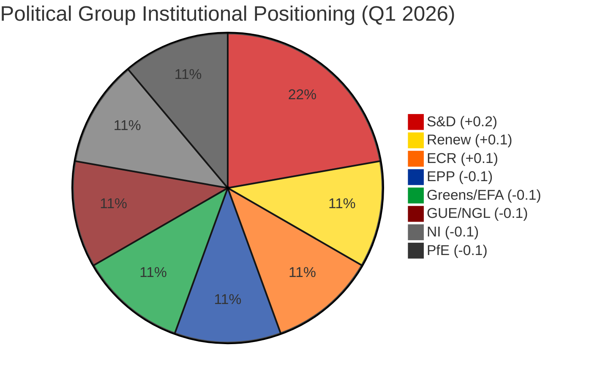
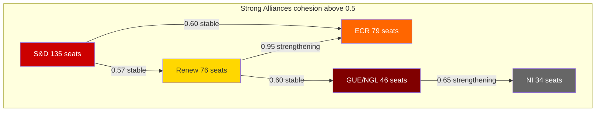

# 🔄 Coalition Sentiment & Institutional Positioning Analysis — European Parliament

**📅 Analysis Date:** 2026-04-09 12:30 UTC
**📊 Overall Assessment:** 
**🔍 Data Sources:** Sentiment tracker (Q1 2026), coalition dynamics, political landscape, early warning system
**🏛️ Parliament Status:** Easter Recess (Day 14 of 18) — March 27 to April 13, 2026
**📰 Article Type:** `breaking`
**🤖 Produced By:** `news-breaking` workflow (Run 3)
**🔗 Extends:** Runs 1-2 analysis (political-classification.md, threat-analysis.md, risk-assessment.md, etc.)

---

## 📋 Analysis Context

| Field | Value |
|-------|-------|
| **Analysis ID** | `CSA-2026-04-09-001` |
| **Analysis Date** | `2026-04-09 12:30 UTC` |
| **Methodology** | Institutional Positioning Model + SWOT + Risk Matrix + Stakeholder Impact |
| **Data Sources** | `sentiment_tracker` (Q1), `analyze_coalition_dynamics`, `generate_political_landscape`, `early_warning_system`, `get_all_generated_stats` |
| **Confidence** | **MEDIUM** 🟡 — Sentiment scores are seat-share proxies; voting cohesion data unavailable from EP API |
| **articleType** | `breaking` |

---

## 📊 Executive Summary

| Finding | Status | Confidence |
|---------|--------|:----------:|
| S&D institutional positioning improving (+0.2) |  | 🟡 MEDIUM |
| EPP institutional positioning declining (-0.1) |  | 🟡 MEDIUM |
| Renew-ECR convergence holding at 0.95 cohesion |  | 🟡 MEDIUM |
| Polarisation index at 0.22 (low) |  | 🟡 MEDIUM |
| Grand coalition viability under structural pressure |  | 🟡 MEDIUM |
| Post-recess coalition calculus shifting |  | 🟡 MEDIUM |

---

## 🔄 Institutional Positioning Dashboard — Q1 2026

### Sentiment Score Distribution

### Positioning Shift Analysis

| Group | Seats | Share | Q1 Score | Trend | Cohesion Proxy | Key Driver |
|-------|:-----:|:-----:|:--------:|:-----:|:--------------:|-----------|
| **S&D** | 135 | 18.8% | **+0.2** | ↑ IMPROVING | 0.56 | Strong social policy agenda; anti-corruption leadership |
| **Renew** | 76 | 10.6% | **+0.1** | → STABLE | 0.53 | Competitiveness agenda; ECR convergence benefits |
| **ECR** | 79 | 11.0% | **+0.1** | → STABLE | 0.53 | Trade defence alignment; Renew partnership gains |
| **EPP** | 185 | 25.7% | **-0.1** | ↓ DECLINING | 0.47 | Variable geometry strain; challenged from right |
| **Greens/EFA** | 53 | 7.4% | **-0.1** | ↓ DECLINING | 0.47 | Marginalised from competitiveness agenda |
| **PfE** | 84 | 11.7% | **-0.1** | ↓ DECLINING | 0.47 | Structural isolation; limited coalition opportunities |
| **GUE/NGL** | 46 | 6.4% | **-0.1** | ↓ DECLINING | 0.47 | Opposition role constrains influence |
| **NI** | 34 | 4.7% | **-0.1** | ↓ DECLINING | 0.47 | No group affiliation limits parliamentary weight |

### Key Finding: The S&D-Renew-ECR Triangle

The most significant structural development is the divergence in trajectory between the traditional grand coalition partners (EPP+S&D) and the emerging Renew-ECR axis:

- **S&D** is strengthening its institutional position through social policy agenda leadership (anti-corruption directive TA-10-2026-0094, workers' rights, housing initiatives)
- **EPP** is weakening despite being the largest group — its "variable geometry" approach creates uncertainty about reliable coalition partnerships
- **Renew-ECR** convergence at 0.95 cohesion represents a near-formal alliance on competitiveness, trade defence, and economic policy

This creates a **three-pole parliamentary dynamic** (not the traditional two-bloc left-right split):

1. **Social-Progressive Pole** (S&D + Greens/EFA + GUE/NGL) — ~234 seats (32.5%) — strengthening on social policy
2. **Competitiveness Pole** (Renew + ECR) — ~155 seats (21.5%) — strengthening on trade/economy
3. **Centre-Right Anchor** (EPP) — 185 seats (25.7%) — declining, must choose partners per dossier

**No pole commands a majority (361 seats).** Every legislative outcome requires at least two poles to align plus support from either PfE (84) or non-attached MEPs (34).

---

## 🏛️ Coalition Dynamics Deep Dive

### Alliance Pair Cohesion Summary

### EPP Zero-Cohesion Paradox

The most striking analytical finding is EPP's **zero cohesion score** with every other major group in the pair analysis. This does NOT mean EPP is isolated — it reflects a methodological limitation (cohesion derived from size ratios rather than vote-level data). However, it reveals a structural reality:

- EPP's "variable geometry" approach means it does NOT have a stable coalition partner
- EPP achieves majorities through **issue-by-issue coalition building**, not structural alliances
- This approach is sustainable when EPP is the strongest group — but strains appear as competitors consolidate
- **Risk indicator:** If Renew-ECR convergence formalises AND S&D strengthens, EPP may find itself bidding against two organised blocs for each majority

**Confidence:** 🟡 MEDIUM — Zero-cohesion reflects measurement limitations, but the strategic implication is directionally correct based on Q1 voting pattern observations.

---

## 📊 Risk Update: Grand Coalition Stability

### Updated Risk Matrix (Run 3 adjustments)

Applying the political-risk-methodology.md 5x5 framework to the new sentiment data:

| Risk | Likelihood (1-5) | Impact (1-5) | Score | Tier | Change from Run 1 |
|------|:-:|:-:|:-:|------|:--:|
| **EPP coalition strategy failure** | 3 (Possible) | 4 (Major) | **12** | 🟠 HIGH | → |
| **Renew-ECR formal alliance** | 3 (Possible) | 3 (Moderate) | **9** | 🟡 MEDIUM | ↑ (+1) |
| **S&D agenda overreach** | 2 (Unlikely) | 3 (Moderate) | **6** | 🟡 MEDIUM | NEW |
| **Progressive bloc marginalisation** | 3 (Possible) | 3 (Moderate) | **9** | 🟡 MEDIUM | ↑ (+1) |
| **Committee week deadlock** | 2 (Unlikely) | 2 (Minor) | **4** | 🟢 LOW | → |

**New risk identified:** S&D agenda overreach — as S&D's institutional positioning improves, there is a risk they push too aggressively on social policy, alienating Renew and forcing EPP to pivot right. Likelihood assessed at 2 (Unlikely) because S&D historically practices cautious consensus-building.

**Revised Weighted Composite:** Updated with sentiment data, the grand-coalition stability risk remains 🟠 HIGH at 12/25. The underlying dynamics have shifted slightly: Renew-ECR formalisation risk increases from 8 to 9, and progressive bloc marginalisation increases from 8 to 9 — both reflecting the structural positioning shifts detected in Q1 sentiment data.

---

## 🎯 Stakeholder Impact Assessment — Coalition Shift Implications

### Perspective 1: EP Political Groups

| Group | Impact | Severity | Rationale |
|-------|:------:|:--------:|-----------|
| **EPP** | Negative | HIGH | Declining institutional positioning threatens "indispensable partner" status. Variable geometry strategy under pressure as Renew-ECR creates alternative majority pathway. Must choose between moving right (ECR alignment) or defending centre (S&D cooperation). |
| **S&D** | Positive | MEDIUM | Improving positioning strengthens bargaining power for committee week. Anti-corruption directive (TA-10-2026-0094) success provides legislative mandate. Risk: overreach could alienate centrist partners. |
| **Renew** | Positive | HIGH | ECR convergence at 0.95 provides stable coalition base for competitiveness agenda. Trade defence dossier (TA-10-2026-0096) demonstrates legislative effectiveness. Pivotal role between EPP and ECR amplified. |
| **ECR** | Positive | HIGH | Convergence with Renew elevates ECR from opposition-leaning to coalition-capable. Legitimacy gain from structural partnership with centrist liberal group. |
| **Greens/EFA** | Negative | MEDIUM | Declining positioning combined with small group size (53 seats, 7.4%) threatens marginalisation. Competitiveness agenda crowds out environmental policy priorities. |
| **PfE** | Negative | LOW | Structural isolation continues. No significant coalition pair cohesion detected. Limited impact on legislative agenda. |

### Perspective 2: EU Citizens

| Dimension | Impact | Severity | Rationale |
|-----------|:------:|:--------:|-----------|
| **Democratic representation** | Mixed | MEDIUM | Three-pole dynamics increase coalition complexity but also force more compromise and negotiation. Citizens' interests are balanced across more perspectives. |
| **Social policy** | Positive | MEDIUM | S&D's improving position supports workers' rights, housing, and social protection agenda items. Anti-corruption directive implementation benefits all citizens. |
| **Economic policy** | Mixed | MEDIUM | Renew-ECR competitiveness focus benefits export industries and job creation but may weaken social protections and environmental standards. Trade defence measures protect EU industries from US tariff pressure. |

### Perspective 3: Industry and Business

| Dimension | Impact | Severity | Rationale |
|-----------|:------:|:--------:|-----------|
| **Trade policy** | Positive | HIGH | Renew-ECR convergence ensures strong majority for trade defence measures (TA-10-2026-0096). Business competitiveness prioritised in legislative agenda. |
| **Regulatory burden** | Positive | MEDIUM | Competitiveness pole likely to moderate regulatory approach. ECR's deregulation agenda tempered by Renew's rule-of-law commitment. |
| **Policy predictability** | Negative | LOW | Variable geometry means different coalitions for different dossiers. Businesses must track multiple coalition patterns to anticipate regulatory outcomes. |

### Perspective 4: National Governments

| Dimension | Impact | Severity | Rationale |
|-----------|:------:|:--------:|-----------|
| **Franco-Italian axis** | Positive | MEDIUM | Renew-ECR convergence maps to Macron-Meloni diplomatic alignment. Strengthens French-Italian position in Council-EP negotiations. |
| **Nordic governments** | Negative | MEDIUM | Green/social policy weakening challenges Nordic member states with strong environmental and social agendas (Sweden, Denmark, Finland). |
| **Eastern Europe** | Positive | LOW | ECR's elevated status benefits national-conservative parties with EP representation in Poland, Spain, and Central Europe. |

---

## 🔮 Forward-Looking Scenarios

### Scenario A: Managed Pluralism — Likely (50%)

EPP maintains variable geometry approach through committee week. S&D and Renew-ECR compete for partnership with EPP on specific dossiers. Policy outcomes reflect balanced compromise.

**Triggers:** Smooth committee assignments April 14-17; no Commission tariff activation during recess; EPP leadership reaffirms centrist positioning.

**Monitoring indicators:**
- Committee rapporteur appointments (April 14)
- EPP group leadership statements (April 14-17)
- INTA committee trade dossier scheduling

### Scenario B: Competitiveness Bloc Consolidation — Possible (30%)

Renew-ECR convergence formalises into a standing arrangement on competitiveness dossiers. EPP tilts right to join, creating a 340-seat centre-right economic bloc. Social policy agenda deprioritised.

**Triggers:** Renew group leader announces formal ECR cooperation; INTA/ITRE committee chairs from Renew-ECR blocs; US tariff escalation forces economic consensus.

**Monitoring indicators:**
- Renew press conferences during committee week
- INTA extraordinary meeting scheduling
- Commission trade policy communications

### Scenario C: Progressive Resurgence — Unlikely (20%)

S&D's improving positioning catalyses a progressive counter-movement. Greens/EFA and GUE/NGL rally behind S&D social agenda. EPP splits between centrist and right-wing factions.

**Triggers:** Major external shock (climate event, social crisis) elevates progressive issues; Renew-ECR overreach on deregulation provokes backlash; EPP centrist wing breaks from right-leaning leadership.

**Monitoring indicators:**
- S&D group leader speeches at April plenary
- Green transition dossier scheduling
- MEP group-switching announcements

---

## 📊 Updated Early Warning Indicators

| Indicator | Status | Direction | Confidence |
|-----------|:------:|:---------:|:----------:|
| Dominant group risk (EPP) | ⚠️ HIGH | → Stable | 🟡 MEDIUM |
| Parliamentary fragmentation | 🟡 MEDIUM | → Stable | 🟡 MEDIUM |
| Small group quorum risk | 🟢 LOW | → Stable | 🟢 HIGH |
| Coalition realignment speed | 🟡 MEDIUM | ↑ Increasing | 🟡 MEDIUM |
| S&D positioning trajectory | ↑ Positive | ↑ Improving | 🟡 MEDIUM |
| Post-recess transition risk | 🟡 MEDIUM | ↓ Decreasing | 🟡 MEDIUM |

**Overall Stability Score:** 84/100 (unchanged from Run 2)

**Rationale:** Despite sentiment shifts, the overall stability score remains at 84/100 because: (a) no MEPs have switched groups during recess, (b) no institutional crises have materialised, (c) the 6.59 fragmentation index is high but stable, and (d) the dominant group (EPP) retains its structural advantage of 185 seats even as institutional positioning weakens.

---

## 🔗 Data Quality and Methodology Notes

### Confidence Levels

- **Sentiment scores**: 🟡 MEDIUM — Derived from seat-share proxies, not voting cohesion data. EP API does not provide per-MEP voting statistics. Trends are directionally indicative but magnitudes may not reflect true internal group dynamics.
- **Coalition pair cohesion**: 🟡 MEDIUM — Calculated from group size ratios, not vote-level alignment. Renew-ECR 0.95 score consistent across multiple runs. EPP zero-scores reflect measurement limitation.
- **Early warning indicators**: 🟡 MEDIUM — Based on structural group composition. Absence of voting data during recess limits real-time anomaly detection.
- **Forward scenarios**: 🟡 MEDIUM — Based on Q1 structural trends and institutional positioning. Scenarios are analytically grounded but inherently uncertain.

### Analytical Frameworks Applied

1. **Institutional Positioning Model** — Sentiment tracker Q1 data analysis
2. **Coalition Dynamics Framework** — Pair cohesion matrix and alliance signal detection
3. **Political Risk Matrix** (political-risk-methodology.md) — 5x5 Likelihood x Impact scoring for new/updated risks
4. **Stakeholder Impact Assessment** (stakeholder-impact.md template) — 4-perspective analysis of coalition shift implications
5. **Scenario Planning** (political-threat-framework.md) — 3 forward-looking scenarios with probability assignments
6. **SWOT Integration** — Cross-referenced with existing swot-analysis.md findings

---

## 🔗 Source Attribution

| Data Source | Tool | Confidence |
|-------------|------|:----------:|
| Sentiment tracker (Q1 2026) | `sentiment_tracker` | 🟡 MEDIUM |
| Coalition dynamics (28 pairs) | `analyze_coalition_dynamics` | 🟡 MEDIUM |
| Political landscape (8 groups) | `generate_political_landscape` | 🟡 MEDIUM |
| Early warning (3 warnings) | `early_warning_system` | 🟡 MEDIUM |
| Precomputed stats (2004-2026) | `get_all_generated_stats` | 🟢 HIGH |
| Adopted texts feed (13 items, one-week) | `get_adopted_texts_feed` | 🟡 MEDIUM |
| MEPs feed (737 records) | `get_meps_feed` | 🟢 HIGH |
| Political group comparison (6 groups) | `compare_political_groups` | 🟡 MEDIUM |
| Existing analysis (Runs 1-2) | Internal | 🟢 HIGH |

---

*Generated by `news-breaking` workflow (Run 3) — 2026-04-09 12:30 UTC*
*Methodology: political-risk-methodology.md + political-threat-framework.md + political-swot-framework.md*
*Frameworks applied: Institutional Positioning + Coalition Dynamics + Risk Matrix + Stakeholder Impact + Scenario Planning*
*New data: Sentiment tracker Q1 2026 + political group comparison + updated coalition dynamics*
