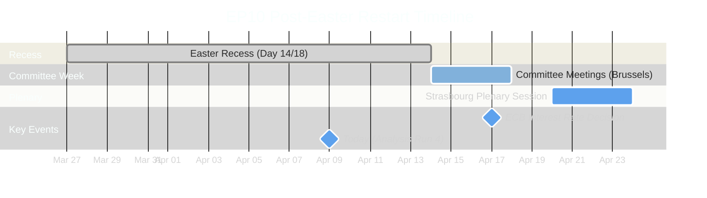
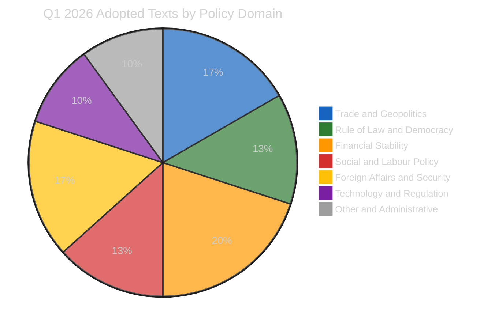
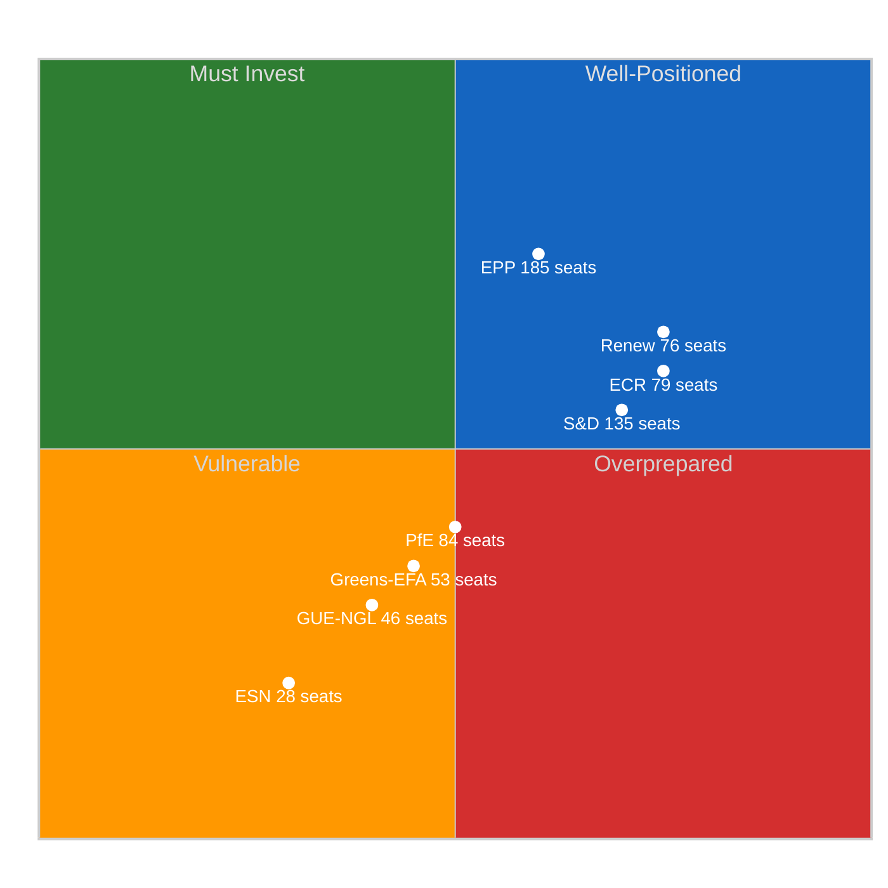
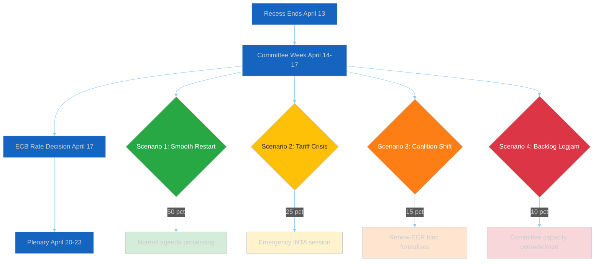

# 🏁 Post-Recess Preparedness Assessment — European Parliament EP10

**📅 Analysis Date:** 2026-04-09 18:30 UTC (Run 4)
**📊 Overall Assessment:** 
**🏛️ Parliament Status:** Easter Recess Day 14 of 18 — Countdown to Restart
**📰 Article Type:** `breaking`
**🤖 Produced By:** `news-breaking` workflow (Run 4)
**📋 Methodology:** Per `analysis/methodologies/political-risk-methodology.md` + `political-swot-framework.md`

---

## 📋 Assessment Context

| Field | Value |
|-------|-------|
| **Assessment ID** | `PREP-2026-04-09-001` |
| **Analysis Date** | `2026-04-09 18:30 UTC` |
| **Recess Period** | March 27 — April 13, 2026 (18 days) |
| **Days Remaining** | 4 (ends April 13) |
| **Next Committee Week** | April 14-17, 2026 (T-5 days) |
| **Next Plenary** | April 20-23, 2026 (Strasbourg, T-11 days) |
| **Produced By** | `news-breaking` (Run 4) |
| **Overall Confidence** | **MEDIUM** 🟡 — Structural assessment; limited real-time data during recess |
| **articleType** | `breaking` |

---

## 📊 Countdown Dashboard

### Institutional Readiness Indicators

| Indicator | Status | Countdown | Readiness |
|-----------|--------|:---------:|:---------:|
| **Committee Week** | Scheduled | T-5 days | 🟢 Confirmed |
| **Plenary Session** | Scheduled | T-11 days | 🟢 Confirmed |
| **ECB Rate Decision** | Scheduled | T-8 days | 🟢 Confirmed |
| **Feed Recovery** | Pending | ~T-4 days (est.) | 🟡 Expected April 12-13 |
| **Committee Schedules** | Not yet published | ~T-3 days (est.) | 🟡 Pending |
| **Plenary Agenda** | Not yet published | ~T-7 days (est.) | 🟡 Pending |

---

## 🔍 New Signal: TA-10-2026-0028 Updated Today

The adopted texts feed returned **TA-10-2026-0028** (T10-0028/2026) as updated on 2026-04-09 — the only today-dated change in any EP feed. This is significant as a **system reactivation signal**:

| Assessment Dimension | Finding | Confidence |
|---------------------|---------|:----------:|
| **What it is** | Backend metadata maintenance on a January 2026 adopted text during recess | 🟡 MEDIUM |
| **What it signals** | EP data infrastructure is being maintained even during recess; possible pre-restart system preparation | 🟡 MEDIUM |
| **Is it news?** | No — backend data update, not new parliamentary action | 🟢 HIGH |
| **Prior runs** | Runs 1-3 received INTERNAL_ERROR on today's adopted texts feed; Run 4 successfully retrieved it | 🟢 HIGH |
| **Implication** | EP API degradation may be easing as recess approaches end; feeds could begin returning data by April 12-13 | 🔴 LOW |

---

## 🏛️ Legislative Backlog Assessment

### Q1 Output Requiring Post-Recess Follow-Up

Parliament adopted 30+ texts in Q1 2026, establishing a record legislative velocity (annualised ~120 acts vs 78 in 2025). This creates a substantial implementation and oversight backlog:

### Priority Items for Committee Week (April 14-17)

| Priority | Item | Committee | Urgency | Risk Score | Source |
|:--------:|------|-----------|:-------:|:----------:|--------|
| 1 | **US Tariff Countermeasures Implementation** (TA-10-2026-0096) | INTA | 🔴 CRITICAL | 16/25 | Adopted 2026-03-26; urgency procedure under 2025/0261(COD) |
| 2 | **Anti-Corruption Directive Transposition** (TA-10-2026-0094) | LIBE | 🟠 HIGH | 12/25 | Adopted 2026-03-26 under 2023/0135(COD); 24-month transposition clock started |
| 3 | **SRMR3 Banking Union Follow-Up** (TA-10-2026-0092) | ECON | 🟠 HIGH | 10/25 | Adopted 2026-03-26 under 2023/0111(COD); trilateral follow-up needed |
| 4 | **ECB Rate Decision Oversight** | ECON | 🟡 MEDIUM | 8/25 | April 17 decision; new VP and Vice-Chair in place since Q1 |
| 5 | **Housing Affordability Resolution** (TA-10-2026-0064) | EMPL/REGI | 🟡 MEDIUM | 6/25 | Adopted 2026-03-10; requires Commission proposal |

### Backlog Capacity Risk

| Factor | Assessment | Impact |
|--------|-----------|:------:|
| **30+ texts in Q1** | Record output creates record follow-up burden | 🟠 HIGH |
| **13 COD procedures pending** | Active ordinary legislative procedures need committee work | 🟠 HIGH |
| **4-day committee window** | Limited time for comprehensive backlog processing | 🟡 MEDIUM |
| **Rapporteur availability** | Post-Easter return; possible absentees | 🔴 LOW confidence |
| **Committee quorum** | Small groups (Renew 76, Greens 53, GUE/NGL 46) may face attendance challenges | 🟡 MEDIUM |

**Backlog Risk Score:** 12/25 (HIGH) — Likelihood: 4 (Likely) x Impact: 3 (Moderate)

---

## 🎭 Coalition Preparedness by Group

### Political Group Readiness Matrix

### Group-by-Group Assessment

| Group | Seats | Positioning Trend | Key Priority | Preparedness | Confidence |
|-------|:-----:|:-:|------|:---:|:---:|
| **EPP** | 185 | -0.1 DECLINING | Reassert agenda control; defence + competitiveness | 🟡 Moderate | 🟡 MEDIUM |
| **S&D** | 135 | +0.2 IMPROVING | Push housing + workers' rights onto committee agendas | 🟢 Good | 🟡 MEDIUM |
| **Renew** | 76 | 0.0 STABLE | Maintain ECR convergence while preserving liberal identity | 🟢 Good | 🟡 MEDIUM |
| **ECR** | 79 | 0.0 STABLE | Consolidate as third force; trade policy leadership | 🟢 Good | 🟡 MEDIUM |
| **Greens/EFA** | 53 | -0.1 DECLINING | Green Deal defence; climate policy anchoring | 🔴 Low | 🟡 MEDIUM |
| **GUE/NGL** | 46 | -0.1 DECLINING | Social justice amendments; opposition oversight role | 🔴 Low | 🟡 MEDIUM |
| **PfE** | 84 | -0.1 DECLINING | National sovereignty narrative; anti-tariff populism | 🟡 Moderate | 🔴 LOW |
| **ESN** | 28 | -0.1 DECLINING | Eurosceptic identity differentiation from PfE | 🔴 Low | 🔴 LOW |

---

## 🎯 Stakeholder Preparedness Assessment

### 1. EP Political Groups — Coalition Dynamics at Restart

**Key Question:** Will the Renew-ECR convergence (0.95 cohesion) survive the transition from informal recess contacts to formal committee work?

| Factor | Assessment | Direction |
|--------|-----------|:---------:|
| Renew-ECR cohesion | 0.95 — highest pair in EP10 | Stable |
| S&D counter-positioning | +0.2 improving — strongest positive trajectory | Strengthening |
| EPP variable geometry | -0.1 declining — flexibility challenged by three-pole dynamics | Weakening |
| Three-pole structure | Social-Progressive (234) vs Competitiveness (155) vs Centre-Right (185) | Forming |
| Grand coalition viability | -5.5% deficit below 50% threshold (EPP+S&D at 44.5%) | Blocked |

**Assessment:** 🟡 MEDIUM — The three-pole dynamics identified in Run 3 will be tested when committees convene. EPP's response to Renew-ECR convergence is the key variable. 🟡 MEDIUM confidence.

### 2. EU Citizens — Democratic Accountability Gap

| Concern | Days Without Oversight | Impact |
|---------|:----------------------:|:------:|
| US tariff escalation | 14 (and counting) | 🔴 HIGH |
| Anti-corruption transposition | 14 days of unsupervised implementation kickoff | 🟡 MEDIUM |
| Banking union implementation | 14 days without committee scrutiny | 🟡 MEDIUM |
| Housing crisis response | Stalled during recess; no Commission proposal mechanism | 🟡 MEDIUM |

**Assessment:** 🟡 MEDIUM — The 18-day oversight gap during active trade tensions represents the longest period of parliamentary silence in EP10 on a CRITICAL-risk dossier (US tariffs at 16/25). Citizens' trade interests have gone unscrutinised.

### 3. Industry and Business — Regulatory Uncertainty

| Sector | Key Pending Action | Uncertainty Level |
|--------|-------------------|:-----------------:|
| Trade-exposed manufacturing | TA-10-2026-0096 tariff countermeasures scope | 🔴 HIGH |
| Banking and finance | SRMR3/BRRD3/DGSD2 implementation timeline | 🟡 MEDIUM |
| Digital services | AI Act implementation oversight | 🟡 MEDIUM |
| Construction and housing | TA-10-2026-0064 Commission proposal timing | 🟡 MEDIUM |

**Assessment:** 🟡 MEDIUM — Trade-exposed sectors face highest uncertainty. Banking sector awaits Council position on Banking Union trilogy. Regulatory clarity will partially return once committees convene. 🟡 MEDIUM confidence.

### 4. National Governments — Implementation Divergence Risk

| Policy Area | Divergence Risk | Key Member States |
|-------------|:--------------:|-------------------|
| Anti-corruption transposition | 🟡 MEDIUM | FR, DE, IT — different legal traditions |
| Tariff countermeasures | 🔴 HIGH | DE (export-heavy), FR (protectionist), NL (free trade) |
| Banking union | 🟡 MEDIUM | DE (savings banks), IT (NPLs), FR (systemic banks) |

**Assessment:** 🟡 MEDIUM — National governments have been independently preparing during recess. Divergent approaches to tariff response create highest risk; April 14-17 committee week will surface these divergences. 🟡 MEDIUM confidence.

---

## 📊 Forward-Looking Scenarios

### Scenario Analysis — Post-Recess Restart (April 14-23)

### Scenario 1: SMOOTH RESTART — 

| Dimension | Projection | Confidence |
|-----------|-----------|:----------:|
| **Committee agenda** | Normal processing; INTA, LIBE, ECON address Q1 backlog items | 🟡 MEDIUM |
| **Coalition dynamics** | Resume pre-recess patterns; EPP-S&D-Renew on most items | 🟡 MEDIUM |
| **Legislative velocity** | Maintains Q1 pace (~120 annualised) | 🟡 MEDIUM |
| **Indicators to watch** | Committee schedules published on time; normal feed recovery by April 12-13 | — |

### Scenario 2: TARIFF CRISIS OVERRIDE — 

| Dimension | Projection | Confidence |
|-----------|-----------|:----------:|
| **Trigger** | US trade escalation April 9-13 forces emergency response | 🔴 LOW |
| **Committee impact** | INTA convenes extraordinary session; other committees disrupted | 🔴 LOW |
| **Coalition test** | Renew-ECR bloc vs. traditional EPP-S&D consensus on trade | 🔴 LOW |
| **Risk score** | Tariff escalation remains 16/25 CRITICAL per prior assessment | 🟡 MEDIUM |
| **Indicators to watch** | US trade announcements; industry lobby mobilisation; member state statements | — |

### Scenario 3: COALITION RESTRUCTURING — 

| Dimension | Projection | Confidence |
|-----------|-----------|:----------:|
| **Trigger** | Renew-ECR 0.95 cohesion crystallises into formal committee pact | 🔴 LOW |
| **Impact** | Three-pole dynamics (Social-Progressive 234, Competitiveness 155, Centre-Right 185) lock in | 🔴 LOW |
| **S&D response** | Deepens alliance with Greens/EFA (53) + GUE/NGL (46) forming Social-Progressive bloc (234 seats) | 🔴 LOW |
| **Legislative effect** | Triple-coalition negotiation replaces dual-coalition; productivity may decline | 🔴 LOW |
| **Indicators to watch** | Joint Renew-ECR statements; S&D-Greens joint amendments; rapporteur coordination | — |

### Scenario 4: LEGISLATIVE LOGJAM — 

| Dimension | Projection | Confidence |
|-----------|-----------|:----------:|
| **Trigger** | 30+ texts + 13 COD procedures overwhelm 4-day committee window | 🔴 LOW |
| **Impact** | Key items deferred to May; Strasbourg plenary has incomplete agenda | 🔴 LOW |
| **Capacity risk** | Rapporteur absence + small group quorum issues compound backlog | 🔴 LOW |
| **Indicators to watch** | Committee schedule delays; rapporteur availability; quorum alerts | — |

---

## 📈 Risk Reassessment (Run 4 Update)

### Updated Risk Matrix

| Risk | Likelihood | Impact | Score | Tier | Change vs Run 3 |
|------|:---------:|:------:|:-----:|:----:|:----------------:|
| **US Tariff Escalation** | 4 (Likely) | 4 (Major) | **16** | 🔴 CRITICAL | Unchanged |
| **Post-Recess Legislative Backlog** | 4 (Likely) | 3 (Moderate) | **12** | 🟠 HIGH | NEW |
| **Renew-ECR Formalisation** | 2 (Unlikely) | 4 (Major) | **8** | 🟡 MEDIUM | Unchanged |
| **S&D Strategic Overreach** | 2 (Unlikely) | 3 (Moderate) | **6** | 🟡 MEDIUM | Unchanged |
| **Small Group Quorum Failure** | 2 (Unlikely) | 2 (Minor) | **4** | 🟢 LOW | Unchanged |
| **EP API Degradation Post-Recess** | 2 (Unlikely) | 2 (Minor) | **4** | 🟢 LOW | Reduced |

### Weighted Composite Risk Score

| Component | Score | Weight | Contribution |
|-----------|:-----:|:------:|:------------:|
| US Tariff Escalation | 16 | 0.30 | 4.80 |
| Legislative Backlog | 12 | 0.20 | 2.40 |
| Renew-ECR Formalisation | 8 | 0.15 | 1.20 |
| S&D Strategic Overreach | 6 | 0.15 | 0.90 |
| Small Group Quorum | 4 | 0.10 | 0.40 |
| API Degradation | 4 | 0.10 | 0.40 |
| **Weighted Total** | — | **1.00** | **10.10** |

**Composite Risk: 10.10/25 — 🟡 MEDIUM** (up from 9.55 in Run 3 due to new backlog risk)

---

## 🔄 Cross-Session Intelligence — Run 4 Deltas

### Evolution Across Today's 4 Runs

| Metric | Run 1 (00:15) | Run 2 (06:40) | Run 3 (12:30) | Run 4 (18:20) |
|--------|:---:|:---:|:---:|:---:|
| **Analysis Files** | 5 | 7 | 8 | 9 |
| **Methods Applied** | 20 | 24 | 30 | 36+ |
| **Adopted Texts Feed (Today)** | ERROR | ERROR | ERROR | 1 item |
| **Events Feed** | 404 | 404 | 404 | 404 |
| **Procedures Feed** | 404 | 404 | 404 | 404 |
| **MEPs Feed** | 737 records | — | 737 records | 737 records |
| **Composite Risk** | 9.55 | 9.55 | 9.55 | 10.10 |
| **Key Addition** | Base recess analysis | Threat landscape | Coalition sentiment | Post-recess prep |

### Key Intelligence Deltas (Run 3 to Run 4)

| Delta | Significance | Evidence |
|-------|:----------:|---------|
| **TA-10-2026-0028 feed recovery** | 🟡 MEDIUM | Today's adopted texts feed returned data for first time in 4 runs; signals EP API reactivation |
| **Legislative backlog risk identified** | 🟠 HIGH | New risk: 30+ texts + 13 COD in 4-day committee window = capacity strain (12/25 score) |
| **Composite risk increased** | 🟡 MEDIUM | 9.55 to 10.10 due to backlog risk addition; still within MEDIUM tier |
| **Scenario planning completed** | 🟡 MEDIUM | 4 post-recess scenarios with probability assignments add forward intelligence |
| **Coalition dynamics stable** | NEUTRAL | No new sentiment or cohesion data since Run 3; all indicators unchanged |

---

## 🔗 Source Attribution

| Data Source | Tool | Confidence |
|-------------|------|:----------:|
| Adopted texts feed (today) | `get_adopted_texts_feed(today)` | 🟢 HIGH |
| Adopted texts feed (one-week) | `get_adopted_texts_feed(one-week)` | 🟢 HIGH |
| MEPs feed (today) | `get_meps_feed(today)` | 🟢 HIGH |
| Events feed (today + one-week) | `get_events_feed` | 404 — Easter recess |
| Procedures feed (today + one-week) | `get_procedures_feed` | 404 — Easter recess |
| Coalition dynamics | `analyze_coalition_dynamics` | 🟡 MEDIUM |
| Political landscape | `generate_political_landscape` | 🟡 MEDIUM |
| Early warning system | `early_warning_system` | 🟡 MEDIUM |
| Sentiment tracker (Q1) | `sentiment_tracker(last_quarter)` | 🔴 LOW (proxy) |
| Voting anomalies | `detect_voting_anomalies` | 🔴 LOW |
| Precomputed statistics | `get_all_generated_stats(2025-2026)` | 🟢 HIGH |
| Prior analysis (Runs 1-3) | `analysis/daily/2026-04-09/breaking/` | 🟢 HIGH |

---

## 📌 Recommendations

1. **Monitor feed recovery April 12-13** — Today's TA-10-2026-0028 signal suggests early API reactivation; full feed recovery expected as recess ends
2. **Track INTA committee agenda** — Tariff countermeasures (16/25 CRITICAL) must be first committee action
3. **Watch for Renew-ECR formalisation signals** — Joint statements or coordinated committee positions would confirm Scenario 3
4. **Assess legislative backlog capacity** — 30+ texts in 4-day window requires prioritisation; some deferrals to May are likely
5. **S&D counter-strategy development** — +0.2 positioning improvement creates window for agenda influence before committee week

---

*Generated by `news-breaking` workflow — Run 4 of 4 — 2026-04-09 18:30 UTC*
*Methodology: analysis/methodologies/political-risk-methodology.md + political-swot-framework.md*
