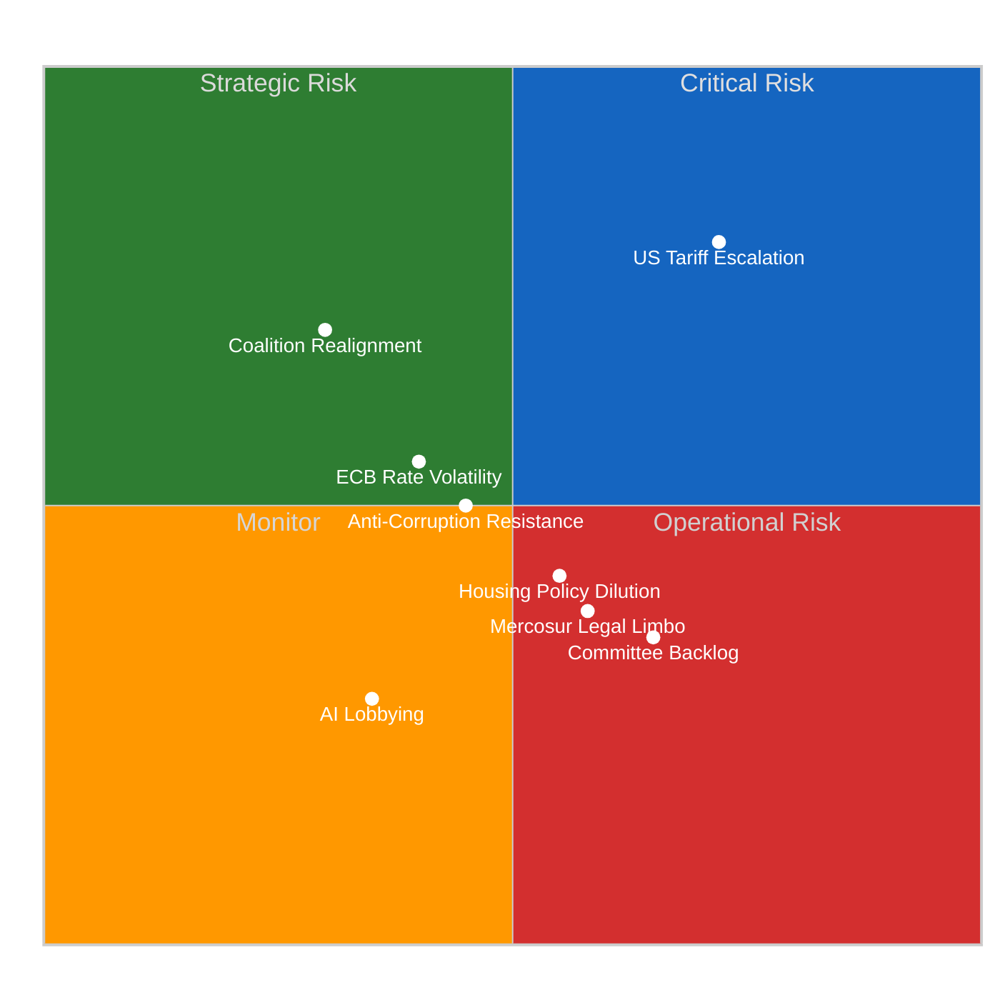
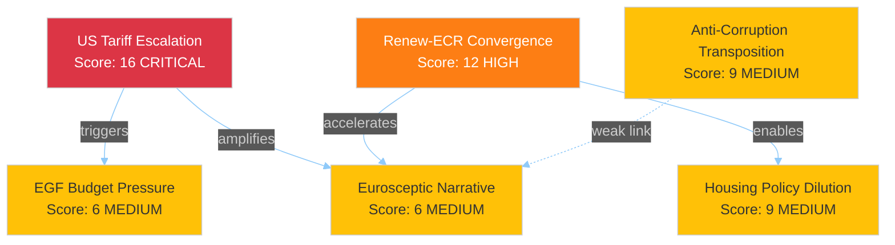

# ⚖️ Risk Assessment — European Parliament Post-Recess Pipeline

**📅 Analysis Date:** 2026-04-09 00:40 UTC
**📰 Article Type:** `breaking`
**🏛️ Parliament Status:** Easter Recess (Day 14 of 18)
**🤖 Produced By:** `news-breaking` workflow
**📋 Methodology:** Per `analysis/methodologies/political-risk-methodology.md` — 5x5 Likelihood x Impact matrix

---

## 📋 Assessment Context

| Field | Value |
|-------|-------|
| **Assessment ID** | `RSK-2026-04-09-001` |
| **Focus** | Post-recess legislative pipeline risks (April 14-23 period) |
| **Risk Categories** | 6 EP-specific categories per methodology |
| **Produced By** | `news-breaking` |
| **Overall Confidence** | **MEDIUM** 🟡 |
| **articleType** | `breaking` |
| **Extends** | `RSK-2026-04-08-001` from yesterday's analysis |

---

## 📊 Risk Matrix Overview

### 5x5 Likelihood x Impact Scoring

---

## 🔴 Category 1: Grand-Coalition Stability (Weight: 0.30)

| Risk | Likelihood (1-5) | Impact (1-5) | Score | Tier |
|------|:-:|:-:|:-:|------|
| Renew-ECR convergence hardening | 3 | 4 | 12 | 🟠 High |
| S&D marginalisation on trade dossiers | 3 | 3 | 9 | 🟡 Medium |
| Greens/EFA exclusion from majority coalitions | 4 | 2 | 8 | 🟡 Medium |

**Analysis:** The Renew-ECR convergence (0.95 cohesion, STRENGTHENING) is the primary grand-coalition stability risk. If this convergence hardens from issue-specific to structural, it fundamentally alters EP10's coalition calculus. The traditional EPP+S&D+Renew grand coalition (396 seats) remains the path of least resistance, but EPP now has a credible alternative via EPP+ECR+Renew (340 seats) supplemented by PfE on selected votes. Likelihood is rated 3 (Possible, 10-30%) because recess limits concrete coalition formation, but Impact is rated 4 (Major) because structural realignment would affect the entire legislative programme.

**Cascading Risk:** If Renew-ECR hardens (L3xI4=12) → S&D marginalisation accelerates (L4xI3=12) → Progressive policy agenda stalls (L4xI4=16). This cascade represents a systemic risk to EP10's balanced legislative programme. 🟡 Medium confidence.

**Bayesian Update from Yesterday:** Prior assessment (RSK-2026-04-08-001) scored this risk similarly. No new evidence today changes the likelihood or impact. Posterior remains L3xI4=12. Confidence unchanged.

---

## 🟠 Category 2: Policy Implementation (Weight: 0.25)

| Risk | Likelihood (1-5) | Impact (1-5) | Score | Tier |
|------|:-:|:-:|:-:|------|
| Anti-Corruption Directive transposition delays | 3 | 3 | 9 | 🟡 Medium |
| Housing crisis resolution dilution | 3 | 3 | 9 | 🟡 Medium |
| AI copyright regulation industry resistance | 2 | 2 | 4 | 🟢 Low |

**Analysis:** The Anti-Corruption Directive (TA-10-2026-0094) faces transposition risk — some member states with weaker anti-corruption frameworks may resist full implementation within the 24-month deadline. Historical precedent suggests 30-40% of member states miss initial transposition deadlines for complex directives. Housing policy (TA-10-2026-0064) risks dilution because it calls for Commission action on a policy area (housing) where subsidiarity concerns are strong.

**Evidence:** TA-10-2026-0094 procedure reference 2023/0135(COD) indicates this was a legislative procedure (not a resolution), making it legally binding. TA-10-2026-0064 is a resolution (non-binding), making implementation dependent on Commission initiative.

**Risk-to-SWOT Integration:** Anti-Corruption transposition delay (Score 9) maps to SWOT Weakness/Threat monitoring. Housing dilution (Score 9) maps to SWOT Threat. 🟡 Medium confidence.

---

## 🟡 Category 3: Budget/MFF (Weight: 0.20)

| Risk | Likelihood (1-5) | Impact (1-5) | Score | Tier |
|------|:-:|:-:|:-:|------|
| EGF budget pressure from trade disruptions | 2 | 3 | 6 | 🟡 Medium |
| Ukraine loan sustainability concerns | 2 | 3 | 6 | �� Medium |

**Analysis:** Budget risks are moderate. The European Globalisation Adjustment Fund (EGF) has already been mobilised for Tupperware Belgium (TA-10-2026-0073), demonstrating responsive budget execution. However, if US tariff escalation causes further industrial closures, EGF demand could exceed available budget allocation. The Ukraine loan (TA-10-2026-0010) represents a contingent liability that increases with conflict duration.

**Evidence:** TA-10-2026-0073 confirms EGF activation for Tupperware Belgium workers. EGF annual budget provides capacity for 3-5 mobilisations per year. 🟡 Medium confidence.

---

## 🟡 Category 4: Electoral Impact (Weight: 0.15)

| Risk | Likelihood (1-5) | Impact (1-5) | Score | Tier |
|------|:-:|:-:|:-:|------|
| Eurosceptic narrative capture during recess | 3 | 2 | 6 | 🟡 Medium |
| Trade policy blame attribution | 2 | 3 | 6 | 🟡 Medium |

**Analysis:** Electoral risks are moderate but temporally compressed. The remaining 4 days of recess provide a narrowing window for eurosceptic narrative capture. PfE and ESN (15.6% combined) can shape public discourse during parliamentary silence, but the approaching committee week (April 14) will re-establish institutional voice. Trade policy blame attribution risk increases if tariff escalation affects consumer prices — the question of "who is responsible" for higher prices becomes electorally salient. �� Medium confidence.

---

## 🟢 Category 5: External/Geopolitical (Weight: 0.10)

| Risk | Likelihood (1-5) | Impact (1-5) | Score | Tier |
|------|:-:|:-:|:-:|------|
| US tariff escalation during recess | 4 | 4 | 16 | 🔴 Critical |
| Mercosur Court of Justice opinion delays | 3 | 2 | 6 | 🟡 Medium |
| Syria situation deterioration | 2 | 2 | 4 | 🟢 Low |

**Analysis:** US tariff escalation is the highest-scoring individual risk (16/25 — Critical tier). This is driven by the combination of high likelihood (geopolitical tensions elevated; tariff rhetoric escalating) and high impact (affects all 27 member states, multiple economic sectors, and the EU's global trade position). Parliament pre-positioned its response through TA-10-2026-0096, but the 18-day recess limits parliamentary oversight of Commission's use of this authority.

**Cascading Risk:** If US tariffs escalate (L4xI4=16) → Commission activates TA-10-2026-0096 countermeasures (L4xI3=12) → Retaliatory tariff spiral (L3xI5=15) → Economic slowdown affecting employment (L3xI4=12). Maximum cascade depth = 4 links. Terminal risk score = 12. 🟡 Medium confidence — geopolitical risks inherently uncertain.

---

## 📊 Weighted Risk Summary

| Category | Weight | Highest Score | Tier | Trend |
|----------|:------:|:------------:|------|:-----:|
| Grand-Coalition Stability | 0.30 | 12 | 🟠 High | → |
| Policy Implementation | 0.25 | 9 | 🟡 Medium | → |
| Budget/MFF | 0.20 | 6 | 🟡 Medium | → |
| Electoral Impact | 0.15 | 6 | 🟡 Medium | ↘ |
| External/Geopolitical | 0.10 | 16 | 🔴 Critical | ↑ |

**Weighted Composite Risk Score:** (12*0.30) + (9*0.25) + (6*0.20) + (6*0.15) + (16*0.10) = 3.60 + 2.25 + 1.20 + 0.90 + 1.60 = **9.55/25**

**Overall Risk Tier:** 🟡 **Medium** (range 5-9: Daily analysis)

**Risk-to-Article Decision:** Composite score 9.55 falls in the Medium tier. No individual risk scores above 15 (the Critical-to-Breaking threshold) except US tariff escalation (16), but this is in the lowest-weighted category (0.10). The weighted composite confirms the analysis-only editorial decision.

---

## 📊 Risk Interconnection Assessment

**Systemic Fragility Assessment:** 2 categories score >= 10 (Grand-Coalition Stability at 12, External/Geopolitical at 16). The methodology threshold for systemic fragility is >= 3 categories at >= 10. EP10's risk landscape is elevated but not systemically fragile. 🟡 Medium confidence.

---

## 🔗 Source Attribution

| Data Source | Confidence |
|-------------|:----------:|
| EP adopted texts (30+ records, year=2026) | 🟢 HIGH |
| Coalition dynamics (Renew-ECR 0.95) | 🟡 MEDIUM |
| Early warning system (stability 84/100) | 🟡 MEDIUM |
| Precomputed statistics (2025-2026) | 🟢 HIGH |
| Risk methodology (5x5 matrix) | 🟢 HIGH |

---

*Generated by `news-breaking` workflow — 2026-04-09 00:40 UTC*
*Methodology: analysis/methodologies/political-risk-methodology.md*
*Extends RSK-2026-04-08-001 from yesterday's analysis with updated interconnection mapping*
