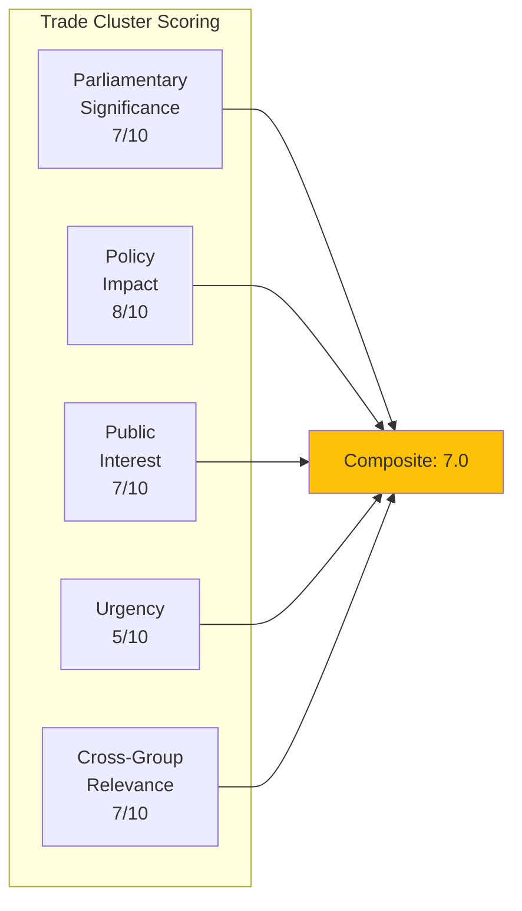
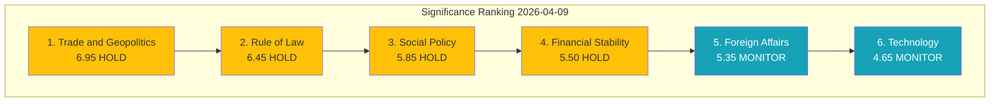

# 📊 Significance Scoring — European Parliament Breaking News Assessment

**📅 Analysis Date:** 2026-04-09 00:25 UTC
**📰 Article Type:** `breaking`
**🏛️ Parliament Status:** Easter Recess (Day 14 of 18)
**🤖 Produced By:** `news-breaking` workflow
**📋 Methodology:** Per `analysis/templates/significance-scoring.md` — 5-dimension weighted model

---

## 📋 Assessment Context

| Field | Value |
|-------|-------|
| **Scoring ID** | `SIG-2026-04-09-001` |
| **Items Scored** | 6 thematic clusters from Q1 2026 adopted texts |
| **Calendar Context** | Easter Recess — cap at min(raw, 7.4) unless raw >= 9.0 |
| **Produced By** | `news-breaking` |
| **Overall Confidence** | **MEDIUM** 🟡 |
| **articleType** | `breaking` |

---

## 📊 Scoring Methodology

### 5 Dimensions (Weighted)

| Dimension | Weight | Description |
|-----------|:------:|-------------|
| Parliamentary Significance | 0.25 | Institutional weight of the action |
| Policy Impact | 0.25 | Breadth and depth of policy effects |
| Public Interest | 0.20 | Citizen salience and media resonance |
| Urgency | 0.15 | Time sensitivity for reporting |
| Cross-Group Relevance | 0.15 | Multi-party engagement level |

### Publication Decision Thresholds

| Score Range | Engine | Label |
|-------------|--------|-------|
| 0.0-3.4 | skip | Archive |
| 3.5-5.4 | hold | Monitor |
| 5.5-7.4 (session) | publish | Publish |
| 5.5-7.4 (recess) | hold | Hold |
| 7.5-8.9 | publish | Priority |
| 9.0-10.0 | publish | BREAKING |

---

## 🎯 Cluster-Level Significance Scoring

### Cluster 1: Trade and Geopolitics

| Dimension | Score | Evidence |
|-----------|:-----:|----------|
| Parliamentary Significance | 7 | 6 adopted texts; TA-10-2026-0096 empowers Commission on tariffs |
| Policy Impact | 8 | Trade defence affects all 27 member states and all economic sectors |
| Public Interest | 7 | US tariffs generate significant media and public attention |
| Urgency | 5 | Texts adopted March 26; no new events today; recess reduces urgency |
| Cross-Group Relevance | 7 | Broad cross-party support for trade defence; EPP+S&D+Renew+ECR aligned |

**Raw Composite:** (7*0.25) + (8*0.25) + (7*0.20) + (5*0.15) + (7*0.15) = 1.75 + 2.00 + 1.40 + 0.75 + 1.05 = **6.95**
**Calendar Adjustment:** Recess cap at min(6.95, 7.4) = **6.95**
**Decision:** HOLD — significant but not breaking during recess. 🟡 Medium confidence.

---

### Cluster 2: Rule of Law and Democracy

| Dimension | Score | Evidence |
|-----------|:-----:|----------|
| Parliamentary Significance | 8 | Anti-Corruption Directive (2023/0135/COD) — major legislative achievement |
| Policy Impact | 7 | EU-wide corruption criminalisation standards; 24-month transposition |
| Public Interest | 6 | Anti-corruption resonates broadly but lacks immediacy during recess |
| Urgency | 4 | Adopted March 26; transposition deadline is 24 months; no urgency today |
| Cross-Group Relevance | 6 | Cross-party support with some ECR/PfE reservations on scope |

**Raw Composite:** (8*0.25) + (7*0.25) + (6*0.20) + (4*0.15) + (6*0.15) = 2.00 + 1.75 + 1.20 + 0.60 + 0.90 = **6.45**
**Calendar Adjustment:** Recess cap at min(6.45, 7.4) = **6.45**
**Decision:** HOLD. 🟡 Medium confidence.

---

### Cluster 3: Financial Stability and Banking

| Dimension | Score | Evidence |
|-----------|:-----:|----------|
| Parliamentary Significance | 6 | ECB appointments confirmed; annual report oversight |
| Policy Impact | 6 | ECB governance affects monetary policy for eurozone |
| Public Interest | 5 | Financial stability matters but ECB appointments are low-salience |
| Urgency | 5 | ECB April 17 rate decision upcoming — moderate time sensitivity |
| Cross-Group Relevance | 5 | ECON committee engagement; limited broader group interest |

**Raw Composite:** (6*0.25) + (6*0.25) + (5*0.20) + (5*0.15) + (5*0.15) = 1.50 + 1.50 + 1.00 + 0.75 + 0.75 = **5.50**
**Calendar Adjustment:** Recess cap at min(5.50, 7.4) = **5.50**
**Decision:** HOLD — borderline; monitor for ECB rate decision impact. 🟡 Medium confidence.

---

### Cluster 4: Social and Labour Policy

| Dimension | Score | Evidence |
|-----------|:-----:|----------|
| Parliamentary Significance | 6 | Housing crisis resolution (TA-10-2026-0064) — S&D priority |
| Policy Impact | 7 | Affordable housing affects millions of EU citizens directly |
| Public Interest | 7 | Housing crisis is one of EU's most salient citizen concerns |
| Urgency | 3 | Resolution adopted March 10; requires Commission proposal — long timeline |
| Cross-Group Relevance | 5 | S&D-led with GUE/NGL and Greens support; EPP cautious |

**Raw Composite:** (6*0.25) + (7*0.25) + (7*0.20) + (3*0.15) + (5*0.15) = 1.50 + 1.75 + 1.40 + 0.45 + 0.75 = **5.85**
**Calendar Adjustment:** Recess cap at min(5.85, 7.4) = **5.85**
**Decision:** HOLD — important policy area but no breaking trigger. 🟡 Medium confidence.

---

### Cluster 5: Technology and Regulation

| Dimension | Score | Evidence |
|-----------|:-----:|----------|
| Parliamentary Significance | 5 | Copyright/AI resolution — non-binding but agenda-setting |
| Policy Impact | 6 | AI regulation affects tech industry, creators, consumers |
| Public Interest | 5 | AI governance generates interest but copyright is niche |
| Urgency | 2 | No implementation deadline; AI Act already in force |
| Cross-Group Relevance | 4 | JURI/CULT committee interest; limited broader engagement |

**Raw Composite:** (5*0.25) + (6*0.25) + (5*0.20) + (2*0.15) + (4*0.15) = 1.25 + 1.50 + 1.00 + 0.30 + 0.60 = **4.65**
**Calendar Adjustment:** Recess cap at min(4.65, 7.4) = **4.65**
**Decision:** MONITOR. 🟡 Medium confidence.

---

### Cluster 6: Foreign Affairs and Security

| Dimension | Score | Evidence |
|-----------|:-----:|----------|
| Parliamentary Significance | 6 | CFSP annual report + Ukraine loan — substantial oversight |
| Policy Impact | 6 | Foreign policy shapes EU's global role |
| Public Interest | 5 | Ukraine remains salient; CFSP reporting is procedural |
| Urgency | 3 | Texts adopted Jan-Feb; no new developments today |
| Cross-Group Relevance | 6 | Defence consensus cuts across EPP, S&D, Renew, ECR |

**Raw Composite:** (6*0.25) + (6*0.25) + (5*0.20) + (3*0.15) + (6*0.15) = 1.50 + 1.50 + 1.00 + 0.45 + 0.90 = **5.35**
**Calendar Adjustment:** Recess cap at min(5.35, 7.4) = **5.35**
**Decision:** MONITOR. 🟡 Medium confidence.

---

## 📊 Significance Ranking Summary

| Rank | Cluster | Raw Score | Adjusted | Decision | Confidence |
|:----:|---------|:---------:|:--------:|----------|:----------:|
| 1 | Trade and Geopolitics | 6.95 | 6.95 | HOLD | 🟡 MEDIUM |
| 2 | Rule of Law and Democracy | 6.45 | 6.45 | HOLD | 🟡 MEDIUM |
| 3 | Social and Labour Policy | 5.85 | 5.85 | HOLD | 🟡 MEDIUM |
| 4 | Financial Stability | 5.50 | 5.50 | HOLD | 🟡 MEDIUM |
| 5 | Foreign Affairs and Security | 5.35 | 5.35 | MONITOR | 🟡 MEDIUM |
| 6 | Technology and Regulation | 4.65 | 4.65 | MONITOR | 🟡 MEDIUM |

**Highest raw score: 6.95** (Trade and Geopolitics) — below the 7.5 Priority threshold and well below the 9.0 Breaking threshold.

**No cluster reaches BREAKING or PRIORITY threshold.** All scores fall within HOLD or MONITOR range during recess, confirming the analysis-only editorial decision.

---

## 🎯 Breaking News Threshold Analysis

| Threshold | Required | Highest Score | Gap | Status |
|-----------|:--------:|:-------------:|:---:|--------|
| BREAKING (raw >= 9.0) | 9.0 | 6.95 | -2.05 | NOT MET |
| BREAKING (>= 7.5 AND Urgency >= 8) | 7.5 + Urgency 8 | 6.95, Urgency 5 | -0.55, -3 | NOT MET |
| PRIORITY (>= 7.5) | 7.5 | 6.95 | -0.55 | NOT MET |
| PUBLISH (>= 5.5 in session) | 5.5 | N/A (recess) | — | N/A |

**Conclusion:** Easter recess Day 14 — no individual development or thematic cluster reaches breaking news threshold. The highest-scoring cluster (Trade) at 6.95 would qualify for HOLD during recess and PUBLISH during session weeks. This confirms the analysis-only output decision.

---

## 📋 Recommendations for Post-Recess Coverage

### Priority 1: Trade and Geopolitics (Score 6.95)
- **Action:** Pre-position for breaking coverage if US tariff escalation triggers Commission countermeasure activation under TA-10-2026-0096
- **Trigger:** Any Commission communication on tariff rate adjustment → immediate re-score with Urgency upgrade

### Priority 2: Rule of Law (Score 6.45)
- **Action:** Monitor Anti-Corruption Directive transposition activity across member states
- **Trigger:** First national transposition bill → re-score; any member state resistance → significance upgrade

### Priority 3: Social Policy (Score 5.85)
- **Action:** Track Commission response to Housing crisis resolution (TA-10-2026-0064)
- **Trigger:** Commission proposal or communication → re-score; April plenary debate → significance upgrade

---

## 🔗 Source Attribution

| Data Source | Confidence |
|-------------|:----------:|
| EP adopted texts (30+ records, year=2026) | 🟢 HIGH |
| EP precomputed statistics (2025-2026) | 🟢 HIGH |
| Coalition dynamics analysis | 🟡 MEDIUM |
| Early warning system | 🟡 MEDIUM |
| Significance scoring methodology | 🟢 HIGH (template v1.0) |

---

*Generated by `news-breaking` workflow — 2026-04-09 00:25 UTC*
*Scoring based on analysis/templates/significance-scoring.md methodology*
