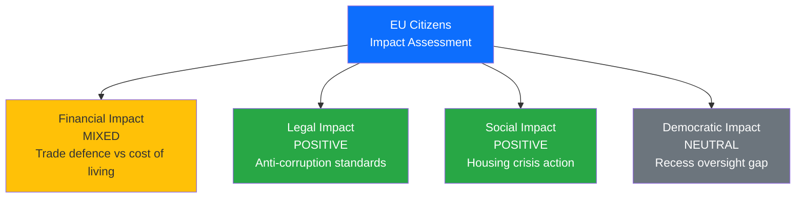
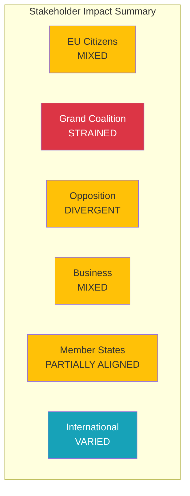

# 👥 Stakeholder Impact Assessment — European Parliament

**📅 Analysis Date:** 2026-04-09 00:30 UTC
**📰 Article Type:** `breaking`
**🏛️ Parliament Status:** Easter Recess (Day 14 of 18)
**�� Produced By:** `news-breaking` workflow
**📋 Methodology:** Per `analysis/templates/stakeholder-impact.md` — 6-group impact model

---

## 📋 Assessment Context

| Field | Value |
|-------|-------|
| **Assessment ID** | `STK-2026-04-09-001` |
| **Focus** | Renew-ECR convergence impact on EP10 stakeholders |
| **Items Assessed** | Coalition dynamics + 6 Q1 thematic clusters |
| **Produced By** | `news-breaking` |
| **Overall Confidence** | **MEDIUM** 🟡 |
| **articleType** | `breaking` |

---

## 🎯 Executive Summary

This stakeholder impact assessment evaluates the effects of two key EP10 dynamics on six stakeholder groups: (1) the Renew-ECR convergence signal (0.95 cohesion, STRENGTHENING trend) and its structural implications for coalition formation, and (2) the post-recess legislative pipeline comprising 30+ Q1 adopted texts across trade, rule of law, financial stability, social policy, technology, and foreign affairs. The assessment identifies EPP and ECR as the primary beneficiaries of current dynamics, S&D and Greens/EFA as the most adversely affected, and EU citizens as experiencing mixed impacts depending on policy domain. �� Medium confidence — structural analysis is robust; behavioural predictions are inherently uncertain during recess.

---

## 🏘️ EU Citizens — Impact Assessment

| Impact Type | Direction | Severity | Evidence |
|-------------|-----------|----------|----------|
| **Financial** | MIXED | Medium | TA-10-2026-0096 (US tariff countermeasures) protects EU industry but may increase consumer prices; TA-10-2026-0004 (financial stability) addresses economic uncertainty |
| **Legal** | POSITIVE | High | TA-10-2026-0094 (Anti-Corruption Directive) establishes new legal protections against corruption across all member states; 24-month transposition deadline |
| **Social** | POSITIVE | Medium | TA-10-2026-0064 (Housing crisis resolution) calls for affordable housing action; TA-10-2026-0050 (Workers' rights) strengthens subcontracting protections |
| **Democratic** | NEUTRAL | Low | 18-day Easter recess reduces parliamentary oversight but is constitutionally normal; electoral reform (TA-10-2026-0006) addresses long-term democratic quality |

**Cui Bono:** Citizens benefit most from the rule-of-law and social policy clusters, but the trade policy cluster creates a tension between industrial protection (jobs) and consumer prices. The Anti-Corruption Directive (TA-10-2026-0094) is the single most citizen-positive development, establishing common EU standards for corruption prosecution. However, the 24-month transposition deadline means tangible effects won't materialise until 2028. 🟡 Medium confidence.

**Second-Order Effects:** If US tariff escalation triggers Commission countermeasures under TA-10-2026-0096, EU consumers may face higher import costs on American goods. This creates a distributional tension between protected industries (steel, aluminium, agriculture) and consumers of imported goods.

---

## 🏛️ Grand Coalition (EPP+S&D+Renew) — Cohesion Impact

| Parameter | Assessment | Evidence |
|-----------|------------|----------|
| **Cohesion Effect** | STRAINS | Renew-ECR convergence (0.95) pulls Renew away from S&D |
| **Coalition Stability** | MODERATE | Traditional EPP+S&D+Renew (396 seats) remains viable but Renew has alternatives |
| **Policy Alignment** | DIVERGING | Trade defence unites all three; housing and social policy divide them |
| **Electoral Positioning** | NEUTRAL | Recess limits visible coalition dynamics |

**Analysis:** The Renew-ECR convergence represents the most significant strain on the traditional grand coalition configuration in EP10. While the EPP+S&D+Renew combination (396 seats) remains the most reliable majority pathway, Renew's strengthening ties with ECR provide it with credible exit options. This reduces S&D's leverage as the "mandatory second partner" — historically, S&D could negotiate aggressively knowing EPP needed them. Now, EPP can credibly threaten to build EPP+Renew+ECR+other configurations on specific dossiers. 🟡 Medium confidence — cohesion scores derive from group size ratios, not voting records.

**Historical Parallel:** EP7 (2009-2014) saw a similar dynamic when ALDE (Renew's predecessor) strengthened ties with ECR on economic liberalisation, temporarily reducing S&D's bargaining power. The parallel suggests convergence may be domain-specific rather than structural.

---

## 🗳️ Opposition Groups — Electoral Positioning

### ECR (79 seats) — POSITIVE Impact

| Parameter | Assessment | Evidence |
|-----------|------------|----------|
| **Electoral Positioning** | POSITIVE | Convergence with Renew enhances mainstream legitimacy |
| **Policy Influence** | INCREASING | Defence, trade, competitiveness — ECR positions becoming majority-compatible |
| **Coalition Access** | EXPANDING | Multiple pathways to majority participation |

**Analysis:** ECR is the single biggest structural winner of current EP10 dynamics. The 0.95 cohesion with Renew, combined with issue-by-issue convergence with EPP on defence and migration, elevates ECR from a "managed opposition" role to a genuine coalition partner. This was visible in the March 26 plenary where cross-party support for TA-10-2026-0096 (US tariff countermeasures) included ECR backing. 🟡 Medium confidence.

### PfE (84 seats) + ESN (28 seats) — MIXED Impact

| Parameter | Assessment | Evidence |
|-----------|------------|----------|
| **Electoral Positioning** | POSITIVE | Rightward EP shift normalises their positions |
| **Policy Influence** | LIMITED | Still excluded from formal coalition building |
| **Cordon Sanitaire** | WEAKENING | Informal rather than absolute; PfE included in some vote outcomes |

**Analysis:** The eurosceptic bloc (15.6% combined) benefits from EP10's rightward drift but remains formally excluded from coalition negotiations. PfE's ideological heterogeneity (ranging from Orban's national-conservative Fidesz to Le Pen's national-populist RN) prevents it from acting as a unified bloc. ESN's smaller size (28 seats) limits its independent influence. �� Medium confidence.

### Greens/EFA (53 seats) — NEGATIVE Impact

| Parameter | Assessment | Evidence |
|-----------|------------|----------|
| **Electoral Positioning** | NEGATIVE | Marginalised by rightward coalition dynamics |
| **Policy Influence** | DECLINING | Green Deal pace slowing; climate ambition reduced |
| **Coalition Access** | LIMITED | Excluded from EPP's preferred right-of-centre configurations |

**Analysis:** Greens/EFA face the most adverse structural position in EP10. The Renew-ECR convergence creates a centre-right coalition pathway that bypasses progressive groups entirely. The March adopted texts show limited Green influence — housing (TA-10-2026-0064) and workers' rights (TA-10-2026-0050) align with S&D rather than distinctive Green positions. The copyright/AI text (TA-10-2026-0066) is one area where Greens maintain relevance. 🟡 Medium confidence.

### GUE/NGL - The Left (46 seats) — NEGATIVE Impact

| Parameter | Assessment | Evidence |
|-----------|------------|----------|
| **Electoral Positioning** | NEUTRAL | Core constituency unchanged |
| **Policy Influence** | DECLINING | 0.60 cohesion with S&D — cooperative but subordinate |
| **Coalition Access** | NARROW | S&D+Greens+Left (234 seats) far below majority |

---

## 🏭 Business and Industry — Economic Impact

| Impact Type | Direction | Severity | Evidence |
|-------------|-----------|----------|----------|
| **Trade Defence** | POSITIVE | High | TA-10-2026-0096 provides countermeasure authority protecting EU industry from US tariffs |
| **Regulatory Burden** | MIXED | Medium | Anti-Corruption Directive (TA-10-2026-0094) adds compliance requirements; measuring instruments directive (TA-10-2026-0029) modernises technical standards |
| **Market Opportunity** | POSITIVE | Medium | EU-Canada cooperation (TA-10-2026-0078) opens alternative trade partnerships |
| **Labour Costs** | NEGATIVE | Low | Workers' rights in subcontracting (TA-10-2026-0050) may increase compliance costs |
| **AI Regulation** | MIXED | Medium | Copyright/AI (TA-10-2026-0066) creates new obligations for tech companies but also legal certainty |

**Analysis:** Business and industry face a mixed impact landscape. The trade defence cluster is unambiguously positive for EU producers facing US tariff threats. However, the rule-of-law cluster (anti-corruption compliance) and social cluster (subcontracting regulation) add regulatory and labour cost pressures. The technology cluster (AI copyright) creates dual effects — compliance costs for AI developers but legal certainty for content creators and publishers. 🟡 Medium confidence.

---

## 🤝 Member States — Council Alignment

| Policy Area | Council Alignment | Key Tensions |
|-------------|-------------------|--------------|
| **Trade defence** | ALIGNED | Broad member state support for tariff countermeasures; Commission mandate |
| **Anti-corruption** | PARTIAL | Northern/Western states aligned; some Central/Eastern resistance to scope |
| **Housing** | OPPOSED | Subsidiarity concerns — housing policy traditionally national competence |
| **ECB governance** | ALIGNED | Eurozone states support strengthened oversight |
| **AI regulation** | PARTIAL | France leads on AI copyright; smaller states defer to larger |
| **Foreign policy** | ALIGNED | Ukraine support consensus; Syria response varies |

**Analysis:** Council alignment is strongest on trade defence and ECB governance — areas where member state interests converge with Parliament's positions. Housing policy faces the most significant Council resistance, as housing has traditionally been a national competence. The Anti-Corruption Directive's transposition will test member state commitment, with likely resistance from states with weaker anti-corruption track records. 🟡 Medium confidence.

---

## 🌍 International Partners — External Impact

| Partner | Impact | Evidence |
|---------|--------|----------|
| **United States** | NEGATIVE | TA-10-2026-0096 directly targets US trade policies; countermeasure authority is a deterrent |
| **Mercosur countries** | UNCERTAIN | Court of Justice opinion (TA-10-2026-0008) + bilateral safeguard (TA-10-2026-0030) create legal uncertainty |
| **Canada** | POSITIVE | TA-10-2026-0078 recommends enhanced EU-Canada cooperation in current geopolitical context |
| **Ukraine** | POSITIVE | TA-10-2026-0010 continues enhanced cooperation on loan support |
| **Ecuador** | POSITIVE | TA-10-2026-0072 establishes Europol cooperation framework |
| **WTO members** | NEUTRAL | TA-10-2026-0086 reaffirms EU's multilateral trade commitment |

---

## 📊 Stakeholder Impact Summary Matrix

| Stakeholder | Overall Direction | Primary Driver | Confidence |
|-------------|:-:|----------------|:----------:|
| EU Citizens | MIXED | Anti-corruption positive / trade costs negative | 🟡 MEDIUM |
| Grand Coalition | STRAINED | Renew-ECR convergence reduces S&D leverage | 🟡 MEDIUM |
| ECR | POSITIVE | Enhanced mainstream legitimacy and coalition access | 🟡 MEDIUM |
| Greens/EFA | NEGATIVE | Marginalised by rightward coalition dynamics | 🟡 MEDIUM |
| Business | MIXED | Trade defence positive / regulatory burden negative | 🟡 MEDIUM |
| Member States | PARTIAL | Trade aligned / housing opposed | 🟡 MEDIUM |
| International | VARIED | US negative / Canada-Ukraine positive | 🟡 MEDIUM |

---

## 🔗 Source Attribution

| Data Source | Confidence |
|-------------|:----------:|
| EP adopted texts (30+ records, year=2026) | 🟢 HIGH |
| Coalition dynamics (Renew-ECR 0.95) | 🟡 MEDIUM |
| Political landscape (8 groups, fragmentation 6.59) | 🟡 MEDIUM |
| Precomputed statistics (2025-2026) | 🟢 HIGH |
| Stakeholder impact methodology template | 🟢 HIGH |

---

*Generated by `news-breaking` workflow — 2026-04-09 00:30 UTC*
*Methodology: analysis/templates/stakeholder-impact.md + analysis/methodologies/political-style-guide.md*
