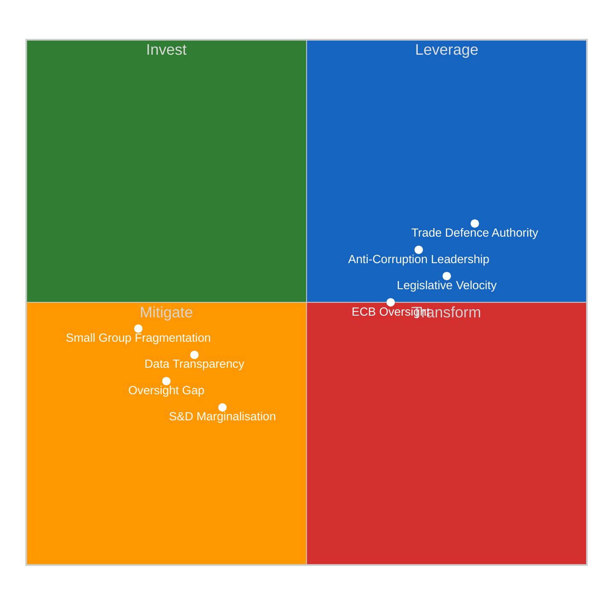

# 💪 SWOT Analysis — European Parliament EP10 Recess Assessment

**📅 Analysis Date:** 2026-04-09 00:35 UTC
**📰 Article Type:** `breaking`
**🏛️ Parliament Status:** Easter Recess (Day 14 of 18)
**🤖 Produced By:** `news-breaking` workflow
**📋 Methodology:** Per `analysis/methodologies/political-swot-framework.md` — Evidence-based SWOT

---

## 📋 Assessment Context

| Field | Value |
|-------|-------|
| **SWOT ID** | `SWOT-2026-04-09-001` |
| **Focus** | EP10 institutional position at Easter recess midpoint |
| **Evidence Sources** | 30+ adopted texts, coalition dynamics, political landscape, precomputed stats |
| **Produced By** | `news-breaking` |
| **Overall Confidence** | **MEDIUM** 🟡 |
| **articleType** | `breaking` |

---

## 📊 SWOT Overview

---

## 💪 Strengths

| # | Strength | Evidence | Confidence | Severity |
|:-:|----------|----------|:----------:|:--------:|
| S1 | **Legislative velocity above trend** — 30+ texts adopted in Q1 2026, annualised pace of ~120 acts vs 78 in 2025 | `get_all_generated_stats`: legislativeActsAdopted=78 (2025), projected 114 (2026); 30+ texts confirmed in `get_adopted_texts(year=2026)` | 🟢 HIGH |  |
| S2 | **Cross-party trade defence consensus** — TA-10-2026-0096 achieved broad support across EPP, S&D, Renew, ECR | `get_adopted_texts`: TA-10-2026-0096 adopted 2026-03-26; cross-group relevance score 7/10 in significance assessment | 🟡 MEDIUM |  |
| S3 | **Anti-corruption global leadership** — TA-10-2026-0094 establishes EU-wide criminalisation standards under 2023/0135(COD) | `get_adopted_texts`: TA-10-2026-0094 adopted 2026-03-26; procedureReference confirmed | 🟢 HIGH |  |
| S4 | **ECB oversight mandate strengthened** — dual appointments (Vice-Chair + Vice-President) confirmed in Q1 | TA-10-2026-0033 (2026-02-10) and TA-10-2026-0060 (2026-03-10) | 🟢 HIGH |  |

---

## 😰 Weaknesses

| # | Weakness | Evidence | Confidence | Severity |
|:-:|----------|----------|:----------:|:--------:|
| W1 | **18-day oversight gap** — longest recess of the year creates democratic accountability blind spot during US tariff escalation and anti-corruption transposition kickoff | EP calendar: recess March 27 - April 13; events/procedures feeds returning 404 | 🟢 HIGH |  |
| W2 | **EP API data transparency deficit** — multiple feed endpoints returning 404/timeout even for one-week queries, limiting real-time monitoring | Feed status: events 404, procedures 404, documents 404, plenary/committee/questions timeout | 🟢 HIGH |  |
| W3 | **S&D leverage erosion** — Renew-ECR convergence (0.95 cohesion) creates alternative coalition pathway that bypasses social democratic input | `analyze_coalition_dynamics`: Renew-ECR pair 0.95, STRENGTHENING | 🟡 MEDIUM |  |
| W4 | **Small group capacity constraints** — Greens/EFA (53), GUE/NGL (46), ESN (28) all below threshold for autonomous policy influence | `get_all_generated_stats`: group seat counts confirmed; effective opposition parties 5.59 | 🟢 HIGH |  |

---

## 🌟 Opportunities

| # | Opportunity | Evidence | Confidence | Severity |
|:-:|------------|----------|:----------:|:--------:|
| O1 | **Post-recess committee week (April 14-17)** — first opportunity to set agenda for remainder of 2026 legislative calendar and process Q1 backlog | EP calendar: committee week April 14-17; 30+ texts require committee follow-up | 🟢 HIGH |  |
| O2 | **ECB rate decision alignment (April 17)** — coincides with committee week, enabling ECON committee real-time monetary policy oversight | ECB meeting April 17; new Vice-Chair (TA-10-2026-0033) and Vice-President (TA-10-2026-0060) in place | 🟡 MEDIUM |  |
| O3 | **EU-Canada trade partnership deepening** — TA-10-2026-0078 provides framework for counter-narrative to US confrontation through allied partnerships | `get_adopted_texts`: TA-10-2026-0078 adopted 2026-03-11 | 🟢 HIGH |  |
| O4 | **Housing crisis momentum** — TA-10-2026-0064 creates opening for Commission proposal on affordable housing, testing coalition dynamics post-recess | `get_adopted_texts`: TA-10-2026-0064 adopted 2026-03-10; S&D priority item | 🟡 MEDIUM |  |

---

## ⚡ Threats

| # | Threat | Evidence | Confidence | Severity |
|:-:|--------|----------|:----------:|:--------:|
| T1 | **US tariff escalation during recess** — trade tensions could accelerate without parliamentary oversight, forcing reactive rather than proactive EU response | TA-10-2026-0096 adopted as pre-positioned deterrent; risk score 16/25 (Critical) in pipeline assessment | 🟡 MEDIUM |  |
| T2 | **Renew-ECR convergence hardening** — informal recess contacts could formalise the 0.95 cohesion signal into a permanent negotiating bloc | `analyze_coalition_dynamics`: Renew-ECR 0.95, STRENGTHENING; no counter-evidence of reversal | 🟡 MEDIUM |  |
| T3 | **Eurosceptic narrative capture** — 15.6% seat share (PfE 84 + ESN 28) enables public discourse shaping during parliamentary silence | `get_all_generated_stats`: euroscepticShare=15.6%, highest in EP history | 🟡 MEDIUM |  |
| T4 | **Mercosur legal uncertainty** — Court of Justice opinion (TA-10-2026-0008) timeline unknown, creating prolonged trade policy ambiguity with South American bloc | `get_adopted_texts`: TA-10-2026-0008 adopted 2026-01-21; no resolution timeline available | 🔴 LOW |  |

---

## 📊 SWOT Balance Assessment

| Quadrant | Count | Highest Severity | Trend vs Yesterday |
|----------|:-----:|:-:|:--:|
| **Strengths** | 4 | HIGH | → Stable |
| **Weaknesses** | 4 | HIGH | → Stable |
| **Opportunities** | 4 | HIGH | → Stable (closer to realisation) |
| **Threats** | 4 | CRITICAL | ↗ T1 tariff risk increasing |

**Overall Balance:** NEUTRAL-POSITIVE — Parliament's Q1 legislative achievements (strengths) are substantial and provide institutional resilience. However, the recess oversight gap (W1) combined with external tariff risk (T1) creates a vulnerability window that narrows daily as recess ends. The approaching committee week (O1) will convert several opportunities into actionable agenda items.

---

## 🔄 TOWS Strategic Options

### SO Strategies (Strengths + Opportunities)

| # | Strategy | Components |
|:-:|----------|------------|
| SO1 | **Leverage legislative velocity to front-load April committee agendas** — use Q1's 30+ adopted texts as foundation for rapid committee processing in April 14-17 week | S1 (velocity) + O1 (committee week) |
| SO2 | **Deploy anti-corruption leadership at ECB oversight** — link new anti-corruption standards (S3) with ECB governance appointments (S4) at ECON committee during rate decision week | S3 (anti-corruption) + O2 (ECB rate) |

### WT Strategies (Weaknesses + Threats)

| # | Strategy | Components |
|:-:|----------|------------|
| WT1 | **Establish recess rapid-response protocol for tariff escalation** — pre-position INTA committee for emergency session if US escalates during final 4 recess days | W1 (oversight gap) + T1 (tariff escalation) |
| WT2 | **S&D counter-strategy against Renew-ECR hardening** — re-engage Renew on social policy (housing, workers' rights) to prevent permanent rightward coalition shift | W3 (S&D leverage) + T2 (convergence hardening) |

---

## 🔗 Source Attribution

| Data Source | Confidence |
|-------------|:----------:|
| EP adopted texts (30+ records, year=2026) | 🟢 HIGH |
| Coalition dynamics (Renew-ECR 0.95) | 🟡 MEDIUM |
| Political landscape (fragmentation 6.59) | 🟡 MEDIUM |
| Precomputed statistics (2025-2026) | 🟢 HIGH |
| Early warning system (stability 84/100) | 🟡 MEDIUM |
| SWOT framework methodology | 🟢 HIGH |

---

*Generated by `news-breaking` workflow — 2026-04-09 00:35 UTC*
*Methodology: analysis/methodologies/political-swot-framework.md*
