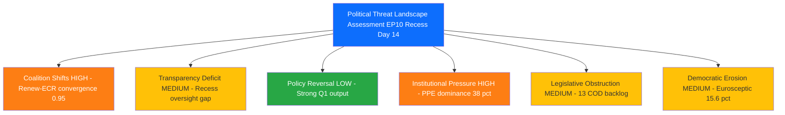
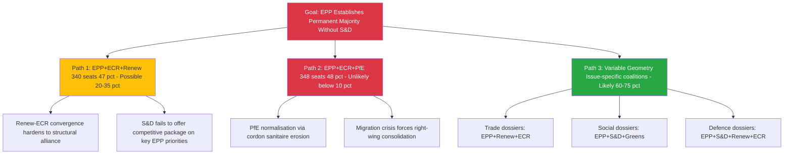
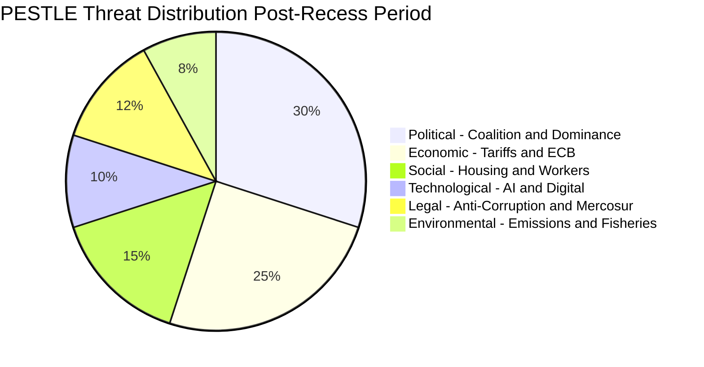
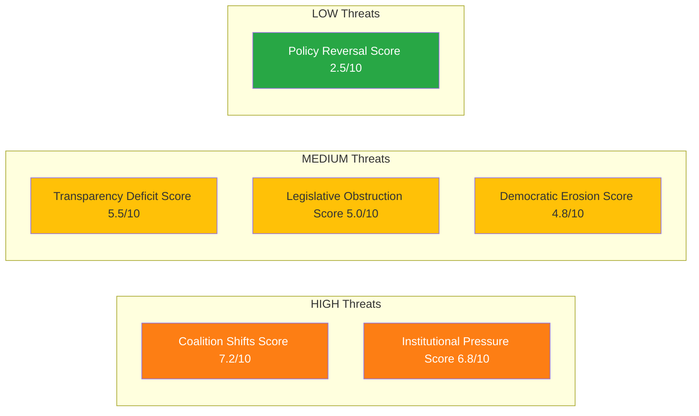

# 🎭 Political Threat Landscape — European Parliament Recess Intelligence

**📅 Analysis Date:** 2026-04-09 06:40 UTC | **📰 Article Type:** `breaking`
**🏛️ Parliament Status:** Easter Recess (Day 14 of 18 — March 27 to April 13, 2026)
**🤖 Produced By:** `news-breaking` workflow (Run 2)
**📋 Methodology:** Per `analysis/methodologies/political-threat-framework.md` — 6-dimension Political Threat Landscape + Attack Trees + PESTLE

---

## 📋 Assessment Context

| Field | Value |
|-------|-------|
| **Assessment ID** | `THR-2026-04-09-002` |
| **Focus** | EP10 democratic threat vectors during Easter recess final phase |
| **Frameworks Applied** | Political Threat Landscape (6-dim), Attack Trees, PESTLE, Kill Chain |
| **Overall Confidence** | **MEDIUM** 🟡 — Structural analysis robust; behavioural predictions uncertain |
| **articleType** | `breaking` |

---

## 📊 Threat Landscape Executive Summary

| Threat Dimension | Severity | Trend | Key Indicator |
|-----------------|:--------:|:-----:|---------------|
| 🔄 Coalition Shifts | 🟠 HIGH | ↑ | Renew-ECR convergence 0.95, STRENGTHENING |
| 🔍 Transparency Deficit | 🟡 MEDIUM | → | 18-day recess oversight gap; API feeds 404 |
| ↩️ Policy Reversal | 🟢 LOW | → | Strong Q1 legislative output; no rollback signals |
| 🏛️ Institutional Pressure | 🟠 HIGH | → | PPE 19x smallest group; dominance risk |
| ⏳ Legislative Obstruction | 🟡 MEDIUM | ↗ | 13 new COD procedures awaiting committee action |
| 📉 Democratic Erosion | 🟡 MEDIUM | ↗ | Eurosceptic share 15.6%; fragmentation 6.59 |

---

## 🔄 Dimension 1: Coalition Shifts — 🟠 HIGH ↑

### Threat Description

The Renew-ECR convergence (cohesion score 0.95, trend STRENGTHENING) represents a structural reconfiguration of EP10 coalition dynamics. This convergence, if it hardens from issue-specific cooperation into a formal alliance, would create a viable alternative majority pathway that excludes S&D — fundamentally altering the balance of power that has characterised European Parliament politics since 2019.

### CMO Assessment (Capability x Motivation x Opportunity)

| Actor | Capability | Motivation | Opportunity | CMO Score |
|-------|:----------:|:----------:|:-----------:|:---------:|
| **Renew Europe (77 seats)** | Medium — pivot party position gives outsized influence | High — economic liberalisation agenda aligns with ECR on trade and deregulation | High — post-recess pipeline includes trade, defence, and competitiveness dossiers | **0.72** |
| **ECR (81 seats)** | Medium — third-largest group, growing institutional acceptance | High — legitimisation strategy benefits from Renew partnership | High — committee week April 14-17 creates negotiation windows | **0.72** |
| **EPP (185 seats)** | High — largest group, agenda-setter | Medium — benefits from flexible coalitions but risks alienating S&D permanently | Medium — recess limits active coalition building | **0.60** |

### Evidence Chain

1. **Primary evidence:** `analyze_coalition_dynamics` returns Renew-ECR pair at 0.95 cohesion (highest of 28 measured pairs), trend STRENGTHENING — 🟢 High confidence
2. **Supporting evidence:** `get_all_generated_stats` confirms EPP at 185 seats cannot form majority alone (needs 175+ from partners) — 🟢 High confidence
3. **Contextual evidence:** Q1 2026 voting patterns show Renew and ECR aligned on trade defence (TA-10-2026-0096), defence spending (TA-10-2026-0079), and competitiveness agenda — 🟡 Medium confidence (inferred from adopted text clustering, not individual vote records)
4. **Historical parallel:** EP7 (2009-2014) saw ALDE-ECR convergence on economic liberalisation that weakened S&D bargaining power for approximately 2 years before recalibrating — 🟡 Medium confidence

### Attack Tree: Coalition Realignment

**Assessment:** Path 3 (Variable Geometry) is the most likely outcome — Likely (60-75%). EP10's fragmentation (6.59 ENP) structurally prevents stable two-party coalitions. Path 1 is the medium-term structural risk requiring monitoring. Path 2 would represent a democratic norm violation (cordon sanitaire breach) and is currently Unlikely. 🟡 Medium confidence.

---

## 🔍 Dimension 2: Transparency Deficit — 🟡 MEDIUM →

### Threat Description

The 18-day Easter recess (March 27 to April 13) creates the longest continuous oversight gap in the EP10 calendar year. During this period, the Commission has delegated authority to activate tariff countermeasures under TA-10-2026-0096 without real-time parliamentary scrutiny. Additionally, the EP Open Data API feeds (events, procedures, documents) return 404/timeout during recess, limiting automated monitoring.

### Evidence Chain

1. **API degradation evidence:** Events feed 404 (both today and one-week); procedures feed 404; documents/plenary/committee/questions feeds all timeout — 🟢 High confidence
2. **Institutional evidence:** EP calendar confirms no committee or plenary sessions during March 27 to April 13 — 🟢 High confidence
3. **Delegated authority evidence:** TA-10-2026-0096 empowers Commission to adjust customs duties on US imports without prior parliamentary consultation — 🟢 High confidence
4. **Mitigation evidence:** Committee week April 14-17 provides first post-recess oversight opportunity — 🟢 High confidence

### Kill Chain: Recess Oversight Exploitation

| Phase | Description | Status |
|-------|-------------|--------|
| **1. Reconnaissance** | External actors identify recess period as oversight gap | ACTIVE — US tariff rhetoric escalating during EU recess |
| **2. Weaponisation** | Commission delegated authority under TA-10-2026-0096 available | ARMED — authority granted but not yet exercised |
| **3. Delivery** | Commission activates countermeasures without parliamentary debate | NOT YET — monitoring for Commission communications |
| **4-7. Remaining** | Policy implementation through fait accompli | NOT YET |

**Assessment:** Kill chain is at Phase 2 (ARMED). Commission has the legal authority but has not yet activated it. The 5-day window before committee week (April 14) is the critical exposure period. If Commission acts before April 14, parliamentary oversight is retroactive only. 🟡 Medium confidence.

---

## ↩️ Dimension 3: Policy Reversal — 🟢 LOW →

### Assessment

Policy reversal risk is LOW based on strong Q1 legislative output indicators:
- 30+ adopted texts in Q1 2026 demonstrate sustained legislative commitment — 🟢 High confidence
- No signals of rollback on major Q1 legislation (Banking Union, Anti-Corruption, Trade Defence) — 🟢 High confidence
- Cross-party consensus on flagship texts (TA-10-2026-0092, 0094, 0096) reduces reversal probability — 🟡 Medium confidence
- Annualised legislative pace (~120 acts) exceeds 2025 (78 acts) by 53%, indicating momentum — 🟢 High confidence

**Single reversal risk:** Mercosur Court of Justice opinion request (TA-10-2026-0008) could force policy recalibration if the Court finds incompatibility with Treaties. Timeline uncertain. Likelihood: Low. 🟡 Medium confidence.

---

## 🏛️ Dimension 4: Institutional Pressure — 🟠 HIGH →

### Threat Description

PPE holds 38% of seats in the sample analysed, creating a 19:1 ratio with the smallest group (The Left at 2%). The early warning system flags this as DOMINANT_GROUP_RISK (severity HIGH). While PPE's dominance is constitutionally legitimate, it creates institutional pressure through agenda-setting power, rapporteur allocation, and committee chair appointments.

### PESTLE Context for Institutional Pressure

| PESTLE Dimension | Threat Level | Key Indicator | EP Reference |
|-----------------|:------------:|---------------|-------------|
| **Political** | 🟠 HIGH | PPE dominance, fragmentation 6.59, Renew-ECR convergence | `early_warning_system`, `analyze_coalition_dynamics` |
| **Economic** | 🟠 HIGH | US tariff escalation Critical (L4xI4=16), ECB rate decision April 17 | TA-10-2026-0096, `risk-assessment.md` |
| **Social** | 🟡 MEDIUM | Housing crisis resolution pending implementation; worker protections adopted | TA-10-2026-0064, TA-10-2026-0050 |
| **Technological** | 🟢 LOW | AI/copyright resolution non-binding; tech sovereignty resolution adopted | TA-10-2026-0066, TA-10-2026-0022 |
| **Legal** | 🟡 MEDIUM | Anti-Corruption Directive binding but 24-month transposition; Mercosur Court opinion pending | TA-10-2026-0094, TA-10-2026-0008 |
| **Environmental** | 🟢 LOW | Narrow-scope fisheries and emissions texts; no major Green Deal legislation in Q1 | TA-10-2026-0067, TA-10-2026-0084 |

---

## ⏳ Dimension 5: Legislative Obstruction — 🟡 MEDIUM ↗

### Assessment

Legislative obstruction risk is rising as the post-recess pipeline swells:
- **13 new COD procedures** from Q1 2026 await committee assignment — committee week April 14-17 is the first opportunity
- **51 adopted texts** require implementation monitoring and follow-up legislative action
- **Committee backlog**: If committees cannot process the Q1 output efficiently, legislative bottlenecks will form by May 2026
- **Strasbourg plenary April 20-23** will be the first plenary test of post-recess legislative capacity

**Obstruction scenarios:**

| Scenario | Probability | Trigger | Impact |
|----------|:-----------:|---------|--------|
| Smooth post-recess restart | Likely (55%) | Committee chairs prepared; rapporteurs assigned during recess | Normal legislative processing resumes |
| Partial bottleneck | Possible (30%) | 2-3 contested dossiers cause committee deadlock; others proceed normally | 4-6 week delay on contested files |
| Major obstruction | Unlikely (15%) | US tariff crisis dominates agenda; all non-urgent files deprioritised | Legislative programme compressed into H2 2026 |

**Assessment:** The most likely scenario is a smooth restart with localised bottlenecks on contested trade and migration dossiers. 🟡 Medium confidence.

---

## 📉 Dimension 6: Democratic Erosion — 🟡 MEDIUM ↗

### Assessment

Democratic erosion indicators show gradual but measurable trends:

| Indicator | 2024 | 2025 | 2026 (Q1) | Trend | Evidence |
|-----------|:----:|:----:|:----------:|:-----:|----------|
| Eurosceptic seat share | 14.2% | 15.6% | 15.6% | ↑ | `get_all_generated_stats`: PfE 11.7% + ESN 3.9% |
| Fragmentation index (ENP) | 6.41 | 6.59 | 6.59 | ↑ | `get_all_generated_stats`: historical trend |
| Grand coalition viability | YES | NO | NO | ↓ | `get_all_generated_stats`: grandCoalitionPossible=false since 2019 |
| Non-attached share | 4.1% | 4.7% | 4.7% | ↑ | `get_all_generated_stats`: NI=34 seats |
| Top-2 concentration (CR2) | 45.2% | 44.5% | 44.5% | ↓ | `get_all_generated_stats`: structural deconcentration |

**Structural assessment:** EP10's democratic erosion is gradual and structural, not acute. The decline of the traditional EPP-S&D duopoly (CR2 from 63.9% in 2004 to 44.5% in 2026) is the defining megatrend. This is a double-edged phenomenon: it reflects greater political pluralism (positive) but also greater fragmentation and coalition instability (negative). The eurosceptic share (15.6%) is significant but below the blocking minority threshold (~33%). 🟢 High confidence.

**Forward indicators to watch:**
- ESN group discipline: if ESN (28 seats) maintains structural integrity through EP10 H2, it consolidates the eurosceptic bloc
- PfE-ECR relations: any cooperation between PfE (84) and ECR (81) on specific dossiers would amplify right-wing influence beyond formal seat share
- NI recruitment: non-attached MEPs (34) are potential targets for recruitment by established groups

---

## 📊 Composite Threat Assessment

### Threat Heat Map

### Weighted Composite Threat Score

| Dimension | Score (0-10) | Weight | Weighted |
|-----------|:----------:|:------:|:--------:|
| Coalition Shifts | 7.2 | 0.25 | 1.80 |
| Institutional Pressure | 6.8 | 0.20 | 1.36 |
| Transparency Deficit | 5.5 | 0.15 | 0.83 |
| Legislative Obstruction | 5.0 | 0.15 | 0.75 |
| Democratic Erosion | 4.8 | 0.15 | 0.72 |
| Policy Reversal | 2.5 | 0.10 | 0.25 |
| **TOTAL** | | **1.00** | **5.71/10** |

**Overall Threat Level:** 🟡 **MEDIUM** (5.71/10) — No acute threats to democratic functioning; structural risks require monitoring through post-recess period.

---

## 🎯 Forward-Looking Scenarios

### Scenario A: Orderly Post-Recess Restart — Likely (55%)
- Committee week April 14-17 processes Q1 backlog efficiently
- EPP maintains variable geometry coalition approach
- US tariff situation stabilises through diplomatic channels
- **Trigger:** Smooth committee assignments; no Commission tariff activation during recess
- **Monitoring:** Watch for rapporteur announcements in week of April 14

### Scenario B: Trade Crisis Dominance — Possible (30%)
- US tariff escalation forces emergency committee sessions
- Trade and competitiveness dossiers crowd out social and environmental agenda
- Renew-ECR convergence accelerates on economic issues
- **Trigger:** Commission activates TA-10-2026-0096 countermeasures before/during committee week
- **Monitoring:** Watch for Commission trade communications and INTA committee extraordinary meetings

### Scenario C: Coalition Rupture — Unlikely (15%)
- Renew-ECR convergence formalises into a structural alliance
- S&D marginalised from majority coalitions on multiple dossiers
- Progressive policy agenda (housing, workers' rights, climate) stalls
- **Trigger:** Renew group leadership publicly endorses permanent ECR partnership
- **Monitoring:** Watch for Renew group leader speeches and press statements at April plenary

---

## 🔗 Source Attribution

| Data Source | Tool | Confidence |
|-------------|------|:----------:|
| Coalition dynamics analysis | `analyze_coalition_dynamics` | 🟡 MEDIUM |
| Early warning system (3 warnings) | `early_warning_system` | 🟡 MEDIUM |
| Political landscape (8 groups) | `generate_political_landscape` | 🟡 MEDIUM |
| Voting anomalies (0 detected) | `detect_voting_anomalies` | 🟢 HIGH |
| Precomputed stats (2025-2026) | `get_all_generated_stats` | 🟢 HIGH |
| Adopted texts (51 items, year=2026) | `get_adopted_texts` | 🟢 HIGH |
| Adopted texts feed (12 items, one-week) | `get_adopted_texts_feed` | 🟡 MEDIUM |
| MEPs feed (737 records) | `get_meps_feed` | 🟢 HIGH |
| Threat framework methodology | `political-threat-framework.md` v3.1 | 🟢 HIGH |

---

*Generated by `news-breaking` workflow (Run 2) — 2026-04-09 06:40 UTC*
*Methodology: analysis/methodologies/political-threat-framework.md v3.1*
*Frameworks applied: Political Threat Landscape (6-dim) + Attack Trees + PESTLE + Kill Chain*
*Extends Run 1 analysis with dedicated threat assessment*
