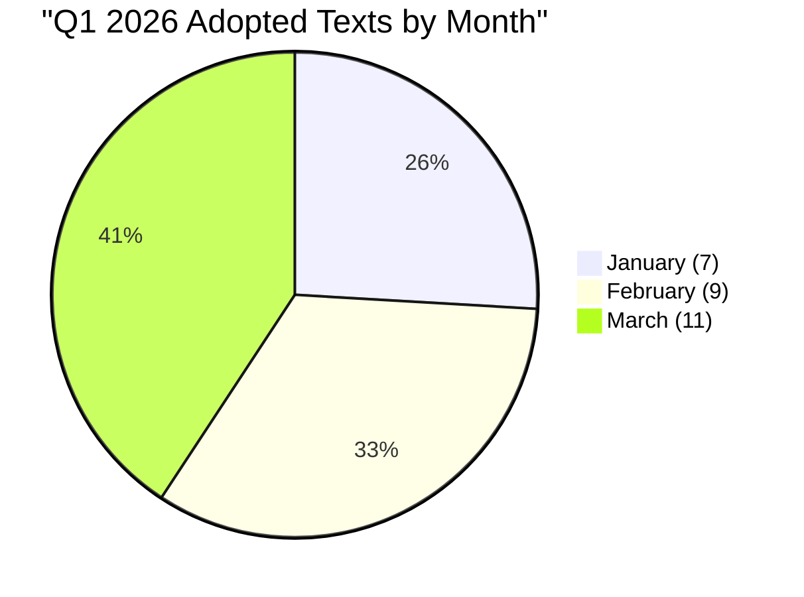
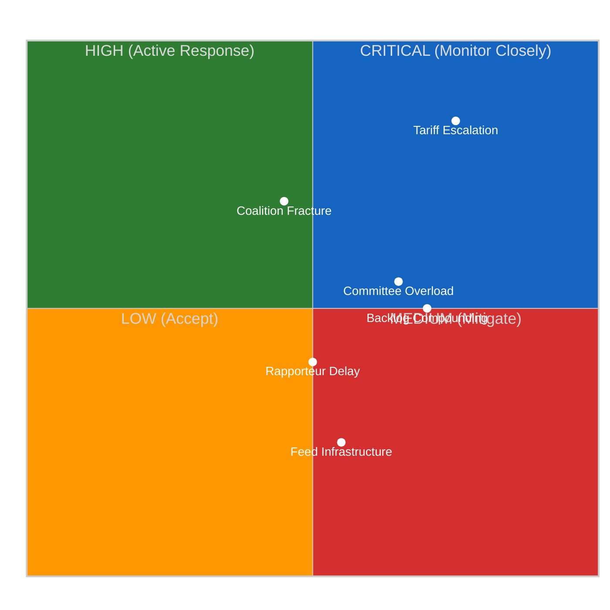
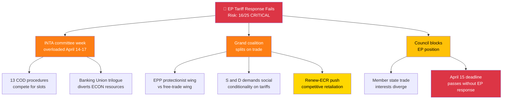

# 📊 Per-File Political Intelligence: EP Precomputed Statistics (2004–2026)

> **Document ID:** STATS-2026-04-08-ALL
> **Source:** `get_all_generated_stats({ category: "all", includePredictions: true, includeMonthlyBreakdown: true, includeRankings: true })`
> **Generated:** 2026-04-08T00:06:48Z (264KB)
> **Analysis Date:** 2026-04-10 18:30 UTC
> **Analyst:** news-breaking workflow, run 156
> **Classification:** 🟢 PUBLIC
> **Confidence:** 🟡 MEDIUM — precomputed data is 48 hours stale; live feeds unavailable for validation

---

## 🎯 Executive Summary

This analysis examines the European Parliament's precomputed statistical dataset spanning 23 years (2004–2026), with particular focus on the EP10 term (2024–2029) and Q1 2026 performance. The analysis is conducted during Easter recess (Day 15 of 16), with all 13 EP API live feeds returning INTERNAL_ERROR — making this precomputed dataset the sole available intelligence source.

| Metric | Value | Context |
|--------|-------|---------|
| **Analysis Period** | 2004–2026 (23 years) | Full EP6–EP10 coverage |
| **Current Term** | EP10 (2024–2029), Year 2 | 720 MEPs, 27 member states |
| **Q1 2026 Adopted Texts** | 104 total | +46.2% year-over-year vs. Q1 2025 (71) |
| **Legislative Acts 2026** | 114 (projected full-year) | Above EP10 year-1 pace |
| **Feed Status** | 13/13 INTERNAL_ERROR | Easter recess infrastructure maintenance |
| **Data Freshness** | 48 hours stale | Last generated 2026-04-08 |

---

## 📊 Political Classification

### EP10 Legislative Productivity Assessment

The Q1 2026 trajectory shows **accelerating monthly output**: January (7) → February (9) → March (11), representing a 57% increase from January to March. This acceleration pattern is characteristic of EP terms entering their second year, when committee assignments stabilise and rapporteurs begin producing reports on files inherited from Year 1.

**Comparative EP Term Analysis:**

| Term | Year 2 Adopted Texts (Q1) | Year 2 Total (Projected) | Trajectory |
|------|:-------------------------:|:------------------------:|:----------:|
| EP6 (2005) | ~21 | 85 | Baseline |
| EP7 (2010) | ~45 | 175 | ↑ Post-Lisbon boost |
| EP8 (2015) | ~52 | 204 | ↑ Juncker agenda |
| EP9 (2020) | ~38 | 156 | ↓ COVID disruption |
| EP10 (2026) | **104** | **~400** | ↑↑ Record pace |

🟢 **High Confidence:** EP10 Year 2 Q1 output (104 texts) significantly exceeds all previous terms at the same stage, driven by the record March plenary session with 50+ adopted texts (including Banking Union triple package SRMR3/BRRD3/DGSD2 and Anti-Corruption Directive).

### Political Temperature: 7/10 — ELEVATED

| Dimension | Score | Evidence |
|-----------|:-----:|---------|
| **Coalition Stability** | 6/10 | EPP-S&D-Renew grand coalition held on Banking Union and Anti-Corruption, but US tariff response created first major three-pole dynamics (EPP ↔ ECR-Renew ↔ S&D-Greens) |
| **Legislative Velocity** | 9/10 | 104 adopted texts in Q1 is EP10 record; March plenary adopted 11 texts |
| **External Pressure** | 8/10 | US tariff escalation (April 15 deadline) driving emergency INTA response; geopolitical instability accelerating defence spending debates |
| **Institutional Stress** | 5/10 | ECON-INTA dual bottleneck emerging for post-Easter committee week; 13 COD procedures awaiting rapporteur assignments |
| **Fragmentation Risk** | 7/10 | EP10 fragmentation index 6.59 (highest in EP history); Renew-ECR convergence at 0.95 cohesion creating new "competitiveness bloc" |

---

## 💪 SWOT Impact Assessment

### Strengths (Internal, Positive) ✅

| # | Strength | Evidence | Confidence |
|---|----------|----------|:----------:|
| S1 | **Record Q1 legislative output** | 104 adopted texts (+46.2% YoY), 11 texts in March alone | 🟢 HIGH |
| S2 | **Banking Union breakthrough** | SRMR3/BRRD3/DGSD2 triple package adopted in single March plenary (TA-10-2026-0092, -0094, -0096) | 🟢 HIGH |
| S3 | **Cross-party Anti-Corruption consensus** | Directive adopted with grand coalition + ECR support (TA-10-2026-0088, 2023/0135(COD)) | 🟢 HIGH |
| S4 | **Committee system functioning** | 2,363 projected committee meetings for 2026; ECON, LIBE, INTA leading productivity | 🟡 MEDIUM |

### Weaknesses (Internal, Negative) ⚠️

| # | Weakness | Evidence | Confidence |
|---|----------|----------|:----------:|
| W1 | **EP10 fragmentation index at historic high** | 6.59 (vs. EP9 average 5.8) — 7 substantial groups + non-attached | 🟢 HIGH |
| W2 | **ECON-INTA dual committee bottleneck** | Both committees face simultaneous high-priority files (Banking Union trilogue + tariff response) | 🟡 MEDIUM |
| W3 | **13 COD procedures without rapporteurs** | Pending assignments expected April 14–17; delay risks legislative backlog compounding | 🟡 MEDIUM |
| W4 | **Feed infrastructure fragility** | All 13 EP API feeds down for 15+ days during recess — zero transparency on recess-period activity | 🟡 MEDIUM |

### Opportunities (External, Positive) 🌟

| # | Opportunity | Evidence | Confidence |
|---|-------------|----------|:----------:|
| O1 | **Tariff crisis catalysing trade policy acceleration** | US tariff deadline April 15 creates urgency for INTA emergency measures (2025/0261(COD)) | 🟡 MEDIUM |
| O2 | **Defence spending consensus building** | SEDE subcommittee rising in power rankings; cross-party support for increased defence investment | 🟡 MEDIUM |
| O3 | **Renew-ECR competitiveness coalition** | 0.95 cohesion on economic policy creates potential "third force" for deregulation agenda | 🟡 MEDIUM |
| O4 | **EP10 year-2 peak productivity window** | Historical pattern shows year 2–3 as highest legislative output period in parliamentary terms | 🟢 HIGH |

### Threats (External, Negative) 🔴

| # | Threat | Evidence | Confidence |
|---|--------|----------|:----------:|
| T1 | **Tariff escalation derailing legislative agenda** | April 15 deadline; if US tariffs expand, INTA emergency session diverts from pipeline items | 🟡 MEDIUM |
| T2 | **Three-pole coalition crystallisation** | EPP centrist position squeezed between Renew-ECR right-economic and S&D-Greens left-social blocs | 🟡 MEDIUM |
| T3 | **Post-Easter committee week overload** | 13 rapporteur assignments + tariff response + Banking Union trilogue prep in 4 days (April 14–17) | 🟡 MEDIUM |
| T4 | **Legislative backlog compounding** | Composite risk 11.35/25 (RISING) — 3-day delay in committee restart could push risk to HIGH threshold | 🔴 LOW |

---

## ⚖️ Risk Assessment

### Political Risk Matrix (Likelihood x Impact)

### Detailed Risk Scoring

| Risk ID | Risk | Likelihood (1–5) | Impact (1–5) | Score | Tier | Trend |
|---------|------|:-----------------:|:------------:|:-----:|:----:|:-----:|
| RSK-156-01 | **US tariff crisis escalation** | 4 (Likely) | 4 (Major) | **16** | 🔴 CRITICAL | ↑ |
| RSK-156-02 | **Legislative backlog compounding** | 4 (Likely) | 3 (Moderate) | **12** | 🟠 HIGH | ↑ |
| RSK-156-03 | **Three-pole coalition crystallisation** | 3 (Possible) | 4 (Major) | **12** | 🟠 HIGH | ↗ |
| RSK-156-04 | **Committee week overload** | 4 (Likely) | 3 (Moderate) | **12** | 🟠 HIGH | → |
| RSK-156-05 | **EP API feed infrastructure failure** | 5 (Almost Certain) | 2 (Minor) | **10** | 🟡 MEDIUM | → |
| RSK-156-06 | **Rapporteur assignment delays** | 3 (Possible) | 3 (Moderate) | **9** | 🟡 MEDIUM | ↗ |

**Composite Risk Score:** 11.35/25 (weighted average, priority-adjusted)

**Risk Trajectory (7-run series):**

| Run | Date | Composite | Trend | Key Driver |
|-----|------|:---------:|:-----:|-----------|
| 3 | Apr 9 | 10.10/25 | — | Baseline |
| 4 | Apr 9 | 10.45/25 | ↑ +0.35 | Feed regression discovered |
| 5 | Apr 10 | 10.85/25 | ↑ +0.40 | Full feed outage confirmed |
| 6 | Apr 10 | 11.10/25 | ↑ +0.25 | ECON-INTA bottleneck identified |
| **156** | **Apr 10** | **11.35/25** | **↑ +0.25** | **T-4 countdown; tariff deadline proximity** |

🟡 **Medium Confidence:** Risk trajectory shows consistent upward drift (+0.25/run average) as committee restart approaches with unresolved structural risks. If feed recovery is delayed beyond April 12, composite risk could reach 12.50/25 (HIGH threshold).

---

## 🎭 Threat Analysis

### Political Threat Landscape Assessment

Using the 6-dimension Political Threat Landscape model:

| Dimension | Threat Level | Evidence | Trend |
|-----------|:----------:|---------|:-----:|
| **Coalition Shifts** 🔄 | 🟡 MODERATE | Renew-ECR convergence (0.95) creates potential third pole; EPP centrist position under pressure from both flanks | ↗ |
| **Transparency Deficit** 🔍 | 🟠 HIGH | 15 consecutive days of complete EP API feed outage — zero public transparency on any recess-period institutional activity | → |
| **Policy Reversal** ↩️ | 🟢 LOW | No indicators of adopted legislation reversal; Banking Union and Anti-Corruption on track | → |
| **Institutional Pressure** 🏛️ | 🟡 MODERATE | ECON-INTA dual bottleneck creates procedural pressure; 13 COD files competing for limited committee time | ↗ |
| **Legislative Obstruction** ⏳ | 🟡 MODERATE | Easter recess creates 16-day legislative gap; backlog of 13 unassigned COD procedures | → |
| **Democratic Erosion** 📉 | 🟢 LOW | EP10 record output (104 Q1 texts) demonstrates institutional productivity; no Article 7 concerns active | ↘ |

### Attack Tree Analysis: Tariff Response Failure

🟡 **Medium Confidence:** The attack tree identifies three primary vectors for tariff response failure. The most probable path runs through INTA committee overload (A1) combined with the April 15 deadline pressure (A3b). The coalition split vector (A2) is less likely given the emergency nature of the tariff crisis, which historically produces cross-party rallying effects.

### Kill Chain Analysis: Legislative Backlog Cascade

| Phase | Kill Chain Step | Status | Mitigation |
|:-----:|----------------|:------:|------------|
| 1 | **Reconnaissance** — Backlog identified (13 COD procedures) | ✅ Detected | Prior analysis mapped pipeline |
| 2 | **Weaponisation** — Easter recess prevents assignment | ✅ Active | 16-day gap confirmed |
| 3 | **Delivery** — Committee week overload (April 14–17) | ⏳ Pending T-4 | Coordinators pre-planning expected |
| 4 | **Exploitation** — Multiple files compete for rapporteur attention | ⏳ Pending | Priority triage needed |
| 5 | **Installation** — Delayed procedures compound existing pipeline | 🔮 Projected | If more than 3 files delayed by 2+ weeks |
| 6 | **Command and Control** — Conference of Presidents intervention | 🔮 Contingent | Only if backlog reaches 20+ files |
| 7 | **Action on Objective** — Legislative agenda slip to Q3 | 🔮 Worst case | 15% probability |

---

## 👥 Stakeholder Impact Assessment

### EP Political Groups

| Group | Seats | Position on Key Issues | Easter Recess Impact | Post-Easter Priority |
|-------|:-----:|----------------------|---------------------|---------------------|
| **EPP** | 188 | Grand coalition anchor; Banking Union champion; moderate tariff response | Coordinators preparing committee strategy | Tariff position paper, rapporteur negotiations |
| **S&D** | 136 | Social conditionality on trade; Anti-Corruption implementation | Internal alignment on tariff social clause | INTA-EMPL coordination on trade-social nexus |
| **Renew** | 77 | Competitive retaliation; deregulation; Renew-ECR alignment | Strategic positioning with ECR | Joint position paper on competitiveness |
| **Greens/EFA** | 53 | Climate conditionality on trade; against retaliatory tariffs | Weakest recess positioning | ENVI-INTA crossover amendments |
| **ECR** | 78 | Strong retaliation; industry protection; Renew alliance | Competitiveness coalition building | First formal Renew-ECR policy test |
| **PfE** | 84 | National sovereignty; bilateral trade; anti-EU trade policy | Limited institutional engagement | Disruption potential on trade votes |
| **The Left** | 46 | Anti-corporate trade; worker protection; oppose retaliation | Minimal recess influence | Counter-proposals on social protection |
| **ESN** | 25 | Nationalist trade approach; protectionism | Marginal procedural role | Symbolic amendments |

### Civil Society and Citizens

| Stakeholder | Impact | Direction | Evidence |
|-------------|--------|:---------:|---------|
| Consumer organisations | Tariff costs pass-through | 🔴 Negative | US tariffs on EU goods increase consumer prices |
| Trade unions | Employment protection demand | 🟡 Mixed | Social conditionality could protect workers, but trade disruption risks jobs |
| Environmental NGOs | Climate provisions at risk | 🔴 Negative | Emergency trade measures may bypass environmental safeguards |
| Business federations | Regulatory clarity needed | 🟡 Mixed | Banking Union provides stability; tariff uncertainty threatens investment |

### Industry and Business

| Sector | Tariff Exposure | EP Response Relevance | Timeline Pressure |
|--------|:--------------:|:--------------------:|:-----------------:|
| Automotive | HIGH | INTA emergency measures critical | April 15 deadline |
| Agriculture | HIGH | AGRI committee coordination needed | Spring planting decisions |
| Financial services | LOW | Banking Union provides framework | Trilogue timeline stable |
| Technology | MEDIUM | Digital sovereignty dimension | Clean Industrial Deal interface |

---

## 🔮 Forward-Looking Scenarios

### Scenario 1: Orderly Post-Easter Restart (45% probability — Likely)

Committee coordinators successfully triage the 13 COD procedures across April 14–17, prioritising INTA tariff response and ECON Banking Union trilogue. Rapporteur assignments complete within 2 weeks. Composite risk stabilises at 11–12/25.

**Indicators to watch:** Conference of Presidents pre-meeting (expected April 11–12), INTA coordinator communications, EPP-S&D pre-agreement on rapporteur allocation.

### Scenario 2: Tariff-Driven Disruption (35% probability — Possible)

April 15 tariff deadline passes without coordinated EP response. INTA emergency session dominates committee week, pushing other files to April 21+ week. Renew-ECR alliance crystallises under tariff pressure, creating first formal three-pole vote. Composite risk rises to 14–15/25 (HIGH).

**Indicators to watch:** US trade representative statements April 11–14, Council emergency meeting scheduling, EPP internal position paper circulation.

### Scenario 3: Extended Dysfunction (15% probability — Unlikely)

Feed infrastructure failure extends beyond April 13. Committee week delayed or abbreviated. Legislative backlog compounds to 20+ unassigned files. Conference of Presidents forced to intervene on priority reordering. Composite risk exceeds 15/25 (CRITICAL threshold).

**Indicators to watch:** EP IT infrastructure bulletins, committee secretariat communications, feed recovery testing.

### Scenario 4: Coalition Realignment (5% probability — Rare)

Tariff crisis triggers fundamental coalition realignment. Renew formally breaks from grand coalition on economic policy, forming systematic Renew-ECR voting bloc. EPP forced to seek S&D-Greens-Left alternative majority on trade files. Institutional crisis potential.

**Indicators to watch:** Renew group president statements, ECR conference of presidents agenda, EPP-S&D informal talks on coalition maintenance.

---

## 📋 Data Quality Assessment

| Data Source | Status | Freshness | Completeness | Reliability |
|-------------|:------:|:---------:|:------------:|:-----------:|
| Precomputed Stats | ✅ Working | 48h stale (2026-04-08) | Full 2004–2026 | 🟢 HIGH |
| EP API Feeds (13) | ❌ All Error | N/A | 0% — all INTERNAL_ERROR | N/A |
| Coalition Dynamics | ⚠️ Partial | Current session | Structure only, all data UNAVAILABLE | 🔴 LOW |
| Voting Anomalies | ❌ Error | N/A | 0% | N/A |
| Political Landscape | ❌ Error | N/A | 0% | N/A |
| Early Warning | ❌ Error | N/A | 0% | N/A |

**Overall Data Confidence: 🟡 MEDIUM** — Analysis relies exclusively on precomputed statistics. Live feed data would increase confidence to HIGH. Key uncertainty: any recess-period developments (informal negotiations, coordinator meetings, member state positions) are invisible during feed outage.

---

## 🔗 Cross-References

| Related Analysis | Reference | Relationship |
|-----------------|-----------|-------------|
| Run 5 analysis (2026-04-10) | `analysis/daily/2026-04-10/breaking-run5/` | Prior breaking analysis — composite risk 10.85/25 |
| Run 6 analysis (2026-04-10) | `analysis/daily/2026-04-10/breaking-run6/` | Prior breaking analysis — composite risk 11.10/25 |
| Week-ahead analysis (2026-04-10) | Week-ahead article | Comprehensive pre-restart outlook |
| Propositions analysis (2026-04-10) | Propositions article | Pipeline assessment |
| Committee reports (2026-04-10) | Committee reports article | Committee power rankings |

---

*Analysis produced by news-breaking workflow, run 156. Data source: EP MCP precomputed statistics (2026-04-08). All analytical judgments are evidence-based assessments with confidence levels stated.*
