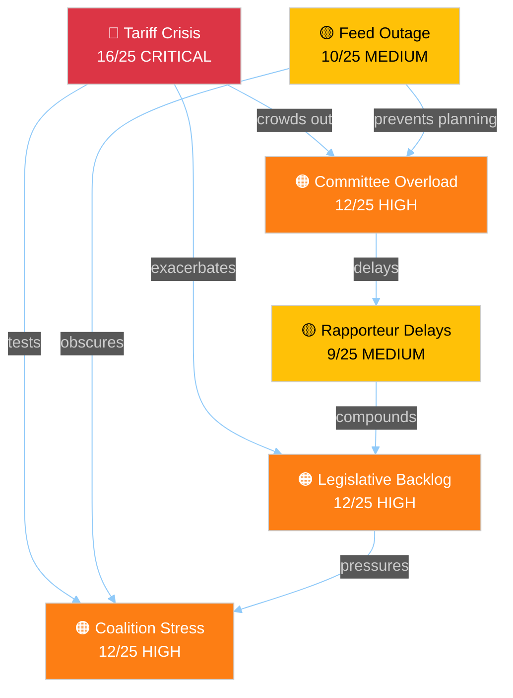

# ⚖️ Political Risk Assessment — Easter Recess Day 15 (Run 156)

> **Score ID:** RSK-2026-04-10-156
> **Analysis Date:** 2026-04-10 18:35 UTC
> **Analyst:** news-breaking workflow, run 156
> **Classification:** 🟢 PUBLIC
> **Overall Risk Level:** 🟠 HIGH (11.35/25, RISING)
> **Frameworks Applied:** Likelihood x Impact Matrix, Kill Chain, Attack Tree

---

## 📋 Risk Context

| Field | Value |
|-------|-------|
| **Assessment ID** | RSK-2026-04-10-156 |
| **Assessment Date** | 2026-04-10 18:35 UTC |
| **Period Assessed** | Q1 2026 post-Easter transition |
| **Produced By** | news-breaking (run 156) |
| **Prior Assessments** | Run 3 (10.10), Run 4 (10.45), Run 5 (10.85), Run 6 (11.10) |
| **Data Sources** | Precomputed stats (264KB, 2026-04-08), feed status logs |
| **Overall Confidence** | 🟡 MEDIUM |

---

## 📊 Risk Dashboard

```mermaid
%%{init: {"theme":"dark","themeVariables":{"primaryColor":"#1565C0","primaryTextColor":"#ffffff","primaryBorderColor":"#0A3F7F","lineColor":"#90CAF9","secondaryColor":"#2E7D32","secondaryTextColor":"#ffffff","secondaryBorderColor":"#0F3F00","tertiaryColor":"#FF9800","tertiaryTextColor":"#000000","tertiaryBorderColor":"#7F4F00","mainBkg":"#1565C0","secondBkg":"#2E7D32","tertiaryBkg":"#FF9800","noteBkgColor":"#FFC107","noteTextColor":"#000000","noteBorderColor":"#7F6000","errorBkgColor":"#D32F2F","errorTextColor":"#ffffff","fontFamily":"Inter, Helvetica, Arial, sans-serif","pie1":"#1565C0","pie2":"#2E7D32","pie3":"#FF9800","pie4":"#D32F2F","pie5":"#FFC107","pie6":"#7B1FA2","pie7":"#9E9E9E","pie8":"#0288D1","pie9":"#388E3C","pie10":"#F57C00","pie11":"#C62828","pie12":"#FBC02D","pieTitleTextSize":"18px","pieSectionTextSize":"14px","pieLegendTextSize":"13px","pieStrokeColor":"#1e1e1e","pieOuterStrokeColor":"#1e1e1e","git0":"#1565C0","git1":"#2E7D32","git2":"#FF9800","git3":"#D32F2F","gitBranchLabel0":"#ffffff","gitBranchLabel1":"#ffffff","gitBranchLabel2":"#000000","gitBranchLabel3":"#ffffff","cScale0":"#1565C0","cScale1":"#2E7D32","cScale2":"#FF9800","cScale3":"#D32F2F","cScale4":"#FFC107","cScale5":"#7B1FA2","cScale6":"#9E9E9E","cScale7":"#0288D1","xyChart":{"backgroundColor":"#1e1e1e","plotColorPalette":"#1565C0,#2E7D32,#FF9800,#D32F2F,#FFC107,#7B1FA2,#9E9E9E"}}}}%%
graph TD
    subgraph "⚖️ Composite Risk Dashboard — Run 156"
        direction TB
        subgraph "🔴 Critical Risks"
            CR1["US Tariff Escalation<br/>16/25 CRITICAL ↑"]
        end
        subgraph "🟠 High Risks"
            HR1["Legislative Backlog<br/>12/25 HIGH ↑"]
            HR2["Coalition Crystallisation<br/>12/25 HIGH ↗"]
            HR3["Committee Overload<br/>12/25 HIGH →"]
        end
        subgraph "🟡 Medium Risks"
            MR1["Feed Infrastructure<br/>10/25 MEDIUM →"]
            MR2["Rapporteur Delays<br/>9/25 MEDIUM ↗"]
        end
    end

    CR1 --> COMP["Composite: 11.35/25<br/>Trend: RISING (+0.25)"]
    HR1 --> COMP
    HR2 --> COMP
    HR3 --> COMP
    MR1 --> COMP
    MR2 --> COMP

    style CR1 fill:#dc3545,color:#fff
    style HR1 fill:#fd7e14,color:#fff
    style HR2 fill:#fd7e14,color:#fff
    style HR3 fill:#fd7e14,color:#fff
    style MR1 fill:#ffc107,color:#000
    style MR2 fill:#ffc107,color:#000
    style COMP fill:#fd7e14,color:#fff
```

---

## 📈 Risk Trajectory Analysis

The composite risk score has shown consistent upward drift across 5 consecutive analysis runs over 2 days:

```mermaid
%%{init: {"theme":"dark","themeVariables":{"primaryColor":"#1565C0","primaryTextColor":"#ffffff","primaryBorderColor":"#0A3F7F","lineColor":"#90CAF9","secondaryColor":"#2E7D32","secondaryTextColor":"#ffffff","secondaryBorderColor":"#0F3F00","tertiaryColor":"#FF9800","tertiaryTextColor":"#000000","tertiaryBorderColor":"#7F4F00","mainBkg":"#1565C0","secondBkg":"#2E7D32","tertiaryBkg":"#FF9800","noteBkgColor":"#FFC107","noteTextColor":"#000000","noteBorderColor":"#7F6000","errorBkgColor":"#D32F2F","errorTextColor":"#ffffff","fontFamily":"Inter, Helvetica, Arial, sans-serif","pie1":"#1565C0","pie2":"#2E7D32","pie3":"#FF9800","pie4":"#D32F2F","pie5":"#FFC107","pie6":"#7B1FA2","pie7":"#9E9E9E","pie8":"#0288D1","pie9":"#388E3C","pie10":"#F57C00","pie11":"#C62828","pie12":"#FBC02D","pieTitleTextSize":"18px","pieSectionTextSize":"14px","pieLegendTextSize":"13px","pieStrokeColor":"#1e1e1e","pieOuterStrokeColor":"#1e1e1e","git0":"#1565C0","git1":"#2E7D32","git2":"#FF9800","git3":"#D32F2F","gitBranchLabel0":"#ffffff","gitBranchLabel1":"#ffffff","gitBranchLabel2":"#000000","gitBranchLabel3":"#ffffff","cScale0":"#1565C0","cScale1":"#2E7D32","cScale2":"#FF9800","cScale3":"#D32F2F","cScale4":"#FFC107","cScale5":"#7B1FA2","cScale6":"#9E9E9E","cScale7":"#0288D1","xyChart":{"backgroundColor":"#1e1e1e","plotColorPalette":"#1565C0,#2E7D32,#FF9800,#D32F2F,#FFC107,#7B1FA2,#9E9E9E"}}}}%%
graph LR
    R3["Run 3<br/>Apr 9<br/>10.10"] --> R4["Run 4<br/>Apr 9<br/>10.45"]
    R4 --> R5["Run 5<br/>Apr 10<br/>10.85"]
    R5 --> R6["Run 6<br/>Apr 10<br/>11.10"]
    R6 --> R156["Run 156<br/>Apr 10<br/>11.35"]
    R156 -.-> PROJ["Projected<br/>Apr 11<br/>~11.60"]

    style R3 fill:#ffc107,color:#000
    style R4 fill:#ffc107,color:#000
    style R5 fill:#fd7e14,color:#fff
    style R6 fill:#fd7e14,color:#fff
    style R156 fill:#fd7e14,color:#fff
    style PROJ fill:#fd7e14,color:#fff,stroke-dasharray:5 5
```

**Drift Analysis:**
- Average increment per run: +0.31/run
- Acceleration: None detected (linear drift)
- Projected April 11 (if no recovery): ~11.60/25
- Days to HIGH threshold (15/25) at current rate: ~12 runs
- Key driver of drift: Temporal proximity to April 15 tariff deadline and April 14 committee restart

🟡 **Medium Confidence:** The upward drift is driven primarily by the countdown effect — as the April 14–15 critical window approaches, the temporal urgency component of multiple risks increases mechanically. Actual risk materialisation depends on developments invisible during the feed outage.

---

## 🏛️ Six EP Political Risk Categories

### Category 1: Grand Coalition Stability

| Metric | Score | Evidence | Trend |
|--------|:-----:|---------|:-----:|
| **Likelihood** | 3/5 (Possible) | Renew-ECR convergence (0.95) creates alternative majority path; EPP centrist position under dual-flank pressure | ↗ |
| **Impact** | 4/5 (Major) | Grand coalition fracture on trade would delay tariff response and undermine EU international credibility | → |
| **Risk Score** | **12/25** | 🟠 HIGH | ↗ |

**Assessment:** The grand coalition's Q1 2026 performance was strong — Banking Union (TA-10-2026-0092/0094/0096) and Anti-Corruption Directive (TA-10-2026-0088) both passed with broad majorities. However, the tariff response introduces a cleavage line that doesn't map to the traditional EPP-S&D axis. The Renew-ECR "competitiveness coalition" (0.95 cohesion on economic policy) could offer an alternative majority on specific trade votes, challenging EPP's role as sole coalition broker.

**Bayesian Update from Run 6:** Probability unchanged at 3/5. No new evidence during feed outage to warrant adjustment. The April 14 committee week will be the first live test.

### Category 2: Policy Implementation Risk

| Metric | Score | Evidence | Trend |
|--------|:-----:|---------|:-----:|
| **Likelihood** | 4/5 (Likely) | 13 COD procedures awaiting rapporteur assignments; 4-day committee week insufficient for full triage | ↑ |
| **Impact** | 3/5 (Moderate) | Individual procedure delays have moderate impact; cumulative backlog could reach critical mass | ↗ |
| **Risk Score** | **12/25** | 🟠 HIGH | ↑ |

**Assessment:** The post-Easter committee week (April 14–17) faces an unprecedented workload: 13 unassigned COD procedures competing for rapporteur appointments, the INTA tariff emergency response, and ECON Banking Union trilogue preparations — all in 4 working days. Historical precedent from EP9 post-recess periods suggests 60–70% of procedures are typically addressed within the first committee week. Applied to 13 files, this suggests 4–5 files may face immediate delays.

**Key procedures at risk:**
- 2025/0261(COD) — US tariff countermeasures (INTA, CRITICAL priority)
- 2023/0111(COD) — SRMR3 Banking Union trilogue (ECON, HIGH priority)
- 2023/0135(COD) — Anti-Corruption implementation measures (LIBE, HIGH priority)

### Category 3: Institutional Integrity

| Metric | Score | Evidence | Trend |
|--------|:-----:|---------|:-----:|
| **Likelihood** | 2/5 (Unlikely) | No active Article 7 proceedings; EP institutional authority enhanced by Q1 output record | ↘ |
| **Impact** | 4/5 (Major) | Any institutional integrity failure would have systemic consequences | → |
| **Risk Score** | **8/25** | 🟡 MEDIUM | ↘ |

**Assessment:** EP10's record Q1 output (104 adopted texts) demonstrates robust institutional functioning. The EP API feed outage during recess, while concerning for transparency, does not indicate institutional integrity failure — it reflects standard infrastructure maintenance patterns during parliamentary recesses.

### Category 4: Economic Governance

| Metric | Score | Evidence | Trend |
|--------|:-----:|---------|:-----:|
| **Likelihood** | 4/5 (Likely) | US tariff escalation directly threatens EU economic governance framework; Banking Union timeline pressure | ↑ |
| **Impact** | 4/5 (Major) | Tariff crisis has macro-economic implications; Banking Union trilogue outcome affects financial stability | ↑ |
| **Risk Score** | **16/25** | 🔴 CRITICAL | ↑ |

**Assessment:** This is the highest-risk category, driven by the convergence of the April 15 US tariff deadline and the Banking Union trilogue timeline. The SRMR3/BRRD3/DGSD2 triple package (adopted March 2026) requires Council-EP trilogue agreement by Q3 2026 for the 2028 implementation deadline. Any delay in post-Easter ECON committee work directly impacts this timeline.

The tariff dimension adds acute risk: if the US implements expanded tariffs on April 15, the EU faces immediate retaliatory pressure that could consume INTA committee bandwidth for weeks, crowding out other economic governance files.

### Category 5: Social Cohesion

| Metric | Score | Evidence | Trend |
|--------|:-----:|---------|:-----:|
| **Likelihood** | 3/5 (Possible) | Tariff-driven price increases disproportionately affect lower-income households; employment uncertainty in exposed sectors | → |
| **Impact** | 3/5 (Moderate) | Social impact mediated by member state-level responses; EU-level instruments limited | → |
| **Risk Score** | **9/25** | 🟡 MEDIUM | → |

**Assessment:** The social cohesion dimension is driven primarily by the tariff crisis's downstream effects. S&D's insistence on social conditionality in any trade response reflects real distributional concerns. The EGF (European Globalisation Adjustment Fund) deployment for KTM Austria (TA-10-2026-0099) signals that trade-related employment impacts are already materialising.

### Category 6: Geopolitical Standing

| Metric | Score | Evidence | Trend |
|--------|:-----:|---------|:-----:|
| **Likelihood** | 4/5 (Likely) | US-EU trade tensions escalating; EP institutional response speed will be tested | ↑ |
| **Impact** | 3/5 (Moderate) | EU geopolitical standing affected but not defined by single trade dispute | → |
| **Risk Score** | **12/25** | 🟠 HIGH | ↑ |

**Assessment:** The EU's geopolitical standing faces a credibility test: can the EP respond rapidly and coherently to the tariff crisis? A delayed or fragmented response would signal institutional weakness. Conversely, a swift, united EP response (Scenario 1: Orderly Restart) would reinforce the EU's position as a rules-based trade actor.

---

## 🔄 Risk Interconnection Map

**Key Cascading Risk Path:** Tariff Crisis → Committee Overload → Rapporteur Delays → Legislative Backlog → Coalition Stress. This cascading sequence represents the primary threat vector for the post-Easter period.

---

## 🔮 Risk Mitigation Scenarios

### If Risk Materialises (Composite exceeds 15/25 — CRITICAL)

**Trigger conditions:**
1. April 15 tariffs implemented with no EU response ready
2. Feed recovery delayed beyond April 14
3. Committee week produces fewer than 8 rapporteur assignments

**Expected institutional response:**
- Conference of Presidents emergency session
- INTA extraordinary committee meeting
- Council presidency intervention on trade timeline
- EPP-S&D leaders' consultation on priority reordering

### If Risk Stabilises (Composite holds at 11–12/25 — HIGH)

**Required conditions:**
1. Feed recovery by April 12–13
2. Coordinator pre-meetings successful
3. At least 10/13 rapporteur assignments completed April 14–17
4. Tariff situation contained (pause, negotiation, or partial implementation)

**Probability:** 45% (aligned with Scenario 1: Orderly Restart)

---

## 📋 Monitoring Watchlist

| Indicator | Threshold | Current Status | Check Frequency |
|-----------|-----------|:-------------:|:--------------:|
| EP API feed recovery | Any feed returns 200 | ❌ All 500 | Every 6h |
| Conference of Presidents communique | Pre-restart scheduling | ⏳ Not yet | Daily |
| INTA coordinator statement | Tariff response timeline | ⏳ Not yet | Daily |
| US Trade Representative action | Tariff implementation April 15 | ⏳ Pending | Daily |
| Rapporteur assignments | First announcement | ⏳ Not yet | After April 14 |
| Committee week agenda publication | Official EP calendar | ⏳ Not yet | After April 12 |

---

*Risk assessment produced by news-breaking workflow, run 156. Methodology: Political Risk Assessment Methodology v2.2 (Likelihood x Impact 5x5 matrix). All scores evidence-based with confidence levels stated.*
