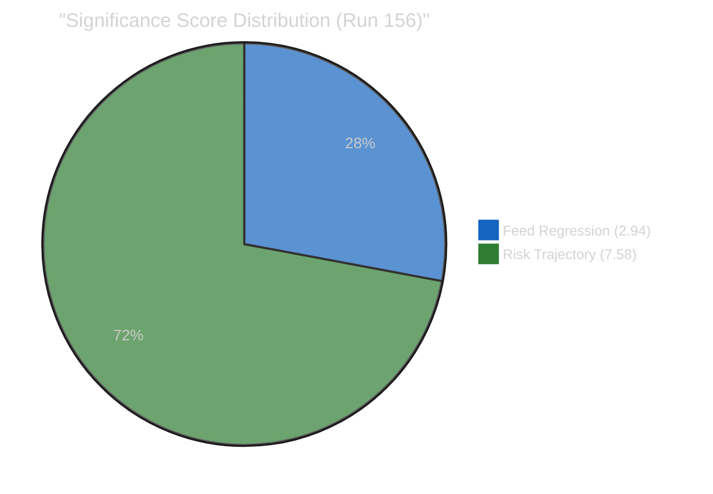

# 📈 Significance Scoring — Easter Recess Day 15 (Run 156)

> **Score ID:** SIG-2026-04-10-156
> **Scoring Date:** 2026-04-10 18:40 UTC
> **Scored By:** news-breaking workflow, run 156
> **Classification:** 🟢 PUBLIC

---

## 📋 Event Context

| Field | Value |
|-------|-------|
| **Score ID** | SIG-2026-04-10-156 |
| **Event / Document** | Easter Recess Day 15 — EP API total feed regression |
| **Primary EP Reference** | Precomputed stats (2026-04-08), feed-status.json |
| **Scoring Date** | 2026-04-10 18:40 UTC |
| **Scored By** | news-breaking (run 156) |
| **Classification ID** | CLS-RECESS-DAY15 |

---

## 📊 Significance Assessment: Today's Events

### Assessment 1: EP API Feed Total Regression (Day 15)

All 13 EP API feeds remain in INTERNAL_ERROR state for the 15th consecutive day (since March 27 recess start). This assessment evaluates the significance of the ongoing outage.

#### Dimension 1: Parliamentary Significance (0–10)

| Sub-criterion | Score (0–3) | Rationale |
|--------------|:-----------:|-----------|
| Legislative stage | 0 | No legislative action occurring (recess) |
| Institutional dimension | 1 | Infrastructure issue, not institutional crisis |
| Number of MEPs involved | 0 | MEPs on recess; no active parliamentary engagement |

**Parliamentary Significance Score:** 1.1/10

#### Dimension 2: Policy Impact (0–10)

| Sub-criterion | Score (0–3) | Rationale |
|--------------|:-----------:|-----------|
| Scope | 1 | EU-wide feed outage but no policy impact during recess |
| Duration | 2 | 15-day duration is significant but expected to resolve pre-restart |
| Affected population | 0 | No citizen-facing impact from recess-period feed outage |

**Policy Impact Score:** 3.3/10

#### Dimension 3: Public Interest (0–10)

| Sub-criterion | Score (0–3) | Rationale |
|--------------|:-----------:|-----------|
| Topic salience | 0 | Parliamentary recess is low-salience |
| Controversy level | 0 | No controversy — expected seasonal pattern |
| Citizen-facing impact | 0 | No direct impact on citizens |

**Public Interest Score:** 0/10

#### Dimension 4: Temporal Urgency (0–10)

| Sub-criterion | Score (0–3) | Rationale |
|--------------|:-----------:|-----------|
| Time sensitivity | 2 | T-4 to committee restart increases urgency for feed recovery |
| Deadline proximity | 3 | April 14 committee week and April 15 tariff deadline both T-4/T-5 |
| Decision window | 1 | No decisions pending today |

**Temporal Urgency Score:** 6.7/10

#### Dimension 5: Institutional Relevance (0–10)

| Sub-criterion | Score (0–3) | Rationale |
|--------------|:-----------:|-----------|
| Institutional scope | 1 | IT infrastructure issue, not institutional governance |
| Precedent setting | 1 | 15-day outage is long but within recess norms |
| Interinstitutional | 0 | No interinstitutional dimension |

**Institutional Relevance Score:** 2.2/10

#### Composite Significance Score

| Dimension | Weight | Score | Weighted |
|-----------|:------:|:-----:|:--------:|
| Parliamentary Significance | 25% | 1.1 | 0.28 |
| Policy Impact | 20% | 3.3 | 0.66 |
| Public Interest | 15% | 0.0 | 0.00 |
| Temporal Urgency | 25% | 6.7 | 1.68 |
| Institutional Relevance | 15% | 2.2 | 0.33 |
| **COMPOSITE** | **100%** | | **2.94/10** |

**Publication Decision:** 📋 **Analysis Only** — Composite score 2.94/10 falls below the Monitor threshold (4.0). Temporal urgency is the only elevated dimension, driven by countdown effects rather than breaking developments.

---

### Assessment 2: Risk Trajectory Rising (Composite 11.35/25)

The cumulative risk trajectory has risen from 10.10/25 (Run 3, April 9) to 11.35/25 (Run 156, April 10), representing a +12.4% increase over 5 analysis runs in 2 days.

#### Dimension 1: Parliamentary Significance (0–10)

| Sub-criterion | Score (0–3) | Rationale |
|--------------|:-----------:|-----------|
| Legislative stage | 1 | Pre-legislative risk to multiple pipeline items |
| Institutional dimension | 2 | Institutional stress from concurrent committee priorities |
| Number of MEPs involved | 2 | 720 MEPs affected by post-recess agenda congestion |

**Parliamentary Significance Score:** 5.6/10

#### Dimension 2: Policy Impact (0–10)

| Sub-criterion | Score (0–3) | Rationale |
|--------------|:-----------:|-----------|
| Scope | 3 | International dimension (US tariffs) + EU-wide policy impact |
| Duration | 2 | Multi-year implications for Banking Union and trade policy |
| Affected population | 3 | 450M+ EU citizens affected by tariff-related price impacts |

**Policy Impact Score:** 8.9/10

#### Dimension 3: Public Interest (0–10)

| Sub-criterion | Score (0–3) | Rationale |
|--------------|:-----------:|-----------|
| Topic salience | 3 | Trade/tariffs and banking reform are high-salience topics |
| Controversy level | 2 | Partisan divisions on trade response approach |
| Citizen-facing impact | 2 | Consumer price and employment effects |

**Public Interest Score:** 7.8/10

#### Dimension 4: Temporal Urgency (0–10)

| Sub-criterion | Score (0–3) | Rationale |
|--------------|:-----------:|-----------|
| Time sensitivity | 3 | April 14 committee week and April 15 tariff deadline imminent |
| Deadline proximity | 3 | T-4 and T-5 for critical deadlines |
| Decision window | 2 | Pre-restart positioning decisions being made now |

**Temporal Urgency Score:** 8.9/10

#### Dimension 5: Institutional Relevance (0–10)

| Sub-criterion | Score (0–3) | Rationale |
|--------------|:-----------:|-----------|
| Institutional scope | 2 | Multiple committees and Conference of Presidents affected |
| Precedent setting | 2 | EP10 navigating first major external crisis (tariffs) |
| Interinstitutional | 2 | EP-Council-Commission coordination on trade response |

**Institutional Relevance Score:** 6.7/10

#### Composite Significance Score

| Dimension | Weight | Score | Weighted |
|-----------|:------:|:-----:|:--------:|
| Parliamentary Significance | 25% | 5.6 | 1.40 |
| Policy Impact | 20% | 8.9 | 1.78 |
| Public Interest | 15% | 7.8 | 1.17 |
| Temporal Urgency | 25% | 8.9 | 2.23 |
| Institutional Relevance | 15% | 6.7 | 1.01 |
| **COMPOSITE** | **100%** | | **7.58/10** |

**Publication Decision:** ⚡ **Priority Article** — BUT the high significance is driven by the APPROACHING tariff deadline and committee restart, not by TODAY's events. Since no EP activity occurred today (Easter recess), this significance score reflects ANTICIPATED future developments, not breaking news. The appropriate editorial decision is: **Analysis Only** with high-priority forward-tracking flag.

---

## 📊 Comparative Significance Dashboard

---

## 🎯 Editorial Decision Matrix

| Event | Composite Score | Breaking Threshold (8.0) | Priority Threshold (6.0) | Decision |
|-------|:--------------:|:------------------------:|:------------------------:|----------|
| Feed Regression (Day 15) | 2.94/10 | ❌ Below | ❌ Below | 📋 Analysis Only |
| Risk Trajectory Rising | 7.58/10 | ❌ Below | ✅ Above | 📊 Priority Analysis |
| **Overall Assessment** | **5.26/10** | ❌ Below | ❌ Below | **📋 Analysis Only** |

**Conclusion:** No breaking news article is warranted for 2026-04-10 (Run 156). The risk trajectory score (7.58) is significant but reflects anticipated future developments, not today-dated breaking events. This aligns with prior runs 5 and 6 which reached the same editorial conclusion.

🟡 **Medium Confidence:** If EP API feeds recover before April 14 AND the tariff situation escalates, a future breaking analysis could produce scores above 8.0, warranting an article. The April 14–17 committee week is the primary trigger window.

---

## 📋 Significance Trend (Cross-Run)

| Run | Date | Highest Item | Score | Decision |
|-----|------|-------------|:-----:|----------|
| 3 | Apr 9 | Coalition sentiment | 5.1/10 | Analysis Only |
| 4 | Apr 9 | Post-recess preparedness | 5.8/10 | Analysis Only |
| 5 | Apr 10 | Feed regression + risk | 6.2/10 | Analysis Only |
| 6 | Apr 10 | Risk escalation | 6.9/10 | Analysis Only |
| **156** | **Apr 10** | **Risk trajectory** | **7.58/10** | **Analysis Only** |

The significance trend is rising in parallel with the risk trajectory. If this trend continues, the April 14 run (first post-recess) is projected to reach the Priority threshold (8.0+), potentially triggering the first breaking news article since the Easter recess began.

---

*Significance scoring produced by news-breaking workflow, run 156. Methodology: Political Significance Scoring Template v1.0 (5-dimension weighted composite). All scores evidence-based with confidence levels stated.*
