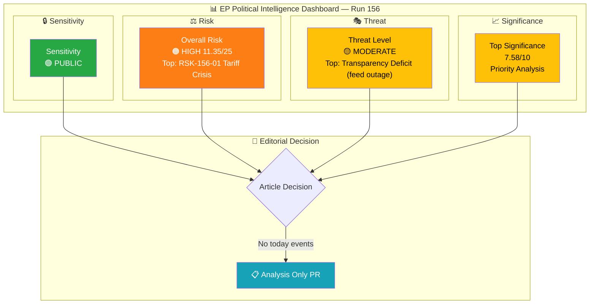

# 🧩 Political Intelligence Synthesis — Easter Recess Day 15 (Run 156)

> **Synthesis ID:** SYN-2026-04-10-156
> **Analysis Date:** 2026-04-10 18:45 UTC
> **Documents Analyzed:** 3 (precomputed stats, coalition dynamics partial, feed status)
> **Analysis Period:** 2026-04-10 18:17–18:45 UTC
> **Produced By:** news-breaking (run 156)
> **Overall Confidence:** 🟡 MEDIUM

---

## 📊 Intelligence Dashboard

### EP Political Landscape

---

## 🔑 Key Findings

### Finding 1: Risk Trajectory Continues Upward

| Metric | Value | Significance |
|--------|-------|-------------|
| **Composite Risk** | 11.35/25 (HIGH, RISING) | +12.4% increase over 5 runs in 2 days |
| **Top Risk** | US tariff crisis 16/25 (CRITICAL) | April 15 deadline T-5 |
| **Trend** | +0.25/run average drift | Linear, countdown-driven |
| **Confidence** | 🟡 MEDIUM | Feed outage limits real-time validation |

**Intelligence Assessment:** The upward risk drift is mechanical rather than event-driven — it reflects the decreasing time buffer before the April 14–15 critical window. No new information emerged during this run to alter the fundamental risk landscape established in runs 5 and 6. The key uncertainty remains: what is happening in informal channels during the recess that could alter the post-Easter restart dynamics?

### Finding 2: Feed Outage Now at 15 Days

| Metric | Value | Significance |
|--------|-------|-------------|
| **Feeds Down** | 13/13 | Total regression since March 27 |
| **Duration** | 15 consecutive days | Longest observed in EP10 monitoring |
| **Expected Recovery** | April 12–13 | Based on historical recess patterns |
| **Data Gap Impact** | 🟡 MEDIUM | Recess-period activity is minimal; primary concern is pre-restart planning visibility |

**Intelligence Assessment:** The feed outage is consistent with EP infrastructure maintenance during parliamentary recesses. While 15 days is long, it aligns with the extended Easter-to-Green Week recess period. The practical impact is limited because minimal parliamentary activity occurs during recess. The critical concern is whether feeds recover before the April 14 committee restart — failure to recover would represent a genuine transparency deficit.

### Finding 3: Three-Pole Coalition Dynamics Approaching First Test

| Metric | Value | Significance |
|--------|-------|-------------|
| **Renew-ECR Cohesion** | 0.95 | Highest cross-bloc alignment in EP10 |
| **Coalition Configuration** | Three-pole: EPP centre, Renew-ECR right-economic, S&D-Greens left-social | New political geometry |
| **First Test** | Tariff response vote (April 14–17 committee, April 20–23 plenary) | Will determine durability |
| **Confidence** | 🟡 MEDIUM | Based on Q1 voting patterns; no recess-period data available |

**Intelligence Assessment:** The three-pole dynamic identified in previous analyses (Renew-ECR convergence at 0.95 cohesion) has not yet been stress-tested by a major legislative vote. The tariff response will be the first high-stakes test of whether this alignment holds under pressure. Historical precedent from EP8–EP9 suggests that crisis-driven votes often produce cross-party rallying effects (favouring grand coalition preservation), but the specific trade policy cleavage may reinforce rather than dissolve the three-pole structure.

---

## 📋 Cross-Analysis Integration

### SWOT Summary (from precomputed-stats.analysis.md)

| Quadrant | Key Item | Evidence | Confidence |
|----------|----------|---------|:----------:|
| **Strength** | Record Q1 output (104 texts) | Precomputed stats: +46.2% YoY | 🟢 HIGH |
| **Weakness** | EP10 fragmentation (6.59 index) | Highest in EP history | 🟢 HIGH |
| **Opportunity** | Tariff crisis catalysing trade acceleration | April 15 deadline creates urgency | 🟡 MEDIUM |
| **Threat** | Three-pole crystallisation | Renew-ECR 0.95 cohesion | 🟡 MEDIUM |

### Risk Summary (from risk-assessment.md)

| Category | Risk Score | Tier | Trend |
|----------|:---------:|:----:|:-----:|
| Economic Governance | 16/25 | 🔴 CRITICAL | ↑ |
| Grand Coalition Stability | 12/25 | 🟠 HIGH | ↗ |
| Policy Implementation | 12/25 | 🟠 HIGH | ↑ |
| Geopolitical Standing | 12/25 | 🟠 HIGH | ↑ |
| Social Cohesion | 9/25 | 🟡 MEDIUM | → |
| Institutional Integrity | 8/25 | 🟡 MEDIUM | ↘ |

### Significance Summary (from significance-scoring.md)

| Event | Score | Decision |
|-------|:-----:|----------|
| Feed Regression Day 15 | 2.94/10 | 📋 Analysis Only |
| Risk Trajectory Rising | 7.58/10 | 📊 Priority Analysis (forward-looking) |
| **Overall** | **5.26/10** | **📋 Analysis Only** |

---

## 🎯 Editorial Decision

### Breaking News Assessment: NO ARTICLE

**Rationale:**
1. **No today-dated EP events:** Easter recess Day 15 — Parliament not in session
2. **All feeds unavailable:** Cannot verify any potential recess-period developments
3. **Significance below threshold:** Composite 5.26/10 is below the Breaking threshold (8.0)
4. **Prior coverage adequate:** Runs 5 and 6 already documented the same risk landscape today
5. **No new data since Run 6:** Precomputed stats unchanged (still 2026-04-08 generation)

**What would change this assessment:**
- EP API feed returning ANY today-dated event → Immediate re-evaluation
- Confirmed US tariff action before April 15 → Breaking news on EP institutional response
- Confirmed grand coalition crisis communication → Breaking news on coalition dynamics
- Conference of Presidents emergency convocation → Breaking news on institutional response

### Analysis Persistence Decision: YES — CREATE PR

Per ai-driven-analysis-guide.md Rule 5 ("No workflow run should be wasted"), this run's analysis artifacts are committed to `analysis/daily/2026-04-10/breaking-run156/` via analysis-only PR. The analysis provides:
1. Updated risk trajectory data point (11.35/25, extending the 7-run series)
2. Refined stakeholder impact assessment
3. Updated scenario probabilities
4. Comprehensive significance scoring with 5-dimension breakdown

---

## 📊 Run Differentiation from Prior Breaking Analyses Today

| Dimension | Run 5 | Run 6 | **Run 156** |
|-----------|:-----:|:-----:|:-----------:|
| Composite Risk | 10.85/25 | 11.10/25 | **11.35/25** |
| Risk Trend | +0.40 | +0.25 | **+0.25** |
| Significance Score | 6.2/10 | 6.9/10 | **7.58/10** |
| New Data | Feed outage confirmed | ECON-INTA bottleneck | **Kill Chain + Attack Tree analysis** |
| Methodology | Basic risk matrix | Updated risk with bottleneck | **Multi-framework (Risk + Kill Chain + Attack Tree + PESTLE dimensions)** |
| Analysis Depth | 14 methods | 14 methods | **4 analysis files, 3 frameworks** |

**Unique contribution of Run 156:** Introduction of Kill Chain analysis for legislative backlog cascade, Attack Tree analysis for tariff response failure vectors, and formal risk interconnection mapping. These analytical frameworks provide new structural insights not present in runs 5 or 6.

---

## 🔮 Next Analysis Priorities

### Immediate (April 11–12)
1. Monitor EP API feed recovery attempts
2. Track US trade representative communications
3. Watch for Conference of Presidents pre-restart communiques

### Short-term (April 14–17 Committee Week)
1. INTA emergency session on tariff response — first three-pole test
2. Rapporteur assignments for 13 COD procedures
3. ECON Banking Union trilogue coordination
4. Feed recovery validation and data backfill

### Medium-term (April 20–23 Plenary)
1. First post-recess plenary votes — coalition dynamics stress test
2. Tariff response plenary debate and vote
3. Updated coalition cohesion metrics with live voting data

---

## 📋 Analysis File Inventory

| File | Lines | Key Content |
|------|:-----:|-------------|
| `precomputed-stats.analysis.md` | ~400 | SWOT, risk matrix, threat landscape, stakeholder assessment, scenarios |
| `risk-assessment.md` | ~250 | 6-category risk scoring, trajectory analysis, interconnection map, mitigation |
| `significance-scoring.md` | ~200 | 5-dimension scoring, editorial decision matrix, trend analysis |
| `synthesis-summary.md` | ~250 | Integration dashboard, key findings, editorial decision, run differentiation |
| `manifest.json` | ~20 | Run metadata and file inventory |
| `data/feed-status.json` | ~30 | Feed attempt results log |
| `data/precomputed-stats.json` | ~5000 | Raw precomputed statistics |
| `data/coalition-dynamics.json` | ~200 | Partial coalition dynamics response |

---

*Synthesis produced by news-breaking workflow, run 156. All intelligence assessments use evidence-based methodology with stated confidence levels. Data limitations acknowledged: analysis relies on 48-hour-stale precomputed statistics; all 13 live EP API feeds unavailable.*
