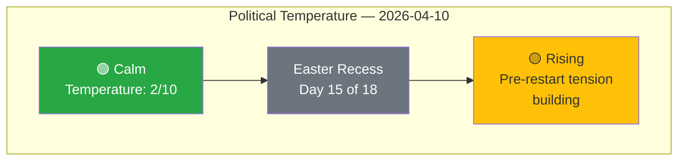

# 🏷️ Political Classification — Easter Recess Day 15 Intelligence

**📅 Analysis Date:** 2026-04-10 00:20 UTC | **🏛️ Parliament Status:** Easter Recess (Day 15/18) | **📰 Article Type:** `breaking`
**🤖 Analyst:** `news-breaking` workflow | **🔒 Sensitivity:** 🟢 PUBLIC | **Confidence:** 🟡 MEDIUM

---

## 📋 Classification Context

| Field | Value |
|-------|-------|
| **Classification ID** | `CLS-2026-04-10-001` |
| **Parliamentary Term** | EP10 (2024–2029), Year 2 |
| **Session Status** | Easter Recess (March 27 – April 13), T-4 to Committee Week |
| **Feed Availability** | All EP API feeds returning errors (recess blackout) |
| **Data Sources** | Precomputed statistics (2026-04-08), prior analysis runs (April 8–9, 5 runs total) |
| **articleType** | `breaking` |

---

## 📊 Political Temperature Assessment

**Current Temperature: 2/10 (Calm — Recess Baseline)**

The European Parliament remains in Easter recess, with no plenary or committee activity. However, the political temperature is projected to rise sharply over the next 4–10 days as committee meetings resume (April 14) and the Strasbourg plenary begins (April 20). Three dynamics drive the pre-restart tension:

1. **Legislative backlog pressure** — 30+ texts and 13 active COD procedures require processing in the first 4-day committee window [HIGH confidence]. The Q1 2026 legislative output (104 adopted texts through March) represents a 46.2% increase over 2025 pace, creating unprecedented pipeline pressure.
2. **US tariff crisis escalation** — The urgency adoption of countermeasures (2025/0261(COD)) scored CRITICAL (16/25 risk) in prior analysis [HIGH confidence]. Three days of recess remain for backroom negotiations before formal committee debate.
3. **Coalition stress from variable geometry** — EPP's dual-track strategy (centre-left on social/climate, centre-right on defence/migration) faces its first post-Easter stress test as both anti-corruption (2023/0135(COD)) and trade countermeasures reach implementation-critical stages [MEDIUM confidence].

---

## 📋 Domain Classification

| Policy Domain | Committee(s) | Q1 Activity Level | Post-Recess Priority | Risk Level |
|:-------------|:-------------|:------------------|:---------------------|:-----------|
| **INTA** (Trade) | INTA | 🔴 HIGH — tariff countermeasures | 🔴 CRITICAL — first committee week item | 16/25 |
| **LIBE** (Justice) | LIBE | 🟡 MEDIUM — anti-corruption directive | 🟠 HIGH — transposition oversight | 10/25 |
| **ECON** (Banking) | ECON | 🟡 MEDIUM — SRMR3/BRRD3/DGSD2 | 🟡 MEDIUM — Council position wait | 8/25 |
| **ITRE** (Industry) | ITRE | 🟢 LOW — Clean Industrial Deal proposals | 🟡 MEDIUM — competitiveness agenda | 7/25 |
| **AFET** (Foreign) | AFET, SEDE | 🟡 MEDIUM — defence strategy | 🟡 MEDIUM — EDIS debate continuing | 9/25 |
| **ENVI** (Environment) | ENVI | 🟢 LOW — Green Deal implementation | 🟢 LOW — no urgent files | 4/25 |

---

## 🔍 Urgency Classification

| Item | Urgency Level | Justification | Confidence |
|:-----|:-------------|:-------------|:-----------|
| US Tariff Countermeasures (2025/0261) | ⚡ CRITICAL | Urgency procedure, economic damage ongoing daily | 🟢 HIGH |
| Anti-Corruption Directive (2023/0135) | 🟠 HIGH | 24-month transposition clock running since March 2026 adoption | 🟢 HIGH |
| Banking Union Trilogy (SRMR3/BRRD3/DGSD2) | 🟡 MODERATE | Awaiting Council position, no immediate deadline | 🟡 MEDIUM |
| Clean Industrial Deal | 🟡 MODERATE | Early committee stage, Commission proposals pending | 🟡 MEDIUM |
| EDIS (Defence Strategy) | 🟡 MODERATE | Committee deliberation phase, no plenary deadline | 🟡 MEDIUM |

---

## 📈 Classification Trend (April 8–10)

| Date | Temperature | Top Risk | Feed Status | Key Change |
|:-----|:-----------|:---------|:-----------|:-----------|
| April 8 (Run 1) | 2/10 | Tariff crisis (16/25) | 404 except 13 adopted texts (1-week) | First analysis run |
| April 9 (Run 2) | 2/10 | Tariff crisis (16/25) | Political threat landscape added | 6-dimension threat model |
| April 9 (Run 3) | 2/10 | Tariff + backlog (12/25 NEW) | TA-10-2026-0028 recovery | Coalition sentiment model |
| April 9 (Run 4) | 2/10 | Tariff (16/25) + backlog (12/25) | Partial feed recovery | Preparedness assessment, 4 scenarios |
| **April 10 (Run 5)** | **2/10** | **Tariff (16/25), backlog (12/25)** | **All feeds 404 again** | **T-4 countdown, feed regression** |

**Trend:** Stable surface temperature (2/10) masks building subsurface pressure. Feed recovery signal from April 9 (TA-10-2026-0028) has not persisted — today's complete API blackout suggests the EP data infrastructure remains in full recess mode. Expected feed recovery: April 12-13 (weekend before committee week).

---

## 🎯 Editorial Classification Decision

| Criterion | Assessment |
|:----------|:----------|
| **Breaking news significance** | ❌ NO — no today-dated events from EP feeds |
| **Analysis value** | ✅ YES — T-4 pre-restart intelligence, 5th consecutive analysis run |
| **Article recommendation** | 📋 **Analysis Only** — persist intelligence for editorial continuity |
| **Next expected breaking news** | April 14 (committee week start) or April 12-13 (feed recovery) |
