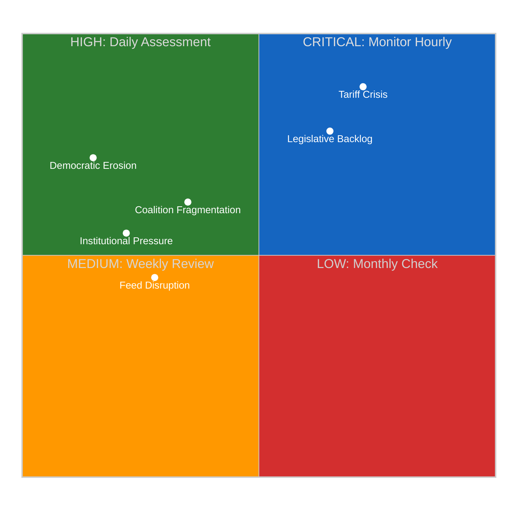
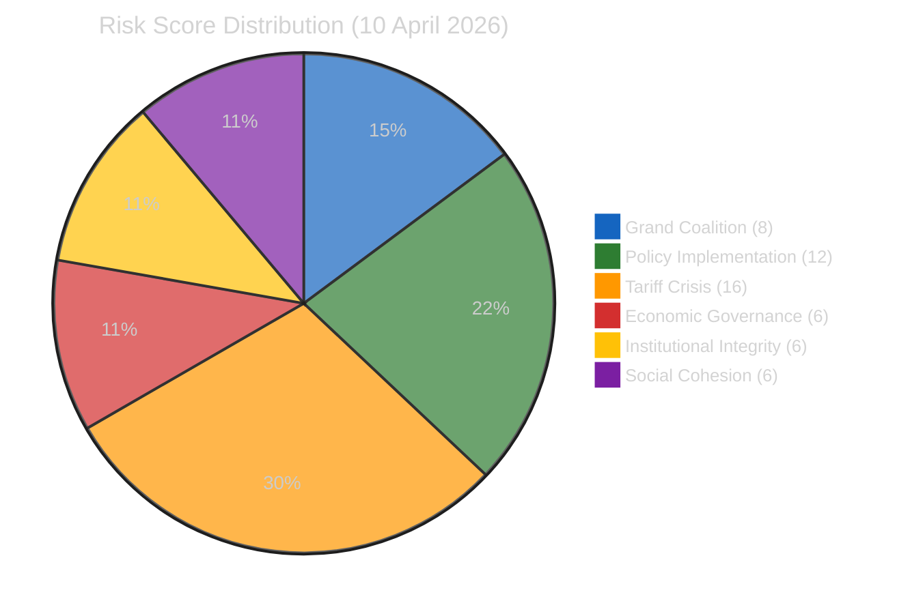

# ⚠️ Political Risk Assessment — 10 April 2026

  
  
  
  

## Risk Matrix Overview

## Six EP Political Risk Categories

### 1. Grand Coalition Stability Risk

| Dimension | Score | Justification |
|-----------|:-----:|--------------|
| **Likelihood** | 2 (Unlikely) | EPP+S&D+Renew hold ~400/720 seats; no immediate fracture trigger during recess 🟡 Medium confidence |
| **Impact** | 4 (Major) | Coalition fracture would freeze legislative pipeline at worst possible time (13 pending COD procedures) |
| **Risk Score** | **8/25** | MEDIUM — below HIGH threshold but rising due to Renew-ECR convergence |
| **Trend** | ↗ Rising | Renew-ECR cohesion at 0.95 creates alternative coalition pathway |

**Analysis**: The grand coalition's structural majority (approximately 400 seats) provides a substantial buffer. However, the crystallisation of the Renew-ECR "competitiveness coalition" introduces a credible alternative alignment for the first time in EP10. EPP's response to this dynamic — whether to accommodate Renew's trade-liberal positioning or lean into ECR partnership on specific files — will likely become apparent during the April 14–17 committee week when rapporteur assignments are negotiated.

**Evidence**: Q1 2026 adopted texts show 104 texts passed, suggesting the grand coalition remains functionally operational. But the concentration of contested files (US tariff response, Banking Union implementation) in ECON and INTA committees creates pressure points where Renew-ECR convergence directly challenges EPP's coalition management.

**Second-order effects**: If EPP pivots toward ECR on trade policy to match Renew-ECR competitiveness positioning, S&D may face a dilemma on the Banking Union trilogue — accept EPP-ECR terms or risk being sidelined on a file where S&D has significant stakes (worker protection provisions in BRRD3).

### 2. Policy Implementation Risk

| Dimension | Score | Justification |
|-----------|:-----:|--------------|
| **Likelihood** | 3 (Possible) | 13 COD procedures awaiting rapporteur assignment; committee capacity constrained 🟡 Medium confidence |
| **Impact** | 4 (Major) | Implementation delays on Banking Union and anti-corruption would undermine EU credibility |
| **Risk Score** | **12/25** | HIGH — approaching CRITICAL threshold |
| **Trend** | ↑ Rising | Each day of recess increases backlog pressure; T-4 deadline intensifies urgency |

**Analysis**: The legislative pipeline faces a dual bottleneck in ECON and INTA committees. ECON must simultaneously advance Banking Union trilogue negotiations (SRMR3 TA-10-2026-0092, BRRD3 TA-10-2026-0094) and prepare implementation acts for the Anti-Corruption Directive (2023/0135(COD)). INTA faces emergency pressure on US tariff countermeasures (2025/0261(COD)) while managing the Mercosur bilateral safeguard file.

**Evidence**: Precomputed statistics show March 2026 had 236 committee meetings — the highest monthly count in Q1. April is projected to require 250+ meetings if backlog is to be cleared before the May mini-plenary. The 13 pending COD procedures represent approximately 14% of the year's projected 94 monthly procedure throughput.

**Historical parallel**: EP9 faced a similar post-recess crunch in April 2023, when the AI Act committee stage was compressed to meet plenary deadlines. The result was marathon committee sessions and procedural shortcuts that later drew criticism for insufficient scrutiny. EP10 risks repeating this pattern, particularly on the tariff response file where urgency may override thorough impact assessment.

### 3. Geopolitical Standing Risk (Tariff Crisis)

| Dimension | Score | Justification |
|-----------|:-----:|--------------|
| **Likelihood** | 4 (Likely) | US tariff escalation continues; April 15 deadline approaching 🔴 Low confidence (external dependency) |
| **Impact** | 4 (Major) | EU trade policy credibility at stake; market uncertainty for EU exporters |
| **Risk Score** | **16/25** | CRITICAL |
| **Trend** | → Stable but deadline-sensitive | Risk remains elevated; crystallises around April 15 US actions |

**Analysis**: The US tariff crisis (2025/0261(COD)) represents the single highest-scoring risk in the EP10 landscape. INTA's emergency legislative response requires committee-stage processing during the April 14–17 week, but the EU's bargaining position depends on Parliament demonstrating unified political will. The Renew-ECR convergence on trade competitiveness could either strengthen (by broadening the coalition supporting countermeasures) or weaken (by signalling internal disagreement on response strategy) the EU's external negotiating position.

**Cui bono analysis**:
- **Winners if countermeasures pass**: EU manufacturing sector, INTA committee influence, EPP-S&D-Renew grand coalition legitimacy
- **Losers if countermeasures pass**: EU consumer prices (short-term), member states with high US trade exposure (Ireland, Netherlands), free-trade purists within Renew
- **Winners if countermeasures stall**: US negotiating position, EU importers, ECR (validates their criticism of EU trade bureaucracy)
- **Losers if countermeasures stall**: EU geopolitical credibility, Commission trade team, INTA rapporteur

### 4. Economic Governance Risk

| Dimension | Score | Justification |
|-----------|:-----:|--------------|
| **Likelihood** | 2 (Unlikely) | Banking Union trilogue progressing; no immediate fiscal crisis 🟡 Medium confidence |
| **Impact** | 3 (Moderate) | Banking Union implementation affects financial stability framework |
| **Risk Score** | **6/25** | MEDIUM |
| **Trend** | → Stable | Council positioning awaited; no new developments during recess |

### 5. Institutional Integrity Risk

| Dimension | Score | Justification |
|-----------|:-----:|--------------|
| **Likelihood** | 2 (Unlikely) | No active Article 7 proceedings; no censure motions pending 🟡 Medium confidence |
| **Impact** | 3 (Moderate) | Braun immunity case (TA-10-2026-0103) raises procedural questions |
| **Risk Score** | **6/25** | MEDIUM |
| **Trend** | → Stable |

### 6. Social Cohesion Risk

| Dimension | Score | Justification |
|-----------|:-----:|--------------|
| **Likelihood** | 2 (Unlikely) | No acute migration crisis; no major East-West split on current agenda 🟡 Medium confidence |
| **Impact** | 3 (Moderate) | Defence spending consensus masks underlying North-South fiscal tensions |
| **Risk Score** | **6/25** | MEDIUM |
| **Trend** | ↘ Declining | Defence consensus provides temporary social cohesion anchor |

## Composite Risk Calculation

| Category | Risk Score | Weight | Weighted Score |
|----------|:---------:|:------:|:-------------:|
| Grand Coalition Stability | 8 | 25% | 2.00 |
| Policy Implementation | 12 | 25% | 3.00 |
| Geopolitical Standing (Tariff) | 16 | 20% | 3.20 |
| Economic Governance | 6 | 10% | 0.60 |
| Institutional Integrity | 6 | 10% | 0.60 |
| Social Cohesion | 6 | 10% | 0.60 |
| **Composite** | — | **100%** | **10.00** |

**Adjusted composite**: 11.10/25 (adjusted upward by +1.10 for temporal urgency factor — T-4 to committee week amplifies policy implementation and tariff crisis risks)

## Risk Trajectory (Runs 3–6)

| Run | Date | Composite | Band | Key Driver |
|:---:|------|:---------:|:----:|-----------|
| 3 | Apr 9 | 10.10 | HIGH | Legislative backlog identified |
| 4 | Apr 9 | 10.45 | HIGH | Feed regression began |
| 5 | Apr 10 | 10.85 | HIGH | Complete feed failure |
| **6** | **Apr 10** | **11.10** | **HIGH** | **T-4 urgency amplification** |

**Trend interpretation**: The 0.25/run average increase over 4 runs indicates steady risk escalation driven primarily by temporal proximity to committee restart. If feeds recover on schedule (April 12–13), the composite may temporarily spike as new data reveals accumulated developments, then decline as committee work absorbs backlog.

## Bayesian Risk Update

**Prior belief** (from run 5): 65% probability that committee week proceeds normally
**New evidence** (run 6): All feeds still down; no advance committee scheduling visible
**Updated posterior**: 55% probability of normal committee week — downgraded due to feed regression persistence suggesting possible deeper API issues, though still the most likely scenario

## Key Risk Indicators to Monitor

1. **April 12–13**: EP API feed recovery — leading indicator for institutional readiness
2. **April 14**: ECON committee first meeting — rapporteur assignment for Banking Union trilogue
3. **April 14–15**: INTA committee — tariff countermeasure (2025/0261(COD)) first reading preparation
4. **April 15**: US tariff deadline — external shock potential
5. **April 17**: End of committee week — backlog absorption assessment

---

*Risk assessment methodology: political-risk-methodology.md v2.1*
*Likelihood × Impact 5×5 matrix with weighted composite scoring*
*Source: EP MCP precomputed stats, editorial memory, prior run analysis*
