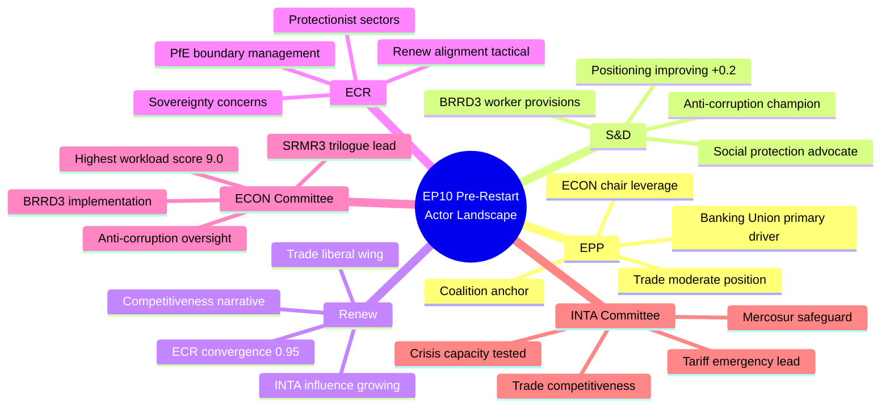
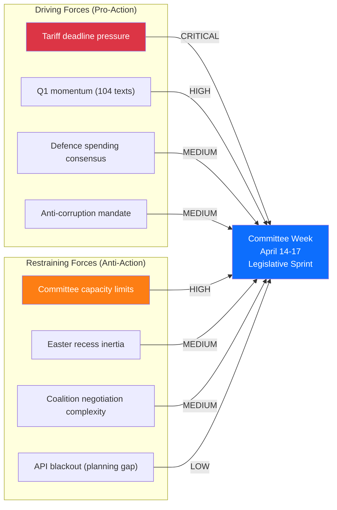
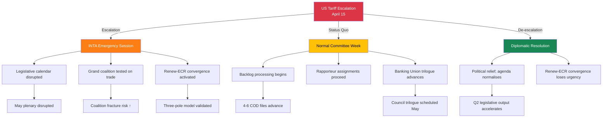

# 🔮 Pre-Restart Intelligence Brief — T-4 Assessment

  
  
  
  
  

## Situation Overview Dashboard

| Indicator | Status | Value | Trend |
|-----------|:------:|-------|:-----:|
| 🟡 Composite Risk | ELEVATED | 11.10/25 | ↑ |
| 🔴 Tariff Crisis | CRITICAL | 16/25 | → |
| 🟠 Legislative Backlog | HIGH | 13/25 | ↑ |
| 🟡 Coalition Stability | MEDIUM | 8/25 | ↗ |
| 🟡 Transparency | DEGRADED | 0/13 feeds operational | ↓ |
| 🟢 Grand Coalition | FUNCTIONAL | ~400/720 seats | → |
| 🟢 Legislative Output | RECORD PACE | 104 adopted texts Q1 | ↑ |

## Intelligence Assessment: Easter Recess Day 15

### Strategic Context

This is the final Friday before the European Parliament's post-Easter restart. Committee week begins Monday 14 April (T-4). The institution faces a convergence of three pressures:

1. **Legislative backlog**: 13 COD procedures accumulated during the 15-day recess require rapporteur assignment and committee scheduling. This backlog is concentrated in two committees (ECON, INTA) that were already at capacity before recess.

2. **External crisis**: The US tariff countermeasure file (2025/0261(COD)) has been classified as CRITICAL risk (16/25) since run 3. The approaching April 15 deadline creates a binary outcome scenario where either (a) US restraint allows normal processing, or (b) escalation forces emergency EP response.

3. **Coalition evolution**: The three-pole parliamentary structure (Grand Coalition core / Renew-ECR competitiveness bloc / PfE-ESN-Left opposition) has been documented across multiple analysis runs. Its practical implications will first become visible during the April 14–17 committee week.

### Actor Mapping

### Stakeholder Impact Assessment

#### Perspective 1: EP Political Groups

| Group | Impact Direction | Severity | Assessment |
|-------|:----------------:|:--------:|------------|
| **EPP** | Mixed | High | EPP faces the most complex strategic challenge: managing grand coalition while responding to Renew-ECR convergence. Committee week rapporteur negotiations will reveal whether EPP accommodates or confronts the competitiveness coalition. The Banking Union triple package remains EPP's signature legislative achievement — protecting this legacy requires S&D cooperation. 🟡 Medium confidence |
| **S&D** | Positive | Medium | S&D's positioning improvement (+0.2) reflects growing leverage as the essential grand coalition partner. If EPP pivots toward ECR on trade, S&D becomes the indispensable social protection voice in Banking Union negotiations (BRRD3 worker provisions). Risk: marginalisation on competitiveness agenda. 🟡 Medium confidence |
| **Renew** | Positive | High | Renew's 0.95 cohesion with ECR on trade/competitiveness gives the group unusual influence for its 77-seat delegation. Committee week will test whether this translates into concrete rapporteur assignments or committee chair leverage. 🟡 Medium confidence |
| **ECR** | Positive | Medium | ECR benefits from Renew convergence without having to compromise core positions. The tariff crisis may, however, expose tensions between ECR's protectionist instincts and Renew's free-market ideology. 🔴 Low confidence |

#### Perspective 2: EU Citizens

The most direct citizen impact comes from the tariff crisis. If US tariff escalation materialises and EP's countermeasure response is delayed by backlog/committee capacity constraints, EU consumers and exporters face extended uncertainty. The Anti-Corruption Directive transposition (24-month clock started 26 March) represents a positive long-term development for citizens' trust in public institutions, but implementation monitoring requires committee attention that competes with trade crisis response.

#### Perspective 3: Industry and Business

EU exporters face the highest immediate stakes. The INTA committee's ability to advance 2025/0261(COD) during committee week directly affects business planning for Q2-Q3 2026. Banking Union implementation (SRMR3/BRRD3/DGSD2) affects financial sector regulatory framework — implementation delays create compliance uncertainty for EU banks already preparing for new capital requirements.

### Forces Analysis

**Net assessment**: Driving forces (tariff deadline + Q1 momentum) slightly outweigh restraining forces (capacity + inertia). The balance tips toward an active but potentially chaotic committee week. **Prediction: 60% probability of productive but strained restart; 30% tariff-dominated emergency; 10% dysfunction/delay.** 🟡 Medium confidence

### Consequence Tree: Tariff Crisis Escalation

### Cross-Session Intelligence Update

**Tracking from prior runs (cumulative findings):**

1. **Banking Union triple package** — SRMR3 (TA-10-2026-0092), BRRD3 (TA-10-2026-0094), DGSD2: Adopted in March, entering trilogue with Council. ECON committee leads. First post-recess trilogue meeting expected late April / early May. Key tension: worker protection provisions (S&D) vs. industry flexibility (EPP-ECR).

2. **Anti-Corruption Directive** — 2023/0135(COD): 24-month transposition clock started 26 March 2026. Committee oversight phase begins. LIBE committee primary responsibility. This file has broad cross-party support (one of few EP10 consensus items).

3. **US tariff countermeasures** — 2025/0261(COD): Emergency trade response file. INTA committee lead. Accelerated procedure possible if crisis escalates. Renew-ECR alignment provides political foundation but implementation details may reveal fault lines (which sectors protected, which sacrificed).

4. **Renew-ECR convergence** — 0.95 cohesion documented across 3 analysis runs. This is not a temporary tactical alignment but an emerging structural feature of EP10 politics. Post-recess, watch for: joint press statements, coordinated amendment packages, or informal "competitiveness caucus" formation.

5. **Committee power rankings** — ECON (9.0), LIBE (8.0), INTA (7.3), SEDE (rising). The ECON-INTA dual bottleneck is the primary institutional risk. SEDE's rising power score reflects defence spending consensus — potentially a stabilising force for broader coalition management.

### Monitoring Priorities for April 12–17

| Priority | Target | Indicator | Action Threshold |
|:--------:|--------|-----------|:----------------:|
| 🔴 P1 | EP API Feed Recovery | Any feed returns data | Alert: begin immediate data download |
| 🔴 P2 | US Tariff Announcements | Official US trade policy action | Trigger: breaking news workflow |
| 🟠 P3 | INTA Emergency Convocation | Unscheduled committee meeting | Trigger: breaking news workflow |
| 🟡 P4 | Rapporteur Assignments | Named rapporteurs for COD backlog | Track: update legislative pipeline |
| 🟡 P5 | Coalition Voting Patterns | First post-recess committee votes | Analyse: Renew-ECR cohesion test |
| 🟢 P6 | Committee Agendas Published | April 14–17 meeting agendas visible | Baseline: operational readiness |

### Data Availability Gap Assessment

| Data Type | Current Status | Impact on Analysis | Mitigation |
|-----------|:-------------:|-------------------|------------|
| Feed endpoints (13) | ❌ All error | Cannot identify today-dated events | Precomputed stats for historical context |
| Voting anomalies | ❌ Error | Cannot detect pre-recess voting patterns | Prior run data (stale but directional) |
| Coalition dynamics | ⚠️ Partial (structure only, no data) | Cannot compute current cohesion scores | Prior run 0.95 Renew-ECR figure retained |
| Political landscape | ❌ Error | Cannot map current group positioning | Prior run trends used as baseline |
| Early warning | ❌ Error | Cannot run automated risk detection | Manual risk assessment (this document) |
| Precomputed stats | ✅ Working (264 KB) | Q1 2026 complete data available | Primary analytical data source |

**Assessment**: Data quality is the binding constraint on this analysis. Confidence levels across all assessments are capped at MEDIUM due to the absence of live feed data. When feeds recover (expected April 12–13), a full data refresh should update all risk scores and coalition metrics.

---

*Intelligence brief methodology: weekly-intelligence-brief.md (adapted), ai-driven-analysis-guide.md v4.1*
*Alert status: ELEVATED — driven by tariff crisis and legislative backlog convergence at T-4*
*Next assessment: April 12–13 (expected feed recovery window)*
