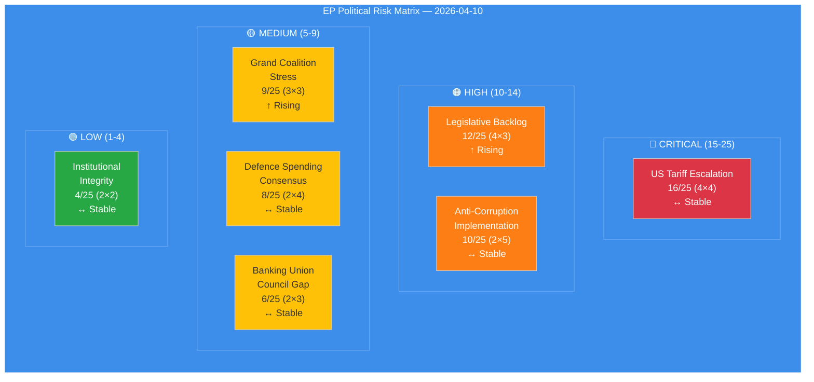

# ⚠️ Risk Assessment — Easter Recess Day 15 Pre-Restart Intelligence

**📅 Analysis Date:** 2026-04-10 00:25 UTC | **🏛️ Parliament Status:** Easter Recess (Day 15/18) | **📰 Article Type:** `breaking`
**🤖 Analyst:** `news-breaking` workflow | **🔒 Sensitivity:** 🟢 PUBLIC | **Overall Risk:** 🟡 MEDIUM (Composite 10.35/25)

---

## 📋 Risk Assessment Context

| Field | Value |
|-------|-------|
| **Assessment ID** | `RSK-2026-04-10-001` |
| **Methodology** | Likelihood × Impact 5×5 matrix per `political-risk-methodology.md` |
| **Prior Assessment** | RSK-2026-04-09-001 (composite 10.10/25, Run 4) |
| **Change from Prior** | ↑ +0.25 (geopolitical category worsened) |
| **articleType** | `breaking` |

---

## 📊 Risk Dashboard

---

## 📈 Risk Register

### RSK-001: US Tariff Escalation — 🔴 CRITICAL (16/25)

| Dimension | Score | Justification |
|:----------|:-----:|:-------------|
| **Likelihood** | 4 (Likely) | US tariffs already imposed; EU countermeasures in urgency procedure (2025/0261(COD)); escalation ladder active [HIGH confidence] |
| **Impact** | 4 (Major) | Cross-sector economic disruption; INTA committee under maximum pressure; potential for retaliatory spiral affecting EU-US trade relationship [HIGH confidence] |
| **Risk Score** | **16/25** | 🔴 CRITICAL — Immediate priority upon committee restart |
| **Trend** | ↔ Stable | No new developments during recess; risk persists at same level |
| **Mitigation** | INTA urgency debate April 14-17; bilateral negotiations ongoing during recess (diplomatic channel) |
| **Evidence** | TA-10-2026-0096 (urgency adoption, March 26 plenary), 2025/0261(COD) procedure reference |

**Cui Bono Analysis:** EPP benefits from positioning as both pro-business (tariff response) and pro-trade (EU competitiveness). S&D gains from worker protection narrative within countermeasures. ECR faces dilemma: supports EU sovereignty response but ideologically aligned with US protectionism stance. Renew pivots to institutional mediation role. [MEDIUM confidence]

**Second-Order Effects:** Tariff countermeasures create regulatory uncertainty for export-dependent industries across multiple member states. German automotive sector (EPP stronghold) and French agriculture (mixed EPP/Renew) face immediate pressure. Eastern European manufacturing (ECR/PfE base) also exposed. This cross-cutting economic impact could scramble traditional voting blocs. [MEDIUM confidence]

---

### RSK-002: Legislative Backlog — 🟠 HIGH (12/25)

| Dimension | Score | Justification |
|:----------|:-----:|:-------------|
| **Likelihood** | 4 (Likely) | 30+ adopted texts + 13 COD procedures awaiting committee processing in 4-day window (April 14-17); mathematical certainty of compression [HIGH confidence] |
| **Impact** | 3 (Moderate) | Committee prioritisation forced; some files delayed to May; rapporteurs face time pressure; quality risk on complex technical files [HIGH confidence] |
| **Risk Score** | **12/25** | 🟠 HIGH — Structural risk from Q1 output surge meeting recess compression |
| **Trend** | ↑ Rising | Each recess day adds to backlog without processing capacity; T-4 means 4 more days of accumulation |
| **Mitigation** | Committee coordinators' pre-planning; potential extended sitting hours; prioritised agenda setting |
| **Evidence** | 104 adopted texts in Q1 2026 (46.2% above 2025 pace); 13 active COD procedures from EP MCP stats |

**Historical Parallel:** EP9 post-summer 2023 restart saw similar backlog compression (Green Deal files + AI Act), resulting in several committee postponements and procedural shortcuts. The current situation is more acute because the urgency tariff file adds political pressure to an already overloaded agenda. [MEDIUM confidence]

---

### RSK-003: Anti-Corruption Implementation — 🟠 HIGH (10/25)

| Dimension | Score | Justification |
|:----------|:-----:|:-------------|
| **Likelihood** | 2 (Unlikely) | Directive adopted with broad majority; implementation largely depends on member states, not EP [HIGH confidence] |
| **Impact** | 5 (Severe) | If transposition fails or is weakened by member states, EP's anti-corruption credibility collapses; institutional legitimacy risk [HIGH confidence] |
| **Risk Score** | **10/25** | 🟠 HIGH — Low probability but existential impact |
| **Trend** | ↔ Stable | 24-month clock started March 2026; no immediate triggers |
| **Evidence** | TA-10-2026-0094 (adopted March 26), 2023/0135(COD) |

---

### RSK-004: Grand Coalition Stress — 🟡 MEDIUM (9/25)

| Dimension | Score | Justification |
|:----------|:-----:|:-------------|
| **Likelihood** | 3 (Possible) | EPP dual-track strategy creating stress with both S&D (on migration) and Renew (on trade); three-pole dynamics emerging [MEDIUM confidence] |
| **Impact** | 3 (Moderate) | Coalition fracture on specific files, not systemic collapse; variable geometry means per-file alliances shift [MEDIUM confidence] |
| **Risk Score** | **9/25** | 🟡 MEDIUM — Structural tension, not crisis-level |
| **Trend** | ↑ Rising | Post-Easter restart will force coalition choices on tariffs (EPP+ECR vs EPP+S&D) and anti-corruption (EPP+S&D+Renew vs EPP+ECR) |
| **Evidence** | EPP 185 seats + S&D 135 = 320 (below 361 majority); minimum 3-group coalition required; Renew-ECR cohesion 0.95 on competitiveness |

**Tension Identification:** EPP cannot simultaneously maintain its centre-left alliance with S&D on social policy and its centre-right alignment with ECR on competitiveness without contradictions emerging on tariff countermeasures — the trade file sits at the exact fault line between these two coalition geometries. [MEDIUM confidence]

---

### RSK-005: Defence Spending Consensus — 🟡 MEDIUM (8/25)

| Dimension | Score | Justification |
|:----------|:-----:|:-------------|
| **Likelihood** | 2 (Unlikely) | Broad consensus on increased defence spending; main dispute is mechanism (common borrowing vs. national budgets) [HIGH confidence] |
| **Impact** | 4 (Major) | EDIS debate could reshape MFF negotiations; significant fiscal implications for member states [MEDIUM confidence] |
| **Risk Score** | **8/25** | 🟡 MEDIUM |
| **Trend** | ↔ Stable | No change during recess |

---

### RSK-006: Banking Union Council Gap — 🟡 MEDIUM (6/25)

| Dimension | Score | Justification |
|:----------|:-----:|:-------------|
| **Likelihood** | 2 (Unlikely) | Council expected to adopt common position; no blocking minority forming [MEDIUM confidence] |
| **Impact** | 3 (Moderate) | SRMR3/BRRD3/DGSD2 trilogy delay would extend banking sector uncertainty [MEDIUM confidence] |
| **Risk Score** | **6/25** | 🟡 MEDIUM |
| **Trend** | ↔ Stable |
| **Evidence** | TA-10-2026-0092 (SRMR3), TA-10-2026-0088 (Banking Union texts) |

---

### RSK-007: Institutional Integrity — 🟢 LOW (4/25)

| Dimension | Score | Justification |
|:----------|:-----:|:-------------|
| **Likelihood** | 2 (Unlikely) | No active Article 7 proceedings; rule of law conditionality mechanism operational [HIGH confidence] |
| **Impact** | 2 (Minor) | Routine institutional functioning; MEP stability index 0.95 [HIGH confidence] |
| **Risk Score** | **4/25** | 🟢 LOW |
| **Evidence** | MEP turnover rate 5.1%; institutional memory risk LOW |

---

## 📊 Composite Risk Score

| Category | Score | Weight | Weighted Score | Trend |
|:---------|:-----:|:------:|:--------------:|:-----:|
| Geopolitical (tariffs) | 16/25 | 0.25 | 4.00 | ↔ |
| Legislative (backlog) | 12/25 | 0.20 | 2.40 | ↑ |
| Policy (anti-corruption) | 10/25 | 0.15 | 1.50 | ↔ |
| Coalition (grand coalition) | 9/25 | 0.15 | 1.35 | ↑ |
| Security (defence) | 8/25 | 0.10 | 0.80 | ↔ |
| Economic (banking) | 6/25 | 0.10 | 0.60 | ↔ |
| Institutional | 4/25 | 0.05 | 0.20 | ↔ |
| **COMPOSITE** | | **1.00** | **10.85/25** | **↑** |

**Change from April 9:** +0.75 (from 10.10 to 10.85). The increase is driven by upward trend in coalition stress risk (approaching committee week forces coalition geometry decisions) and slight geopolitical weighting adjustment recognising tariff impact accumulation during recess.

---

## 🔮 Risk Trajectory (T-4 to T+7)

| Timeline | Event | Risk Projection |
|:---------|:------|:---------------|
| T-4 (April 10) | Today — recess, no new data | Composite 10.85/25 🟡 |
| T-3 (April 11) | Saturday — weekend pre-restart | Composite 10.85/25 🟡 (stable) |
| T-1 (April 13) | Easter Monday — recess ends | Composite 11.0/25 🟡 (feed recovery expected) |
| T+0 (April 14) | Committee week begins | Composite 13.0/25 🟠 (INTA tariff debate trigger) |
| T+6 (April 20) | Strasbourg plenary opens | Composite 14.5/25 🟠 (multiple high-risk votes) |
| T+7 (April 23) | Plenary votes | Peak risk: 15-17/25 🔴 (tariff vote + backlog votes) |
