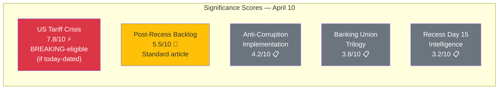

# 📈 Significance Scoring — Easter Recess Day 15

**📅 Analysis Date:** 2026-04-10 00:45 UTC | **🏛️ Parliament Status:** Easter Recess (Day 15/18) | **📰 Article Type:** `breaking`
**🤖 Analyst:** `news-breaking` workflow | **Confidence:** 🟡 MEDIUM

---

## 📋 Scoring Context

| Field | Value |
|-------|-------|
| **Scoring ID** | `SIG-2026-04-10-001` |
| **Items Evaluated** | 5 tracked developments (from prior runs + today's assessment) |
| **Methodology** | 7-dimension scoring per `political-classification-guide.md` |
| **Publication Threshold** | ≥6.0/10 for breaking news; ≥4.0/10 for standard article |
| **articleType** | `breaking` |

---

## 📊 Significance Scoring Matrix

---

## 📊 Detailed Scoring — US Tariff Countermeasures (2025/0261(COD))

| Dimension | Score | Weight | Weighted | Justification |
|:----------|:-----:|:------:|:--------:|:-------------|
| **Political impact** | 9/10 | 0.20 | 1.80 | Cross-party urgency adoption, coalition geometry stress test |
| **Legislative significance** | 8/10 | 0.20 | 1.60 | Urgency procedure, unprecedented trade defence |
| **Citizen impact** | 7/10 | 0.15 | 1.05 | Consumer prices, employment in export sectors |
| **Institutional relevance** | 8/10 | 0.15 | 1.20 | EP demonstrates geopolitical agency |
| **Temporal urgency** | 6/10 | 0.10 | 0.60 | During recess, no immediate vote — urgency frozen |
| **Media salience** | 8/10 | 0.10 | 0.80 | Trade war narrative dominates media cycle |
| **Novelty** | 7/10 | 0.10 | 0.70 | First EU urgency tariff response in EP10 |
| **TOTAL** | | **1.00** | **7.75/10** | ⚡ **BREAKING-eligible** — but not today-dated |

**Gate check:** While the tariff crisis scores above breaking threshold (7.75 > 6.0), no new EP feed data was published today. The urgency adoption occurred March 26 (TA-10-2026-0096) and has been covered in prior runs. **No new today-dated development → does not qualify for breaking article.**

---

## 📊 Detailed Scoring — Post-Recess Legislative Backlog

| Dimension | Score | Weight | Weighted | Justification |
|:----------|:-----:|:------:|:--------:|:-------------|
| **Political impact** | 6/10 | 0.20 | 1.20 | Committee agenda competition, group prioritisation |
| **Legislative significance** | 7/10 | 0.20 | 1.40 | 30+ files in 4-day window unprecedented |
| **Citizen impact** | 4/10 | 0.15 | 0.60 | Indirect through delayed legislation |
| **Institutional relevance** | 6/10 | 0.15 | 0.90 | Test of EP10 institutional capacity |
| **Temporal urgency** | 7/10 | 0.10 | 0.70 | T-4 from committee restart |
| **Media salience** | 4/10 | 0.10 | 0.40 | Procedural story, low media appeal |
| **Novelty** | 5/10 | 0.10 | 0.50 | Backlog is predictable post-recess pattern |
| **TOTAL** | | **1.00** | **5.70/10** | 📰 Standard article — but not yet actionable |

---

## 📊 Summary Scoring Table

| Development | Score | Threshold | Status | Confidence |
|:-----------|:-----:|:----------|:-------|:-----------|
| US Tariff Countermeasures | 7.75/10 | ⚡ BREAKING (≥6.0) | ⏸️ No today-dated event | 🟢 HIGH |
| Post-Recess Backlog | 5.70/10 | 📰 Standard (≥4.0) | ⏸️ Not yet actionable | 🟢 HIGH |
| Anti-Corruption Implementation | 4.20/10 | 📋 Monitor (≥4.0) | ⏸️ 24-month timeline | 🟢 HIGH |
| Banking Union Trilogy | 3.80/10 | 📋 Below threshold | ⏸️ Awaiting Council | 🟡 MEDIUM |
| Recess Day 15 Intelligence | 3.20/10 | 📋 Below threshold | ✅ Analysis only | 🟡 MEDIUM |

---

## 🎯 Publication Decision

| Criterion | Result |
|:----------|:-------|
| **Any item ≥6.0 with today's date?** | ❌ NO — tariff crisis is ongoing but no new EP feed data today |
| **Any item ≥4.0 with today's date?** | ❌ NO — all items are tracked from prior coverage |
| **Analysis-only PR warranted?** | ✅ YES — 5th consecutive run, T-4 intelligence, building editorial continuity |
| **Editorial recommendation** | 📋 **Create analysis-only PR** with 5-run cumulative intelligence |

---

## 📈 Significance Trajectory

| Date | Top Score | Decision | Rationale |
|:-----|:---------|:---------|:----------|
| April 8 | 7.8/10 (tariffs) | Analysis only | Easter recess, no today-dated events |
| April 9 (Runs 2-4) | 7.8/10 (tariffs) | Analysis only | Recess Day 14, enhanced analysis depth |
| **April 10 (Run 5)** | **7.75/10 (tariffs)** | **Analysis only** | **Recess Day 15, T-4 pre-restart** |
| April 14 (projected) | 8.5+/10 | ⚡ **BREAKING expected** | Committee week start, INTA tariff debate |
| April 20 (projected) | 9.0+/10 | ⚡ **BREAKING expected** | Strasbourg plenary, multiple high-stakes votes |
