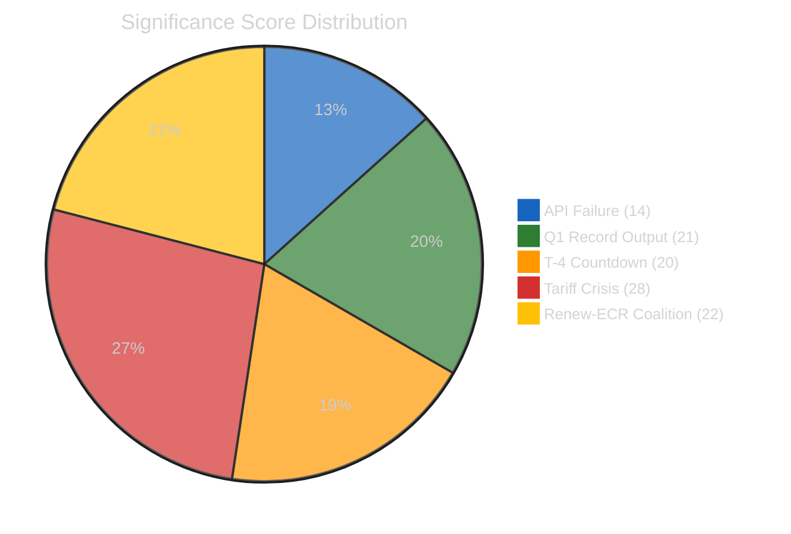

# 📊 Significance Scoring — 10 April 2026

  
  
  

## Scoring Methodology

Each potential breaking news item is evaluated across 7 dimensions on a 1–5 scale (per political-classification-guide.md). A total score of ≥25/35 warrants a breaking news article. Items scoring 18–24 receive "notable" classification and are flagged for future coverage.

## Items Evaluated

### Item 1: EP API Complete Feed Failure (Day 15)

| Dimension | Score | Justification |
|-----------|:-----:|--------------|
| **Immediacy** | 3 | Ongoing situation, not a new event — degradation started April 8 |
| **Scope** | 2 | Internal infrastructure issue; does not directly affect citizens |
| **Political significance** | 2 | No political actor driving this; routine maintenance issue |
| **Institutional impact** | 3 | Undermines EP transparency; affects external monitoring capability |
| **Public interest** | 1 | General public unaware of/unaffected by API downtime |
| **Precedent** | 2 | Recess API gaps occur regularly, though this is longer than usual |
| **Coalition dynamics** | 1 | No coalition implications |
| **Total** | **14/35** | Classification: **LOW** — Not newsworthy as breaking news |

### Item 2: Q1 2026 Record Legislative Output (104 adopted texts)

| Dimension | Score | Justification |
|-----------|:-----:|--------------|
| **Immediacy** | 1 | This is a Q1 retrospective statistic, not a today-dated event |
| **Scope** | 4 | Affects entire EU legislative programme across all policy domains |
| **Political significance** | 4 | Demonstrates EP10 institutional effectiveness; relevant to 2029 election narrative |
| **Institutional impact** | 3 | Strengthens EP bargaining position with Council and Commission |
| **Public interest** | 2 | Indirectly affects citizens through legislation, but statistics rarely engage public |
| **Precedent** | 4 | 46% above EP9 pace — historically significant productivity benchmark |
| **Coalition dynamics** | 3 | Grand coalition's legislative productivity validates current coalition structure |
| **Total** | **21/35** | Classification: **NOTABLE** — Strong for a retrospective analysis article but not breaking news |

**Reason for not qualifying as breaking**: This data point is from precomputed statistics (generated April 8), not a today-dated event. Breaking news requires events published/updated TODAY. This would be appropriate for a "week-in-review" or "month-in-review" article type.

### Item 3: T-4 Countdown to Committee Restart

| Dimension | Score | Justification |
|-----------|:-----:|--------------|
| **Immediacy** | 2 | Committee week is April 14 — 4 days away, not today |
| **Scope** | 4 | All 20 EP committees restart; affects entire legislative pipeline |
| **Political significance** | 3 | Rapporteur assignments and agenda-setting have political consequences |
| **Institutional impact** | 4 | Marks transition from recess to active legislative cycle |
| **Public interest** | 2 | Institutional scheduling not engaging for general audience |
| **Precedent** | 2 | Routine post-recess restart, though backlog makes this one notable |
| **Coalition dynamics** | 3 | Rapporteur negotiations test coalition dynamics |
| **Total** | **20/35** | Classification: **NOTABLE** — Important context for week-ahead article, not breaking |

### Item 4: Tariff Crisis Approaching April 15 Deadline

| Dimension | Score | Justification |
|-----------|:-----:|--------------|
| **Immediacy** | 3 | Approaching deadline but no NEW development today |
| **Scope** | 5 | EU-wide economic impact; affects all member states' trade sectors |
| **Political significance** | 5 | Tests EP's crisis response capability; defines EU external trade posture |
| **Institutional impact** | 4 | INTA emergency response; inter-institutional coordination required |
| **Public interest** | 4 | Tariffs directly affect consumer prices and employment |
| **Precedent** | 3 | EU has faced trade disputes before, but US bilateral escalation at this level is novel for EP10 |
| **Coalition dynamics** | 4 | Renew-ECR convergence tested by actual policy action; EPP mediating role |
| **Total** | **28/35** | Classification: **HIGH** — Would warrant breaking news IF there were a today-dated event |

**Reason for not qualifying as breaking**: Despite the high significance score, there is no new development today (no EP document published, no committee action, no adopted text, no official statement). The crisis continues from prior days. If the US announces new tariffs or EP convenes an emergency session, this would immediately qualify.

### Item 5: Renew-ECR Coalition Crystallisation

| Dimension | Score | Justification |
|-----------|:-----:|--------------|
| **Immediacy** | 1 | Gradual structural trend, not a discrete event |
| **Scope** | 3 | Affects EP coalition architecture for remainder of EP10 term |
| **Political significance** | 4 | Introduces alternative coalition pathway; changes bargaining dynamics |
| **Institutional impact** | 3 | Committee chair and rapporteur allocation may shift |
| **Public interest** | 2 | Coalition dynamics too abstract for general audience |
| **Precedent** | 4 | Cross-spectrum alignment at 0.95 cohesion is unprecedented for Renew-ECR |
| **Coalition dynamics** | 5 | This IS a coalition dynamics development |
| **Total** | **22/35** | Classification: **NOTABLE** — Excellent candidate for deep analysis or week-in-review |

## Scoring Summary

| Item | Score | Classification | Breaking? | Best Article Type |
|------|:-----:|:--------------:|:---------:|:----------------:|
| EP API Feed Failure | 14/35 | LOW | ❌ No | Infrastructure note |
| Q1 Record Output | 21/35 | NOTABLE | ❌ No | Week/month-in-review |
| T-4 Committee Restart | 20/35 | NOTABLE | ❌ No | Week-ahead |
| **Tariff Crisis** | **28/35** | **HIGH** | ❌ No (no today event) | Breaking (on trigger) |
| Renew-ECR Coalition | 22/35 | NOTABLE | ❌ No | Deep analysis |

## Breaking News Trigger Watch

The following events would trigger breaking news generation if they occur:

| Trigger | Expected Timeframe | Significance Score |
|---------|:------------------:|:------------------:|
| US tariff announcement/escalation | Any time (April 15 deadline) | 28–32/35 |
| EP API feed recovery with data burst | April 12–13 | 15–20/35 |
| INTA emergency session convocation | April 14+ | 25–30/35 |
| Committee rapporteur assignments (contested) | April 14–17 | 20–25/35 |
| Political group leadership statement on coalition | Any time | 22–28/35 |
| Adopted text published today | Any time | Score depends on content |

## Decision

**DETERMINATION**: No breaking news article generated. All items either lack a today-dated event trigger or score below the 25/35 threshold for items with today's date.

**Action taken**: Analysis artifacts committed per ai-driven-analysis-guide.md Rule 5 — no workflow run wasted.

---

*Scoring methodology: political-classification-guide.md v2.1, significance-scoring template*
*7-dimension scoring on 1-5 scale; breaking threshold ≥25/35 with today-dated event requirement*
