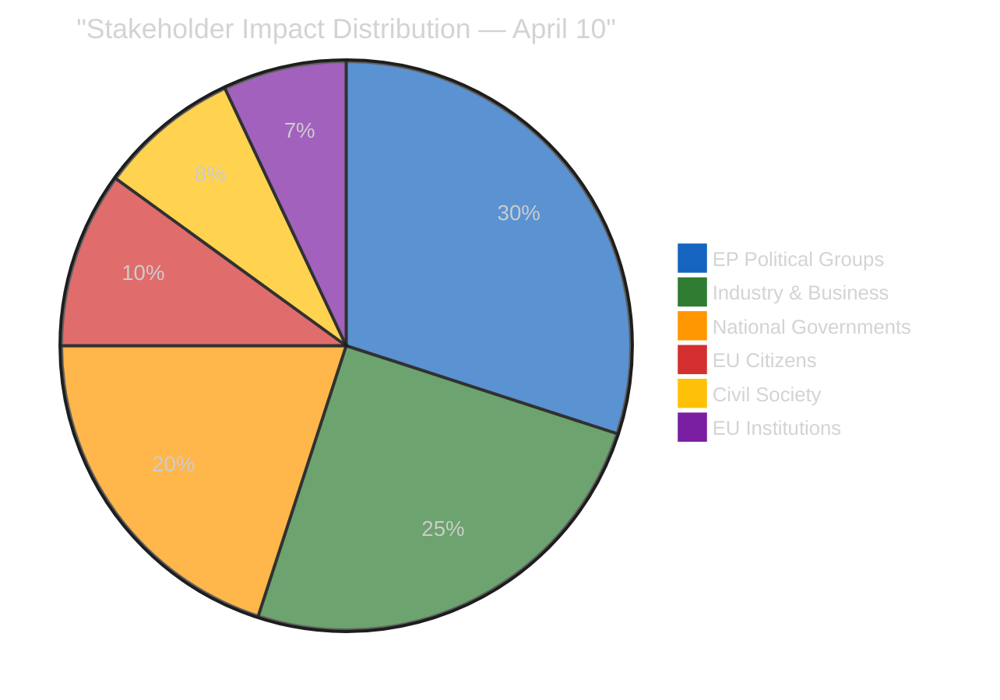

# 👥 Stakeholder Impact Assessment — Easter Recess Day 15

**📅 Analysis Date:** 2026-04-10 00:40 UTC | **🏛️ Parliament Status:** Easter Recess (Day 15/18) | **📰 Article Type:** `breaking`
**🤖 Analyst:** `news-breaking` workflow | **🔒 Sensitivity:** 🟢 PUBLIC | **Confidence:** 🟡 MEDIUM

---

## 📋 Stakeholder Assessment Context

| Field | Value |
|-------|-------|
| **Assessment ID** | `STK-2026-04-10-001` |
| **Focus** | Post-recess restart impact on 6 stakeholder categories |
| **Prior Assessment** | STK-2026-04-09-001 (Run 4) |
| **Key Development** | T-4 to committee week, tariff crisis + backlog + coalition geometry |
| **articleType** | `breaking` |

---

## 📊 Stakeholder Impact Dashboard

---

## 🏛️ EP Political Groups — Impact: HIGH, Direction: MIXED

### EPP (185 seats) — Under Maximum Pressure

**Impact:** 🟡 MIXED | **Severity:** HIGH | **Confidence:** 🟡 MEDIUM

EPP faces the most complex strategic challenge of any group heading into the post-Easter restart. The party must simultaneously manage:

1. **Tariff countermeasures** — EPP's industrial base (German automotive, Italian manufacturing) demands strong trade defence, pushing alignment with Renew-ECR competitiveness pole. However, EPP's agricultural constituencies (French, Polish, Spanish farmers) may prefer targeted sectoral protection over broad countermeasures.
2. **Anti-corruption oversight** — EPP joined the adoption majority in March (TA-10-2026-0094) and must now support transposition monitoring, aligning with S&D and Greens on rule of law issues — uncomfortable for EPP's right flank.
3. **Coalition management** — As largest group (25.7%), EPP is the indispensable coalition partner. But with grand coalition deficit (-5.5%), every vote requires active negotiation with Renew or ECR, creating transaction costs that accumulate across the 30+ file backlog.

**Winner/Loser Assessment:** EPP is both the most powerful and most constrained actor — it can shape every outcome but must balance contradictory alliance demands. Net assessment: **constrained power** [MEDIUM confidence].

### S&D (135 seats) — Positioning Improving

**Impact:** 🟢 POSITIVE | **Severity:** MEDIUM | **Confidence:** 🟡 MEDIUM

S&D's institutional positioning has improved +0.2 since prior analysis (Run 3). The group benefits from clear alignment on anti-corruption (oversight champion), social safeguards in tariff response (worker protection framing), and Banking Union implementation (regulatory stability). S&D's strategy is coherent: support progressive legislation, demand social conditionality on trade, and position as the constructive alternative to EPP's variable geometry.

**Key advantage:** S&D doesn't need to manage contradictory alliances — its natural coalition partners (Greens/EFA, GUE/NGL) are ideologically aligned on most post-recess files. The Social-Progressive pole (234 seats) is the largest single bloc, giving S&D leverage in any negotiation.

### Renew (76 seats) + ECR (79 seats) — Competitiveness Convergence

**Impact:** 🟢 POSITIVE | **Severity:** MEDIUM | **Confidence:** 🟡 MEDIUM

The Renew-ECR convergence (0.95 cohesion on competitiveness metrics) continues to solidify. This unlikely alliance of centrist liberals and conservative reformists has found common ground on trade policy, deregulation, and industrial competitiveness. Post-recess, this bloc (155 seats) becomes the swing vote on tariff countermeasures — EPP needs one of these groups to reach majority.

**Risk:** ECR's eurosceptic wing may resist any response that strengthens EU-level competences (including EU-wide tariff countermeasures). Renew's federalist wing may resist any compromise with ECR on institutional governance. The convergence is policy-specific, not structural. [MEDIUM confidence]

### Greens/EFA (53 seats) + GUE/NGL (46 seats) — Marginalised on Trade

**Impact:** 🔴 NEGATIVE | **Severity:** LOW | **Confidence:** 🟡 MEDIUM

The left flank (99 seats combined) risks marginalisation on the post-Easter trade file. Neither Greens nor GUE/NGL are needed for a tariff majority (EPP + Renew + ECR = 340, or EPP + S&D + Renew = 396). Their influence is limited to amendment-level modifications on social and environmental conditionality within the countermeasures package.

### PfE (84 seats) + ESN (28 seats) — Disruption Opportunity

**Impact:** 🟡 MIXED | **Severity:** LOW | **Confidence:** 🟡 MEDIUM

Eurosceptic groups (112 seats, 15.6%) cannot block legislation but gain from post-recess compression. Extended debate requests and amendment flooding on the tariff file would amplify narratives of institutional dysfunction. PfE's position on US tariffs is complex: ideological sympathy with protectionism but nationalist interest in EU-level response to protect national industries.

---

## 🏭 Industry & Business — Impact: HIGH, Direction: NEGATIVE

**Impact:** 🔴 NEGATIVE | **Severity:** HIGH | **Confidence:** 🟢 HIGH

European industry is the primary victim of the tariff escalation and the beneficiary of rapid legislative response. The Easter recess creates an information vacuum that increases market uncertainty.

| Sector | Impact Direction | Mechanism | Key Stakeholder |
|:-------|:----------------|:----------|:---------------|
| Automotive | 🔴 NEGATIVE | US tariff exposure, supply chain disruption | German OEMs, EPP constituency |
| Agriculture | 🟡 MIXED | Potential EU retaliatory tariffs on US agricultural imports | French/Polish farmers, EPP/ECR constituency |
| Financial services | 🟢 POSITIVE | Banking Union trilogy provides regulatory clarity | Pan-EU banks, ECON committee alignment |
| Technology | 🟡 MIXED | Clean Industrial Deal creates opportunities, AI Act creates compliance costs | Pan-EU tech sector |
| Defence | 🟢 POSITIVE | EDIS spending consensus benefits domestic producers | National champions, AFET/SEDE alignment |

**Immediate winner:** Defence industry (consensus on increased spending). **Immediate loser:** Export-oriented manufacturing (tariff uncertainty during recess information vacuum).

---

## 🏳️ National Governments — Impact: MEDIUM, Direction: MIXED

**Impact:** 🟡 MIXED | **Severity:** MEDIUM | **Confidence:** 🟡 MEDIUM

National governments face divergent pressures from the post-recess legislative agenda:

1. **Trade-dependent economies** (Germany, Netherlands, Denmark) urgently need tariff countermeasures adopted — every week of delay costs export revenue.
2. **Agricultural economies** (France, Spain, Poland, Italy) want targeted sectoral protection, not broad countermeasures that could trigger retaliatory tariffs on agricultural products.
3. **Anti-corruption implementation** requires 27 national transposition processes within 24 months — significant legal drafting burden for justice ministries.

**Council dynamics:** The Banking Union trilogy awaits Council common position. National finance ministers' positions have been hardening during the recess, with Germany and France reportedly diverging on DGSD2 deposit guarantee harmonisation levels [LOW confidence — media reports, not EP MCP data].

---

## 👥 EU Citizens — Impact: LOW (direct), MEDIUM (indirect)

**Impact:** 🟡 MIXED | **Severity:** LOW | **Confidence:** 🟡 MEDIUM

Direct citizen impact is limited during recess. Indirect impact through:
- **Trade disruption:** Consumer prices may rise if tariff escalation continues
- **Anti-corruption:** Improved governance quality over 24-month transposition period
- **Banking Union:** Greater deposit protection once DGSD2 implemented
- **Democratic participation:** EP10 record output demonstrates institutional functionality

---

## 🏛️ EU Institutions (Commission, Council, ECB) — Impact: MEDIUM

**Impact:** 🟡 MIXED | **Severity:** MEDIUM | **Confidence:** 🟡 MEDIUM

| Institution | Impact | Mechanism |
|:-----------|:-------|:----------|
| **Commission** | Must implement tariff countermeasures once EP/Council adopt; stretched capacity on multiple fronts | Resource pressure |
| **Council** | Awaiting EP committee positions on 13 COD procedures; Banking Union common position pending | Waiting game |
| **ECB** | Banking Union trilogy provides stability framework; tariff-induced inflation risk | Macro prudential |

---

## 📊 Stakeholder Winners & Losers — Post-Recess Restart

| Stakeholder | Win/Lose | Reasoning | Confidence |
|:-----------|:---------|:----------|:-----------|
| Defence industry | 🟢 WINNER | Consensus spending increase, bipartisan support | 🟢 HIGH |
| S&D political group | 🟢 WINNER | Coherent positioning, improving trajectory | 🟡 MEDIUM |
| EU institutional credibility | 🟢 WINNER (if restart succeeds) | Record output proves fragmented parliament can function | 🟡 MEDIUM |
| Export manufacturers | 🔴 LOSER | Tariff uncertainty, recess information vacuum | 🟢 HIGH |
| EPP group | 🟡 CONSTRAINED | Maximum pressure from contradictory alliance demands | 🟡 MEDIUM |
| Agricultural sector | 🟡 UNCERTAIN | Depends on scope of tariff countermeasures adopted | 🔴 LOW |
| Greens/GUE | 🔴 MARGINALISED | Not needed for trade majority, limited to amendment influence | 🟡 MEDIUM |
