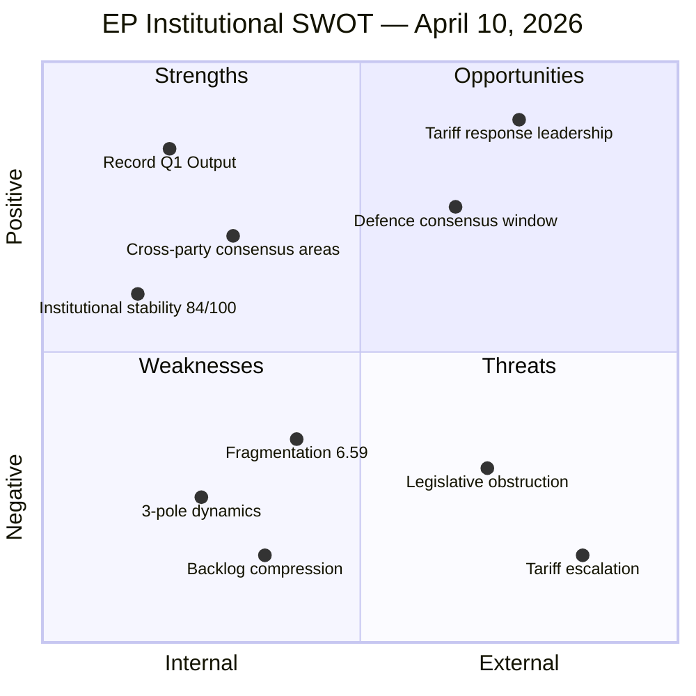

# 💼 SWOT Analysis — Easter Recess Day 15 Pre-Restart Assessment

**📅 Analysis Date:** 2026-04-10 00:35 UTC | **🏛️ Parliament Status:** Easter Recess (Day 15/18) | **📰 Article Type:** `breaking`
**🤖 Analyst:** `news-breaking` workflow | **🔒 Sensitivity:** 🟢 PUBLIC | **Confidence:** 🟡 MEDIUM

---

## 📋 SWOT Context

| Field | Value |
|-------|-------|
| **SWOT ID** | `SWOT-2026-04-10-001` |
| **Scope** | EP institutional position as of Easter recess T-4 |
| **Evidence Base** | Precomputed stats (2026-04-08), Q1 legislative data, 5 prior analysis runs |
| **Methodology** | Evidence-based per `political-swot-framework.md`; all entries require verifiable source |
| **articleType** | `breaking` |

---

## 📊 SWOT Matrix Overview

---

## ✅ Strengths

### S1: Record Q1 2026 Legislative Output
**Evidence:** 104 adopted texts in Q1 2026, representing a 46.2% increase over 2025 pace (EP MCP precomputed stats, generated 2026-04-08). Legislative output per session: 2.11 acts/session, up from 1.47 in 2025. [HIGH confidence]

**Political Significance:** EP10 has overcome its initial fragmentation challenges to achieve the highest quarterly legislative output since 2023. This demonstrates institutional functionality despite the highest-ever fragmentation index (6.59). The variable geometry approach — different coalitions for different files — has proven more productive than traditional bloc politics.

**Severity:** 🟢 HIGH — Strongest institutional performance indicator

### S2: Cross-Party Consensus on Key Files
**Evidence:** Banking Union trilogy (TA-10-2026-0092, TA-10-2026-0088) and Anti-Corruption Directive (TA-10-2026-0094) both adopted with broad majorities in March 2026 plenary. Multiple COD procedures advanced through co-decision successfully. [HIGH confidence]

**Political Significance:** The ability to build cross-party consensus on complex regulatory files contradicts the narrative that EP10 fragmentation = paralysis. At least 5 major legislative files cleared all stages in a single quarter, suggesting committee-level cooperation remains robust.

**Severity:** 🟢 HIGH — Coalition-building capacity proven

### S3: Institutional Stability
**Evidence:** Stability score 84/100; MEP turnover rate 5.1% (37 of 720); institutional memory risk LOW; polarisation index 0.22 (low despite fragmentation). [HIGH confidence — EP MCP stats]

**Political Significance:** Despite record fragmentation, the Parliament's institutional foundation remains sound. Low polarisation means cross-group negotiations are possible on most files, even if coalition compositions vary.

**Severity:** 🟡 MEDIUM — Baseline institutional health

---

## ⚠️ Weaknesses

### W1: Grand Coalition Deficit
**Evidence:** EPP (185) + S&D (135) = 320 seats, 41 seats below 361 majority threshold. Grand coalition surplus/deficit: -5.5%. Three groups minimum required for any majority. [HIGH confidence — EP MCP stats]

**Political Significance:** The traditional EPP-S&D grand coalition cannot govern alone for the first time in EU Parliament history. Every legislative vote requires active coalition management with at least one additional group, creating transaction costs and unpredictability. This is a structural weakness, not a temporary challenge.

**Severity:** 🟠 HIGH — Permanent structural constraint

### W2: Three-Pole Fragmentation
**Evidence:** Fragmentation index 6.59 (highest ever). Three competing poles: Social-Progressive (234 seats), Competitiveness (Renew+ECR, 155 seats), Centre-Right (EPP+selective ECR, ~210 seats). HHI 0.1517 indicates no concentration of power. [HIGH confidence]

**Political Significance:** The three-pole structure means EPP must choose different alliance partners for different policy domains, creating legislative uncertainty. Stakeholders cannot predict coalition geometry, undermining policy signaling.

**Severity:** 🟡 MEDIUM — Managed through variable geometry but creates friction

### W3: Legislative Backlog Compression
**Evidence:** 30+ adopted texts and 13 COD procedures require processing in 4-day committee window (April 14-17). Q1 output surge (46.2% above 2025) compounds the problem. [HIGH confidence]

**Political Significance:** The very success of Q1 legislative output creates a downstream processing bottleneck. Committee secretariats and rapporteurs face unprecedented time pressure for post-Easter restart. Quality risk on complex technical files.

**Severity:** 🟠 HIGH — Time-bounded but acute risk for next 2 weeks

---

## 🚀 Opportunities

### O1: Trade Defence Leadership
**Evidence:** Urgency adoption of tariff countermeasures (2025/0261(COD), TA-10-2026-0096) positions EU as active trade defence actor. Renew-ECR alignment (0.95 cohesion) provides additional political capital for response. [HIGH confidence]

**Political Significance:** The tariff crisis creates an opportunity for the EP to demonstrate rapid institutional response capability. Successful urgency processing would strengthen the EP's credibility as a geopolitical actor, not just a legislative body. The cross-party nature of trade defence (security + economic sovereignty) can unite otherwise fragmented groups.

**Severity:** 🟢 HIGH — Geopolitical credibility opportunity

### O2: Defence Consensus Window
**Evidence:** Broad consensus across EPP, S&D, Renew, and ECR on increased defence spending. European Defence Industrial Strategy (EDIS) advancing through committee process. [MEDIUM confidence — inferred from group positioning]

**Political Significance:** The rare cross-party consensus on defence spending creates a window for landmark legislation that could define EP10's legacy. This is one of the few policy areas where 4+ groups align, making it the path of least resistance for high-impact legislation.

**Severity:** 🟡 MEDIUM — Dependent on mechanism agreement (common borrowing vs national)

### O3: Anti-Corruption Implementation Leadership
**Evidence:** Directive 2023/0135(COD) adopted March 2026. EP can now position itself as oversight body for member state transposition. 24-month clock creates structured engagement timeline. [HIGH confidence]

**Political Significance:** EP gains a new oversight lever: monitoring member state compliance with anti-corruption transposition. This strengthens EP's institutional authority vis-à-vis Council and national governments.

**Severity:** 🟡 MEDIUM — Long-term institutional positioning

---

## 🔴 Threats

### T1: US Tariff Escalation Spiral
**Evidence:** CRITICAL risk (16/25). Urgency procedure 2025/0261(COD) indicates severity. Cross-sector economic disruption across multiple member states. [HIGH confidence]

**Political Significance:** If the tariff crisis escalates beyond the current countermeasures, the EP faces a strategic dilemma: escalate further (risking trade war) or de-escalate (appearing weak). Either path carries significant political costs. The urgency procedure bypasses normal scrutiny, creating democratic accountability concerns.

**Counter-Factual:** If the EP had not adopted urgency countermeasures, member states would have acted bilaterally, undermining EU unity. The EP's proactive stance prevents fragmentation but commits the institution to a confrontational path. [MEDIUM confidence]

**Severity:** 🔴 CRITICAL — Highest individual threat

### T2: Post-Recess Legislative Gridlock
**Evidence:** 30+ files in 4-day window. Historical parallel: EP9 post-summer 2023 saw multiple postponements under similar conditions. Committee coordination risk elevated. [HIGH confidence]

**Political Significance:** If the committee week fails to process critical files (especially tariff countermeasures), the resulting delay sends a signal of institutional incapacity at a moment when the EU needs to project strength. Market uncertainty increases with each day of legislative delay on trade policy.

**Severity:** 🟠 HIGH — Time-bounded but acute

### T3: Eurosceptic Disruption Capacity
**Evidence:** PfE (84) + ESN (28) = 112 seats (15.6% eurosceptic share). Amendment capacity to delay proceedings. Media narrative capacity to frame legislative compression as chaos. [HIGH confidence]

**Political Significance:** While eurosceptic groups cannot block legislation, they can exploit the post-recess compression to generate narratives of institutional dysfunction. The combination of backlog pressure and tariff crisis creates optimal conditions for disruption-by-delay tactics (extended debate requests, amendment flooding).

**Severity:** 🟡 MEDIUM — Nuisance capacity, not blocking capacity

### T4: Three-Pole Stalemate on Trade
**Evidence:** Social-Progressive pole (234 seats) may demand social safeguards in tariff response. Competitiveness pole (155 seats) wants market-friendly approach. Centre-Right (EPP ~210) must arbitrate. [MEDIUM confidence — coalition dynamics analysis from April 9]

**Political Significance:** The tariff countermeasures file is the first major test of three-pole dynamics on a high-stakes file. If no compromise emerges during committee week, the file goes to plenary without committee recommendation — the worst procedural outcome for legislative credibility.

**Severity:** 🟡 MEDIUM — Possible but mitigable through coordinator negotiations

---

## 🔗 TOWS Cross-Impact Matrix

| | **Opportunities** | **Threats** |
|:--|:-----------------|:-----------|
| **Strengths** | **SO:** Record Q1 output + trade defence leadership = EP demonstrates rapid institutional capability during crisis (priority path) | **ST:** Institutional stability + tariff escalation = EP can absorb geopolitical shock without institutional crisis (resilience buffer) |
| **Weaknesses** | **WO:** Grand coalition deficit + defence consensus = Use defence as bridge issue to practice 3+ group coalition management | **WT:** Backlog compression + legislative gridlock = CRITICAL combined risk; highest priority for mitigation (committee coordinator pre-planning essential) |
