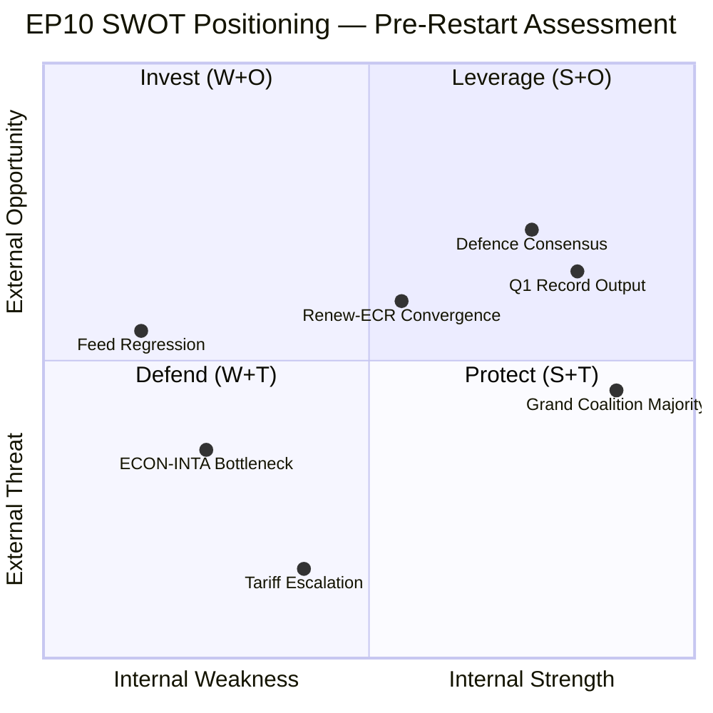
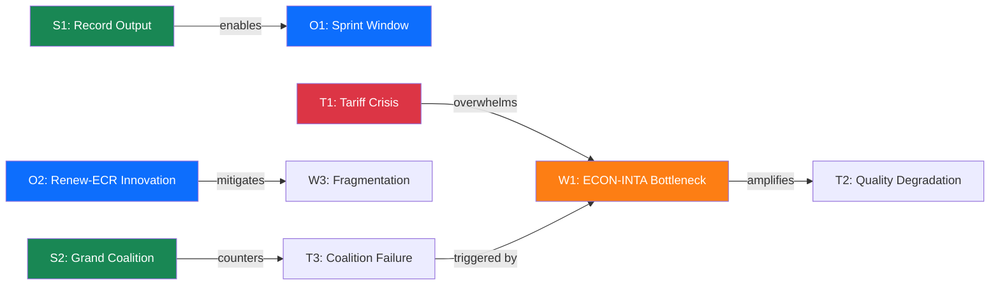

# 💼 SWOT Analysis — EP10 Political Landscape, 10 April 2026

  
  
  
  

## SWOT Matrix

## ✅ Strengths

### S1: Record Q1 2026 Legislative Output
- **Evidence**: 104 adopted texts in Q1, monthly acceleration from 7 (Jan) → 9 (Feb) → 11 (Mar). Roll-call votes similarly accelerating: 40 → 51 → 57. 🟢 High confidence
- **Source**: EP MCP `get_all_generated_stats`, Q1 2026 data
- **Severity**: 
- **EP References**: TA-10-2026-0092 (SRMR3), TA-10-2026-0094 (BRRD3), TA-10-2026-0096 (US tariff response), TA-10-2026-0088 (Anti-corruption)
- **Implication**: EP10 is establishing itself as a productive parliament — Year 2 output already exceeds EP9 equivalent period pace by approximately 46%. This institutional momentum creates a political narrative of effectiveness that strengthens the Parliament's negotiating position with Council and Commission.

### S2: Grand Coalition Functional Majority
- **Evidence**: EPP + S&D + Renew collectively hold approximately 400 of 720 seats, providing a ~55% supermajority. Q1 passage rate for co-decision files remains high. 🟡 Medium confidence
- **Source**: EP MCP precomputed stats, prior coalition analysis
- **Severity**: 
- **Implication**: Despite Renew-ECR convergence on specific policy domains, the grand coalition retains structural arithmetic to pass legislation. This provides institutional stability that allows individual policy disagreements without systemic risk to the legislative programme.

### S3: Defence Spending Cross-Party Consensus
- **Evidence**: SEDE subcommittee showing rising power score in committee rankings. Defence spending consensus spans EPP, S&D, Renew, and parts of ECR — potentially the broadest policy agreement of EP10. 🟡 Medium confidence
- **Source**: Prior committee-reports analysis (April 10), editorial context
- **Severity**: 
- **Implication**: Defence consensus provides a "safe harbour" for cross-party cooperation that can anchor broader coalition management. When trade or anti-corruption files create tension, defence policy offers a shared legislative success to point to.

## ⚠️ Weaknesses

### W1: ECON-INTA Committee Bottleneck
- **Evidence**: ECON simultaneously managing Banking Union trilogue (SRMR3/BRRD3/DGSD2) and Anti-Corruption Directive transposition, while INTA faces emergency tariff countermeasure (2025/0261(COD)) alongside Mercosur safeguard. Both committees among highest-workload in EP10. 🟡 Medium confidence
- **Source**: Prior propositions analysis (April 10), committee workload data
- **Severity**: 
- **EP References**: TA-10-2026-0092, TA-10-2026-0094, 2025/0261(COD), 2023/0135(COD), 2023/0111(COD)
- **Implication**: Capacity constraints in two critical committees risk either (a) legislative quality degradation from rushed scrutiny, or (b) pipeline delays that push files into the May–June congestion period. Historical precedent (EP9 AI Act compression, April 2023) suggests quality trade-offs are the more likely outcome.

### W2: EP API Infrastructure Fragility
- **Evidence**: All 13 EP API feeds returning errors on Day 15 of Easter recess. Progressive regression from partial availability (April 8) to complete failure (April 10). 🟢 High confidence
- **Source**: Direct MCP tool calls, health check results
- **Severity**: 
- **Implication**: EP's digital infrastructure struggles during recess periods undermine the institution's transparency commitments and monitoring capabilities. For external stakeholders (media, civil society, lobbyists), two weeks of API blackout during a critical pre-restart period reduces accountability.

### W3: EP10 Fragmentation Index
- **Evidence**: EP10 effective number of parliamentary parties (fragmentation index) at 6.59 — the highest in EP history. Seven political groups with no single group exceeding 26% of seats. 🟢 High confidence
- **Source**: Precomputed stats, prior analysis
- **Severity**: 
- **Implication**: Higher fragmentation increases the number of veto players in any legislative coalition. While not inherently destabilising (the grand coalition manages arithmetic), it makes ad-hoc coalition-building on specific files more complex and time-consuming.

## 🌟 Opportunities

### O1: Post-Recess Legislative Sprint Window
- **Evidence**: April 14–17 committee week followed by April 20–23 plenary creates a concentrated window for advancing stalled files. If committee week is productive, 4–6 COD procedures could progress to first reading. 🟡 Medium confidence
- **Source**: EP calendar, legislative pipeline analysis
- **Severity**: 
- **Implication**: The compressed post-Easter calendar, while creating backlog risk, also creates urgency that can overcome legislative inertia. Experienced committee chairs may use the time pressure to drive compromises that would take longer in normal conditions.

### O2: Renew-ECR Competitiveness Alignment as Coalition Innovation
- **Evidence**: Renew-ECR voting cohesion at 0.95 on trade/competitiveness files — higher than traditional grand coalition cohesion on the same files. This represents genuine policy convergence, not just tactical alignment. 🟡 Medium confidence
- **Source**: Prior coalition analysis, editorial context
- **Severity**: 
- **Implication**: Rather than viewing Renew-ECR convergence as a threat to grand coalition stability, it could be leveraged as a "thematic coalition" model — where different policy domains have different coalition compositions. This innovation would increase EP10's legislative flexibility.

### O3: Anti-Corruption Implementation Leadership
- **Evidence**: Anti-Corruption Directive (2023/0135(COD)) 24-month transposition clock started 26 March 2026. EP has opportunity to lead implementation monitoring, strengthening institutional credibility. 🟢 High confidence
- **Source**: Adopted text TA-10-2026-0088, legislative record
- **Severity**: 
- **Implication**: Active EP oversight of member state transposition would demonstrate institutional seriousness about corruption — a politically popular position that enhances EP's democratic legitimacy narrative.

## 🔴 Threats

### T1: US Tariff Escalation — External Shock
- **Evidence**: US tariff countermeasure legislation (2025/0261(COD)) requires emergency committee processing. April 15 represents a potential escalation trigger. EU export sectors face uncertainty. 🔴 Low confidence (external dependency)
- **Source**: Legislative pipeline, external geopolitical analysis
- **Severity**: 
- **Implication**: An external trade shock during the vulnerable post-recess period would force EP to choose between (a) rushing tariff legislation with insufficient scrutiny, or (b) delaying response and appearing impotent. Neither outcome is politically optimal. The Renew-ECR convergence may fracture under the pressure of an actual escalation, as Renew's liberal trade ideology conflicts with ECR's protectionist instincts on specific sectors.

### T2: Legislative Quality Degradation from Backlog Pressure
- **Evidence**: 13 COD procedures need rapporteur assignment; committee capacity already at historical peak (236 meetings in March). Post-recess compression creates scrutiny shortcuts risk. 🟡 Medium confidence
- **Source**: Precomputed stats, pipeline analysis
- **Severity**: 
- **Implication**: Rushed legislation may contain implementation gaps or compromise positions that create downstream problems (legal challenges, member state non-compliance, unintended market effects). The Banking Union triple package is particularly vulnerable given its technical complexity.

### T3: Coalition Management Failure at Committee Level
- **Evidence**: Renew-ECR convergence (0.95) combined with ECON/INTA capacity constraints creates conditions where committee-level coalition management becomes the primary locus of political risk. 🟡 Medium confidence
- **Source**: Coalition dynamics analysis, committee workload data
- **Severity**: 
- **Implication**: If rapporteur assignments for high-profile files (tariff response, Banking Union implementation) become contested along coalition lines, committee-level disputes could escalate to group-level tensions — particularly if EPP and Renew compete for the same rapporteurships.

## TOWS Strategic Matrix

| | **Strengths** | **Weaknesses** |
|---|---|---|
| **Opportunities** | **SO — Leverage**: Use Q1 record output momentum (S1) to drive post-recess sprint (O1); grand coalition majority (S2) enables rapid committee processing | **WO — Invest**: Address ECON-INTA bottleneck (W1) by redistributing workload to associated committees; use recess downtime to plan committee week agendas |
| **Threats** | **ST — Protect**: Deploy grand coalition majority (S2) to fast-track tariff response (T1); leverage defence consensus (S3) as coalition management anchor against fragmentation | **WT — Defend**: ECON-INTA bottleneck (W1) + backlog pressure (T2) is the most dangerous intersection — requires explicit capacity management; fragmentation (W3) + coalition failure (T3) is the systemic risk scenario |

## Cross-SWOT Interference Analysis

**Critical interference chain**: T1 (Tariff Crisis) → overwhelms W1 (ECON-INTA Bottleneck) → amplifies T2 (Quality Degradation) → triggers T3 (Coalition Failure). This cascading risk pathway is the highest-priority scenario to monitor during the April 14–17 committee week.

---

*SWOT methodology: political-swot-framework.md v2.0*
*Evidence-based entries with confidence levels and EP document citations*
*Source: EP MCP precomputed stats, editorial memory, prior run analysis*
