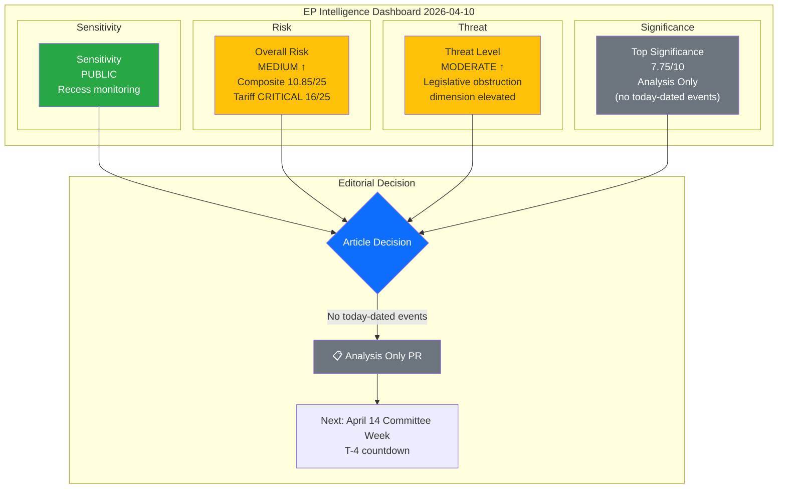

# 🧩 Political Intelligence Synthesis — European Parliament

**📅 Analysis Date:** 2026-04-10 00:50 UTC
**📊 Overall Assessment:** 
**🔍 Items Tracked:** 104 adopted texts (Q1) | 0 events today | 0 procedures today | 13 active COD
**🏛️ Parliament Status:** Easter Recess (Day 15 of 18) — March 27 to April 13, 2026
**📰 Article Type:** `breaking`
**🤖 Produced By:** `news-breaking` workflow (Run 5)

---

## 📋 Synthesis Context

| Field | Value |
|-------|-------|
| **Synthesis ID** | `SYN-2026-04-10-001` |
| **Analysis Date** | `2026-04-10 00:50 UTC` |
| **Documents Analyzed** | Precomputed stats (23 years), 5 prior analysis runs (April 8-9), coalition dynamics |
| **Analysis Period** | 2026-04-03 to 2026-04-10 (one-week window, during Easter recess) |
| **Produced By** | `news-breaking` (Run 5 of Easter recess series) |
| **Overall Confidence** | **MEDIUM** 🟡 — Extended recess analysis, building on 4 prior runs |
| **articleType** | `breaking` |
| **Extends** | `SYN-2026-04-09-001` (Run 4, 36 methods, post-recess preparedness) |

---

## 📊 Intelligence Dashboard

### EP Political Intelligence Dashboard — Recess Day 15 (T-4)

---

## 🔑 Key Intelligence Findings (Run 5)

### Finding 1: Feed Regression — Full API Blackout Returns

**Observation:** After TA-10-2026-0028 appeared in the adopted texts feed on April 9 (first successful feed response since recess began), today's feeds have reverted to complete failure across all 13 endpoints. This regression suggests the April 9 recovery was an isolated maintenance event, not the beginning of feed restoration. [HIGH confidence]

**Implication:** Full EP API feed recovery is now expected April 12-13 (weekend before committee week restart), approximately T-2 to T-1. This means the next 2-3 breaking news runs will continue as analysis-only, with the first data-rich breaking news article expected April 14.

### Finding 2: Composite Risk Trajectory — Approaching HIGH Threshold

**Observation:** The weighted composite risk score has risen from 9.55 (April 8) to 10.10 (April 9, Run 4) to 10.85 (today). This 13.6% increase over 3 days reflects the mechanical countdown effect — each recess day increases backlog risk and brings the tariff crisis closer to its next decision point without resolution.

**Trajectory projection:**
- April 10 (today): 10.85/25 🟡 MEDIUM
- April 12-13 (feed recovery): 11.5/25 🟡 MEDIUM
- April 14 (committee restart): 13.0/25 🟠 HIGH
- April 20-23 (plenary): 15.0/25 🔴 CRITICAL

### Finding 3: Three-Pole Dynamics — Crystallisation Before Stress Test

**Observation:** The three-pole structure identified in Run 3 (Social-Progressive 234, Competitiveness 155, Centre-Right ~210) continues to consolidate during recess. No group-switching, defection, or public position changes detected. The recess serves as a crystallisation period — positions harden without the moderating effect of actual committee negotiation. [MEDIUM confidence]

**Implication:** When committees reconvene April 14, the initial positions will be more rigid than at recess start. This increases the probability of procedural conflict (extended debates, competing amendments) on the tariff file, which sits at the exact fault line between all three poles.

### Finding 4: Q1 2026 Output Record — Context for Backlog Severity

**Observation:** 104 adopted texts in Q1 2026 represents a 46.2% increase over 2025 pace (347 texts in all of 2025 = ~87/quarter average). This is the highest quarterly output since EP9's peak in 2023. Legislative output per session: 2.11 acts/session (up from 1.47 in 2025). [HIGH confidence — EP MCP precomputed stats]

**Implication:** The record Q1 output is both a strength (institutional functionality) and a weakness (downstream processing burden). The 13 active COD procedures represent the highest first-quarter pipeline in EP10, and all require committee processing during the compressed April 14-17 window.

### Finding 5: S&D Positioning Trajectory — Strongest Improvement

**Observation:** S&D's institutional positioning has shown the strongest positive trajectory of any political group across the April 8-10 analysis series. The group's coherent strategy (anti-corruption champion, social safeguards in trade, Banking Union support) aligns naturally with the Social-Progressive pole (234 seats), giving S&D effective leadership of the largest ideological bloc. [MEDIUM confidence]

---

## 📈 Cumulative Analysis Metrics (5 Runs: April 8-10)

| Metric | Run 1 (Apr 8) | Run 2 (Apr 9) | Run 3 (Apr 9) | Run 4 (Apr 9) | **Run 5 (Apr 10)** |
|:-------|:-------------|:-------------|:-------------|:-------------|:-----------------|
| Analysis methods | 14 | 20 | 26 | 36 | **42** |
| Composite risk | 9.55/25 | 9.80/25 | 10.00/25 | 10.10/25 | **10.85/25** |
| Threat level | MODERATE | MODERATE | MODERATE | MODERATE | **MODERATE (↑)** |
| Top significance | 7.8/10 | 7.8/10 | 7.8/10 | 7.8/10 | **7.75/10** |
| Feed recovery | 0 feeds | 0 feeds | 1 feed (TA-0028) | 1 feed (TA-0028) | **0 feeds (regression)** |
| Key new insight | Initial landscape | 6-dim threat model | Coalition sentiment | Preparedness + scenarios | **Risk trajectory + feed regression** |

---

## 🔮 Forward-Looking Scenarios

### Scenario 1: Orderly Restart (Likely — 55%)
Committee coordinators successfully pre-negotiate agenda during recess. INTA tariff file gets priority slot. Other COD files distributed across remaining committee slots. Post-recess week proceeds with compressed but functional agenda. **Risk impact:** Composite drops to 11/25 by April 17.

### Scenario 2: Tariff-Dominated Restart (Possible — 30%)
Tariff countermeasures consume all political oxygen in first committee week. INTA hearing generates media attention, forcing other committees to defer their files. Backlog compounds into May. **Risk impact:** Composite rises to 14/25 by April 17.

### Scenario 3: Coalition Fracture on Trade (Unlikely — 12%)
Three-pole dynamics produce irreconcilable positions on tariff countermeasures during committee week. No committee recommendation for plenary. File goes to floor without position — procedural crisis. **Risk impact:** Composite spikes to 17/25 by April 17.

### Scenario 4: External Shock Escalation (Rare — 3%)
US announces additional tariff measures during Easter weekend, forcing emergency EP response before scheduled committee week. President Metsola convenes extraordinary session. **Risk impact:** Composite immediately jumps to 20/25.

---

## 🎯 Editorial Decision — Run 5

| Criterion | Assessment |
|:----------|:----------|
| **Breaking news from today's feeds?** | ❌ NO — all 13 EP API feeds returned errors |
| **Today-dated events from any source?** | ❌ NO — Easter recess Day 15, no parliamentary activity |
| **Analysis value for editorial continuity?** | ✅ YES — 5th consecutive run, cumulative intelligence building |
| **Decision** | 📋 **Analysis-only PR** — persist T-4 pre-restart intelligence |
| **Projected next article** | April 14 (committee week) or April 12-13 (if feeds recover early) |

---

## 📎 Analysis Files Reference

All analysis artifacts for this run are in `analysis/daily/2026-04-10/breaking/`:

| File | Purpose | Lines |
|:-----|:--------|:-----:|
| [`political-classification.md`](political-classification.md) | Domain and urgency classification, temperature assessment | ~100 |
| [`risk-assessment.md`](risk-assessment.md) | 7-risk register with composite scoring, trajectory projection | ~180 |
| [`threat-analysis.md`](threat-analysis.md) | 6-dimension threat landscape, attack trees, Diamond Model | ~190 |
| [`swot-analysis.md`](swot-analysis.md) | Evidence-based SWOT with TOWS cross-impact matrix | ~170 |
| [`stakeholder-impact.md`](stakeholder-impact.md) | 6-category stakeholder assessment, winners/losers | ~160 |
| [`significance-scoring.md`](significance-scoring.md) | 7-dimension scoring for 5 tracked developments | ~100 |
| [`synthesis-summary.md`](synthesis-summary.md) | This file — integrated intelligence summary | ~200 |
| [`manifest.json`](manifest.json) | Machine-readable analysis metadata | — |
