# 🎭 Political Threat Landscape Analysis — Easter Recess Day 15

**📅 Analysis Date:** 2026-04-10 00:30 UTC | **🏛️ Parliament Status:** Easter Recess (Day 15/18) | **📰 Article Type:** `breaking`
**🤖 Analyst:** `news-breaking` workflow | **🔒 Sensitivity:** 🟢 PUBLIC | **Threat Level:** 🟡 MODERATE

---

## 📋 Threat Assessment Context

| Field | Value |
|-------|-------|
| **Assessment ID** | `THR-2026-04-10-001` |
| **Frameworks Applied** | Political Threat Landscape (6-dim), Attack Trees, Diamond Model, Political Kill Chain |
| **Prior Assessment** | THR-2026-04-09-001 (6-dimension model, Run 2–4) |
| **Extends** | `THR-2026-04-08-001` (initial threat landscape) |
| **articleType** | `breaking` |

---

## 🏛️ Political Threat Landscape — 6-Dimension Assessment

```mermaid
%%{init: {"theme":"dark","themeVariables":{"primaryColor":"#1565C0","primaryTextColor":"#ffffff","primaryBorderColor":"#0A3F7F","lineColor":"#90CAF9","secondaryColor":"#2E7D32","secondaryTextColor":"#ffffff","secondaryBorderColor":"#0F3F00","tertiaryColor":"#FF9800","tertiaryTextColor":"#000000","tertiaryBorderColor":"#7F4F00","mainBkg":"#1565C0","secondBkg":"#2E7D32","tertiaryBkg":"#FF9800","noteBkgColor":"#FFC107","noteTextColor":"#000000","noteBorderColor":"#7F6000","errorBkgColor":"#D32F2F","errorTextColor":"#ffffff","fontFamily":"Inter, Helvetica, Arial, sans-serif","pie1":"#1565C0","pie2":"#2E7D32","pie3":"#FF9800","pie4":"#D32F2F","pie5":"#FFC107","pie6":"#7B1FA2","pie7":"#9E9E9E","pie8":"#0288D1","pie9":"#388E3C","pie10":"#F57C00","pie11":"#C62828","pie12":"#FBC02D","pieTitleTextSize":"18px","pieSectionTextSize":"14px","pieLegendTextSize":"13px","pieStrokeColor":"#1e1e1e","pieOuterStrokeColor":"#1e1e1e","git0":"#1565C0","git1":"#2E7D32","git2":"#FF9800","git3":"#D32F2F","gitBranchLabel0":"#ffffff","gitBranchLabel1":"#ffffff","gitBranchLabel2":"#000000","gitBranchLabel3":"#ffffff","cScale0":"#1565C0","cScale1":"#2E7D32","cScale2":"#FF9800","cScale3":"#D32F2F","cScale4":"#FFC107","cScale5":"#7B1FA2","cScale6":"#9E9E9E","cScale7":"#0288D1","xyChart":{"backgroundColor":"#1e1e1e","plotColorPalette":"#1565C0,#2E7D32,#FF9800,#D32F2F,#FFC107,#7B1FA2,#9E9E9E"}}}}%%
graph TD
    TL["🎭 Political Threat<br/>Landscape — April 10"]

    TL --> CS["🔄 Coalition Shifts<br/>MODERATE ↑<br/>3-pole dynamics crystallising"]
    TL --> TR["🔍 Transparency Deficit<br/>LOW ↔<br/>Recess = no new opacity"]
    TL --> PR["↩️ Policy Reversal<br/>MODERATE ↔<br/>Tariff countermeasure stability"]
    TL --> IP["🏛️ Institutional Pressure<br/>LOW ↔<br/>Normal recess operations"]
    TL --> LO["⏳ Legislative Obstruction<br/>HIGH ↑<br/>Backlog compression T-4"]
    TL --> DE["📉 Democratic Erosion<br/>LOW ↔<br/>Stable baseline"]

    style TL fill:#0d6efd,color:#fff
    style CS fill:#ffc107,color:#333
    style TR fill:#28a745,color:#fff
    style PR fill:#ffc107,color:#333
    style IP fill:#28a745,color:#fff
    style LO fill:#fd7e14,color:#fff
    style DE fill:#28a745,color:#fff
```

---

### Dimension 1: Coalition Shifts 🔄 — MODERATE (↑ Rising)

**CMO Assessment:**

| Factor | Assessment | Evidence |
|:-------|:----------|:--------|
| **Capability** | HIGH — Large national delegations (DE 96, FR 81, IT 76) can swing votes | EP10 seat distribution: EPP 185, S&D 135, PfE 84, ECR 79, Renew 76 |
| **Motivation** | RISING — Post-Easter restart forces coalition geometry decisions on tariffs | 2025/0261(COD) urgency, 2023/0135(COD) anti-corruption create competing alliance demands |
| **Opportunity** | IMMINENT — Committee week T-4 provides first opportunity since recess | April 14-17 committee week; INTA, LIBE, ECON all have pending files |

**Three-Pole Dynamics (identified April 9, Run 3):**

| Pole | Composition | Seats | Policy Focus | Internal Cohesion |
|:-----|:-----------|:-----:|:-------------|:-----------------|
| Social-Progressive | S&D + Greens/EFA + GUE/NGL | 234 | Social rights, climate, anti-corruption | 🟡 MEDIUM (GUE/NGL independence) |
| Competitiveness | Renew + ECR | 155 | Trade, deregulation, industry | 🟢 HIGH (0.95 cohesion on competitiveness) |
| Centre-Right | EPP + selected ECR | ~210 | Defence, migration, fiscal discipline | 🟡 MEDIUM (issue-dependent) |

**Threat Vector:** EPP must choose alliance partners on a per-file basis. On tariff countermeasures, EPP aligns with Renew-ECR competitiveness pole (market-friendly response). On anti-corruption, EPP aligns with Social-Progressive pole (rule of law credibility). This variable geometry creates a **predictability deficit** — stakeholders cannot forecast voting outcomes, undermining legislative certainty. [MEDIUM confidence]

---

### Dimension 2: Transparency Deficit 🔍 — LOW (↔ Stable)

No new transparency concerns during recess. The EP API feed blackout is a routine recess phenomenon, not an opacity signal. Committee coordinator discussions during recess are standard practice and not classified as transparency threats.

**Watch item:** The urgency procedure for tariff countermeasures (2025/0261(COD)) bypasses normal committee scrutiny timelines. When INTA reconvenes, the compressed timeline could limit public consultation opportunities. [LOW confidence — speculative, requires post-restart monitoring]

---

### Dimension 3: Policy Reversal ↩️ — MODERATE (↔ Stable)

**Primary Reversal Threat:** The US tariff countermeasures represent a potential reversal of the EU's free-trade orientation. The urgency procedure accelerates this shift, but the underlying policy direction (protectionist response) may be difficult to reverse once adopted.

| Policy Area | Reversal Risk | Mechanism | Confidence |
|:-----------|:-------------|:----------|:-----------|
| Trade liberalisation | 🟡 MODERATE | Tariff countermeasures establish precedent for EU protectionism | 🟢 HIGH |
| Green Deal pace | 🟡 MODERATE | Competitiveness agenda deprioritising climate targets | 🟡 MEDIUM |
| Banking regulation | 🟢 LOW | Trilogy adopted, Council process proceeding | 🟢 HIGH |
| Anti-corruption | 🟢 LOW | Broad adoption majority, no reversal signals | 🟢 HIGH |
| Defence spending | 🟢 LOW | Consensus across all major groups | 🟢 HIGH |

---

### Dimension 4: Institutional Pressure 🏛️ — LOW (↔ Stable)

No active institutional pressure during recess. The EP-Council relationship on Banking Union trilogy is proceeding normally. No Commission censure threats. The Braun immunity case (TA-10-2026-0103) is procedural and does not constitute institutional pressure.

**Structural context:** EP10 fragmentation index (6.59, highest in EU Parliament history) means institutional decision-making requires broader coalitions than ever. This is a structural feature, not an acute threat. The minimum winning coalition size of 3 groups ensures no single group or bilateral alliance can dominate. [HIGH confidence]

---

### Dimension 5: Legislative Obstruction ⏳ — HIGH (↑ Rising)

**This is the most elevated threat dimension at T-4 from committee week restart.**

**Attack Tree — Legislative Backlog Obstruction:**

```mermaid
%%{init: {"theme":"dark","themeVariables":{"primaryColor":"#1565C0","primaryTextColor":"#ffffff","primaryBorderColor":"#0A3F7F","lineColor":"#90CAF9","secondaryColor":"#2E7D32","secondaryTextColor":"#ffffff","secondaryBorderColor":"#0F3F00","tertiaryColor":"#FF9800","tertiaryTextColor":"#000000","tertiaryBorderColor":"#7F4F00","mainBkg":"#1565C0","secondBkg":"#2E7D32","tertiaryBkg":"#FF9800","noteBkgColor":"#FFC107","noteTextColor":"#000000","noteBorderColor":"#7F6000","errorBkgColor":"#D32F2F","errorTextColor":"#ffffff","fontFamily":"Inter, Helvetica, Arial, sans-serif","pie1":"#1565C0","pie2":"#2E7D32","pie3":"#FF9800","pie4":"#D32F2F","pie5":"#FFC107","pie6":"#7B1FA2","pie7":"#9E9E9E","pie8":"#0288D1","pie9":"#388E3C","pie10":"#F57C00","pie11":"#C62828","pie12":"#FBC02D","pieTitleTextSize":"18px","pieSectionTextSize":"14px","pieLegendTextSize":"13px","pieStrokeColor":"#1e1e1e","pieOuterStrokeColor":"#1e1e1e","git0":"#1565C0","git1":"#2E7D32","git2":"#FF9800","git3":"#D32F2F","gitBranchLabel0":"#ffffff","gitBranchLabel1":"#ffffff","gitBranchLabel2":"#000000","gitBranchLabel3":"#ffffff","cScale0":"#1565C0","cScale1":"#2E7D32","cScale2":"#FF9800","cScale3":"#D32F2F","cScale4":"#FFC107","cScale5":"#7B1FA2","cScale6":"#9E9E9E","cScale7":"#0288D1","xyChart":{"backgroundColor":"#1e1e1e","plotColorPalette":"#1565C0,#2E7D32,#FF9800,#D32F2F,#FFC107,#7B1FA2,#9E9E9E"}}}}%%
graph TD
    GOAL["🎯 Goal: Legislative<br/>Agenda Collapse<br/>April 14-17"]

    GOAL --> A1["Path 1: Procedural<br/>Overload"]
    GOAL --> A2["Path 2: Political<br/>Blockage"]
    GOAL --> A3["Path 3: Coordination<br/>Failure"]

    A1 --> A1a["30+ texts in<br/>4-day window"]
    A1 --> A1b["13 COD procedures<br/>competing for slots"]
    A1 --> A1c["Urgency tariff file<br/>displaces scheduled items"]

    A2 --> A2a["EPP-S&D disagree<br/>on tariff approach"]
    A2 --> A2b["ECR blocks compromise<br/>on anti-corruption"]
    A2 --> A2c["National delegations<br/>rebel on trade"]

    A3 --> A3a["Committee coordinators<br/>fail to pre-agree agenda"]
    A3 --> A3b["Rapporteur absences<br/>after recess"]
    A3 --> A3c["Translation backlog<br/>delays document availability"]

    style GOAL fill:#dc3545,color:#fff
    style A1 fill:#fd7e14,color:#fff
    style A2 fill:#ffc107,color:#333
    style A3 fill:#ffc107,color:#333
    style A1a fill:#fd7e14,color:#fff
    style A1b fill:#fd7e14,color:#fff
    style A1c fill:#fd7e14,color:#fff
```

**Assessment:** Path 1 (Procedural Overload) is the most likely obstruction vector, driven by mathematical certainty of more files than committee time allows. Path 2 (Political Blockage) has moderate probability on the tariff file specifically. Path 3 (Coordination Failure) has low probability given experienced committee leadership. [HIGH confidence on Path 1, MEDIUM on Paths 2-3]

---

### Dimension 6: Democratic Erosion 📉 — LOW (↔ Stable)

No acute democratic erosion threats. EP10 stability score 84/100. MEP stability index 0.95 (very low turnover). Polarisation index 0.22 (low, despite fragmentation). Institutional memory risk LOW.

**Structural watch:** The 15.6% eurosceptic share (PfE 84 + ESN 28 = 112 seats) represents a persistent baseline democratic erosion pressure, but this is structural rather than acute. No new group-switching or defection signals detected. [HIGH confidence]

---

## 💎 Diamond Model — Pre-Restart Threat Actor Profiles

| Actor | Capability | Infrastructure | Motivation | Victim |
|:------|:----------|:--------------|:-----------|:-------|
| **US Trade Office** | Tariff escalation power | WTO dispute mechanism, bilateral leverage | Protectionist agenda, election-year dynamics | EU exporters, INTA committee |
| **National industry lobbies** | Member state government influence | National MEP delegations, committee access | Protect domestic sectors from tariff fallout | Legislative process, committee independence |
| **Eurosceptic groups (PfE/ESN)** | 112 seats, amendment capacity | Plenary voting power, media narrative | Undermine grand coalition credibility | Institutional legitimacy, legislative majority |
| **Committee coordinators** | Agenda-setting power | Group whip structures, procedure rules | Manage backlog, prioritise own group's files | Legislative transparency, minority group access |

---

## 📊 Composite Threat Assessment

| Dimension | Level | Score | Trend | Key Indicator |
|:----------|:------|:-----:|:-----:|:-------------|
| Coalition Shifts | MODERATE | 6/10 | ↑ | 3-pole crystallisation before restart |
| Transparency Deficit | LOW | 2/10 | ↔ | Routine recess, no new opacity |
| Policy Reversal | MODERATE | 5/10 | ↔ | Tariff protectionism precedent |
| Institutional Pressure | LOW | 2/10 | ↔ | No active threats |
| Legislative Obstruction | HIGH | 7/10 | ↑ | 30+ files in 4-day window |
| Democratic Erosion | LOW | 2/10 | ↔ | Structural baseline |
| **COMPOSITE** | **MODERATE** | **4.0/10** | **↑** | **Obstruction + coalition = primary concern** |

**Change from April 9:** +0.2 (from 3.8 to 4.0). Legislative obstruction dimension continues to rise as T-countdown decreases.
