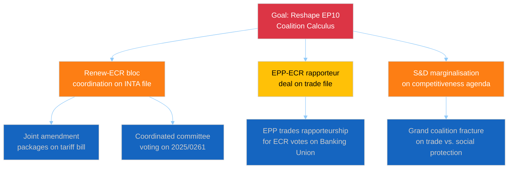
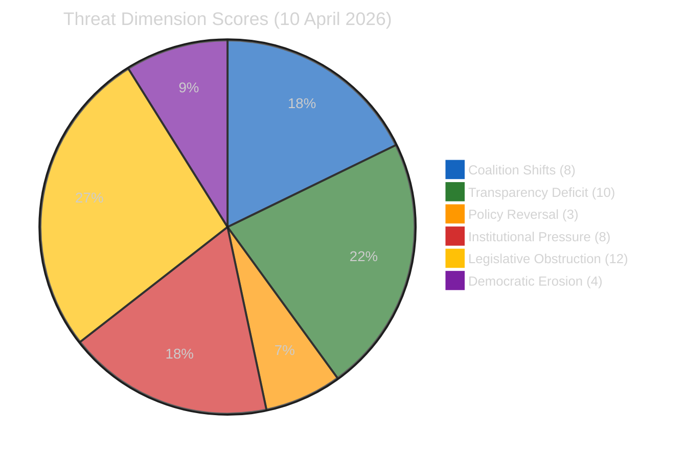

# 🎭 Political Threat Landscape — 10 April 2026

  
  
  
  

## Threat Landscape Overview

The six-dimension Political Threat Landscape model identifies three active threat vectors as of 10 April 2026, all converging around the T-4 committee restart window:

```mermaid
%%{init: {"theme":"dark","themeVariables":{"primaryColor":"#1565C0","primaryTextColor":"#ffffff","primaryBorderColor":"#0A3F7F","lineColor":"#90CAF9","secondaryColor":"#2E7D32","secondaryTextColor":"#ffffff","secondaryBorderColor":"#0F3F00","tertiaryColor":"#FF9800","tertiaryTextColor":"#000000","tertiaryBorderColor":"#7F4F00","mainBkg":"#1565C0","secondBkg":"#2E7D32","tertiaryBkg":"#FF9800","noteBkgColor":"#FFC107","noteTextColor":"#000000","noteBorderColor":"#7F6000","errorBkgColor":"#D32F2F","errorTextColor":"#ffffff","fontFamily":"Inter, Helvetica, Arial, sans-serif","pie1":"#1565C0","pie2":"#2E7D32","pie3":"#FF9800","pie4":"#D32F2F","pie5":"#FFC107","pie6":"#7B1FA2","pie7":"#9E9E9E","pie8":"#0288D1","pie9":"#388E3C","pie10":"#F57C00","pie11":"#C62828","pie12":"#FBC02D","pieTitleTextSize":"18px","pieSectionTextSize":"14px","pieLegendTextSize":"13px","pieStrokeColor":"#1e1e1e","pieOuterStrokeColor":"#1e1e1e","git0":"#1565C0","git1":"#2E7D32","git2":"#FF9800","git3":"#D32F2F","gitBranchLabel0":"#ffffff","gitBranchLabel1":"#ffffff","gitBranchLabel2":"#000000","gitBranchLabel3":"#ffffff","cScale0":"#1565C0","cScale1":"#2E7D32","cScale2":"#FF9800","cScale3":"#D32F2F","cScale4":"#FFC107","cScale5":"#7B1FA2","cScale6":"#9E9E9E","cScale7":"#0288D1","xyChart":{"backgroundColor":"#1e1e1e","plotColorPalette":"#1565C0,#2E7D32,#FF9800,#D32F2F,#FFC107,#7B1FA2,#9E9E9E"}}}}%%
graph TD
    TL["🎭 Political Threat<br/>Landscape — 10 April 2026"]

    TL --> CS["🔄 Coalition Shifts<br/>MEDIUM: Renew-ECR convergence<br/>Score: 8/25"]
    TL --> TR["🔍 Transparency Deficit<br/>HIGH: API blackout Day 15<br/>Score: 10/25"]
    TL --> PR["↩️ Policy Reversal<br/>LOW: No active reversals<br/>Score: 3/25"]
    TL --> IP["🏛️ Institutional Pressure<br/>MEDIUM: ECON-INTA overload<br/>Score: 8/25"]
    TL --> LO["⏳ Legislative Obstruction<br/>HIGH: 13 COD backlog<br/>Score: 12/25"]
    TL --> DE["📉 Democratic Erosion<br/>LOW: Recess context only<br/>Score: 4/25"]

    style TL fill:#0d6efd,color:#fff
    style CS fill:#ffc107,color:#000
    style TR fill:#fd7e14,color:#fff
    style PR fill:#198754,color:#fff
    style IP fill:#ffc107,color:#000
    style LO fill:#fd7e14,color:#fff
    style DE fill:#198754,color:#fff
```

## Dimension Analysis

### Dimension 1: Coalition Shifts 🔄 — MEDIUM (8/25)

**Current threat indicators:**
- Renew-ECR voting cohesion at 0.95 on trade/competitiveness — exceeds traditional grand coalition cohesion on same files 🟡 Medium confidence
- EPP positioning declining (-0.1 from prior run), S&D positioning improving (+0.2) — power dynamics shifting within grand coalition 🟡 Medium confidence
- No formal coalition restructuring announced, but informal "three-pole" pattern crystallising 🟡 Medium confidence

**CMO Assessment (Capability × Motivation × Opportunity):**
- **Capability**: Renew (77 seats) + ECR (78 seats) = 155 seats. Not sufficient for a majority alone, but enough to be a blocking minority on specific files or a kingmaker in triangular negotiations.
- **Motivation**: Both groups seek to position on "EU competitiveness" narrative ahead of 2029 elections. Trade policy provides a natural convergence point where Renew's liberal economics and ECR's sovereignty concerns align on opposing EU regulatory burden.
- **Opportunity**: Committee week April 14–17 offers rapporteur assignment negotiations where Renew-ECR block could demand concessions from EPP. The tariff crisis (2025/0261(COD)) provides specific legislative vehicle for demonstrating coalition viability.

**Attack tree (goal-oriented threat modelling):**

### Dimension 2: Transparency Deficit 🔍 — HIGH (10/25)

**Current threat indicators:**
- All 13 EP API feeds returning INTERNAL_ERROR for 48+ hours 🟢 High confidence
- Progressive degradation: partial availability (April 8) → complete failure (April 10) 🟢 High confidence
- No official EP communication about API maintenance schedule 🟡 Medium confidence
- Committee week agenda not publicly visible due to feed failure 🟡 Medium confidence

**Analysis**: Two weeks of API blackout during Easter recess creates a transparency gap that compounds as the restart approaches. External stakeholders — media, civil society organisations, industry lobbyists, national parliament liaison offices — cannot monitor pre-restart administrative preparations. Committee draft agendas, which normally become available 5–7 days before meetings, are currently invisible.

**Impact assessment**: While recess API downtime is partially expected, the duration (15 days) and completeness (all 13 feeds) exceed normal patterns. In EP9, Easter recess API gaps typically lasted 7–10 days with partial feeds remaining available. EP10's infrastructure appears less resilient.

**Counter-factual**: If the API were operational, we would expect to see committee meeting schedules being published for April 14–17, rapporteur nomination documents appearing, and possibly advance notice of emergency INTA sessions for the tariff file. The absence of this data reduces pre-restart preparedness for all external monitoring.

### Dimension 3: Policy Reversal ↩️ — LOW (3/25)

**Current assessment**: No active policy reversals identified. The adopted texts from March 2026 (TA-10-2026-0088 through TA-10-2026-0103) represent forward policy movement on anti-corruption, Banking Union, and trade response. The risk of reversal is low during recess and will need reassessment once committee activity resumes.

### Dimension 4: Institutional Pressure 🏛️ — MEDIUM (8/25)

**Current threat indicators:**
- ECON committee simultaneously managing Banking Union trilogue AND Anti-Corruption Directive transposition — dual mandate stretches institutional capacity 🟡 Medium confidence
- INTA committee faces emergency tariff response alongside normal legislative calendar — crisis mode approaching 🟡 Medium confidence
- Braun immunity case (TA-10-2026-0103) creates procedural precedent questions for EP legal service 🔴 Low confidence

**Diamond Model Analysis (Adversary-Capability-Infrastructure-Victim):**

| Element | Mapping |
|---------|---------|
| **Adversary** | Institutional capacity constraints (not a hostile actor, but a systemic pressure) |
| **Capability** | Committee calendar cannot expand beyond physical meeting hours; rapporteur bandwidth is finite |
| **Infrastructure** | EP committee system designed for steady-state processing, not crisis + backlog simultaneously |
| **Victim** | Legislative quality — the most likely casualty of institutional overload is scrutiny thoroughness |

### Dimension 5: Legislative Obstruction ⏳ — HIGH (12/25)

**Current threat indicators:**
- 13 COD procedures awaiting rapporteur assignment — pipeline backlog 🟡 Medium confidence
- April committee week must process accumulated March-April administrative filings 🟡 Medium confidence
- Tariff emergency may displace planned legislative calendar items 🟡 Medium confidence

**Kill Chain Analysis (Political Influence Campaign Model):**

The legislative obstruction threat follows a predictable sequence:

| Phase | Kill Chain Stage | Status |
|:-----:|-----------------|--------|
| 1 | **Reconnaissance** — Identify bottleneck committees | ✅ Complete: ECON and INTA identified |
| 2 | **Weaponisation** — Create urgency that overwhelms capacity | ⚠️ In progress: Tariff crisis provides external urgency |
| 3 | **Delivery** — File avalanche during compressed committee week | 🔮 Pending: April 14–17 |
| 4 | **Exploitation** — Quality degradation due to rush | 🔮 Pending: depends on committee management |
| 5 | **Action** — Passage of inadequately scrutinised legislation | 🔮 Contingent on phases 3–4 |

**Counter-measure**: Effective committee chair management can break the kill chain at Phase 4 by scheduling additional sessions, requesting extended deadlines, or distributing workload to associated committees (e.g., JURI for anti-corruption, BUDG for banking union fiscal implications).

### Dimension 6: Democratic Erosion 📉 — LOW (4/25)

**Current assessment**: No acute democratic erosion indicators. EP10 fragmentation index (6.59) is the highest historically but has not produced dysfunctional outcomes — the grand coalition continues to function. The API blackout (Dimension 2) creates a temporary transparency gap but is not itself an erosion indicator if restored promptly.

## PESTLE Macro-Environmental Scan

| Factor | Current State | Threat to EP10 | Confidence |
|--------|-------------|:---------------:|:----------:|
| **Political** | Easter recess; three-pole dynamics crystallising | MEDIUM — coalition management complexity increasing | 🟡 |
| **Economic** | US tariff escalation; EU export sector uncertainty | HIGH — external shock potential at T-4 | 🔴 |
| **Social** | Defence spending consensus; immigration debate dormant | LOW — no acute social pressure on EP | 🟡 |
| **Technological** | EP API failure; digital infrastructure concerns | MEDIUM — transparency commitment undermined | 🟢 |
| **Legal** | Anti-Corruption Directive transposition started; Braun immunity | LOW — standard legal proceedings | 🟡 |
| **Environmental** | Clean Industrial Deal advancing; Green Deal implementation | LOW — no immediate environmental crisis | 🟡 |

## Composite Threat Assessment

**Total threat score**: 45/150 (30%) — ELEVATED threat posture, driven primarily by legislative obstruction and transparency deficit during the critical pre-restart window.

## Forward-Looking Threat Indicators

| Indicator | Trigger Level | Monitoring Source |
|-----------|:------------:|:-----------------:|
| Feed recovery | Any feed returns data | `get_server_health` |
| Committee agenda publication | Meeting schedules visible | `get_events_feed` |
| Rapporteur assignments | Named rapporteurs for pending COD | `get_procedures_feed` |
| INTA emergency session | Unscheduled meeting convocation | `get_events_feed` |
| Coalition voting divergence | EPP-Renew alignment <70% | `detect_voting_anomalies` |
| US tariff escalation | New tariff announcements | External monitoring |

---

*Threat analysis methodology: political-threat-framework.md v3.1*
*Frameworks applied: Political Threat Landscape, Attack Trees, Diamond Model, Kill Chain, PESTLE*
*Source: EP MCP precomputed stats, editorial memory, prior run analysis*
