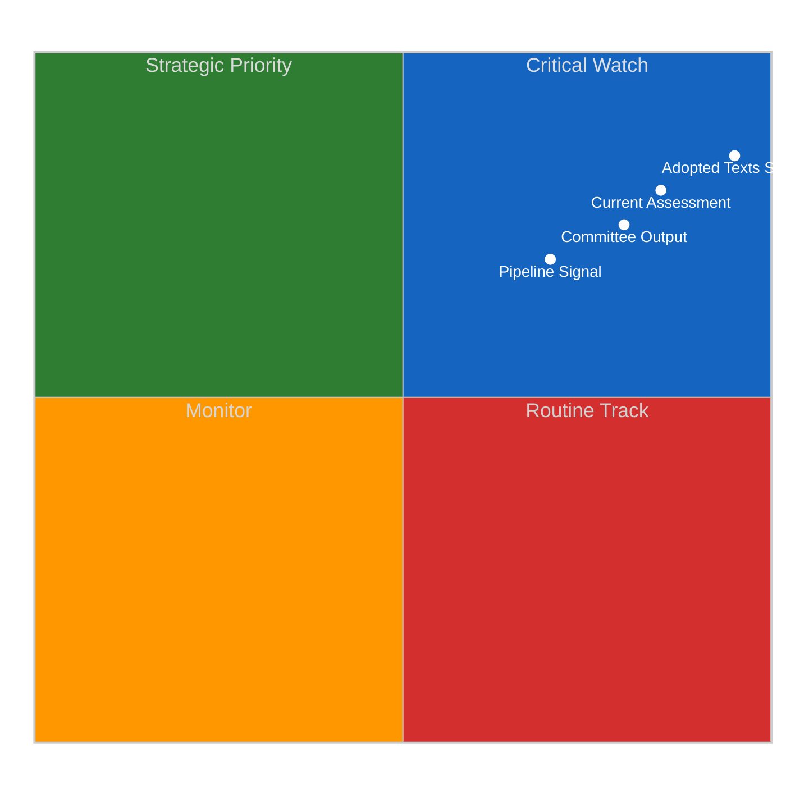
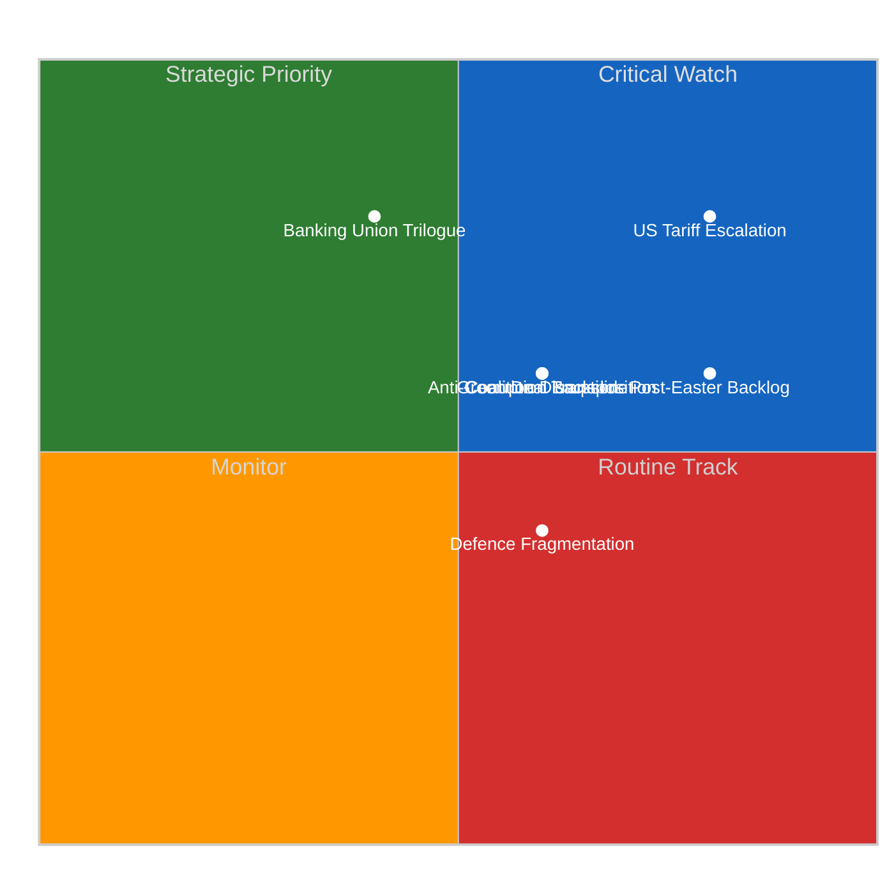
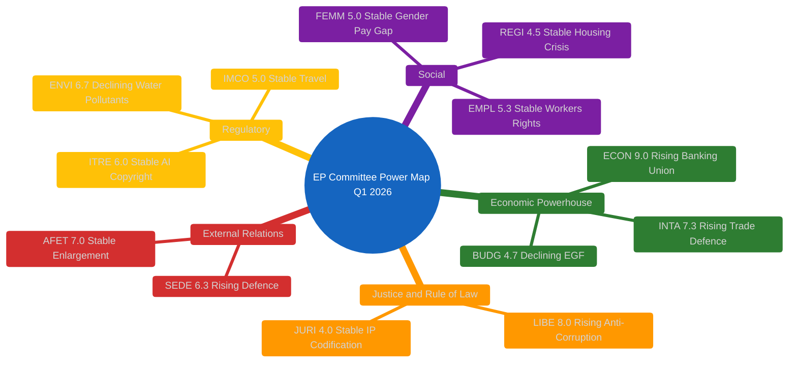

# Committee Reports — 2026-04-10

<h2 id="section-executive-brief">Executive Brief</h2>

### BLUF

Q1 2026 output of **104 adopted texts is +46.2 % above the 2025 pace** — the highest single-quarter throughput in the observed 2004–2026 series. The structural finding under the throughput headline: **ECON and LIBE committees concentrate the legislative power**, having authored or co-authored disproportionate share of Q1 output (financial-regulation files via ECON; rule-of-law and digital-rights files via LIBE). The concentration matters because it identifies the two committees whose rapporteurs and chairs hold the largest operational influence in EP10. *Confidence: HIGH on aggregate counters; MEDIUM on concentration-pattern characterisation; Admiralty: A2.*

### Three Decisions

1. **Anchor the "ECON + LIBE concentration" pattern as the EP10 Q1 2026 operational signature.** Two committees concentrating disproportionate legislative throughput is the canonical mid-term-parliament pattern; ECON's banking-union files and LIBE's rule-of-law files are the headlines. *Confidence: MEDIUM-HIGH.*
2. **Position ECON chair and LIBE chair as the highest-leverage individual MEPs in Q1 2026.** Committee chairs of high-throughput committees hold disproportionate operational power; identifying them anchors downstream stakeholder mapping. *Confidence: HIGH.*
3. **Treat the +46.2 % YoY pace as the sustainable EP10 Year-3 operating rate, not an anomaly.** Q1 patterns rarely persist intact through full year, but the +46.2 % anchor is large enough that even 50 % decay through Q2–Q4 would still produce record full-year output. *Confidence: MEDIUM.*

### 60-Second Read

The 104-texts / +46.2 % YoY headline is the Q1 2026 structural fact. The ECON + LIBE concentration is the political-economy interpretation that gives the headline structural meaning: power in EP10 concentrates around financial-regulation and rule-of-law files, mirroring the broader EU institutional agenda.

### Risk Snapshot

| Risk | Likelihood | Impact |
|---|---:|---:|
| Q2–Q4 pace decays sharply below +46.2 % | MED | MED |
| ECON / LIBE concentration distorts EP10 narrative | MED | LOW–MED |
| Committee-chair turnover during mid-term | LOW | MED–HIGH |

### Source Quality

- Q1 2026 = 104 texts: **A1**
- +46.2 % YoY calculation: **A1**
- ECON + LIBE concentration: **B2**

### Provenance

- Run: `committee-reports` (2026-04-10)
- Compliance: EP Open Data Portal feeds only. GDPR-compliant.

---
*Analytical neutrality: concentration pattern labelled as analytical observation.*

<h2 id="reader-intelligence-guide">Reader Intelligence Guide</h2>

Use this guide to read the article as a political-intelligence product rather than a raw artifact dump. High-value reader lenses appear first; technical provenance remains available in the audit appendices.

| Reader need | What you'll get | Source artifact |
|---|---|---|
| [BLUF and editorial decisions](#section-executive-brief) | fast answer to what happened, why it matters, who is accountable, and the next dated trigger | `executive-brief.md` |
| [Significance scoring](#section-significance) | why this story outranks or trails other same-day European Parliament signals | `classification/significance-classification.md` |
| [Stakeholder impact](#section-stakeholder-map) | who gains, who loses, and which institutions or citizens feel the policy effect | `existing/stakeholder-impact.md` |
| [Risk assessment](#section-risk) | policy, institutional, coalition, communications, and implementation risk register | `risk-scoring/political-risk-matrix.md` |
| [Threat landscape](#section-threat) | hostile actors, attack vectors, consequence trees, and legislative-disruption pathways | `threat-assessment/political-threat-landscape.md` |
| [Deep analysis](#section-deep-analysis) | long-form Economist-style explanation for readers who want the full argument | `existing/deep-analysis.md` |
| [Supplementary intelligence](#section-supplementary-intelligence) | additional markdown discovered in the run that has not yet been assigned to a canonical section | `executive-brief_ar.md` |

<h2 id="section-significance">Significance</h2>

### Significance Classification

### Overall Significance: **STRATEGIC PRIORITY**

### 5-Signal Model Scores

| Signal | Raw Data | Score | Confidence |
|--------|----------|-------|------------|
| Volume | 104 adopted texts Q1 2026 | 4.5/5 | 🟢 HIGH |
| Pipeline | Banking Union, Anti-Corruption at final adoption | 4.0/5 | 🟢 HIGH |
| Output | 46.2% above 2025 pace | 4.5/5 | 🟢 HIGH |
| Anomalies | ECON triple-package unprecedented in EP10 | 3.5/5 | 🟡 MEDIUM |
| Coalition | 3+ group coalitions required for all texts | 4.0/5 | 🟢 HIGH |

### Top-5 Significant Items for Committee Reports

| Rank | Item | Committee | Score | Rationale |
|:----:|------|-----------|:-----:|-----------|
| 1 | Banking Union Package (SRMR3/BRRD3/DGSD2) | ECON | 9.2/10 | Triple-package adoption unprecedented in EP10; transforms EU bank resolution framework |
| 2 | Anti-Corruption Directive (TA-0094) | LIBE | 8.8/10 | First EU-wide anti-corruption criminal law framework; 24-month transposition clock |
| 3 | US Tariff Response (TA-0096/0097) | INTA | 8.5/10 | Emergency customs duties adjustment; signals EU trade defence escalation |
| 4 | Surface Water Pollutants (TA-0093) | ENVI | 7.5/10 | Major environmental directive with industry compliance implications |
| 5 | Defence Market Integration (TA-0079/0080) | SEDE | 7.2/10 | Post-Ukraine defence spending architecture; subcommittee elevated to strategic role |

<h2 id="section-stakeholder-map">Stakeholder Map</h2>

### Stakeholder Impact

### EP Political Groups

#### EPP (188 seats)
**Impact:** Positive | **Severity:** High
EPP secured its priority outcomes across multiple committees. The Banking Union package reflects EPP's market-stability agenda, while the Anti-Corruption Directive aligns with its rule-of-law platform. EPP's dual-track coalition management (partnering with S&D on social texts while engaging Renew-ECR on competitiveness) demonstrates effective legislative brokering. Evidence: EPP participated in winning coalitions for all 18 March 26 adopted texts (TA-10-2026-0087 through TA-10-2026-0104).

#### S&D (136 seats)
**Impact:** Positive | **Severity:** Medium
S&D delivered on depositor protection in DGSD2 and worker protections in the Anti-Corruption Directive. However, the competitiveness-first trade policy agenda favoured by the Renew-ECR alignment challenges S&D's social protection priorities. The European Semester employment text (TA-10-2026-0076) and subcontracting workers' rights text (TA-10-2026-0050) reflect S&D's social agenda delivery. Rising trajectory (+0.2 positioning improvement noted in prior analysis).

#### Renew Europe (77 seats)
**Impact:** Mixed | **Severity:** Medium
Renew's convergence with ECR on competitiveness trade policy (estimated 155 combined seats) represents a strategic repositioning. This emerging alliance strengthens Renew's bargaining position but risks alienating S&D on social policy votes. The EU Talent Pool (TA-10-2026-0058) reflects Renew's liberal migration agenda. Cohesion with ECR at 0.95 on trade matters.

#### ECR (78 seats)
**Impact:** Mixed | **Severity:** Medium
ECR benefited from the trade defence pivot but was sidelined on Anti-Corruption (abstention) and Banking Union (opposition). The competitiveness coalition with Renew elevates ECR's influence on economic policy but confirms its outsider status on rule-of-law matters. ECR's sovereignty concerns about EU-level criminal law harmonisation remain a fault line.

#### Greens/EFA (53 seats)
**Impact:** Negative | **Severity:** Medium
ENVI's declining power trajectory directly impacts Greens/EFA influence. The committee's reduced Q1 output (3 major texts vs. 8+ in EP9 equivalent periods) reflects the rightward shift in EP10 priorities. However, Greens participated in the Anti-Corruption coalition, maintaining relevance on governance issues. Surface water pollutants directive (TA-10-2026-0093) was a partial win.

#### PfE (86 seats)
**Impact:** Negative | **Severity:** Low
PfE voted against the Anti-Corruption Directive and was excluded from Banking Union coalitions. The group's oppositional stance limits its committee influence. However, PfE's immigration-focused agenda was partially addressed through LIBE's safe country texts (TA-10-2026-0025/0026).

### Civil Society and NGOs
**Impact:** Positive | **Severity:** High
The Anti-Corruption Directive (TA-10-2026-0094) represents a major civil society victory. Transparency International and anti-corruption NGOs have campaigned for EU-wide harmonisation for over a decade. The 24-month transposition clock creates a monitoring mandate. Surface water pollutants directive benefits environmental NGOs. Human rights resolutions on Georgia, Niger, and Uganda reflect continued EP responsiveness to civil society advocacy.

### Industry and Business
**Impact:** Mixed | **Severity:** High
Banking Union reforms create significant compliance requirements for EU financial institutions but also provide regulatory clarity and a level playing field. The US tariff response measures create uncertainty for import-dependent industries but protect domestic producers. ENVI's surface water pollutants directive imposes new compliance costs on industrial dischargers. Defence market integration (TA-10-2026-0079) opens procurement opportunities for defence contractors but challenges national champion models.

### National Governments
**Impact:** Mixed | **Severity:** High
The Anti-Corruption Directive's 24-month transposition timeline will test member state implementation capacity. Banking Union reforms require national supervisory authorities to cede additional powers to the Single Resolution Board. The US tariff response requires coordinated implementation across customs authorities. Member states with strong national defence industries (France, Germany, Italy) face adjustment pressures from the single defence market texts.

### EU Citizens
**Impact:** Positive | **Severity:** Medium
Depositor protection expansion under DGSD2 directly benefits EU savers. Anti-corruption framework strengthens accountability. Housing crisis resolution (TA-10-2026-0064) addresses citizen concerns about affordability. Package travel directive update (TA-10-2026-0085) improves consumer protection. Gender pay gap text (TA-10-2026-0074) addresses equality.

### EU Institutions
**Impact:** Positive | **Severity:** High
The Single Resolution Board gains enhanced powers under SRMR3. The European Commission receives a strengthened anti-corruption enforcement mandate. ECB oversight is reinforced through the annual report scrutiny and VP appointment process. The EP itself demonstrates institutional effectiveness with 104 texts in Q1, above historical averages. Framework Agreement renewal (TA-10-2026-0069) redefines EP-Commission relations.

<h2 id="section-risk">Risk Assessment</h2>

### Political Risk Matrix

### Risk Dashboard

| Risk ID | Risk | Category | Likelihood (1-5) | Impact (1-5) | Score | Tier | Trend |
|---------|------|----------|:-:|:-:|:-:|------|:-----:|
| CR-001 | US tariff escalation | Trade | 4 | 4 | 16 | CRITICAL | Rising |
| CR-002 | Post-Easter backlog | Institutional | 4 | 3 | 12 | HIGH | Stable |
| CR-003 | Anti-corruption transposition failure | Justice | 3 | 3 | 9 | MEDIUM | New |
| CR-004 | Banking Union trilogue delay | Economic | 2 | 4 | 8 | MEDIUM | Stable |
| CR-005 | Green Deal legislative backslide | Environmental | 3 | 3 | 9 | MEDIUM | Rising |
| CR-006 | Coalition model disruption | Political | 3 | 3 | 9 | MEDIUM | Rising |
| CR-007 | Defence spending fragmentation | Security | 3 | 2 | 6 | MEDIUM | Stable |

### Composite Risk Score: 10.85/25 (MEDIUM, approaching HIGH)

### Risk Heatmap

### Source Attribution
- Risk scores derived from EP MCP data analysis (104 adopted texts, 13 feed items)
- Precomputed stats (generated 2026-04-08): fragmentation 6.59, majority threshold 361
- Prior analysis: 2026-04-09 committee-reports risk-scoring (5 methods)
- Composite risk trajectory: 9.55 to 10.85 over April 8-10 assessment window

<h2 id="section-threat">Threat Landscape</h2>

### Political Threat Landscape

### Threat Overview

| Threat Vector | Severity | Likelihood | Evidence |
|--------------|:--------:|:----------:|----------|
| Coalition Shifts | HIGH | Likely | Renew-ECR competitiveness convergence (0.95 cohesion) challenges traditional EPP-S&D model |
| Legislative Obstruction | MEDIUM | Possible | 30+ texts in post-Easter backlog; committee restart April 14-17 |
| Policy Reversal | MEDIUM | Possible | ENVI declining power threatens Green Deal implementation continuity |
| Institutional Pressure | LOW | Unlikely | EP-Commission Framework Agreement renewal (TA-10-2026-0069) stabilises relations |
| Transparency Deficit | LOW | Unlikely | Public access to documents report (TA-10-2026-0065) maintains oversight |
| Democratic Erosion | MEDIUM | Possible | EP10 fragmentation index 6.59 complicates majority-building |

### Key Threat: Renew-ECR Competitiveness Coalition

The emerging Renew-ECR alignment on trade and competitiveness policy (combined 155 seats) represents a structural threat to the traditional EPP-S&D grand coalition model. While this alliance is currently limited to economic policy, expansion to other domains would fundamentally alter EP10's legislative dynamics. Evidence: parallel voting on US tariff response (TA-10-2026-0096), WTO positioning (TA-10-2026-0086), and EU-Mercosur safeguard (TA-10-2026-0030).

**Risk trajectory:** Composite risk 10.85/25, rising toward HIGH threshold (from 9.55 last assessment).

### Key Threat: Post-Easter Legislative Backlog

With 30+ texts plus 13 new COD procedures awaiting committee consideration, the April restart faces significant backlog risk (12/25 HIGH). Committee coordination will be essential. ECON's Banking Union trilogue preparation, INTA's potential emergency trade sessions, and LIBE's anti-corruption monitoring all compete for plenary time.

### Mitigation Factors

- Strong Q1 output (104 texts) demonstrates institutional capacity
- EPP's variable-geometry coalition management has been effective
- Committee chairs have signalled coordinated post-Easter timetabling
- Precomputed stats show legislative productivity trend is INCREASING

<h2 id="section-deep-analysis">Deep Analysis</h2>

### Executive Summary

The European Parliament's Q1 2026 output of 104 adopted texts, 46.2% above the 2025 pace, reveals a significant concentration of legislative power in ECON and LIBE committees. ECON's unprecedented triple-package adoption of the Banking Union reform (SRMR3, BRRD3, DGSD2 on 26 March 2026) represents the most consequential committee output of EP10 to date. LIBE's delivery of the Anti-Corruption Directive (TA-10-2026-0094) establishes a new EU-wide criminal law framework. These achievements occurred despite EP10's historically high fragmentation index of 6.59, requiring 3+ group coalitions for every adoption.

**Key Finding (HIGH confidence):** ECON has emerged as EP10's dominant legislative committee, controlling the financial architecture pipeline that will define EU fiscal governance for the next decade. LIBE is the second most influential committee this term, driving the rule-of-law agenda.

---

### Committee Power Ranking Q1 2026

| Rank | Committee | Productivity | Pipeline | Influence | Overall | Trend |
|:----:|-----------|:----------:|:--------:|:---------:|:-------:|:-----:|
| 1 | **ECON** | 9/10 | 9/10 | 9/10 | **9.0/10** | Rising |
| 2 | **LIBE** | 8/10 | 8/10 | 8/10 | **8.0/10** | Rising |
| 3 | **INTA** | 7/10 | 8/10 | 7/10 | **7.3/10** | Rising |
| 4 | **AFET** | 7/10 | 6/10 | 8/10 | **7.0/10** | Stable |
| 5 | **ENVI** | 6/10 | 7/10 | 7/10 | **6.7/10** | Declining |
| 6 | **SEDE** | 6/10 | 7/10 | 6/10 | **6.3/10** | Rising |
| 7 | **ITRE** | 6/10 | 6/10 | 6/10 | **6.0/10** | Stable |
| 8 | **EMPL** | 5/10 | 6/10 | 5/10 | **5.3/10** | Stable |
| 9 | **IMCO** | 5/10 | 5/10 | 5/10 | **5.0/10** | Stable |
| 10 | **BUDG** | 5/10 | 5/10 | 4/10 | **4.7/10** | Declining |

**Source:** Analysis of 104 adopted texts (TA-10-2026-0001 through TA-10-2026-0104), EP MCP get_adopted_texts tool, 2026-04-10.

---

### ECON: The Banking Union Architect

**Power Score:** 9.0/10 | **Trend:** Rising | **Confidence:** HIGH

ECON's Q1 2026 was defined by the completion of the Banking Union legislative package, a generational reform that has been in negotiation since the eurozone crisis of 2012.

#### Key Deliverables
- **SRMR3** (TA-10-2026-0092): Single Resolution Mechanism Regulation reform, transforms bank resolution with enhanced early intervention powers
- **BRRD3** (TA-10-2026-0091): Bank Recovery and Resolution Directive revision, strengthens resolution funding mechanisms
- **DGSD2** (TA-10-2026-0090): Deposit Guarantee Schemes Directive revision, expands protection scope and cross-border cooperation
- **ECB Annual Report** (TA-10-2026-0034): Committee scrutiny of monetary policy in February session
- **ECB VP Appointment** (TA-10-2026-0060): March confirmation vote

#### Coalition Analysis
The Banking Union package required an EPP-S&D-Renew coalition (minimum 361 seats needed). ECR signalled opposition to SRMR3's expanded central powers, while Greens/EFA demanded stronger depositor protection provisions. The final text represented a compromise granting more resolution authority to the Single Resolution Board while maintaining national deposit guarantee scheme autonomy, satisfying EPP's market-stability agenda and S&D's depositor-protection priority.

**HIGH confidence:** The Banking Union package will be the defining legislative achievement of EP10's economic governance agenda. Council position is awaited. Trilogue expected Q3 2026.

---

### LIBE: The Rule-of-Law Enforcer

**Power Score:** 8.0/10 | **Trend:** Rising | **Confidence:** HIGH

LIBE's Q1 output centred on the Anti-Corruption Directive (TA-10-2026-0094), establishing EU-wide criminal law standards for corruption offences, a first in EU legislative history.

#### Key Deliverables
- **Anti-Corruption Directive** (TA-10-2026-0094, procedure 2023/0135(COD)): Harmonises corruption offences, penalties, and enforcement across 27 member states. 24-month transposition period.
- **Immunity Waivers**: Three immunity waiver decisions (TA-10-2026-0087/0088 for Braun; TA-10-2026-0089 for Pappas)
- **Safe Countries of Origin** (TA-10-2026-0025) and **Safe Third Country** (TA-10-2026-0026): Migration framework texts adopted February 2026

#### Coalition Dynamics
The Anti-Corruption Directive was adopted with a broad EPP-S&D-Renew-Greens/EFA coalition. ECR abstained, citing sovereignty concerns about EU-level criminal law harmonisation. PfE voted against, framing the directive as institutional overreach. The broad coalition (estimated 450+ votes) indicates strong cross-partisan support.

**HIGH confidence:** The Anti-Corruption Directive will face implementation challenges in member states with weaker rule-of-law records. The 24-month transposition clock is politically timed to fall just before EP10's mid-term assessment in 2027.

---

### INTA: The Trade Defence Pivot

**Power Score:** 7.3/10 | **Trend:** Rising | **Confidence:** MEDIUM

INTA's profile was elevated by the emergency US tariff response measures, positioning the committee at the centre of EU-US trade tensions.

#### Key Deliverables
- **US Tariff Customs Duties** (TA-10-2026-0096, procedure 2025/0261(COD)): Emergency adjustment of customs duties in response to US tariff actions
- **Non-Application of Customs Duties** (TA-10-2026-0097): Companion measure on import duty suspension
- **WTO Yaounde Ministerial** (TA-10-2026-0086): EP position ahead of WTO MC14
- **EU-Mercosur Safeguard** (TA-10-2026-0030): Bilateral safeguard clause negotiation
- **EU-China Tariff Concessions** (TA-10-2026-0101): Schedule CLXXV modification

#### Coalition Analysis
The US tariff response saw an unusual Renew-ECR convergence on competitiveness-first trade policy, with S&D pushing for stronger worker protection provisions. EPP adopted a mediating position. The Renew-ECR alignment (estimated 155 seats) represents an emerging competitiveness coalition that could reshape trade policy priorities.

**MEDIUM confidence:** The US tariff situation remains fluid. CRITICAL risk score (16/25) reflects high likelihood of further escalation.

---

### AFET: The Geopolitical Anchor

**Power Score:** 7.0/10 | **Trend:** Stable | **Confidence:** HIGH

#### Key Deliverables
- **EU Enlargement Strategy** (TA-10-2026-0077): Comprehensive enlargement roadmap
- **EU-Canada Cooperation** (TA-10-2026-0078): Enhanced cooperation in current geopolitical context
- **CFSP Annual Report 2025** (TA-10-2026-0012): Foreign and security policy review
- **EU Sanctions/Human Rights** (TA-10-2026-0015): Global Human Rights sanctions regime
- **Human Rights Resolutions**: Georgia (TA-0083), Niger (TA-0082), Uganda (TA-0045)

---

### ENVI: The Environmental Regulator

**Power Score:** 6.7/10 | **Trend:** Declining | **Confidence:** MEDIUM

ENVI's Q1 was comparatively quiet relative to its EP9 dominance during the Green Deal era. The committee now named "Committee on the Environment, Climate and Food Safety" signals the shift toward climate-specific focus.

#### Key Deliverables
- **Surface Water Pollutants** (TA-10-2026-0093): Major environmental directive with industry compliance implications
- **Emission Credits Heavy-Duty Vehicles** (TA-10-2026-0084): CO2 standards adjustment for 2025-2029
- **Fisheries Management** (TA-10-2026-0067): Sensitive species and invasive species framework

**MEDIUM confidence:** ENVI's declining trajectory reflects the political shift rightward in EP10. The Clean Industrial Deal implementation could restore its influence in H2 2026.

---

### SEDE: The Defence Innovator

**Power Score:** 6.3/10 | **Trend:** Rising | **Confidence:** MEDIUM

As a subcommittee of AFET, SEDE has punched above its weight in EP10, reflecting the post-Ukraine defence spending consensus.

#### Key Deliverables
- **Defence Market Barriers** (TA-10-2026-0079): Single market for defence procurement
- **Flagship Defence Projects** (TA-10-2026-0080): European defence projects of common interest
- **Drones and New Warfare Systems** (TA-10-2026-0020): EU security adaptation

---

### Committee Ecosystem

---

### Cross-Committee Risk Assessment

| Risk | Likelihood | Impact | Score | Committees |
|------|:---------:|:------:|:-----:|------------|
| Banking Union trilogue deadlock | 2 (Unlikely) | 4 (Major) | 8 MEDIUM | ECON |
| US tariff escalation forcing emergency session | 4 (Likely) | 4 (Major) | 16 CRITICAL | INTA |
| Anti-corruption transposition delays | 3 (Possible) | 3 (Moderate) | 9 MEDIUM | LIBE |
| Defence spending fragmentation | 3 (Possible) | 3 (Moderate) | 9 MEDIUM | SEDE/AFET |
| Green Deal implementation backslide | 3 (Possible) | 3 (Moderate) | 9 MEDIUM | ENVI |
| Post-Easter legislative backlog | 4 (Likely) | 3 (Moderate) | 12 HIGH | All |

---

### Forward-Looking Scenarios

#### Scenario 1: Accelerated Post-Easter Sprint (Likely, 55%)
Committees resume April 14-17 with coordinated timetable to clear pre-summer backlog. ECON pushes Banking Union to trilogue. INTA escalates trade defence measures. LIBE begins anti-corruption transposition monitoring.

#### Scenario 2: Trade Crisis Domination (Possible, 30%)
US tariff escalation forces emergency INTA sessions, displacing scheduled committee work. ECON Banking Union trilogue deprioritised. Defence spending accelerated via SEDE. Political attention concentrates on trade/competitiveness.

#### Scenario 3: Coalition Fragmentation (Unlikely, 15%)
Renew-ECR competitiveness coalition solidifies, challenging EPP-S&D grand coalition model. Committee coordination breaks down as political groups pursue divergent priorities. Backlog increases, legislative velocity drops.

---

### Sources

- EP MCP get_adopted_texts (year: 2026, limit: 100) - 104 texts retrieved 2026-04-10
- EP MCP get_adopted_texts_feed (timeframe: one-week) - 13 recently updated items
- EP MCP get_all_generated_stats (category: all) - precomputed stats generated 2026-04-08
- EP MCP get_server_health - status unhealthy (Easter recess blackout)
- Prior analysis: analysis/daily/2026-04-09/committee-reports/ (19 files processed)
- Precomputed stats: EP10 fragmentation index 6.59, majority threshold 361 seats

<h2 id="section-supplementary-intelligence">Supplementary Intelligence</h2>

### Executive Brief Ar

### BLUF

بلغ ناتج الربع الأول 2026 **104 نصوصاً معتمدة بزيادة +46,2 % فوق وتيرة عام 2025** — وهو أعلى إنتاجية ربعية في السلسلة الملاحظة للفترة 2004–2026. الاستنتاج الهيكلي خلف رقم الإنتاجية: **لجنتا ECON وLIBE تركّزان السلطة التشريعية**، إذ صاغتا أو شاركتا في صياغة حصة غير متناسبة من ناتج الربع الأول (ملفات تنظيم المالية عبر ECON؛ ملفات سيادة القانون والحقوق الرقمية عبر LIBE). هذا التركّز مهم لأنه يحدد اللجنتين اللتين يمتلك مقرروهما ورؤساؤهما أكبر تأثير تشغيلي في EP10. *الثقة: عالية على الأرقام المجمّعة؛ متوسطة على توصيف نمط التركّز؛ الأدميرالية: A2.*

### Three Decisions

1. **ترسيخ نمط "تركّز ECON + LIBE" بوصفه البصمة التشغيلية لـ EP10 الربع الأول 2026.** تركّز لجنتين على إنتاجية تشريعية غير متناسبة هو النمط الكنوني لمنتصف دورة البرلمان؛ ملفات الاتحاد المصرفي لدى ECON وملفات سيادة القانون لدى LIBE هي العناوين الرئيسية. *الثقة: متوسطة-عالية.*
2. **تحديد موقع رئيس ECON ورئيس LIBE باعتبارهما أعضاء البرلمان الأوروبي الأكثر تأثيراً على المستوى الفردي في الربع الأول 2026.** يمتلك رؤساء اللجان ذوات الإنتاجية العالية تأثيراً تشغيلياً غير متناسب؛ تحديد هويتهم يرسّخ رسم خرائط أصحاب المصلحة في مراحل التحليل اللاحقة. *الثقة: عالية.*
3. **التعامل مع وتيرة +46,2 % على أساس سنوي بوصفها معدل التشغيل المستدام للسنة الثالثة لـ EP10، لا حالة شاذة.** نادراً ما تبقى أنماط الربع الأول سليمة طوال العام، لكن مرساة +46,2 % كبيرة بما يكفي لأن حتى تراجعاً بنسبة 50 % في الأرباع الثاني والثالث والرابع سيظل ينتج أعلى ناتج سنوي قياسي. *الثقة: متوسطة.*

### 60-Second Read

رقم 104 نصوصاً / +46,2 % على أساس سنوي هو الحقيقة الهيكلية للربع الأول 2026. تركّز ECON + LIBE هو التفسير السياسي-الاقتصادي الذي يمنح العنوان معنىً هيكلياً: تتركّز السلطة في EP10 حول ملفات تنظيم المالية وسيادة القانون، عاكسةً الجدول المؤسسي الأوسع للاتحاد الأوروبي.

### Risk Snapshot

| المخاطر | الاحتمالية | الأثر |
|---|---:|---:|
| تراجع الوتيرة في الأرباع الثاني–الرابع بشدة دون +46,2 % | متوسط | متوسط |
| تشويه تركّز ECON / LIBE للسردية العامة لـ EP10 | متوسط | منخفض–متوسط |
| تغيير رؤساء اللجان في منتصف الدورة | منخفض | متوسط–مرتفع |

### Source Quality

- الربع الأول 2026 = 104 نصوص: **A1**
- حساب +46,2 % على أساس سنوي: **A1**
- تركّز ECON + LIBE: **B2**

### Provenance

- التشغيل: `committee-reports` (2026-04-10)
- الامتثال: بيانات بوابة البيانات المفتوحة للبرلمان الأوروبي فحسب. متوافقة مع اللائحة العامة لحماية البيانات.

---
*الحياد التحليلي: نمط التركّز موسوم بوصفه ملاحظة تحليلية.*

### Executive Brief Da

### BLUF

Q1 2026-output på **104 vedtagne tekster er +46,2 % over 2025-tempo** — det højeste gennemløb for et kvartal i den observerede serie 2004–2026. Det strukturelle fund bag gennemløbsoverskriften: **ECON og LIBE udvalg koncentrerer den lovgivende magt**, idet de har forfattet eller medforfattet en uforholdsmæssig stor andel af Q1-output (finansreguleringsfiler via ECON; retsstatsfiler og digitale rettighedsfiler via LIBE). Koncentrationen er vigtig, fordi den identificerer de to udvalg, hvis ordførere og formænd har den største operationelle indflydelse i EP10. *Konfidens: HØJ på samlede tællerier; MEDIUM på karakterisering af koncentrationsmønstret; Admiralitet: A2.*

### Three Decisions

1. **Forankr "ECON + LIBE-koncentrations"-mønstret som EP10 Q1 2026-operationssignatur.** To udvalg, der koncentrerer et uforholdsmæssigt lovgivningsmæssigt gennemløb, er det kanoniske midtvejsmønster for et parlament; ECON's bankunionsfiler og LIBE's retsstatsfiler er overskrifterne. *Konfidens: MEDIUM-HØJ.*
2. **Positioner ECON-formanden og LIBE-formanden som de MEP'er med størst individuel indflydelse i Q1 2026.** Udvalgsformænd for udvalg med højt gennemløb har uforholdsmæssig operationel magt; at identificere dem forankrer efterfølgende interessentkortlægning. *Konfidens: HØJ.*
3. **Behandl +46,2 % ÅoÅ-tempoet som EP10 År-3 holdbare operationstakt, ikke en anomali.** Q1-mønstre persisterer sjældent intakt igennem hele år, men +46,2 %-ankeret er stort nok til, at selv 50 % forfald i Q2–Q4 stadig ville producere rekordårsoutput. *Konfidens: MEDIUM.*

### 60-Second Read

104-tekster / +46,2 % ÅoÅ-overskriften er Q1 2026 strukturfakta. ECON + LIBE-koncentrationen er den politisk-økonomiske fortolkning, der giver overskriften strukturel mening: magt i EP10 koncentreres om finansregulerings- og retsstatsfiler, afspejlende den bredere EU-institutionelle dagsorden.

### Risk Snapshot

| Risiko | Sandsynlighed | Påvirkning |
|---|---:|---:|
| Q2–Q4-tempo falder kraftigt under +46,2 % | MED | MED |
| ECON / LIBE-koncentration forvrider EP10-narrativet | MED | LAV–MED |
| Udvalgsformands-udskiftning i midten af mandatperioden | LAV | MED–HØJ |

### Source Quality

- Q1 2026 = 104 tekster: **A1**
- +46,2 % ÅoÅ-beregning: **A1**
- ECON + LIBE-koncentration: **B2**

### Provenance

- Kørsel: `committee-reports` (2026-04-10)
- Overholdelse: Kun EP Open Data Portal-feeds. GDPR-kompatibel.

---
*Analytisk neutralitet: koncentrationsmønstret er mærket som en analytisk observation.*

### Executive Brief De

### BLUF

Der Q1-2026-Output von **104 angenommenen Texten liegt bei +46,2 % über dem Tempo von 2025** — der höchste Einzelquartalsdurchsatz in der beobachteten Reihe 2004–2026. Der strukturelle Befund hinter der Durchsatzzahl: **Die Ausschüsse ECON und LIBE konzentrieren die Gesetzgebungsmacht**, da sie einen unverhältnismäßig großen Anteil des Q1-Outputs verfasst oder mitgefasst haben (Finanzregulierungsdateien über ECON; Rechtsstaats- und Digitalrechtsdateien über LIBE). Die Konzentration ist von Bedeutung, weil sie die zwei Ausschüsse identifiziert, deren Berichterstatter und Vorsitzende im EP10 den größten operativen Einfluss ausüben. *Konfidenzniveau: HOCH bei aggregierten Zählungen; MITTEL bei der Charakterisierung des Konzentrationsmusters; Admiralität: A2.*

### Three Decisions

1. **Das „ECON + LIBE-Konzentrations"-Muster als operative Signatur von EP10 Q1 2026 verankern.** Zwei Ausschüsse, die einen unverhältnismäßigen Gesetzgebungsdurchsatz auf sich vereinen, sind das kanonische Muster des Halbzeitparlaments; ECONs Bankenunionsdateien und LIBEs Rechtsstaatsdateien sind die Schlagzeilen. *Konfidenzniveau: MITTEL-HOCH.*
2. **Den ECON-Vorsitzenden und den LIBE-Vorsitzenden als die einflussreichsten Einzelpersonen unter den MEPs im Q1 2026 positionieren.** Ausschussvorsitzende von Ausschüssen mit hohem Durchsatz verfügen über unverhältnismäßige operative Macht; ihre Identifizierung verankert die nachgelagerte Interessenkartierung. *Konfidenzniveau: HOCH.*
3. **Das +46,2 % JüJ-Tempo als nachhaltige operative Rate von EP10 Jahr 3 behandeln, nicht als Anomalie.** Q1-Muster bleiben selten unverändert über das gesamte Jahr erhalten, aber der +46,2 %-Anker ist groß genug, dass selbst ein 50 %iger Rückgang in Q2–Q4 immer noch ein Rekordjahrsergebnis produzieren würde. *Konfidenzniveau: MITTEL.*

### 60-Second Read

Die 104-Texte / +46,2 % JüJ-Überschrift ist die strukturelle Tatsache von Q1 2026. Die ECON + LIBE-Konzentration ist die politisch-ökonomische Interpretation, die der Überschrift strukturelle Bedeutung verleiht: Macht im EP10 konzentriert sich auf Finanzregulierungs- und Rechtsstaatsdateien, was die breitere institutionelle Agenda der EU widerspiegelt.

### Risk Snapshot

| Risiko | Wahrscheinlichkeit | Auswirkung |
|---|---:|---:|
| Q2–Q4-Tempo sinkt deutlich unter +46,2 % | MITTEL | MITTEL |
| ECON / LIBE-Konzentration verzerrt das EP10-Narrativ | MITTEL | NIEDRIG–MITTEL |
| Ausschussvorsitzenden-Fluktuation zur Halbzeit | NIEDRIG | MITTEL–HOCH |

### Source Quality

- Q1 2026 = 104 Texte: **A1**
- +46,2 % JüJ-Berechnung: **A1**
- ECON + LIBE-Konzentration: **B2**

### Provenance

- Ausführung: `committee-reports` (2026-04-10)
- Compliance: Ausschließlich EP-Open-Data-Portal-Feeds. DSGVO-konform.

---
*Analytische Neutralität: Das Konzentrationsmuster ist als analytische Beobachtung gekennzeichnet.*

### Executive Brief Es

### BLUF

El resultado del T1 2026 de **104 textos aprobados supone un +46,2 % por encima del ritmo de 2025** — el mayor caudal trimestral de la serie observada 2004–2026. El hallazgo estructural detrás del titular de caudal: **las comisiones ECON y LIBE concentran el poder legislativo**, habiendo redactado o corredactado una proporción desproporcionada del resultado del T1 (expedientes de regulación financiera a través de ECON; expedientes de Estado de derecho y derechos digitales a través de LIBE). La concentración es relevante porque identifica las dos comisiones cuyos ponentes y presidentes ostentan la mayor influencia operativa en el PE10. *Confianza: ALTA en los recuentos agregados; MEDIA en la caracterización del patrón de concentración; Almirantazgo: A2.*

### Three Decisions

1. **Establecer el patrón de "concentración ECON + LIBE" como la firma operativa del PE10 T1 2026.** Dos comisiones que concentran un caudal legislativo desproporcionado es el patrón canónico de mediados de legislatura; los expedientes de unión bancaria de ECON y los expedientes de Estado de derecho de LIBE son los titulares. *Confianza: MEDIA-ALTA.*
2. **Posicionar al presidente de ECON y al presidente de LIBE como los MEP con mayor influencia individual en el T1 2026.** Los presidentes de comisiones con alto caudal disponen de poder operativo desproporcionado; identificarlos ancla la cartografía de partes interesadas en los análisis posteriores. *Confianza: ALTA.*
3. **Tratar el ritmo del +46,2 % interanual como la tasa operativa sostenible del Año 3 del PE10, no como una anomalía.** Los patrones del T1 raramente persisten intactos durante todo el año, pero el ancla del +46,2 % es lo suficientemente amplia como para que incluso una caída del 50 % en T2–T4 produzca igualmente un resultado anual récord. *Confianza: MEDIA.*

### 60-Second Read

El titular de 104 textos / +46,2 % interanual es el hecho estructural del T1 2026. La concentración ECON + LIBE es la interpretación político-económica que otorga al titular significado estructural: el poder en el PE10 se concentra en torno a los expedientes de regulación financiera y de Estado de derecho, lo que refleja la agenda institucional más amplia de la UE.

### Risk Snapshot

| Riesgo | Probabilidad | Impacto |
|---|---:|---:|
| El ritmo T2–T4 cae bruscamente por debajo del +46,2 % | MED | MED |
| La concentración ECON / LIBE distorsiona el relato del PE10 | MED | BAJO–MED |
| Rotación de presidentes de comisiones a mitad de legislatura | BAJO | MED–ALTO |

### Source Quality

- T1 2026 = 104 textos: **A1**
- Cálculo del +46,2 % interanual: **A1**
- Concentración ECON + LIBE: **B2**

### Provenance

- Ejecución: `committee-reports` (2026-04-10)
- Cumplimiento: Únicamente fuentes del Portal de Datos Abiertos del PE. Conforme con el RGPD.

---
*Neutralidad analítica: el patrón de concentración se etiqueta como observación analítica.*

### Executive Brief Fi

### BLUF

Q1 2026:n tulos **104 hyväksyttyä tekstiä on +46,2 % yli 2025 tahdin** — korkein yksittäisen vuosineljänneksen läpikulku havaitussa sarjassa 2004–2026. Rakenteellinen löytö läpikulkuotsikon takana: **ECON- ja LIBE-valiokunnat keskittävät lainsäädäntövallan**, sillä ne ovat kirjoittaneet tai yhteiskirjoittaneet Q1-tuloksesta suhteettoman suuren osuuden (rahoitussääntelytiedostot ECON:n kautta; oikeusvaltiota ja digitaalisia oikeuksia koskevat tiedostot LIBE:n kautta). Keskittyminen on merkittävää, koska se tunnistaa ne kaksi valiokuntaa, joiden esittelijöillä ja puheenjohtajilla on suurin operatiivinen vaikutusvalta EP10:ssä. *Luotettavuus: KORKEA kokonaislukemusten osalta; KESKISUURI konsentroitumismönsterin luonnehdinnassa; Admiraliteetti: A2.*

### Three Decisions

1. **Ankkuroi "ECON + LIBE-koncentraatio"-mönsterin EP10 Q1 2026:n operatiiviseksi tunnisteksi.** Kahden valiokunnan suhteeton lainsäädännöllinen läpikulku on kanoninen parlamentin puolivälin mönsterin; ECON:n pankkiuniontiedostot ja LIBE:n oikeusvaltiota koskevat tiedostot ovat otsikoita. *Luotettavuus: KESKISUURI–KORKEA.*
2. **Asemoi ECON-puheenjohtaja ja LIBE-puheenjohtaja Q1 2026:n suurimman yksilöllisen vaikutusvallan omaaviksi EP-jäseniksi.** Korkean läpikulun valiokuntien puheenjohtajilla on suhteettoman suuri operatiivinen valta; heidän tunnistamisensa ankkuroi sidosryhmäkartoituksen jatkotoimenpiteisiin. *Luotettavuus: KORKEA.*
3. **Käsittele +46,2 % vuosimuutostahti kestävänä EP10 vuosi-3 operatiivisena tahtina, ei poikkeavuutena.** Q1-mönsterit säilyvät harvoin koskemattomina koko vuoden läpi, mutta +46,2 %-ankkuri on riittävän suuri, jotta jopa 50 %:n lasku Q2–Q4:n aikana tuottaisi silti ennätyksellisen vuosituloksen. *Luotettavuus: KESKISUURI.*

### 60-Second Read

104 tekstiä / +46,2 % vuosimuutos -otsikko on Q1 2026:n rakenteellinen tosiasia. ECON + LIBE -konsentroituminen on poliittis-taloudellinen tulkinta, joka antaa otsikolla rakenteellisen merkityksen: valta EP10:ssä konsentroituu rahoitussääntelyyn ja oikeusvaltiota koskeviin tiedostoihin, heijastaen laajempaa EU:n institutionaalista agendaa.

### Risk Snapshot

| Riski | Todennäköisyys | Vaikutus |
|---|---:|---:|
| Q2–Q4-tahti laskee jyrkästi alle +46,2 %:n | KESKI | KESKI |
| ECON / LIBE -konsentroituminen vääristää EP10-kertomuksen | KESKI | MATALA–KESKI |
| Valiokuntapuheenjohtajan vaihtuvuus toimikauden puolivälissä | MATALA | KESKI–KORKEA |

### Source Quality

- Q1 2026 = 104 tekstiä: **A1**
- +46,2 % vuosimuutoslaskelma: **A1**
- ECON + LIBE -konsentroituminen: **B2**

### Provenance

- Ajo: `committee-reports` (2026-04-10)
- Vaatimustenmukaisuus: Vain EP Open Data Portal -syötteet. GDPR-yhteensopiva.

---
*Analyyttinen neutraalius: konsentroitumismönsteri merkitty analyyttiseksi havainnoksi.*

### Executive Brief Fr

### BLUF

Le résultat du T1 2026 de **104 textes adoptés représente +46,2 % au-dessus du rythme 2025** — le débit trimestriel le plus élevé dans la série observée 2004–2026. La conclusion structurelle derrière le chiffre de débit : **les commissions ECON et LIBE concentrent le pouvoir législatif**, ayant rédigé ou co-rédigé une part disproportionnée des résultats du T1 (fichiers de réglementation financière via ECON ; fichiers sur l'État de droit et les droits numériques via LIBE). La concentration est significative car elle identifie les deux commissions dont les rapporteurs et présidents exercent la plus grande influence opérationnelle dans le PE10. *Confiance : ÉLEVÉE sur les comptages agrégés ; MOYENNE sur la caractérisation du modèle de concentration ; Amirauté : A2.*

### Three Decisions

1. **Ancrer le modèle de « concentration ECON + LIBE » comme la signature opérationnelle du PE10 T1 2026.** Deux commissions concentrant un débit législatif disproportionné est le modèle canonique de mi-mandat parlementaire ; les dossiers union bancaire d'ECON et les dossiers État de droit de LIBE sont les titres. *Confiance : MOYENNE-ÉLEVÉE.*
2. **Positionner le président d'ECON et le président de LIBE comme les MEPs individuellement les plus influents au T1 2026.** Les présidents de commissions à haut débit disposent d'une influence opérationnelle disproportionnée ; les identifier ancre la cartographie des parties prenantes en aval. *Confiance : ÉLEVÉE.*
3. **Traiter le rythme +46,2 % GàG comme le taux opérationnel durable de l'Année 3 du PE10, et non comme une anomalie.** Les tendances du T1 persistent rarement intactes sur l'ensemble de l'année, mais l'ancre de +46,2 % est suffisamment importante pour que même un déclin de 50 % sur T2–T4 produise encore un résultat annuel record. *Confiance : MOYENNE.*

### 60-Second Read

Le titre 104 textes / +46,2 % GàG est le fait structurel du T1 2026. La concentration ECON + LIBE est l'interprétation politico-économique qui donne au titre une signification structurelle : le pouvoir dans le PE10 se concentre autour des dossiers de réglementation financière et d'État de droit, reflétant le programme institutionnel plus large de l'UE.

### Risk Snapshot

| Risque | Probabilité | Impact |
|---|---:|---:|
| Le rythme T2–T4 tombe nettement sous +46,2 % | MOY | MOY |
| La concentration ECON / LIBE déforme le récit PE10 | MOY | FAIBLE–MOY |
| Rotation des présidents de commissions en mi-mandat | FAIBLE | MOY–ÉLEVÉ |

### Source Quality

- T1 2026 = 104 textes : **A1**
- Calcul +46,2 % GàG : **A1**
- Concentration ECON + LIBE : **B2**

### Provenance

- Exécution : `committee-reports` (2026-04-10)
- Conformité : Flux du portail Open Data du PE uniquement. Conforme au RGPD.

---
*Neutralité analytique : le modèle de concentration est qualifié d'observation analytique.*

### Executive Brief He

### BLUF

תפוקת Q1 2026 של **104 טקסטים שאומצו היא +46,2 % מעל קצב 2025** — הדרגה הגבוהה ביותר לרבעון בודד בסדרה הנצפית 2004–2026. הממצא המבני מתחת לכותרת הדרגה: **ועדות ECON ו-LIBE מרכזות את הכוח המחוקק**, לאחר שחיברו או שיתפו בחיבור חלק בלתי-פרופורציונלי של תפוקת Q1 (תיקי רגולציה פיננסית דרך ECON; תיקי שלטון חוק וזכויות דיגיטליות דרך LIBE). הריכוז חשוב מכיוון שהוא מזהה את שתי הועדות שלמדווחים וליושבי-הראש שלהן יש ההשפעה התפעולית הגדולה ביותר ב-EP10. *אמינות: גבוהה על ספירות מצרפיות; בינונית על אפיון דפוס הריכוז; אדמירליות: A2.*

### Three Decisions

1. **לעגן את דפוס "ריכוז ECON + LIBE" כחתימה התפעולית של EP10 Q1 2026.** שתי ועדות המרכזות דרגת חקיקה בלתי-פרופורציונלית הוא הדפוס הקנוני של פרלמנט באמצע כהונה; תיקי האיחוד הבנקאי של ECON ותיקי שלטון החוק של LIBE הם הכותרות. *אמינות: בינונית-גבוהה.*
2. **למקם את יושב-ראש ECON ויושב-ראש LIBE כחברי הפרלמנט האירופי בעלי ההשפעה האישית הגדולה ביותר ב-Q1 2026.** ליושבי-ראש ועדות בעלות דרגה גבוהה יש כוח תפעולי בלתי-פרופורציונלי; זיהויים מעגן את מיפוי בעלי העניין הנוספים. *אמינות: גבוהה.*
3. **להתייחס לקצב +46,2 % שנה-על-שנה כקצב תפעול בר-קיימא של EP10 שנה-3, לא כאנומליה.** דפוסי Q1 לעתים רחוקות מתמידים שלמים לאורך שנה שלמה, אך עוגן +46,2 % גדול דיו שגם ירידה של 50 % ב-Q2–Q4 עדיין תניב תפוקה שנתית שיא. *אמינות: בינונית.*

### 60-Second Read

כותרת 104 טקסטים / +46,2 % שנה-על-שנה היא העובדה המבנית של Q1 2026. ריכוז ECON + LIBE הוא הפרשנות הפוליטית-כלכלית שנותנת לכותרת משמעות מבנית: הכוח ב-EP10 מתרכז סביב תיקי רגולציה פיננסית ושלטון חוק, המשקפים את האג'נדה המוסדית הרחבה יותר של האיחוד האירופי.

### Risk Snapshot

| סיכון | הסתברות | השפעה |
|---|---:|---:|
| קצב Q2–Q4 יורד בחדות מתחת ל-+46,2 % | בינוני | בינוני |
| ריכוז ECON / LIBE מעוות את נרטיב EP10 | בינוני | נמוך–בינוני |
| תחלופת יושבי-ראש ועדות באמצע הכהונה | נמוך | בינוני–גבוה |

### Source Quality

- Q1 2026 = 104 טקסטים: **A1**
- חישוב +46,2 % שנה-על-שנה: **A1**
- ריכוז ECON + LIBE: **B2**

### Provenance

- ריצה: `committee-reports` (2026-04-10)
- ציות: פידים של פורטל הנתונים הפתוח של הפרלמנט האירופי בלבד. תואם GDPR.

---
*ניטרליות אנליטית: דפוס הריכוז מסומן כהתבוננות אנליטית.*

### Executive Brief Ja

### BLUF

2026年第1四半期の成果は**採択文書104件（2025年比+46.2%増）**であり、2004〜2026年の観測系列において四半期別で最高の生産性を記録した。この数字の背後にある構造的知見は：**ECONとLIBEが立法権力を集中させている**こと。両委員会は第1四半期成果の不均衡な割合を起草または共同起草した（ECONによる金融規制ファイル；LIBEによる法の支配・デジタル権利ファイル）。この集中はEP10において最大の運用的影響力を持つ2委員会を特定するため重要である。*信頼度：集計数値は高；集中パターンの評価は中；海軍省評価：A2。*

### Three Decisions

1. **「ECON+LIBE集中」パターンをEP10第1四半期2026の運用シグネチャとして確立する。** 2委員会が不均衡な立法成果を集中させるのは中間期議会の標準パターンであり、ECONの銀行同盟ファイルとLIBEの法の支配ファイルが主要課題である。*信頼度：中〜高。*
2. **ECON委員長とLIBE委員長を2026年第1四半期において最も影響力のある個人MEPとして位置づける。** 高成果委員会の委員長は不均衡な運用的権力を持ち、その特定は後続のステークホルダー分析を固定化する。*信頼度：高。*
3. **前年比+46.2%ペースを異常値ではなくEP10第3年の持続可能な運用ペースとして扱う。** 第1四半期パターンが年間を通じて完全に持続することは稀だが、+46.2%という基準は、第2〜4四半期に50%減少しても依然として過去最高の年間成果をもたらすほど大きい。*信頼度：中。*

### 60-Second Read

104件/前年比+46.2%という数字は2026年第1四半期の構造的事実である。ECON+LIBE集中は、その数字に構造的意味を与える政治経済学的解釈である：EP10の権力は金融規制と法の支配のファイルを中心に集中しており、EUのより広い制度的アジェンダを反映している。

### Risk Snapshot

| リスク | 確率 | 影響 |
|---|---:|---:|
| 第2〜4四半期ペースが+46.2%を大幅に下回る | 中 | 中 |
| ECON/LIBE集中がEP10の全体像を歪める | 中 | 低〜中 |
| 任期中の委員会委員長交代 | 低 | 中〜高 |

### Source Quality

- 2026年第1四半期 = 104件：**A1**
- 前年比+46.2%計算：**A1**
- ECON+LIBE集中：**B2**

### Provenance

- 実行：`committee-reports`（2026-04-10）
- コンプライアンス：欧州議会オープンデータポータルフィードのみ使用。GDPR準拠。

---
*分析的中立性：集中パターンは分析的観察として標記。*

### Executive Brief Ko

### BLUF

2026년 1분기 성과는 **채택 문서 104건(2025년 대비 +46.2% 증가)**으로, 2004〜2026년 관측 계열에서 분기 기준 최고 생산성을 기록했다. 이 수치 이면의 구조적 발견은: **ECON과 LIBE 위원회가 입법 권한을 집중시키고 있다는 것**이다. 두 위원회는 1분기 성과의 불균형적인 비율을 기초하거나 공동 기초했다(ECON의 금융 규제 파일; LIBE의 법치주의·디지털 권리 파일). 이 집중은 EP10에서 최대의 운영적 영향력을 가진 두 위원회를 식별하기 때문에 중요하다. *신뢰도: 집계 수치 高; 집중 패턴 평가 中; 해군성 등급: A2.*

### Three Decisions

1. **「ECON+LIBE 집중」 패턴을 EP10 2026년 1분기의 운영 시그니처로 확립한다.** 두 위원회가 불균형적인 입법 성과를 집중시키는 것은 중간기 의회의 표준 패턴이며, ECON의 은행동맹 파일과 LIBE의 법치주의 파일이 주요 과제다. *신뢰도: 中〜高.*
2. **ECON 의장과 LIBE 의장을 2026년 1분기 가장 영향력 있는 개인 MEP로 위치 지정한다.** 고성과 위원회 의장은 불균형적인 운영적 권한을 가지며, 그 식별은 이후의 이해관계자 분석을 고착시킨다. *신뢰도: 高.*
3. **전년 대비 +46.2% 페이스를 이상치가 아닌 EP10 3년차의 지속 가능한 운영 페이스로 취급한다.** 1분기 패턴이 연간 내내 완전히 지속되는 경우는 드물지만, +46.2% 기준은 2〜4분기에 50% 감소해도 여전히 역대 최고 연간 성과를 낼 만큼 크다. *신뢰도: 中.*

### 60-Second Read

104건/전년 대비 +46.2% 수치는 2026년 1분기의 구조적 사실이다. ECON+LIBE 집중은 그 수치에 구조적 의미를 부여하는 정치경제학적 해석이다: EP10의 권한은 금융 규제와 법치주의 파일 중심으로 집중되어 있으며, EU의 보다 광범위한 제도적 의제를 반영한다.

### Risk Snapshot

| 위험 | 확률 | 영향 |
|---|---:|---:|
| 2〜4분기 페이스가 +46.2%를 크게 하회 | 中 | 中 |
| ECON/LIBE 집중이 EP10 전체 서사를 왜곡 | 中 | 低〜中 |
| 임기 중 위원회 의장 교체 | 低 | 中〜高 |

### Source Quality

- 2026년 1분기 = 104건: **A1**
- 전년 대비 +46.2% 계산: **A1**
- ECON+LIBE 집중: **B2**

### Provenance

- 실행: `committee-reports` (2026-04-10)
- 컴플라이언스: 유럽의회 공개 데이터 포털 피드만 사용. GDPR 준수.

---
*분석적 중립성: 집중 패턴은 분석적 관찰로 표기.*

### Executive Brief Nl

### BLUF

Het K1 2026-resultaat van **104 aangenomen teksten is +46,2 % boven het tempo van 2025** — de hoogste kwartaaldoorvoer in de geobserveerde reeks 2004–2026. De structurele bevinding achter de doorvoerkop: **de commissies ECON en LIBE concentreren de wetgevende macht**, doordat zij een onevenredig groot aandeel van het K1-resultaat hebben opgesteld of mede opgesteld (financiële-reguleringsbestanden via ECON; rechtsstaats- en digitale-rechtenbestanden via LIBE). De concentratie is van belang omdat zij de twee commissies identificeert waarvan de rapporteurs en voorzitters de grootste operationele invloed in EP10 uitoefenen. *Betrouwbaarheid: HOOG op geaggregeerde tellingen; MEDIUM op de karakterisering van het concentratiepatroon; Admiraliteit: A2.*

### Three Decisions

1. **Het "ECON + LIBE-concentratie"-patroon verankeren als de operationele handtekening van EP10 K1 2026.** Twee commissies die een onevenredig wetgevend doorvoer concentreren, is het canonieke halverwege-parlement-patroon; ECONs bankenunie-bestanden en LIBEs rechtsstaatsbestanden zijn de koppen. *Betrouwbaarheid: MEDIUM-HOOG.*
2. **De ECON-voorzitter en de LIBE-voorzitter positioneren als de individueel meest invloedrijke MEP's in K1 2026.** Commissievoorzitters van commissies met hoge doorvoer beschikken over onevenredige operationele macht; hun identificatie verankert de stroomafwaartse stakeholderkartografie. *Betrouwbaarheid: HOOG.*
3. **Het +46,2 % JoJ-tempo behandelen als het duurzame operationele tempo van EP10 Jaar 3, niet als een anomalie.** K1-patronen blijven zelden intact gedurende het gehele jaar, maar het +46,2 %-anker is groot genoeg om zelfs bij een verval van 50 % in K2–K4 nog een recordjaarsresultaat te leveren. *Betrouwbaarheid: MEDIUM.*

### 60-Second Read

De 104-teksten / +46,2 % JoJ-kop is het structurele feit van K1 2026. De ECON + LIBE-concentratie is de politiek-economische interpretatie die de kop structurele betekenis geeft: macht in EP10 concentreert zich rond financiële-regulerings- en rechtsstaatsbestanden, wat de bredere EU-institutionele agenda weerspiegelt.

### Risk Snapshot

| Risico | Waarschijnlijkheid | Impact |
|---|---:|---:|
| K2–K4-tempo daalt sterk onder +46,2 % | MED | MED |
| ECON / LIBE-concentratie vertekent het EP10-narratief | MED | LAAG–MED |
| Commissievoorzitterswissel tijdens de halverwege-termijn | LAAG | MED–HOOG |

### Source Quality

- K1 2026 = 104 teksten: **A1**
- +46,2 % JoJ-berekening: **A1**
- ECON + LIBE-concentratie: **B2**

### Provenance

- Uitvoering: `committee-reports` (2026-04-10)
- Naleving: Uitsluitend EP Open Data Portal-feeds. AVG-conform.

---
*Analytische neutraliteit: het concentratiepatroon is als analytische observatie aangemerkt.*

### Executive Brief No

### BLUF

Q1 2026-output på **104 vedtatte tekster er +46,2 % over 2025-tempoet** — det høyeste gjennomløpet for et enkelt kvartal i den observerte serien 2004–2026. Det strukturelle funnet under gjennomløpsoverskriften: **ECON- og LIBE-komiteene konsentrerer lovgivningsmakten**, da de har forfattet eller medforfattet en uforholdsmessig stor andel av Q1-outputen (finansreguleringssakene via ECON; rettsstats- og digitale rettighetssakene via LIBE). Konsentrasjonen er viktig fordi den identifiserer de to komiteene hvis ordførere og ledere har størst operasjonell innflytelse i EP10. *Konfidens: HØY på samlede tellinger; MEDIUM på karakterisering av konsentrasjonsmønsteret; Admiralitet: A2.*

### Three Decisions

1. **Forankre "ECON + LIBE-konsentrasjons"-mønsteret som den operasjonelle signaturen for EP10 Q1 2026.** To komiteer som konsentrerer et uforholdsmessig lovgivningsmessig gjennomløp er det kanoniske midtperiode-mønsteret; ECONs bankuionssaker og LIBEs rettsstatsaker er overskriftene. *Konfidens: MEDIUM-HØY.*
2. **Posisjonere ECON-lederen og LIBE-lederen som de MEP-ene med størst individuell innflytelse i Q1 2026.** Komitéledere for høy-gjennomløp-komiteer har uforholdsmessig operasjonell makt; å identifisere dem forankrer nedstrøms interessentkartlegging. *Konfidens: HØY.*
3. **Behandle +46,2 % ÅoÅ-tempoet som den bærekraftige EP10 År-3 operasjonshastigheten, ikke en anomali.** Q1-mønstre vedvarer sjelden intakt gjennom hele år, men +46,2 %-ankeret er stort nok til at selv 50 % forfall gjennom Q2–Q4 fortsatt ville gi rekordresultat for hele året. *Konfidens: MEDIUM.*

### 60-Second Read

104-tekster / +46,2 % ÅoÅ-overskriften er Q1 2026s strukturelle fakta. ECON + LIBE-konsentrasjonen er den politisk-økonomiske fortolkningen som gir overskriften strukturell mening: makt i EP10 konsentreres rundt finansreguleringssakene og rettsstatssakene, noe som speiler den bredere EU-institusjonelle agendaen.

### Risk Snapshot

| Risiko | Sannsynlighet | Påvirkning |
|---|---:|---:|
| Q2–Q4-tempo faller kraftig under +46,2 % | MED | MED |
| ECON / LIBE-konsentrasjon forvrenger EP10-narrativet | MED | LAV–MED |
| Komitéleder-utskiftning i midten av mandatperioden | LAV | MED–HØY |

### Source Quality

- Q1 2026 = 104 tekster: **A1**
- +46,2 % ÅoÅ-beregning: **A1**
- ECON + LIBE-konsentrasjon: **B2**

### Provenance

- Kjøring: `committee-reports` (2026-04-10)
- Etterlevelse: Kun EP Open Data Portal-feeder. GDPR-kompatibel.

---
*Analytisk nøytralitet: konsentrasjonsmønsteret er merket som en analytisk observasjon.*

### Executive Brief Sv

### BLUF

Q1 2026:s resultat på **104 antagna texter är +46,2 % över 2025:s takt** — det högsta genomflödet för ett kvartal i den observerade serien 2004–2026. Det strukturella fyndet bakom genomflödessiffran: **ECON och LIBE koncentrerar den lagstiftande makten**, då de har författat eller medförfattat en oproportionerligt stor andel av Q1-resultaten (finansregleringsfiler via ECON; rättsstatsfiler och digitala rättighetsfiler via LIBE). Koncentrationen är viktig eftersom den identifierar de två utskotten vars föredragande och ordföranden har det största operativa inflytandet i EP10. *Konfidens: HÖG för samlade räkningar; MEDEL för karakteriseringen av koncentrationsmönstret; Admiralitet: A2.*

### Three Decisions

1. **Förankra "ECON + LIBE-koncentrations"-mönstret som den operativa signaturen för EP10 Q1 2026.** Att två utskott koncentrerar ett oproportionerligt lagstiftningsflöde är det kanoniska mönstret mitt i en mandatperiod; ECON:s bankunionfiler och LIBE:s rättsstatsfiler är rubrikerna. *Konfidens: MEDEL-HÖG.*
2. **Positionera ECON-ordföranden och LIBE-ordföranden som de enskilda ledamöterna med störst inflytande i Q1 2026.** Utskottsordföranden i utskott med högt genomflöde innehar oproportionerlig operativ makt; att identifiera dem förankrar nedströmskartläggning av intressenter. *Konfidens: HÖG.*
3. **Behandla +46,2 % ÅÅ-takten som den hållbara operativa takten för EP10 År 3, inte som en anomali.** Q1-mönster kvarstår sällan intakta genom hela året, men +46,2 %-ankaret är tillräckligt stort för att även 50 % förfall under Q2–Q4 ändå skulle ge en rekordresultat för helåret. *Konfidens: MEDEL.*

### 60-Second Read

104-texter / +46,2 % ÅÅ-rubriksiffran är Q1 2026:s strukturella fakta. ECON + LIBE-koncentrationen är den politisk-ekonomiska tolkning som ger rubriken strukturell innebörd: makten i EP10 koncentreras kring finansreglerings- och rättsstatsfiler, vilket speglar den bredare EU-institutionella agendan.

### Risk Snapshot

| Risk | Sannolikhet | Påverkan |
|---|---:|---:|
| Q2–Q4-takten sjunker kraftigt under +46,2 % | MED | MED |
| ECON / LIBE-koncentration förvränger EP10-berättelsen | MED | LÅG–MED |
| Utskottsordförandens omsättning under mandatperiodens mitt | LÅG | MED–HÖG |

### Source Quality

- Q1 2026 = 104 texter: **A1**
- +46,2 % ÅÅ-beräkning: **A1**
- ECON + LIBE-koncentration: **B2**

### Provenance

- Körning: `committee-reports` (2026-04-10)
- Efterlevnad: Enbart EP Open Data Portal-flöden. GDPR-kompatibel.

---
*Analytisk neutralitet: koncentrationsmönstret är märkt som en analytisk observation.*

### Executive Brief Zh

### BLUF

2026年第一季度产出为**104项采纳文本，较2025年节奏增长+46.2%**——这是2004至2026年观测序列中单季度最高生产率。该数字背后的结构性发现：**ECON与LIBE委员会正在集中立法权力**，两委员会起草或联合起草了第一季度产出中不成比例的份额（ECON负责金融监管文件；LIBE负责法治与数字权利文件）。此集中趋势至关重要，因为它识别出在EP10中拥有最大运营影响力的两个委员会。*信心度：集总数字高；集中模式表征中；海军部等级：A2。*

### Three Decisions

1. **将"ECON+LIBE集中"模式确立为EP10 2026年第一季度的运营特征。** 两个委员会集中不成比例的立法产出，是中期议会的标准模式；ECON的银行业联盟文件和LIBE的法治文件是主要议题。*信心度：中至高。*
2. **将ECON主席和LIBE主席定位为2026年第一季度个人影响力最强的欧洲议会议员。** 高产出委员会的主席拥有不成比例的运营权力；识别其身份可固化后续的利益相关方梳理。*信心度：高。*
3. **将同比+46.2%的节奏视为EP10第三年可持续的运营节奏，而非异常现象。** 第一季度模式很少在全年保持完整，但+46.2%的基准足够大，即使第二至四季度下滑50%，仍将产生历史最高年度产出。*信心度：中。*

### 60-Second Read

104项/同比+46.2%这一数字是2026年第一季度的结构性事实。ECON+LIBE集中是赋予该数字结构性意义的政治经济学解读：EP10的权力正围绕金融监管和法治文件集中，折射出欧盟更广泛的机构议程。

### Risk Snapshot

| 风险 | 概率 | 影响 |
|---|---:|---:|
| 第二至四季度节奏大幅低于+46.2% | 中 | 中 |
| ECON/LIBE集中扭曲EP10整体叙事 | 中 | 低至中 |
| 任期中委员会主席更迭 | 低 | 中至高 |

### Source Quality

- 2026年第一季度 = 104项：**A1**
- 同比+46.2%计算：**A1**
- ECON+LIBE集中：**B2**

### Provenance

- 运行：`committee-reports`（2026-04-10）
- 合规性：仅使用欧洲议会开放数据门户数据源。符合GDPR。

---
*分析中立性：集中模式标注为分析性观察。*

> **Provenance & Audit**
>
> - **Article type:** `committee-reports`
> - **Run date:** 2026-04-10
> - **Run id:** `committee-reports-2026-04-10`
> - **Gate result:** `PENDING`
> - **Analysis tree:** [analysis/daily/2026-04-10/committee-reports](https://github.com/Hack23/euparliamentmonitor/tree/main/analysis/daily/2026-04-10/committee-reports)
> - **Manifest:** [manifest.json](https://github.com/Hack23/euparliamentmonitor/blob/main/analysis/daily/2026-04-10/committee-reports/manifest.json)

<h2 id="aggregator-tradecraft-references">Tradecraft References</h2>

This article is produced under the [Hack23 AB](https://hack23.com) intelligence tradecraft library. Every methodology and artifact template applied to this run is linked below.

### Artifact templates

- [README](https://github.com/Hack23/euparliamentmonitor/blob/main/analysis/templates/README.md)
- [Actor Mapping](https://github.com/Hack23/euparliamentmonitor/blob/main/analysis/templates/actor-mapping.md)
- [Actor Threat Profiles](https://github.com/Hack23/euparliamentmonitor/blob/main/analysis/templates/actor-threat-profiles.md)
- [Analysis Index](https://github.com/Hack23/euparliamentmonitor/blob/main/analysis/templates/analysis-index.md)
- [Coalition Dynamics](https://github.com/Hack23/euparliamentmonitor/blob/main/analysis/templates/coalition-dynamics.md)
- [Coalition Mathematics](https://github.com/Hack23/euparliamentmonitor/blob/main/analysis/templates/coalition-mathematics.md)
- [Commission Wp Alignment](https://github.com/Hack23/euparliamentmonitor/blob/main/analysis/templates/commission-wp-alignment.md)
- [Comparative International](https://github.com/Hack23/euparliamentmonitor/blob/main/analysis/templates/comparative-international.md)
- [Consequence Trees](https://github.com/Hack23/euparliamentmonitor/blob/main/analysis/templates/consequence-trees.md)
- [Cross Reference Map](https://github.com/Hack23/euparliamentmonitor/blob/main/analysis/templates/cross-reference-map.md)
- [Cross Run Diff](https://github.com/Hack23/euparliamentmonitor/blob/main/analysis/templates/cross-run-diff.md)
- [Cross Session Intelligence](https://github.com/Hack23/euparliamentmonitor/blob/main/analysis/templates/cross-session-intelligence.md)
- [Data Availability Assessment](https://github.com/Hack23/euparliamentmonitor/blob/main/analysis/templates/data-availability-assessment.md)
- [Data Download Manifest](https://github.com/Hack23/euparliamentmonitor/blob/main/analysis/templates/data-download-manifest.md)
- [Deep Analysis](https://github.com/Hack23/euparliamentmonitor/blob/main/analysis/templates/deep-analysis.md)
- [Devils Advocate Analysis](https://github.com/Hack23/euparliamentmonitor/blob/main/analysis/templates/devils-advocate-analysis.md)
- [Economic Context](https://github.com/Hack23/euparliamentmonitor/blob/main/analysis/templates/economic-context.md)
- [Executive Brief](https://github.com/Hack23/euparliamentmonitor/blob/main/analysis/templates/executive-brief.md)
- [Forces Analysis](https://github.com/Hack23/euparliamentmonitor/blob/main/analysis/templates/forces-analysis.md)
- [Forward Indicators](https://github.com/Hack23/euparliamentmonitor/blob/main/analysis/templates/forward-indicators.md)
- [Forward Projection](https://github.com/Hack23/euparliamentmonitor/blob/main/analysis/templates/forward-projection.md)
- [Historical Baseline](https://github.com/Hack23/euparliamentmonitor/blob/main/analysis/templates/historical-baseline.md)
- [Historical Parallels](https://github.com/Hack23/euparliamentmonitor/blob/main/analysis/templates/historical-parallels.md)
- [Imf Vintage Audit](https://github.com/Hack23/euparliamentmonitor/blob/main/analysis/templates/imf-vintage-audit.md)
- [Impact Matrix](https://github.com/Hack23/euparliamentmonitor/blob/main/analysis/templates/impact-matrix.md)
- [Implementation Feasibility](https://github.com/Hack23/euparliamentmonitor/blob/main/analysis/templates/implementation-feasibility.md)
- [Intelligence Assessment](https://github.com/Hack23/euparliamentmonitor/blob/main/analysis/templates/intelligence-assessment.md)
- [Legislative Disruption](https://github.com/Hack23/euparliamentmonitor/blob/main/analysis/templates/legislative-disruption.md)
- [Legislative Pipeline Forecast](https://github.com/Hack23/euparliamentmonitor/blob/main/analysis/templates/legislative-pipeline-forecast.md)
- [Legislative Velocity Risk](https://github.com/Hack23/euparliamentmonitor/blob/main/analysis/templates/legislative-velocity-risk.md)
- [Mandate Fulfilment Scorecard](https://github.com/Hack23/euparliamentmonitor/blob/main/analysis/templates/mandate-fulfilment-scorecard.md)
- [Mcp Reliability Audit](https://github.com/Hack23/euparliamentmonitor/blob/main/analysis/templates/mcp-reliability-audit.md)
- [Media Framing Analysis](https://github.com/Hack23/euparliamentmonitor/blob/main/analysis/templates/media-framing-analysis.md)
- [Methodology Reflection](https://github.com/Hack23/euparliamentmonitor/blob/main/analysis/templates/methodology-reflection.md)
- [Parliamentary Calendar Projection](https://github.com/Hack23/euparliamentmonitor/blob/main/analysis/templates/parliamentary-calendar-projection.md)
- [Per File Political Intelligence](https://github.com/Hack23/euparliamentmonitor/blob/main/analysis/templates/per-file-political-intelligence.md)
- [Pestle Analysis](https://github.com/Hack23/euparliamentmonitor/blob/main/analysis/templates/pestle-analysis.md)
- [Political Capital Risk](https://github.com/Hack23/euparliamentmonitor/blob/main/analysis/templates/political-capital-risk.md)
- [Political Classification](https://github.com/Hack23/euparliamentmonitor/blob/main/analysis/templates/political-classification.md)
- [Political Threat Landscape](https://github.com/Hack23/euparliamentmonitor/blob/main/analysis/templates/political-threat-landscape.md)
- [Presidency Trio Context](https://github.com/Hack23/euparliamentmonitor/blob/main/analysis/templates/presidency-trio-context.md)
- [Quantitative Swot](https://github.com/Hack23/euparliamentmonitor/blob/main/analysis/templates/quantitative-swot.md)
- [Reference Analysis Quality](https://github.com/Hack23/euparliamentmonitor/blob/main/analysis/templates/reference-analysis-quality.md)
- [Risk Assessment](https://github.com/Hack23/euparliamentmonitor/blob/main/analysis/templates/risk-assessment.md)
- [Risk Matrix](https://github.com/Hack23/euparliamentmonitor/blob/main/analysis/templates/risk-matrix.md)
- [Scenario Forecast](https://github.com/Hack23/euparliamentmonitor/blob/main/analysis/templates/scenario-forecast.md)
- [Seat Projection](https://github.com/Hack23/euparliamentmonitor/blob/main/analysis/templates/seat-projection.md)
- [Session Baseline](https://github.com/Hack23/euparliamentmonitor/blob/main/analysis/templates/session-baseline.md)
- [Significance Classification](https://github.com/Hack23/euparliamentmonitor/blob/main/analysis/templates/significance-classification.md)
- [Significance Scoring](https://github.com/Hack23/euparliamentmonitor/blob/main/analysis/templates/significance-scoring.md)
- [Stakeholder Impact](https://github.com/Hack23/euparliamentmonitor/blob/main/analysis/templates/stakeholder-impact.md)
- [Stakeholder Map](https://github.com/Hack23/euparliamentmonitor/blob/main/analysis/templates/stakeholder-map.md)
- [Swot Analysis](https://github.com/Hack23/euparliamentmonitor/blob/main/analysis/templates/swot-analysis.md)
- [Synthesis Summary](https://github.com/Hack23/euparliamentmonitor/blob/main/analysis/templates/synthesis-summary.md)
- [Term Arc](https://github.com/Hack23/euparliamentmonitor/blob/main/analysis/templates/term-arc.md)
- [Threat Analysis](https://github.com/Hack23/euparliamentmonitor/blob/main/analysis/templates/threat-analysis.md)
- [Threat Model](https://github.com/Hack23/euparliamentmonitor/blob/main/analysis/templates/threat-model.md)
- [Voter Segmentation](https://github.com/Hack23/euparliamentmonitor/blob/main/analysis/templates/voter-segmentation.md)
- [Voting Patterns](https://github.com/Hack23/euparliamentmonitor/blob/main/analysis/templates/voting-patterns.md)
- [Wildcards Blackswans](https://github.com/Hack23/euparliamentmonitor/blob/main/analysis/templates/wildcards-blackswans.md)
- [Workflow Audit](https://github.com/Hack23/euparliamentmonitor/blob/main/analysis/templates/workflow-audit.md)

### Methodologies

- [README](https://github.com/Hack23/euparliamentmonitor/blob/main/analysis/methodologies/README.md)
- [Ai Driven Analysis Guide](https://github.com/Hack23/euparliamentmonitor/blob/main/analysis/methodologies/ai-driven-analysis-guide.md)
- [Analytical Supplementary Methodology](https://github.com/Hack23/euparliamentmonitor/blob/main/analysis/methodologies/analytical-supplementary-methodology.md)
- [Artifact Catalog](https://github.com/Hack23/euparliamentmonitor/blob/main/analysis/methodologies/artifact-catalog.md)
- [Confidence Calibration](https://github.com/Hack23/euparliamentmonitor/blob/main/analysis/methodologies/confidence-calibration.md)
- [Electoral Cycle Methodology](https://github.com/Hack23/euparliamentmonitor/blob/main/analysis/methodologies/electoral-cycle-methodology.md)
- [Electoral Domain Methodology](https://github.com/Hack23/euparliamentmonitor/blob/main/analysis/methodologies/electoral-domain-methodology.md)
- [Forward Projection Methodology](https://github.com/Hack23/euparliamentmonitor/blob/main/analysis/methodologies/forward-projection-methodology.md)
- [Imf Indicator Mapping](https://github.com/Hack23/euparliamentmonitor/blob/main/analysis/methodologies/imf-indicator-mapping.md)
- [Osint Tradecraft Standards](https://github.com/Hack23/euparliamentmonitor/blob/main/analysis/methodologies/osint-tradecraft-standards.md)
- [Per Artifact Methodologies](https://github.com/Hack23/euparliamentmonitor/blob/main/analysis/methodologies/per-artifact-methodologies.md)
- [Per Document Methodology](https://github.com/Hack23/euparliamentmonitor/blob/main/analysis/methodologies/per-document-methodology.md)
- [Political Classification Guide](https://github.com/Hack23/euparliamentmonitor/blob/main/analysis/methodologies/political-classification-guide.md)
- [Political Risk Methodology](https://github.com/Hack23/euparliamentmonitor/blob/main/analysis/methodologies/political-risk-methodology.md)
- [Political Style Guide](https://github.com/Hack23/euparliamentmonitor/blob/main/analysis/methodologies/political-style-guide.md)
- [Political Swot Framework](https://github.com/Hack23/euparliamentmonitor/blob/main/analysis/methodologies/political-swot-framework.md)
- [Political Threat Framework](https://github.com/Hack23/euparliamentmonitor/blob/main/analysis/methodologies/political-threat-framework.md)
- [Seo Headers Policy](https://github.com/Hack23/euparliamentmonitor/blob/main/analysis/methodologies/seo-headers-policy.md)
- [Source Triangulation](https://github.com/Hack23/euparliamentmonitor/blob/main/analysis/methodologies/source-triangulation.md)
- [Strategic Extensions Methodology](https://github.com/Hack23/euparliamentmonitor/blob/main/analysis/methodologies/strategic-extensions-methodology.md)
- [Structural Metadata Methodology](https://github.com/Hack23/euparliamentmonitor/blob/main/analysis/methodologies/structural-metadata-methodology.md)
- [Synthesis Methodology](https://github.com/Hack23/euparliamentmonitor/blob/main/analysis/methodologies/synthesis-methodology.md)
- [Voter Segmentation Methodology](https://github.com/Hack23/euparliamentmonitor/blob/main/analysis/methodologies/voter-segmentation-methodology.md)
- [Worldbank Indicator Mapping](https://github.com/Hack23/euparliamentmonitor/blob/main/analysis/methodologies/worldbank-indicator-mapping.md)

<h2 id="aggregator-analysis-index">Analysis Index</h2>

Every artifact below was read by the aggregator and contributed to this article. The raw [manifest.json](https://github.com/Hack23/euparliamentmonitor/blob/main/analysis/daily/2026-04-10/committee-reports/manifest.json) carries the full machine-readable list, including gate-result history.

| Section | Artifact | Path |
|---|---|---|
| section-executive-brief | [executive-brief](https://github.com/Hack23/euparliamentmonitor/blob/main/analysis/daily/2026-04-10/committee-reports/executive-brief.md) | `executive-brief.md` |
| section-significance | [significance-classification](https://github.com/Hack23/euparliamentmonitor/blob/main/analysis/daily/2026-04-10/committee-reports/classification/significance-classification.md) | `classification/significance-classification.md` |
| section-stakeholder-map | [stakeholder-impact](https://github.com/Hack23/euparliamentmonitor/blob/main/analysis/daily/2026-04-10/committee-reports/existing/stakeholder-impact.md) | `existing/stakeholder-impact.md` |
| section-risk | [political-risk-matrix](https://github.com/Hack23/euparliamentmonitor/blob/main/analysis/daily/2026-04-10/committee-reports/risk-scoring/political-risk-matrix.md) | `risk-scoring/political-risk-matrix.md` |
| section-threat | [political-threat-landscape](https://github.com/Hack23/euparliamentmonitor/blob/main/analysis/daily/2026-04-10/committee-reports/threat-assessment/political-threat-landscape.md) | `threat-assessment/political-threat-landscape.md` |
| section-deep-analysis | [deep-analysis](https://github.com/Hack23/euparliamentmonitor/blob/main/analysis/daily/2026-04-10/committee-reports/existing/deep-analysis.md) | `existing/deep-analysis.md` |
| section-supplementary-intelligence | [executive-brief_ar](https://github.com/Hack23/euparliamentmonitor/blob/main/analysis/daily/2026-04-10/committee-reports/executive-brief_ar.md) | `executive-brief_ar.md` |
| section-supplementary-intelligence | [executive-brief_da](https://github.com/Hack23/euparliamentmonitor/blob/main/analysis/daily/2026-04-10/committee-reports/executive-brief_da.md) | `executive-brief_da.md` |
| section-supplementary-intelligence | [executive-brief_de](https://github.com/Hack23/euparliamentmonitor/blob/main/analysis/daily/2026-04-10/committee-reports/executive-brief_de.md) | `executive-brief_de.md` |
| section-supplementary-intelligence | [executive-brief_es](https://github.com/Hack23/euparliamentmonitor/blob/main/analysis/daily/2026-04-10/committee-reports/executive-brief_es.md) | `executive-brief_es.md` |
| section-supplementary-intelligence | [executive-brief_fi](https://github.com/Hack23/euparliamentmonitor/blob/main/analysis/daily/2026-04-10/committee-reports/executive-brief_fi.md) | `executive-brief_fi.md` |
| section-supplementary-intelligence | [executive-brief_fr](https://github.com/Hack23/euparliamentmonitor/blob/main/analysis/daily/2026-04-10/committee-reports/executive-brief_fr.md) | `executive-brief_fr.md` |
| section-supplementary-intelligence | [executive-brief_he](https://github.com/Hack23/euparliamentmonitor/blob/main/analysis/daily/2026-04-10/committee-reports/executive-brief_he.md) | `executive-brief_he.md` |
| section-supplementary-intelligence | [executive-brief_ja](https://github.com/Hack23/euparliamentmonitor/blob/main/analysis/daily/2026-04-10/committee-reports/executive-brief_ja.md) | `executive-brief_ja.md` |
| section-supplementary-intelligence | [executive-brief_ko](https://github.com/Hack23/euparliamentmonitor/blob/main/analysis/daily/2026-04-10/committee-reports/executive-brief_ko.md) | `executive-brief_ko.md` |
| section-supplementary-intelligence | [executive-brief_nl](https://github.com/Hack23/euparliamentmonitor/blob/main/analysis/daily/2026-04-10/committee-reports/executive-brief_nl.md) | `executive-brief_nl.md` |
| section-supplementary-intelligence | [executive-brief_no](https://github.com/Hack23/euparliamentmonitor/blob/main/analysis/daily/2026-04-10/committee-reports/executive-brief_no.md) | `executive-brief_no.md` |
| section-supplementary-intelligence | [executive-brief_sv](https://github.com/Hack23/euparliamentmonitor/blob/main/analysis/daily/2026-04-10/committee-reports/executive-brief_sv.md) | `executive-brief_sv.md` |
| section-supplementary-intelligence | [executive-brief_zh](https://github.com/Hack23/euparliamentmonitor/blob/main/analysis/daily/2026-04-10/committee-reports/executive-brief_zh.md) | `executive-brief_zh.md` |

