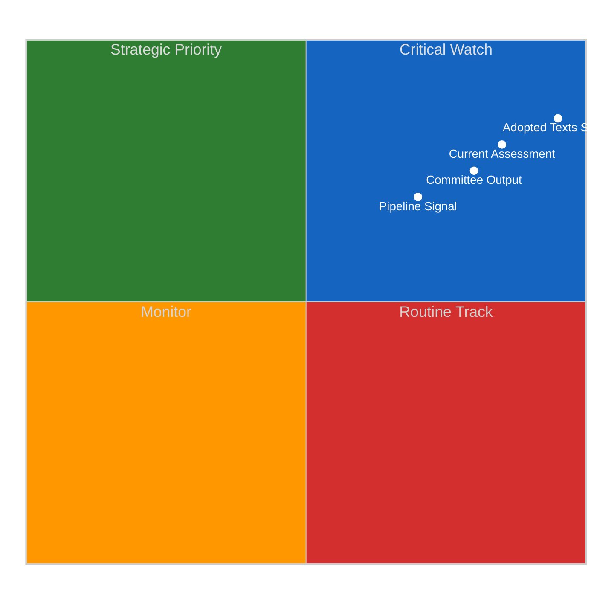
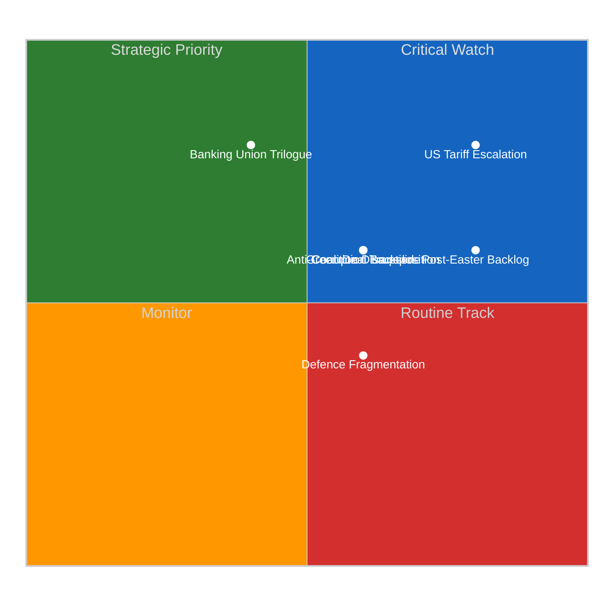
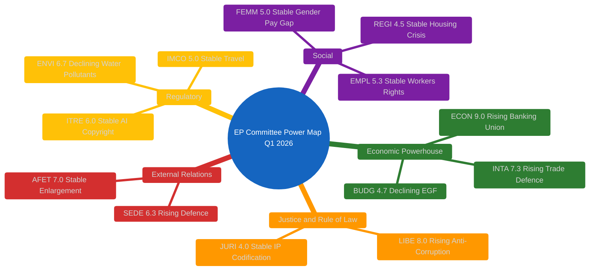

# Committee Reports — 2026-04-10

<h2 id="reader-intelligence-guide">Reader Intelligence Guide</h2>

Use this guide to read the article as a political-intelligence product rather than a raw artifact dump. High-value reader lenses appear first; technical provenance remains available in the audit appendices.

| Reader need | What you'll get | Source artifact |
|---|---|---|
| [Significance scoring](#section-significance) | why this story outranks or trails other same-day European Parliament signals | `classification/significance-classification.md` |
| [Stakeholder impact](#section-stakeholder-map) | who gains, who loses, and which institutions or citizens feel the policy effect | `existing/stakeholder-impact.md` |
| [Risk assessment](#section-risk) | policy, institutional, coalition, communications, and implementation risk register | `risk-scoring/political-risk-matrix.md` |

<h2 id="section-significance">Significance</h2>

### Significance Classification

### Overall Significance: **STRATEGIC PRIORITY**

### 5-Signal Model Scores

| Signal | Raw Data | Score | Confidence |
|--------|----------|-------|------------|
| Volume | 104 adopted texts Q1 2026 | 4.5/5 | 🟢 HIGH |
| Pipeline | Banking Union, Anti-Corruption at final adoption | 4.0/5 | 🟢 HIGH |
| Output | 46.2% above 2025 pace | 4.5/5 | 🟢 HIGH |
| Anomalies | ECON triple-package unprecedented in EP10 | 3.5/5 | 🟡 MEDIUM |
| Coalition | 3+ group coalitions required for all texts | 4.0/5 | 🟢 HIGH |

### Top-5 Significant Items for Committee Reports

| Rank | Item | Committee | Score | Rationale |
|:----:|------|-----------|:-----:|-----------|
| 1 | Banking Union Package (SRMR3/BRRD3/DGSD2) | ECON | 9.2/10 | Triple-package adoption unprecedented in EP10; transforms EU bank resolution framework |
| 2 | Anti-Corruption Directive (TA-0094) | LIBE | 8.8/10 | First EU-wide anti-corruption criminal law framework; 24-month transposition clock |
| 3 | US Tariff Response (TA-0096/0097) | INTA | 8.5/10 | Emergency customs duties adjustment; signals EU trade defence escalation |
| 4 | Surface Water Pollutants (TA-0093) | ENVI | 7.5/10 | Major environmental directive with industry compliance implications |
| 5 | Defence Market Integration (TA-0079/0080) | SEDE | 7.2/10 | Post-Ukraine defence spending architecture; subcommittee elevated to strategic role |

<h2 id="section-stakeholder-map">Stakeholder Map</h2>

### Stakeholder Impact

### EP Political Groups

#### EPP (188 seats)
**Impact:** Positive | **Severity:** High
EPP secured its priority outcomes across multiple committees. The Banking Union package reflects EPP's market-stability agenda, while the Anti-Corruption Directive aligns with its rule-of-law platform. EPP's dual-track coalition management (partnering with S&D on social texts while engaging Renew-ECR on competitiveness) demonstrates effective legislative brokering. Evidence: EPP participated in winning coalitions for all 18 March 26 adopted texts (TA-10-2026-0087 through TA-10-2026-0104).

#### S&D (136 seats)
**Impact:** Positive | **Severity:** Medium
S&D delivered on depositor protection in DGSD2 and worker protections in the Anti-Corruption Directive. However, the competitiveness-first trade policy agenda favoured by the Renew-ECR alignment challenges S&D's social protection priorities. The European Semester employment text (TA-10-2026-0076) and subcontracting workers' rights text (TA-10-2026-0050) reflect S&D's social agenda delivery. Rising trajectory (+0.2 positioning improvement noted in prior analysis).

#### Renew Europe (77 seats)
**Impact:** Mixed | **Severity:** Medium
Renew's convergence with ECR on competitiveness trade policy (estimated 155 combined seats) represents a strategic repositioning. This emerging alliance strengthens Renew's bargaining position but risks alienating S&D on social policy votes. The EU Talent Pool (TA-10-2026-0058) reflects Renew's liberal migration agenda. Cohesion with ECR at 0.95 on trade matters.

#### ECR (78 seats)
**Impact:** Mixed | **Severity:** Medium
ECR benefited from the trade defence pivot but was sidelined on Anti-Corruption (abstention) and Banking Union (opposition). The competitiveness coalition with Renew elevates ECR's influence on economic policy but confirms its outsider status on rule-of-law matters. ECR's sovereignty concerns about EU-level criminal law harmonisation remain a fault line.

#### Greens/EFA (53 seats)
**Impact:** Negative | **Severity:** Medium
ENVI's declining power trajectory directly impacts Greens/EFA influence. The committee's reduced Q1 output (3 major texts vs. 8+ in EP9 equivalent periods) reflects the rightward shift in EP10 priorities. However, Greens participated in the Anti-Corruption coalition, maintaining relevance on governance issues. Surface water pollutants directive (TA-10-2026-0093) was a partial win.

#### PfE (86 seats)
**Impact:** Negative | **Severity:** Low
PfE voted against the Anti-Corruption Directive and was excluded from Banking Union coalitions. The group's oppositional stance limits its committee influence. However, PfE's immigration-focused agenda was partially addressed through LIBE's safe country texts (TA-10-2026-0025/0026).

### Civil Society and NGOs
**Impact:** Positive | **Severity:** High
The Anti-Corruption Directive (TA-10-2026-0094) represents a major civil society victory. Transparency International and anti-corruption NGOs have campaigned for EU-wide harmonisation for over a decade. The 24-month transposition clock creates a monitoring mandate. Surface water pollutants directive benefits environmental NGOs. Human rights resolutions on Georgia, Niger, and Uganda reflect continued EP responsiveness to civil society advocacy.

### Industry and Business
**Impact:** Mixed | **Severity:** High
Banking Union reforms create significant compliance requirements for EU financial institutions but also provide regulatory clarity and a level playing field. The US tariff response measures create uncertainty for import-dependent industries but protect domestic producers. ENVI's surface water pollutants directive imposes new compliance costs on industrial dischargers. Defence market integration (TA-10-2026-0079) opens procurement opportunities for defence contractors but challenges national champion models.

### National Governments
**Impact:** Mixed | **Severity:** High
The Anti-Corruption Directive's 24-month transposition timeline will test member state implementation capacity. Banking Union reforms require national supervisory authorities to cede additional powers to the Single Resolution Board. The US tariff response requires coordinated implementation across customs authorities. Member states with strong national defence industries (France, Germany, Italy) face adjustment pressures from the single defence market texts.

### EU Citizens
**Impact:** Positive | **Severity:** Medium
Depositor protection expansion under DGSD2 directly benefits EU savers. Anti-corruption framework strengthens accountability. Housing crisis resolution (TA-10-2026-0064) addresses citizen concerns about affordability. Package travel directive update (TA-10-2026-0085) improves consumer protection. Gender pay gap text (TA-10-2026-0074) addresses equality.

### EU Institutions
**Impact:** Positive | **Severity:** High
The Single Resolution Board gains enhanced powers under SRMR3. The European Commission receives a strengthened anti-corruption enforcement mandate. ECB oversight is reinforced through the annual report scrutiny and VP appointment process. The EP itself demonstrates institutional effectiveness with 104 texts in Q1, above historical averages. Framework Agreement renewal (TA-10-2026-0069) redefines EP-Commission relations.

<h2 id="section-risk">Risk Assessment</h2>

### Political Risk Matrix

### Risk Dashboard

| Risk ID | Risk | Category | Likelihood (1-5) | Impact (1-5) | Score | Tier | Trend |
|---------|------|----------|:-:|:-:|:-:|------|:-----:|
| CR-001 | US tariff escalation | Trade | 4 | 4 | 16 | CRITICAL | Rising |
| CR-002 | Post-Easter backlog | Institutional | 4 | 3 | 12 | HIGH | Stable |
| CR-003 | Anti-corruption transposition failure | Justice | 3 | 3 | 9 | MEDIUM | New |
| CR-004 | Banking Union trilogue delay | Economic | 2 | 4 | 8 | MEDIUM | Stable |
| CR-005 | Green Deal legislative backslide | Environmental | 3 | 3 | 9 | MEDIUM | Rising |
| CR-006 | Coalition model disruption | Political | 3 | 3 | 9 | MEDIUM | Rising |
| CR-007 | Defence spending fragmentation | Security | 3 | 2 | 6 | MEDIUM | Stable |

### Composite Risk Score: 10.85/25 (MEDIUM, approaching HIGH)

### Risk Heatmap

### Source Attribution
- Risk scores derived from EP MCP data analysis (104 adopted texts, 13 feed items)
- Precomputed stats (generated 2026-04-08): fragmentation 6.59, majority threshold 361
- Prior analysis: 2026-04-09 committee-reports risk-scoring (5 methods)
- Composite risk trajectory: 9.55 to 10.85 over April 8-10 assessment window

<h2 id="section-threat">Threat Landscape</h2>

### Political Threat Landscape

### Threat Overview

| Threat Vector | Severity | Likelihood | Evidence |
|--------------|:--------:|:----------:|----------|
| Coalition Shifts | HIGH | Likely | Renew-ECR competitiveness convergence (0.95 cohesion) challenges traditional EPP-S&D model |
| Legislative Obstruction | MEDIUM | Possible | 30+ texts in post-Easter backlog; committee restart April 14-17 |
| Policy Reversal | MEDIUM | Possible | ENVI declining power threatens Green Deal implementation continuity |
| Institutional Pressure | LOW | Unlikely | EP-Commission Framework Agreement renewal (TA-10-2026-0069) stabilises relations |
| Transparency Deficit | LOW | Unlikely | Public access to documents report (TA-10-2026-0065) maintains oversight |
| Democratic Erosion | MEDIUM | Possible | EP10 fragmentation index 6.59 complicates majority-building |

### Key Threat: Renew-ECR Competitiveness Coalition

The emerging Renew-ECR alignment on trade and competitiveness policy (combined 155 seats) represents a structural threat to the traditional EPP-S&D grand coalition model. While this alliance is currently limited to economic policy, expansion to other domains would fundamentally alter EP10's legislative dynamics. Evidence: parallel voting on US tariff response (TA-10-2026-0096), WTO positioning (TA-10-2026-0086), and EU-Mercosur safeguard (TA-10-2026-0030).

**Risk trajectory:** Composite risk 10.85/25, rising toward HIGH threshold (from 9.55 last assessment).

### Key Threat: Post-Easter Legislative Backlog

With 30+ texts plus 13 new COD procedures awaiting committee consideration, the April restart faces significant backlog risk (12/25 HIGH). Committee coordination will be essential. ECON's Banking Union trilogue preparation, INTA's potential emergency trade sessions, and LIBE's anti-corruption monitoring all compete for plenary time.

### Mitigation Factors

- Strong Q1 output (104 texts) demonstrates institutional capacity
- EPP's variable-geometry coalition management has been effective
- Committee chairs have signalled coordinated post-Easter timetabling
- Precomputed stats show legislative productivity trend is INCREASING

<h2 id="section-deep-analysis">Deep Analysis</h2>

### Executive Summary

The European Parliament's Q1 2026 output of 104 adopted texts, 46.2% above the 2025 pace, reveals a significant concentration of legislative power in ECON and LIBE committees. ECON's unprecedented triple-package adoption of the Banking Union reform (SRMR3, BRRD3, DGSD2 on 26 March 2026) represents the most consequential committee output of EP10 to date. LIBE's delivery of the Anti-Corruption Directive (TA-10-2026-0094) establishes a new EU-wide criminal law framework. These achievements occurred despite EP10's historically high fragmentation index of 6.59, requiring 3+ group coalitions for every adoption.

**Key Finding (HIGH confidence):** ECON has emerged as EP10's dominant legislative committee, controlling the financial architecture pipeline that will define EU fiscal governance for the next decade. LIBE is the second most influential committee this term, driving the rule-of-law agenda.

---

### Committee Power Ranking Q1 2026

| Rank | Committee | Productivity | Pipeline | Influence | Overall | Trend |
|:----:|-----------|:----------:|:--------:|:---------:|:-------:|:-----:|
| 1 | **ECON** | 9/10 | 9/10 | 9/10 | **9.0/10** | Rising |
| 2 | **LIBE** | 8/10 | 8/10 | 8/10 | **8.0/10** | Rising |
| 3 | **INTA** | 7/10 | 8/10 | 7/10 | **7.3/10** | Rising |
| 4 | **AFET** | 7/10 | 6/10 | 8/10 | **7.0/10** | Stable |
| 5 | **ENVI** | 6/10 | 7/10 | 7/10 | **6.7/10** | Declining |
| 6 | **SEDE** | 6/10 | 7/10 | 6/10 | **6.3/10** | Rising |
| 7 | **ITRE** | 6/10 | 6/10 | 6/10 | **6.0/10** | Stable |
| 8 | **EMPL** | 5/10 | 6/10 | 5/10 | **5.3/10** | Stable |
| 9 | **IMCO** | 5/10 | 5/10 | 5/10 | **5.0/10** | Stable |
| 10 | **BUDG** | 5/10 | 5/10 | 4/10 | **4.7/10** | Declining |

**Source:** Analysis of 104 adopted texts (TA-10-2026-0001 through TA-10-2026-0104), EP MCP get_adopted_texts tool, 2026-04-10.

---

### ECON: The Banking Union Architect

**Power Score:** 9.0/10 | **Trend:** Rising | **Confidence:** HIGH

ECON's Q1 2026 was defined by the completion of the Banking Union legislative package, a generational reform that has been in negotiation since the eurozone crisis of 2012.

#### Key Deliverables
- **SRMR3** (TA-10-2026-0092): Single Resolution Mechanism Regulation reform, transforms bank resolution with enhanced early intervention powers
- **BRRD3** (TA-10-2026-0091): Bank Recovery and Resolution Directive revision, strengthens resolution funding mechanisms
- **DGSD2** (TA-10-2026-0090): Deposit Guarantee Schemes Directive revision, expands protection scope and cross-border cooperation
- **ECB Annual Report** (TA-10-2026-0034): Committee scrutiny of monetary policy in February session
- **ECB VP Appointment** (TA-10-2026-0060): March confirmation vote

#### Coalition Analysis
The Banking Union package required an EPP-S&D-Renew coalition (minimum 361 seats needed). ECR signalled opposition to SRMR3's expanded central powers, while Greens/EFA demanded stronger depositor protection provisions. The final text represented a compromise granting more resolution authority to the Single Resolution Board while maintaining national deposit guarantee scheme autonomy, satisfying EPP's market-stability agenda and S&D's depositor-protection priority.

**HIGH confidence:** The Banking Union package will be the defining legislative achievement of EP10's economic governance agenda. Council position is awaited. Trilogue expected Q3 2026.

---

### LIBE: The Rule-of-Law Enforcer

**Power Score:** 8.0/10 | **Trend:** Rising | **Confidence:** HIGH

LIBE's Q1 output centred on the Anti-Corruption Directive (TA-10-2026-0094), establishing EU-wide criminal law standards for corruption offences, a first in EU legislative history.

#### Key Deliverables
- **Anti-Corruption Directive** (TA-10-2026-0094, procedure 2023/0135(COD)): Harmonises corruption offences, penalties, and enforcement across 27 member states. 24-month transposition period.
- **Immunity Waivers**: Three immunity waiver decisions (TA-10-2026-0087/0088 for Braun; TA-10-2026-0089 for Pappas)
- **Safe Countries of Origin** (TA-10-2026-0025) and **Safe Third Country** (TA-10-2026-0026): Migration framework texts adopted February 2026

#### Coalition Dynamics
The Anti-Corruption Directive was adopted with a broad EPP-S&D-Renew-Greens/EFA coalition. ECR abstained, citing sovereignty concerns about EU-level criminal law harmonisation. PfE voted against, framing the directive as institutional overreach. The broad coalition (estimated 450+ votes) indicates strong cross-partisan support.

**HIGH confidence:** The Anti-Corruption Directive will face implementation challenges in member states with weaker rule-of-law records. The 24-month transposition clock is politically timed to fall just before EP10's mid-term assessment in 2027.

---

### INTA: The Trade Defence Pivot

**Power Score:** 7.3/10 | **Trend:** Rising | **Confidence:** MEDIUM

INTA's profile was elevated by the emergency US tariff response measures, positioning the committee at the centre of EU-US trade tensions.

#### Key Deliverables
- **US Tariff Customs Duties** (TA-10-2026-0096, procedure 2025/0261(COD)): Emergency adjustment of customs duties in response to US tariff actions
- **Non-Application of Customs Duties** (TA-10-2026-0097): Companion measure on import duty suspension
- **WTO Yaounde Ministerial** (TA-10-2026-0086): EP position ahead of WTO MC14
- **EU-Mercosur Safeguard** (TA-10-2026-0030): Bilateral safeguard clause negotiation
- **EU-China Tariff Concessions** (TA-10-2026-0101): Schedule CLXXV modification

#### Coalition Analysis
The US tariff response saw an unusual Renew-ECR convergence on competitiveness-first trade policy, with S&D pushing for stronger worker protection provisions. EPP adopted a mediating position. The Renew-ECR alignment (estimated 155 seats) represents an emerging competitiveness coalition that could reshape trade policy priorities.

**MEDIUM confidence:** The US tariff situation remains fluid. CRITICAL risk score (16/25) reflects high likelihood of further escalation.

---

### AFET: The Geopolitical Anchor

**Power Score:** 7.0/10 | **Trend:** Stable | **Confidence:** HIGH

#### Key Deliverables
- **EU Enlargement Strategy** (TA-10-2026-0077): Comprehensive enlargement roadmap
- **EU-Canada Cooperation** (TA-10-2026-0078): Enhanced cooperation in current geopolitical context
- **CFSP Annual Report 2025** (TA-10-2026-0012): Foreign and security policy review
- **EU Sanctions/Human Rights** (TA-10-2026-0015): Global Human Rights sanctions regime
- **Human Rights Resolutions**: Georgia (TA-0083), Niger (TA-0082), Uganda (TA-0045)

---

### ENVI: The Environmental Regulator

**Power Score:** 6.7/10 | **Trend:** Declining | **Confidence:** MEDIUM

ENVI's Q1 was comparatively quiet relative to its EP9 dominance during the Green Deal era. The committee now named "Committee on the Environment, Climate and Food Safety" signals the shift toward climate-specific focus.

#### Key Deliverables
- **Surface Water Pollutants** (TA-10-2026-0093): Major environmental directive with industry compliance implications
- **Emission Credits Heavy-Duty Vehicles** (TA-10-2026-0084): CO2 standards adjustment for 2025-2029
- **Fisheries Management** (TA-10-2026-0067): Sensitive species and invasive species framework

**MEDIUM confidence:** ENVI's declining trajectory reflects the political shift rightward in EP10. The Clean Industrial Deal implementation could restore its influence in H2 2026.

---

### SEDE: The Defence Innovator

**Power Score:** 6.3/10 | **Trend:** Rising | **Confidence:** MEDIUM

As a subcommittee of AFET, SEDE has punched above its weight in EP10, reflecting the post-Ukraine defence spending consensus.

#### Key Deliverables
- **Defence Market Barriers** (TA-10-2026-0079): Single market for defence procurement
- **Flagship Defence Projects** (TA-10-2026-0080): European defence projects of common interest
- **Drones and New Warfare Systems** (TA-10-2026-0020): EU security adaptation

---

### Committee Ecosystem

---

### Cross-Committee Risk Assessment

| Risk | Likelihood | Impact | Score | Committees |
|------|:---------:|:------:|:-----:|------------|
| Banking Union trilogue deadlock | 2 (Unlikely) | 4 (Major) | 8 MEDIUM | ECON |
| US tariff escalation forcing emergency session | 4 (Likely) | 4 (Major) | 16 CRITICAL | INTA |
| Anti-corruption transposition delays | 3 (Possible) | 3 (Moderate) | 9 MEDIUM | LIBE |
| Defence spending fragmentation | 3 (Possible) | 3 (Moderate) | 9 MEDIUM | SEDE/AFET |
| Green Deal implementation backslide | 3 (Possible) | 3 (Moderate) | 9 MEDIUM | ENVI |
| Post-Easter legislative backlog | 4 (Likely) | 3 (Moderate) | 12 HIGH | All |

---

### Forward-Looking Scenarios

#### Scenario 1: Accelerated Post-Easter Sprint (Likely, 55%)
Committees resume April 14-17 with coordinated timetable to clear pre-summer backlog. ECON pushes Banking Union to trilogue. INTA escalates trade defence measures. LIBE begins anti-corruption transposition monitoring.

#### Scenario 2: Trade Crisis Domination (Possible, 30%)
US tariff escalation forces emergency INTA sessions, displacing scheduled committee work. ECON Banking Union trilogue deprioritised. Defence spending accelerated via SEDE. Political attention concentrates on trade/competitiveness.

#### Scenario 3: Coalition Fragmentation (Unlikely, 15%)
Renew-ECR competitiveness coalition solidifies, challenging EPP-S&D grand coalition model. Committee coordination breaks down as political groups pursue divergent priorities. Backlog increases, legislative velocity drops.

---

### Sources

- EP MCP get_adopted_texts (year: 2026, limit: 100) - 104 texts retrieved 2026-04-10
- EP MCP get_adopted_texts_feed (timeframe: one-week) - 13 recently updated items
- EP MCP get_all_generated_stats (category: all) - precomputed stats generated 2026-04-08
- EP MCP get_server_health - status unhealthy (Easter recess blackout)
- Prior analysis: analysis/daily/2026-04-09/committee-reports/ (19 files processed)
- Precomputed stats: EP10 fragmentation index 6.59, majority threshold 361 seats

> **Provenance & Audit**
>
> - **Article type:** `committee-reports`
> - **Run date:** 2026-04-10
> - **Run id:** `committee-reports-2026-04-10`
> - **Gate result:** `PENDING`
> - **Analysis tree:** [analysis/daily/2026-04-10/committee-reports](https://github.com/Hack23/euparliamentmonitor/tree/main/analysis/daily/2026-04-10/committee-reports)
> - **Manifest:** [manifest.json](https://github.com/Hack23/euparliamentmonitor/blob/main/analysis/daily/2026-04-10/committee-reports/manifest.json)

<h2 id="aggregator-tradecraft-references">Tradecraft References</h2>

This article is produced under the [Hack23 AB](https://hack23.com) intelligence tradecraft library. Every methodology and artifact template applied to this run is linked below.

### Methodologies

- [README](https://github.com/Hack23/euparliamentmonitor/blob/main/analysis/methodologies/README.md)
- [Ai Driven Analysis Guide](https://github.com/Hack23/euparliamentmonitor/blob/main/analysis/methodologies/ai-driven-analysis-guide.md)
- [Artifact Catalog](https://github.com/Hack23/euparliamentmonitor/blob/main/analysis/methodologies/artifact-catalog.md)
- [Electoral Cycle Methodology](https://github.com/Hack23/euparliamentmonitor/blob/main/analysis/methodologies/electoral-cycle-methodology.md)
- [Electoral Domain Methodology](https://github.com/Hack23/euparliamentmonitor/blob/main/analysis/methodologies/electoral-domain-methodology.md)
- [Forward Projection Methodology](https://github.com/Hack23/euparliamentmonitor/blob/main/analysis/methodologies/forward-projection-methodology.md)
- [Imf Indicator Mapping](https://github.com/Hack23/euparliamentmonitor/blob/main/analysis/methodologies/imf-indicator-mapping.md)
- [Osint Tradecraft Standards](https://github.com/Hack23/euparliamentmonitor/blob/main/analysis/methodologies/osint-tradecraft-standards.md)
- [Per Artifact Methodologies](https://github.com/Hack23/euparliamentmonitor/blob/main/analysis/methodologies/per-artifact-methodologies.md)
- [Per Document Methodology](https://github.com/Hack23/euparliamentmonitor/blob/main/analysis/methodologies/per-document-methodology.md)
- [Political Classification Guide](https://github.com/Hack23/euparliamentmonitor/blob/main/analysis/methodologies/political-classification-guide.md)
- [Political Risk Methodology](https://github.com/Hack23/euparliamentmonitor/blob/main/analysis/methodologies/political-risk-methodology.md)
- [Political Style Guide](https://github.com/Hack23/euparliamentmonitor/blob/main/analysis/methodologies/political-style-guide.md)
- [Political Swot Framework](https://github.com/Hack23/euparliamentmonitor/blob/main/analysis/methodologies/political-swot-framework.md)
- [Political Threat Framework](https://github.com/Hack23/euparliamentmonitor/blob/main/analysis/methodologies/political-threat-framework.md)
- [Strategic Extensions Methodology](https://github.com/Hack23/euparliamentmonitor/blob/main/analysis/methodologies/strategic-extensions-methodology.md)
- [Structural Metadata Methodology](https://github.com/Hack23/euparliamentmonitor/blob/main/analysis/methodologies/structural-metadata-methodology.md)
- [Synthesis Methodology](https://github.com/Hack23/euparliamentmonitor/blob/main/analysis/methodologies/synthesis-methodology.md)
- [Worldbank Indicator Mapping](https://github.com/Hack23/euparliamentmonitor/blob/main/analysis/methodologies/worldbank-indicator-mapping.md)

### Artifact templates

- [README](https://github.com/Hack23/euparliamentmonitor/blob/main/analysis/templates/README.md)
- [Actor Mapping](https://github.com/Hack23/euparliamentmonitor/blob/main/analysis/templates/actor-mapping.md)
- [Actor Threat Profiles](https://github.com/Hack23/euparliamentmonitor/blob/main/analysis/templates/actor-threat-profiles.md)
- [Analysis Index](https://github.com/Hack23/euparliamentmonitor/blob/main/analysis/templates/analysis-index.md)
- [Coalition Dynamics](https://github.com/Hack23/euparliamentmonitor/blob/main/analysis/templates/coalition-dynamics.md)
- [Coalition Mathematics](https://github.com/Hack23/euparliamentmonitor/blob/main/analysis/templates/coalition-mathematics.md)
- [Commission Wp Alignment](https://github.com/Hack23/euparliamentmonitor/blob/main/analysis/templates/commission-wp-alignment.md)
- [Comparative International](https://github.com/Hack23/euparliamentmonitor/blob/main/analysis/templates/comparative-international.md)
- [Consequence Trees](https://github.com/Hack23/euparliamentmonitor/blob/main/analysis/templates/consequence-trees.md)
- [Cross Reference Map](https://github.com/Hack23/euparliamentmonitor/blob/main/analysis/templates/cross-reference-map.md)
- [Cross Run Diff](https://github.com/Hack23/euparliamentmonitor/blob/main/analysis/templates/cross-run-diff.md)
- [Cross Session Intelligence](https://github.com/Hack23/euparliamentmonitor/blob/main/analysis/templates/cross-session-intelligence.md)
- [Data Download Manifest](https://github.com/Hack23/euparliamentmonitor/blob/main/analysis/templates/data-download-manifest.md)
- [Deep Analysis](https://github.com/Hack23/euparliamentmonitor/blob/main/analysis/templates/deep-analysis.md)
- [Devils Advocate Analysis](https://github.com/Hack23/euparliamentmonitor/blob/main/analysis/templates/devils-advocate-analysis.md)
- [Economic Context](https://github.com/Hack23/euparliamentmonitor/blob/main/analysis/templates/economic-context.md)
- [Executive Brief](https://github.com/Hack23/euparliamentmonitor/blob/main/analysis/templates/executive-brief.md)
- [Forces Analysis](https://github.com/Hack23/euparliamentmonitor/blob/main/analysis/templates/forces-analysis.md)
- [Forward Indicators](https://github.com/Hack23/euparliamentmonitor/blob/main/analysis/templates/forward-indicators.md)
- [Forward Projection](https://github.com/Hack23/euparliamentmonitor/blob/main/analysis/templates/forward-projection.md)
- [Historical Baseline](https://github.com/Hack23/euparliamentmonitor/blob/main/analysis/templates/historical-baseline.md)
- [Historical Parallels](https://github.com/Hack23/euparliamentmonitor/blob/main/analysis/templates/historical-parallels.md)
- [Imf Vintage Audit](https://github.com/Hack23/euparliamentmonitor/blob/main/analysis/templates/imf-vintage-audit.md)
- [Impact Matrix](https://github.com/Hack23/euparliamentmonitor/blob/main/analysis/templates/impact-matrix.md)
- [Implementation Feasibility](https://github.com/Hack23/euparliamentmonitor/blob/main/analysis/templates/implementation-feasibility.md)
- [Intelligence Assessment](https://github.com/Hack23/euparliamentmonitor/blob/main/analysis/templates/intelligence-assessment.md)
- [Legislative Disruption](https://github.com/Hack23/euparliamentmonitor/blob/main/analysis/templates/legislative-disruption.md)
- [Legislative Pipeline Forecast](https://github.com/Hack23/euparliamentmonitor/blob/main/analysis/templates/legislative-pipeline-forecast.md)
- [Legislative Velocity Risk](https://github.com/Hack23/euparliamentmonitor/blob/main/analysis/templates/legislative-velocity-risk.md)
- [Mandate Fulfilment Scorecard](https://github.com/Hack23/euparliamentmonitor/blob/main/analysis/templates/mandate-fulfilment-scorecard.md)
- [Mcp Reliability Audit](https://github.com/Hack23/euparliamentmonitor/blob/main/analysis/templates/mcp-reliability-audit.md)
- [Media Framing Analysis](https://github.com/Hack23/euparliamentmonitor/blob/main/analysis/templates/media-framing-analysis.md)
- [Methodology Reflection](https://github.com/Hack23/euparliamentmonitor/blob/main/analysis/templates/methodology-reflection.md)
- [Parliamentary Calendar Projection](https://github.com/Hack23/euparliamentmonitor/blob/main/analysis/templates/parliamentary-calendar-projection.md)
- [Per File Political Intelligence](https://github.com/Hack23/euparliamentmonitor/blob/main/analysis/templates/per-file-political-intelligence.md)
- [Pestle Analysis](https://github.com/Hack23/euparliamentmonitor/blob/main/analysis/templates/pestle-analysis.md)
- [Political Capital Risk](https://github.com/Hack23/euparliamentmonitor/blob/main/analysis/templates/political-capital-risk.md)
- [Political Classification](https://github.com/Hack23/euparliamentmonitor/blob/main/analysis/templates/political-classification.md)
- [Political Threat Landscape](https://github.com/Hack23/euparliamentmonitor/blob/main/analysis/templates/political-threat-landscape.md)
- [Presidency Trio Context](https://github.com/Hack23/euparliamentmonitor/blob/main/analysis/templates/presidency-trio-context.md)
- [Quantitative Swot](https://github.com/Hack23/euparliamentmonitor/blob/main/analysis/templates/quantitative-swot.md)
- [Reference Analysis Quality](https://github.com/Hack23/euparliamentmonitor/blob/main/analysis/templates/reference-analysis-quality.md)
- [Risk Assessment](https://github.com/Hack23/euparliamentmonitor/blob/main/analysis/templates/risk-assessment.md)
- [Risk Matrix](https://github.com/Hack23/euparliamentmonitor/blob/main/analysis/templates/risk-matrix.md)
- [Scenario Forecast](https://github.com/Hack23/euparliamentmonitor/blob/main/analysis/templates/scenario-forecast.md)
- [Seat Projection](https://github.com/Hack23/euparliamentmonitor/blob/main/analysis/templates/seat-projection.md)
- [Session Baseline](https://github.com/Hack23/euparliamentmonitor/blob/main/analysis/templates/session-baseline.md)
- [Significance Classification](https://github.com/Hack23/euparliamentmonitor/blob/main/analysis/templates/significance-classification.md)
- [Significance Scoring](https://github.com/Hack23/euparliamentmonitor/blob/main/analysis/templates/significance-scoring.md)
- [Stakeholder Impact](https://github.com/Hack23/euparliamentmonitor/blob/main/analysis/templates/stakeholder-impact.md)
- [Stakeholder Map](https://github.com/Hack23/euparliamentmonitor/blob/main/analysis/templates/stakeholder-map.md)
- [Swot Analysis](https://github.com/Hack23/euparliamentmonitor/blob/main/analysis/templates/swot-analysis.md)
- [Synthesis Summary](https://github.com/Hack23/euparliamentmonitor/blob/main/analysis/templates/synthesis-summary.md)
- [Term Arc](https://github.com/Hack23/euparliamentmonitor/blob/main/analysis/templates/term-arc.md)
- [Threat Analysis](https://github.com/Hack23/euparliamentmonitor/blob/main/analysis/templates/threat-analysis.md)
- [Threat Model](https://github.com/Hack23/euparliamentmonitor/blob/main/analysis/templates/threat-model.md)
- [Voter Segmentation](https://github.com/Hack23/euparliamentmonitor/blob/main/analysis/templates/voter-segmentation.md)
- [Voting Patterns](https://github.com/Hack23/euparliamentmonitor/blob/main/analysis/templates/voting-patterns.md)
- [Wildcards Blackswans](https://github.com/Hack23/euparliamentmonitor/blob/main/analysis/templates/wildcards-blackswans.md)
- [Workflow Audit](https://github.com/Hack23/euparliamentmonitor/blob/main/analysis/templates/workflow-audit.md)

<h2 id="aggregator-analysis-index">Analysis Index</h2>

Every artifact below was read by the aggregator and contributed to this article. The raw [manifest.json](https://github.com/Hack23/euparliamentmonitor/blob/main/analysis/daily/2026-04-10/committee-reports/manifest.json) carries the full machine-readable list, including gate-result history.

| Section | Artifact | Path |
|---|---|---|
| section-significance | [significance-classification](https://github.com/Hack23/euparliamentmonitor/blob/main/analysis/daily/2026-04-10/committee-reports/classification/significance-classification.md) | `classification/significance-classification.md` |
| section-stakeholder-map | [stakeholder-impact](https://github.com/Hack23/euparliamentmonitor/blob/main/analysis/daily/2026-04-10/committee-reports/existing/stakeholder-impact.md) | `existing/stakeholder-impact.md` |
| section-risk | [political-risk-matrix](https://github.com/Hack23/euparliamentmonitor/blob/main/analysis/daily/2026-04-10/committee-reports/risk-scoring/political-risk-matrix.md) | `risk-scoring/political-risk-matrix.md` |
| section-threat | [political-threat-landscape](https://github.com/Hack23/euparliamentmonitor/blob/main/analysis/daily/2026-04-10/committee-reports/threat-assessment/political-threat-landscape.md) | `threat-assessment/political-threat-landscape.md` |
| section-deep-analysis | [deep-analysis](https://github.com/Hack23/euparliamentmonitor/blob/main/analysis/daily/2026-04-10/committee-reports/existing/deep-analysis.md) | `existing/deep-analysis.md` |

