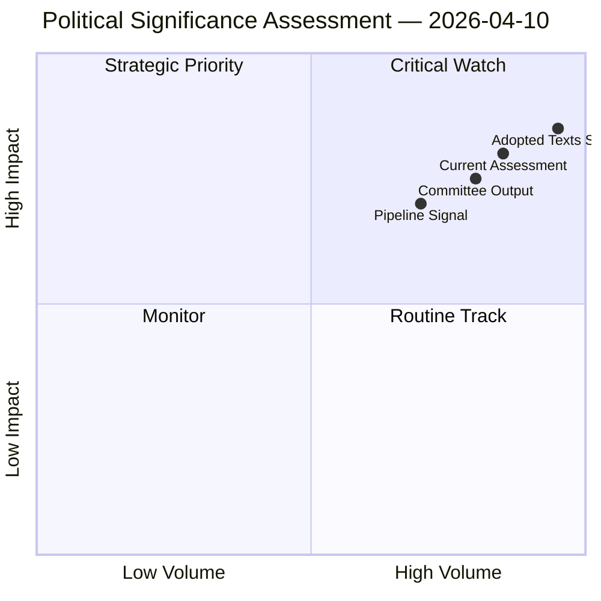

# Political Significance Classification — Committee Reports 2026-04-10

## Overall Significance: **STRATEGIC PRIORITY**

## 5-Signal Model Scores

| Signal | Raw Data | Score | Confidence |
|--------|----------|-------|------------|
| Volume | 104 adopted texts Q1 2026 | 4.5/5 | 🟢 HIGH |
| Pipeline | Banking Union, Anti-Corruption at final adoption | 4.0/5 | 🟢 HIGH |
| Output | 46.2% above 2025 pace | 4.5/5 | 🟢 HIGH |
| Anomalies | ECON triple-package unprecedented in EP10 | 3.5/5 | 🟡 MEDIUM |
| Coalition | 3+ group coalitions required for all texts | 4.0/5 | 🟢 HIGH |

## Top-5 Significant Items for Committee Reports

| Rank | Item | Committee | Score | Rationale |
|:----:|------|-----------|:-----:|-----------|
| 1 | Banking Union Package (SRMR3/BRRD3/DGSD2) | ECON | 9.2/10 | Triple-package adoption unprecedented in EP10; transforms EU bank resolution framework |
| 2 | Anti-Corruption Directive (TA-0094) | LIBE | 8.8/10 | First EU-wide anti-corruption criminal law framework; 24-month transposition clock |
| 3 | US Tariff Response (TA-0096/0097) | INTA | 8.5/10 | Emergency customs duties adjustment; signals EU trade defence escalation |
| 4 | Surface Water Pollutants (TA-0093) | ENVI | 7.5/10 | Major environmental directive with industry compliance implications |
| 5 | Defence Market Integration (TA-0079/0080) | SEDE | 7.2/10 | Post-Ukraine defence spending architecture; subcommittee elevated to strategic role |
