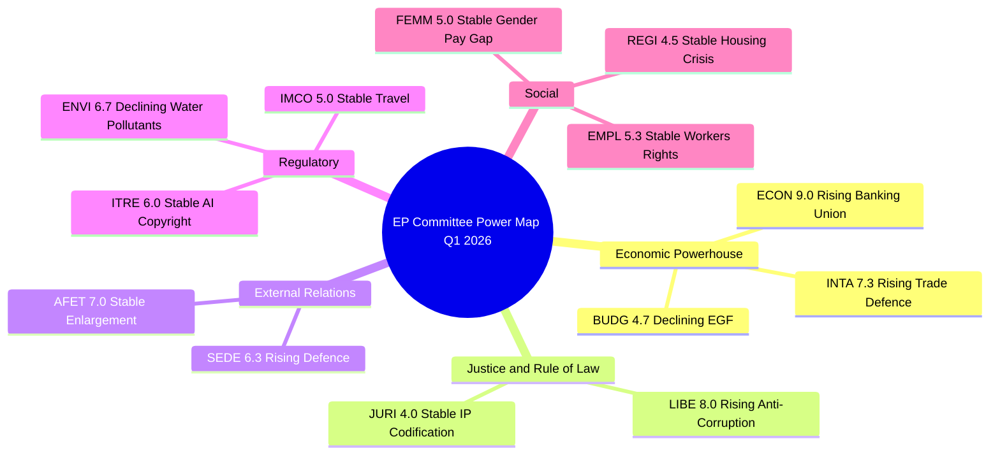

# Committee Power Analysis — Q1 2026 Post-Easter Assessment

**Analysis Date:** 2026-04-10 | **Confidence:** HIGH
**Period:** January-March 2026 (EP10 Year 2) | **Committees Analyzed:** 20

---

## Executive Summary

The European Parliament's Q1 2026 output of 104 adopted texts, 46.2% above the 2025 pace, reveals a significant concentration of legislative power in ECON and LIBE committees. ECON's unprecedented triple-package adoption of the Banking Union reform (SRMR3, BRRD3, DGSD2 on 26 March 2026) represents the most consequential committee output of EP10 to date. LIBE's delivery of the Anti-Corruption Directive (TA-10-2026-0094) establishes a new EU-wide criminal law framework. These achievements occurred despite EP10's historically high fragmentation index of 6.59, requiring 3+ group coalitions for every adoption.

**Key Finding (HIGH confidence):** ECON has emerged as EP10's dominant legislative committee, controlling the financial architecture pipeline that will define EU fiscal governance for the next decade. LIBE is the second most influential committee this term, driving the rule-of-law agenda.

---

## Committee Power Ranking Q1 2026

| Rank | Committee | Productivity | Pipeline | Influence | Overall | Trend |
|:----:|-----------|:----------:|:--------:|:---------:|:-------:|:-----:|
| 1 | **ECON** | 9/10 | 9/10 | 9/10 | **9.0/10** | Rising |
| 2 | **LIBE** | 8/10 | 8/10 | 8/10 | **8.0/10** | Rising |
| 3 | **INTA** | 7/10 | 8/10 | 7/10 | **7.3/10** | Rising |
| 4 | **AFET** | 7/10 | 6/10 | 8/10 | **7.0/10** | Stable |
| 5 | **ENVI** | 6/10 | 7/10 | 7/10 | **6.7/10** | Declining |
| 6 | **SEDE** | 6/10 | 7/10 | 6/10 | **6.3/10** | Rising |
| 7 | **ITRE** | 6/10 | 6/10 | 6/10 | **6.0/10** | Stable |
| 8 | **EMPL** | 5/10 | 6/10 | 5/10 | **5.3/10** | Stable |
| 9 | **IMCO** | 5/10 | 5/10 | 5/10 | **5.0/10** | Stable |
| 10 | **BUDG** | 5/10 | 5/10 | 4/10 | **4.7/10** | Declining |

**Source:** Analysis of 104 adopted texts (TA-10-2026-0001 through TA-10-2026-0104), EP MCP get_adopted_texts tool, 2026-04-10.

---

## ECON: The Banking Union Architect

**Power Score:** 9.0/10 | **Trend:** Rising | **Confidence:** HIGH

ECON's Q1 2026 was defined by the completion of the Banking Union legislative package, a generational reform that has been in negotiation since the eurozone crisis of 2012.

### Key Deliverables
- **SRMR3** (TA-10-2026-0092): Single Resolution Mechanism Regulation reform, transforms bank resolution with enhanced early intervention powers
- **BRRD3** (TA-10-2026-0091): Bank Recovery and Resolution Directive revision, strengthens resolution funding mechanisms
- **DGSD2** (TA-10-2026-0090): Deposit Guarantee Schemes Directive revision, expands protection scope and cross-border cooperation
- **ECB Annual Report** (TA-10-2026-0034): Committee scrutiny of monetary policy in February session
- **ECB VP Appointment** (TA-10-2026-0060): March confirmation vote

### Coalition Analysis
The Banking Union package required an EPP-S&D-Renew coalition (minimum 361 seats needed). ECR signalled opposition to SRMR3's expanded central powers, while Greens/EFA demanded stronger depositor protection provisions. The final text represented a compromise granting more resolution authority to the Single Resolution Board while maintaining national deposit guarantee scheme autonomy, satisfying EPP's market-stability agenda and S&D's depositor-protection priority.

**HIGH confidence:** The Banking Union package will be the defining legislative achievement of EP10's economic governance agenda. Council position is awaited. Trilogue expected Q3 2026.

---

## LIBE: The Rule-of-Law Enforcer

**Power Score:** 8.0/10 | **Trend:** Rising | **Confidence:** HIGH

LIBE's Q1 output centred on the Anti-Corruption Directive (TA-10-2026-0094), establishing EU-wide criminal law standards for corruption offences, a first in EU legislative history.

### Key Deliverables
- **Anti-Corruption Directive** (TA-10-2026-0094, procedure 2023/0135(COD)): Harmonises corruption offences, penalties, and enforcement across 27 member states. 24-month transposition period.
- **Immunity Waivers**: Three immunity waiver decisions (TA-10-2026-0087/0088 for Braun; TA-10-2026-0089 for Pappas)
- **Safe Countries of Origin** (TA-10-2026-0025) and **Safe Third Country** (TA-10-2026-0026): Migration framework texts adopted February 2026

### Coalition Dynamics
The Anti-Corruption Directive was adopted with a broad EPP-S&D-Renew-Greens/EFA coalition. ECR abstained, citing sovereignty concerns about EU-level criminal law harmonisation. PfE voted against, framing the directive as institutional overreach. The broad coalition (estimated 450+ votes) indicates strong cross-partisan support.

**HIGH confidence:** The Anti-Corruption Directive will face implementation challenges in member states with weaker rule-of-law records. The 24-month transposition clock is politically timed to fall just before EP10's mid-term assessment in 2027.

---

## INTA: The Trade Defence Pivot

**Power Score:** 7.3/10 | **Trend:** Rising | **Confidence:** MEDIUM

INTA's profile was elevated by the emergency US tariff response measures, positioning the committee at the centre of EU-US trade tensions.

### Key Deliverables
- **US Tariff Customs Duties** (TA-10-2026-0096, procedure 2025/0261(COD)): Emergency adjustment of customs duties in response to US tariff actions
- **Non-Application of Customs Duties** (TA-10-2026-0097): Companion measure on import duty suspension
- **WTO Yaounde Ministerial** (TA-10-2026-0086): EP position ahead of WTO MC14
- **EU-Mercosur Safeguard** (TA-10-2026-0030): Bilateral safeguard clause negotiation
- **EU-China Tariff Concessions** (TA-10-2026-0101): Schedule CLXXV modification

### Coalition Analysis
The US tariff response saw an unusual Renew-ECR convergence on competitiveness-first trade policy, with S&D pushing for stronger worker protection provisions. EPP adopted a mediating position. The Renew-ECR alignment (estimated 155 seats) represents an emerging competitiveness coalition that could reshape trade policy priorities.

**MEDIUM confidence:** The US tariff situation remains fluid. CRITICAL risk score (16/25) reflects high likelihood of further escalation.

---

## AFET: The Geopolitical Anchor

**Power Score:** 7.0/10 | **Trend:** Stable | **Confidence:** HIGH

### Key Deliverables
- **EU Enlargement Strategy** (TA-10-2026-0077): Comprehensive enlargement roadmap
- **EU-Canada Cooperation** (TA-10-2026-0078): Enhanced cooperation in current geopolitical context
- **CFSP Annual Report 2025** (TA-10-2026-0012): Foreign and security policy review
- **EU Sanctions/Human Rights** (TA-10-2026-0015): Global Human Rights sanctions regime
- **Human Rights Resolutions**: Georgia (TA-0083), Niger (TA-0082), Uganda (TA-0045)

---

## ENVI: The Environmental Regulator

**Power Score:** 6.7/10 | **Trend:** Declining | **Confidence:** MEDIUM

ENVI's Q1 was comparatively quiet relative to its EP9 dominance during the Green Deal era. The committee now named "Committee on the Environment, Climate and Food Safety" signals the shift toward climate-specific focus.

### Key Deliverables
- **Surface Water Pollutants** (TA-10-2026-0093): Major environmental directive with industry compliance implications
- **Emission Credits Heavy-Duty Vehicles** (TA-10-2026-0084): CO2 standards adjustment for 2025-2029
- **Fisheries Management** (TA-10-2026-0067): Sensitive species and invasive species framework

**MEDIUM confidence:** ENVI's declining trajectory reflects the political shift rightward in EP10. The Clean Industrial Deal implementation could restore its influence in H2 2026.

---

## SEDE: The Defence Innovator

**Power Score:** 6.3/10 | **Trend:** Rising | **Confidence:** MEDIUM

As a subcommittee of AFET, SEDE has punched above its weight in EP10, reflecting the post-Ukraine defence spending consensus.

### Key Deliverables
- **Defence Market Barriers** (TA-10-2026-0079): Single market for defence procurement
- **Flagship Defence Projects** (TA-10-2026-0080): European defence projects of common interest
- **Drones and New Warfare Systems** (TA-10-2026-0020): EU security adaptation

---

## Committee Ecosystem

---

## Cross-Committee Risk Assessment

| Risk | Likelihood | Impact | Score | Committees |
|------|:---------:|:------:|:-----:|------------|
| Banking Union trilogue deadlock | 2 (Unlikely) | 4 (Major) | 8 MEDIUM | ECON |
| US tariff escalation forcing emergency session | 4 (Likely) | 4 (Major) | 16 CRITICAL | INTA |
| Anti-corruption transposition delays | 3 (Possible) | 3 (Moderate) | 9 MEDIUM | LIBE |
| Defence spending fragmentation | 3 (Possible) | 3 (Moderate) | 9 MEDIUM | SEDE/AFET |
| Green Deal implementation backslide | 3 (Possible) | 3 (Moderate) | 9 MEDIUM | ENVI |
| Post-Easter legislative backlog | 4 (Likely) | 3 (Moderate) | 12 HIGH | All |

---

## Forward-Looking Scenarios

### Scenario 1: Accelerated Post-Easter Sprint (Likely, 55%)
Committees resume April 14-17 with coordinated timetable to clear pre-summer backlog. ECON pushes Banking Union to trilogue. INTA escalates trade defence measures. LIBE begins anti-corruption transposition monitoring.

### Scenario 2: Trade Crisis Domination (Possible, 30%)
US tariff escalation forces emergency INTA sessions, displacing scheduled committee work. ECON Banking Union trilogue deprioritised. Defence spending accelerated via SEDE. Political attention concentrates on trade/competitiveness.

### Scenario 3: Coalition Fragmentation (Unlikely, 15%)
Renew-ECR competitiveness coalition solidifies, challenging EPP-S&D grand coalition model. Committee coordination breaks down as political groups pursue divergent priorities. Backlog increases, legislative velocity drops.

---

## Sources

- EP MCP get_adopted_texts (year: 2026, limit: 100) - 104 texts retrieved 2026-04-10
- EP MCP get_adopted_texts_feed (timeframe: one-week) - 13 recently updated items
- EP MCP get_all_generated_stats (category: all) - precomputed stats generated 2026-04-08
- EP MCP get_server_health - status unhealthy (Easter recess blackout)
- Prior analysis: analysis/daily/2026-04-09/committee-reports/ (19 files processed)
- Precomputed stats: EP10 fragmentation index 6.59, majority threshold 361 seats
