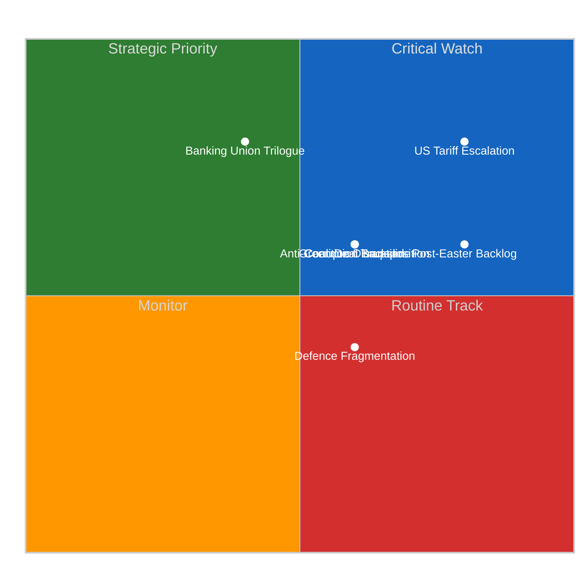

# Political Risk Matrix — Committee Reports Q1 2026

## Risk Dashboard

| Risk ID | Risk | Category | Likelihood (1-5) | Impact (1-5) | Score | Tier | Trend |
|---------|------|----------|:-:|:-:|:-:|------|:-----:|
| CR-001 | US tariff escalation | Trade | 4 | 4 | 16 | CRITICAL | Rising |
| CR-002 | Post-Easter backlog | Institutional | 4 | 3 | 12 | HIGH | Stable |
| CR-003 | Anti-corruption transposition failure | Justice | 3 | 3 | 9 | MEDIUM | New |
| CR-004 | Banking Union trilogue delay | Economic | 2 | 4 | 8 | MEDIUM | Stable |
| CR-005 | Green Deal legislative backslide | Environmental | 3 | 3 | 9 | MEDIUM | Rising |
| CR-006 | Coalition model disruption | Political | 3 | 3 | 9 | MEDIUM | Rising |
| CR-007 | Defence spending fragmentation | Security | 3 | 2 | 6 | MEDIUM | Stable |

## Composite Risk Score: 10.85/25 (MEDIUM, approaching HIGH)

## Risk Heatmap

## Source Attribution
- Risk scores derived from EP MCP data analysis (104 adopted texts, 13 feed items)
- Precomputed stats (generated 2026-04-08): fragmentation 6.59, majority threshold 361
- Prior analysis: 2026-04-09 committee-reports risk-scoring (5 methods)
- Composite risk trajectory: 9.55 to 10.85 over April 8-10 assessment window
