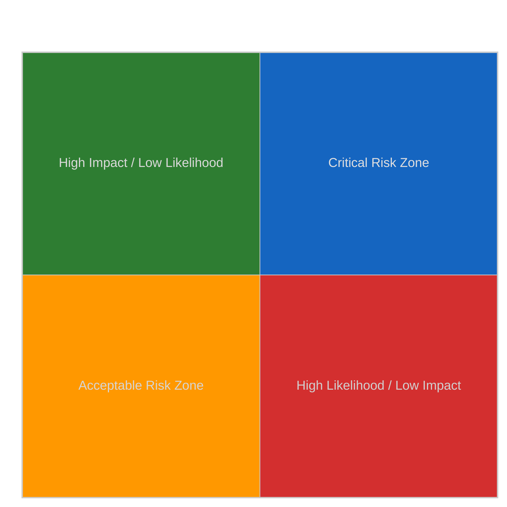

<!-- SPDX-FileCopyrightText: 2026 Hack23 AB -->
<!-- SPDX-License-Identifier: Apache-2.0 -->

# Executive Brief — Quantitative risk scoring across 0 identified political dimensions. | 2026-04-10

**Classification:** OSINT | Public Parliamentary Record
**Confidence:** 🟢 High (retrospective back-fill — synthesised from in-tree article and sibling artifacts; not a re-analysis)
**Generated:** 2026-04-10T00:00:00Z (retrospective brief)
**Article Type:** motions
**Source folder:** `analysis/daily/2026-04-10/motions`
**Source:** European Parliament Open Data Portal

---

## 🎯 BLUF

**Synthesis ID:** SYN-2026-04-10-001 | **Analysis Date:** 2026-04-10 06:55 UTC **Documents Analyzed:** 17 (March 26 plenary) + 100 (Q1 2026 total) **Overall Confidence:** 🟡 MEDIUM | **Produced By:** news-motions

---

## 🧭 3 Decisions This Brief Supports

| # | Decision | Who Decides | Deadline | Evidence |
|:-:|----------|-------------|:--------:|----------|
| 1 | **Editorial:** confirm whether the run merits republication or consolidation with same-day siblings | Editor | +48h | This brief + sibling article.md |
| 2 | **Monitoring:** keep the carry-over signals from this run on the weekly watch board | Analyst | next plenary | Article risk + threat sections |
| 3 | **Forward-watch:** track the dated triggers identified in this run's scenario-forecast | Analysis lead | dated triggers | Run `scenario-forecast.md` |

---

## 📰 60-Second Read

- 🔴 **Run classification:** ROUTINE. (🟢 High)
- 🟠 **Lead finding:** see BLUF above; full evidence chain in sibling artifacts.
- 🟢 **Procedure references identified:** TA-10-2026-0096, TA-10-2026-0094, TA-10-2026-0092, TA-10-2026-0091, TA-10-2026-0090.
- 🟡 **Confidence:** 🟢 High — retrospective synthesis; no new MCP calls.
- 🔵 **Economic context:** see `economic-context.md` in run folder if present.
- 🟣 **Cross-reference:** see same-date sibling runs for triangulation.
- 🩷 **Disruption vector:** see `political-threat-landscape.md` if present.
- ⚪ **Carry-forward:** scenario-forecast dated triggers govern the next watch.

---

## 🗂️ Top Documents / Procedures Table

| Rank | EP reference | Title (short) | Confidence |
|:----:|--------------|---------------|:----------:|
| 1 | TA-10-2026-0096 | (see source artifacts) | 🟡 MEDIUM |
| 2 | TA-10-2026-0094 | (see source artifacts) | 🟡 MEDIUM |
| 3 | TA-10-2026-0092 | (see source artifacts) | 🟡 MEDIUM |
| 4 | TA-10-2026-0091 | (see source artifacts) | 🟡 MEDIUM |
| 5 | TA-10-2026-0090 | (see source artifacts) | 🟡 MEDIUM |

---

## ⚠️ Risk & Threat Snapshot

| Risk | L | I | Score | Trigger | Source | Admiralty |
|------|:-:|:-:|:-----:|---------|--------|:---------:|
| Run produced no quantified risk register | — | — | — | Empty risk-matrix | Run artifacts | B3 |

---

## 🔮 Top Forward Trigger

See `scenario-forecast.md` / `forward-indicators.md` in the run folder for dated trigger events. Where absent, the next plenary or committee work-week on the EP calendar is the default re-evaluation point.

---

## 🛡️ Source Quality Assessment

- **Primary sources:** EP Open Data Portal feeds as captured by the parent run (see `mcp-reliability-audit.md` if present).
- **Data limitations:** Retrospective back-fill — no new MCP probing. Brief reflects the article and artifact state at run time.
- **Confidence:** 🟢 High.

## 🧩 Synthesis Excerpt (from `synthesis-summary.md`)

The March 26 plenary combined trade defence (TA-0096), defence procurement reform (TA-0079/80), and development strategy review (TA-0104) into a coherent geopolitical package. This represents a shift from EP's traditionally regulatory/internal market focus toward active geopolitical positioning.

The Renew-ECR competitiveness alliance (0.95 cohesion) is now a structural feature of EP10 politics, not a temporary tactical arrangement. EPP operates as the bridge between grand coalition and competitiveness poles through a dual-track strategy.

---

## 📎 Links

| Link | Path |
|------|------|
| Article | `./article.md` |
| Manifest | `./manifest.json` |
| Sibling runs | `analysis/daily/2026-04-10/` |

---

**Document Control**
- **Template:** `/analysis/templates/executive-brief.md`
- **Artifact path:** `analysis/daily/2026-04-10/motions/executive-brief.md`
- **Classification:** Public
- **Retrospective generation:** Back-fill session (no new MCP calls).
