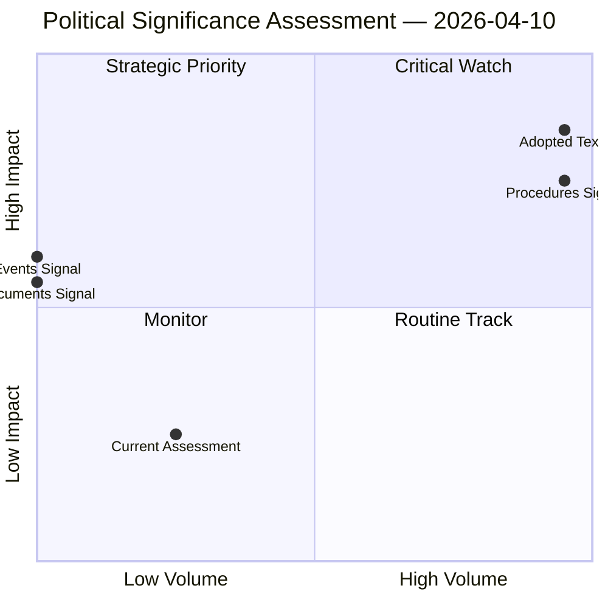

# Political Significance Classification

## Overall Significance: **ROUTINE**

## 5-Signal Model Scores

| Signal | Raw Data | Score |
|--------|----------|-------|
| Volume | 0 events, 0 documents | 0.0/5 |
| Pipeline | 13 procedures | 2.6/5 |
| Output | 20 adopted texts | 4.0/5 |
| Anomalies | Pattern deviation detection | — |
| Coalition | Group alignment analysis | — |

## Data Summary

| Metric | Value |
|--------|-------|
| Computed significance | ROUTINE |
| Total data points | 33 |
| Events | 0 |
| Documents | 0 |
| Procedures | 13 |
| Adopted texts | 20 |
| Date | 2026-04-10 |

## Date: 2026-04-10
