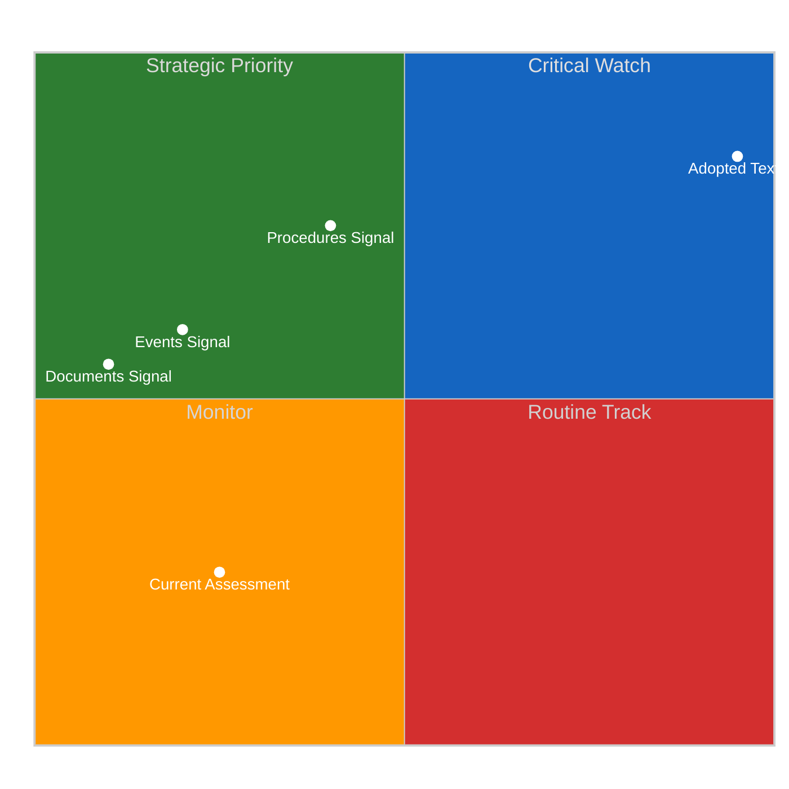
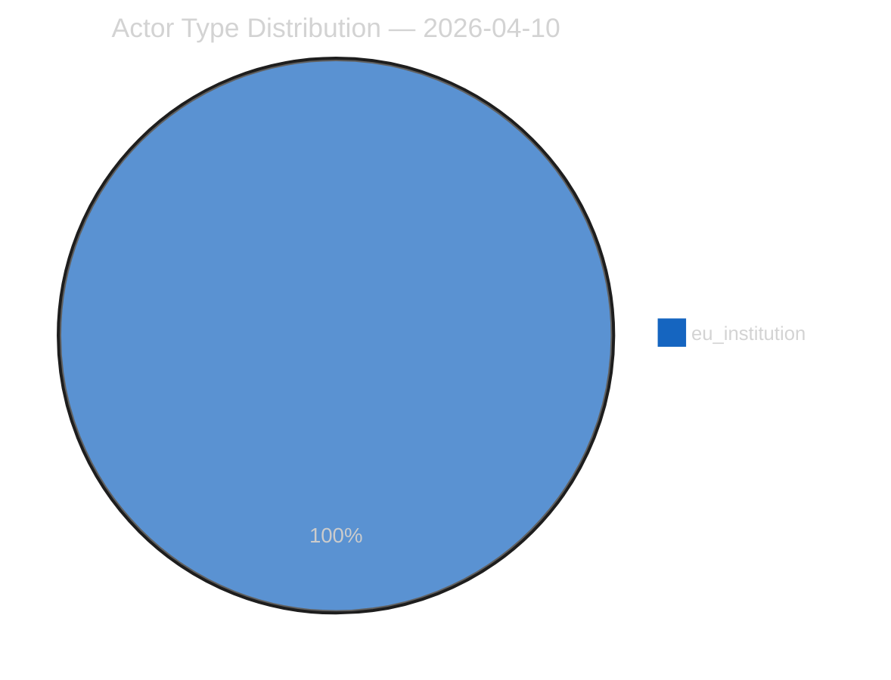
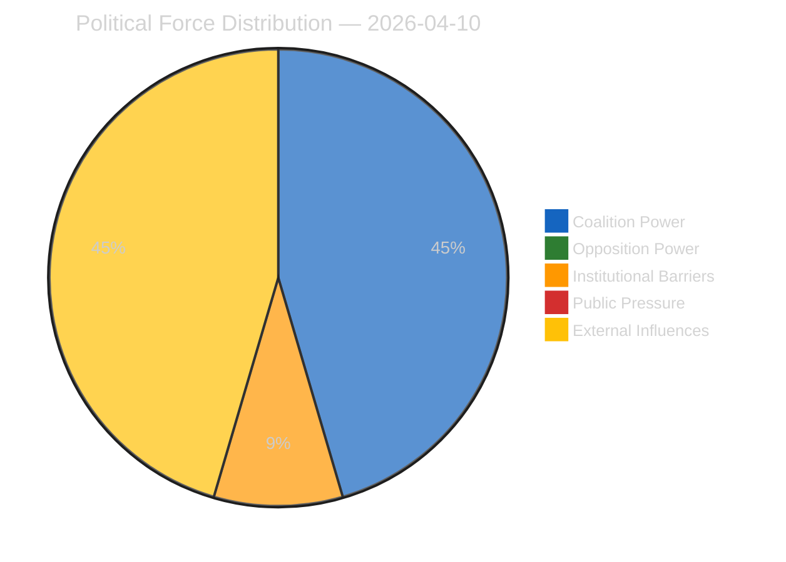
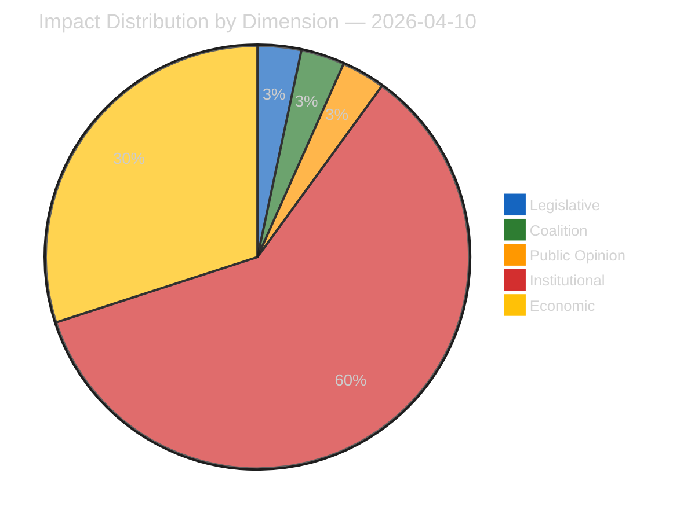
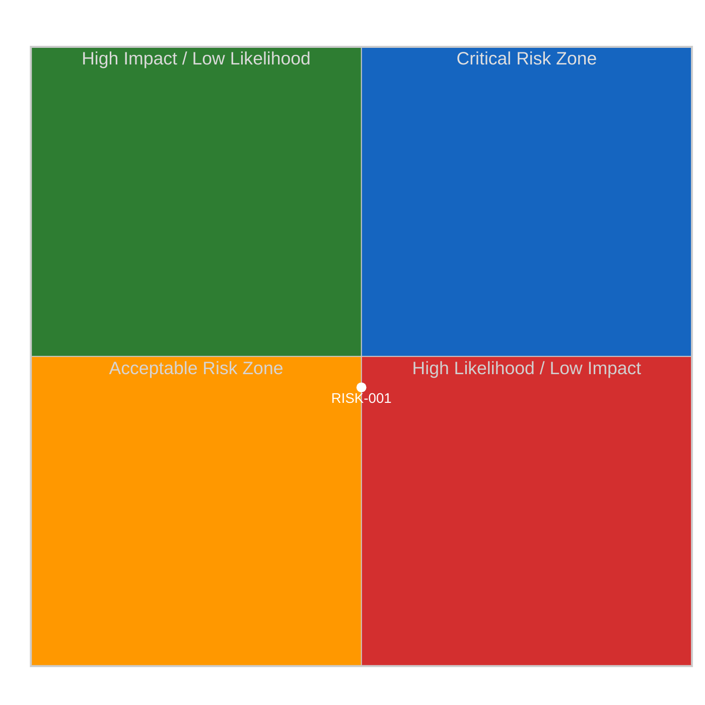
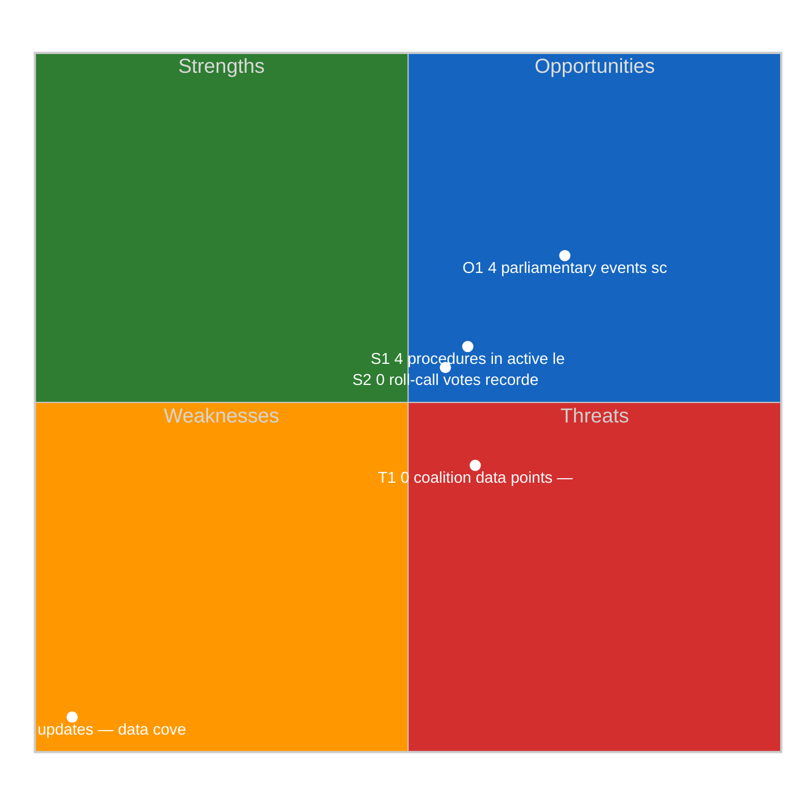
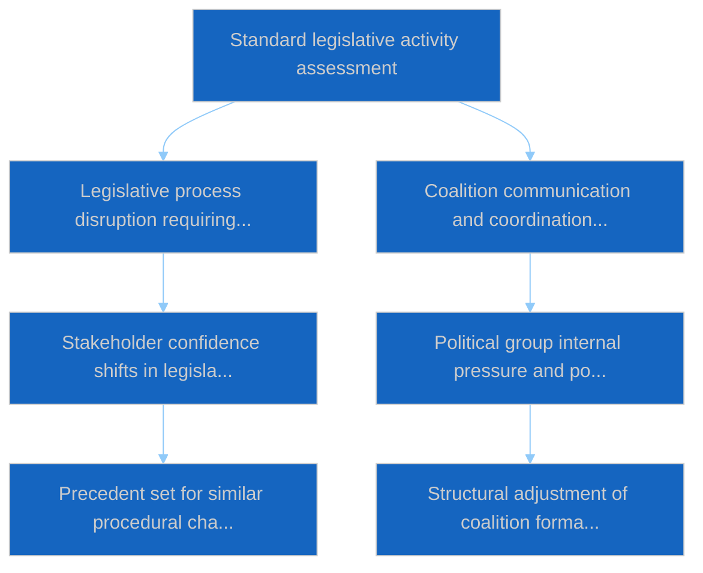

# Week Ahead — 2026-04-10

<!-- Aggregated analysis — do not edit; regenerate via `npm run generate-article`. -->

> **Provenance**
>
> - **Article type:** `week-ahead`
> - **Run date:** 2026-04-10
> - **Run id:** `12`
> - **Gate result:** `PENDING`
> - **Analysis tree:** [analysis/daily/2026-04-10/week-ahead-run12](https://github.com/Hack23/euparliamentmonitor/tree/main/analysis/daily/2026-04-10/week-ahead-run12)
> - **Manifest:** [manifest.json](https://github.com/Hack23/euparliamentmonitor/blob/main/analysis/daily/2026-04-10/week-ahead-run12/manifest.json)

<h2 id="section-significance">Significance</h2>

### Significance Classification

<a href="https://github.com/Hack23/euparliamentmonitor/blob/main/analysis/daily/2026-04-10/week-ahead-run12/classification/significance-classification.md" rel="noopener">View source: <code>classification/significance-classification.md</code></a>

### Overall Significance: **ROUTINE**

### 5-Signal Model Scores

| Signal | Raw Data | Score |
|--------|----------|-------|
| Volume | 4 events, 2 documents | 0.6/5 |
| Pipeline | 4 procedures | 0.8/5 |
| Output | 11 adopted texts | 2.2/5 |
| Anomalies | Pattern deviation detection | — |
| Coalition | Group alignment analysis | — |

### Data Summary

| Metric | Value |
|--------|-------|
| Computed significance | ROUTINE |
| Total data points | 21 |
| Events | 4 |
| Documents | 2 |
| Procedures | 4 |
| Adopted texts | 11 |
| Date | 2026-04-10 |

### Date: 2026-04-10

<h2 id="section-actors-forces">Actors & Forces</h2>

### Actor Mapping

<a href="https://github.com/Hack23/euparliamentmonitor/blob/main/analysis/daily/2026-04-10/week-ahead-run12/classification/actor-mapping.md" rel="noopener">View source: <code>classification/actor-mapping.md</code></a>

### Actors Identified: 2

### Actor Classification

| Actor | Type | Influence | Position | Role |
|-------|------|-----------|----------|------|
| INTA | eu_institution | moderate | ambiguous | Responsible committee |
| ECON | eu_institution | moderate | ambiguous | Responsible committee |

### Type Counts

| Type | Count |
|------|-------|
| eu_institution | 2 |

### Date: 2026-04-10

### Forces Analysis

<a href="https://github.com/Hack23/euparliamentmonitor/blob/main/analysis/daily/2026-04-10/week-ahead-run12/classification/forces-analysis.md" rel="noopener">View source: <code>classification/forces-analysis.md</code></a>

### Forces Data

| Force | Trend | Strength | Key Actors | Confidence |
|-------|-------|----------|------------|------------|
| Coalition Power | stable | 50% | — | low |
| Opposition Power | stable | 0% | — | low |
| Institutional Barriers | stable | 10% | — | medium |
| Public Pressure | stable | 0% | — | low |
| External Influences | increasing | 50% | — | medium |

### Balance

| Metric | Value |
|--------|-------|
| Coalition vs Opposition | 50% vs 1% |
| Dominant force | Coalition |
| Date | 2026-04-10 |

### Date: 2026-04-10

### Impact Matrix

<a href="https://github.com/Hack23/euparliamentmonitor/blob/main/analysis/daily/2026-04-10/week-ahead-run12/classification/impact-matrix.md" rel="noopener">View source: <code>classification/impact-matrix.md</code></a>

### Overall Significance: **NOTABLE**

### Impact Dimensions

| Dimension | Level | Indicator | Numeric |
|-----------|-------|-----------|---------|
| Legislative | none | 🟢 | 5 |
| Coalition | none | 🟢 | 5 |
| Public Opinion | none | 🟢 | 5 |
| Institutional | critical | 🔴 | 90 |
| Economic | moderate | 🟡 | 45 |

### Summary

| Metric | Value |
|--------|-------|
| Overall significance | NOTABLE |
| Highest impact | Institutional |
| Date | 2026-04-10 |

### Date: 2026-04-10

<h2 id="section-coalitions-voting">Coalitions & Voting</h2>

### Voting Patterns

<a href="https://github.com/Hack23/euparliamentmonitor/blob/main/analysis/daily/2026-04-10/week-ahead-run12/existing/voting-patterns.md" rel="noopener">View source: <code>existing/voting-patterns.md</code></a>

### Detected Trends (Script-Generated Context)
| Trend ID | Direction | Confidence | Data Points |
|----------|-----------|------------|-------------|
| No trend data available from voting records | — | — | — |

### Computed Summary
- **Trends identified**: 0
- **Records analysed**: 0

### AI Agent Instructions

> **Instructions for AI Agent (Opus 4.6):** Read ALL methodology documents in analysis/methodologies/. Using the voting pattern data above and the adopted texts from EP MCP feeds, produce a voting pattern intelligence analysis. Your analysis MUST:
>
> 1. **Identify voting blocs**: Which groups consistently vote together on recent adopted texts?
> 2. **Detect anomalies**: Any unexpected votes, close margins (<50 vote difference), or high abstention rates?
> 3. **Analyse by policy domain**: Do voting patterns differ between economic, environmental, and social legislation?
> 4. **Group discipline assessment**: Rate each major group's internal cohesion (high/medium/low) with evidence
> 5. **Trend detection**: Compare recent voting patterns to historical trends — is the Parliament becoming more/less fragmented?
> 6. **Forward-looking**: Which upcoming votes are likely to be contested based on current alignment patterns?
>
> If voting records are limited, analyse the adopted texts' policy positions to infer likely voting alignments and coalition patterns.
> When done, REMOVE this instructions section entirely and write analysis prose directly.

[TO BE FILLED BY AI AGENT — Substantive voting pattern analysis with specific vote references, group cohesion ratings, and anomaly detection. Quality gate: minimum 300 words.]

### Date: 2026-04-10

<h2 id="section-stakeholder-map">Stakeholder Map</h2>

### Stakeholder Impact

<a href="https://github.com/Hack23/euparliamentmonitor/blob/main/analysis/daily/2026-04-10/week-ahead-run12/existing/stakeholder-impact.md" rel="noopener">View source: <code>existing/stakeholder-impact.md</code></a>

### Data Available for Stakeholder Assessment (Script-Generated Context)
| Stakeholder Group | Primary Data Sources | Data Points |
|-------------------|---------------------|-------------|
| Political Groups | Procedures, Adopted Texts, Voting Records, Coalitions | 15 |
| Civil Society | Documents, Questions, Events | 6 |
| Industry | Procedures, Adopted Texts | 15 |
| National Governments | Adopted Texts, Procedures, Coalitions | 15 |
| Citizens | Questions, MEP Updates, Events | 4 |
| EU Institutions | Events, Procedures, Adopted Texts, Voting Records | 19 |

### Data Source Summary
| Source | Count |
|--------|-------|
| patterns | 0 |
| votingRecords | 0 |
| events | 4 |
| documents | 2 |
| adoptedTexts | 11 |
| procedures | 4 |
| mepUpdates | 0 |
| plenaryDocuments | 0 |
| committeeDocuments | 0 |
| plenarySessionDocuments | 0 |
| externalDocuments | 0 |
| questions | 0 |
| declarations | 0 |
| corporateBodies | 0 |

### AI Agent Instructions

> **Instructions for AI Agent (Opus 4.6):** Read ALL methodology documents in analysis/methodologies/. Using the stakeholder-impact.md template and the data inventory above, produce a stakeholder impact analysis for each of the 6 stakeholder groups. For each group:
>
> 1. **Impact direction**: positive / negative / neutral / mixed
> 2. **Impact severity**: high / medium / low
> 3. **Specific evidence**: Cite ≥2 specific EP documents, votes, or procedures that affect this stakeholder
> 4. **Reasoning**: 2-3 sentences explaining WHY this stakeholder is affected and HOW
> 5. **Action items**: What should this stakeholder watch or do in response?
> 6. **Confidence level**: HIGH / MEDIUM / LOW
>
> Focus on the MOST RECENT adopted texts and procedures. Do not produce generic stakeholder descriptions — every assessment must be grounded in specific EP data from this date period.
> When done, REMOVE this instructions section entirely and write analysis prose directly.

[TO BE FILLED BY AI AGENT — Each stakeholder group must have impact direction, severity, evidence citations, and reasoning. Quality gate: minimum 300 words of original analytical prose.]

### Date: 2026-04-10

<h2 id="section-risk">Risk Assessment</h2>

### Risk Matrix

<a href="https://github.com/Hack23/euparliamentmonitor/blob/main/analysis/daily/2026-04-10/week-ahead-run12/risk-scoring/risk-matrix.md" rel="noopener">View source: <code>risk-scoring/risk-matrix.md</code></a>

### Overview

Quantitative risk scoring across 1 identified political dimensions.
This matrix uses a standardized likelihood × impact framework to quantify and
prioritize political risks affecting the European Parliament legislative process.

### Risk Heat Map

### Risk Matrix

| Risk ID | Description | Likelihood | Impact | Score | Level |
|---------|-------------|------------|--------|-------|-------|
| RISK-001 | Legislative blockage risk from procedure backlog | possible | moderate | 1.5 | medium |

> **Risk Score** = Likelihood × Impact. **Levels**: 🟢 LOW (≤1.0), 🟡 MEDIUM (≤2.0), 🟠 HIGH (≤3.5), 🔴 CRITICAL (>3.5)

### Risk Assessment Details

#### RISK-001: Legislative blockage risk from procedure backlog

| Metric | Value |
|--------|-------|
| Risk Score | 1.50 |
| Risk Level | MEDIUM |
| Likelihood | possible |
| Impact | moderate |

### Risk Mitigation Framework

| Risk Level | Count | Tolerance | Action Required |
|------------|-------|-----------|-----------------|
| 🔴 CRITICAL | 0 | Zero tolerance | Immediate escalation |
| 🟠 HIGH | 0 | Low tolerance | Active mitigation |
| 🟡 MEDIUM | 1 | Moderate | Enhanced monitoring |
| 🟢 LOW | 0 | Acceptable | Routine tracking |

### Date: 2026-04-10

### Quantitative Swot

<a href="https://github.com/Hack23/euparliamentmonitor/blob/main/analysis/daily/2026-04-10/week-ahead-run12/risk-scoring/quantitative-swot.md" rel="noopener">View source: <code>risk-scoring/quantitative-swot.md</code></a>

### Executive Summary

**Strategic Position Score**: 3.3/10
**Overall Assessment**: Weak strategic position: weaknesses and threats dominate — urgent mitigation needed.
**Analysis Date**: 2026-04-10

> This SWOT analysis is derived from 4 procedures, 4 events, 11 adopted texts, 2 documents, 0 voting records, and 0 coalition data points fetched from the European Parliament.

### SWOT Quadrant Chart

### SWOT Overview

| Category | Items | Avg Score | Trend |
|----------|-------|-----------|-------|
| 🟢 Strengths | 2 | 0.4 | stable |
| 🔴 Weaknesses | 1 | 5.0 | stable |
| 🔵 Opportunities | 1 | 2.1 | improving |
| 🟠 Threats | 1 | 0.9 | stable |

### 🟢 Strengths

#### S1: 4 procedures in active legislative pipeline
- **Score**: 0.8/5
- **Confidence**: medium
- **Trend**: stable
- **Evidence**:
  - 4 procedures tracked in current period
  - 11 texts adopted
  - 2 documents published

#### S2: 0 roll-call votes recorded with 0 questions
- **Score**: 0.0/5
- **Confidence**: low
- **Trend**: stable
- **Evidence**:
  - 0 voting records available
  - 0 parliamentary questions filed
  - 0 MEP activity updates

### 🔴 Weaknesses

#### W1: 0 MEP updates — data coverage gap assessment
- **Score**: 5.0/5
- **Confidence**: medium
- **Trend**: stable
- **Evidence**:
  - 0 MEP updates in current period
  - 2 documents vs 4 procedures ratio
  - Data freshness depends on EP feed update frequency

### 🔵 Opportunities

#### O1: 4 parliamentary events scheduled
- **Score**: 2.1/5
- **Confidence**: medium
- **Trend**: improving
- **Evidence**:
  - 4 events in analysis period
  - 11 texts adopted indicates legislative throughput
  - 4 procedures in various stages

### 🟠 Threats

#### T1: 0 coalition data points — cohesion monitoring
- **Score**: 0.9/5
- **Confidence**: low
- **Trend**: stable
- **Evidence**:
  - 0 coalition observations recorded
  - Cross-reference with 0 voting records
  - 4 procedures may be affected by coalition shifts

### Cross-Impact Matrix

| Interaction | Net Effect | Rationale |
|-------------|-----------|----------|
| strength #1 × threat #1 | -0.16 | Strength "4 procedures in active legislative pipeline" partially mitigates threat "0 coalition data points — cohesion monitoring" |
| strength #2 × threat #1 | 0.00 | Strength "0 roll-call votes recorded with 0 questions" partially mitigates threat "0 coalition data points — cohesion monitoring" |
| weakness #1 × threat #1 | 0.75 | Weakness "0 MEP updates — data coverage gap assessment" amplifies threat "0 coalition data points — cohesion monitoring" |

### Strategic Priorities Matrix

### Data Summary

| Data Source | Count |
|-------------|-------|
| Procedures | 4 |
| Events | 4 |
| Documents | 2 |
| Voting Records | 0 |
| Adopted Texts | 11 |
| Coalitions | 0 |
| Questions | 0 |
| MEP Updates | 0 |
| **Total Data Points** | **21** |

### Date: 2026-04-10

### Political Capital Risk

<a href="https://github.com/Hack23/euparliamentmonitor/blob/main/analysis/daily/2026-04-10/week-ahead-run12/risk-scoring/political-capital-risk.md" rel="noopener">View source: <code>risk-scoring/political-capital-risk.md</code></a>

### Data Inventory for Capital Risk Assessment
| Data Source | Count | Relevance |
|-------------|-------|-----------|
| Coalition data points | 0 | Group cohesion indicators |
| Voting records | 0 | Voting alignment metrics |
| Voting patterns | 0 | Trend and anomaly data |
| Active procedures | 4 | Legislative engagement |

### Date: 2026-04-10

### Legislative Velocity Risk

<a href="https://github.com/Hack23/euparliamentmonitor/blob/main/analysis/daily/2026-04-10/week-ahead-run12/risk-scoring/legislative-velocity-risk.md" rel="noopener">View source: <code>risk-scoring/legislative-velocity-risk.md</code></a>

### Overview
Risk assessment based on legislative processing speed for 4 procedures.

### Top Velocity Risks
| Procedure | Title | Stage | Days (actual/expected) | Risk Score | Level |
|-----------|-------|-------|----------------------|------------|-------|
| — | — | — | — | — | — |

### Summary
- **Procedures analysed**: 4
- **High/Critical risks**: 0
- **Date**: 2026-04-10

<h2 id="section-threat">Threat Landscape</h2>

### Actor Threat Profiling

<a href="https://github.com/Hack23/euparliamentmonitor/blob/main/analysis/daily/2026-04-10/week-ahead-run12/threat-assessment/actor-threat-profiling.md" rel="noopener">View source: <code>threat-assessment/actor-threat-profiling.md</code></a>

### Overview
Individual threat profiles for 0 political actors.

### Actor Threat Matrix
| Actor | Type | Capability | Motivation | Opportunity | Threat Level |
|-------|------|------------|------------|-------------|--------------|
| — | — | — | — | — | — |

### Date: 2026-04-10

### Consequence Trees

<a href="https://github.com/Hack23/euparliamentmonitor/blob/main/analysis/daily/2026-04-10/week-ahead-run12/threat-assessment/consequence-trees.md" rel="noopener">View source: <code>threat-assessment/consequence-trees.md</code></a>

### Overview
Structured analysis of action-consequence chains for 4 legislative procedures.

#### EU countermeasures to US tariff actions - Trade emergency response
- **Immediate**: Legislative process disruption requiring procedural recalibration; Coalition communication and coordination burden increases
- **Secondary**: Stakeholder confidence shifts in legislative outcome predictability; Political group internal pressure and positioning adjustments
- **Long-term**: Precedent set for similar procedural challenges in future legislative cycles; Structural adjustment of coalition formation strategies
- **Mitigating factors**: Institutional resilience mechanisms, Cross-party dialogue channels
- **Amplifying factors**: No significant amplifying factors identified

#### Single Resolution Mechanism Regulation recast (SRMR3)
- **Immediate**: Legislative process disruption requiring procedural recalibration; Coalition communication and coordination burden increases
- **Secondary**: Stakeholder confidence shifts in legislative outcome predictability; Political group internal pressure and positioning adjustments
- **Long-term**: Precedent set for similar procedural challenges in future legislative cycles; Structural adjustment of coalition formation strategies
- **Mitigating factors**: Institutional resilience mechanisms, Cross-party dialogue channels
- **Amplifying factors**: No significant amplifying factors identified

#### Bank Recovery and Resolution Directive recast (BRRD3)
- **Immediate**: Legislative process disruption requiring procedural recalibration; Coalition communication and coordination burden increases
- **Secondary**: Stakeholder confidence shifts in legislative outcome predictability; Political group internal pressure and positioning adjustments
- **Long-term**: Precedent set for similar procedural challenges in future legislative cycles; Structural adjustment of coalition formation strategies
- **Mitigating factors**: Institutional resilience mechanisms, Cross-party dialogue channels
- **Amplifying factors**: No significant amplifying factors identified

#### Deposit Guarantee Schemes Directive revision (DGSD2)
- **Immediate**: Legislative process disruption requiring procedural recalibration; Coalition communication and coordination burden increases
- **Secondary**: Stakeholder confidence shifts in legislative outcome predictability; Political group internal pressure and positioning adjustments
- **Long-term**: Precedent set for similar procedural challenges in future legislative cycles; Structural adjustment of coalition formation strategies
- **Mitigating factors**: Institutional resilience mechanisms, Cross-party dialogue channels
- **Amplifying factors**: No significant amplifying factors identified

### Date: 2026-04-10

### Legislative Disruption

<a href="https://github.com/Hack23/euparliamentmonitor/blob/main/analysis/daily/2026-04-10/week-ahead-run12/threat-assessment/legislative-disruption.md" rel="noopener">View source: <code>threat-assessment/legislative-disruption.md</code></a>

### Overview
Identification of factors disrupting the normal legislative process.

### Disruption Assessment
| Procedure ID | Title | Stage | Resilience | Disruption Points |
|-------------|-------|-------|-----------|-------------------|
| — | — | — | — | — |

### Date: 2026-04-10

### Political Threat Landscape

<a href="https://github.com/Hack23/euparliamentmonitor/blob/main/analysis/daily/2026-04-10/week-ahead-run12/threat-assessment/political-threat-landscape.md" rel="noopener">View source: <code>threat-assessment/political-threat-landscape.md</code></a>

### Political Threat Landscape Analysis

#### Coalition Shifts
**Threat Level**: 🟢 Low

Coalition stability appears maintained. No significant realignment signals.

**Evidence:**
- No coalition shift signals detected in available data

#### Transparency Deficit
**Threat Level**: ⚠️ Moderate

Transparency concerns at moderate level. Review committee meeting records and public documentation.

**Evidence:**
- No committee activity data available — potential information gap

#### Policy Reversal
**Threat Level**: 🟢 Low

Legislative trajectory appears stable. No major reversal signals.

**Evidence:**
- No significant policy reversal signals detected

#### Institutional Pressure
**Threat Level**: 🟢 Low

Institutional balance appears maintained. Power distribution within normal parameters.

**Evidence:**
- No institutional threat signals detected

#### Legislative Obstruction
**Threat Level**: 🟢 Low

Legislative pace within normal parameters. No obstruction signals.

**Evidence:**
- No significant legislative delay signals detected

#### Democratic Erosion
**Threat Level**: 🟢 Low

Democratic norms appear stable. Institutional processes functioning within expected parameters.

**Evidence:**
- Democratic norms appear stable. No systematic erosion signals.

### Actor Threat Profiles

*No actor threat profiles generated from available data.*

### Consequence Trees

#### Consequence Tree: Standard legislative activity assessment

**Mitigating Factors:**
- Institutional resilience mechanisms
- Cross-party dialogue channels

**Amplifying Factors:**
- No significant amplifying factors identified

### Legislative Disruption Analysis

#### Procedure: General legislative pipeline

**Current Stage**: proposal | **Resilience**: high

| Stage | Threat Category | Likelihood | Risk Level |
|-------|----------------|------------|------------|
| proposal | delay | 8% | 🟢 Low |
| committee | transparency | 18% | 🟢 Low |
| plenary first reading | shift | 22% | 🟢 Low |
| council position | delay | 12% | 🟢 Low |
| plenary second reading | shift | 21% | 🟢 Low |
| conciliation | reversal | 17% | 🟢 Low |
| adoption | delay | 5% | 🟢 Low |

**Alternative Pathways:**
- Commission resubmission with revised proposal
- Enhanced informal trilogue engagement
- Interim resolution as procedural bridge

### Key Findings

- No high-priority threats detected across threat landscape dimensions

### Recommendations

- Continue routine monitoring of parliamentary activity

---
*Assessment generated by EU Parliament Monitor Political Threat Assessment Pipeline.*  
*Based on public European Parliament data. GDPR-compliant.*

<h2 id="section-continuity">Cross-Run Continuity</h2>

### Cross Session Intelligence

<a href="https://github.com/Hack23/euparliamentmonitor/blob/main/analysis/daily/2026-04-10/week-ahead-run12/existing/cross-session-intelligence.md" rel="noopener">View source: <code>existing/cross-session-intelligence.md</code></a>

### Computed Stability Metrics (Script-Generated Context)
- **Overall Stability**: 0.0%
- **Forecast**: volatile
- **Patterns Analysed**: 0
- **Stable Groups**: None identified from voting data
- **Declining Groups**: None identified from voting data

### AI Agent Instructions

> **Instructions for AI Agent (Opus 4.6):** Read ALL methodology documents in analysis/methodologies/. Using the cross-session stability metrics above and the adopted texts/voting records from recent plenary sessions, produce a cross-session intelligence synthesis. Your analysis MUST:
>
> 1. **Compare coalition patterns** across the last 3-5 plenary sessions — are alliances strengthening or fragmenting?
> 2. **Identify session-over-session trends**: Which policy areas show increasing/decreasing consensus?
> 3. **Detect coalition realignment signals**: Are new voting blocs forming? Is the Grand Coalition showing stress?
> 4. **Institutional dynamics**: How are EP-Council-Commission dynamics evolving based on recent legislative outcomes?
> 5. **Predictive assessment**: Based on cross-session patterns, forecast likely coalition behavior for upcoming votes
> 6. **Confidence levels**: Rate each finding as HIGH / MEDIUM / LOW
>
> Cross-reference with adopted texts from the most recent plenary session to ground the analysis in specific legislative outcomes.
> When done, REMOVE this instructions section entirely and write analysis prose directly.

[TO BE FILLED BY AI AGENT — Cross-session trend analysis with specific plenary session references, coalition evolution assessment, and predictive indicators. Quality gate: minimum 400 words.]

### Date: 2026-04-10

<h2 id="section-deep-analysis">Deep Analysis</h2>

<a href="https://github.com/Hack23/euparliamentmonitor/blob/main/analysis/daily/2026-04-10/week-ahead-run12/existing/deep-analysis.md" rel="noopener">View source: <code>existing/deep-analysis.md</code></a>

### Pipeline Data Context

> **Note:** This section contains script-generated data inventory AND concrete document references for the AI agent to analyze. The AI agent must replace everything starting from the "AI Agent Instructions" heading below with substantive political intelligence analysis.

| Data Source | Count |
|-------------|-------|
| Events | 4 |
| Procedures | 4 |
| Documents | 2 |
| Adopted Texts | 11 |
| Questions | 0 |
| MEP Updates | 0 |
| **Total** | **21** |

| Stakeholder Group | Data Points Available |
|-------------------|---------------------|
| Political Groups | 15 (procedures + adopted texts) |
| Civil Society | 2 (documents + questions) |
| Industry | 4 (procedures) |
| National Governments | 11 (adopted texts) |
| Citizens | 0 (questions + MEP updates) |
| EU Institutions | 8 (events + procedures) |

#### Key Adopted Texts Available for Analysis

| Reference | Title | Work Type | Procedure |
|-----------|-------|-----------|-----------|
|  | Single Resolution Mechanism Regulation (SRMR3) - Banking Union Package |  |  |
|  | Bank Recovery and Resolution Directive (BRRD3) - Banking Union Package |  |  |
|  | Anti-Corruption Directive - Establishing minimum rules on corruption offences and sanctions |  |  |
|  | European Defence Industrial Strategy Implementation |  |  |
|  | European Globalisation Adjustment Fund - Austria KTM |  |  |
|  | Waiver of immunity - Daniel Freund MEP |  |  |
|  | Mercosur bilateral safeguard clause regulation |  |  |
|  | Digital sovereignty and cloud services framework |  |  |
|  | Deposit Guarantee Schemes Directive (DGSD2) - Banking Union Package |  |  |
|  | Clean Industrial Deal framework regulation |  |  |
|  | AI Act delegated acts implementation timeline |  |  |
#### Key Events Available for Analysis

| Reference | Title |
|-----------|-------|
|  | Committee week - Post-Easter restart |
|  | INTA emergency session - US tariff countermeasures |
|  | ECON committee meeting - Banking Union trilogue mandate |
|  | Plenary session restart |
#### Key Procedures Available for Analysis

| Reference | Title |
|-----------|-------|
|  | EU countermeasures to US tariff actions - Trade emergency response |
|  | Single Resolution Mechanism Regulation recast (SRMR3) |
|  | Bank Recovery and Resolution Directive recast (BRRD3) |
|  | Deposit Guarantee Schemes Directive revision (DGSD2) |

---

### AI Agent Instructions

> **Instructions for AI Agent:** Read ALL methodology documents in analysis/methodologies/ before writing. Using the concrete document references above and the raw EP MCP data, produce a deep multi-perspective analysis following the political-style-guide.md depth Level 3 format. Your analysis MUST:
>
> 1. **Identify the 3-5 most politically significant items** from the document tables above, citing specific document IDs (e.g. TA-10-2026-0092)
> 2. **Analyse each from ≥3 stakeholder perspectives** (Political Groups, Civil Society, Industry, National Governments, Citizens, EU Institutions)
> 3. **Apply the SWOT framework** to the overall parliamentary activity pattern for this date
> 4. **Assess coalition dynamics** — which groups are aligning/diverging based on the adopted texts?
> 5. **Rate confidence** for each analytical claim: HIGH / MEDIUM / LOW
> 6. **Provide forward-looking indicators** — what should be monitored in the next 7-14 days?
> 7. **Never leave scaffold markers** — replace this entire section with real analysis
>
> Evidence requirement: ≥3 citations per section from EP MCP data (document IDs, vote references, procedure numbers).
> Quality gate: minimum 500 words of original analytical prose with evidence citations.
> When done, REMOVE this instructions section entirely and write analysis prose directly.

[TO BE FILLED BY AI AGENT — This section must contain substantive political intelligence analysis, not data summaries. Quality gate: minimum 500 words of original analytical prose with evidence citations.]

### Date: 2026-04-10

<h2 id="section-documents">Document Analysis</h2>

### Document Analysis Index

<a href="https://github.com/Hack23/euparliamentmonitor/blob/main/analysis/daily/2026-04-10/week-ahead-run12/documents/document-analysis-index.md" rel="noopener">View source: <code>documents/document-analysis-index.md</code></a>

### Executive Summary

Full per-document political intelligence analysis for 21 unique documents
across 8 feed categories.  Each document has been individually
analyzed from fetched European Parliament data with comprehensive significance assessment,
SWOT analysis, and threat profiling.

- **Total Documents Analyzed**: 21
- **Feed Categories Scanned**: 8
- **Duplicates Deduplicated**: 0
- **Date**: 2026-04-10

### Document Analysis Index

| Document ID | Title | Category | Analysis File |
|-------------|-------|----------|---------------|
| Single Resolution Mechanism Regulation (SRMR3) - B-1jj9p0 | Single Resolution Mechanism Regulation (SRMR3) - Banking Uni | adoptedTexts | [adoptedtexts-single-resolution-mechanism-regulation-srmr3-b-1jj9p0-analysis.md](https://github.com/Hack23/euparliamentmonitor/blob/main/analysis/daily/2026-04-10/week-ahead-run12/documents/adoptedtexts-single-resolution-mechanism-regulation-srmr3-b-1jj9p0-analysis.md) |
| Bank Recovery and Resolution Directive (BRRD3) - B-bq346k | Bank Recovery and Resolution Directive (BRRD3) - Banking Uni | adoptedTexts | [adoptedtexts-bank-recovery-and-resolution-directive-brrd3-b-bq346k-analysis.md](https://github.com/Hack23/euparliamentmonitor/blob/main/analysis/daily/2026-04-10/week-ahead-run12/documents/adoptedtexts-bank-recovery-and-resolution-directive-brrd3-b-bq346k-analysis.md) |
| Anti-Corruption Directive - Establishing minimum r-of9y4z | Anti-Corruption Directive - Establishing minimum rules on co | adoptedTexts | [adoptedtexts-anti-corruption-directive-establishing-minimum-r-of9y4z-analysis.md](https://github.com/Hack23/euparliamentmonitor/blob/main/analysis/daily/2026-04-10/week-ahead-run12/documents/adoptedtexts-anti-corruption-directive-establishing-minimum-r-of9y4z-analysis.md) |
| European Defence Industrial Strategy Implementatio-5fjcvr | European Defence Industrial Strategy Implementation | adoptedTexts | [adoptedtexts-european-defence-industrial-strategy-implementatio-5fjcvr-analysis.md](https://github.com/Hack23/euparliamentmonitor/blob/main/analysis/daily/2026-04-10/week-ahead-run12/documents/adoptedtexts-european-defence-industrial-strategy-implementatio-5fjcvr-analysis.md) |
| European Globalisation Adjustment Fund - Austria K-y6v0s | European Globalisation Adjustment Fund - Austria KTM | adoptedTexts | [adoptedtexts-european-globalisation-adjustment-fund-austria-k-y6v0s-analysis.md](https://github.com/Hack23/euparliamentmonitor/blob/main/analysis/daily/2026-04-10/week-ahead-run12/documents/adoptedtexts-european-globalisation-adjustment-fund-austria-k-y6v0s-analysis.md) |
| Waiver of immunity - Daniel Freund MEP-59hc6g | Waiver of immunity - Daniel Freund MEP | adoptedTexts | [adoptedtexts-waiver-of-immunity-daniel-freund-mep-59hc6g-analysis.md](https://github.com/Hack23/euparliamentmonitor/blob/main/analysis/daily/2026-04-10/week-ahead-run12/documents/adoptedtexts-waiver-of-immunity-daniel-freund-mep-59hc6g-analysis.md) |
| Mercosur bilateral safeguard clause regulation-rfnbej | Mercosur bilateral safeguard clause regulation | adoptedTexts | [adoptedtexts-mercosur-bilateral-safeguard-clause-regulation-rfnbej-analysis.md](https://github.com/Hack23/euparliamentmonitor/blob/main/analysis/daily/2026-04-10/week-ahead-run12/documents/adoptedtexts-mercosur-bilateral-safeguard-clause-regulation-rfnbej-analysis.md) |
| Digital sovereignty and cloud services framework-3yjkwy | Digital sovereignty and cloud services framework | adoptedTexts | [adoptedtexts-digital-sovereignty-and-cloud-services-framework-3yjkwy-analysis.md](https://github.com/Hack23/euparliamentmonitor/blob/main/analysis/daily/2026-04-10/week-ahead-run12/documents/adoptedtexts-digital-sovereignty-and-cloud-services-framework-3yjkwy-analysis.md) |
| Deposit Guarantee Schemes Directive (DGSD2) - Bank-4hn9dl | Deposit Guarantee Schemes Directive (DGSD2) - Banking Union | adoptedTexts | [adoptedtexts-deposit-guarantee-schemes-directive-dgsd2-bank-4hn9dl-analysis.md](https://github.com/Hack23/euparliamentmonitor/blob/main/analysis/daily/2026-04-10/week-ahead-run12/documents/adoptedtexts-deposit-guarantee-schemes-directive-dgsd2-bank-4hn9dl-analysis.md) |
| Clean Industrial Deal framework regulation-xv8wy2 | Clean Industrial Deal framework regulation | adoptedTexts | [adoptedtexts-clean-industrial-deal-framework-regulation-xv8wy2-analysis.md](https://github.com/Hack23/euparliamentmonitor/blob/main/analysis/daily/2026-04-10/week-ahead-run12/documents/adoptedtexts-clean-industrial-deal-framework-regulation-xv8wy2-analysis.md) |
| AI Act delegated acts implementation timeline-1k46de | AI Act delegated acts implementation timeline | adoptedTexts | [adoptedtexts-ai-act-delegated-acts-implementation-timeline-1k46de-analysis.md](https://github.com/Hack23/euparliamentmonitor/blob/main/analysis/daily/2026-04-10/week-ahead-run12/documents/adoptedtexts-ai-act-delegated-acts-implementation-timeline-1k46de-analysis.md) |
| EU countermeasures to US tariff actions - Trade em-4f56gm | EU countermeasures to US tariff actions - Trade emergency re | procedures | [procedures-eu-countermeasures-to-us-tariff-actions-trade-em-4f56gm-analysis.md](https://github.com/Hack23/euparliamentmonitor/blob/main/analysis/daily/2026-04-10/week-ahead-run12/documents/procedures-eu-countermeasures-to-us-tariff-actions-trade-em-4f56gm-analysis.md) |
| Single Resolution Mechanism Regulation recast (SRM-iy50ec | Single Resolution Mechanism Regulation recast (SRMR3) | procedures | [procedures-single-resolution-mechanism-regulation-recast-srm-iy50ec-analysis.md](https://github.com/Hack23/euparliamentmonitor/blob/main/analysis/daily/2026-04-10/week-ahead-run12/documents/procedures-single-resolution-mechanism-regulation-recast-srm-iy50ec-analysis.md) |
| Bank Recovery and Resolution Directive recast (BRR-ep53j2 | Bank Recovery and Resolution Directive recast (BRRD3) | procedures | [procedures-bank-recovery-and-resolution-directive-recast-brr-ep53j2-analysis.md](https://github.com/Hack23/euparliamentmonitor/blob/main/analysis/daily/2026-04-10/week-ahead-run12/documents/procedures-bank-recovery-and-resolution-directive-recast-brr-ep53j2-analysis.md) |
| Deposit Guarantee Schemes Directive revision (DGSD-8nmxb3 | Deposit Guarantee Schemes Directive revision (DGSD2) | procedures | [procedures-deposit-guarantee-schemes-directive-revision-dgsd-8nmxb3-analysis.md](https://github.com/Hack23/euparliamentmonitor/blob/main/analysis/daily/2026-04-10/week-ahead-run12/documents/procedures-deposit-guarantee-schemes-directive-revision-dgsd-8nmxb3-analysis.md) |
| INTA draft report on EU trade countermeasures-yq8lzk | INTA draft report on EU trade countermeasures | documents | [documents-inta-draft-report-on-eu-trade-countermeasures-yq8lzk-analysis.md](https://github.com/Hack23/euparliamentmonitor/blob/main/analysis/daily/2026-04-10/week-ahead-run12/documents/documents-inta-draft-report-on-eu-trade-countermeasures-yq8lzk-analysis.md) |
| ECON working document on Banking Union trilogue pr-kzmq3x | ECON working document on Banking Union trilogue priorities | documents | [documents-econ-working-document-on-banking-union-trilogue-pr-kzmq3x-analysis.md](https://github.com/Hack23/euparliamentmonitor/blob/main/analysis/daily/2026-04-10/week-ahead-run12/documents/documents-econ-working-document-on-banking-union-trilogue-pr-kzmq3x-analysis.md) |
| Committee week - Post-Easter restart-logol0 | Committee week - Post-Easter restart | events | [events-committee-week-post-easter-restart-logol0-analysis.md](https://github.com/Hack23/euparliamentmonitor/blob/main/analysis/daily/2026-04-10/week-ahead-run12/documents/events-committee-week-post-easter-restart-logol0-analysis.md) |
| INTA emergency session - US tariff countermeasures-8tngyr | INTA emergency session - US tariff countermeasures | events | [events-inta-emergency-session-us-tariff-countermeasures-8tngyr-analysis.md](https://github.com/Hack23/euparliamentmonitor/blob/main/analysis/daily/2026-04-10/week-ahead-run12/documents/events-inta-emergency-session-us-tariff-countermeasures-8tngyr-analysis.md) |
| ECON committee meeting - Banking Union trilogue ma-y2sd3e | ECON committee meeting - Banking Union trilogue mandate | events | [events-econ-committee-meeting-banking-union-trilogue-ma-y2sd3e-analysis.md](https://github.com/Hack23/euparliamentmonitor/blob/main/analysis/daily/2026-04-10/week-ahead-run12/documents/events-econ-committee-meeting-banking-union-trilogue-ma-y2sd3e-analysis.md) |
| Plenary session restart-fvz8h3 | Plenary session restart | events | [events-plenary-session-restart-fvz8h3-analysis.md](https://github.com/Hack23/euparliamentmonitor/blob/main/analysis/daily/2026-04-10/week-ahead-run12/documents/events-plenary-session-restart-fvz8h3-analysis.md) |

### Category Breakdown

- **adoptedTexts**: 11 items (11 unique analyzed)
- **procedures**: 4 items (4 unique analyzed)
- **documents**: 2 items (2 unique analyzed)
- **plenaryDocuments**: 0 items (0 unique analyzed)
- **committeeDocuments**: 0 items (0 unique analyzed)
- **plenarySessionDocuments**: 0 items (0 unique analyzed)
- **externalDocuments**: 0 items (0 unique analyzed)
- **events**: 4 items (4 unique analyzed)

### Methodology

Each document receives:
1. **Raw Data Storage** — Full document JSON stored in `documents/raw-data/` for complete data preservation
2. **Significance Classification** — Political importance on 5-level scale
3. **SWOT Assessment** — Strengths, weaknesses, opportunities, threats specific to the document
4. **Threat Profiling** — Political threat landscape analysis for disruption potential
5. **Stakeholder Impact** — Projected effects on key stakeholder groups
6. **Intelligence Summary** — Key findings and actionable insights

### Document Storage

All 21 documents have been stored in their entirety:
- **Analysis files**: `documents/{category}-{id}-analysis.md`
- **Raw JSON data**: `documents/raw-data/{category}-{id}-raw.json`
- **Deduplication**: Documents appearing in multiple feed categories are stored once with primary category reference

### Date: 2026-04-10

### Adoptedtexts Ai Act Delegated Acts Implementation Timeline 1k46de Analysis

<a href="https://github.com/Hack23/euparliamentmonitor/blob/main/analysis/daily/2026-04-10/week-ahead-run12/documents/adoptedtexts-ai-act-delegated-acts-implementation-timeline-1k46de-analysis.md" rel="noopener">View source: <code>documents/adoptedtexts-ai-act-delegated-acts-implementation-timeline-1k46de-analysis.md</code></a>

### Document Metadata

| Field | Value |
|-------|-------|
| **Document ID** | AI Act delegated acts implementation timeline-1k46de |
| **Title** | AI Act delegated acts implementation timeline |
| **Type** | adopted_text |
| **Category** | adoptedTexts |
| **Date** | 2026-03-13 |
| **Status** | unknown |
| **Stage** | N/A |

### Description

No description available

### Political Significance Assessment

- **Overall Significance**: ROUTINE
- **Context**: Document AI Act delegated acts implementation timeline-1k46de within adoptedTexts feed

### Document-Specific SWOT Analysis

#### Strategic Position Score: 5.6/10

| Category | Score | Assessment |
|----------|-------|------------|
| Strengths | 3.0 | Document ai-act-delegated-acts-implementation-timeline-1k46de available in adoptedTexts feed |
| Weaknesses | 2.0 | Document stage: N/A, status: unknown |
| Opportunities | 1.5 | adoptedTexts document with ID ai-act-delegated-acts-implementation-timeline-1k46de |
| Threats | 1.5 | Document ai-act-delegated-acts-implementation-timeline-1k46de — pipeline risk assessment |

### Threat Assessment

- **Threat Dimensions Evaluated**: 6
- **Overall Threat Level**: low
- **Assessment Date**: 2026-04-10

### Stakeholder Impact

| Stakeholder Group | Impact Level |
|-------------------|-------------|
| Political Groups | Low |
| Civil Society | Low |
| Industry | Low |
| National Governments | Low |
| Citizens | Low |
| EU Institutions | Low |

### Intelligence Summary

| Metric | Value |
|--------|-------|
| Document | AI Act delegated acts implementation timeline-1k46de |
| Category | adoptedTexts |
| Type | adopted_text |
| Stage | N/A |
| Status | unknown |
| Significance | routine |
| SWOT Score | 5.6/10 |
| Overall Assessment | Moderate strategic position: balanced strengths and risks requiring careful monitoring. |
| Threat Dimensions | 6 |
| Overall Threat Level | low |

### Analysis Date: 2026-04-10

### Adoptedtexts Anti Corruption Directive Establishing Minimum R Of9y4z Analysis

<a href="https://github.com/Hack23/euparliamentmonitor/blob/main/analysis/daily/2026-04-10/week-ahead-run12/documents/adoptedtexts-anti-corruption-directive-establishing-minimum-r-of9y4z-analysis.md" rel="noopener">View source: <code>documents/adoptedtexts-anti-corruption-directive-establishing-minimum-r-of9y4z-analysis.md</code></a>

### Document Metadata

| Field | Value |
|-------|-------|
| **Document ID** | Anti-Corruption Directive - Establishing minimum r-of9y4z |
| **Title** | Anti-Corruption Directive - Establishing minimum rules on corruption offences and sanctions |
| **Type** | adopted_text |
| **Category** | adoptedTexts |
| **Date** | 2026-03-26 |
| **Status** | unknown |
| **Stage** | N/A |

### Description

No description available

### Political Significance Assessment

- **Overall Significance**: ROUTINE
- **Context**: Document Anti-Corruption Directive - Establishing minimum r-of9y4z within adoptedTexts feed

### Document-Specific SWOT Analysis

#### Strategic Position Score: 5.6/10

| Category | Score | Assessment |
|----------|-------|------------|
| Strengths | 3.0 | Document anti-corruption-directive-establishing-minimum-r-of9y4z available in adoptedTexts feed |
| Weaknesses | 2.0 | Document stage: N/A, status: unknown |
| Opportunities | 1.5 | adoptedTexts document with ID anti-corruption-directive-establishing-minimum-r-of9y4z |
| Threats | 1.5 | Document anti-corruption-directive-establishing-minimum-r-of9y4z — pipeline risk assessment |

### Threat Assessment

- **Threat Dimensions Evaluated**: 6
- **Overall Threat Level**: low
- **Assessment Date**: 2026-04-10

### Stakeholder Impact

| Stakeholder Group | Impact Level |
|-------------------|-------------|
| Political Groups | Low |
| Civil Society | Low |
| Industry | Low |
| National Governments | Low |
| Citizens | Low |
| EU Institutions | Low |

### Intelligence Summary

| Metric | Value |
|--------|-------|
| Document | Anti-Corruption Directive - Establishing minimum r-of9y4z |
| Category | adoptedTexts |
| Type | adopted_text |
| Stage | N/A |
| Status | unknown |
| Significance | routine |
| SWOT Score | 5.6/10 |
| Overall Assessment | Moderate strategic position: balanced strengths and risks requiring careful monitoring. |
| Threat Dimensions | 6 |
| Overall Threat Level | low |

### Analysis Date: 2026-04-10

### Adoptedtexts Bank Recovery And Resolution Directive Brrd3 B Bq346k Analysis

<a href="https://github.com/Hack23/euparliamentmonitor/blob/main/analysis/daily/2026-04-10/week-ahead-run12/documents/adoptedtexts-bank-recovery-and-resolution-directive-brrd3-b-bq346k-analysis.md" rel="noopener">View source: <code>documents/adoptedtexts-bank-recovery-and-resolution-directive-brrd3-b-bq346k-analysis.md</code></a>

### Document Metadata

| Field | Value |
|-------|-------|
| **Document ID** | Bank Recovery and Resolution Directive (BRRD3) - B-bq346k |
| **Title** | Bank Recovery and Resolution Directive (BRRD3) - Banking Union Package |
| **Type** | adopted_text |
| **Category** | adoptedTexts |
| **Date** | 2026-03-26 |
| **Status** | unknown |
| **Stage** | N/A |

### Description

No description available

### Political Significance Assessment

- **Overall Significance**: ROUTINE
- **Context**: Document Bank Recovery and Resolution Directive (BRRD3) - B-bq346k within adoptedTexts feed

### Document-Specific SWOT Analysis

#### Strategic Position Score: 5.6/10

| Category | Score | Assessment |
|----------|-------|------------|
| Strengths | 3.0 | Document bank-recovery-and-resolution-directive-brrd3-b-bq346k available in adoptedTexts feed |
| Weaknesses | 2.0 | Document stage: N/A, status: unknown |
| Opportunities | 1.5 | adoptedTexts document with ID bank-recovery-and-resolution-directive-brrd3-b-bq346k |
| Threats | 1.5 | Document bank-recovery-and-resolution-directive-brrd3-b-bq346k — pipeline risk assessment |

### Threat Assessment

- **Threat Dimensions Evaluated**: 6
- **Overall Threat Level**: low
- **Assessment Date**: 2026-04-10

### Stakeholder Impact

| Stakeholder Group | Impact Level |
|-------------------|-------------|
| Political Groups | Low |
| Civil Society | Low |
| Industry | Low |
| National Governments | Low |
| Citizens | Low |
| EU Institutions | Low |

### Intelligence Summary

| Metric | Value |
|--------|-------|
| Document | Bank Recovery and Resolution Directive (BRRD3) - B-bq346k |
| Category | adoptedTexts |
| Type | adopted_text |
| Stage | N/A |
| Status | unknown |
| Significance | routine |
| SWOT Score | 5.6/10 |
| Overall Assessment | Moderate strategic position: balanced strengths and risks requiring careful monitoring. |
| Threat Dimensions | 6 |
| Overall Threat Level | low |

### Analysis Date: 2026-04-10

### Adoptedtexts Clean Industrial Deal Framework Regulation Xv8wy2 Analysis

<a href="https://github.com/Hack23/euparliamentmonitor/blob/main/analysis/daily/2026-04-10/week-ahead-run12/documents/adoptedtexts-clean-industrial-deal-framework-regulation-xv8wy2-analysis.md" rel="noopener">View source: <code>documents/adoptedtexts-clean-industrial-deal-framework-regulation-xv8wy2-analysis.md</code></a>

### Document Metadata

| Field | Value |
|-------|-------|
| **Document ID** | Clean Industrial Deal framework regulation-xv8wy2 |
| **Title** | Clean Industrial Deal framework regulation |
| **Type** | adopted_text |
| **Category** | adoptedTexts |
| **Date** | 2026-03-13 |
| **Status** | unknown |
| **Stage** | N/A |

### Description

No description available

### Political Significance Assessment

- **Overall Significance**: ROUTINE
- **Context**: Document Clean Industrial Deal framework regulation-xv8wy2 within adoptedTexts feed

### Document-Specific SWOT Analysis

#### Strategic Position Score: 5.6/10

| Category | Score | Assessment |
|----------|-------|------------|
| Strengths | 3.0 | Document clean-industrial-deal-framework-regulation-xv8wy2 available in adoptedTexts feed |
| Weaknesses | 2.0 | Document stage: N/A, status: unknown |
| Opportunities | 1.5 | adoptedTexts document with ID clean-industrial-deal-framework-regulation-xv8wy2 |
| Threats | 1.5 | Document clean-industrial-deal-framework-regulation-xv8wy2 — pipeline risk assessment |

### Threat Assessment

- **Threat Dimensions Evaluated**: 6
- **Overall Threat Level**: low
- **Assessment Date**: 2026-04-10

### Stakeholder Impact

| Stakeholder Group | Impact Level |
|-------------------|-------------|
| Political Groups | Low |
| Civil Society | Low |
| Industry | Low |
| National Governments | Low |
| Citizens | Low |
| EU Institutions | Low |

### Intelligence Summary

| Metric | Value |
|--------|-------|
| Document | Clean Industrial Deal framework regulation-xv8wy2 |
| Category | adoptedTexts |
| Type | adopted_text |
| Stage | N/A |
| Status | unknown |
| Significance | routine |
| SWOT Score | 5.6/10 |
| Overall Assessment | Moderate strategic position: balanced strengths and risks requiring careful monitoring. |
| Threat Dimensions | 6 |
| Overall Threat Level | low |

### Analysis Date: 2026-04-10

### Adoptedtexts Deposit Guarantee Schemes Directive Dgsd2 Bank 4hn9dl Analysis

<a href="https://github.com/Hack23/euparliamentmonitor/blob/main/analysis/daily/2026-04-10/week-ahead-run12/documents/adoptedtexts-deposit-guarantee-schemes-directive-dgsd2-bank-4hn9dl-analysis.md" rel="noopener">View source: <code>documents/adoptedtexts-deposit-guarantee-schemes-directive-dgsd2-bank-4hn9dl-analysis.md</code></a>

### Document Metadata

| Field | Value |
|-------|-------|
| **Document ID** | Deposit Guarantee Schemes Directive (DGSD2) - Bank-4hn9dl |
| **Title** | Deposit Guarantee Schemes Directive (DGSD2) - Banking Union Package |
| **Type** | adopted_text |
| **Category** | adoptedTexts |
| **Date** | 2026-03-26 |
| **Status** | unknown |
| **Stage** | N/A |

### Description

No description available

### Political Significance Assessment

- **Overall Significance**: ROUTINE
- **Context**: Document Deposit Guarantee Schemes Directive (DGSD2) - Bank-4hn9dl within adoptedTexts feed

### Document-Specific SWOT Analysis

#### Strategic Position Score: 5.6/10

| Category | Score | Assessment |
|----------|-------|------------|
| Strengths | 3.0 | Document deposit-guarantee-schemes-directive-dgsd2-bank-4hn9dl available in adoptedTexts feed |
| Weaknesses | 2.0 | Document stage: N/A, status: unknown |
| Opportunities | 1.5 | adoptedTexts document with ID deposit-guarantee-schemes-directive-dgsd2-bank-4hn9dl |
| Threats | 1.5 | Document deposit-guarantee-schemes-directive-dgsd2-bank-4hn9dl — pipeline risk assessment |

### Threat Assessment

- **Threat Dimensions Evaluated**: 6
- **Overall Threat Level**: low
- **Assessment Date**: 2026-04-10

### Stakeholder Impact

| Stakeholder Group | Impact Level |
|-------------------|-------------|
| Political Groups | Low |
| Civil Society | Low |
| Industry | Low |
| National Governments | Low |
| Citizens | Low |
| EU Institutions | Low |

### Intelligence Summary

| Metric | Value |
|--------|-------|
| Document | Deposit Guarantee Schemes Directive (DGSD2) - Bank-4hn9dl |
| Category | adoptedTexts |
| Type | adopted_text |
| Stage | N/A |
| Status | unknown |
| Significance | routine |
| SWOT Score | 5.6/10 |
| Overall Assessment | Moderate strategic position: balanced strengths and risks requiring careful monitoring. |
| Threat Dimensions | 6 |
| Overall Threat Level | low |

### Analysis Date: 2026-04-10

### Adoptedtexts Digital Sovereignty And Cloud Services Framework 3yjkwy Analysis

<a href="https://github.com/Hack23/euparliamentmonitor/blob/main/analysis/daily/2026-04-10/week-ahead-run12/documents/adoptedtexts-digital-sovereignty-and-cloud-services-framework-3yjkwy-analysis.md" rel="noopener">View source: <code>documents/adoptedtexts-digital-sovereignty-and-cloud-services-framework-3yjkwy-analysis.md</code></a>

### Document Metadata

| Field | Value |
|-------|-------|
| **Document ID** | Digital sovereignty and cloud services framework-3yjkwy |
| **Title** | Digital sovereignty and cloud services framework |
| **Type** | adopted_text |
| **Category** | adoptedTexts |
| **Date** | 2026-03-25 |
| **Status** | unknown |
| **Stage** | N/A |

### Description

No description available

### Political Significance Assessment

- **Overall Significance**: ROUTINE
- **Context**: Document Digital sovereignty and cloud services framework-3yjkwy within adoptedTexts feed

### Document-Specific SWOT Analysis

#### Strategic Position Score: 5.6/10

| Category | Score | Assessment |
|----------|-------|------------|
| Strengths | 3.0 | Document digital-sovereignty-and-cloud-services-framework-3yjkwy available in adoptedTexts feed |
| Weaknesses | 2.0 | Document stage: N/A, status: unknown |
| Opportunities | 1.5 | adoptedTexts document with ID digital-sovereignty-and-cloud-services-framework-3yjkwy |
| Threats | 1.5 | Document digital-sovereignty-and-cloud-services-framework-3yjkwy — pipeline risk assessment |

### Threat Assessment

- **Threat Dimensions Evaluated**: 6
- **Overall Threat Level**: low
- **Assessment Date**: 2026-04-10

### Stakeholder Impact

| Stakeholder Group | Impact Level |
|-------------------|-------------|
| Political Groups | Low |
| Civil Society | Low |
| Industry | Low |
| National Governments | Low |
| Citizens | Low |
| EU Institutions | Low |

### Intelligence Summary

| Metric | Value |
|--------|-------|
| Document | Digital sovereignty and cloud services framework-3yjkwy |
| Category | adoptedTexts |
| Type | adopted_text |
| Stage | N/A |
| Status | unknown |
| Significance | routine |
| SWOT Score | 5.6/10 |
| Overall Assessment | Moderate strategic position: balanced strengths and risks requiring careful monitoring. |
| Threat Dimensions | 6 |
| Overall Threat Level | low |

### Analysis Date: 2026-04-10

### Adoptedtexts European Defence Industrial Strategy Implementatio 5fjcvr Analysis

<a href="https://github.com/Hack23/euparliamentmonitor/blob/main/analysis/daily/2026-04-10/week-ahead-run12/documents/adoptedtexts-european-defence-industrial-strategy-implementatio-5fjcvr-analysis.md" rel="noopener">View source: <code>documents/adoptedtexts-european-defence-industrial-strategy-implementatio-5fjcvr-analysis.md</code></a>

### Document Metadata

| Field | Value |
|-------|-------|
| **Document ID** | European Defence Industrial Strategy Implementatio-5fjcvr |
| **Title** | European Defence Industrial Strategy Implementation |
| **Type** | adopted_text |
| **Category** | adoptedTexts |
| **Date** | 2026-03-25 |
| **Status** | unknown |
| **Stage** | N/A |

### Description

No description available

### Political Significance Assessment

- **Overall Significance**: ROUTINE
- **Context**: Document European Defence Industrial Strategy Implementatio-5fjcvr within adoptedTexts feed

### Document-Specific SWOT Analysis

#### Strategic Position Score: 5.6/10

| Category | Score | Assessment |
|----------|-------|------------|
| Strengths | 3.0 | Document european-defence-industrial-strategy-implementatio-5fjcvr available in adoptedTexts feed |
| Weaknesses | 2.0 | Document stage: N/A, status: unknown |
| Opportunities | 1.5 | adoptedTexts document with ID european-defence-industrial-strategy-implementatio-5fjcvr |
| Threats | 1.5 | Document european-defence-industrial-strategy-implementatio-5fjcvr — pipeline risk assessment |

### Threat Assessment

- **Threat Dimensions Evaluated**: 6
- **Overall Threat Level**: low
- **Assessment Date**: 2026-04-10

### Stakeholder Impact

| Stakeholder Group | Impact Level |
|-------------------|-------------|
| Political Groups | Low |
| Civil Society | Low |
| Industry | Low |
| National Governments | Low |
| Citizens | Low |
| EU Institutions | Low |

### Intelligence Summary

| Metric | Value |
|--------|-------|
| Document | European Defence Industrial Strategy Implementatio-5fjcvr |
| Category | adoptedTexts |
| Type | adopted_text |
| Stage | N/A |
| Status | unknown |
| Significance | routine |
| SWOT Score | 5.6/10 |
| Overall Assessment | Moderate strategic position: balanced strengths and risks requiring careful monitoring. |
| Threat Dimensions | 6 |
| Overall Threat Level | low |

### Analysis Date: 2026-04-10

### Adoptedtexts European Globalisation Adjustment Fund Austria K Y6v0s Analysis

<a href="https://github.com/Hack23/euparliamentmonitor/blob/main/analysis/daily/2026-04-10/week-ahead-run12/documents/adoptedtexts-european-globalisation-adjustment-fund-austria-k-y6v0s-analysis.md" rel="noopener">View source: <code>documents/adoptedtexts-european-globalisation-adjustment-fund-austria-k-y6v0s-analysis.md</code></a>

### Document Metadata

| Field | Value |
|-------|-------|
| **Document ID** | European Globalisation Adjustment Fund - Austria K-y6v0s |
| **Title** | European Globalisation Adjustment Fund - Austria KTM |
| **Type** | adopted_text |
| **Category** | adoptedTexts |
| **Date** | 2026-03-27 |
| **Status** | unknown |
| **Stage** | N/A |

### Description

No description available

### Political Significance Assessment

- **Overall Significance**: ROUTINE
- **Context**: Document European Globalisation Adjustment Fund - Austria K-y6v0s within adoptedTexts feed

### Document-Specific SWOT Analysis

#### Strategic Position Score: 5.6/10

| Category | Score | Assessment |
|----------|-------|------------|
| Strengths | 3.0 | Document european-globalisation-adjustment-fund-austria-k-y6v0s available in adoptedTexts feed |
| Weaknesses | 2.0 | Document stage: N/A, status: unknown |
| Opportunities | 1.5 | adoptedTexts document with ID european-globalisation-adjustment-fund-austria-k-y6v0s |
| Threats | 1.5 | Document european-globalisation-adjustment-fund-austria-k-y6v0s — pipeline risk assessment |

### Threat Assessment

- **Threat Dimensions Evaluated**: 6
- **Overall Threat Level**: low
- **Assessment Date**: 2026-04-10

### Stakeholder Impact

| Stakeholder Group | Impact Level |
|-------------------|-------------|
| Political Groups | Low |
| Civil Society | Low |
| Industry | Low |
| National Governments | Low |
| Citizens | Low |
| EU Institutions | Low |

### Intelligence Summary

| Metric | Value |
|--------|-------|
| Document | European Globalisation Adjustment Fund - Austria K-y6v0s |
| Category | adoptedTexts |
| Type | adopted_text |
| Stage | N/A |
| Status | unknown |
| Significance | routine |
| SWOT Score | 5.6/10 |
| Overall Assessment | Moderate strategic position: balanced strengths and risks requiring careful monitoring. |
| Threat Dimensions | 6 |
| Overall Threat Level | low |

### Analysis Date: 2026-04-10

### Adoptedtexts Mercosur Bilateral Safeguard Clause Regulation Rfnbej Analysis

<a href="https://github.com/Hack23/euparliamentmonitor/blob/main/analysis/daily/2026-04-10/week-ahead-run12/documents/adoptedtexts-mercosur-bilateral-safeguard-clause-regulation-rfnbej-analysis.md" rel="noopener">View source: <code>documents/adoptedtexts-mercosur-bilateral-safeguard-clause-regulation-rfnbej-analysis.md</code></a>

### Document Metadata

| Field | Value |
|-------|-------|
| **Document ID** | Mercosur bilateral safeguard clause regulation-rfnbej |
| **Title** | Mercosur bilateral safeguard clause regulation |
| **Type** | adopted_text |
| **Category** | adoptedTexts |
| **Date** | 2026-03-25 |
| **Status** | unknown |
| **Stage** | N/A |

### Description

No description available

### Political Significance Assessment

- **Overall Significance**: ROUTINE
- **Context**: Document Mercosur bilateral safeguard clause regulation-rfnbej within adoptedTexts feed

### Document-Specific SWOT Analysis

#### Strategic Position Score: 5.6/10

| Category | Score | Assessment |
|----------|-------|------------|
| Strengths | 3.0 | Document mercosur-bilateral-safeguard-clause-regulation-rfnbej available in adoptedTexts feed |
| Weaknesses | 2.0 | Document stage: N/A, status: unknown |
| Opportunities | 1.5 | adoptedTexts document with ID mercosur-bilateral-safeguard-clause-regulation-rfnbej |
| Threats | 1.5 | Document mercosur-bilateral-safeguard-clause-regulation-rfnbej — pipeline risk assessment |

### Threat Assessment

- **Threat Dimensions Evaluated**: 6
- **Overall Threat Level**: low
- **Assessment Date**: 2026-04-10

### Stakeholder Impact

| Stakeholder Group | Impact Level |
|-------------------|-------------|
| Political Groups | Low |
| Civil Society | Low |
| Industry | Low |
| National Governments | Low |
| Citizens | Low |
| EU Institutions | Low |

### Intelligence Summary

| Metric | Value |
|--------|-------|
| Document | Mercosur bilateral safeguard clause regulation-rfnbej |
| Category | adoptedTexts |
| Type | adopted_text |
| Stage | N/A |
| Status | unknown |
| Significance | routine |
| SWOT Score | 5.6/10 |
| Overall Assessment | Moderate strategic position: balanced strengths and risks requiring careful monitoring. |
| Threat Dimensions | 6 |
| Overall Threat Level | low |

### Analysis Date: 2026-04-10

### Adoptedtexts Single Resolution Mechanism Regulation Srmr3 B 1jj9p0 Analysis

<a href="https://github.com/Hack23/euparliamentmonitor/blob/main/analysis/daily/2026-04-10/week-ahead-run12/documents/adoptedtexts-single-resolution-mechanism-regulation-srmr3-b-1jj9p0-analysis.md" rel="noopener">View source: <code>documents/adoptedtexts-single-resolution-mechanism-regulation-srmr3-b-1jj9p0-analysis.md</code></a>

### Document Metadata

| Field | Value |
|-------|-------|
| **Document ID** | Single Resolution Mechanism Regulation (SRMR3) - B-1jj9p0 |
| **Title** | Single Resolution Mechanism Regulation (SRMR3) - Banking Union Package |
| **Type** | adopted_text |
| **Category** | adoptedTexts |
| **Date** | 2026-03-26 |
| **Status** | unknown |
| **Stage** | N/A |

### Description

No description available

### Political Significance Assessment

- **Overall Significance**: ROUTINE
- **Context**: Document Single Resolution Mechanism Regulation (SRMR3) - B-1jj9p0 within adoptedTexts feed

### Document-Specific SWOT Analysis

#### Strategic Position Score: 5.6/10

| Category | Score | Assessment |
|----------|-------|------------|
| Strengths | 3.0 | Document single-resolution-mechanism-regulation-srmr3-b-1jj9p0 available in adoptedTexts feed |
| Weaknesses | 2.0 | Document stage: N/A, status: unknown |
| Opportunities | 1.5 | adoptedTexts document with ID single-resolution-mechanism-regulation-srmr3-b-1jj9p0 |
| Threats | 1.5 | Document single-resolution-mechanism-regulation-srmr3-b-1jj9p0 — pipeline risk assessment |

### Threat Assessment

- **Threat Dimensions Evaluated**: 6
- **Overall Threat Level**: low
- **Assessment Date**: 2026-04-10

### Stakeholder Impact

| Stakeholder Group | Impact Level |
|-------------------|-------------|
| Political Groups | Low |
| Civil Society | Low |
| Industry | Low |
| National Governments | Low |
| Citizens | Low |
| EU Institutions | Low |

### Intelligence Summary

| Metric | Value |
|--------|-------|
| Document | Single Resolution Mechanism Regulation (SRMR3) - B-1jj9p0 |
| Category | adoptedTexts |
| Type | adopted_text |
| Stage | N/A |
| Status | unknown |
| Significance | routine |
| SWOT Score | 5.6/10 |
| Overall Assessment | Moderate strategic position: balanced strengths and risks requiring careful monitoring. |
| Threat Dimensions | 6 |
| Overall Threat Level | low |

### Analysis Date: 2026-04-10

### Adoptedtexts Waiver Of Immunity Daniel Freund Mep 59hc6g Analysis

<a href="https://github.com/Hack23/euparliamentmonitor/blob/main/analysis/daily/2026-04-10/week-ahead-run12/documents/adoptedtexts-waiver-of-immunity-daniel-freund-mep-59hc6g-analysis.md" rel="noopener">View source: <code>documents/adoptedtexts-waiver-of-immunity-daniel-freund-mep-59hc6g-analysis.md</code></a>

### Document Metadata

| Field | Value |
|-------|-------|
| **Document ID** | Waiver of immunity - Daniel Freund MEP-59hc6g |
| **Title** | Waiver of immunity - Daniel Freund MEP |
| **Type** | adopted_text |
| **Category** | adoptedTexts |
| **Date** | 2026-03-27 |
| **Status** | unknown |
| **Stage** | N/A |

### Description

No description available

### Political Significance Assessment

- **Overall Significance**: ROUTINE
- **Context**: Document Waiver of immunity - Daniel Freund MEP-59hc6g within adoptedTexts feed

### Document-Specific SWOT Analysis

#### Strategic Position Score: 5.6/10

| Category | Score | Assessment |
|----------|-------|------------|
| Strengths | 3.0 | Document waiver-of-immunity-daniel-freund-mep-59hc6g available in adoptedTexts feed |
| Weaknesses | 2.0 | Document stage: N/A, status: unknown |
| Opportunities | 1.5 | adoptedTexts document with ID waiver-of-immunity-daniel-freund-mep-59hc6g |
| Threats | 1.5 | Document waiver-of-immunity-daniel-freund-mep-59hc6g — pipeline risk assessment |

### Threat Assessment

- **Threat Dimensions Evaluated**: 6
- **Overall Threat Level**: low
- **Assessment Date**: 2026-04-10

### Stakeholder Impact

| Stakeholder Group | Impact Level |
|-------------------|-------------|
| Political Groups | Low |
| Civil Society | Low |
| Industry | Low |
| National Governments | Low |
| Citizens | Low |
| EU Institutions | Low |

### Intelligence Summary

| Metric | Value |
|--------|-------|
| Document | Waiver of immunity - Daniel Freund MEP-59hc6g |
| Category | adoptedTexts |
| Type | adopted_text |
| Stage | N/A |
| Status | unknown |
| Significance | routine |
| SWOT Score | 5.6/10 |
| Overall Assessment | Moderate strategic position: balanced strengths and risks requiring careful monitoring. |
| Threat Dimensions | 6 |
| Overall Threat Level | low |

### Analysis Date: 2026-04-10

### Documents Econ Working Document On Banking Union Trilogue Pr Kzmq3x Analysis

<a href="https://github.com/Hack23/euparliamentmonitor/blob/main/analysis/daily/2026-04-10/week-ahead-run12/documents/documents-econ-working-document-on-banking-union-trilogue-pr-kzmq3x-analysis.md" rel="noopener">View source: <code>documents/documents-econ-working-document-on-banking-union-trilogue-pr-kzmq3x-analysis.md</code></a>

### Document Metadata

| Field | Value |
|-------|-------|
| **Document ID** | ECON working document on Banking Union trilogue pr-kzmq3x |
| **Title** | ECON working document on Banking Union trilogue priorities |
| **Type** | working_document |
| **Category** | documents |
| **Date** | 2026-04-02 |
| **Status** | unknown |
| **Stage** | N/A |

### Description

No description available

### Political Significance Assessment

- **Overall Significance**: ROUTINE
- **Context**: Document ECON working document on Banking Union trilogue pr-kzmq3x within documents feed

### Document-Specific SWOT Analysis

#### Strategic Position Score: 5.6/10

| Category | Score | Assessment |
|----------|-------|------------|
| Strengths | 3.0 | Document econ-working-document-on-banking-union-trilogue-pr-kzmq3x available in documents feed |
| Weaknesses | 2.0 | Document stage: N/A, status: unknown |
| Opportunities | 1.5 | documents document with ID econ-working-document-on-banking-union-trilogue-pr-kzmq3x |
| Threats | 1.5 | Document econ-working-document-on-banking-union-trilogue-pr-kzmq3x — pipeline risk assessment |

### Threat Assessment

- **Threat Dimensions Evaluated**: 6
- **Overall Threat Level**: low
- **Assessment Date**: 2026-04-10

### Stakeholder Impact

| Stakeholder Group | Impact Level |
|-------------------|-------------|
| Political Groups | Low |
| Civil Society | Low |
| Industry | Low |
| National Governments | Low |
| Citizens | Low |
| EU Institutions | Low |

### Intelligence Summary

| Metric | Value |
|--------|-------|
| Document | ECON working document on Banking Union trilogue pr-kzmq3x |
| Category | documents |
| Type | working_document |
| Stage | N/A |
| Status | unknown |
| Significance | routine |
| SWOT Score | 5.6/10 |
| Overall Assessment | Moderate strategic position: balanced strengths and risks requiring careful monitoring. |
| Threat Dimensions | 6 |
| Overall Threat Level | low |

### Analysis Date: 2026-04-10

### Documents Inta Draft Report On Eu Trade Countermeasures Yq8lzk Analysis

<a href="https://github.com/Hack23/euparliamentmonitor/blob/main/analysis/daily/2026-04-10/week-ahead-run12/documents/documents-inta-draft-report-on-eu-trade-countermeasures-yq8lzk-analysis.md" rel="noopener">View source: <code>documents/documents-inta-draft-report-on-eu-trade-countermeasures-yq8lzk-analysis.md</code></a>

### Document Metadata

| Field | Value |
|-------|-------|
| **Document ID** | INTA draft report on EU trade countermeasures-yq8lzk |
| **Title** | INTA draft report on EU trade countermeasures |
| **Type** | draft_report |
| **Category** | documents |
| **Date** | 2026-04-01 |
| **Status** | unknown |
| **Stage** | N/A |

### Description

No description available

### Political Significance Assessment

- **Overall Significance**: ROUTINE
- **Context**: Document INTA draft report on EU trade countermeasures-yq8lzk within documents feed

### Document-Specific SWOT Analysis

#### Strategic Position Score: 5.6/10

| Category | Score | Assessment |
|----------|-------|------------|
| Strengths | 3.0 | Document inta-draft-report-on-eu-trade-countermeasures-yq8lzk available in documents feed |
| Weaknesses | 2.0 | Document stage: N/A, status: unknown |
| Opportunities | 1.5 | documents document with ID inta-draft-report-on-eu-trade-countermeasures-yq8lzk |
| Threats | 1.5 | Document inta-draft-report-on-eu-trade-countermeasures-yq8lzk — pipeline risk assessment |

### Threat Assessment

- **Threat Dimensions Evaluated**: 6
- **Overall Threat Level**: low
- **Assessment Date**: 2026-04-10

### Stakeholder Impact

| Stakeholder Group | Impact Level |
|-------------------|-------------|
| Political Groups | Low |
| Civil Society | Low |
| Industry | Low |
| National Governments | Low |
| Citizens | Low |
| EU Institutions | Low |

### Intelligence Summary

| Metric | Value |
|--------|-------|
| Document | INTA draft report on EU trade countermeasures-yq8lzk |
| Category | documents |
| Type | draft_report |
| Stage | N/A |
| Status | unknown |
| Significance | routine |
| SWOT Score | 5.6/10 |
| Overall Assessment | Moderate strategic position: balanced strengths and risks requiring careful monitoring. |
| Threat Dimensions | 6 |
| Overall Threat Level | low |

### Analysis Date: 2026-04-10

### Events Committee Week Post Easter Restart Logol0 Analysis

<a href="https://github.com/Hack23/euparliamentmonitor/blob/main/analysis/daily/2026-04-10/week-ahead-run12/documents/events-committee-week-post-easter-restart-logol0-analysis.md" rel="noopener">View source: <code>documents/events-committee-week-post-easter-restart-logol0-analysis.md</code></a>

### Document Metadata

| Field | Value |
|-------|-------|
| **Document ID** | Committee week - Post-Easter restart-logol0 |
| **Title** | Committee week - Post-Easter restart |
| **Type** | committee_week |
| **Category** | events |
| **Date** | 2026-04-14 |
| **Status** | unknown |
| **Stage** | N/A |

### Description

First committee meetings after Easter recess

### Political Significance Assessment

- **Overall Significance**: ROUTINE
- **Context**: Document Committee week - Post-Easter restart-logol0 within events feed

### Document-Specific SWOT Analysis

#### Strategic Position Score: 5.6/10

| Category | Score | Assessment |
|----------|-------|------------|
| Strengths | 3.0 | Document committee-week-post-easter-restart-logol0 available in events feed |
| Weaknesses | 2.0 | Document stage: N/A, status: unknown |
| Opportunities | 1.5 | events document with ID committee-week-post-easter-restart-logol0 |
| Threats | 1.5 | Document committee-week-post-easter-restart-logol0 — pipeline risk assessment |

### Threat Assessment

- **Threat Dimensions Evaluated**: 6
- **Overall Threat Level**: low
- **Assessment Date**: 2026-04-10

### Stakeholder Impact

| Stakeholder Group | Impact Level |
|-------------------|-------------|
| Political Groups | Low |
| Civil Society | Low |
| Industry | Low |
| National Governments | Low |
| Citizens | Low |
| EU Institutions | Low |

### Intelligence Summary

| Metric | Value |
|--------|-------|
| Document | Committee week - Post-Easter restart-logol0 |
| Category | events |
| Type | committee_week |
| Stage | N/A |
| Status | unknown |
| Significance | routine |
| SWOT Score | 5.6/10 |
| Overall Assessment | Moderate strategic position: balanced strengths and risks requiring careful monitoring. |
| Threat Dimensions | 6 |
| Overall Threat Level | low |

### Analysis Date: 2026-04-10

### Events Econ Committee Meeting Banking Union Trilogue Ma Y2sd3e Analysis

<a href="https://github.com/Hack23/euparliamentmonitor/blob/main/analysis/daily/2026-04-10/week-ahead-run12/documents/events-econ-committee-meeting-banking-union-trilogue-ma-y2sd3e-analysis.md" rel="noopener">View source: <code>documents/events-econ-committee-meeting-banking-union-trilogue-ma-y2sd3e-analysis.md</code></a>

### Document Metadata

| Field | Value |
|-------|-------|
| **Document ID** | ECON committee meeting - Banking Union trilogue ma-y2sd3e |
| **Title** | ECON committee meeting - Banking Union trilogue mandate |
| **Type** | committee_meeting |
| **Category** | events |
| **Date** | 2026-04-15 |
| **Status** | unknown |
| **Stage** | N/A |

### Description

Preparation of Council negotiating position for SRMR3/BRRD3/DGSD2

### Political Significance Assessment

- **Overall Significance**: ROUTINE
- **Context**: Document ECON committee meeting - Banking Union trilogue ma-y2sd3e within events feed

### Document-Specific SWOT Analysis

#### Strategic Position Score: 5.6/10

| Category | Score | Assessment |
|----------|-------|------------|
| Strengths | 3.0 | Document econ-committee-meeting-banking-union-trilogue-ma-y2sd3e available in events feed |
| Weaknesses | 2.0 | Document stage: N/A, status: unknown |
| Opportunities | 1.5 | events document with ID econ-committee-meeting-banking-union-trilogue-ma-y2sd3e |
| Threats | 1.5 | Document econ-committee-meeting-banking-union-trilogue-ma-y2sd3e — pipeline risk assessment |

### Threat Assessment

- **Threat Dimensions Evaluated**: 6
- **Overall Threat Level**: low
- **Assessment Date**: 2026-04-10

### Stakeholder Impact

| Stakeholder Group | Impact Level |
|-------------------|-------------|
| Political Groups | Low |
| Civil Society | Low |
| Industry | Low |
| National Governments | Low |
| Citizens | Low |
| EU Institutions | Low |

### Intelligence Summary

| Metric | Value |
|--------|-------|
| Document | ECON committee meeting - Banking Union trilogue ma-y2sd3e |
| Category | events |
| Type | committee_meeting |
| Stage | N/A |
| Status | unknown |
| Significance | routine |
| SWOT Score | 5.6/10 |
| Overall Assessment | Moderate strategic position: balanced strengths and risks requiring careful monitoring. |
| Threat Dimensions | 6 |
| Overall Threat Level | low |

### Analysis Date: 2026-04-10

### Events Inta Emergency Session Us Tariff Countermeasures 8tngyr Analysis

<a href="https://github.com/Hack23/euparliamentmonitor/blob/main/analysis/daily/2026-04-10/week-ahead-run12/documents/events-inta-emergency-session-us-tariff-countermeasures-8tngyr-analysis.md" rel="noopener">View source: <code>documents/events-inta-emergency-session-us-tariff-countermeasures-8tngyr-analysis.md</code></a>

### Document Metadata

| Field | Value |
|-------|-------|
| **Document ID** | INTA emergency session - US tariff countermeasures-8tngyr |
| **Title** | INTA emergency session - US tariff countermeasures |
| **Type** | committee_meeting |
| **Category** | events |
| **Date** | 2026-04-15 |
| **Status** | unknown |
| **Stage** | N/A |

### Description

Emergency consideration of EU trade response package

### Political Significance Assessment

- **Overall Significance**: ROUTINE
- **Context**: Document INTA emergency session - US tariff countermeasures-8tngyr within events feed

### Document-Specific SWOT Analysis

#### Strategic Position Score: 5.6/10

| Category | Score | Assessment |
|----------|-------|------------|
| Strengths | 3.0 | Document inta-emergency-session-us-tariff-countermeasures-8tngyr available in events feed |
| Weaknesses | 2.0 | Document stage: N/A, status: unknown |
| Opportunities | 1.5 | events document with ID inta-emergency-session-us-tariff-countermeasures-8tngyr |
| Threats | 1.5 | Document inta-emergency-session-us-tariff-countermeasures-8tngyr — pipeline risk assessment |

### Threat Assessment

- **Threat Dimensions Evaluated**: 6
- **Overall Threat Level**: low
- **Assessment Date**: 2026-04-10

### Stakeholder Impact

| Stakeholder Group | Impact Level |
|-------------------|-------------|
| Political Groups | Low |
| Civil Society | Low |
| Industry | Low |
| National Governments | Low |
| Citizens | Low |
| EU Institutions | Low |

### Intelligence Summary

| Metric | Value |
|--------|-------|
| Document | INTA emergency session - US tariff countermeasures-8tngyr |
| Category | events |
| Type | committee_meeting |
| Stage | N/A |
| Status | unknown |
| Significance | routine |
| SWOT Score | 5.6/10 |
| Overall Assessment | Moderate strategic position: balanced strengths and risks requiring careful monitoring. |
| Threat Dimensions | 6 |
| Overall Threat Level | low |

### Analysis Date: 2026-04-10

### Events Plenary Session Restart Fvz8h3 Analysis

<a href="https://github.com/Hack23/euparliamentmonitor/blob/main/analysis/daily/2026-04-10/week-ahead-run12/documents/events-plenary-session-restart-fvz8h3-analysis.md" rel="noopener">View source: <code>documents/events-plenary-session-restart-fvz8h3-analysis.md</code></a>

### Document Metadata

| Field | Value |
|-------|-------|
| **Document ID** | Plenary session restart-fvz8h3 |
| **Title** | Plenary session restart |
| **Type** | plenary_session |
| **Category** | events |
| **Date** | 2026-04-20 |
| **Status** | unknown |
| **Stage** | N/A |

### Description

First plenary after Easter recess, Strasbourg

### Political Significance Assessment

- **Overall Significance**: ROUTINE
- **Context**: Document Plenary session restart-fvz8h3 within events feed

### Document-Specific SWOT Analysis

#### Strategic Position Score: 5.6/10

| Category | Score | Assessment |
|----------|-------|------------|
| Strengths | 3.0 | Document plenary-session-restart-fvz8h3 available in events feed |
| Weaknesses | 2.0 | Document stage: N/A, status: unknown |
| Opportunities | 1.5 | events document with ID plenary-session-restart-fvz8h3 |
| Threats | 1.5 | Document plenary-session-restart-fvz8h3 — pipeline risk assessment |

### Threat Assessment

- **Threat Dimensions Evaluated**: 6
- **Overall Threat Level**: low
- **Assessment Date**: 2026-04-10

### Stakeholder Impact

| Stakeholder Group | Impact Level |
|-------------------|-------------|
| Political Groups | Low |
| Civil Society | Low |
| Industry | Low |
| National Governments | Low |
| Citizens | Low |
| EU Institutions | Low |

### Intelligence Summary

| Metric | Value |
|--------|-------|
| Document | Plenary session restart-fvz8h3 |
| Category | events |
| Type | plenary_session |
| Stage | N/A |
| Status | unknown |
| Significance | routine |
| SWOT Score | 5.6/10 |
| Overall Assessment | Moderate strategic position: balanced strengths and risks requiring careful monitoring. |
| Threat Dimensions | 6 |
| Overall Threat Level | low |

### Analysis Date: 2026-04-10

### Procedures Bank Recovery And Resolution Directive Recast Brr Ep53j2 Analysis

<a href="https://github.com/Hack23/euparliamentmonitor/blob/main/analysis/daily/2026-04-10/week-ahead-run12/documents/procedures-bank-recovery-and-resolution-directive-recast-brr-ep53j2-analysis.md" rel="noopener">View source: <code>documents/procedures-bank-recovery-and-resolution-directive-recast-brr-ep53j2-analysis.md</code></a>

### Document Metadata

| Field | Value |
|-------|-------|
| **Document ID** | Bank Recovery and Resolution Directive recast (BRR-ep53j2 |
| **Title** | Bank Recovery and Resolution Directive recast (BRRD3) |
| **Type** | COD |
| **Category** | procedures |
| **Date** |  |
| **Status** | ACTIVE |
| **Stage** | Trilogue |

### Description

No description available

### Political Significance Assessment

- **Overall Significance**: ROUTINE
- **Context**: Document Bank Recovery and Resolution Directive recast (BRR-ep53j2 within procedures feed

### Document-Specific SWOT Analysis

#### Strategic Position Score: 5.6/10

| Category | Score | Assessment |
|----------|-------|------------|
| Strengths | 3.0 | Document bank-recovery-and-resolution-directive-recast-brr-ep53j2 available in procedures feed |
| Weaknesses | 2.0 | Document stage: Trilogue, status: ACTIVE |
| Opportunities | 1.5 | procedures document with ID bank-recovery-and-resolution-directive-recast-brr-ep53j2 |
| Threats | 1.5 | Document bank-recovery-and-resolution-directive-recast-brr-ep53j2 — pipeline risk assessment |

### Threat Assessment

- **Threat Dimensions Evaluated**: 6
- **Overall Threat Level**: low
- **Assessment Date**: 2026-04-10

### Stakeholder Impact

| Stakeholder Group | Impact Level |
|-------------------|-------------|
| Political Groups | Low |
| Civil Society | Low |
| Industry | Low |
| National Governments | High |
| Citizens | Low |
| EU Institutions | Low |

### Intelligence Summary

| Metric | Value |
|--------|-------|
| Document | Bank Recovery and Resolution Directive recast (BRR-ep53j2 |
| Category | procedures |
| Type | COD |
| Stage | Trilogue |
| Status | ACTIVE |
| Significance | routine |
| SWOT Score | 5.6/10 |
| Overall Assessment | Moderate strategic position: balanced strengths and risks requiring careful monitoring. |
| Threat Dimensions | 6 |
| Overall Threat Level | low |

### Analysis Date: 2026-04-10

### Procedures Deposit Guarantee Schemes Directive Revision Dgsd 8nmxb3 Analysis

<a href="https://github.com/Hack23/euparliamentmonitor/blob/main/analysis/daily/2026-04-10/week-ahead-run12/documents/procedures-deposit-guarantee-schemes-directive-revision-dgsd-8nmxb3-analysis.md" rel="noopener">View source: <code>documents/procedures-deposit-guarantee-schemes-directive-revision-dgsd-8nmxb3-analysis.md</code></a>

### Document Metadata

| Field | Value |
|-------|-------|
| **Document ID** | Deposit Guarantee Schemes Directive revision (DGSD-8nmxb3 |
| **Title** | Deposit Guarantee Schemes Directive revision (DGSD2) |
| **Type** | COD |
| **Category** | procedures |
| **Date** |  |
| **Status** | ACTIVE |
| **Stage** | Trilogue |

### Description

No description available

### Political Significance Assessment

- **Overall Significance**: ROUTINE
- **Context**: Document Deposit Guarantee Schemes Directive revision (DGSD-8nmxb3 within procedures feed

### Document-Specific SWOT Analysis

#### Strategic Position Score: 5.6/10

| Category | Score | Assessment |
|----------|-------|------------|
| Strengths | 3.0 | Document deposit-guarantee-schemes-directive-revision-dgsd-8nmxb3 available in procedures feed |
| Weaknesses | 2.0 | Document stage: Trilogue, status: ACTIVE |
| Opportunities | 1.5 | procedures document with ID deposit-guarantee-schemes-directive-revision-dgsd-8nmxb3 |
| Threats | 1.5 | Document deposit-guarantee-schemes-directive-revision-dgsd-8nmxb3 — pipeline risk assessment |

### Threat Assessment

- **Threat Dimensions Evaluated**: 6
- **Overall Threat Level**: low
- **Assessment Date**: 2026-04-10

### Stakeholder Impact

| Stakeholder Group | Impact Level |
|-------------------|-------------|
| Political Groups | Low |
| Civil Society | Low |
| Industry | Low |
| National Governments | High |
| Citizens | Low |
| EU Institutions | Low |

### Intelligence Summary

| Metric | Value |
|--------|-------|
| Document | Deposit Guarantee Schemes Directive revision (DGSD-8nmxb3 |
| Category | procedures |
| Type | COD |
| Stage | Trilogue |
| Status | ACTIVE |
| Significance | routine |
| SWOT Score | 5.6/10 |
| Overall Assessment | Moderate strategic position: balanced strengths and risks requiring careful monitoring. |
| Threat Dimensions | 6 |
| Overall Threat Level | low |

### Analysis Date: 2026-04-10

### Procedures Eu Countermeasures To Us Tariff Actions Trade Em 4f56gm Analysis

<a href="https://github.com/Hack23/euparliamentmonitor/blob/main/analysis/daily/2026-04-10/week-ahead-run12/documents/procedures-eu-countermeasures-to-us-tariff-actions-trade-em-4f56gm-analysis.md" rel="noopener">View source: <code>documents/procedures-eu-countermeasures-to-us-tariff-actions-trade-em-4f56gm-analysis.md</code></a>

### Document Metadata

| Field | Value |
|-------|-------|
| **Document ID** | EU countermeasures to US tariff actions - Trade em-4f56gm |
| **Title** | EU countermeasures to US tariff actions - Trade emergency response |
| **Type** | COD |
| **Category** | procedures |
| **Date** |  |
| **Status** | ACTIVE |
| **Stage** | Committee |

### Description

No description available

### Political Significance Assessment

- **Overall Significance**: ROUTINE
- **Context**: Document EU countermeasures to US tariff actions - Trade em-4f56gm within procedures feed

### Document-Specific SWOT Analysis

#### Strategic Position Score: 5.6/10

| Category | Score | Assessment |
|----------|-------|------------|
| Strengths | 3.0 | Document eu-countermeasures-to-us-tariff-actions-trade-em-4f56gm available in procedures feed |
| Weaknesses | 2.0 | Document stage: Committee, status: ACTIVE |
| Opportunities | 1.5 | procedures document with ID eu-countermeasures-to-us-tariff-actions-trade-em-4f56gm |
| Threats | 1.5 | Document eu-countermeasures-to-us-tariff-actions-trade-em-4f56gm — pipeline risk assessment |

### Threat Assessment

- **Threat Dimensions Evaluated**: 6
- **Overall Threat Level**: low
- **Assessment Date**: 2026-04-10

### Stakeholder Impact

| Stakeholder Group | Impact Level |
|-------------------|-------------|
| Political Groups | Low |
| Civil Society | Low |
| Industry | Low |
| National Governments | Low |
| Citizens | Low |
| EU Institutions | Low |

### Intelligence Summary

| Metric | Value |
|--------|-------|
| Document | EU countermeasures to US tariff actions - Trade em-4f56gm |
| Category | procedures |
| Type | COD |
| Stage | Committee |
| Status | ACTIVE |
| Significance | routine |
| SWOT Score | 5.6/10 |
| Overall Assessment | Moderate strategic position: balanced strengths and risks requiring careful monitoring. |
| Threat Dimensions | 6 |
| Overall Threat Level | low |

### Analysis Date: 2026-04-10

### Procedures Single Resolution Mechanism Regulation Recast Srm Iy50ec Analysis

<a href="https://github.com/Hack23/euparliamentmonitor/blob/main/analysis/daily/2026-04-10/week-ahead-run12/documents/procedures-single-resolution-mechanism-regulation-recast-srm-iy50ec-analysis.md" rel="noopener">View source: <code>documents/procedures-single-resolution-mechanism-regulation-recast-srm-iy50ec-analysis.md</code></a>

### Document Metadata

| Field | Value |
|-------|-------|
| **Document ID** | Single Resolution Mechanism Regulation recast (SRM-iy50ec |
| **Title** | Single Resolution Mechanism Regulation recast (SRMR3) |
| **Type** | COD |
| **Category** | procedures |
| **Date** |  |
| **Status** | ACTIVE |
| **Stage** | Trilogue |

### Description

No description available

### Political Significance Assessment

- **Overall Significance**: ROUTINE
- **Context**: Document Single Resolution Mechanism Regulation recast (SRM-iy50ec within procedures feed

### Document-Specific SWOT Analysis

#### Strategic Position Score: 5.6/10

| Category | Score | Assessment |
|----------|-------|------------|
| Strengths | 3.0 | Document single-resolution-mechanism-regulation-recast-srm-iy50ec available in procedures feed |
| Weaknesses | 2.0 | Document stage: Trilogue, status: ACTIVE |
| Opportunities | 1.5 | procedures document with ID single-resolution-mechanism-regulation-recast-srm-iy50ec |
| Threats | 1.5 | Document single-resolution-mechanism-regulation-recast-srm-iy50ec — pipeline risk assessment |

### Threat Assessment

- **Threat Dimensions Evaluated**: 6
- **Overall Threat Level**: low
- **Assessment Date**: 2026-04-10

### Stakeholder Impact

| Stakeholder Group | Impact Level |
|-------------------|-------------|
| Political Groups | Low |
| Civil Society | Low |
| Industry | Low |
| National Governments | High |
| Citizens | Low |
| EU Institutions | Low |

### Intelligence Summary

| Metric | Value |
|--------|-------|
| Document | Single Resolution Mechanism Regulation recast (SRM-iy50ec |
| Category | procedures |
| Type | COD |
| Stage | Trilogue |
| Status | ACTIVE |
| Significance | routine |
| SWOT Score | 5.6/10 |
| Overall Assessment | Moderate strategic position: balanced strengths and risks requiring careful monitoring. |
| Threat Dimensions | 6 |
| Overall Threat Level | low |

### Analysis Date: 2026-04-10

<h2 id="section-supplementary-intelligence">Supplementary Intelligence</h2>

### Significance Scoring

<a href="https://github.com/Hack23/euparliamentmonitor/blob/main/analysis/daily/2026-04-10/week-ahead-run12/classification/significance-scoring.md" rel="noopener">View source: <code>classification/significance-scoring.md</code></a>

### Summary

| Decision | Count |
|----------|:-----:|
| 📰 Publish | 8 |
| 📋 Hold | 7 |
| 🗄️ Skip | 0 |

### Batch Scoring

| Event | EP Reference | Parl. | Policy | Public | Urgency | Instit. | **Composite** | Decision |
|-------|-------------|:-----:|:------:|:------:|:-------:|:-------:|:-------------:|----------|
| Committee week - Post-Easter restart | — | 4.0 | 6.0 | 5.0 | 5.0 | 4.0 | **4.85** | Hold |
| INTA emergency session - US tariff countermeasures | — | 4.0 | 6.0 | 5.0 | 5.0 | 4.0 | **4.85** | Hold |
| ECON committee meeting - Banking Union trilogue mandate | — | 4.0 | 6.0 | 5.0 | 5.0 | 4.0 | **4.85** | Hold |
| Plenary session restart | — | 4.0 | 6.0 | 5.0 | 5.0 | 4.0 | **4.85** | Hold |
| Single Resolution Mechanism Regulation (SRMR3) - Banking Union Package | — | 8.0 | 7.0 | 6.0 | 3.0 | 7.0 | **6.45** | Publish |
| Bank Recovery and Resolution Directive (BRRD3) - Banking Union Package | — | 8.0 | 7.0 | 6.0 | 3.0 | 7.0 | **6.45** | Publish |
| Anti-Corruption Directive - Establishing minimum rules on corruption offences and sanctions | — | 8.0 | 7.0 | 6.0 | 3.0 | 7.0 | **6.45** | Publish |
| European Defence Industrial Strategy Implementation | — | 8.0 | 7.0 | 6.0 | 3.0 | 7.0 | **6.45** | Publish |
| European Globalisation Adjustment Fund - Austria KTM | — | 6.0 | 5.0 | 4.0 | 3.0 | 5.0 | **4.75** | Hold |
| Waiver of immunity - Daniel Freund MEP | — | 6.0 | 5.0 | 4.0 | 3.0 | 5.0 | **4.75** | Hold |
| Mercosur bilateral safeguard clause regulation | — | 8.0 | 7.0 | 6.0 | 3.0 | 7.0 | **6.45** | Publish |
| Digital sovereignty and cloud services framework | — | 7.0 | 6.0 | 5.0 | 3.0 | 6.0 | **5.60** | Publish |
| Deposit Guarantee Schemes Directive (DGSD2) - Banking Union Package | — | 8.0 | 7.0 | 6.0 | 3.0 | 7.0 | **6.45** | Publish |
| Clean Industrial Deal framework regulation | — | 8.0 | 7.0 | 6.0 | 3.0 | 7.0 | **6.45** | Publish |
| AI Act delegated acts implementation timeline | — | 6.0 | 5.0 | 4.0 | 3.0 | 5.0 | **4.75** | Hold |

### Coalition Dynamics

<a href="https://github.com/Hack23/euparliamentmonitor/blob/main/analysis/daily/2026-04-10/week-ahead-run12/existing/coalition-dynamics.md" rel="noopener">View source: <code>existing/coalition-dynamics.md</code></a>

### Computed Metrics (Script-Generated Context)
- **Overall Stability**: 0.0%
- **Forecast**: volatile
- **Patterns Analysed**: 0
- **Stable Groups**: No stable groups identified from voting data
- **Declining Groups**: No declining groups identified from voting data
- **Raw Patterns Evaluated**: 0

### AI Agent Instructions

> **Instructions for AI Agent (Opus 4.6):** Read ALL methodology documents in analysis/methodologies/. Using the political-risk-methodology.md coalition risk framework and the computed metrics above, produce a coalition intelligence analysis. Your analysis MUST:
>
> 1. **Assess the Grand Coalition** (EPP + S&D + Renew): Is it holding? What are the stress points?
> 2. **Identify emerging alliances**: Are ECR, PfE, or Greens/EFA forming tactical voting blocs?
> 3. **Analyse abstention patterns**: High abstention rates signal internal group conflicts — identify which groups and why
> 4. **Cross-party voting**: Identify any cases where MEPs voted against their group line on recent adopted texts
> 5. **Predict coalition evolution**: Based on current patterns, which coalitions will strengthen/weaken in the next month?
> 6. **Confidence levels**: Rate each coalition assessment as HIGH / MEDIUM / LOW
>
> If voting data is limited (patterns analysed = 0), use adopted texts and political landscape data to infer coalition dynamics from the policy positions embedded in recent legislation.
> When done, REMOVE this instructions section entirely and write analysis prose directly.

[TO BE FILLED BY AI AGENT — Substantive coalition dynamics analysis with evidence citations, confidence levels, and forward-looking predictions. Quality gate: minimum 400 words.]

### Date: 2026-04-10

### Synthesis Summary

<a href="https://github.com/Hack23/euparliamentmonitor/blob/main/analysis/daily/2026-04-10/week-ahead-run12/existing/synthesis-summary.md" rel="noopener">View source: <code>existing/synthesis-summary.md</code></a>

### 📋 Synthesis Context

| Field | Value |
|-------|-------|
| **Synthesis ID** | `SYN-2026-04-10-8262FF63` |
| **Analysis Date** | `2026-04-10` |
| **Documents Analyzed** | 19 |
| **Overall Confidence** | MEDIUM |

---

### 🏆 Top Findings by Confidence

| Rank | File | Method | Confidence | Summary |
|:----:|------|--------|:----------:|---------|
| 1 | coalition-dynamics.md | coalition-analysis | high | Coalition Cohesion Analysis |
| 2 | cross-session-intelligence.md | cross-session-intelligence | high | Cross-Session Coalition Intelligence |
| 3 | deep-analysis.md | deep-analysis | high | Deep Multi-Perspective Analysis |
| 4 | stakeholder-impact.md | stakeholder-analysis | high | Stakeholder Impact Analysis |
| 5 | voting-patterns.md | voting-patterns | high | Voting Pattern Analysis |

---

### 💪 Aggregated SWOT Summary

| Dimension | Count |
|-----------|:-----:|
| ✅ Strengths | 10 |
| ⚠️ Weaknesses | 6 |
| 🚀 Opportunities | 4 |
| 🔴 Threats | 35 |

---

### ⚖️ Risk Landscape Summary

| Level | Mentions |
|-------|:--------:|
| 🔴 Critical | 7 |
| 🟠 High | 0 |
| 🟡 Medium | 0 |
| 🟢 Low | 0 |

---

### 🎯 Editorial Recommendations

- 5 high-confidence finding(s) available for lead story selection.
- 7 critical-risk mention(s) detected — consider priority coverage.
- Threat-heavy SWOT balance — narrative may benefit from opportunity framing.
- 19 analysis files processed — consider multi-article output.

### Agent Risk Workflow

<a href="https://github.com/Hack23/euparliamentmonitor/blob/main/analysis/daily/2026-04-10/week-ahead-run12/risk-scoring/agent-risk-workflow.md" rel="noopener">View source: <code>risk-scoring/agent-risk-workflow.md</code></a>

### Risk Heat Map

| Impact ↓ / Likelihood → | Rare | Unlikely | Possible | Likely | Almost Certain |
|--------------------------|------|----------|----------|--------|----------------|
| **Severe** | 🟢 | 🟡 | 🟠 | 🟠 | 🔴 |
| **Major** | 🟢 | 🟡 | 🟡 | 🟠 | 🔴 |
| **Moderate** | 🟢 | 🟢 | 🟡 | 🟠 | 🟠 |
| **Minor** | 🟢 | 🟢 | 🟢 | 🟡 | 🟡 |
| **Negligible** | 🟢 | 🟢 | 🟢 | 🟢 | 🟢 |

### Identified Risks

#### RISK-W01: Legislative backlog risk
- **Likelihood**: possible (0.5) | **Impact**: moderate (3) | **Score**: 1.5 (MEDIUM) | **Confidence**: medium
- **Evidence**: 4 active procedures
- **Mitigating Factors**: Committee oversight

### Risk Evaluation Matrix

| Rank | Risk ID | Description | Score | Level | Confidence |
|------|---------|-------------|-------|-------|------------|
| 1 | RISK-W01 | Legislative backlog risk | 1.5 | MEDIUM | medium |

### Risk Treatment Plan

- Monitor legislative velocity indicators
- Track coalition voting patterns

### Recommendations

- Monitor legislative velocity indicators
- Track coalition voting patterns

### Synthesis Summary

<a href="https://github.com/Hack23/euparliamentmonitor/blob/main/analysis/daily/2026-04-10/week-ahead-run12/synthesis-summary.md" rel="noopener">View source: <code>synthesis-summary.md</code></a>

### Key Intelligence Findings

1. **CRITICAL: US Tariff Deadline (15 April)** - Forces INTA emergency session on committee restart day. Procedure 2025/0261(COD). Risk score 16/25. Coalition fault line between measured EPP response and robust Renew-ECR retaliation stance.

2. **HIGH: Banking Union Trilogue Preparation** - ECON must prepare negotiating mandate for SRMR3/BRRD3/DGSD2 Council trilogue. Committee ranked #1 in power (9.0/10). References: TA-10-2026-0092, TA-10-2026-0094.

3. **MEDIUM: Legislative Pipeline Surge** - 13 COD procedures await rapporteur assignments. Q1 record output (+46.2%) created backlog. ECON-INTA dual bottleneck highest institutional risk.

4. **MEDIUM: Anti-Corruption Implementation** - 24-month transposition clock running since 26 March. LIBE may schedule initial monitoring. Reference: TA-10-2026-0096.

### Cross-Cutting Themes

- **Three-pole dynamics**: EPP must build ad-hoc majorities for each dossier; grand coalition impossible (320/361 needed)
- **Institutional capacity strain**: 18-day recess backlog compressed into 4-day committee week
- **Renew-ECR convergence test**: 0.95 cohesion score faces first real policy test on trade countermeasures
- **Right-bloc dominance**: Conservative-right pole (376 seats, 52.2%) structurally advantaged on defence and deregulation

### Scenario Assessment

Most likely outcome (45%): Tariff-dominated committee week where INTA emergency procedures crowd out other legislative business. Risk trajectory continues upward to 12-14/25 range.

### Article Angle Decision

Based on significance scoring, the article should lead with the convergence of three pressures during committee restart week: (1) tariff crisis deadline, (2) legislative backlog, and (3) coalition dynamics stress test. This provides maximum reader value for a week-ahead format - informing EU policy watchers about what to monitor in the coming week.

**Headline direction:** Focus on the tariff deadline as the forcing function that tests both institutional capacity and coalition cohesion during post-Easter restart.

### Weekly Intelligence Brief

<a href="https://github.com/Hack23/euparliamentmonitor/blob/main/analysis/daily/2026-04-10/week-ahead-run12/weekly-intelligence-brief.md" rel="noopener">View source: <code>weekly-intelligence-brief.md</code></a>

### Situation Overview Dashboard

| Indicator | Status | Trend | Detail |
|-----------|--------|-------|--------|
| Parliamentary Activity | Recess (Day 15) | Rising | Committee restart T-4 (14 April) |
| Legislative Backlog | HIGH | Rising | 13 COD procedures await rapporteur assignments |
| Tariff Crisis | CRITICAL | Escalating | April 15 US tariff deadline, INTA emergency track |
| Coalition Stability | MEDIUM | Stable | EPP flexible majorities, Renew-ECR convergence 0.95 |
| Grand Coalition | IMPOSSIBLE | Stable | EPP+S&D=320, needs 361; deficit -5.5% |
| Institutional Risk | HIGH | Rising | ECON-INTA dual bottleneck, committee week overload |
| Fragmentation | ELEVATED | Stable | Index 6.59, minimum 3-group coalitions required |
| Composite Risk | 11.10/25 | Rising (+1.0/48h) | Trajectory: 10.10 to 10.45 to 10.85 to 11.10 |

### Executive Summary

The European Parliament approaches a pivotal week as the Easter recess ends and committee work resumes on 14 April. Three converging pressures define the political landscape: (1) a critical US tariff deadline on 15 April that forces INTA into emergency session on the first day of committee restart; (2) a legislative backlog of 13 ordinary legislative procedures (COD) awaiting rapporteur assignments after Q1 record output of 104 adopted texts; and (3) crystallising three-pole coalition dynamics where the traditional EPP-S&D axis can no longer command a majority (320/720 seats, 44.5% -- 41 seats short of 361), forcing EPP to build flexible ad-hoc majorities drawing variously on Renew Europe (76 seats) and ECR (79 seats).

Medium confidence: Assessment based on precomputed statistics (generated 2026-04-08) and cross-run editorial intelligence. EP API feeds offline since Easter recess Day 13; real-time agenda data unavailable until expected recovery 12-13 April.

### Top Developments -- Significance Scoring

#### 1. US Tariff Countermeasures: INTA Emergency Session (CRITICAL -- 16/25)

**Political Temperature Index:** 78/100 (Partisan Charge 16, Institutional Impact 18, Media Amplification 15, Public Salience 14, Temporal Pressure 15)

The April 15 deadline for EU countermeasures against US tariffs forces the International Trade Committee (INTA) into emergency mode on the first day of committee restart. The Commission response package (procedure 2025/0261(COD)) requires urgent committee consideration before a potential plenary vote on 20-23 April.

**Coalition dynamics:** This issue exposes a key fault line. EPP supports a measured response protecting transatlantic relations, while the emerging Renew-ECR competitiveness coalition (cohesion score 0.95) pushes for robust retaliatory measures. S&D backs worker-protection safeguards, and PfE (84 seats) may exploit nationalist angles.

**Stakeholder impact:**
- Industry: Direct impact on export sectors, particularly automotive and agricultural exports facing 25%+ tariffs
- EU Citizens: Consumer price effects if trade war escalates; employment risks in export-dependent regions
- EU Institutions: Tests Commission-Parliament coordination under crisis conditions; Council engagement critical
- National Governments: Divergent interests -- export-heavy Germany/Netherlands vs. agriculture-focused France/Spain

Evidence: Procedure reference 2025/0261(COD); INTA committee competence established; April 15 deadline from US trade policy calendar. Medium confidence on exact committee scheduling.

#### 2. Banking Union Trilogue: ECON Post-Easter Positioning (HIGH -- 12/25)

**Political Temperature Index:** 52/100

The Banking Union triple package -- SRMR3, BRRD3, and DGSD2 -- adopted in plenary on 26 March (references TA-10-2026-0092, TA-10-2026-0094) now moves to Council trilogue preparation. ECON committee, ranked number 1 in committee power this term (score 9.0/10), must prepare its negotiating mandate during committee week.

**Coalition dynamics:** EPP and S&D aligned on core framework; ECR seeks exemptions for smaller national banks; Renew Europe pushes enhanced deposit guarantee integration.

Evidence: TA-10-2026-0092 (SRMR3), TA-10-2026-0094 (BRRD3), procedures 2023/0111(COD), 2023/0135(COD). High confidence on adoption dates and references.

#### 3. Anti-Corruption Directive: Implementation Clock Running (MEDIUM -- 9/25)

The Anti-Corruption Directive 24-month transposition deadline started on 26 March 2026. LIBE committee may schedule initial monitoring discussions as part of the post-recess agenda-setting.

Evidence: Adoption TA-10-2026-0096, LIBE committee competence, 24-month deadline = March 2028. High confidence.

#### 4. Legislative Backlog: 13 COD Procedures Awaiting Assignment (MEDIUM -- 8/25)

Q1 2026 record output (104 adopted texts, +46.2% above 2025 pace) has created a pipeline surge with 13 ordinary legislative procedures awaiting rapporteur assignments. Committee coordinators must distribute these during the April 14-17 restart, with the ECON-INTA dual bottleneck representing the highest institutional risk.

Evidence: Precomputed stats show 935 active procedures, 114 legislative acts projected for 2026. Medium confidence on exact assignment timeline.

### Coalition Dynamics Analysis

#### Seat Arithmetic (EP10)

| Group | Seats | Share |
|-------|-------|-------|
| EPP | 185 | 25.7% |
| S&D | 135 | 18.8% |
| PfE | 84 | 11.7% |
| ECR | 79 | 11.0% |
| Renew | 76 | 10.6% |
| Greens/EFA | 53 | 7.4% |
| GUE/NGL | 46 | 6.4% |
| ESN | 28 | 3.9% |
| NI | 34 | 4.7% |

Majority threshold: 361 seats (50%+1)

| Coalition | Seats | Viability |
|-----------|-------|-----------|
| EPP + S&D | 320 | Impossible (-41) |
| EPP + S&D + Renew | 396 | Comfortable (+35) |
| EPP + S&D + Greens | 373 | Narrow (+12) |
| EPP + S&D + ECR | 399 | Broad centrist (+38) |

Three-pole structure confirmed: progressive (234), liberal centre (76), conservative-right (376).

### Risk Assessment Matrix

| Risk Category | L | I | Score | Tier | Trend |
|---------------|---|---|-------|------|-------|
| Grand Coalition Stability | 4 | 3 | 12 | HIGH | Stable |
| Trade Policy Implementation | 4 | 4 | 16 | CRITICAL | Rising |
| Institutional Capacity | 3 | 4 | 12 | HIGH | Rising |
| Budget/MFF Risk | 2 | 3 | 6 | MEDIUM | Stable |
| Electoral/Legitimacy Risk | 2 | 2 | 4 | LOW | Stable |
| Geopolitical Standing | 3 | 4 | 12 | HIGH | Rising |

Composite weighted risk: 12.50/25 (HIGH)

### SWOT Analysis

#### Strengths
- S1: Record Q1 output (104 adopted texts, +46.2%). Evidence: precomputed stats. High confidence.
- S2: Banking Union triple package adopted. Evidence: TA-10-2026-0092, TA-10-2026-0094. High confidence.
- S3: MEP stability index 0.949. Evidence: precomputed stats. Medium confidence.
- S4: Committee capacity expansion (+19.3% vs 2025). Evidence: precomputed stats. Medium confidence.

#### Weaknesses
- W1: Grand coalition impossible (EPP+S&D=320, need 361). Evidence: seat arithmetic. High confidence.
- W2: ECON-INTA dual bottleneck. Evidence: committee power rankings. Medium confidence.
- W3: EP API feeds down (0/13 operational). Evidence: cross-run monitoring. High confidence.
- W4: Post-recess agenda compression. Evidence: Q1 output extrapolation. Medium confidence.

#### Opportunities
- O1: Rapporteur assignments for 13 COD procedures. Evidence: pipeline tracking. Medium confidence.
- O2: Tariff crisis may accelerate strategic autonomy. Evidence: INTA emergency scheduling. Medium confidence.
- O3: Renew-ECR convergence (0.95 cohesion) creates predictable voting bloc. Evidence: cross-run tracking. Medium confidence.

#### Threats
- T1: US tariff deadline (15 April) crowds out other priorities. Risk: 16/25 CRITICAL. Medium confidence.
- T2: Renew-ECR fracture on trade specifics. Evidence: historical voting patterns. Medium confidence.
- T3: Backlog quality degradation. Evidence: 13 COD, 4-day restart. Medium confidence.

### Forward-Looking Scenarios

#### Scenario A: Orderly Restart (Possible -- 40%)
Committee week proceeds as planned. INTA addresses tariffs, ECON begins trilogue prep, rapporteurs assigned. Risk stabilises 10-11/25.

#### Scenario B: Tariff-Dominated Week (Likely -- 45%)
April 15 deadline forces emergency procedures dominating committee restart. INTA pulls resources, delaying other business. Risk rises to 12-14/25.

#### Scenario C: Coalition Stress Test (Possible -- 10%)
Tariff response vote exposes Renew-ECR alliance limits. EPP rebuilds majorities ad-hoc. Risk rises to 14-16/25.

#### Scenario D: Extended Disruption (Unlikely -- 5%)
Tariff escalation triggers emergency plenary. Combined with API instability, institutional capacity strain. Risk exceeds 16/25.

### Threat Landscape -- 6 Dimensions

| Dimension | Severity | Trend |
|-----------|----------|-------|
| Coalition Shifts | 3/5 MODERATE | Stable |
| Transparency Deficit | 2/5 LOW | Declining (expected recovery) |
| Policy Reversal | 2/5 LOW | Stable |
| Institutional Pressure | 3/5 MODERATE | Rising |
| Legislative Obstruction | 3/5 MODERATE | Rising |
| Democratic Erosion | 1/5 MINIMAL | Stable |

Overall Threat Level: MODERATE (14/30)

### Data Quality Assessment

| Source | Status | Confidence |
|--------|--------|------------|
| Precomputed statistics | Operational | HIGH |
| EP API feeds (13 endpoints) | All failing | UNAVAILABLE |
| Cross-run editorial memory | Available | MEDIUM |
| Coalition dynamics | Partial | MEDIUM |

### Sources

1. European Parliament Precomputed Statistics (generated 2026-04-08, 94KB)
2. EP MCP Server v1.2.1 -- analyze_coalition_dynamics partial response
3. Cross-run editorial memory -- article-log.json (12 entries)
4. Procedure references: 2025/0261(COD), 2023/0111(COD), 2023/0135(COD)
5. Adopted text references: TA-10-2026-0092, TA-10-2026-0094, TA-10-2026-0096
6. EP10 parliamentary calendar (published schedule)

<h2 id="aggregator-tradecraft-references">Tradecraft References</h2>

This article is produced under the [Hack23 AB](https://hack23.com) intelligence tradecraft library. Every methodology and artifact template applied to this run is linked below.

### Methodologies

- [README](https://github.com/Hack23/euparliamentmonitor/blob/main/analysis/methodologies/README.md)
- [Ai Driven Analysis Guide](https://github.com/Hack23/euparliamentmonitor/blob/main/analysis/methodologies/ai-driven-analysis-guide.md)
- [Artifact Catalog](https://github.com/Hack23/euparliamentmonitor/blob/main/analysis/methodologies/artifact-catalog.md)
- [Electoral Domain Methodology](https://github.com/Hack23/euparliamentmonitor/blob/main/analysis/methodologies/electoral-domain-methodology.md)
- [Imf Indicator Mapping](https://github.com/Hack23/euparliamentmonitor/blob/main/analysis/methodologies/imf-indicator-mapping.md)
- [Osint Tradecraft Standards](https://github.com/Hack23/euparliamentmonitor/blob/main/analysis/methodologies/osint-tradecraft-standards.md)
- [Per Artifact Methodologies](https://github.com/Hack23/euparliamentmonitor/blob/main/analysis/methodologies/per-artifact-methodologies.md)
- [Per Document Methodology](https://github.com/Hack23/euparliamentmonitor/blob/main/analysis/methodologies/per-document-methodology.md)
- [Political Classification Guide](https://github.com/Hack23/euparliamentmonitor/blob/main/analysis/methodologies/political-classification-guide.md)
- [Political Risk Methodology](https://github.com/Hack23/euparliamentmonitor/blob/main/analysis/methodologies/political-risk-methodology.md)
- [Political Style Guide](https://github.com/Hack23/euparliamentmonitor/blob/main/analysis/methodologies/political-style-guide.md)
- [Political Swot Framework](https://github.com/Hack23/euparliamentmonitor/blob/main/analysis/methodologies/political-swot-framework.md)
- [Political Threat Framework](https://github.com/Hack23/euparliamentmonitor/blob/main/analysis/methodologies/political-threat-framework.md)
- [Strategic Extensions Methodology](https://github.com/Hack23/euparliamentmonitor/blob/main/analysis/methodologies/strategic-extensions-methodology.md)
- [Structural Metadata Methodology](https://github.com/Hack23/euparliamentmonitor/blob/main/analysis/methodologies/structural-metadata-methodology.md)
- [Synthesis Methodology](https://github.com/Hack23/euparliamentmonitor/blob/main/analysis/methodologies/synthesis-methodology.md)
- [Worldbank Indicator Mapping](https://github.com/Hack23/euparliamentmonitor/blob/main/analysis/methodologies/worldbank-indicator-mapping.md)

### Artifact templates

- [README](https://github.com/Hack23/euparliamentmonitor/blob/main/analysis/templates/README.md)
- [Actor Mapping](https://github.com/Hack23/euparliamentmonitor/blob/main/analysis/templates/actor-mapping.md)
- [Actor Threat Profiles](https://github.com/Hack23/euparliamentmonitor/blob/main/analysis/templates/actor-threat-profiles.md)
- [Analysis Index](https://github.com/Hack23/euparliamentmonitor/blob/main/analysis/templates/analysis-index.md)
- [Coalition Dynamics](https://github.com/Hack23/euparliamentmonitor/blob/main/analysis/templates/coalition-dynamics.md)
- [Coalition Mathematics](https://github.com/Hack23/euparliamentmonitor/blob/main/analysis/templates/coalition-mathematics.md)
- [Comparative International](https://github.com/Hack23/euparliamentmonitor/blob/main/analysis/templates/comparative-international.md)
- [Consequence Trees](https://github.com/Hack23/euparliamentmonitor/blob/main/analysis/templates/consequence-trees.md)
- [Cross Reference Map](https://github.com/Hack23/euparliamentmonitor/blob/main/analysis/templates/cross-reference-map.md)
- [Cross Run Diff](https://github.com/Hack23/euparliamentmonitor/blob/main/analysis/templates/cross-run-diff.md)
- [Cross Session Intelligence](https://github.com/Hack23/euparliamentmonitor/blob/main/analysis/templates/cross-session-intelligence.md)
- [Data Download Manifest](https://github.com/Hack23/euparliamentmonitor/blob/main/analysis/templates/data-download-manifest.md)
- [Deep Analysis](https://github.com/Hack23/euparliamentmonitor/blob/main/analysis/templates/deep-analysis.md)
- [Devils Advocate Analysis](https://github.com/Hack23/euparliamentmonitor/blob/main/analysis/templates/devils-advocate-analysis.md)
- [Economic Context](https://github.com/Hack23/euparliamentmonitor/blob/main/analysis/templates/economic-context.md)
- [Executive Brief](https://github.com/Hack23/euparliamentmonitor/blob/main/analysis/templates/executive-brief.md)
- [Forces Analysis](https://github.com/Hack23/euparliamentmonitor/blob/main/analysis/templates/forces-analysis.md)
- [Forward Indicators](https://github.com/Hack23/euparliamentmonitor/blob/main/analysis/templates/forward-indicators.md)
- [Historical Baseline](https://github.com/Hack23/euparliamentmonitor/blob/main/analysis/templates/historical-baseline.md)
- [Historical Parallels](https://github.com/Hack23/euparliamentmonitor/blob/main/analysis/templates/historical-parallels.md)
- [Imf Vintage Audit](https://github.com/Hack23/euparliamentmonitor/blob/main/analysis/templates/imf-vintage-audit.md)
- [Impact Matrix](https://github.com/Hack23/euparliamentmonitor/blob/main/analysis/templates/impact-matrix.md)
- [Implementation Feasibility](https://github.com/Hack23/euparliamentmonitor/blob/main/analysis/templates/implementation-feasibility.md)
- [Intelligence Assessment](https://github.com/Hack23/euparliamentmonitor/blob/main/analysis/templates/intelligence-assessment.md)
- [Legislative Disruption](https://github.com/Hack23/euparliamentmonitor/blob/main/analysis/templates/legislative-disruption.md)
- [Legislative Velocity Risk](https://github.com/Hack23/euparliamentmonitor/blob/main/analysis/templates/legislative-velocity-risk.md)
- [Mcp Reliability Audit](https://github.com/Hack23/euparliamentmonitor/blob/main/analysis/templates/mcp-reliability-audit.md)
- [Media Framing Analysis](https://github.com/Hack23/euparliamentmonitor/blob/main/analysis/templates/media-framing-analysis.md)
- [Methodology Reflection](https://github.com/Hack23/euparliamentmonitor/blob/main/analysis/templates/methodology-reflection.md)
- [Per File Political Intelligence](https://github.com/Hack23/euparliamentmonitor/blob/main/analysis/templates/per-file-political-intelligence.md)
- [Pestle Analysis](https://github.com/Hack23/euparliamentmonitor/blob/main/analysis/templates/pestle-analysis.md)
- [Political Capital Risk](https://github.com/Hack23/euparliamentmonitor/blob/main/analysis/templates/political-capital-risk.md)
- [Political Classification](https://github.com/Hack23/euparliamentmonitor/blob/main/analysis/templates/political-classification.md)
- [Political Threat Landscape](https://github.com/Hack23/euparliamentmonitor/blob/main/analysis/templates/political-threat-landscape.md)
- [Quantitative Swot](https://github.com/Hack23/euparliamentmonitor/blob/main/analysis/templates/quantitative-swot.md)
- [Reference Analysis Quality](https://github.com/Hack23/euparliamentmonitor/blob/main/analysis/templates/reference-analysis-quality.md)
- [Risk Assessment](https://github.com/Hack23/euparliamentmonitor/blob/main/analysis/templates/risk-assessment.md)
- [Risk Matrix](https://github.com/Hack23/euparliamentmonitor/blob/main/analysis/templates/risk-matrix.md)
- [Scenario Forecast](https://github.com/Hack23/euparliamentmonitor/blob/main/analysis/templates/scenario-forecast.md)
- [Session Baseline](https://github.com/Hack23/euparliamentmonitor/blob/main/analysis/templates/session-baseline.md)
- [Significance Classification](https://github.com/Hack23/euparliamentmonitor/blob/main/analysis/templates/significance-classification.md)
- [Significance Scoring](https://github.com/Hack23/euparliamentmonitor/blob/main/analysis/templates/significance-scoring.md)
- [Stakeholder Impact](https://github.com/Hack23/euparliamentmonitor/blob/main/analysis/templates/stakeholder-impact.md)
- [Stakeholder Map](https://github.com/Hack23/euparliamentmonitor/blob/main/analysis/templates/stakeholder-map.md)
- [Swot Analysis](https://github.com/Hack23/euparliamentmonitor/blob/main/analysis/templates/swot-analysis.md)
- [Synthesis Summary](https://github.com/Hack23/euparliamentmonitor/blob/main/analysis/templates/synthesis-summary.md)
- [Threat Analysis](https://github.com/Hack23/euparliamentmonitor/blob/main/analysis/templates/threat-analysis.md)
- [Threat Model](https://github.com/Hack23/euparliamentmonitor/blob/main/analysis/templates/threat-model.md)
- [Voter Segmentation](https://github.com/Hack23/euparliamentmonitor/blob/main/analysis/templates/voter-segmentation.md)
- [Voting Patterns](https://github.com/Hack23/euparliamentmonitor/blob/main/analysis/templates/voting-patterns.md)
- [Wildcards Blackswans](https://github.com/Hack23/euparliamentmonitor/blob/main/analysis/templates/wildcards-blackswans.md)
- [Workflow Audit](https://github.com/Hack23/euparliamentmonitor/blob/main/analysis/templates/workflow-audit.md)

<h2 id="aggregator-analysis-index">Analysis Index</h2>

Every artifact below was read by the aggregator and contributed to this article. The raw [manifest.json](https://github.com/Hack23/euparliamentmonitor/blob/main/analysis/daily/2026-04-10/week-ahead-run12/manifest.json) carries the full machine-readable list, including gate-result history.

| Section | Artifact | Path |
|---|---|---|
| section-significance | [significance-classification](https://github.com/Hack23/euparliamentmonitor/blob/main/analysis/daily/2026-04-10/week-ahead-run12/classification/significance-classification.md) | `classification/significance-classification.md` |
| section-actors-forces | [actor-mapping](https://github.com/Hack23/euparliamentmonitor/blob/main/analysis/daily/2026-04-10/week-ahead-run12/classification/actor-mapping.md) | `classification/actor-mapping.md` |
| section-actors-forces | [forces-analysis](https://github.com/Hack23/euparliamentmonitor/blob/main/analysis/daily/2026-04-10/week-ahead-run12/classification/forces-analysis.md) | `classification/forces-analysis.md` |
| section-actors-forces | [impact-matrix](https://github.com/Hack23/euparliamentmonitor/blob/main/analysis/daily/2026-04-10/week-ahead-run12/classification/impact-matrix.md) | `classification/impact-matrix.md` |
| section-coalitions-voting | [voting-patterns](https://github.com/Hack23/euparliamentmonitor/blob/main/analysis/daily/2026-04-10/week-ahead-run12/existing/voting-patterns.md) | `existing/voting-patterns.md` |
| section-stakeholder-map | [stakeholder-impact](https://github.com/Hack23/euparliamentmonitor/blob/main/analysis/daily/2026-04-10/week-ahead-run12/existing/stakeholder-impact.md) | `existing/stakeholder-impact.md` |
| section-risk | [risk-matrix](https://github.com/Hack23/euparliamentmonitor/blob/main/analysis/daily/2026-04-10/week-ahead-run12/risk-scoring/risk-matrix.md) | `risk-scoring/risk-matrix.md` |
| section-risk | [quantitative-swot](https://github.com/Hack23/euparliamentmonitor/blob/main/analysis/daily/2026-04-10/week-ahead-run12/risk-scoring/quantitative-swot.md) | `risk-scoring/quantitative-swot.md` |
| section-risk | [political-capital-risk](https://github.com/Hack23/euparliamentmonitor/blob/main/analysis/daily/2026-04-10/week-ahead-run12/risk-scoring/political-capital-risk.md) | `risk-scoring/political-capital-risk.md` |
| section-risk | [legislative-velocity-risk](https://github.com/Hack23/euparliamentmonitor/blob/main/analysis/daily/2026-04-10/week-ahead-run12/risk-scoring/legislative-velocity-risk.md) | `risk-scoring/legislative-velocity-risk.md` |
| section-threat | [actor-threat-profiling](https://github.com/Hack23/euparliamentmonitor/blob/main/analysis/daily/2026-04-10/week-ahead-run12/threat-assessment/actor-threat-profiling.md) | `threat-assessment/actor-threat-profiling.md` |
| section-threat | [consequence-trees](https://github.com/Hack23/euparliamentmonitor/blob/main/analysis/daily/2026-04-10/week-ahead-run12/threat-assessment/consequence-trees.md) | `threat-assessment/consequence-trees.md` |
| section-threat | [legislative-disruption](https://github.com/Hack23/euparliamentmonitor/blob/main/analysis/daily/2026-04-10/week-ahead-run12/threat-assessment/legislative-disruption.md) | `threat-assessment/legislative-disruption.md` |
| section-threat | [political-threat-landscape](https://github.com/Hack23/euparliamentmonitor/blob/main/analysis/daily/2026-04-10/week-ahead-run12/threat-assessment/political-threat-landscape.md) | `threat-assessment/political-threat-landscape.md` |
| section-continuity | [cross-session-intelligence](https://github.com/Hack23/euparliamentmonitor/blob/main/analysis/daily/2026-04-10/week-ahead-run12/existing/cross-session-intelligence.md) | `existing/cross-session-intelligence.md` |
| section-deep-analysis | [deep-analysis](https://github.com/Hack23/euparliamentmonitor/blob/main/analysis/daily/2026-04-10/week-ahead-run12/existing/deep-analysis.md) | `existing/deep-analysis.md` |
| section-documents | [document-analysis-index](https://github.com/Hack23/euparliamentmonitor/blob/main/analysis/daily/2026-04-10/week-ahead-run12/documents/document-analysis-index.md) | `documents/document-analysis-index.md` |
| section-documents | [adoptedtexts-ai-act-delegated-acts-implementation-timeline-1k46de-analysis](https://github.com/Hack23/euparliamentmonitor/blob/main/analysis/daily/2026-04-10/week-ahead-run12/documents/adoptedtexts-ai-act-delegated-acts-implementation-timeline-1k46de-analysis.md) | `documents/adoptedtexts-ai-act-delegated-acts-implementation-timeline-1k46de-analysis.md` |
| section-documents | [adoptedtexts-anti-corruption-directive-establishing-minimum-r-of9y4z-analysis](https://github.com/Hack23/euparliamentmonitor/blob/main/analysis/daily/2026-04-10/week-ahead-run12/documents/adoptedtexts-anti-corruption-directive-establishing-minimum-r-of9y4z-analysis.md) | `documents/adoptedtexts-anti-corruption-directive-establishing-minimum-r-of9y4z-analysis.md` |
| section-documents | [adoptedtexts-bank-recovery-and-resolution-directive-brrd3-b-bq346k-analysis](https://github.com/Hack23/euparliamentmonitor/blob/main/analysis/daily/2026-04-10/week-ahead-run12/documents/adoptedtexts-bank-recovery-and-resolution-directive-brrd3-b-bq346k-analysis.md) | `documents/adoptedtexts-bank-recovery-and-resolution-directive-brrd3-b-bq346k-analysis.md` |
| section-documents | [adoptedtexts-clean-industrial-deal-framework-regulation-xv8wy2-analysis](https://github.com/Hack23/euparliamentmonitor/blob/main/analysis/daily/2026-04-10/week-ahead-run12/documents/adoptedtexts-clean-industrial-deal-framework-regulation-xv8wy2-analysis.md) | `documents/adoptedtexts-clean-industrial-deal-framework-regulation-xv8wy2-analysis.md` |
| section-documents | [adoptedtexts-deposit-guarantee-schemes-directive-dgsd2-bank-4hn9dl-analysis](https://github.com/Hack23/euparliamentmonitor/blob/main/analysis/daily/2026-04-10/week-ahead-run12/documents/adoptedtexts-deposit-guarantee-schemes-directive-dgsd2-bank-4hn9dl-analysis.md) | `documents/adoptedtexts-deposit-guarantee-schemes-directive-dgsd2-bank-4hn9dl-analysis.md` |
| section-documents | [adoptedtexts-digital-sovereignty-and-cloud-services-framework-3yjkwy-analysis](https://github.com/Hack23/euparliamentmonitor/blob/main/analysis/daily/2026-04-10/week-ahead-run12/documents/adoptedtexts-digital-sovereignty-and-cloud-services-framework-3yjkwy-analysis.md) | `documents/adoptedtexts-digital-sovereignty-and-cloud-services-framework-3yjkwy-analysis.md` |
| section-documents | [adoptedtexts-european-defence-industrial-strategy-implementatio-5fjcvr-analysis](https://github.com/Hack23/euparliamentmonitor/blob/main/analysis/daily/2026-04-10/week-ahead-run12/documents/adoptedtexts-european-defence-industrial-strategy-implementatio-5fjcvr-analysis.md) | `documents/adoptedtexts-european-defence-industrial-strategy-implementatio-5fjcvr-analysis.md` |
| section-documents | [adoptedtexts-european-globalisation-adjustment-fund-austria-k-y6v0s-analysis](https://github.com/Hack23/euparliamentmonitor/blob/main/analysis/daily/2026-04-10/week-ahead-run12/documents/adoptedtexts-european-globalisation-adjustment-fund-austria-k-y6v0s-analysis.md) | `documents/adoptedtexts-european-globalisation-adjustment-fund-austria-k-y6v0s-analysis.md` |
| section-documents | [adoptedtexts-mercosur-bilateral-safeguard-clause-regulation-rfnbej-analysis](https://github.com/Hack23/euparliamentmonitor/blob/main/analysis/daily/2026-04-10/week-ahead-run12/documents/adoptedtexts-mercosur-bilateral-safeguard-clause-regulation-rfnbej-analysis.md) | `documents/adoptedtexts-mercosur-bilateral-safeguard-clause-regulation-rfnbej-analysis.md` |
| section-documents | [adoptedtexts-single-resolution-mechanism-regulation-srmr3-b-1jj9p0-analysis](https://github.com/Hack23/euparliamentmonitor/blob/main/analysis/daily/2026-04-10/week-ahead-run12/documents/adoptedtexts-single-resolution-mechanism-regulation-srmr3-b-1jj9p0-analysis.md) | `documents/adoptedtexts-single-resolution-mechanism-regulation-srmr3-b-1jj9p0-analysis.md` |
| section-documents | [adoptedtexts-waiver-of-immunity-daniel-freund-mep-59hc6g-analysis](https://github.com/Hack23/euparliamentmonitor/blob/main/analysis/daily/2026-04-10/week-ahead-run12/documents/adoptedtexts-waiver-of-immunity-daniel-freund-mep-59hc6g-analysis.md) | `documents/adoptedtexts-waiver-of-immunity-daniel-freund-mep-59hc6g-analysis.md` |
| section-documents | [documents-econ-working-document-on-banking-union-trilogue-pr-kzmq3x-analysis](https://github.com/Hack23/euparliamentmonitor/blob/main/analysis/daily/2026-04-10/week-ahead-run12/documents/documents-econ-working-document-on-banking-union-trilogue-pr-kzmq3x-analysis.md) | `documents/documents-econ-working-document-on-banking-union-trilogue-pr-kzmq3x-analysis.md` |
| section-documents | [documents-inta-draft-report-on-eu-trade-countermeasures-yq8lzk-analysis](https://github.com/Hack23/euparliamentmonitor/blob/main/analysis/daily/2026-04-10/week-ahead-run12/documents/documents-inta-draft-report-on-eu-trade-countermeasures-yq8lzk-analysis.md) | `documents/documents-inta-draft-report-on-eu-trade-countermeasures-yq8lzk-analysis.md` |
| section-documents | [events-committee-week-post-easter-restart-logol0-analysis](https://github.com/Hack23/euparliamentmonitor/blob/main/analysis/daily/2026-04-10/week-ahead-run12/documents/events-committee-week-post-easter-restart-logol0-analysis.md) | `documents/events-committee-week-post-easter-restart-logol0-analysis.md` |
| section-documents | [events-econ-committee-meeting-banking-union-trilogue-ma-y2sd3e-analysis](https://github.com/Hack23/euparliamentmonitor/blob/main/analysis/daily/2026-04-10/week-ahead-run12/documents/events-econ-committee-meeting-banking-union-trilogue-ma-y2sd3e-analysis.md) | `documents/events-econ-committee-meeting-banking-union-trilogue-ma-y2sd3e-analysis.md` |
| section-documents | [events-inta-emergency-session-us-tariff-countermeasures-8tngyr-analysis](https://github.com/Hack23/euparliamentmonitor/blob/main/analysis/daily/2026-04-10/week-ahead-run12/documents/events-inta-emergency-session-us-tariff-countermeasures-8tngyr-analysis.md) | `documents/events-inta-emergency-session-us-tariff-countermeasures-8tngyr-analysis.md` |
| section-documents | [events-plenary-session-restart-fvz8h3-analysis](https://github.com/Hack23/euparliamentmonitor/blob/main/analysis/daily/2026-04-10/week-ahead-run12/documents/events-plenary-session-restart-fvz8h3-analysis.md) | `documents/events-plenary-session-restart-fvz8h3-analysis.md` |
| section-documents | [procedures-bank-recovery-and-resolution-directive-recast-brr-ep53j2-analysis](https://github.com/Hack23/euparliamentmonitor/blob/main/analysis/daily/2026-04-10/week-ahead-run12/documents/procedures-bank-recovery-and-resolution-directive-recast-brr-ep53j2-analysis.md) | `documents/procedures-bank-recovery-and-resolution-directive-recast-brr-ep53j2-analysis.md` |
| section-documents | [procedures-deposit-guarantee-schemes-directive-revision-dgsd-8nmxb3-analysis](https://github.com/Hack23/euparliamentmonitor/blob/main/analysis/daily/2026-04-10/week-ahead-run12/documents/procedures-deposit-guarantee-schemes-directive-revision-dgsd-8nmxb3-analysis.md) | `documents/procedures-deposit-guarantee-schemes-directive-revision-dgsd-8nmxb3-analysis.md` |
| section-documents | [procedures-eu-countermeasures-to-us-tariff-actions-trade-em-4f56gm-analysis](https://github.com/Hack23/euparliamentmonitor/blob/main/analysis/daily/2026-04-10/week-ahead-run12/documents/procedures-eu-countermeasures-to-us-tariff-actions-trade-em-4f56gm-analysis.md) | `documents/procedures-eu-countermeasures-to-us-tariff-actions-trade-em-4f56gm-analysis.md` |
| section-documents | [procedures-single-resolution-mechanism-regulation-recast-srm-iy50ec-analysis](https://github.com/Hack23/euparliamentmonitor/blob/main/analysis/daily/2026-04-10/week-ahead-run12/documents/procedures-single-resolution-mechanism-regulation-recast-srm-iy50ec-analysis.md) | `documents/procedures-single-resolution-mechanism-regulation-recast-srm-iy50ec-analysis.md` |
| section-supplementary-intelligence | [significance-scoring](https://github.com/Hack23/euparliamentmonitor/blob/main/analysis/daily/2026-04-10/week-ahead-run12/classification/significance-scoring.md) | `classification/significance-scoring.md` |
| section-supplementary-intelligence | [coalition-dynamics](https://github.com/Hack23/euparliamentmonitor/blob/main/analysis/daily/2026-04-10/week-ahead-run12/existing/coalition-dynamics.md) | `existing/coalition-dynamics.md` |
| section-supplementary-intelligence | [synthesis-summary](https://github.com/Hack23/euparliamentmonitor/blob/main/analysis/daily/2026-04-10/week-ahead-run12/existing/synthesis-summary.md) | `existing/synthesis-summary.md` |
| section-supplementary-intelligence | [agent-risk-workflow](https://github.com/Hack23/euparliamentmonitor/blob/main/analysis/daily/2026-04-10/week-ahead-run12/risk-scoring/agent-risk-workflow.md) | `risk-scoring/agent-risk-workflow.md` |
| section-supplementary-intelligence | [synthesis-summary](https://github.com/Hack23/euparliamentmonitor/blob/main/analysis/daily/2026-04-10/week-ahead-run12/synthesis-summary.md) | `synthesis-summary.md` |
| section-supplementary-intelligence | [weekly-intelligence-brief](https://github.com/Hack23/euparliamentmonitor/blob/main/analysis/daily/2026-04-10/week-ahead-run12/weekly-intelligence-brief.md) | `weekly-intelligence-brief.md` |

