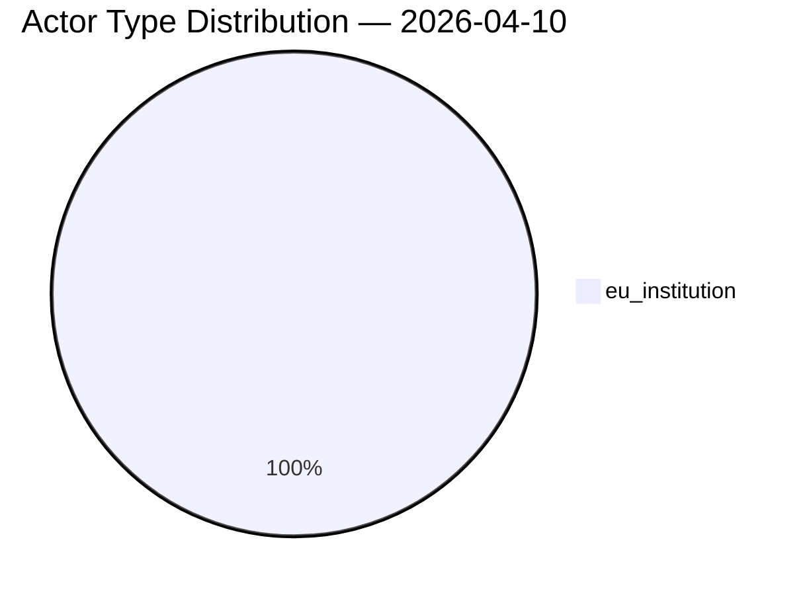

# Political Actor Mapping

## Actors Identified: 2

## Actor Classification

| Actor | Type | Influence | Position | Role |
|-------|------|-----------|----------|------|
| INTA | eu_institution | moderate | ambiguous | Responsible committee |
| ECON | eu_institution | moderate | ambiguous | Responsible committee |

## Type Counts

| Type | Count |
|------|-------|
| eu_institution | 2 |

## Date: 2026-04-10
