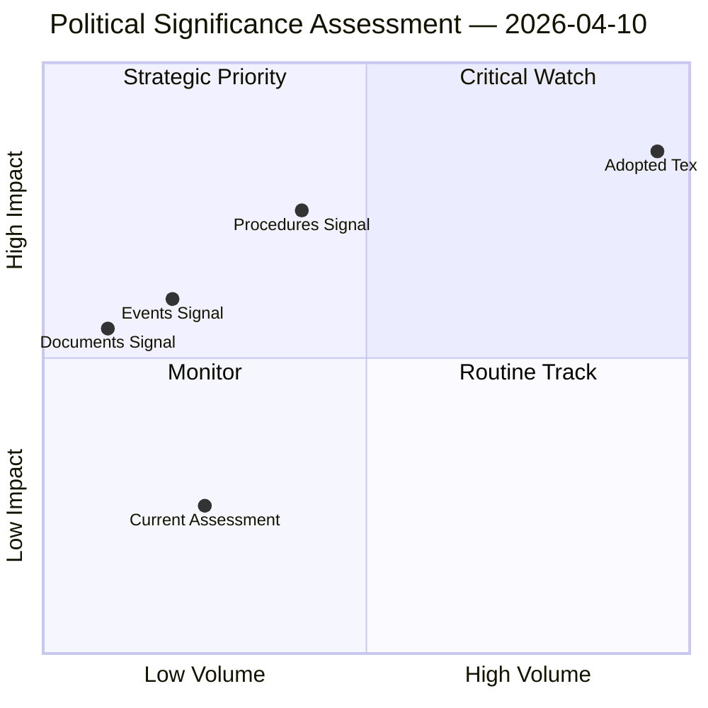

# Political Significance Classification

## Overall Significance: **ROUTINE**

## 5-Signal Model Scores

| Signal | Raw Data | Score |
|--------|----------|-------|
| Volume | 4 events, 2 documents | 0.6/5 |
| Pipeline | 4 procedures | 0.8/5 |
| Output | 11 adopted texts | 2.2/5 |
| Anomalies | Pattern deviation detection | — |
| Coalition | Group alignment analysis | — |

## Data Summary

| Metric | Value |
|--------|-------|
| Computed significance | ROUTINE |
| Total data points | 21 |
| Events | 4 |
| Documents | 2 |
| Procedures | 4 |
| Adopted texts | 11 |
| Date | 2026-04-10 |

## Date: 2026-04-10
