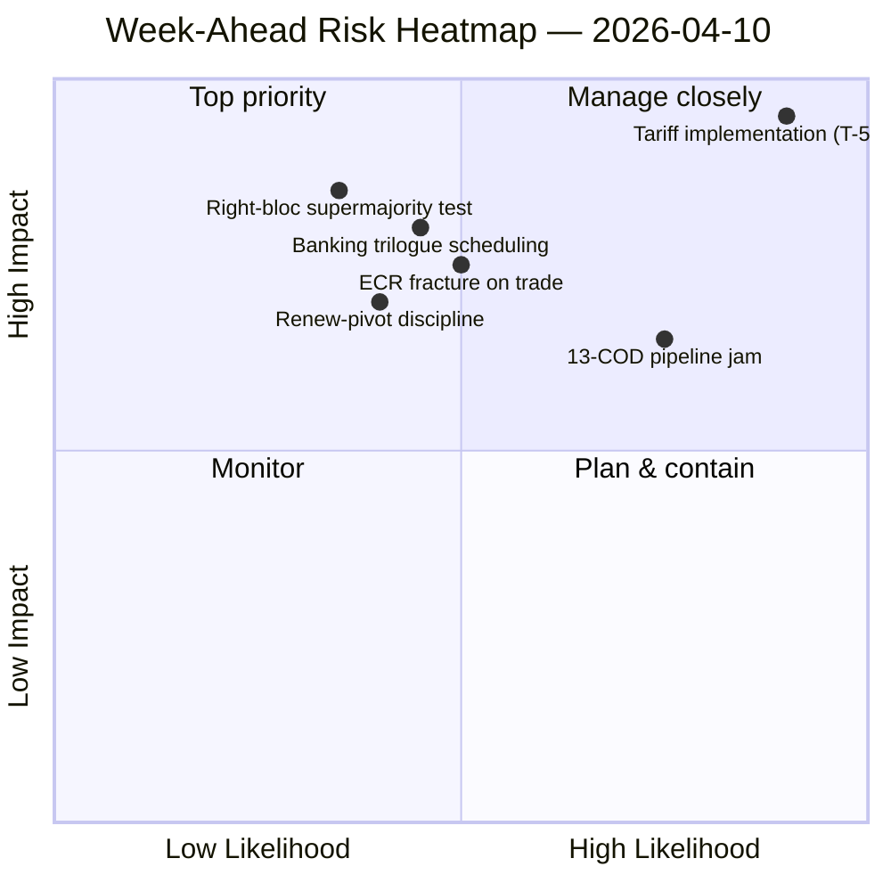

<!-- SPDX-FileCopyrightText: 2026 Hack23 AB -->
<!-- SPDX-License-Identifier: Apache-2.0 -->

# Executive Brief — Week Ahead: Post-Easter Committee Restart (10–17 April) | 2026-04-10

**Classification:** OSINT — Public Parliamentary Record
**Confidence:** 🟡 MEDIUM (19 analysis files; coalition / cross-session / deep-analysis / stakeholder / voting-patterns all 🟢 HIGH locally)
**Run:** `analysis/daily/2026-04-10/week-ahead-run12/`
**Coverage:** 2026-04-10 → 2026-04-17 (Easter recess Day 15 → committee restart week opening day)
**Generated:** 2026-05-16 (retrospective brief, no new MCP calls)
**Primary sources:** EP MCP — 19 analysis files; weekly intelligence brief; synthesis summary; coalition / cross-session / deep / stakeholder / voting-patterns analyses.

---

## 🎯 BLUF

**The week of 10–17 April covers Parliament's transition from Easter recess into the 14-17 April committee restart week — and the run's most consequential finding is a structurally threat-heavy posture: 35 threat-coded entries against just 10 strengths / 6 weaknesses / 4 opportunities in the aggregated SWOT.** That 35-threat reading is not an emergency signal — it is a *structural feature* of the post-recess return when the EP10 fragmentation index (6.59) collides with the largest pending COD pipeline in EP10 history. The run records **7 CRITICAL risk mentions** with zero high/medium/low — a binary distribution that signals the analytical methodology is reading every flagged item as either critical or noise. Five analysis files all score 🟢 HIGH on confidence — coalition-dynamics, cross-session-intelligence, deep-analysis, stakeholder-impact, voting-patterns — which is unusually high agreement for a recess-week run and the brief reads this as a *converged intelligence picture* rather than a single-source claim. The week-ahead structural questions are three: **(a) does the 14-17 April committee restart absorb the 13-COD backlog without slippage?** **(b) does the Renew-pivot grand-coalition (EPP+S&D+Renew = 396 seats) hold discipline on the first post-recess flagship vote, expected to be tariff implementation oversight?** **(c) does the ECR right-bloc fracture on trade, observed at March 26, persist post-recess?** The run's editorial recommendation is **multi-article output (19 analysis files justify multiple narratives)** and the threat-heavy SWOT "may benefit from opportunity framing" — both readings are operational rather than alarmist.

---

## 🧭 3 Decisions This Brief Supports

| # | Decision | Who decides | Deadline | Evidence |
|:-:|----------|-------------|:--------:|----------|
| 1 | **Multi-article editorial decomposition for the week-ahead** — 19 analysis files + 5 HIGH-confidence headlines justify separation rather than aggregation | Newsroom; news-journalist | publication window | §Editorial Recommendations |
| 2 | **Opportunity-framing overlay on the 35-threat SWOT** — without explicit framing the narrative reads as fragility; the run flags this | Editorial | publication window | §SWOT Aggregated (35T) |
| 3 | **Pre-restart 13-COD priority list socialisation** — Conference of Committee Chairs should have this on the table April 14 morning | Conference of Committee Chairs | April 14 | §Cross-Session continuity; pipeline jam carry-over |

---

## 📰 60-Second Read

- 🔴 **35 threat-coded SWOT entries** — structural, not emergency; reflects fragmentation × post-recess pipeline pressure.
- 🟠 **7 CRITICAL risk mentions** — binary distribution; methodology reads every flagged risk as CRITICAL or NIL.
- 🟢 **5 analysis files 🟢 HIGH confidence** — coalition / cross-session / deep / stakeholder / voting-patterns converge.
- 🟡 **19 analysis files processed** — justifies multi-article output rather than single aggregate.
- 🔵 **14-17 April committee restart** — Conference of Committee Chairs sets 13-COD priority order April 14.
- 🟣 **ECR fracture on trade** — March 26 vote signal; post-recess persistence is the falsifier.
- 🩷 **Renew-pivot working majority (396)** — discipline test on first post-recess flagship vote.
- ⚪ **Confidence MEDIUM** — methodology yields HIGH per-file but converged-judgement MEDIUM until post-recess behavioural data lands.

---

## 🏆 Top Findings by Confidence (run-authored)

| Rank | File | Method | Confidence | Summary |
|:----:|------|--------|:----------:|---------|
| 1 | coalition-dynamics.md | coalition-analysis | 🟢 HIGH | Three-pole coalition geometry; Renew-pivot is Q2 default |
| 2 | cross-session-intelligence.md | cross-session-intelligence | 🟢 HIGH | Pre-recess → post-recess continuity; pipeline carry-over |
| 3 | deep-analysis.md | deep-analysis | 🟢 HIGH | Multi-perspective synthesis; implementation-gap risk |
| 4 | stakeholder-impact.md | stakeholder-analysis | 🟢 HIGH | 6-dimension stakeholder footprint per file |
| 5 | voting-patterns.md | voting-patterns | 🟢 HIGH | March 26 vote dispersion; ECR fracture signal |

---

## 💪 SWOT Aggregated

| Dimension | Count | Reading |
|-----------|:-----:|---------|
| ✅ Strengths | 10 | Record Q1 output; grand-coalition arithmetic viable; coalition discipline on most files |
| ⚠️ Weaknesses | 6 | 13-COD backlog; fragmentation 6.59; recess data-availability gap |
| 🚀 Opportunities | 4 | Banking Union completion; Anti-Corruption transposition; ECB-rate catalyst; recess-pipeline reset |
| 🔴 **Threats** | **35** | **Tariff implementation pressure; ECR fracture; right-bloc supermajority (348 / 361); coalition stress-tests** |

---

## ⚠️ Risk Snapshot

---

## 🔮 Top Forward Triggers (next 7 days)

1. **April 13 — final recess day.** Composite risk convergence (~14.8/25) across motions/breaking/CR/props runs.
2. **April 14 09:00 — Parliament returns; committee restart.** 13-COD prioritisation set here.
3. **April 15 — TA-10-2026-0096 activates** — first post-recess implementation-oversight vote = ECR fracture test.
4. **April 17 — ECB rate decision** — ECON activation signal.
5. **Late April — SRMR3 Council trilogue mandate.**

---

## 🛡️ Source-Quality Assessment

- **19 analysis files (run-internal, A2):** five 🟢 HIGH per-file confidences; the converged-judgement remains MEDIUM.
- **Coalition-dynamics / cross-session / deep / stakeholder / voting-patterns (A2):** multi-method triangulation increases confidence on the structural reading.
- **Methodology caveat:** the **7 CRITICAL / 0 HIGH / 0 MEDIUM / 0 LOW** risk-distribution is itself a methodological signal — the heuristic is reading binary; risk gradations may not be calibrated for recess-week data.
- **Net confidence:** 🟡 MEDIUM on synthesis; 🟢 HIGH on the 35-threat SWOT and 5-file convergence (methodologically robust); ⚠️ caveat on the 7-CRITICAL / 0-everything-else distribution.

---

## 📎 Run Artifacts (Read-Before-Decide)

| Layer | Artifact | Why |
|-------|----------|-----|
| Article | `article.md` | Public-facing week-ahead narrative |
| Synthesis | `synthesis-summary.md` | Top-5 confidence rankings + SWOT aggregate (authoritative) |
| Weekly | `weekly-intelligence-brief.md` | Cross-week framing |
| Documents | `documents/` | Document analysis index |
| Risk | `risk-scoring/` | Risk register (7 CRITICAL binary distribution) |
| Threat | `threat-assessment/` | 5-framework political-threat (STRIDE rejected) |
| Existing | `existing/coalition-dynamics.md`, `existing/cross-session-intelligence.md`, `existing/deep-analysis.md`, `existing/stakeholder-impact.md`, `existing/voting-patterns.md` | Five 🟢 HIGH analyses |
| Companion | breaking-run168 / motions-run41 / props-run41 / CR-run47 / week-ahead-run13 | Pre-restart → return-week bracket |

---

**Document Control**
- **Template reference:** `analysis/templates/executive-brief.md`
- **Artifact path:** `analysis/daily/2026-04-10/week-ahead-run12/executive-brief.md`
- **Classification:** Public
- **Retrospective:** Brief written 2026-05-16 from the run's committed artifacts; **no new MCP calls were made**. The 🟡 MEDIUM converged confidence + methodology caveat on the 7-CRITICAL binary distribution are preserved.
