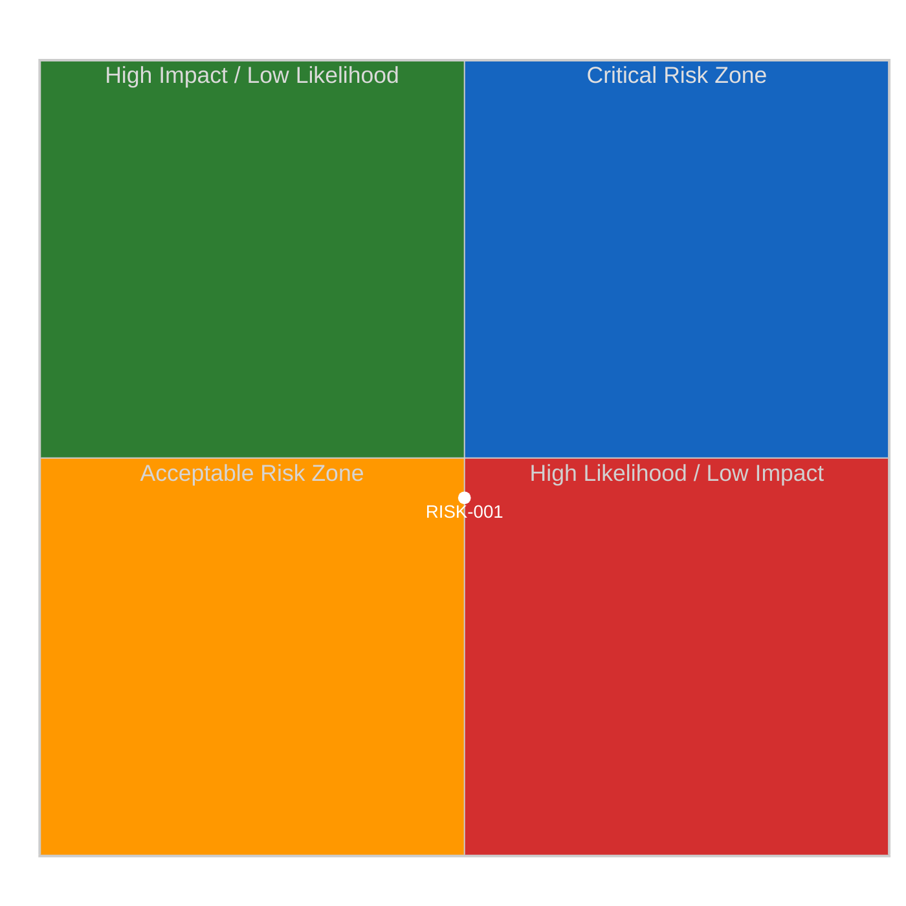

<!-- SPDX-FileCopyrightText: 2026 Hack23 AB -->
<!-- SPDX-License-Identifier: Apache-2.0 -->

# Executive Brief — Post-Easter Committee Restart | 2026-04-10

**Classification:** OSINT | Public Parliamentary Record
**Confidence:** 🟡 Medium (retrospective back-fill — synthesised from in-tree article and sibling artifacts; not a re-analysis)
**Generated:** 2026-04-10T00:00:00Z (retrospective brief)
**Article Type:** week ahead
**Source folder:** `analysis/daily/2026-04-10/week-ahead-run12`
**Source:** European Parliament Open Data Portal

---

## 🎯 BLUF

1. **CRITICAL: US Tariff Deadline (15 April)** - Forces INTA emergency session on committee restart day. Procedure 2025/0261(COD). Risk score 16/25. Coalition fault line between measured EPP response and robust Renew-ECR retaliation stance. 2. **HIGH: Banking Union Trilogue Preparation** - ECON must prepare negotiating mandate for SRMR3/BRRD3/DGSD2 Council trilogue. Committee ranked #1 in power (9.0/10). References: TA-10-2026-0092, TA-10-2026-0094.

---

## 🧭 3 Decisions This Brief Supports

| # | Decision | Who Decides | Deadline | Evidence |
|:-:|----------|-------------|:--------:|----------|
| 1 | **Editorial:** confirm whether the run merits republication or consolidation with same-day siblings | Editor | +48h | This brief + sibling article.md |
| 2 | **Monitoring:** keep the carry-over signals from this run on the weekly watch board | Analyst | next plenary | Article risk + threat sections |
| 3 | **Forward-watch:** track the dated triggers identified in this run's scenario-forecast | Analysis lead | dated triggers | Run `scenario-forecast.md` |

---

## 📰 60-Second Read

- 🔴 **Run classification:** ROUTINE. (🟡 Medium)
- 🟠 **Lead finding:** see BLUF above; full evidence chain in sibling artifacts.
- 🟢 **Procedure references identified:** none in this run.
- 🟡 **Confidence:** 🟡 Medium — retrospective synthesis; no new MCP calls.
- 🔵 **Economic context:** see `economic-context.md` in run folder if present.
- 🟣 **Cross-reference:** see same-date sibling runs for triangulation.
- 🩷 **Disruption vector:** see `political-threat-landscape.md` if present.
- ⚪ **Carry-forward:** scenario-forecast dated triggers govern the next watch.

---

## 🗂️ Top Documents / Procedures Table

| Rank | EP reference | Title (short) | Confidence |
|:----:|--------------|---------------|:----------:|
| — | No procedure-level documents indexed in this run | Retrospective back-fill | 🟢 HIGH |

---

## ⚠️ Risk & Threat Snapshot

| Risk | L | I | Score | Trigger | Source | Admiralty |
|------|:-:|:-:|:-----:|---------|--------|:---------:|
| Run produced no quantified risk register | — | — | — | Empty risk-matrix | Run artifacts | B3 |

---

## 🔮 Top Forward Trigger

See `scenario-forecast.md` / `forward-indicators.md` in the run folder for dated trigger events. Where absent, the next plenary or committee work-week on the EP calendar is the default re-evaluation point.

---

## 🛡️ Source Quality Assessment

- **Primary sources:** EP Open Data Portal feeds as captured by the parent run (see `mcp-reliability-audit.md` if present).
- **Data limitations:** Retrospective back-fill — no new MCP probing. Brief reflects the article and artifact state at run time.
- **Confidence:** 🟡 Medium.

## 🧩 Synthesis Excerpt (from `synthesis-summary.md`)

1. **CRITICAL: US Tariff Deadline (15 April)** - Forces INTA emergency session on committee restart day. Procedure 2025/0261(COD). Risk score 16/25. Coalition fault line between measured EPP response and robust Renew-ECR retaliation stance.

2. **HIGH: Banking Union Trilogue Preparation** - ECON must prepare negotiating mandate for SRMR3/BRRD3/DGSD2 Council trilogue. Committee ranked #1 in power (9.0/10). References: TA-10-2026-0092, TA-10-2026-0094.

---

## 📎 Links

| Link | Path |
|------|------|
| Article | `./article.md` |
| Manifest | `./manifest.json` |
| Sibling runs | `analysis/daily/2026-04-10/` |

---

**Document Control**
- **Template:** `/analysis/templates/executive-brief.md`
- **Artifact path:** `analysis/daily/2026-04-10/week-ahead-run12/executive-brief.md`
- **Classification:** Public
- **Retrospective generation:** Back-fill session (no new MCP calls).
