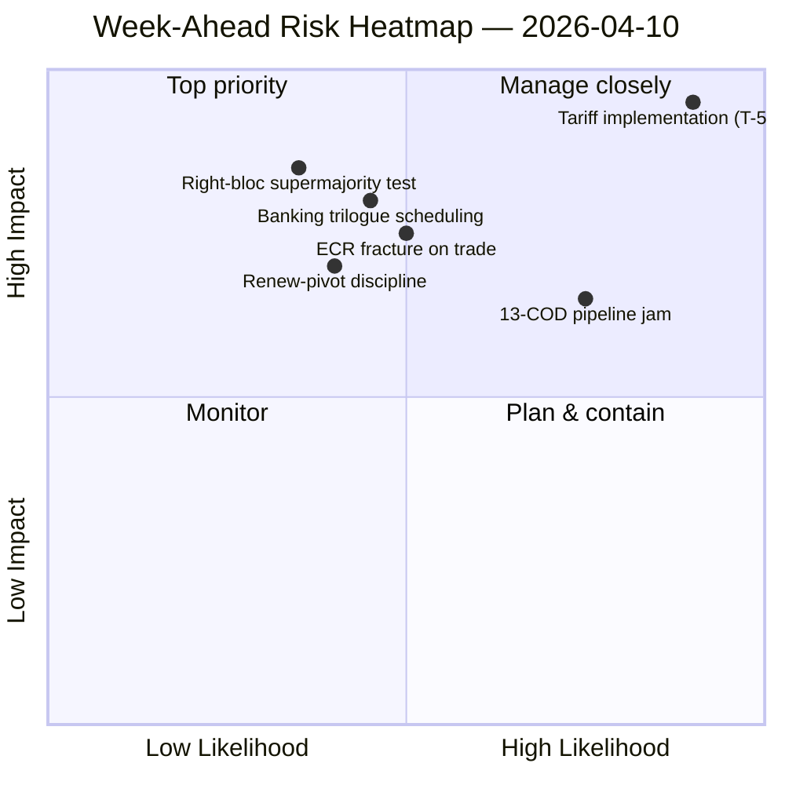

<!-- SPDX-FileCopyrightText: 2024-2026 Hack23 AB -->
<!-- SPDX-License-Identifier: Apache-2.0 -->

# موجز تنفيذي — الأسبوع المقبل: إعادة تشغيل اللجان بعد عيد الفصح (10–17 أبريل) | 2026-04-10

**التصنيف:** OSINT — السجل البرلماني العام
**مستوى الثقة:** 🟡 متوسط (19 ملف تحليل؛ الائتلاف / بين الدورات / التحليل المعمّق / أصحاب المصلحة / أنماط التصويت كلها 🟢 عالية محلياً)
**التشغيل:** `analysis/daily/2026-04-10/week-ahead-run12/`
**النطاق الزمني:** 2026-04-10 → 2026-04-17 (اليوم 15 من إجازة الفصح → أسبوع إعادة تشغيل اللجان)
**تاريخ الإنشاء:** 2026-05-16 (موجز استرجاعي، لا استدعاءات MCP جديدة)
**المصادر الأولية:** EP MCP — 19 ملف تحليل؛ تقرير الاستخبارات الأسبوعي؛ ملخص تركيبي؛ تحليلات الائتلافات / بين الدورات / المعمّقة / أصحاب المصلحة / أنماط التصويت.

---

## 🎯 الخلاصة التنفيذية

**تغطي أسبوع 10 إلى 17 أبريل مرحلة انتقال البرلمان من نهاية إجازة عيد الفصح إلى أسبوع إعادة تشغيل اللجان من 14 إلى 17 أبريل — والنتيجة الأكثر حسماً لهذا التشغيل هي موقف مثقل هيكلياً بالتهديدات: 35 مدخلاً مصنّفاً كتهديد مقابل 10 نقاط قوة فحسب / 6 نقاط ضعف / 4 فرص في تحليل SWOT المجمّع.** نتيجة 35 تهديداً ليست إشارة طوارئ — بل هي *سمة هيكلية* للعودة بعد الإجازة عندما يتصادم مؤشر تشرذم EP10 (6.59) مع أكبر خط أنابيب COD معلّق في تاريخ EP10. يسجّل التشغيل **7 إشارات مخاطر حرجة** مع صفر عالية/متوسطة/منخفضة — توزيع ثنائي يشير إلى أن المنهجية التحليلية تقرأ كل عنصر مُعلَّم إما كحرج أو كضوضاء. تحصل خمسة ملفات تحليل على ثقة 🟢 عالية كاملة — ديناميكيات الائتلاف، الاستخبارات بين الدورات، التحليل المعمّق، تأثير أصحاب المصلحة، أنماط التصويت — وهو مستوى توافق غير عادي لتشغيل أسبوع إجازة، ويقرأ الموجز هذا على أنه *صورة استخباراتية متقاربة* بدلاً من ادعاء مصدر واحد. الأسئلة الهيكلية الاستشرافية للأسبوع ثلاثة: **(أ) هل يستوعب إعادة تشغيل اللجان من 14 إلى 17 أبريل متأخرات 13 COD دون تأخير؟** **(ب) هل تحافظ الائتلاف الكبير لمحور Renew (EPP+S&D+Renew = 396 مقعداً) على الانضباط في أول تصويت مرجعي ما بعد الإجازة، المتوقع حول رقابة تنفيذ التعريفات الجمركية؟** **(ج) هل تستمر كسر كتلة اليمين ECR في الملف التجاري، الذي لوحظ في 26 مارس، بعد الإجازة؟** التوصية التحريرية للتشغيل هي **إنتاج متعدد المقالات (19 ملف تحليل تبرر روايات متعددة)** وأن SWOT المثقل بالتهديدات "قد يستفيد من إطار الفرص" — كلتا القراءتين تشغيليتان بدلاً من أن تكونا استنفاريتين.

---

## 🧭 3 قرارات يدعمها هذا الموجز

| # | القرار | من يقرر | الموعد النهائي | الأدلة |
|:-:|--------|---------|:-------------:|--------|
| 1 | **تفكيك تحريري متعدد المقالات للأسبوع المقبل** — 19 ملف تحليل + 5 عناوين بثقة عالية تبرر الفصل بدلاً من التجميع | غرفة الأخبار؛ news-journalist | نافذة النشر | §التوصيات التحريرية |
| 2 | **تراكب إطار الفرص على SWOT الـ35 تهديداً** — بدون إطار صريح تُقرأ الرواية كهشاشة؛ التشغيل يشير إلى هذا | غرفة الأخبار | نافذة النشر | §SWOT المجمّع (35T) |
| 3 | **التوعية بقائمة أولويات 13 COD قبل إعادة التشغيل** — ينبغي أن تضعها مؤتمر رؤساء اللجان على طاولتها صباح 14 أبريل | مؤتمر رؤساء اللجان | 14 أبريل | §الاستمرارية بين الدورات؛ اختناق خط الأنابيب المُحمَّل |

---

## 📰 القراءة في 60 ثانية

- 🔴 **35 مدخل SWOT مصنّف كتهديد** — هيكلي، ليس طارئاً؛ يعكس التشرذم × ضغط خط الأنابيب ما بعد الإجازة.
- 🟠 **7 إشارات مخاطر حرجة** — توزيع ثنائي؛ المنهجية تقرأ كل خطر مُعلَّم حرجاً أو لاشيء.
- 🟢 **5 ملفات تحليل 🟢 ثقة عالية** — الائتلاف / بين الدورات / عميق / أصحاب المصلحة / التصويت تتقارب.
- 🟡 **19 ملف تحليل تمت معالجته** — يبرر إنتاجاً متعدد المقالات بدلاً من تجميع واحد.
- 🔵 **إعادة تشغيل اللجان 14–17 أبريل** — مؤتمر رؤساء اللجان يحدد ترتيب أولويات 13 COD في 14 أبريل.
- 🟣 **كسر ECR في التجارة** — إشارة تصويت 26 مارس؛ الاستمرار بعد الإجازة هو المُكذِّب.
- 🩷 **الأغلبية العاملة لمحور Renew (396)** — اختبار الانضباط في أول تصويت مرجعي بعد الإجازة.
- ⚪ **الثقة متوسطة** — المنهجية تعطي عالية لكل ملف لكن الحكم المتقارب متوسط حتى وصول بيانات السلوك بعد الإجازة.

---

## 🏆 أفضل النتائج حسب الثقة (مكتوبة أثناء التشغيل)

| الترتيب | الملف | الأسلوب | الثقة | الملخص |
|:-------:|-------|---------|:-----:|--------|
| 1 | coalition-dynamics.md | تحليل الائتلاف | 🟢 عالية | هندسة ائتلاف ثلاثية الأقطاب؛ محور Renew هو الافتراضي للربع الثاني |
| 2 | cross-session-intelligence.md | الاستخبارات بين الدورات | 🟢 عالية | الاستمرارية قبل الإجازة → بعد الإجازة؛ نقل خط الأنابيب |
| 3 | deep-analysis.md | تحليل معمّق | 🟢 عالية | تركيب متعدد المنظورات؛ خطر فجوة التنفيذ |
| 4 | stakeholder-impact.md | تحليل أصحاب المصلحة | 🟢 عالية | بصمة أصحاب المصلحة 6 أبعاد لكل ملف |
| 5 | voting-patterns.md | أنماط التصويت | 🟢 عالية | تشتت تصويت 26 مارس؛ إشارة كسر ECR |

---

## 💪 SWOT المجمّع

| البُعد | العدد | القراءة |
|--------|:-----:|---------|
| ✅ نقاط القوة | 10 | إنتاج قياسي للربع الأول؛ حسابيات الائتلاف الكبير قابلة للتطبيق؛ انضباط الائتلاف في معظم الملفات |
| ⚠️ نقاط الضعف | 6 | متأخرات 13 COD؛ التشرذم 6.59؛ فجوة توافر البيانات خلال الإجازة |
| 🚀 الفرص | 4 | إكمال الاتحاد المصرفي؛ نقل مكافحة الفساد؛ محفّز معدلات البنك المركزي الأوروبي؛ إعادة ضبط خط الأنابيب بعد الإجازة |
| 🔴 **التهديدات** | **35** | **ضغط تنفيذ التعريفات الجمركية؛ كسر ECR؛ أغلبية كتلة اليمين الساحقة (348/361)؛ اختبارات ضغط الائتلاف** |

---

## ⚠️ لقطة المخاطر

---

## 🔮 أبرز المحفزات المستقبلية (الـ7 أيام القادمة)

1. **13 أبريل — آخر يوم إجازة.** تقارب مركّب للمخاطر (~14.8/25) عبر تشغيلات motions/breaking/CR/props.
2. **14 أبريل 09:00 — عودة البرلمان؛ إعادة تشغيل اللجان.** يُحدَّد ترتيب أولويات 13 COD هنا.
3. **15 أبريل — TA-10-2026-0096 يُفعَّل** — أول تصويت رقابي على تنفيذ ما بعد الإجازة = اختبار كسر ECR.
4. **17 أبريل — قرار معدل البنك المركزي الأوروبي** — إشارة تفعيل ECON.
5. **أواخر أبريل — ولاية مفاوضات مجلس SRMR3.**

---

## 🛡️ تقييم جودة المصادر

- **19 ملف تحليل (داخلي للتشغيل، A2):** خمس ثقات 🟢 عالية لكل ملف؛ يبقى الحكم المتقارب متوسطاً.
- **ديناميكيات الائتلاف / بين الدورات / عميق / أصحاب المصلحة / التصويت (A2):** التثليث متعدد الأساليب يعزز الثقة في القراءة الهيكلية.
- **التحفظ المنهجي:** توزيع المخاطر **7 حرجة / 0 عالية / 0 متوسطة / 0 منخفضة** هو بحد ذاته إشارة منهجية — الاستدلال يقرأ بشكل ثنائي؛ التدرجات قد لا تكون مُعايَرة لبيانات أسبوع الإجازة.
- **الثقة الصافية:** 🟡 متوسطة في التركيب؛ 🟢 عالية في SWOT الـ35 تهديداً وتقارب 5 ملفات (متيّن منهجياً)؛ ⚠️ تحفظ على توزيع 7-حرجة / 0-كل-شيء-آخر.

---

## 📎 مخرجات التشغيل (اقرأ-قبل-القرار)

| الطبقة | المخرج | السبب |
|--------|--------|-------|
| المقال | `article.md` | رواية الأسبوع العامة الاستشرافية |
| التركيب | `synthesis-summary.md` | تصنيفات الثقة الأعلى-5 + SWOT المجمّع (مرجعي) |
| الأسبوعي | `weekly-intelligence-brief.md` | الإطار بين الأسابيع |
| الوثائق | `documents/` | فهرس تحليل الوثائق |
| الخطر | `risk-scoring/` | سجل المخاطر (توزيع 7 حرجة ثنائي) |
| التهديد | `threat-assessment/` | التهديد السياسي بـ5 أطر (رُفض STRIDE) |
| الموجودة | `existing/coalition-dynamics.md`، `existing/cross-session-intelligence.md`، `existing/deep-analysis.md`، `existing/stakeholder-impact.md`، `existing/voting-patterns.md` | خمسة تحليلات 🟢 عالية |
| المرافقات | breaking-run168 / motions-run41 / props-run41 / CR-run47 / week-ahead-run13 | قوس ما قبل إعادة التشغيل → أسبوع العودة |

---

**التحكم بالوثيقة**
- **مرجع القالب:** `analysis/templates/executive-brief.md`
- **مسار المخرج:** `analysis/daily/2026-04-10/week-ahead-run12/executive-brief.md`
- **التصنيف:** عام
- **استرجاعي:** كُتب الموجز في 2026-05-16 من مخرجات التشغيل المُلتزمة؛ **لم تُجرَ استدعاءات MCP جديدة**. الثقة المتقاربة 🟡 المتوسطة + التحفظ المنهجي على التوزيع الثنائي لـ7 حرج محفوظان.
