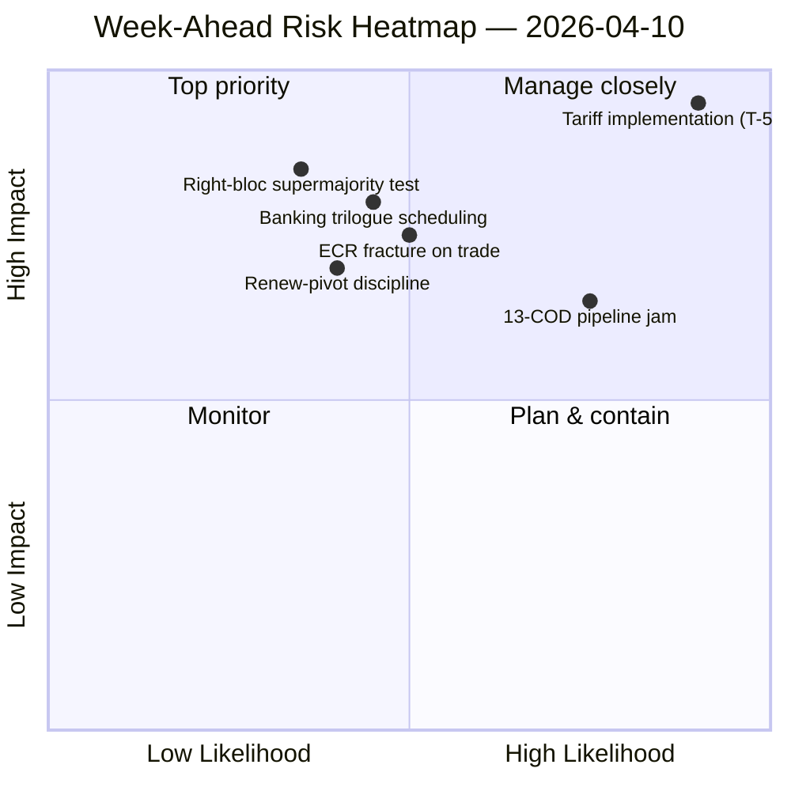

<!-- SPDX-FileCopyrightText: 2024-2026 Hack23 AB -->
<!-- SPDX-License-Identifier: Apache-2.0 -->

# Udøvende resumé — Ugen forude: Genstart af udvalg efter påske (10.–17. april) | 2026-04-10

**Klassificering:** OSINT — Offentlig parlamentarisk protokol
**Tillid:** 🟡 MEDIUM (19 analysefiler; koalition / kryds-sessions- / dybde- / interessent- / afstemningsanalyser alle 🟢 HØJ lokalt)
**Kørsel:** `analysis/daily/2026-04-10/week-ahead-run12/`
**Dækning:** 2026-04-10 → 2026-04-17 (påskeferiens dag 15 → udvalgsgenstart-uge)
**Genereret:** 2026-05-16 (retrospektivt resumé, ingen nye MCP-kald)
**Primære kilder:** EP MCP — 19 analysefiler; ugentlig efterretningsrapport; synteseresumé; koalitions- / kryds-sessions- / dybde- / interessent- / afstemningsanalyser.

---

## 🎯 BLUF

**Ugen 10.–17. april dækker Parlamentets overgang fra påskeferien til udvalgsgenstart-ugen 14.–17. april — og kørslens mest afgørende fund er en strukturelt trussel-tung holdning: 35 trussel-kodede poster mod blot 10 styrker / 6 svagheder / 4 muligheder i den aggregerede SWOT.** Det 35-trussel-resultat er ikke et krisesignal — det er et *strukturelt træk* ved genkomsten efter ferien, når EP10's fragmenteringsindeks (6,59) kolliderer med den største verserende COD-pipeline i EP10's historie. Kørslen registrerer **7 KRITISKE risikonævnelser** med nul høje/mellemstore/lave — en binær fordeling der signalerer, at den analytiske metodologi læser hvert markeret element som enten kritisk eller støj. Fem analysefiler scorer alle 🟢 HØJ tillid — koalitionsdynamik, kryds-sessionseftretning, dybdeanalyse, interessentpåvirkning, afstemningsanalyser — hvilket er usædvanlig høj enighed for en feriekørsel, og resuméet læser dette som et *konvergeret efterretningsbillede* snarere end et enkilt-kildepåstand. Ugernes fremadgående strukturelle spørgsmål er tre: **(a) absorberer udvalgsgenstart 14.–17. april de 13 COD-efterslæb uden forskydning?** **(b) holder Renew-pivot storflertallets (EPP+S&D+Renew = 396 pladser) disciplin ved den første post-ferie flagafstemning, forventet at omhandle tarifimplementeringstilsyn?** **(c) vedvarer ECR's højreblok-brud på handel, observeret 26. marts, efter ferien?** Kørslens redaktionelle anbefaling er **multi-artikel-output (19 analysefiler retfærdiggør adskillige fortællinger)** og den trussel-tunge SWOT "kan gavn af mulighedsindrammning" — begge læsninger er operationelle snarere end alarmistiske.

---

## 🧭 3 Beslutninger dette resumé støtter

| # | Beslutning | Hvem beslutter | Deadline | Bevis |
|:-:|------------|----------------|:--------:|-------|
| 1 | **Multi-artikel-redaktionel nedbrydning for ugen forude** — 19 analysefiler + 5 HØJ-tillid overskrifter retfærdiggør separation snarere end aggregering | Redaktion; news-journalist | udgivelsesvindue | §Redaktionelle anbefalinger |
| 2 | **Mulighedsindramningsoverlagring på 35-truslernes SWOT** — uden eksplicit indramning læses fortællingen som skrøbelighed; kørslen flagger dette | Redaktion | udgivelsesvindue | §SWOT Aggregeret (35T) |
| 3 | **Pre-genstart 13-COD prioriteringsliste-socialisering** — Konferencen af udvalgspræsidenter bør have dette på bordet den 14. april om morgenen | Konferencen af udvalgspræsidenter | 14. april | §Kryds-sessionskontinuitet; pipeline-stopover |

---

## 📰 60 sekunders læsning

- 🔴 **35 trussel-kodede SWOT-poster** — strukturelle, ikke nødsituation; afspejler fragmentering × post-ferie pipeline-pres.
- 🟠 **7 KRITISKE risikonævnelser** — binær fordeling; metodologien læser hver markeret risiko som KRITISK eller NIL.
- 🟢 **5 analysefiler 🟢 HØJ tillid** — koalition / kryds-session / dybde / interessenter / afstemninger konvergerer.
- 🟡 **19 analysefiler behandlet** — retfærdiggør multi-artikel-output snarere end enkelt aggregat.
- 🔵 **Udvalgsgenstart 14.–17. april** — Konferencen af udvalgspræsidenter fastlægger 13-COD prioritetsorden 14. april.
- 🟣 **ECR-brud på handel** — afstemningssignal 26. marts; vedvarenhed efter ferien er falsifikatoren.
- 🩷 **Renew-pivot fungerende flertal (396)** — disciplintest ved den første post-ferie flagafstemning.
- ⚪ **Tillid MEDIUM** — metodologien giver HØJ per fil, men konvergeret vurdering MEDIUM indtil post-ferie adfærdsdata lander.

---

## 🏆 Topfund efter tillid (kørselforfattet)

| Rang | Fil | Metode | Tillid | Resumé |
|:----:|-----|--------|:------:|--------|
| 1 | coalition-dynamics.md | koalitionsanalyse | 🟢 HØJ | Tre-pol koalitionsgeometri; Renew-pivot er Q2-standard |
| 2 | cross-session-intelligence.md | kryds-sessionseftretning | 🟢 HØJ | Pre-ferie → post-ferie kontinuitet; pipeline-videreføring |
| 3 | deep-analysis.md | dybdeanalyse | 🟢 HØJ | Flersynsvinklet syntese; implementeringsgab-risiko |
| 4 | stakeholder-impact.md | interessentanalyse | 🟢 HØJ | 6-dimensioners interessentfodspor per fil |
| 5 | voting-patterns.md | afstemningsanalyser | 🟢 HØJ | 26. marts afstemningsspredning; ECR-bruksignal |

---

## 💪 SWOT Aggregeret

| Dimension | Antal | Læsning |
|-----------|:-----:|---------|
| ✅ Styrker | 10 | Rekord Q1-output; storflertallets aritmetik levedygtig; koalitionsdisciplin i de fleste filer |
| ⚠️ Svagheder | 6 | 13-COD efterslæb; fragmentering 6,59; datatilgængelighedsgab under ferien |
| 🚀 Muligheder | 4 | Bankunionfuldførelse; anti-korruptionsgennemførelse; ECB-rentekatalysator; pipeline-genstart efter ferien |
| 🔴 **Trusler** | **35** | **Tarifimplementeringstryk; ECR-brud; højreblok-supermajoritet (348/361); koalitionsstresstest** |

---

## ⚠️ Risikoøjebliksbillede

---

## 🔮 Top Fremtidige Udløsere (næste 7 dage)

1. **13. april — sidste feriedag.** Sammensat risikokonvergens (~14,8/25) på tværs af motions/breaking/CR/props-kørsler.
2. **14. april 09:00 — Parlamentet vender tilbage; udvalgsgenstart.** 13-COD prioritering fastlægges her.
3. **15. april — TA-10-2026-0096 aktiveres** — første post-ferie implementeringstilsynsafstemning = ECR-brudtest.
4. **17. april — ECB-rentebeslutning** — ECON-aktiveringssignal.
5. **Sent april — SRMR3 Råds-trilogemandat.**

---

## 🛡️ Kildekvalitetsvurdering

- **19 analysefiler (kørselsinterne, A2):** fem 🟢 HØJ per-fil-tillid; den konvergerede vurdering forbliver MEDIUM.
- **Koalitionsdynamik / kryds-session / dybde / interessenter / afstemninger (A2):** multi-metode-triangulering øger tilliden på den strukturelle læsning.
- **Metodologisk forbehold:** den **7 KRITISKE / 0 HØJ / 0 MEDIUM / 0 LAV** risikofordeling er i sig selv et metodologisk signal — heuristikken læser binært; risikoniveauer er muligvis ikke kalibreret til ferieuge-data.
- **Nettotillid:** 🟡 MEDIUM på syntese; 🟢 HØJ på 35-truslernes SWOT og 5-filskonvergens (metodologisk robust); ⚠️ forbehold for 7-KRITISKE / 0-alt-andet-fordelingen.

---

## 📎 Kørselsgenstande (Læs-Inden-Beslut)

| Lag | Genstand | Hvorfor |
|-----|----------|---------|
| Artikel | `article.md` | Offentlig fremadrettet ugfortælling |
| Syntese | `synthesis-summary.md` | Top-5 tillidsrangering + SWOT-aggregat (autoritativt) |
| Ugentlig | `weekly-intelligence-brief.md` | Tværugsindrammning |
| Dokumenter | `documents/` | Dokumentanalyseindeks |
| Risiko | `risk-scoring/` | Risikoregister (7 KRITISKE binær fordeling) |
| Trussel | `threat-assessment/` | 5-ramme politisk trussel (STRIDE afvist) |
| Eksisterende | `existing/coalition-dynamics.md`, `existing/cross-session-intelligence.md`, `existing/deep-analysis.md`, `existing/stakeholder-impact.md`, `existing/voting-patterns.md` | Fem 🟢 HØJ analyser |
| Ledsagere | breaking-run168 / motions-run41 / props-run41 / CR-run47 / week-ahead-run13 | Pre-genstart → tilbagevendende-uge-parentes |

---

**Dokumentkontrol**
- **Skabelonreference:** `analysis/templates/executive-brief.md`
- **Genstandssti:** `analysis/daily/2026-04-10/week-ahead-run12/executive-brief.md`
- **Klassificering:** Offentlig
- **Retrospektiv:** Resumé skrevet 2026-05-16 fra kørslens committede genstande; **ingen nye MCP-kald blev foretaget**. Den 🟡 MEDIUM-konvergerede tillid + metodologisk forbehold for den 7-KRITISKE binære fordeling bevares.
