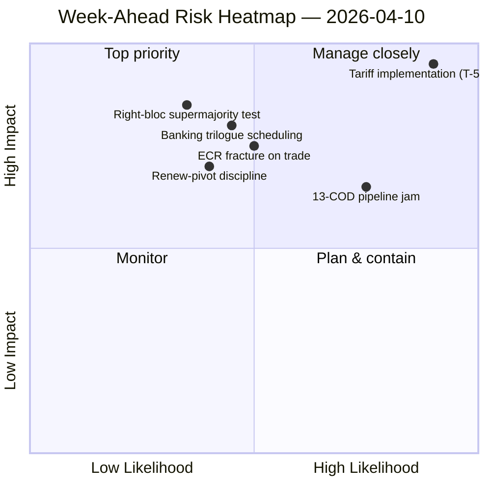

<!-- SPDX-FileCopyrightText: 2024-2026 Hack23 AB -->
<!-- SPDX-License-Identifier: Apache-2.0 -->

# Lageübersicht — Woche voraus: Neustart der Ausschüsse nach Ostern (10.–17. April) | 2026-04-10

**Klassifizierung:** OSINT — Öffentliche parlamentarische Aufzeichnung
**Vertrauen:** 🟡 MITTEL (19 Analysedateien; Koalition / Sitzungsübergreifend / Tiefenanalyse / Stakeholder / Abstimmungsanalysen alle 🟢 HOCH lokal)
**Lauf:** `analysis/daily/2026-04-10/week-ahead-run12/`
**Abdeckung:** 2026-04-10 → 2026-04-17 (Osterferientag 15 → Ausschuss-Neustartswoche)
**Erstellt:** 2026-05-16 (retrospektiver Brief, keine neuen MCP-Aufrufe)
**Primärquellen:** EP MCP — 19 Analysedateien; wöchentlicher Geheimdienstbericht; Synthesezusammenfassung; Koalitions- / sitzungsübergreifende / Tiefen- / Stakeholder- / Abstimmungsanalysen.

---

## 🎯 BLUF

**Die Woche vom 10.–17. April deckt den Übergang des Parlaments aus der Osterpause in die Ausschuss-Neustartswoche 14.–17. April ab — und der bedeutsamste Befund des Laufs ist eine strukturell bedrohungslastige Haltung: 35 bedrohungscodierte Einträge gegen nur 10 Stärken / 6 Schwächen / 4 Chancen in der aggregierten SWOT.** Das 35-Bedrohungs-Ergebnis ist kein Notsignal — es ist ein *strukturelles Merkmal* der Rückkehr nach der Pause, wenn der EP10-Fragmentierungsindex (6,59) mit der größten ausstehenden COD-Pipeline in der EP10-Geschichte kollidiert. Der Lauf verzeichnet **7 KRITISCHE Risikoerwähnungen** mit null hohen/mittleren/niedrigen — eine binäre Verteilung, die signalisiert, dass die analytische Methodik jedes markierte Element entweder als kritisch oder als Rauschen liest. Fünf Analysedateien erzielen alle 🟢 HOCH Vertrauen — Koalitionsdynamik, sitzungsübergreifende Nachrichtendienste, Tiefenanalyse, Stakeholder-Einfluss, Abstimmungsanalysen — was eine ungewöhnlich hohe Übereinstimmung für einen Pausenlauf ist, und der Brief liest dies als *konvergiertes Nachrichtenbild* statt als Einzelquellen-Behauptung. Die vorausschauenden strukturellen Fragen der Woche sind drei: **(a) absorbiert der Ausschuss-Neustart 14.–17. April die 13 COD-Rückstände ohne Verzögerung?** **(b) hält die Renew-Pivot-Großkoalition (EVP+S&D+Renew = 396 Sitze) Disziplin bei der ersten Flaggen-Abstimmung nach der Pause, die voraussichtlich die Überwachung der Zolltarifimplementierung betrifft?** **(c) bleibt der ECR-Rechtsblockbruch beim Handel, der am 26. März beobachtet wurde, nach der Pause bestehen?** Die redaktionelle Empfehlung des Laufs ist **Multi-Artikel-Ausgabe (19 Analysedateien rechtfertigen mehrere Narrative)** und die bedrohungslastige SWOT "könnte von Chancen-Framing profitieren" — beide Lesarten sind operativ statt alarmistisch.

---

## 🧭 3 Entscheidungen, die dieser Brief unterstützt

| # | Entscheidung | Wer entscheidet | Frist | Belege |
|:-:|--------------|-----------------|:-----:|--------|
| 1 | **Multi-Artikel-Redaktionszergliederung für die Vorauswoche** — 19 Analysedateien + 5 HOCH-Vertrauen-Schlagzeilen rechtfertigen Trennung statt Aggregierung | Newsroom; news-journalist | Veröffentlichungsfenster | §Redaktionelle Empfehlungen |
| 2 | **Chancen-Framing-Overlay auf der 35-Bedrohungs-SWOT** — ohne explizites Framing wird das Narrativ als Brüchigkeit gelesen; der Lauf markiert dies | Redaktion | Veröffentlichungsfenster | §SWOT Aggregiert (35B) |
| 3 | **Pre-Neustart 13-COD-Prioritätslisten-Sozialisierung** — die Konferenz der Ausschussvorsitzenden sollte dies am Morgen des 14. April auf dem Tisch haben | Konferenz der Ausschussvorsitzenden | 14. April | §Sitzungsübergreifende Kontinuität; Pipeline-Stau-Übertrag |

---

## 📰 60-Sekunden-Lektüre

- 🔴 **35 bedrohungscodierte SWOT-Einträge** — strukturell, kein Notfall; spiegelt Fragmentierung × Post-Pause-Pipeline-Druck wider.
- 🟠 **7 KRITISCHE Risikoerwähnungen** — binäre Verteilung; Methodik liest jedes markierte Risiko als KRITISCH oder NIL.
- 🟢 **5 Analysedateien 🟢 HOCH Vertrauen** — Koalition / sitzungsübergreifend / Tiefe / Stakeholder / Abstimmungen konvergieren.
- 🟡 **19 Analysedateien bearbeitet** — rechtfertigt Multi-Artikel-Ausgabe statt eines einzelnen Aggregats.
- 🔵 **Ausschuss-Neustart 14.–17. April** — Konferenz der Ausschussvorsitzenden legt 13-COD-Prioritätsreihenfolge am 14. April fest.
- 🟣 **ECR-Bruch beim Handel** — Abstimmungssignal vom 26. März; Persistenz nach der Pause ist der Falsifikator.
- 🩷 **Renew-Pivot funktionierende Mehrheit (396)** — Disziplintest bei der ersten Flaggen-Abstimmung nach der Pause.
- ⚪ **Vertrauen MITTEL** — Methodik ergibt HOCH pro Datei, aber konvergierte Beurteilung MITTEL bis Post-Pause-Verhaltensdaten eintreffen.

---

## 🏆 Top-Befunde nach Vertrauen (laufverfasst)

| Rang | Datei | Methode | Vertrauen | Zusammenfassung |
|:----:|-------|---------|:---------:|-----------------|
| 1 | coalition-dynamics.md | Koalitionsanalyse | 🟢 HOCH | Dreipolige Koalitionsgeometrie; Renew-Pivot ist Q2-Standard |
| 2 | cross-session-intelligence.md | Sitzungsübergreifende Nachrichtendienste | 🟢 HOCH | Vor-Pause → Nach-Pause Kontinuität; Pipeline-Übertrag |
| 3 | deep-analysis.md | Tiefenanalyse | 🟢 HOCH | Mehrperspektivische Synthese; Umsetzungslücken-Risiko |
| 4 | stakeholder-impact.md | Stakeholder-Analyse | 🟢 HOCH | 6-dimensionaler Stakeholder-Fußabdruck pro Datei |
| 5 | voting-patterns.md | Abstimmungsanalysen | 🟢 HOCH | 26-März-Abstimmungsstreuung; ECR-Bruchsignal |

---

## 💪 SWOT Aggregiert

| Dimension | Anzahl | Lesart |
|-----------|:------:|--------|
| ✅ Stärken | 10 | Rekord-Q1-Ausgabe; Großkoalitions-Arithmetik tragfähig; Koalitionsdisziplin bei den meisten Dateien |
| ⚠️ Schwächen | 6 | 13-COD-Rückstand; Fragmentierung 6,59; Datenverfügbarkeitslücke während der Pause |
| 🚀 Chancen | 4 | Bankenunionsvervollständigung; Antikorruptions-Transposition; EZB-Zinskatalysator; Pipeline-Neustart nach der Pause |
| 🔴 **Bedrohungen** | **35** | **Zolltarifimplementierungsdruck; ECR-Bruch; Rechtsblock-Supermajorität (348/361); Koalitionsstresstest** |

---

## ⚠️ Risikoübersicht

---

## 🔮 Top Vorauslöser (nächste 7 Tage)

1. **13. April — letzter Pausentag.** Zusammengesetzte Risikokonvergenz (~14,8/25) über motions/breaking/CR/props-Läufe.
2. **14. April 09:00 — Parlament kehrt zurück; Ausschuss-Neustart.** 13-COD-Priorisierung wird hier festgelegt.
3. **15. April — TA-10-2026-0096 aktiviert** — erste Umsetzungsüberwachungsabstimmung nach der Pause = ECR-Bruchtest.
4. **17. April — EZB-Zinsentscheidung** — ECON-Aktivierungssignal.
5. **Spätes April — SRMR3-Ratsverhandlungsmandat.**

---

## 🛡️ Quellenqualitätsbewertung

- **19 Analysedateien (laufintern, A2):** fünf 🟢 HOCH pro-Datei-Vertrauen; die konvergierte Beurteilung bleibt MITTEL.
- **Koalitionsdynamik / sitzungsübergreifend / Tiefe / Stakeholder / Abstimmungen (A2):** Multi-Methoden-Triangulation erhöht das Vertrauen in die strukturelle Lesart.
- **Methodischer Vorbehalt:** die **7 KRITISCHE / 0 HOCH / 0 MITTEL / 0 NIEDRIG** Risikoverteilung ist selbst ein methodisches Signal — die Heuristik liest binär; Risikoabstufungen sind möglicherweise nicht für Pausenwochendaten kalibriert.
- **Nettovertrauen:** 🟡 MITTEL auf Synthese; 🟢 HOCH auf der 35-Bedrohungs-SWOT und 5-Datei-Konvergenz (methodisch robust); ⚠️ Vorbehalt zur 7-KRITISCH / 0-alles-andere-Verteilung.

---

## 📎 Lauf-Artefakte (Lesen-Vor-Entscheidung)

| Schicht | Artefakt | Warum |
|---------|----------|-------|
| Artikel | `article.md` | Öffentliches vorausschauendes Wochennarrativ |
| Synthese | `synthesis-summary.md` | Top-5-Vertrauen-Rankings + SWOT-Aggregat (maßgebend) |
| Wöchentlich | `weekly-intelligence-brief.md` | Wochenübergreifende Rahmung |
| Dokumente | `documents/` | Dokumentanalyseindex |
| Risiko | `risk-scoring/` | Risikoregister (7 KRITISCHE binäre Verteilung) |
| Bedrohung | `threat-assessment/` | 5-Rahmen politische Bedrohung (STRIDE abgelehnt) |
| Bestehende | `existing/coalition-dynamics.md`, `existing/cross-session-intelligence.md`, `existing/deep-analysis.md`, `existing/stakeholder-impact.md`, `existing/voting-patterns.md` | Fünf 🟢 HOCH Analysen |
| Begleiter | breaking-run168 / motions-run41 / props-run41 / CR-run47 / week-ahead-run13 | Vor-Neustart → Rückkehrungs-Woche-Klammer |

---

**Dokumentenkontrolle**
- **Vorlagenreferenz:** `analysis/templates/executive-brief.md`
- **Artefaktpfad:** `analysis/daily/2026-04-10/week-ahead-run12/executive-brief.md`
- **Klassifizierung:** Öffentlich
- **Retrospektiv:** Brief geschrieben am 2026-05-16 aus den committeten Artefakten des Laufs; **keine neuen MCP-Aufrufe wurden gemacht**. Das 🟡 MITTEL-konvergierte Vertrauen + methodischer Vorbehalt zur 7-KRITISCHEN binären Verteilung werden beibehalten.
