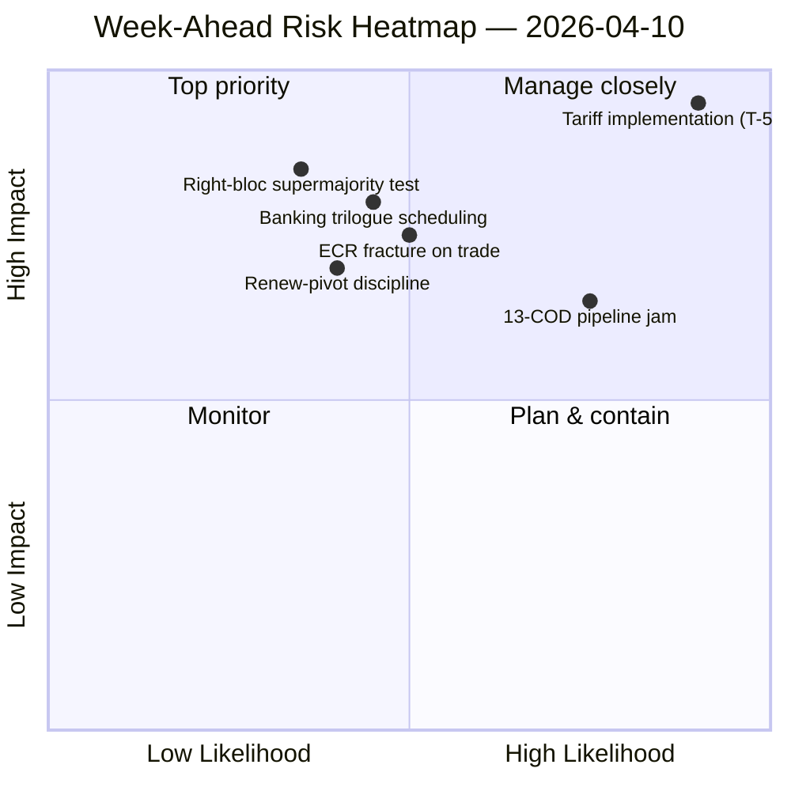

<!-- SPDX-FileCopyrightText: 2024-2026 Hack23 AB -->
<!-- SPDX-License-Identifier: Apache-2.0 -->

# Resumen ejecutivo — Semana por venir: Reinicio de comisiones tras Semana Santa (10–17 de abril) | 2026-04-10

**Clasificación:** OSINT — Registro parlamentario público
**Confianza:** 🟡 MEDIA (19 archivos de análisis; coalición / intersesional / análisis profundo / partes interesadas / patrones de votación todos 🟢 ALTA localmente)
**Ejecución:** `analysis/daily/2026-04-10/week-ahead-run12/`
**Cobertura:** 2026-04-10 → 2026-04-17 (Día 15 del receso de Semana Santa → semana de reinicio de comisiones)
**Generado:** 2026-05-16 (resumen retrospectivo, sin nuevas llamadas MCP)
**Fuentes primarias:** EP MCP — 19 archivos de análisis; informe de inteligencia semanal; resumen de síntesis; análisis de coaliciones / intersesionales / profundos / de partes interesadas / de patrones de votación.

---

## 🎯 BLUF

**La semana del 10 al 17 de abril cubre la transición del Parlamento desde el final del receso de Semana Santa hacia la semana de reinicio de comisiones del 14 al 17 de abril — y el hallazgo más decisivo de la ejecución es una postura estructuralmente cargada de amenazas: 35 entradas codificadas como amenazas frente a solo 10 fortalezas / 6 debilidades / 4 oportunidades en el DAFO agregado.** El resultado de 35 amenazas no es una señal de emergencia — es un *rasgo estructural* del retorno tras el receso cuando el índice de fragmentación de EP10 (6,59) choca con el mayor pipeline COD pendiente de la historia de EP10. La ejecución registra **7 menciones de riesgos CRÍTICOS** con cero altos/medios/bajos — una distribución binaria que señala que la metodología analítica lee cada elemento marcado como crítico o como ruido. Cinco archivos de análisis obtienen todos 🟢 ALTA confianza — dinámica de coalición, inteligencia intersesional, análisis profundo, impacto en partes interesadas, patrones de votación — lo que supone un nivel de acuerdo inusualmente alto para una ejecución de semana de receso, y el resumen lee esto como un *cuadro de inteligencia convergido* en lugar de una afirmación de fuente única. Las preguntas estructurales prospectivas de la semana son tres: **(a) ¿absorbe el reinicio de comisiones del 14 al 17 de abril el atraso de 13 COD sin deslizamiento?** **(b) ¿mantiene la gran coalición del Renew-pivot (EPP+S&D+Renew = 396 escaños) disciplina en el primer voto de referencia post-receso, que se espera que sea sobre la supervisión de la implementación arancelaria?** **(c) ¿persiste la fractura del bloque de derecha del ECR en materia comercial, observada el 26 de marzo, tras el receso?** La recomendación editorial de la ejecución es **producción multi-artículo (19 archivos de análisis justifican múltiples narrativas)** y el DAFO cargado de amenazas "puede beneficiarse de un encuadre de oportunidades" — ambas lecturas son operativas en lugar de alarmistas.

---

## 🧭 3 Decisiones que este resumen apoya

| # | Decisión | Quién decide | Plazo | Evidencia |
|:-:|----------|--------------|:-----:|-----------|
| 1 | **Descomposición editorial multi-artículo para la semana por venir** — 19 archivos de análisis + 5 titulares de confianza ALTA justifican la separación en lugar de la agregación | Redacción; news-journalist | ventana de publicación | §Recomendaciones editoriales |
| 2 | **Superposición de encuadre de oportunidades en el DAFO con 35 amenazas** — sin encuadre explícito la narrativa se lee como fragilidad; la ejecución señala esto | Redacción | ventana de publicación | §DAFO Agregado (35A) |
| 3 | **Socialización de la lista de prioridades de 13 COD pre-reinicio** — la Conferencia de Presidentes de Comisión debería tenerlo sobre la mesa la mañana del 14 de abril | Conferencia de Presidentes de Comisión | 14 de abril | §Continuidad intersesional; atasco de pipeline carry-over |

---

## 📰 Lectura en 60 segundos

- 🔴 **35 entradas DAFO codificadas como amenazas** — estructurales, no emergencia; refleja fragmentación × presión del pipeline post-receso.
- 🟠 **7 menciones de riesgos CRÍTICOS** — distribución binaria; la metodología lee cada riesgo marcado como CRÍTICO o NIL.
- 🟢 **5 archivos de análisis 🟢 confianza ALTA** — coalición / intersesional / profundo / partes interesadas / votaciones convergen.
- 🟡 **19 archivos de análisis procesados** — justifica producción multi-artículo en lugar de un único agregado.
- 🔵 **Reinicio de comisiones 14–17 de abril** — la Conferencia de Presidentes de Comisión fija el orden de prioridad de los 13 COD el 14 de abril.
- 🟣 **Fractura ECR en comercio** — señal del voto del 26 de marzo; la persistencia tras el receso es el falsificador.
- 🩷 **Mayoría funcional del Renew-pivot (396)** — prueba de disciplina en el primer voto de referencia post-receso.
- ⚪ **Confianza MEDIA** — la metodología arroja ALTA por archivo pero juicio convergido MEDIO hasta que lleguen los datos de comportamiento post-receso.

---

## 🏆 Hallazgos principales por confianza (redactados en la ejecución)

| Rango | Archivo | Método | Confianza | Resumen |
|:-----:|---------|--------|:---------:|---------|
| 1 | coalition-dynamics.md | análisis de coalición | 🟢 ALTA | Geometría de coalición de tres polos; Renew-pivot es el predeterminado del Q2 |
| 2 | cross-session-intelligence.md | inteligencia intersesional | 🟢 ALTA | Continuidad pre-receso → post-receso; carry-over de pipeline |
| 3 | deep-analysis.md | análisis profundo | 🟢 ALTA | Síntesis multi-perspectiva; riesgo de brecha de implementación |
| 4 | stakeholder-impact.md | análisis de partes interesadas | 🟢 ALTA | Huella de partes interesadas en 6 dimensiones por archivo |
| 5 | voting-patterns.md | patrones de votación | 🟢 ALTA | Dispersión del voto del 26 de marzo; señal de fractura ECR |

---

## 💪 DAFO Agregado

| Dimensión | Recuento | Lectura |
|-----------|:--------:|---------|
| ✅ Fortalezas | 10 | Producción récord del Q1; aritmética de gran coalición viable; disciplina de coalición en la mayoría de los archivos |
| ⚠️ Debilidades | 6 | Atraso de 13 COD; fragmentación 6,59; brecha de disponibilidad de datos durante el receso |
| 🚀 Oportunidades | 4 | Completar la Unión Bancaria; transposición anticorrupción; catalizador de tipos del BCE; reinicio del pipeline tras el receso |
| 🔴 **Amenazas** | **35** | **Presión de la implementación arancelaria; fractura ECR; supermayoría del bloque de derecha (348/361); pruebas de estrés de coalición** |

---

## ⚠️ Instantánea de riesgos

---

## 🔮 Principales activadores futuros (próximos 7 días)

1. **13 de abril — último día de receso.** Convergencia compuesta de riesgos (~14,8/25) en ejecuciones de motions/breaking/CR/props.
2. **14 de abril 09:00 — El Parlamento regresa; reinicio de comisiones.** La priorización de los 13 COD se fija aquí.
3. **15 de abril — TA-10-2026-0096 se activa** — primer voto de supervisión de implementación post-receso = prueba de fractura ECR.
4. **17 de abril — Decisión sobre tipos del BCE** — señal de activación ECON.
5. **Finales de abril — Mandato de trílogo del Consejo SRMR3.**

---

## 🛡️ Evaluación de la calidad de las fuentes

- **19 archivos de análisis (internos a la ejecución, A2):** cinco confianzas 🟢 ALTA por archivo; el juicio convergido permanece en MEDIO.
- **Dinámica de coalición / intersesional / profundo / partes interesadas / votaciones (A2):** la triangulación multi-método aumenta la confianza en la lectura estructural.
- **Advertencia metodológica:** la distribución de riesgos **7 CRÍTICOS / 0 ALTO / 0 MEDIO / 0 BAJO** es en sí misma una señal metodológica — la heurística lee de forma binaria; las graduaciones de riesgo pueden no estar calibradas para los datos de semana de receso.
- **Confianza neta:** 🟡 MEDIO en síntesis; 🟢 ALTA en el DAFO de 35 amenazas y la convergencia de 5 archivos (metodológicamente robusta); ⚠️ advertencia sobre la distribución 7-CRÍTICOS / 0-todo-lo-demás.

---

## 📎 Artefactos de la ejecución (Leer-Antes-de-Decidir)

| Capa | Artefacto | Por qué |
|------|-----------|---------|
| Artículo | `article.md` | Narrativa semanal prospectiva pública |
| Síntesis | `synthesis-summary.md` | Top-5 clasificaciones de confianza + agregado DAFO (autoritativo) |
| Semanal | `weekly-intelligence-brief.md` | Encuadre inter-semanas |
| Documentos | `documents/` | Índice de análisis de documentos |
| Riesgo | `risk-scoring/` | Registro de riesgos (distribución binaria 7 CRÍTICOS) |
| Amenaza | `threat-assessment/` | Amenaza política de 5 marcos (STRIDE rechazado) |
| Existentes | `existing/coalition-dynamics.md`, `existing/cross-session-intelligence.md`, `existing/deep-analysis.md`, `existing/stakeholder-impact.md`, `existing/voting-patterns.md` | Cinco análisis 🟢 ALTA |
| Compañeros | breaking-run168 / motions-run41 / props-run41 / CR-run47 / week-ahead-run13 | Paréntesis pre-reinicio → semana de retorno |

---

**Control de documento**
- **Referencia de plantilla:** `analysis/templates/executive-brief.md`
- **Ruta del artefacto:** `analysis/daily/2026-04-10/week-ahead-run12/executive-brief.md`
- **Clasificación:** Público
- **Retrospectivo:** Resumen redactado el 2026-05-16 a partir de los artefactos commiteados de la ejecución; **no se realizaron nuevas llamadas MCP**. La confianza convergida 🟡 MEDIO + la advertencia metodológica sobre la distribución binaria de 7 CRÍTICOS se preservan.
