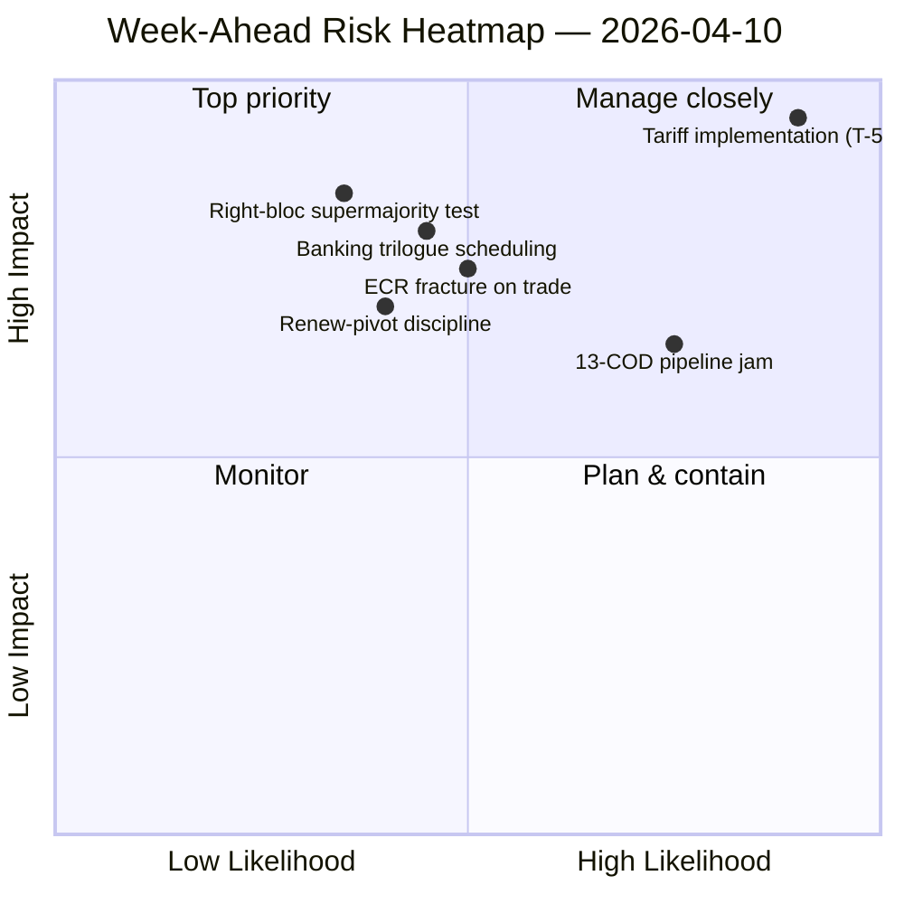

<!-- SPDX-FileCopyrightText: 2024-2026 Hack23 AB -->
<!-- SPDX-License-Identifier: Apache-2.0 -->

# Johtoryhmän yhteenveto — Tuleva viikko: Valiokuntien uudelleenkäynnistys pääsiäisen jälkeen (10.–17. huhtikuuta) | 2026-04-10

**Luokitus:** OSINT — Julkinen parlamentaarinen asiakirja
**Luotettavuus:** 🟡 KESKITASO (19 analyysiä; koalitio / ristiistunto / syvyysanalyysi / sidosryhmä / äänestysanalyysi kaikki 🟢 KORKEA paikallisesti)
**Ajo:** `analysis/daily/2026-04-10/week-ahead-run12/`
**Kattavuus:** 2026-04-10 → 2026-04-17 (pääsiäisloman 15. päivä → valiokunnan uudelleenkäynnistysviikko)
**Luotu:** 2026-05-16 (retrospektiivinen yhteenveto, ei uusia MCP-kutsuja)
**Ensisijaiset lähteet:** EP MCP — 19 analyysiä; viikoittainen tiedusteluyhteenveto; synteesiyhteenveto; koalitio- / ristiistunto- / syvyys- / sidosryhmä- / äänestysanalyysit.

---

## 🎯 BLUF

**Viikko 10.–17. huhtikuuta kattaa parlamentin siirtymän pääsiäisloman lopusta 14.–17. huhtikuun valiokunnan uudelleenkäynnistysviikkoon — ja ajon merkittävin havainto on rakenteellisesti uhkakuormainen asento: 35 uhkaluokiteltua kohtaa vastaan vain 10 vahvuutta / 6 heikkoutta / 4 mahdollisuutta aggregoidussa SWOT-analyysissä.** 35-uhkan tulos ei ole hätäsignaali — se on *rakenteellinen piirre* loman jälkeisessä paluussa, kun EP10:n pirstoutumisindeksi (6,59) törmää EP10:n historian suurimpaan vireillä olevaan COD-putkistoon. Ajo kirjaa **7 KRIITTISTÄ riskimainintaa** nollalla korkea/keskitaso/matala — binäärinen jakautuma, joka signaloi, että analyyttinen metodologia lukee jokaisen merkityn kohteen joko kriittisenä tai kohinana. Viisi analyysiä saavuttaa kaikki 🟢 KORKEA luotettavuuden — koalitiodynamiikka, ristiistuntotiedustelu, syvyysanalyysi, sidosryhmävaikutus, äänestysanalyysit — mikä on epätavallisen korkea yksimielisyys lomaviikolle, ja yhteenveto lukee tämän *konvergoituneena tiedustelukuvana* eikä yksittäisen lähteen väittämänä. Viikon eteenpäin suuntautuvat rakenteelliset kysymykset ovat kolme: **(a) absorboiko valiokunnan uudelleenkäynnistys 14.–17. huhtikuuta 13 COD-myöhästymistä ilman viivästyksiä?** **(b) pitääkö Renew-pivot-suurkoalitio (EPP+S&D+Renew = 396 paikkaa) kuria ensimmäisessä loman jälkeisessä lippuäänestuksessä, jota odotetaan tullitariffin täytäntöönpanovalvonnasta?** **(c) jatkuuko ECR:n oikean blokin murtuma kaupan osalta, joka havaittiin 26. maaliskuuta, loman jälkeen?** Ajon toimituksellinen suositus on **moniartikelituotos (19 analyysiä oikeuttavat useita kertomuksia)** ja uhkakuormainen SWOT "voi hyötyä mahdollisuuskehyksestä" — molemmat lukemat ovat operatiivisia eivätkä hälyttäviä.

---

## 🧭 3 Päätöstä, joita tämä yhteenveto tukee

| # | Päätös | Kuka päättää | Määräaika | Todisteet |
|:-:|--------|--------------|:---------:|-----------|
| 1 | **Moniartikelinen toimituksellinen hajoaminen tulevia viikkoja varten** — 19 analyysiä + 5 KORKEA-luotettavuus otsikot oikeuttavat erottelun eikä aggregoinnin | Toimituskunta; news-journalist | julkaisuikkuna | §Toimitukselliset suositukset |
| 2 | **Mahdollisuuskehyksen lisäys 35-uhkan SWOT:iin** — ilman eksplisiittistä kehystystä kertomus luetaan haurautena; ajo merkitsee tämän | Toimituskunta | julkaisuikkuna | §SWOT Aggregoitu (35U) |
| 3 | **Uudelleenkäynnistystä edeltävä 13-COD-prioriteettiluettelon sosialisointi** — Valiokunnanpuheenjohtajien konferenssin tulisi pitää tämä esillä 14. huhtikuuta aamulla | Valiokunnanpuheenjohtajien konferenssi | 14. huhtikuuta | §Ristiistuntojatkuvuus; putkiston jumittumisen siirto |

---

## 📰 60 sekunnin luku

- 🔴 **35 uhkaluokiteltua SWOT-kohdetta** — rakenteellisia, ei hätätilanne; kuvastaa pirstoutumista × loman jälkeistä putkistopainetta.
- 🟠 **7 KRIITTISTÄ riskimainintaa** — binäärinen jakautuma; metodologia lukee jokaisen merkityn riskin KRIITTISENÄ tai NIL.
- 🟢 **5 analyysiä 🟢 KORKEA luotettavuus** — koalitio / ristiistunto / syvyys / sidosryhmät / äänestykset konvergoivat.
- 🟡 **19 analyysiä käsitelty** — oikeuttaa moniartikelituotoksen eikä yksittäisen aggregaatin.
- 🔵 **Valiokunnan uudelleenkäynnistys 14.–17. huhtikuuta** — Valiokunnanpuheenjohtajien konferenssi asettaa 13-COD prioriteettijärjestyksen 14. huhtikuuta.
- 🟣 **ECR-murtuma kaupassa** — äänestysmerkki 26. maaliskuuta; jatkuminen loman jälkeen on falsifikaattori.
- 🩷 **Renew-pivot toimiva enemmistö (396)** — kuritesti ensimmäisessä loman jälkeisessä lippuäänestyssessä.
- ⚪ **Luotettavuus KESKITASO** — metodologia antaa KORKEAN per tiedosto mutta konvergoitunut arviointi KESKITASOLLA, kunnes loman jälkeiset käyttäytymistiedot saapuvat.

---

## 🏆 Parhaat havainnot luotettavuuden mukaan (ajon kirjoittama)

| Sijoitus | Tiedosto | Menetelmä | Luotettavuus | Yhteenveto |
|:--------:|----------|-----------|:------------:|------------|
| 1 | coalition-dynamics.md | koalitioanalyysi | 🟢 KORKEA | Kolmenapainen koalitiogeometria; Renew-pivot on Q2-oletus |
| 2 | cross-session-intelligence.md | ristiistuntotiedustelu | 🟢 KORKEA | Loma-ennen → loma-jälkeen jatkuvuus; putkiston siirto |
| 3 | deep-analysis.md | syvyysanalyysi | 🟢 KORKEA | Moniulotteinen synteesi; toteutuskuilu-riski |
| 4 | stakeholder-impact.md | sidosryhmäanalyysi | 🟢 KORKEA | 6-ulotteinen sidosryhmäjalanjälki per tiedosto |
| 5 | voting-patterns.md | äänestysanalyysit | 🟢 KORKEA | 26. maaliskuuta äänestyshajonta; ECR-murtumamerkki |

---

## 💪 SWOT Aggregoitu

| Ulottuvuus | Lukumäärä | Luenta |
|------------|:---------:|--------|
| ✅ Vahvuudet | 10 | Ennätyksellinen Q1-tuotos; suurkoalitionaritmetiikka elinkelpoisessa; koalitiokuri useimmissa tiedostoissa |
| ⚠️ Heikkoudet | 6 | 13-COD myöhästyminen; pirstoutuminen 6,59; tietojen saatavuuden aukko loman aikana |
| 🚀 Mahdollisuudet | 4 | Pankkiunionin valmistuminen; korruptionvastainen täytäntöönpano; EKP-korkokatalysaattori; putkiston uudelleenkäynnistys loman jälkeen |
| 🔴 **Uhat** | **35** | **Tullitariffin täytäntöönpanopaine; ECR-murtuma; oikean blokin supermajoriteetti (348/361); koalitiosstressitesti** |

---

## ⚠️ Riskihetki

---

## 🔮 Parhaita Tulevia Laukaisijoita (seuraavat 7 päivää)

1. **13. huhtikuuta — viimeinen lomapäivä.** Yhdistetty riskikonvergenssi (~14,8/25) motions/breaking/CR/props-ajoissa.
2. **14. huhtikuuta 09:00 — Parlamentti palaa; valiokunnan uudelleenkäynnistys.** 13-COD priorisointi asetetaan tässä.
3. **15. huhtikuuta — TA-10-2026-0096 aktivoituu** — ensimmäinen loman jälkeinen täytäntöönpanovalvontaäänestys = ECR-murtumakoe.
4. **17. huhtikuuta — EKP:n korkoratkaisu** — ECON-aktivointisignaali.
5. **Myöhäinen huhtikuu — SRMR3 neuvoston trilogimandaatti.**

---

## 🛡️ Lähteen laadun arviointi

- **19 analyysiä (ajo-sisäinen, A2):** viisi 🟢 KORKEA per-tiedosto-luotettavuutta; konvergoitunut arviointi pysyy KESKITASOLLA.
- **Koalitiodynamiikka / ristiistunto / syvyys / sidosryhmät / äänestykset (A2):** monimenetelmä-triangulaatio lisää luotettavuutta rakenteellisessa luennassa.
- **Metodologinen varaus:** **7 KRIITTISTÄ / 0 KORKEA / 0 KESKITASO / 0 MATALA** riskijakautuma on itsessään metodologinen signaali — heuristiikka lukee binäärisesti; riskikalibrointi ei välttämättä ole kalibroitu lomaviikolle.
- **Nettoluotettavuus:** 🟡 KESKITASO synteesille; 🟢 KORKEA 35-uhkan SWOT:ille ja 5-tiedoston konvergenssia varten (metodologisesti vahva); ⚠️ varaus 7-KRIITTINEN / 0-kaikki-muu jakautumalle.

---

## 📎 Ajon artefaktit (Lue-Ennen-Päätöstä)

| Kerros | Artefakti | Miksi |
|--------|-----------|-------|
| Artikkeli | `article.md` | Julkinen eteenpäin katsova viikkokertomus |
| Synteesi | `synthesis-summary.md` | Top-5 luotettavuusrankaukset + SWOT-aggregaatti (auktoritatiivinen) |
| Viikoittainen | `weekly-intelligence-brief.md` | Poikkiviikkokehys |
| Asiakirjat | `documents/` | Asiakirja-analyysiindeksi |
| Riski | `risk-scoring/` | Riskikirjasto (7 KRIITTISTÄ binäärinen jakautuma) |
| Uhka | `threat-assessment/` | 5-kehys poliittinen uhka (STRIDE hylätty) |
| Olemassa olevat | `existing/coalition-dynamics.md`, `existing/cross-session-intelligence.md`, `existing/deep-analysis.md`, `existing/stakeholder-impact.md`, `existing/voting-patterns.md` | Viisi 🟢 KORKEA analyysiä |
| Kumppanit | breaking-run168 / motions-run41 / props-run41 / CR-run47 / week-ahead-run13 | Pre-uudelleenkäynnistys → paluuviikko-sulkeet |

---

**Asiakirjavalvonta**
- **Mallitiedostoviite:** `analysis/templates/executive-brief.md`
- **Artefaktipolu:** `analysis/daily/2026-04-10/week-ahead-run12/executive-brief.md`
- **Luokitus:** Julkinen
- **Retrospektiivinen:** Yhteenveto kirjoitettu 2026-05-16 ajon committatuista artefakteista; **uusia MCP-kutsuja ei tehty**. 🟡 KESKITASO-konvergoitunut luotettavuus + metodologinen varaus 7-KRIITTISELLE binääriselle jakautumalle säilytetään.
